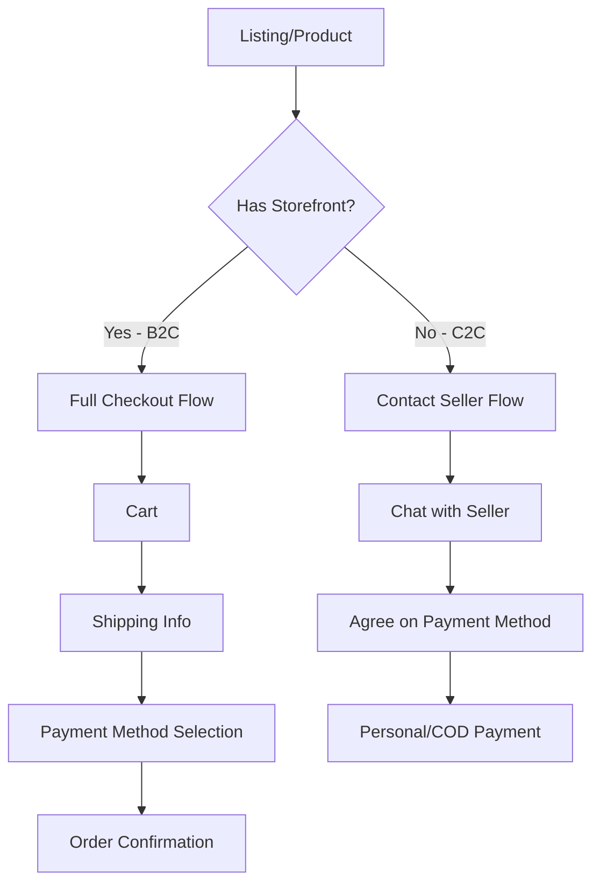

# 💳 Стратегия платежей для C2C и B2C

## 🔄 Разделение логики платежей

### C2C (Customer-to-Customer) - Обычные объявления
**Доступные способы оплаты:**
- 🤝 **Личная встреча** (наличные/перевод при встрече)
- 📦 **Наложенный платеж** (через транспортную компанию)
- ❌ **Оплата картой на сайте** - НЕ ДОСТУПНА

### B2C (Business-to-Customer) - Витрины (Storefronts)
**Доступные способы оплаты:**
- 💳 **Оплата картой** (после интеграции с PaySpot/AllSecure)
- 🏦 **Банковский перевод**
- 📦 **Наложенный платеж**
- 🤝 **Оплата при получении**
- 💰 **Рассрочка/кредит** (в будущем)

## 🏗️ Архитектура разделения



## 📱 UI/UX изменения

### 1. Страница товара (Marketplace Listing)

```typescript
// components/marketplace/listing/ListingActions.tsx

const ListingActions = ({ listing }) => {
  const isStorefrontProduct = listing.storefront_id != null;
  
  if (isStorefrontProduct) {
    return (
      <>
        <AddToCartButton product={listing} />
        <BuyNowButton product={listing} />
        <ChatButton seller={listing.user} />
      </>
    );
  }
  
  // C2C - только чат
  return (
    <>
      <ChatButton 
        seller={listing.user}
        primaryAction={true}
        text="Связаться с продавцом" 
      />
      <SaveListingButton listing={listing} />
    </>
  );
};
```

### 2. Чат для C2C с подсказками

```typescript
// components/chat/C2CPaymentHints.tsx

const C2CPaymentHints = ({ listing }) => {
  return (
    <div className="alert alert-info mb-4">
      <div className="flex">
        <svg className="w-6 h-6 mr-2" />
        <div>
          <h4 className="font-bold">Способы оплаты</h4>
          <ul className="text-sm mt-2">
            <li>✓ Наличные при личной встрече</li>
            <li>✓ Перевод на карту (договоритесь с продавцом)</li>
            <li>✓ Наложенный платеж (если продавец отправляет)</li>
          </ul>
          <p className="text-xs mt-2 opacity-80">
            Платформа не участвует в C2C транзакциях
          </p>
        </div>
      </div>
    </div>
  );
};
```

### 3. Фильтры поиска

```typescript
// components/marketplace/SearchFilters.tsx

const SearchFilters = () => {
  return (
    <div className="filters">
      {/* Новый фильтр */}
      <div className="form-control">
        <label className="label">
          <span>Тип продавца</span>
        </label>
        <select className="select">
          <option value="all">Все объявления</option>
          <option value="private">Частные (C2C)</option>
          <option value="business">Магазины (B2C)</option>
        </select>
      </div>
      
      {/* Способ получения */}
      <div className="form-control">
        <label className="label">
          <span>Способ получения</span>
        </label>
        <div className="space-y-2">
          <label className="cursor-pointer flex items-center">
            <input type="checkbox" className="checkbox" />
            <span className="ml-2">Личная встреча</span>
          </label>
          <label className="cursor-pointer flex items-center">
            <input type="checkbox" className="checkbox" />
            <span className="ml-2">Доставка</span>
          </label>
          <label className="cursor-pointer flex items-center">
            <input type="checkbox" className="checkbox" />
            <span className="ml-2">Самовывоз из магазина</span>
          </label>
        </div>
      </div>
    </div>
  );
};
```

## 🔧 Backend изменения

### 1. Order Service для C2C

```go
// internal/proj/marketplace/service/c2c_transaction_service.go

type C2CTransaction struct {
    ID              int64
    ListingID       int64
    BuyerID         int64
    SellerID        int64
    AgreedPrice     decimal.Decimal
    PaymentMethod   string // "cash", "bank_transfer", "cod"
    DeliveryMethod  string // "personal", "shipping"
    Status          string // "negotiating", "agreed", "completed", "cancelled"
    ChatThreadID    int64
    CompletedAt     *time.Time
}

// Сервис для отслеживания C2C сделок (без платежей)
type C2CTransactionService struct {
    repo C2CTransactionRepository
}

func (s *C2CTransactionService) CreateTransaction(ctx context.Context, req *CreateC2CTransactionRequest) (*C2CTransaction, error) {
    // Создаем запись о намерении купить
    // Это поможет в статистике и защите от мошенников
}

func (s *C2CTransactionService) MarkAsCompleted(ctx context.Context, transactionID int64, buyerConfirm bool) error {
    // Подтверждение сделки обеими сторонами
    // Влияет на рейтинг продавца
}
```

### 2. Модификация Checkout API

```go
// internal/proj/orders/handler/order_handler.go

func (h *OrderHandler) CreateOrder(c *fiber.Ctx) error {
    var req CreateOrderRequest
    
    // Проверяем тип продавца
    storefront, err := h.storefrontRepo.GetByID(req.StorefrontID)
    if err != nil {
        // Это C2C листинг - редирект на другой флоу
        return c.Status(400).JSON(fiber.Map{
            "error": "C2C listings cannot be purchased online. Please contact seller.",
            "redirect": fmt.Sprintf("/chat?listing_id=%d", req.Items[0].ProductID),
        })
    }
    
    // B2C - продолжаем обычный checkout
    // ...
}
```

### 3. Payment Method Validation

```go
// internal/proj/payments/service/payment_service.go

func (s *PaymentService) ValidatePaymentMethod(
    ctx context.Context, 
    method string, 
    sellerType string,
) error {
    if sellerType == "c2c" {
        allowedMethods := []string{"cash", "bank_transfer", "cod"}
        if !contains(allowedMethods, method) {
            return errors.New("online payment not available for C2C")
        }
    }
    return nil
}
```

## 📊 Статистика и безопасность для C2C

### 1. Trust Score для C2C продавцов

```sql
-- migrations/000178_c2c_trust_metrics.up.sql

CREATE TABLE c2c_seller_metrics (
    user_id INT PRIMARY KEY REFERENCES users(id),
    total_transactions INT DEFAULT 0,
    completed_transactions INT DEFAULT 0,
    cancelled_by_seller INT DEFAULT 0,
    cancelled_by_buyer INT DEFAULT 0,
    avg_response_time INTERVAL,
    preferred_payment_methods TEXT[],
    verified_phone BOOLEAN DEFAULT FALSE,
    verified_email BOOLEAN DEFAULT TRUE,
    trust_score DECIMAL(3,2), -- 0.00 to 5.00
    last_calculated_at TIMESTAMP DEFAULT NOW()
);

-- Индексы для быстрого поиска надежных продавцов
CREATE INDEX idx_trust_score ON c2c_seller_metrics(trust_score DESC);
```

### 2. UI индикаторы доверия

```typescript
// components/marketplace/SellerTrustBadges.tsx

const SellerTrustBadges = ({ seller }) => {
  return (
    <div className="flex gap-2 flex-wrap">
      {seller.verified_phone && (
        <span className="badge badge-success badge-sm">
          ✓ Телефон подтвержден
        </span>
      )}
      
      {seller.completed_transactions > 10 && (
        <span className="badge badge-info badge-sm">
          {seller.completed_transactions} успешных сделок
        </span>
      )}
      
      {seller.avg_response_time < '1 hour' && (
        <span className="badge badge-warning badge-sm">
          Быстрый ответ
        </span>
      )}
      
      {seller.trust_score >= 4.5 && (
        <span className="badge badge-primary badge-sm">
          ⭐ Надежный продавец
        </span>
      )}
    </div>
  );
};
```

## 🚀 Поэтапный запуск

### Phase 1: C2C улучшения (1 неделя)
- [ ] Trust badges для продавцов
- [ ] Payment hints в чате
- [ ] C2C transaction tracking
- [ ] Фильтр по типу продавца

### Phase 2: B2C базовый checkout (2 недели)
- [ ] Корзина только для B2C
- [ ] Checkout с COD опцией
- [ ] Email уведомления
- [ ] Order tracking

### Phase 3: B2C расширенный (после контрактов)
- [ ] Интеграция PaySpot/AllSecure
- [ ] Сохранение карт
- [ ] Автоматические платежи
- [ ] Возвраты и отмены

## 📱 Mobile App специфика

Для мобильного приложения (в будущем):
- **C2C**: Deep links в мессенджеры (WhatsApp, Telegram)
- **B2C**: Native payment SDKs
- **Общее**: Push уведомления о статусе

## 🔒 Безопасность

### C2C риски и митигация:
1. **Мошенничество**
   - Система жалоб и блокировок
   - Escrow через партнеров (опционально)
   - Верификация продавцов

2. **Споры**
   - История чата сохраняется
   - Модерация при жалобах
   - Рейтинговая система

### B2C безопасность:
1. **PCI DSS** compliance
2. **3D Secure** для карт
3. **Fraud detection** система
4. **Chargeback** protection

## 📈 Метрики успеха

### C2C метрики:
- Конверсия "просмотр → контакт": > 15%
- Завершенные сделки: > 60% от начатых
- Повторные сделки: > 30%

### B2C метрики:
- Cart abandonment: < 70%
- Checkout completion: > 35%
- Payment success rate: > 95%
- Return rate: < 10%