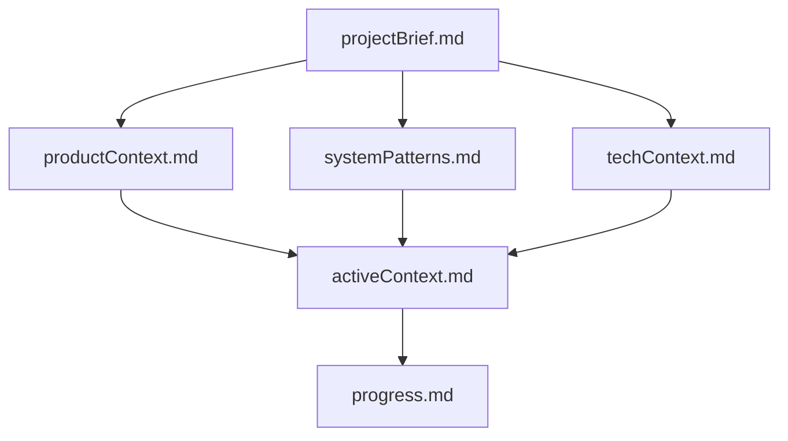

# CLAUDE.md

This file provides guidance to Claude Code (claude.ai/code) when working with code in this repository.

## Проект: Sve Tu Platform - Marketplace

### Краткое описание проекта

Этот проект — маркетплейс для продажи товаров (новых и БУ), аналог Авито. Платформа предназначена для размещения объявлений, поиска, покупки и продажи товаров между частными лицами и компаниями. Основная цель — создать удобную, безопасную и масштабируемую экосистему для продавцов и покупателей.

#### Основные требования и цели

- Централизованное хранение и обработка данных о товарах, пользователях, сделках и платежах
- Интеграция с внешними сервисами (оплата, доставка, уведомления)
- Высокая производительность и отказоустойчивость
- Гибкая архитектура для расширения функциональности
- Безопасность пользовательских данных и сделок
- Удобный пользовательский и административный интерфейс

### Контекст продукта

#### Зачем существует проект
Проект создан для упрощения покупки и продажи товаров (новых и БУ) между частными лицами и компаниями, предоставляя единую платформу для размещения объявлений, поиска, коммуникации и совершения сделок.

#### Ключевые особенности, выделяющие проект среди конкурентов
- Удобный поиск по атрибутам товаров (фильтрация по характеристикам, категориям, состоянию и т.д.)
- Автоматический перевод объявлений и интерфейса на несколько языков
- Поиск на разных языках благодаря структурированным атрибутам (независимость от языка ввода)
- Удобный поиск по карте (геолокация, отображение объявлений на карте, фильтрация по району)

#### Проблемы, которые решает
- Сложность поиска и покупки/продажи товаров на локальном рынке
- Отсутствие единого пространства для безопасных сделок между частными лицами
- Неэффективная коммуникация между продавцами и покупателями
- Необходимость интеграции с сервисами оплаты и доставки

#### Как должен работать продукт
- Пользователь может быстро разместить объявление, найти нужный товар, связаться с продавцом и совершить покупку
- Продавец управляет своими объявлениями, сделками и финансами через удобный интерфейс
- Все процессы автоматизированы и прозрачны, поддерживается безопасная оплата и доставка

#### Цели пользовательского опыта
- Минимум шагов для размещения и поиска объявлений
- Прозрачность и безопасность сделок
- Поддержка нескольких языков и регионов
- Интуитивно понятный интерфейс 

### Технологический контекст

#### Используемые технологии
- Backend: Go, PostgreSQL, MinIO, OpenSearch
- Frontend: Next.js, React, TypeScript
- Docker, docker-compose для контейнеризации
- Nginx для проксирования

#### Окружение разработки
- Локальная разработка через docker-compose
- Использование Makefile и shell-скриптов для автоматизации
- CI/CD через GitHub Actions

#### Технические ограничения
- Необходимость поддержки нескольких языков
- Высокие требования к безопасности данных
- Масштабируемость и отказоустойчивость

#### Зависимости
- Внешние API: платёжные системы, геокодинг, карты
- Внутренние библиотеки: логирование, утилиты 

## Команды разработки

### Backend (Go)
```bash
# Сборка
cd backend && go build -o main ./cmd/api

# Запуск с горячей перезагрузкой
cd backend && air

# Тесты
cd backend && go test ./...

# Миграции базы данных
cd backend && migrate -path ./migrations -database "postgresql://..." up
```

### Frontend (React)

Это старая версия фронтенда. Мы отказываемся от нее. Но там реализована вся нужная логика работы фронта. 

```bash
# Установка зависимостей
cd frontend/hostel-frontend && npm install

# Разработка
cd frontend/hostel-frontend && npm start

# Сборка
cd frontend/hostel-frontend && npm run build

# Тесты
cd frontend/hostel-frontend && npm test
```

### Frontend (Next.js) - новая версия

Это старая версия фронтенда. Сюда мы переносим логику из старой версии.

```bash
# Установка зависимостей
cd frontend/svetu && yarn

# Линтер
cd frontend/svetu && yarn lint

# Сборка
cd frontend/svetu && yarn build

# Разработка
cd frontend/svetu && PORT=3020 yarn dev
```

### Docker
```bash
# Локальная разработка
docker-compose up -d
```

## Деплой

Выполняется через Github Actions

## Архитектура

### Backend структура
```
backend/
├── cmd/api/          # Точка входа приложения
├── internal/
│   ├── config/       # Конфигурация
│   ├── domain/       # Доменные модели
│   ├── middleware/   # Auth, CORS, Logger
│   ├── proj/         # Бизнес-логика модулей
│   │   ├── marketplace/
│   │   ├── users/
│   │   ├── payments/
│   │   └── ...
│   ├── server/       # HTTP сервер (Fiber)
│   └── storage/      # Репозитории
│       ├── postgres/
│       ├── opensearch/
│       └── minio/
└── migrations/       # SQL миграции
```

### Сервисы инфраструктуры
- **PostgreSQL** - основная база данных
- **OpenSearch** - полнотекстовый поиск
- **MinIO** - S3-совместимое хранилище изображений
- **Nginx** - обратный прокси и статика
- **Harbor** - приватный Docker registry

### API структура
```
/api/v1/
├── auth/         # Аутентификация и регистрация
├── marketplace/  # Объявления и категории
├── users/        # Профили пользователей
├── reviews/      # Система отзывов
├── storefronts/  # Витрины магазинов
├── chats/        # Чаты между пользователями
├── balance/      # Баланс и транзакции
└── admin/        # Административная панель
```

## Конфигурация

### Переменные окружения
- Backend: `.env` в корне backend/
- Frontend React: `frontend/hostel-frontend/public/env.js`
- Frontend Next.js: `frontend/svetu/.env.local`

### Важные файлы конфигурации
- `docker-compose.yml` - локальная разработка
- `backend/categories.yaml` - структура категорий маркетплейса

## База данных

### Основные таблицы
- `users` - пользователи и аутентификация
- `marketplace_listings` - объявления
- `marketplace_categories` - категории с атрибутами
- `translations` - мультиязычные переводы
- `marketplace_images` - изображения объявлений
- `marketplace_chats` - чаты и сообщения
TODO: Нужно доработать

### Работа с миграциями

TODO: Нужно доработать


## Полезные команды

### Логи и отладка

```bash
# Просмотр логов всех сервисов
docker-compose logs -f

# Логи конкретного сервиса
docker-compose logs -f backend

# Доступ к БД
docker-compose exec db psql -U postgres -d marketplace_db
```

### Harbor Registry

```bash
# Авторизация
docker login -u <harbor_user> -p <harbor_user> harbor.svetu.rs

# Загрузка образа
docker push harbor.svetu.rs/svetu/backend/api:latest
```

### Управление сервером
TODO: Требуется доработать

## Memory bank

### Структура банка памяти

Банк памяти состоит из обязательных основных файлов и дополнительных контекстных файлов, все в формате Markdown. Файлы построены друг на друге в четкой иерархии:




#### Основные файлы (обязательные)
1. `projectBrief.md`
    - Базовый документ, который формирует все остальные файлы.
    - Создается в начале проекта, если он не существует.
    - Определяет основные требования и цели.
    - Источник достоверной информации о масштабах проекта.

2. `productContext.md`
    - Почему существует этот проект
    - Проблемы, которые он решает
    - Как он должен работать
    - Цели пользовательского опыта

3. `activeContext.md`
    - Текущий фокус работы
    - Последние изменения
    - Следующие шаги
    - Активные решения и соображения

4. `systemPatterns.md`
    - Архитектура системы
    - Ключевые технические решения
    - Используемые шаблоны проектирования
    - Взаимосвязи компонентов

5. `techContext.md`
    - Используемые технологии
    - Настройка разработки
    - Технические ограничения
    - Зависимости

6. `progress.md`
    - Что работает
    - Что еще предстоит создать
    - Текущий статус
    - Известные проблемы


## Важные замечания

1. **Язык общения**: Используй русский язык в ответах
2. **При каждой новой задачи**: Сверяйся с правилами из диретории /memory-bank
3. **Процесс по задаче**: Веди в файле /memory-bank/activeContext.md и /memory-bank/progress.md
4. **Frontend**: Есть две версии - React (стабильная) и Next.js (в разработке)
5. **Деплой**: Всегда используй blue-green deployment для zero-downtime
6. **Образы**: Все Docker образы хранятся в Harbor registry
7. **Безопасность**: Не коммить секреты и пароли в репозиторий

## Команды

### Браузер

Когда я прошу проверить в браузере, ты должен использовать mcp playwright для работы с браузером Google Chrome.

