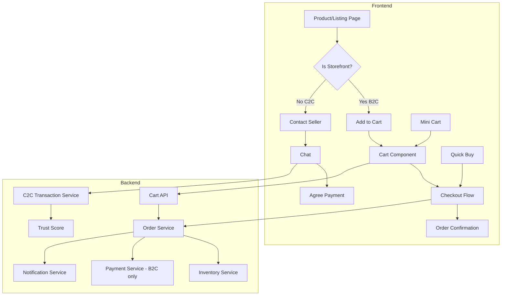

# 🚀 Современный план реализации E-commerce функционала

## 📋 Оглавление
1. [Обзор архитектуры](#обзор-архитектуры)
2. [Frontend компоненты](#frontend-компоненты)
3. [Backend улучшения](#backend-улучшения)
4. [UX/UI лучшие практики](#uxui-лучшие-практики)
5. [Поэтапная реализация](#поэтапная-реализация)
6. [Технический стек](#технический-стек)

## 🏗️ Обзор архитектуры

### Текущее состояние
- ✅ Backend: Транзакционная безопасность реализована
- ✅ Frontend: Базовая корзина (Redux store)
- ⚠️ Frontend: Нет UI для корзины и checkout
- ❌ Интеграция с платежными системами (ожидание контрактов)

### Важное разделение: C2C vs B2C
- **C2C (обычные объявления)**: Только личная оплата или наложенный платеж
- **B2C (витрины)**: Полный спектр платежных методов включая онлайн оплату

### Целевая архитектура



## 🎨 Frontend компоненты

### 1. Корзина (Shopping Cart) - ТОЛЬКО ДЛЯ B2C

#### 1.1 Mini Cart (Dropdown)
```typescript
// components/cart/MiniCart.tsx
- Появляется при наведении на иконку корзины
- Показывает последние 3 добавленных товара (только из витрин)
- Быстрый переход к полной корзине
- Анимация добавления товара (Framer Motion)
- Оптимистичные обновления
- Группировка по витринам
```

#### 1.2 Full Cart Page
```typescript
// app/[locale]/cart/page.tsx
- Responsive таблица товаров
- Изменение количества с debounce
- Удаление с подтверждением (swipe на мобильных)
- Автосохранение в localStorage
- Рекомендации похожих товаров
- Прогресс-бар до бесплатной доставки
```

#### 1.3 Cart Features
- **Сохранение корзины**: Синхронизация между устройствами для авторизованных
- **Восстановление корзины**: После логина объединение с локальной
- **Stock валидация**: Real-time проверка наличия
- **Групировка по витринам**: Разные витрины = разные заказы
- **Промокоды**: Поле для ввода с instant валидацией

### 2. Процесс оформления (Checkout)

#### 2.1 Step-by-Step Checkout
```typescript
// app/[locale]/checkout/page.tsx
```

**Шаг 1: Информация о покупателе**
- Автозаполнение для зарегистрированных
- Валидация в реальном времени (React Hook Form + Zod)
- Сохранение данных для будущих покупок
- Guest checkout опция

**Шаг 2: Адрес доставки**
- Интеграция с картой (выбор на карте)
- Автокомплит адреса (Google Places API)
- Сохраненные адреса с возможностью выбора
- Разные адреса для разных товаров

**Шаг 3: Способ доставки**
- Динамический расчет стоимости
- Предполагаемые сроки доставки
- Трекинг информация
- Самовывоз с картой пунктов

**Шаг 4: Оплата**
- Сохраненные карты (токенизация)
- Multiple payment methods
- 3D Secure интеграция
- Split payment опция

**Шаг 5: Подтверждение**
- Превью заказа
- Редактирование любого шага
- Согласие с условиями
- Estimated delivery widget

#### 2.2 One-Page Checkout (Alternative)
```typescript
// app/[locale]/quick-checkout/page.tsx
- Все шаги на одной странице
- Прогрессивное раскрытие
- Sticky order summary
- Mobile-first дизайн
```

### 3. UI компоненты

#### 3.1 Общие компоненты
```typescript
// components/ui/
- QuantitySelector: +/- с клавиатурным вводом
- PriceDisplay: Форматирование с учетом локали
- StockIndicator: Визуальный индикатор наличия
- DeliveryEstimate: Расчет сроков доставки
- PaymentMethodIcon: Иконки платежных систем
```

#### 3.2 Анимации и переходы
- Skeleton loading для всех состояний загрузки
- Smooth transitions между шагами (Framer Motion)
- Micro-interactions (добавление в корзину, удаление)
- Haptic feedback на мобильных (Vibration API)

## 🔧 Backend улучшения

### 1. Cart Service Enhancement

```go
// internal/proj/cart/service/cart_service.go

type CartService struct {
    // Добавить кеширование
    cache *redis.Client
    
    // Резервирование товаров в корзине
    reservationTimeout time.Duration
}

// Новые методы:
- MergeGuestCart(userID int, guestCartID string)
- ValidateStock(cartID int) ([]StockIssue, error)
- ApplyPromoCode(cartID int, code string) (*Discount, error)
- CalculateShipping(cartID int, address Address) (*ShippingOptions, error)
- SaveForLater(cartID int, itemID int) error
```

### 2. Order Service Enhancement

```go
// internal/proj/orders/service/order_service.go

// Новые возможности:
- CreateGuestOrder(email string, req *CreateOrderRequest)
- SplitOrderByStorefront(orderID int) ([]Order, error)
- ScheduleDelivery(orderID int, slot TimeSlot) error
- AddOrderNote(orderID int, note string) error
- RequestRefund(orderID int, reason string) error
```

### 3. Real-time Updates

```go
// WebSocket для обновлений
- Изменение цен в реальном времени
- Уведомления о наличии товара
- Статус доставки
- Промо-акции
```

### 4. API Endpoints

```yaml
# Новые эндпоинты
POST   /api/v1/cart/merge          # Слияние корзин
POST   /api/v1/cart/validate        # Валидация корзины
POST   /api/v1/checkout/guest       # Guest checkout
GET    /api/v1/checkout/shipping    # Расчет доставки
POST   /api/v1/orders/schedule      # Планирование доставки
GET    /api/v1/orders/:id/track     # Трекинг
POST   /api/v1/payments/tokenize    # Токенизация карты
```

## 🎯 UX/UI лучшие практики

### 1. Оптимизация конверсии

#### Trust Signals
- SSL badges
- Отзывы покупателей на каждом шаге
- Гарантии безопасности платежей
- Контакты поддержки

#### Reducing Friction
- Автосохранение на каждом шаге
- Progress indicators
- Clear error messages
- Guest checkout option
- Express checkout (Google Pay, Apple Pay)

### 2. Mobile Experience

```typescript
// Мобильная оптимизация
- Bottom sheet для корзины
- Swipe gestures для удаления
- Thumb-friendly кнопки
- Минимальный скролл
- Native-like transitions
```

### 3. Accessibility

- ARIA labels для всех интерактивных элементов
- Keyboard navigation
- Screen reader оптимизация
- High contrast mode
- Focus management

### 4. Performance

```typescript
// Оптимизации
- Code splitting по роутам
- Lazy loading изображений
- Service Worker для офлайн корзины
- Edge caching для статики
- Optimistic UI updates
```

## 📅 Поэтапная реализация

### Phase 1: MVP (1-2 недели)
1. **Cart UI**
   - [ ] Mini cart component
   - [ ] Full cart page
   - [ ] Cart persistence
   - [ ] Stock validation

2. **Basic Checkout**
   - [ ] Shipping info form
   - [ ] Address selection
   - [ ] Order preview
   - [ ] Order creation

### Phase 2: Enhanced UX (2-3 недели)
1. **Advanced Cart**
   - [ ] Save for later
   - [ ] Recommendations
   - [ ] Promo codes
   - [ ] Cart sharing

2. **Checkout Improvements**
   - [ ] Address autocomplete
   - [ ] Multiple addresses
   - [ ] Delivery scheduling
   - [ ] Guest checkout

### Phase 3: Premium Features (3-4 недели)
1. **Payment Integration**
   - [ ] Multiple payment methods
   - [ ] Saved cards
   - [ ] Split payments
   - [ ] Installments

2. **Post-Purchase**
   - [ ] Order tracking
   - [ ] Reviews reminder
   - [ ] Repeat orders
   - [ ] Wishlist

### Phase 4: Advanced (4+ недели)
1. **AI Features**
   - [ ] Smart recommendations
   - [ ] Price drop alerts
   - [ ] Abandoned cart recovery
   - [ ] Personalized discounts

2. **Social Commerce**
   - [ ] Share cart
   - [ ] Group buying
   - [ ] Gift registry
   - [ ] Social proof widgets

## 🛠️ Технический стек

### Frontend
- **Framework**: Next.js 15 with App Router
- **State**: Redux Toolkit + RTK Query
- **Forms**: React Hook Form + Zod
- **UI**: Tailwind CSS + DaisyUI + Framer Motion
- **Maps**: Mapbox GL JS
- **Payments**: Stripe Elements
- **Analytics**: Google Analytics 4 + Mixpanel
- **Monitoring**: Sentry + LogRocket

### Backend
- **API**: Go + Fiber
- **Database**: PostgreSQL + Redis
- **Queue**: RabbitMQ (для email/SMS)
- **Search**: OpenSearch
- **Storage**: MinIO (S3-compatible)
- **Monitoring**: Prometheus + Grafana

### Infrastructure
- **Hosting**: Kubernetes
- **CDN**: CloudFlare
- **CI/CD**: GitHub Actions
- **Monitoring**: DataDog

## 📊 Метрики успеха

### Business Metrics
- Cart abandonment rate < 70%
- Checkout completion rate > 30%
- Average order value increase 15%
- Customer lifetime value increase 20%

### Technical Metrics
- Page load time < 2s
- Time to interactive < 3s
- Lighthouse score > 90
- Error rate < 0.1%

## 🔒 Безопасность

### Payment Security
- PCI DSS compliance
- Tokenization for cards
- 3D Secure 2.0
- Fraud detection

### Data Protection
- GDPR compliance
- Encryption at rest
- Secure sessions
- Rate limiting

## 📱 Прогрессивные технологии

### PWA Features
- Offline cart
- Push notifications
- Install prompt
- Background sync

### Modern APIs
- Web Share API (share cart)
- Payment Request API
- Vibration API (haptic feedback)
- Geolocation API (nearest pickup)

## 🎁 Дополнительные фичи

### Gamification
- Loyalty points
- Achievement badges
- Referral rewards
- VIP tiers

### Personalization
- AI-powered recommendations
- Dynamic pricing
- Personalized emails
- Custom landing pages

### Social Proof
- Recent purchases widget
- Live visitor count
- Customer reviews
- Trust badges

## 📈 A/B Testing Plan

### Tests to Run
1. One-page vs Multi-step checkout
2. Guest checkout prominence
3. Trust badge placement
4. Free shipping threshold
5. Urgency messaging

### Tools
- Google Optimize
- Optimizely
- Custom feature flags

## 🚦 Launch Strategy

### Soft Launch
1. Internal testing (1 week)
2. Beta users (2 weeks)
3. Gradual rollout (25% → 50% → 100%)

### Monitoring
- Real User Monitoring (RUM)
- Error tracking
- Performance budgets
- Conversion funnels

### Rollback Plan
- Feature flags for quick disable
- Database migrations reversible
- Previous version kept for 30 days
- Automated rollback triggers