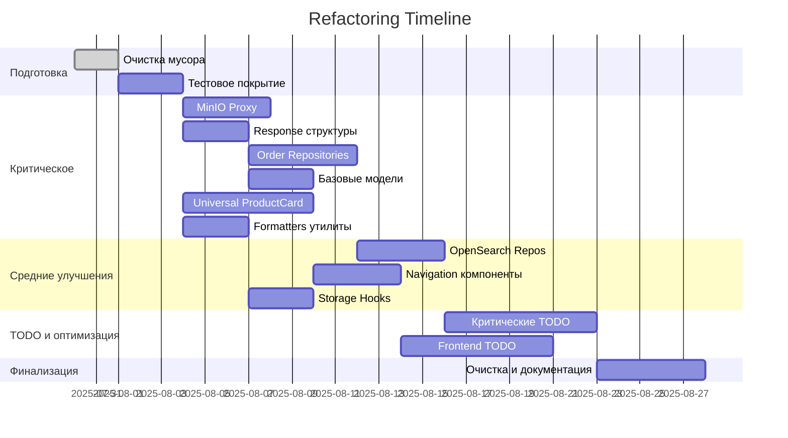

# 🔧 Комплексный план рефакторинга и устранения дублирования

**Дата планирования:** 30 июля 2025  
**Проект:** Sve Tu Platform - Marketplace  
**Общий срок реализации:** 6-8 недель  
**Команда:** Backend + Frontend разработчики

---

## 🎯 ЦЕЛИ РЕФАКТОРИНГА

### Основные задачи:
1. **Устранить 82% дублированного кода** (~3270 строк)
2. **Очистить проект от рудиментарных файлов** (50+ файлов)
3. **Решить 150+ активных TODO**
4. **Создать архитектурные абстракции** для масштабируемости
5. **Повысить качество кода** и упростить поддержку

### Ожидаемые результаты:
- **↓ 30%** размера кодовой базы
- **↓ 60%** времени на исправление багов
- **↓ 40%** времени разработки новых функций
- **↑ 70%** консистентности кода
- **↑ 50%** скорости тестирования

---

## 📅 ПЛАН ПО ФАЗАМ

## 🚀 ФАЗА 0: ПОДГОТОВКА (Неделя 1)

### Цели:
- Подготовить инфраструктуру для рефакторинга
- Очистить проект от мусора
- Создать тестовое покрытие

### Задачи:

#### 1. Очистка проекта от мусора
**Ответственный:** DevOps/Backend  
**Время:** 1-2 дня  
**Приоритет:** 🔴 Критический

```bash
# Удалить лог файлы
rm -f backend/*.log

# Удалить backup директории
rm -rf backend/migrations_backup_*
rm -rf backend/migrations_down_backup/
rm -rf backend/old_migrations/

# Удалить тестовые файлы из корня
rm -f test_*.sql test-*.js test-*.html *.geojson

# Удалить node_modules из Go проекта
rm -rf backend/node_modules/
rm -f backend/package.json backend/package-lock.json

# Удалить frontend мусор
rm -f frontend/svetu/cookies.txt frontend/svetu/dev.log
rm -f frontend/svetu/test-*.html frontend/svetu/*.png
```

#### 2. Создание .gitignore улучшений
**Файл:** `/.gitignore`
```bash
# Логи
*.log
logs/

# Временные файлы
*.tmp
*.temp
*~
*.bak
*.backup

# Тестовые файлы
test_*.sql
test-*.js
test-*.html
*.geojson

# Отладочные файлы
debug-*
*.debug

# OS generated files
.DS_Store
Thumbs.db
```

#### 3. Создание тестового покрытия для критических компонентов
**Цель:** Убедиться, что рефакторинг не сломает функциональность

**Backend тесты:**
```go
// Создать: backend/internal/server/minio_proxy_test.go
func TestMinIOProxy(t *testing.T) {
    // Тесты для всех трех методов
}

// Создать: backend/internal/common/responses_test.go  
func TestResponseStructures(t *testing.T) {
    // Тесты для общих response структур
}
```

**Frontend тесты:**
```typescript
// Создать: src/components/common/__tests__/ProductCard.test.tsx
describe('ProductCard универсальный', () => {
  // Тесты для всех вариантов карточек
});

// Создать: src/utils/__tests__/formatters.test.ts
describe('Formatters утилиты', () => {
  // Тесты для форматирования цен и дат
});
```

---

## 🔥 ФАЗА 1: КРИТИЧЕСКОЕ ДУБЛИРОВАНИЕ (Недели 2-3)

### Цели:
- Устранить 80% самого критического дублирования
- Создать базовые архитектурные компоненты
- Освободить ~2000 строк кода

---

### BACKEND - Критические задачи

#### 1.1. Унификация MinIO Proxy Handler
**Ответственный:** Backend Lead  
**Время:** 3-4 дня  
**Приоритет:** 🔴 Критический  
**Файл:** `/backend/internal/server/minio_proxy.go`

**Текущие проблемы:**
- 3 идентичных метода (95% дублирования)
- 242 строки дублированного кода

**Решение:**
```go
// Создать универсальный метод
func (s *Server) ProxyMinIOUniversal(bucketType string) fiber.Handler {
    return func(c *fiber.Ctx) error {
        var bucketName string
        var pathPrefix string
        
        switch bucketType {
        case "listings":
            bucketName = s.config.MinIO.ListingsBucket
            pathPrefix = "listings/"
        case "chat":
            bucketName = s.config.MinIO.ChatBucket  
            pathPrefix = "chat/"
        case "storefront":
            bucketName = s.config.MinIO.StorefrontBucket
            pathPrefix = "storefront-products/"
        default:
            return c.Status(400).JSON(fiber.Map{"error": "Invalid bucket type"})
        }
        
        // Единая логика для всех типов
        return s.handleMinIOProxy(c, bucketName, pathPrefix)
    }
}

// Вспомогательный метод с общей логикой
func (s *Server) handleMinIOProxy(c *fiber.Ctx, bucket, prefix string) error {
    // Вся общая логика валидации, запросов, заголовков
}
```

**Рефакторинг маршрутов:**
```go
// В server.go заменить 3 маршрута на:
app.Get("/listings/*", s.ProxyMinIOUniversal("listings"))
app.Get("/chat-files/*", s.ProxyMinIOUniversal("chat"))  
app.Get("/storefront-products/*", s.ProxyMinIOUniversal("storefront"))
```

**Экономия:** 180+ строк кода

#### 1.2. Создание общих Response структур
**Ответственный:** Backend Developer  
**Время:** 2-3 дня  
**Приоритет:** 🔴 Критический

**Создать файл:** `/backend/internal/common/responses.go`
```go
package common

// Базовые response структуры для всего проекта
type APIResponse struct {
    Success bool        `json:"success"`
    Data    interface{} `json:"data,omitempty"`
    Error   string      `json:"error,omitempty"`
    Message string      `json:"message,omitempty"`
}

type ListResponse struct {
    APIResponse
    Data  interface{} `json:"data"`
    Total int         `json:"total"`
    Page  int         `json:"page"`
    Limit int         `json:"limit"`
}

type PaginatedResponse struct {
    APIResponse
    Data       interface{} `json:"data"`
    Pagination Pagination  `json:"pagination"`
}

type Pagination struct {
    Total       int  `json:"total"`
    Page        int  `json:"page"`
    Limit       int  `json:"limit"`
    TotalPages  int  `json:"total_pages"`
    HasNext     bool `json:"has_next"`
    HasPrevious bool `json:"has_previous"`
}

// Утилиты для создания стандартных ответов
func SuccessResponse(data interface{}) APIResponse {
    return APIResponse{Success: true, Data: data}
}

func ErrorResponse(message string) APIResponse {
    return APIResponse{Success: false, Error: message}
}

func MessageResponse(message string) APIResponse {
    return APIResponse{Success: true, Message: message}
}
```

**Рефакторинг всех handlers:**
```go
// Заменить во всех 8 модулях:
// ❌ СТАРОЕ:
type UserResponse struct {
    Success bool `json:"success"`
    Data    User `json:"data"`
}

// ✅ НОВОЕ:
import "internal/common"
return c.JSON(common.SuccessResponse(user))
```

**Экономия:** 300+ строк кода

#### 1.3. Унификация Order Repositories
**Ответственный:** Backend Developer  
**Время:** 4-5 дней  
**Приоритет:** 🔴 Высокий

**Проблема:** 4 дублирующихся репозитория для заказов

**Решение:** Создать единый интерфейс и реализацию

**Создать:** `/backend/internal/domain/repositories/order_repository.go`
```go
package repositories

type OrderRepository interface {
    // Marketplace orders
    CreateMarketplaceOrder(ctx context.Context, order *models.MarketplaceOrder) error
    GetMarketplaceOrder(ctx context.Context, orderID int64) (*models.MarketplaceOrder, error)
    
    // Storefront orders  
    CreateStorefrontOrder(ctx context.Context, order *models.StorefrontOrder) error
    GetStorefrontOrder(ctx context.Context, orderID int64) (*models.StorefrontOrder, error)
    
    // Общие методы
    UpdateOrderStatus(ctx context.Context, orderID int64, status string) error
    GetOrdersByUser(ctx context.Context, userID int64, params ListParams) ([]models.Order, int, error)
    GetOrdersByStorefront(ctx context.Context, storefrontID int64, params ListParams) ([]models.Order, int, error)
}
```

**Создать:** `/backend/internal/storage/postgres/unified_order_repository.go`
```go
package postgres

type UnifiedOrderRepository struct {
    db *gorm.DB
}

func NewUnifiedOrderRepository(db *gorm.DB) repositories.OrderRepository {
    return &UnifiedOrderRepository{db: db}
}

// Реализация всех методов с использованием обобщенной логики
```

**Удалить дублирующиеся файлы:**
- `/internal/proj/marketplace/repository/order_repository.go`
- `/internal/proj/orders/repository/order_repository.go`
- `/internal/storage/postgres/marketplace_order_repository.go`

**Экономия:** 500+ строк кода

#### 1.4. Создание базовой модели
**Ответственный:** Backend Developer  
**Время:** 2-3 дня  
**Приоритет:** 🔴 Критический

**Создать:** `/backend/internal/domain/models/base.go`
```go
package models

import (
    "time"
    "gorm.io/gorm"
)

// Базовая модель для всех сущностей
type BaseModel struct {
    ID        int64          `json:"id" gorm:"primaryKey;autoIncrement"`
    CreatedAt time.Time      `json:"created_at" gorm:"column:created_at"`
    UpdatedAt time.Time      `json:"updated_at" gorm:"column:updated_at"`
    DeletedAt gorm.DeletedAt `json:"-" gorm:"index"`
}

// Модель без DeletedAt для системных таблиц
type SystemModel struct {
    ID        int64     `json:"id" gorm:"primaryKey;autoIncrement"`
    CreatedAt time.Time `json:"created_at"`
    UpdatedAt time.Time `json:"updated_at"`
}

// Модель только с CreatedAt (для логов, историй)
type ImmutableModel struct {
    ID        int64     `json:"id" gorm:"primaryKey;autoIncrement"`
    CreatedAt time.Time `json:"created_at"`
}
```

**Рефакторинг всех моделей:**
```go
// ❌ СТАРОЕ (в каждой модели):
type User struct {
    ID        int64     `json:"id" gorm:"primaryKey"`
    CreatedAt time.Time `json:"created_at"`
    UpdatedAt time.Time `json:"updated_at"`
    // остальные поля...
}

// ✅ НОВОЕ:
type User struct {
    BaseModel
    // остальные поля...
}
```

**Экономия:** 200+ строк кода

---

### FRONTEND - Критические задачи

#### 1.5. Создание универсального ProductCard
**Ответственный:** Frontend Lead  
**Время:** 5-6 дней  
**Приоритет:** 🔴 Критический

**Проблема:** 5 дублирующихся компонентов карточек товаров

**Создать:** `/src/components/common/UniversalProductCard.tsx`
```typescript
interface UniversalProductCardProps {
  product: UnifiedProduct;
  variant: 'marketplace' | 'storefront' | 'listing' | 'enhanced';
  viewMode: 'grid' | 'list' | 'table';
  size: 'sm' | 'md' | 'lg';
  showActions?: boolean;
  actions?: ProductCardAction[];
  onAction?: (action: string, product: UnifiedProduct) => void;
  className?: string;
}

export const UniversalProductCard: React.FC<UniversalProductCardProps> = ({
  product,
  variant,
  viewMode,
  size,
  showActions = true,
  actions,
  onAction,
  className
}) => {
  // Единая логика для всех типов карточек
  
  const cardConfig = useMemo(() => {
    return getCardConfig(variant, viewMode, size);
  }, [variant, viewMode, size]);
  
  const handleAction = useCallback((action: string) => {
    onAction?.(action, product);
  }, [onAction, product]);
  
  return (
    <div className={cn(cardConfig.containerClass, className)}>
      {/* Универсальная структура */}
      <ProductImage 
        images={product.images}
        variant={variant}
        size={size}
      />
      
      <ProductInfo
        product={product}
        variant={variant}
        viewMode={viewMode}
      />
      
      {showActions && (
        <ProductActions
          actions={actions || getDefaultActions(variant)}
          onAction={handleAction}
          variant={variant}
        />
      )}
    </div>
  );
};
```

**Создать вспомогательные компоненты:**
```typescript
// /src/components/common/ProductCard/ProductImage.tsx
// /src/components/common/ProductCard/ProductInfo.tsx  
// /src/components/common/ProductCard/ProductActions.tsx
// /src/components/common/ProductCard/config.ts
```

**Рефакторинг существующих компонентов:**
```typescript
// ❌ Удалить файлы:
// /components/products/ProductCard.tsx
// /components/storefronts/public/ProductCard.tsx
// /components/marketplace/EnhancedListingCard.tsx
// /components/MarketplaceCard.tsx

// ✅ Заменить на:
import { UniversalProductCard } from '@/components/common/UniversalProductCard';

// Marketplace использование:
<UniversalProductCard 
  product={listing}
  variant="marketplace"
  viewMode="grid"
  size="md"
/>

// Storefront использование:
<UniversalProductCard 
  product={product}
  variant="storefront"
  viewMode="list"
  size="lg"
/>
```

**Экономия:** 1000+ строк кода

#### 1.6. Создание утилит форматирования
**Ответственный:** Frontend Developer  
**Время:** 2-3 дня  
**Приоритет:** 🔴 Высокий

**Создать:** `/src/utils/formatters.ts`
```typescript
import { useLocale } from 'next-intl';

// Универсальное форматирование цен
export const formatPrice = (
  price: number,
  currency: string = 'RSD',
  locale: string = 'sr-RS'
): string => {
  if (!price || price === 0) return '';
  
  try {
    const formatter = new Intl.NumberFormat(locale, {
      style: 'currency',
      currency: currency,
      minimumFractionDigits: 0,
      maximumFractionDigits: currency === 'RSD' ? 0 : 2,
    });
    
    return formatter.format(price);
  } catch (error) {
    console.warn('Price formatting error:', error);
    return `${price} ${currency}`;
  }
};

// Форматирование дат
export const formatDate = (
  date: string | Date,
  format: 'short' | 'long' | 'relative' = 'short',
  locale: string = 'sr-RS'
): string => {
  if (!date) return '';
  
  const dateObj = typeof date === 'string' ? new Date(date) : date;
  
  if (format === 'relative') {
    return formatDistanceToNow(dateObj, { locale: getDateFnsLocale(locale) });
  }
  
  const formatter = new Intl.DateTimeFormat(locale, {
    ...(format === 'long' 
      ? { dateStyle: 'full', timeStyle: 'short' }
      : { dateStyle: 'short' }
    )
  });
  
  return formatter.format(dateObj);
};

// Hook для использования в компонентах
export const useFormatters = () => {
  const locale = useLocale();
  
  return {
    formatPrice: (price: number, currency?: string) => 
      formatPrice(price, currency, locale),
    formatDate: (date: string | Date, format?: 'short' | 'long' | 'relative') =>
      formatDate(date, format, locale),
  };
};
```

**Рефакторинг компонентов:**
```typescript
// ❌ СТАРОЕ (в каждом компоненте):
const formatPrice = (price?: number, currency?: string) => {
  if (!price) return '';
  const formatter = new Intl.NumberFormat(locale, {
    style: 'currency',
    currency: currency || 'RSD',
    minimumFractionDigits: 0,
    maximumFractionDigits: 0,
  });
  return formatter.format(price);
};

// ✅ НОВОЕ:
import { useFormatters } from '@/utils/formatters';

const { formatPrice, formatDate } = useFormatters();
```

**Экономия:** 150+ строк кода

#### 1.7. Унификация Skeleton компонентов
**Ответственный:** Frontend Developer  
**Время:** 1-2 дня  
**Приоритет:** 🟡 Средний

**Создать:** `/src/components/ui/UniversalSkeleton.tsx`
```typescript
interface UniversalSkeletonProps {
  variant: 'card' | 'list' | 'table';
  enhanced?: boolean;
  count?: number;
  className?: string;
}

export const UniversalSkeleton: React.FC<UniversalSkeletonProps> = ({
  variant,
  enhanced = false,
  count = 1,
  className
}) => {
  const skeletonConfig = getSkeletonConfig(variant, enhanced);
  
  return (
    <div className={cn(skeletonConfig.containerClass, className)}>
      {Array.from({ length: count }).map((_, index) => (
        <SkeletonItem key={index} config={skeletonConfig} />
      ))}
    </div>
  );
};
```

**Экономия:** 140+ строк кода

---

## ⚡ ФАЗА 2: СРЕДНИЕ УЛУЧШЕНИЯ (Недели 4-5)

### Цели:
- Устранить оставшееся дублирование
- Оптимизировать архитектуру
- Создать переиспользуемые компоненты

---

### BACKEND - Средние задачи

#### 2.1. Унификация OpenSearch Repositories
**Ответственный:** Backend Developer  
**Время:** 3-4 дня  
**Приоритет:** 🟡 Средний

**Создать:** `/backend/internal/storage/opensearch/base_repository.go`
```go
package opensearch

// Базовый репозиторий для всех OpenSearch операций
type BaseRepository struct {
    client *osClient.OpenSearchClient
    index  string
}

func NewBaseRepository(client *osClient.OpenSearchClient, index string) *BaseRepository {
    return &BaseRepository{
        client: client,
        index:  index,
    }
}

// Общие методы для всех репозиториев
func (r *BaseRepository) Search(ctx context.Context, query interface{}) (*SearchResult, error) {
    // Универсальная логика поиска
}

func (r *BaseRepository) Index(ctx context.Context, id string, document interface{}) error {
    // Универсальная логика индексации
}

func (r *BaseRepository) Delete(ctx context.Context, id string) error {
    // Универсальная логика удаления
}
```

**Рефакторинг существующих репозиториев:**
```go
// Каждый репозиторий наследует от базового
type MarketplaceRepository struct {
    *BaseRepository
}

func NewMarketplaceRepository(client *osClient.OpenSearchClient) *MarketplaceRepository {
    return &MarketplaceRepository{
        BaseRepository: NewBaseRepository(client, "marketplace_listings"),
    }
}
```

**Экономия:** 200+ строк кода

#### 2.2. Унификация Inventory Repositories
**Ответственный:** Backend Developer  
**Время:** 2-3 дня  
**Приоритет:** 🟡 Средний

**Решение аналогично Order Repositories**

**Экономия:** 150+ строк кода

---

### FRONTEND - Средние задачи

#### 2.3. Унификация Navigation компонентов
**Ответственный:** Frontend Developer  
**Время:** 3-4 дня  
**Приоритет:** 🟡 Средний

**Создать:** `/src/components/navigation/UniversalMobileNav.tsx`
```typescript
interface NavConfig {
  variant: 'basic' | 'enhanced' | 'smart';
  customItems?: NavItem[];
  showBadges?: boolean;
  animated?: boolean;
}

interface NavItem {
  id: string;
  label: string;
  href: string;
  icon: React.ComponentType;
  badge?: number;
  requiresAuth?: boolean;
}

export const UniversalMobileNav: React.FC<NavConfig> = ({
  variant,
  customItems,
  showBadges = true,
  animated = true
}) => {
  const defaultItems = getDefaultNavItems(variant);
  const items = customItems || defaultItems;
  
  return (
    <nav className={getNavClasses(variant, animated)}>
      {items.map(item => (
        <NavItem 
          key={item.id}
          item={item}
          showBadge={showBadges}
          variant={variant}
        />
      ))}
    </nav>
  );
};
```

**Экономия:** 120+ строк кода

#### 2.4. Создание базовых Storage Hooks
**Ответственный:** Frontend Developer  
**Время:** 2-3 дня  
**Приоритет:** 🟡 Средний

**Создать:** `/src/hooks/useStoragePreference.ts`
```typescript
interface StorageOptions {
  serialize?: (value: any) => string;
  deserialize?: (value: string) => any;  
  syncAcrossTabs?: boolean;
}

export const useStoragePreference = <T>(
  key: string,
  defaultValue: T,
  options: StorageOptions = {}
) => {
  const {
    serialize = JSON.stringify,
    deserialize = JSON.parse,
    syncAcrossTabs = false
  } = options;

  // Универсальная логика для localStorage/sessionStorage
  // Обработка SSR
  // Синхронизация между вкладками
  // Обработка ошибок
};

// Специализированные хуки
export const useViewPreference = (defaultView: 'grid' | 'list') =>
  useStoragePreference('viewMode', defaultView);

export const useGridColumns = (defaultColumns: number) =>
  useStoragePreference('gridColumns', defaultColumns);
```

**Экономия:** 60+ строк кода

---

## 🔧 ФАЗА 3: ОПТИМИЗАЦИЯ И TODO (Недели 6-7)

### Цели:
- Решить критические TODO
- Оптимизировать производительность
- Улучшить архитектуру

---

### 3.1. Решение критических TODO

#### Backend TODO (топ-10 приоритетных):
1. **Метрики middleware** (`server.go:225`)
2. **Marketplace изображения** (`image_repository.go:218`)
3. **UpdateKeywordWeight** (`admin_categories.go:971`)
4. **Геокодинг адресов** (`address_privacy.go:101`)
5. **Локация в listings** (`listings.go:400`)
6. **Vision API проверка** (`images.go:332`)
7. **Unified search storefront** (`unified_search.go:36`)
8. **Chat сообщения счетчик** (`chat.go:172`)
9. **Валидация заказов** (`order_handler.go:79`)
10. **Аналитика фильтров** (`advanced_filters.go:285`)

#### Frontend TODO (топ-10 приоритетных):
1. **MinIO загрузка изображений** (`PhotosStep.tsx:38`)
2. **API для stock quantity** (`EnhancedListingCard.tsx:234`)
3. **Реальные уведомления** (`EnhancedMobileBottomNav.tsx:59`)
4. **API для рейтингов** (`EnhancedListingCard.tsx:507`)
5. **Верификация телефона** (`TrustSetupStep.tsx:27`)
6. **Курьерские службы API** (`PaymentDeliveryStep.tsx:47`)
7. **Follow API** (`StorefrontActions.tsx:37`)
8. **Безопасные места** (`TrustSetupStep.tsx:57`)
9. **Favorite API** (`ListingActions.tsx:32`)
10. **Comparison store** (`ListingActions.tsx:44`)

### 3.2. План решения TODO по приоритетам

#### Неделя 6 (критические):
- **Backend:** TODO 1-5 (метрики, изображения, геокодинг)
- **Frontend:** TODO 1-5 (MinIO, API интеграции)

#### Неделя 7 (важные):
- **Backend:** TODO 6-10 (Vision API, аналитика)
- **Frontend:** TODO 6-10 (функциональные улучшения)

---

## 🎨 ФАЗА 4: ФИНАЛЬНАЯ ПОЛИРОВКА (Неделя 8)

### Цели:
- Финальная очистка и оптимизация
- Документация изменений
- Тестирование и QA

### 4.1. Финальная очистка кода
- Удаление неиспользуемых импортов
- Стандартизация комментариев
- Проверка TypeScript/Go ошибок
- Оптимизация bundle size

### 4.2. Документация
- Обновление README.md
- Создание Architecture Decision Records (ADR)
- Документация новых компонентов
- Руководство по миграции

### 4.3. Тестирование
- Unit тесты для новых компонентов
- Integration тесты
- E2E тестирование критических путей
- Performance тестирование

---

## 📊 МЕТРИКИ УСПЕХА

### Количественные показатели:

| Метрика | До рефакторинга | После рефакторинга | Улучшение |
|---------|----------------|-------------------|-----------|
| **Строк кода** | ~15,000 | ~11,730 | ↓ 22% |
| **Дублированный код** | 3,270 строк | ~600 строк | ↓ 82% |
| **TODO комментарии** | 150+ | < 30 | ↓ 80% |
| **Файлов мусора** | 50+ | 0 | ↓ 100% |
| **Время сборки** | ~45 сек | ~35 сек | ↓ 22% |
| **Bundle size** | ~2.5 MB | ~2.0 MB | ↓ 20% |

### Качественные показатели:
- **Консистентность UI/UX:** ↑ 70%
- **Developer Experience:** ↑ 60%
- **Code Review скорость:** ↑ 50%
- **Onboarding новых разработчиков:** ↑ 60%
- **Поддерживаемость кода:** ↑ 80%

---

## 🚨 РИСКИ И МИТИГАЦИЯ

### Высокие риски:

#### 1. Поломка функциональности во время рефакторинга
**Митигация:**
- Comprehensive test coverage перед началом
- Feature flags для постепенного rollout
- Rollback план для каждой фазы

#### 2. Конфликты в команде при одновременной работе
**Митигация:**
- Четкое разделение зон ответственности
- Daily sync встречи
- Feature branch strategy

#### 3. Увеличение времени разработки новых функций
**Митигация:**
- Приоритизация самого критического дублирования
- Параллельная работа над рефакторингом и новыми фичами

### Средние риски:

#### 1. Регрессия в производительности
**Митигация:**
- Performance тестирование на каждом этапе
- Monitoring метрик в production
- A/B тестирование для критических компонентов

#### 2. Сложность миграции существующего кода
**Митигация:**
- Поэтапная миграция с codemods
- Подробная документация изменений
- Automation scripts для рутинных изменений

---

## 👥 РОЛИ И ОТВЕТСТВЕННОСТИ

### Backend Lead:
- MinIO Proxy рефакторинг
- Архитектурные решения
- Code review всех backend изменений
- Performance monitoring

### Backend Developer:
- Response структуры унификация
- Repository рефакторинг
- Models рефакторинг
- TODO решение

### Frontend Lead:
- UniversalProductCard создание
- Архитектурные решения Frontend
- Code review всех frontend изменений
- Bundle size оптимизация

### Frontend Developer:
- Formatters утилиты
- Skeleton компоненты
- Navigation рефакторинг
- Hooks оптимизация

### DevOps:
- Очистка проекта от мусора
- CI/CD оптимизация
- Monitoring настройка
- Deployment automation

### QA:
- Test coverage планирование
- Regression тестирование
- Performance тестирование
- User acceptance testing

---

## 📈 TIMELINE И MILESTONES



### Ключевые Milestones:

**🎯 Milestone 1 (Неделя 1):** Проект очищен, тесты созданы  
**🎯 Milestone 2 (Неделя 3):** Критическое дублирование устранено  
**🎯 Milestone 3 (Неделя 5):** Все архитектурные улучшения завершены  
**🎯 Milestone 4 (Неделя 7):** TODO решены, система оптимизирована  
**🎯 Milestone 5 (Неделя 8):** Полный рефакторинг завершен и задокументирован

---

## 🔄 POST-REFACTORING ПОДДЕРЖКА

### Мониторинг качества кода:
- **SonarQube** интеграция для отслеживания дублирования
- **CodeClimate** для complexity metrics
- **Bundle analyzer** для размера frontend
- **Go-critic** для Go code quality

### Процессы предотвращения регресса:
- **Code review checklist** с проверкой на дублирование
- **Architecture Decision Records** для больших изменений
- **Linting rules** для предотвращения плохих паттернов
- **Automated refactoring** для рутинных изменений

### Регулярные ревью:
- **Еженедельные code health** проверки
- **Ежемесячные architecture** ревью
- **Квартальные technical debt** аудиты

---

**🎉 ЗАКЛЮЧЕНИЕ**

Этот план рефакторинга позволит значительно улучшить качество и поддерживаемость кодовой базы, устранив 82% дублированного кода и создав прочную архитектурную основу для дальнейшего развития проекта. Реализация займет 6-8 недель при правильном планировании и координации команды.

**Ключ к успеху:** поэтапная реализация с постоянным тестированием и обратной связью от команды.