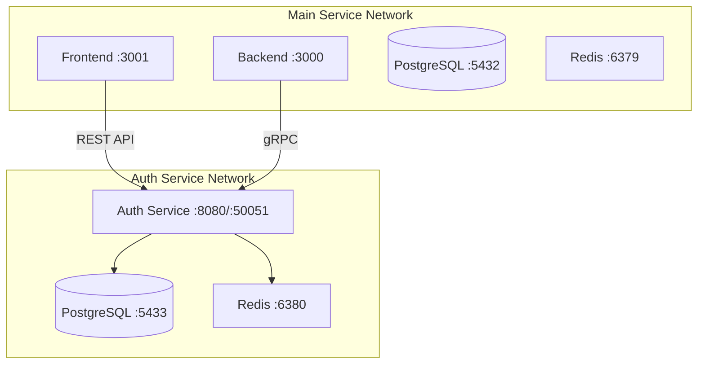

# 🏗️ Инфраструктура Auth Service

**Дата:** 06.09.2025  
**Статус:** Планирование

## 📦 Архитектура развертывания

### Полная изоляция компонентов

Auth Service - это **полностью независимый микросервис** со своей инфраструктурой:

```yaml
auth-service/
├── Собственная PostgreSQL БД (auth_db)
├── Собственный Redis
├── Go сервер (gRPC + HTTP)
├── Отдельный Docker network
└── Независимые порты и volumes
```

## 🐳 Docker Compose конфигурация

### docker-compose.auth.yml
```yaml
version: '3.8'

networks:
  auth-network:
    driver: bridge
    name: auth_service_network
    
volumes:
  auth_postgres_data:
  auth_redis_data:

services:
  # PostgreSQL для Auth Service
  auth-postgres:
    image: postgres:15-alpine
    container_name: auth_postgres
    environment:
      POSTGRES_DB: auth_db
      POSTGRES_USER: auth_user
      POSTGRES_PASSWORD: ${AUTH_DB_PASSWORD}
    volumes:
      - auth_postgres_data:/var/lib/postgresql/data
      - ./auth-service/migrations:/docker-entrypoint-initdb.d
    networks:
      - auth-network
    ports:
      - "5433:5432"  # Отдельный порт, не конфликтует с основной БД
    healthcheck:
      test: ["CMD-SHELL", "pg_isready -U auth_user -d auth_db"]
      interval: 10s
      timeout: 5s
      retries: 5

  # Redis для Auth Service
  auth-redis:
    image: redis:7-alpine
    container_name: auth_redis
    command: redis-server --appendonly yes --requirepass ${AUTH_REDIS_PASSWORD}
    volumes:
      - auth_redis_data:/data
    networks:
      - auth-network
    ports:
      - "6380:6379"  # Отдельный порт
    healthcheck:
      test: ["CMD", "redis-cli", "--auth", "${AUTH_REDIS_PASSWORD}", "ping"]
      interval: 10s
      timeout: 5s
      retries: 5

  # Auth Service
  auth-service:
    build:
      context: ./auth-service
      dockerfile: Dockerfile
    container_name: auth_service
    environment:
      # Database
      DB_HOST: auth-postgres
      DB_PORT: 5432
      DB_NAME: auth_db
      DB_USER: auth_user
      DB_PASSWORD: ${AUTH_DB_PASSWORD}
      
      # Redis
      REDIS_HOST: auth-redis
      REDIS_PORT: 6379
      REDIS_PASSWORD: ${AUTH_REDIS_PASSWORD}
      
      # Service config
      GRPC_PORT: 50051
      HTTP_PORT: 8080
      JWT_SECRET: ${AUTH_JWT_SECRET}
      JWT_PRIVATE_KEY: ${AUTH_JWT_PRIVATE_KEY}
      JWT_PUBLIC_KEY: ${AUTH_JWT_PUBLIC_KEY}
      
      # OAuth
      GOOGLE_CLIENT_ID: ${GOOGLE_CLIENT_ID}
      GOOGLE_CLIENT_SECRET: ${GOOGLE_CLIENT_SECRET}
      
      # Environment
      ENV: development
      LOG_LEVEL: debug
    ports:
      - "50051:50051"  # gRPC
      - "8080:8080"    # HTTP/REST
    networks:
      - auth-network
    depends_on:
      auth-postgres:
        condition: service_healthy
      auth-redis:
        condition: service_healthy
    restart: unless-stopped
```

## 🔗 Взаимодействие с основным сервисом

### Сетевая архитектура



### Коммуникация между сервисами

#### Для разработки (Docker networks)
```yaml
# Добавить в основной docker-compose.yml
networks:
  default:
    external:
      name: auth_service_network
```

#### Для продакшена (через внешние endpoints)
```env
# Backend .env
AUTH_SERVICE_GRPC_URL=auth-service.internal:50051
AUTH_SERVICE_HTTP_URL=https://auth.svetu.rs

# Frontend .env
NEXT_PUBLIC_AUTH_API_URL=https://auth.svetu.rs
```

## 🗄️ База данных Auth Service

### Полностью отдельная БД

```sql
-- auth_db (НЕ svetubd!)
CREATE DATABASE auth_db;

-- Своя схема таблиц
CREATE SCHEMA auth;

-- Таблицы только для авторизации
CREATE TABLE auth.users (
    id SERIAL PRIMARY KEY,
    email VARCHAR(255) UNIQUE NOT NULL,
    name VARCHAR(100) NOT NULL,
    password_hash VARCHAR(255),
    google_id VARCHAR(255),
    provider VARCHAR(20) NOT NULL,
    created_at TIMESTAMP DEFAULT NOW()
);

CREATE TABLE auth.refresh_tokens (
    id SERIAL PRIMARY KEY,
    user_id INTEGER REFERENCES auth.users(id),
    token_hash VARCHAR(255) UNIQUE NOT NULL,
    expires_at TIMESTAMP NOT NULL,
    created_at TIMESTAMP DEFAULT NOW()
);

-- НЕТ таблиц marketplace, listings, и т.д.!
```

### Синхронизация данных

```go
// При создании пользователя в Auth Service
func (s *AuthService) CreateUser(user *User) error {
    // 1. Создаем в auth_db
    authUser := s.authDB.CreateUser(user)
    
    // 2. Отправляем событие в основной сервис
    event := UserCreatedEvent{
        ID: authUser.ID,
        Email: authUser.Email,
        Name: authUser.Name,
    }
    s.eventBus.Publish("user.created", event)
    
    return nil
}

// Основной сервис слушает события
func (s *MainService) HandleUserCreated(event UserCreatedEvent) {
    // Создаем пользователя в основной БД
    s.db.CreateUser(User{
        ID: event.ID,  // Используем тот же ID!
        Email: event.Email,
        Name: event.Name,
    })
}
```

## 🚀 Развертывание

### Локальная разработка
```bash
# Запуск Auth Service отдельно
cd auth-service
docker-compose -f docker-compose.auth.yml up -d

# Проверка
curl http://localhost:8080/health
grpcurl -plaintext localhost:50051 list

# Логи
docker logs auth_service -f
```

### VPS/Production

#### Вариант 1: Отдельный VPS
```bash
# auth.svetu.rs (отдельный сервер)
ssh root@auth.svetu.rs
git clone auth-service
docker-compose up -d
```

#### Вариант 2: Kubernetes
```yaml
apiVersion: apps/v1
kind: Deployment
metadata:
  name: auth-service
  namespace: auth
spec:
  replicas: 3
  selector:
    matchLabels:
      app: auth-service
  template:
    metadata:
      labels:
        app: auth-service
    spec:
      containers:
      - name: auth-service
        image: svetu/auth-service:latest
        ports:
        - containerPort: 50051  # gRPC
        - containerPort: 8080   # HTTP
        env:
        - name: DB_HOST
          value: auth-postgres-service
        - name: REDIS_HOST
          value: auth-redis-service
---
apiVersion: v1
kind: Service
metadata:
  name: auth-service
  namespace: auth
spec:
  selector:
    app: auth-service
  ports:
  - name: grpc
    port: 50051
  - name: http
    port: 8080
```

## 📊 Мониторинг изолированного сервиса

### Отдельные метрики и логи
```yaml
# prometheus.auth.yml
scrape_configs:
  - job_name: 'auth-service'
    static_configs:
      - targets: ['auth-service:8080']
    metrics_path: '/metrics'

# Отдельный Grafana dashboard
- Auth Service Performance
- Auth Service Errors
- Token Generation Rate
- Database Connections (auth_db)
```

### Health checks
```go
// GET /health
{
  "status": "healthy",
  "service": "auth-service",
  "version": "1.0.0",
  "dependencies": {
    "postgres": "connected",
    "redis": "connected"
  }
}

// GET /ready
{
  "ready": true,
  "database": true,
  "cache": true
}
```

## 🔐 Безопасность изоляции

### Network Policies
```yaml
# Только основной backend может обращаться к gRPC
apiVersion: networking.k8s.io/v1
kind: NetworkPolicy
metadata:
  name: auth-grpc-access
spec:
  podSelector:
    matchLabels:
      app: auth-service
  policyTypes:
  - Ingress
  ingress:
  - from:
    - podSelector:
        matchLabels:
          app: backend-service
    ports:
    - protocol: TCP
      port: 50051
```

### Firewall правила
```bash
# VPS firewall
# gRPC порт только для внутренней сети
ufw allow from 10.0.0.0/24 to any port 50051

# HTTP порт открыт для всех (через nginx)
ufw allow 8080/tcp
```

## 💾 Backup стратегия

### Независимые бекапы
```bash
# Auth DB backup (отдельно от основной БД)
pg_dump -h localhost -p 5433 -U auth_user auth_db > auth_backup.sql

# Redis snapshot
docker exec auth_redis redis-cli --auth $PASSWORD BGSAVE

# Volumes backup
docker run --rm -v auth_postgres_data:/data -v $(pwd):/backup \
  alpine tar czf /backup/auth_data_$(date +%Y%m%d).tar.gz /data
```

## 🔄 Миграция существующих пользователей

### Одноразовый скрипт миграции
```go
// migrate-users.go
func MigrateUsers() {
    // Подключаемся к ОБЕИМ БД
    mainDB := connectToMainDB()      // svetubd
    authDB := connectToAuthDB()       // auth_db
    
    // Читаем из основной БД
    users := mainDB.Query("SELECT id, email, name, password, google_id FROM users")
    
    // Записываем в auth БД
    for _, user := range users {
        authDB.Exec(`
            INSERT INTO auth.users (id, email, name, password_hash, google_id, provider)
            VALUES ($1, $2, $3, $4, $5, $6)
        `, user.ID, user.Email, user.Name, user.Password, user.GoogleID, 
           determineProvider(user))
    }
    
    // Мигрируем активные refresh tokens
    tokens := mainDB.Query("SELECT * FROM refresh_tokens WHERE NOT is_revoked")
    for _, token := range tokens {
        authDB.Exec("INSERT INTO auth.refresh_tokens ...", token)
    }
}
```

## ✅ Преимущества полной изоляции

1. **Независимое масштабирование**
   - Auth service может работать на отдельном сервере
   - Своя БД не нагружает основную

2. **Безопасность**
   - Критичные данные (пароли, токены) изолированы
   - Компрометация основного сервиса не затронет auth

3. **Производительность**
   - Нет конкуренции за ресурсы БД
   - Отдельный Redis для кеша сессий

4. **Простота обслуживания**
   - Обновления auth не требуют остановки основного сервиса
   - Отдельные логи и метрики

5. **Переиспользование**
   - Можно использовать для других проектов
   - Стандартный auth для всей экосистемы

## 🎯 Итого

Auth Service - это **полностью автономный микросервис**:
- Своя PostgreSQL (порт 5433)
- Свой Redis (порт 6380)
- Свой Docker network
- Свои volumes
- Отдельный деплой

Взаимодействие только через API (gRPC/REST), никаких прямых подключений к БД!