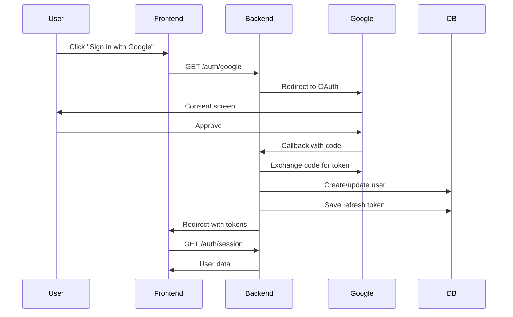
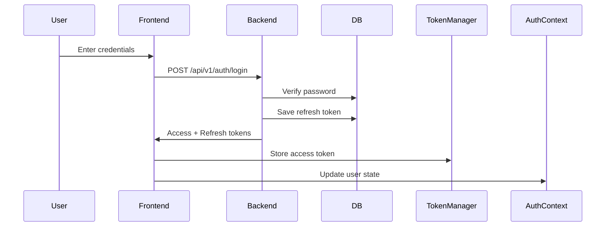
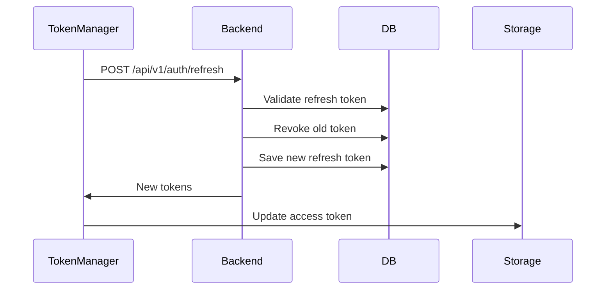

# 🔐 Паспорт системы авторизации и аутентификации
**Дата составления:** 06.09.2025  
**Статус:** Действующий

## 📊 Общая характеристика системы

### Архитектурный паттерн
- **Тип:** Гибридная система с множественными методами аутентификации
- **Архитектура:** Монолитная с элементами микросервисной архитектуры
- **Состояние токенов:** Stateful (refresh tokens в БД) + Stateless (JWT)

### Поддерживаемые методы аутентификации
1. **Google OAuth 2.0** - основной метод
2. **Email + Password** - классическая аутентификация  
3. **JWT токены** - для API доступа
4. **Session cookies** - legacy поддержка

## 🏗️ Архитектура Backend

### Основные компоненты

#### 1. AuthService (`backend/internal/proj/users/service/auth.go`)
- **Ответственность:** Бизнес-логика аутентификации
- **Ключевые методы:**
  - `LoginWithRefreshToken` - вход по email/password
  - `RegisterWithRefreshToken` - регистрация новых пользователей
  - `HandleGoogleCallback` - обработка OAuth callback
  - `RefreshTokens` - ротация токенов
  - `GenerateTokensForOAuth` - генерация токенов после OAuth

#### 2. AuthHandler (`backend/internal/proj/users/handler/auth.go`)
- **Эндпоинты:**
  - `POST /api/v1/auth/login` - вход по email/password
  - `POST /api/v1/auth/register` - регистрация
  - `GET /auth/google` - инициация OAuth
  - `GET /auth/google/callback` - OAuth callback
  - `GET /auth/session` - получение текущей сессии
  - `POST /api/v1/auth/refresh` - обновление токенов
  - `POST /api/v1/auth/logout` - выход

#### 3. JWT Middleware (`backend/internal/middleware/auth_jwt.go`)
- **Приоритеты проверки:**
  1. Bearer token в Authorization header
  2. Token в query параметре (для WebSocket)
  3. JWT в cookie
  4. Session token в cookie (legacy)
- **Публичные маршруты:** автоматическое определение и пропуск

### Схема базы данных

#### Таблица `users`
```sql
- id (PK)
- email (unique)
- name
- password (nullable, bcrypt hash)
- google_id (для OAuth)
- provider (google/email/password/jwt)
- role_id (FK to roles)
- last_seen
- account_status
- settings (jsonb)
```

#### Таблица `refresh_tokens`
```sql
- id (PK)
- user_id (FK)
- token (unique, JWT)
- expires_at
- created_at
- user_agent
- ip
- is_revoked
- revoked_at
```

#### Таблица `admin_users`
```sql
- id (PK)
- email
- created_at
- created_by
- notes
```

## 🎨 Архитектура Frontend

### Основные компоненты

#### 1. AuthContext (`frontend/svetu/src/contexts/AuthContext.tsx`)
- **State management:** React Context API
- **Кеширование:** sessionStorage для пользовательских данных
- **Функции:**
  - `login` - инициация входа
  - `logout` - выход и очистка токенов
  - `refreshSession` - обновление сессии
  - `updateProfile` - обновление профиля

#### 2. AuthService (`frontend/svetu/src/services/auth.ts`)
- **HTTP клиент** для API взаимодействия
- **Rate limiting** на клиенте
- **CSRF защита**
- **Abort controllers** для отмены запросов

#### 3. TokenManager (`frontend/svetu/src/utils/tokenManager.ts`)
- **Хранение:** sessionStorage для access token
- **Автообновление:** за 5 минут до истечения
- **Rate limit protection:** минимум 60 сек между попытками
- **Max attempts:** 3 попытки обновления

### Компоненты UI
- `AuthButton` - кнопка входа/выхода
- `AuthModal` - модальное окно авторизации
- `AuthStateManager` - управление состоянием
- `AuthErrorBoundaryWrapper` - обработка ошибок

## 🔒 Безопасность

### Токены и их характеристики

#### Access Token (JWT)
- **Срок жизни:** 1 час (по умолчанию)
- **Хранение:** sessionStorage (frontend), memory
- **Передача:** Authorization Bearer header
- **Payload:** userID, email, exp, iat

#### Refresh Token (JWT)
- **Срок жизни:** 30 дней
- **Хранение:** httpOnly cookie + БД
- **Ротация:** при каждом refresh
- **Отзыв:** индивидуальный или массовый

#### Session Token (Legacy)
- **Тип:** случайная строка
- **Хранение:** в памяти сервера (sync.Map)
- **Cookie:** httpOnly, SameSite=Lax

### Защитные механизмы

1. **CSRF Protection**
   - CSRF токены для мутирующих операций
   - SameSite cookies

2. **Rate Limiting**
   - Login: 5 попыток за 15 минут
   - Register: 3 попытки за час
   - Token refresh: минимум 60 сек между попытками

3. **Password Security**
   - bcrypt с default cost (10)
   - Минимальные требования на frontend

4. **Cookie Security**
   - httpOnly: true
   - Secure: true (production)
   - SameSite: Lax
   - Domain: configurable

## 🔄 Потоки аутентификации

### 1. Google OAuth Flow


### 2. Email/Password Flow


### 3. Token Refresh Flow


## 📈 Метрики и мониторинг

### Ключевые метрики
- Количество активных сессий
- Частота обновления токенов
- Количество неудачных попыток входа
- Время ответа эндпоинтов аутентификации

### Логирование
- Все попытки входа (успешные и неудачные)
- Обновления токенов
- Изменения ролей и прав
- Подозрительная активность

## 🚨 Известные проблемы и ограничения

### Текущие проблемы

1. **Дублирование логики**
   - Session tokens и JWT работают параллельно
   - Множественные точки проверки аутентификации

2. **Масштабируемость**
   - Session tokens в памяти (sync.Map) - не масштабируется
   - Нет централизованного кеша для сессий

3. **Консистентность**
   - Разные методы аутентификации имеют разные потоки
   - Нет единого источника правды для состояния пользователя

4. **Производительность**
   - Частые запросы к БД для проверки refresh tokens
   - Нет кеширования данных пользователей

### Ограничения

1. **Горизонтальное масштабирование**
   - Session tokens привязаны к конкретному инстансу
   - Требуется sticky sessions или миграция на Redis

2. **Multi-device support**
   - Logout выходит из всех устройств
   - Нет управления индивидуальными сессиями

3. **Token revocation**
   - Access tokens нельзя отозвать до истечения
   - Требуется blacklist или сокращение времени жизни

## 💡 Рекомендации по выделению в отдельный сервис

### Преимущества выделения

1. **Независимое масштабирование**
   - Auth сервис может масштабироваться отдельно
   - Возможность использования специализированных БД

2. **Единая точка аутентификации**
   - SSO для множественных сервисов
   - Централизованное управление пользователями

3. **Улучшенная безопасность**
   - Изоляция критически важной логики
   - Специализированный мониторинг

4. **Переиспользование**
   - Один auth сервис для всех проектов
   - Стандартизация процессов

### Предлагаемая архитектура микросервиса

#### Технологический стек
- **Язык:** Go (текущий) или Rust (для производительности)
- **БД:** PostgreSQL + Redis (кеш сессий)
- **Протокол:** gRPC внутренний, REST внешний
- **Service mesh:** Istio/Linkerd для безопасности

#### Компоненты
1. **Auth Service** - основная логика
2. **User Service** - управление профилями
3. **Session Service** - управление сессиями
4. **Token Service** - генерация/валидация токенов
5. **Audit Service** - логирование и мониторинг

#### API Gateway интеграция
```yaml
routes:
  - path: /auth/*
    service: auth-service
  - path: /api/*
    middleware:
      - auth-validation
    service: backend-service
```

### План миграции

#### Фаза 1: Подготовка (2 недели)
1. Выделение интерфейсов AuthService
2. Создание абстракций для storage
3. Написание интеграционных тестов

#### Фаза 2: Создание сервиса (3 недели)
1. Инициализация нового репозитория
2. Перенос бизнес-логики
3. Настройка CI/CD
4. Реализация gRPC/REST API

#### Фаза 3: Интеграция (2 недели)
1. Создание клиентских библиотек
2. Постепенная миграция эндпоинтов
3. A/B тестирование

#### Фаза 4: Миграция данных (1 неделя)
1. Синхронизация БД
2. Миграция refresh tokens
3. Переключение трафика

#### Фаза 5: Оптимизация (2 недели)
1. Настройка кеширования
2. Оптимизация производительности
3. Мониторинг и алертинг

### Ожидаемые результаты

#### Производительность
- **Снижение latency:** -30% за счет кеширования
- **Увеличение throughput:** +200% за счет оптимизации
- **Снижение нагрузки на основной сервис:** -40%

#### Надежность
- **Uptime:** 99.99% (изолированный сервис)
- **Восстановление:** <1 минуты
- **Резервирование:** active-active

#### Безопасность
- Централизованный аудит
- Улучшенный мониторинг аномалий
- Быстрое реагирование на инциденты

## 📝 Выводы

Текущая система авторизации функциональна, но имеет архитектурные проблемы, затрудняющие масштабирование и поддержку. Выделение в отдельный микросервис позволит:

1. Устранить дублирование логики
2. Улучшить производительность и масштабируемость
3. Повысить безопасность и надежность
4. Упростить поддержку и развитие

**Рекомендация:** Начать поэтапную миграцию на микросервисную архитектуру с сохранением обратной совместимости.