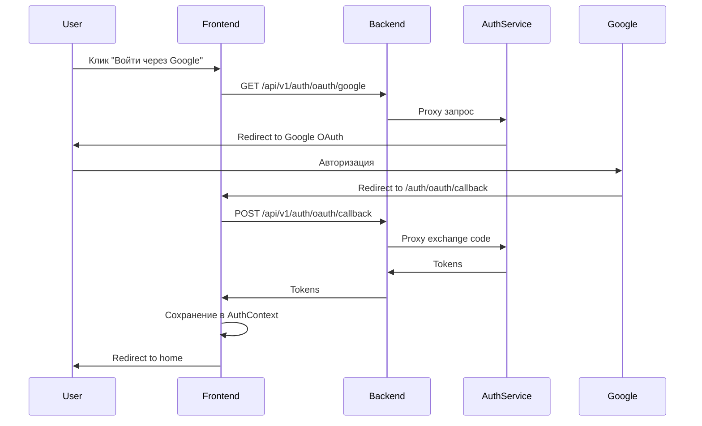

# OAuth Authentication Microservice Configuration

## Обзор архитектуры

OAuth аутентификация теперь полностью обрабатывается через микросервис Auth Service без использования proxy для callback.

### Компоненты системы:

1. **Auth Service** (порт 28080) - микросервис аутентификации
2. **Backend API** (порт 3000) - основной backend с proxy для Auth Service
3. **Frontend** (порт 3001) - React/Next.js приложение

## OAuth Flow



## Конфигурация

### 1. Auth Service Configuration

**Файл**: `/data/auth_svetu/.env`

```env
# OAuth Configuration
GOOGLE_CLIENT_ID=your-google-client-id
GOOGLE_CLIENT_SECRET=your-google-client-secret
GOOGLE_REDIRECT_URL=http://localhost:3001/auth/oauth/callback
```

**Важно**: Redirect URL указывает напрямую на frontend (порт 3001), а не на backend.

### 2. Backend Proxy Configuration

**Файл**: `/data/hostel-booking-system/backend/internal/middleware/auth_proxy.go`

```go
// ProxyToAuthService проксирует запросы к Auth Service
func (m *AuthProxyMiddleware) ProxyToAuthService() fiber.Handler {
    return func(c *fiber.Ctx) error {
        path := c.Path()
        
        // НЕ проксируем callback - он идет напрямую на frontend
        if strings.Contains(path, "/oauth/google/callback") || 
           strings.Contains(path, "/oauth/facebook/callback") {
            return c.Status(fiber.StatusNotFound).JSON(fiber.Map{
                "error": "OAuth callback should go directly to frontend at port 3001",
            })
        }
        
        // Для OAuth редиректов возвращаем Location напрямую
        if resp.StatusCode >= 301 && resp.StatusCode <= 308 {
            if location := resp.Header.Get("Location"); location != "" {
                return c.Status(resp.StatusCode).Redirect(location)
            }
        }
        
        // ... остальная логика proxy
    }
}
```

### 3. Frontend OAuth Callback Handler

**Файл**: `/data/hostel-booking-system/frontend/svetu/src/app/[locale]/auth/oauth/callback/page.tsx`

```tsx
export default function OAuthCallbackPage() {
  const handleOAuthCallback = async () => {
    const code = searchParams.get('code');
    const state = searchParams.get('state');
    
    // Exchange code for token через backend proxy
    const response = await fetch(
      `${process.env.NEXT_PUBLIC_API_URL}/api/v1/auth/oauth/callback`,
      {
        method: 'POST',
        headers: { 'Content-Type': 'application/json' },
        body: JSON.stringify({ code, state, provider: 'google' })
      }
    );
    
    const data = await response.json();
    
    // Сохранение токенов в AuthContext
    await login({
      access_token: data.access_token,
      refresh_token: data.refresh_token,
      user: data.user,
    });
  };
}
```

### 4. Auth Service OAuth Endpoints

**POST /api/v1/auth/oauth/callback** - Exchange endpoint для обмена кода на токены

```go
func (h *AuthHandler) OAuthExchange(c *fiber.Ctx) error {
    var req struct {
        Code     string `json:"code"`
        State    string `json:"state"`
        Provider string `json:"provider"`
    }
    
    // Валидация state
    stateInfo, exists := h.oauthStates[req.State]
    if !exists {
        return c.Status(fiber.StatusBadRequest).JSON(fiber.Map{
            "error": "invalid_state",
        })
    }
    
    // Exchange code for token
    token, err := oauthProvider.ExchangeCode(c.Context(), req.Code)
    
    // Get user info
    userInfo, err := oauthProvider.GetUserInfo(c.Context(), token)
    
    // Login/Register user
    authResponse, err := h.authService.OAuthLogin(c.Context(), userInfo)
    
    // Return tokens as JSON
    return c.JSON(fiber.Map{
        "access_token":  authResponse.AccessToken,
        "refresh_token": authResponse.RefreshToken,
        "user": authResponse.User,
    })
}
```

## Google OAuth Console Setup

1. Перейдите в [Google Cloud Console](https://console.cloud.google.com/)
2. Выберите проект или создайте новый
3. Включите Google+ API
4. Создайте OAuth 2.0 credentials
5. Добавьте Authorized redirect URIs:
   - `http://localhost:3001/auth/oauth/callback` (development)
   - `http://localhost:3001/ru/auth/oauth/callback` (с локалью)
   - `https://svetu.rs/auth/oauth/callback` (production)

## Тестирование

### 1. Проверка Auth Service

```bash
# Health check
curl http://localhost:28080/health

# Инициация OAuth (должен вернуть redirect)
curl -v http://localhost:28080/api/v1/auth/oauth/google
```

### 2. Проверка Backend Proxy

```bash
# OAuth initiation через proxy
curl -v http://localhost:3000/api/v1/auth/oauth/google
```

### 3. E2E тестирование

1. Откройте http://localhost:3001
2. Нажмите "Войти"
3. Выберите "Войти через Google"
4. Авторизуйтесь в Google
5. Проверьте редирект обратно на сайт
6. Проверьте сохранение токенов в localStorage

## Проблемы и решения

### Проблема: OAuth callback не работает

**Симптомы**: После авторизации в Google происходит ошибка или страница не найдена.

**Решение**: 
1. Проверьте, что redirect URI в Google Console точно совпадает с настройкой в Auth Service
2. Убедитесь, что frontend callback handler существует по пути `/[locale]/auth/oauth/callback/page.tsx`
3. Проверьте, что backend НЕ проксирует callback запросы

### Проблема: State validation failed

**Симптомы**: Ошибка "invalid_state" при callback.

**Решение**:
1. State генерируется при инициации OAuth и должен храниться в памяти Auth Service
2. Проверьте, что state очищается от старых записей (TTL 10 минут)
3. Убедитесь, что один и тот же экземпляр Auth Service обрабатывает initiate и callback

### Проблема: Tokens не сохраняются

**Симптомы**: После успешной авторизации пользователь не авторизован.

**Решение**:
1. Проверьте, что frontend callback handler вызывает `login()` из AuthContext
2. Убедитесь, что токены возвращаются в правильном формате из Auth Service
3. Проверьте localStorage на наличие токенов

## Миграция с монолита

При переходе с монолитной архитектуры на микросервисы:

1. **Сохраните старую систему** как fallback (переменная USE_AUTH_SERVICE=false)
2. **Постепенная миграция**: сначала OAuth, затем остальные auth endpoints
3. **Синхронизация данных**: убедитесь, что пользователи могут использовать оба метода входа
4. **Мониторинг**: логируйте все OAuth операции для отладки

## Production Checklist

- [ ] Настроены production redirect URIs в Google Console
- [ ] Используется HTTPS для всех OAuth операций
- [ ] State токены хранятся в Redis, а не в памяти
- [ ] Настроен rate limiting для OAuth endpoints
- [ ] Включено логирование всех OAuth операций
- [ ] Настроен мониторинг и алерты
- [ ] Проведено нагрузочное тестирование
- [ ] Настроен backup план на случай недоступности Auth Service