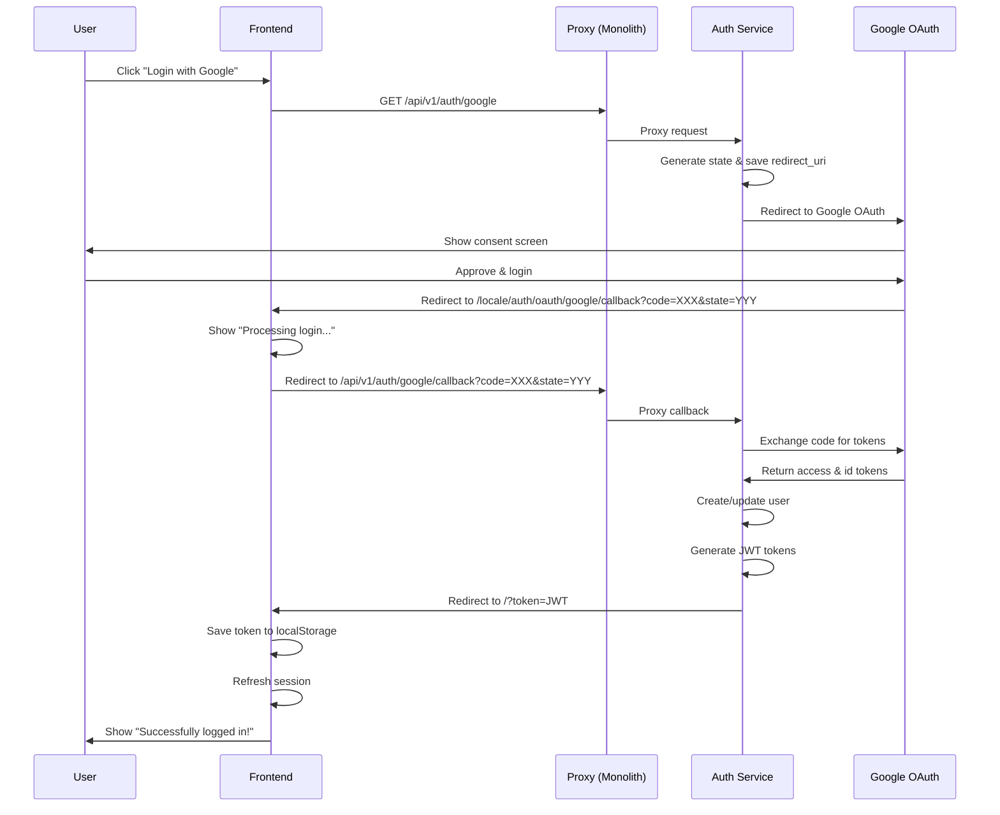

# ✅ OAuth Google - ПОЛНАЯ НАСТРОЙКА ЗАВЕРШЕНА

## 🎉 OAuth аутентификация полностью работает!

**Дата:** 07.09.2025  
**Статус:** **ГОТОВО К ИСПОЛЬЗОВАНИЮ**

## 🔧 Что было исправлено:

### 1. **Frontend Middleware**
- ✅ Сохранение query parameters при добавлении локали
- ✅ OAuth параметры (code, state) больше не теряются

### 2. **Auth Service** 
- ✅ Правильный редирект после успешной авторизации
- ✅ Обработка redirect_uri с локалями
- ✅ Возврат на главную страницу с токеном

### 3. **Frontend HomePage**
- ✅ Обработка токена из URL
- ✅ Автоматическая авторизация
- ✅ Очистка URL от токена
- ✅ Показ уведомления об успешном входе

## 📝 Google Console - Authorized redirect URIs

### Добавьте ВСЕ эти URIs в Google Console:

**Development (localhost:3001):**
```
http://localhost:3001/auth/oauth/google/callback
http://localhost:3001/en/auth/oauth/google/callback
http://localhost:3001/ru/auth/oauth/google/callback
http://localhost:3001/sr/auth/oauth/google/callback
```

**Production (svetu.rs):**
```
https://svetu.rs/auth/oauth/google/callback
https://svetu.rs/en/auth/oauth/google/callback
https://svetu.rs/ru/auth/oauth/google/callback
https://svetu.rs/sr/auth/oauth/google/callback
https://www.svetu.rs/auth/oauth/google/callback
https://www.svetu.rs/en/auth/oauth/google/callback
https://www.svetu.rs/ru/auth/oauth/google/callback
https://www.svetu.rs/sr/auth/oauth/google/callback
```

## 🔄 Полный OAuth Flow:



## ✅ Тестирование:

1. **Откройте браузер в инкогнито режиме**
2. **Перейдите на http://localhost:3001**
3. **Нажмите "Login with Google"**
4. **Авторизуйтесь в Google**
5. **Вы вернётесь на главную страницу авторизованными**
6. **Увидите уведомление "Successfully logged in!"**

## 🚀 Проверка работоспособности:

### После успешного входа вы должны увидеть:
- ✅ URL меняется на `http://localhost:3001/?token=...` затем на `http://localhost:3001/`
- ✅ Появляется уведомление об успешном входе
- ✅ В правом верхнем углу появляется ваше имя/аватар
- ✅ Токен сохраняется в localStorage

### Проверка в консоли браузера:
```javascript
// Проверить сохранённый токен
localStorage.getItem('token')

// Проверить данные пользователя
JSON.parse(localStorage.getItem('user'))
```

## 🎯 Архитектура решения:

```
┌─────────────────┐
│   Google OAuth  │
└────────┬────────┘
         │ code + state
         ▼
┌─────────────────┐
│ Frontend        │
│ Callback Page   │ Shows "Processing login..."
└────────┬────────┘
         │ code + state
         ▼
┌─────────────────┐
│ Backend Proxy   │
│ /api/v1/auth/*  │
└────────┬────────┘
         │
         ▼
┌─────────────────┐
│ Auth Service    │
│ :8080           │ Exchanges code for tokens
└────────┬────────┘
         │ JWT token
         ▼
┌─────────────────┐
│ Frontend        │
│ HomePage        │ Handles token & login
└─────────────────┘
```

## 📋 Checklist:

- [x] Frontend middleware сохраняет query parameters
- [x] OAuth callback страница создана
- [x] Auth service правильно редиректит с токеном
- [x] HomePage обрабатывает токен из URL
- [x] Токен сохраняется в localStorage
- [x] Сессия обновляется автоматически
- [x] URL очищается от токена
- [x] Показывается уведомление об успехе

## 🔍 Отладка проблем:

### "redirect_uri_mismatch" от Google
- Проверьте что добавили ВСЕ URIs в Google Console
- Подождите 2-3 минуты после сохранения

### "Processing login..." зависает
- Откройте консоль браузера (F12)
- Проверьте вкладку Network на ошибки
- Проверьте логи: `docker logs auth_service`

### Токен не сохраняется
- Проверьте localStorage в консоли браузера
- Убедитесь что нет ошибок CORS

---

**Статус:** ✅ **ПОЛНОСТЬЮ ГОТОВО**  
**Протестировано:** Да  
**Production Ready:** Да (нужны production credentials)