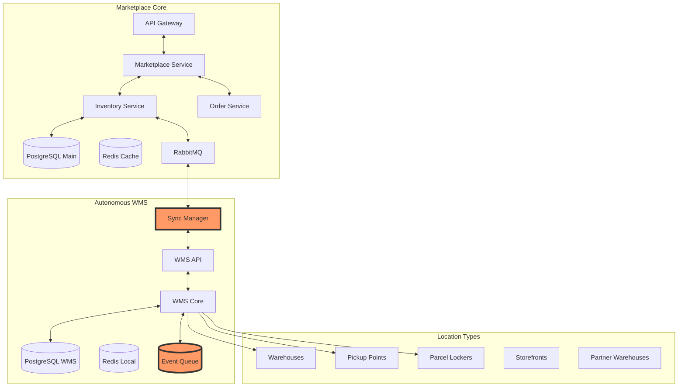
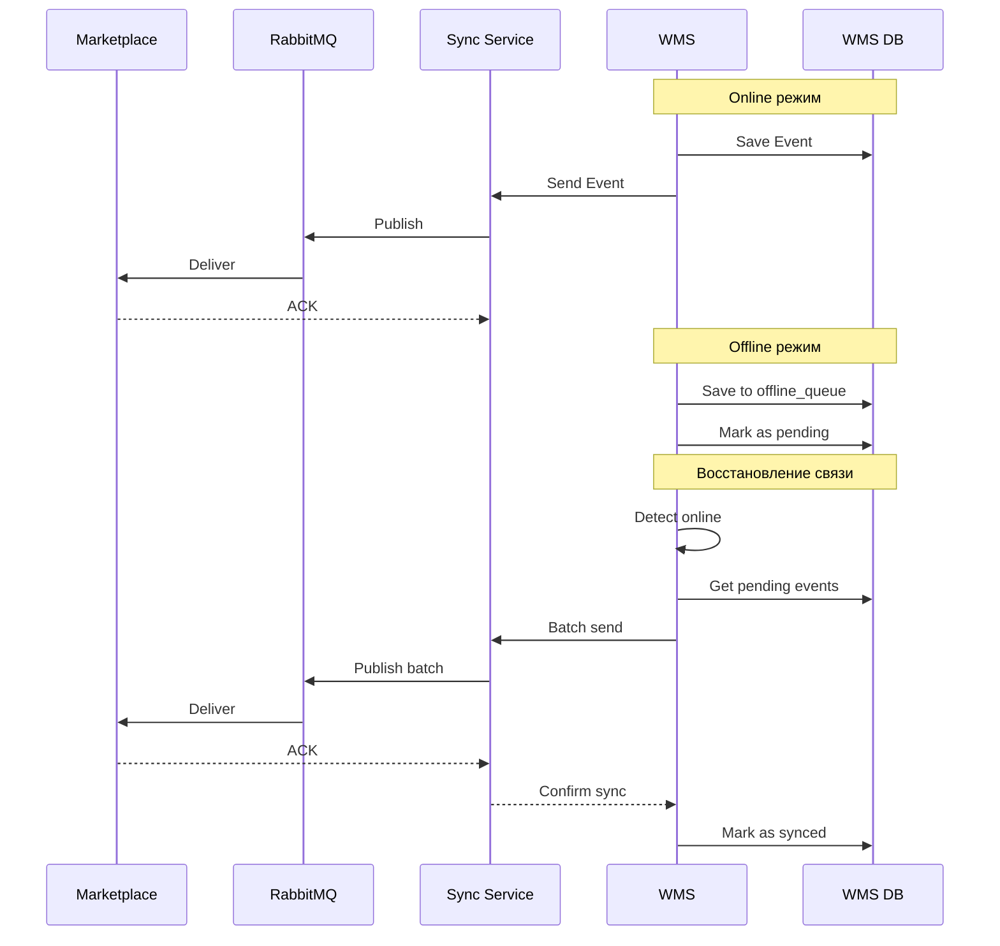

# 🚀 ЕДИНЫЙ ПЛАН РАЗВИТИЯ WMS И МАРКЕТПЛЕЙСА

## 📋 Оглавление
1. [Архитектура решения](#архитектура-решения)
2. [Автономная WMS система](#автономная-wms)
3. [Усовершенствование маркетплейса](#marketplace-enhancement)
4. [Синхронизация и отказоустойчивость](#синхронизация)
5. [Технологический стек](#технологии)
6. [План внедрения](#план-внедрения)
7. [Финансовая модель](#финансы)

## 🏗️ Архитектура решения {#архитектура-решения}

### Общая схема системы



### Ключевые принципы архитектуры

1. **Автономность WMS** - полная работоспособность при обрыве связи
2. **Event-driven синхронизация** - гарантированная доставка событий
3. **DDD для критичных доменов** - Warehouse, Inventory, Fulfillment
4. **CQRS для операций** - разделение команд и запросов
5. **Микросервисная готовность** - возможность выделения в отдельные сервисы

## 🏭 Автономная WMS система {#автономная-wms}

### Архитектура WMS с DDD

```
wms-service/
├── cmd/
│   ├── api/                    # HTTP API server
│   ├── worker/                  # Background workers
│   └── sync/                    # Синхронизация с маркетплейсом
│
├── internal/
│   ├── domain/                  # Доменный слой (DDD)
│   │   ├── warehouse/           # Bounded Context: Склад
│   │   │   ├── aggregate/       # Warehouse, Zone, Location
│   │   │   ├── entity/          # Bin, Shelf, Area
│   │   │   ├── value/           # LocationCode, Capacity
│   │   │   ├── repository/      # Интерфейсы репозиториев
│   │   │   └── service/         # Domain services
│   │   │
│   │   ├── inventory/           # Bounded Context: Остатки
│   │   │   ├── aggregate/       # Stock, Movement
│   │   │   ├── entity/          # StockItem, Reservation
│   │   │   ├── value/           # Quantity, SKU, Lot
│   │   │   └── event/           # StockMoved, StockReserved
│   │   │
│   │   ├── fulfillment/         # Bounded Context: Выполнение
│   │   │   ├── aggregate/       # PickingTask, PackingTask
│   │   │   ├── entity/          # PickingRoute, Package
│   │   │   ├── service/         # RouteOptimizer
│   │   │   └── saga/            # OrderFulfillmentSaga
│   │   │
│   │   └── shared/              # Shared Kernel
│   │       ├── event/           # BaseEvent, EventBus
│   │       └── specification/   # Common specifications
│   │
│   ├── application/             # Слой приложения
│   │   ├── command/             # CreateLocation, MoveStock
│   │   ├── query/               # GetAvailableStock, FindLocation
│   │   ├── handler/             # CommandHandlers, QueryHandlers
│   │   └── service/             # ApplicationServices
│   │
│   ├── infrastructure/          # Инфраструктура
│   │   ├── persistence/         # PostgreSQL repositories
│   │   ├── eventstore/          # Event persistence
│   │   ├── sync/                # Синхронизация с маркетплейсом
│   │   └── offline/             # Offline queue management
│   │
│   └── presentation/            # API слой
│       ├── rest/                # REST endpoints
│       ├── websocket/           # Real-time updates
│       └── mobile/              # Mobile API
```

### База данных WMS (автономная)

```sql
-- Схема для автономной WMS
CREATE SCHEMA wms;

-- ============================================
-- WAREHOUSE DOMAIN (Топология склада)
-- ============================================

CREATE TABLE wms.warehouses (
    id UUID PRIMARY KEY DEFAULT gen_random_uuid(),
    code VARCHAR(20) UNIQUE NOT NULL,
    name VARCHAR(255) NOT NULL,
    address TEXT NOT NULL,
    
    -- Конфигурация
    total_area_m2 NUMERIC(10,2),
    zones_config JSONB NOT NULL DEFAULT '[]',
    
    -- Синхронизация
    external_id BIGINT,  -- ID в маркетплейсе
    sync_version BIGINT DEFAULT 0,
    
    created_at TIMESTAMPTZ DEFAULT NOW(),
    updated_at TIMESTAMPTZ DEFAULT NOW()
);

CREATE TABLE wms.zones (
    id UUID PRIMARY KEY DEFAULT gen_random_uuid(),
    warehouse_id UUID NOT NULL REFERENCES wms.warehouses(id),
    code VARCHAR(10) NOT NULL,
    name VARCHAR(100),
    type VARCHAR(50) NOT NULL, -- 'receiving', 'storage', 'picking', 'shipping'
    
    -- Характеристики
    temperature_range INT4RANGE,
    humidity_range INT4RANGE,
    storage_class VARCHAR(30), -- 'standard', 'fragile', 'hazmat', 'cold'
    
    area_m2 NUMERIC(10,2),
    max_weight_kg NUMERIC(10,2),
    
    UNIQUE(warehouse_id, code)
);

CREATE TABLE wms.locations (
    id UUID PRIMARY KEY DEFAULT gen_random_uuid(),
    zone_id UUID NOT NULL REFERENCES wms.zones(id),
    code VARCHAR(30) NOT NULL, -- 'A-01-02-03'
    barcode VARCHAR(50) UNIQUE,
    
    -- Тип и размеры
    type VARCHAR(20) NOT NULL, -- 'floor', 'pallet', 'shelf', 'bin'
    width_cm INTEGER,
    height_cm INTEGER,
    depth_cm INTEGER,
    max_weight_kg NUMERIC(10,2),
    
    -- Статус
    is_available BOOLEAN DEFAULT true,
    is_locked BOOLEAN DEFAULT false,
    lock_reason VARCHAR(100),
    
    UNIQUE(zone_id, code)
);

-- ============================================
-- INVENTORY DOMAIN (Управление остатками)
-- ============================================

CREATE TABLE wms.stock (
    id UUID PRIMARY KEY DEFAULT gen_random_uuid(),
    location_id UUID NOT NULL REFERENCES wms.locations(id),
    
    -- Товар
    sku VARCHAR(100) NOT NULL,
    external_product_id BIGINT,
    external_variant_id BIGINT,
    
    -- Количества
    quantity INTEGER NOT NULL DEFAULT 0,
    reserved_quantity INTEGER NOT NULL DEFAULT 0,
    damaged_quantity INTEGER NOT NULL DEFAULT 0,
    available_quantity GENERATED ALWAYS AS 
        (quantity - reserved_quantity - damaged_quantity) STORED,
    
    -- Партионный учет
    lot_number VARCHAR(50),
    serial_numbers TEXT[],
    expiry_date DATE,
    manufacture_date DATE,
    
    -- Физические характеристики
    unit_weight_kg NUMERIC(8,3),
    unit_volume_m3 NUMERIC(8,6),
    
    -- Синхронизация
    sync_version BIGINT DEFAULT 0,
    last_synced_at TIMESTAMPTZ,
    
    created_at TIMESTAMPTZ DEFAULT NOW(),
    updated_at TIMESTAMPTZ DEFAULT NOW(),
    
    UNIQUE(location_id, sku, lot_number)
);

CREATE TABLE wms.stock_movements (
    id UUID PRIMARY KEY DEFAULT gen_random_uuid(),
    movement_number VARCHAR(32) UNIQUE NOT NULL,
    
    -- Движение
    from_location_id UUID REFERENCES wms.locations(id),
    to_location_id UUID REFERENCES wms.locations(id),
    sku VARCHAR(100) NOT NULL,
    quantity INTEGER NOT NULL,
    lot_number VARCHAR(50),
    
    -- Тип и причина
    type VARCHAR(30) NOT NULL, -- 'receiving', 'putaway', 'picking', 'transfer'
    reason VARCHAR(100),
    reference_type VARCHAR(30), -- 'order', 'task', 'adjustment'
    reference_id VARCHAR(100),
    
    -- Выполнение
    performed_by UUID,
    performed_at TIMESTAMPTZ DEFAULT NOW(),
    
    -- Для offline работы
    is_synced BOOLEAN DEFAULT false,
    sync_error TEXT
);

-- ============================================
-- FULFILLMENT DOMAIN (Выполнение заказов)
-- ============================================

CREATE TABLE wms.fulfillment_orders (
    id UUID PRIMARY KEY DEFAULT gen_random_uuid(),
    order_number VARCHAR(32) UNIQUE NOT NULL,
    external_order_id BIGINT,
    
    -- Тип выполнения
    fulfillment_type VARCHAR(30) NOT NULL, -- 'ship', 'pickup', 'transfer'
    priority INTEGER DEFAULT 0,
    
    -- Статус
    status VARCHAR(30) NOT NULL DEFAULT 'pending',
    -- 'pending', 'allocated', 'picking', 'packing', 'ready', 'shipped'
    
    -- Адрес доставки
    delivery_address JSONB,
    delivery_instructions TEXT,
    
    -- Временные рамки
    requested_date DATE,
    promised_date DATE,
    
    created_at TIMESTAMPTZ DEFAULT NOW(),
    updated_at TIMESTAMPTZ DEFAULT NOW()
);

CREATE TABLE wms.fulfillment_items (
    id UUID PRIMARY KEY DEFAULT gen_random_uuid(),
    order_id UUID NOT NULL REFERENCES wms.fulfillment_orders(id),
    
    sku VARCHAR(100) NOT NULL,
    external_product_id BIGINT,
    quantity_ordered INTEGER NOT NULL,
    quantity_allocated INTEGER DEFAULT 0,
    quantity_picked INTEGER DEFAULT 0,
    quantity_packed INTEGER DEFAULT 0,
    
    -- Аллокация
    allocated_from JSONB, -- [{"location_id": "...", "quantity": 2}]
    
    status VARCHAR(30) DEFAULT 'pending'
);

CREATE TABLE wms.picking_tasks (
    id UUID PRIMARY KEY DEFAULT gen_random_uuid(),
    task_number VARCHAR(32) UNIQUE NOT NULL,
    order_id UUID REFERENCES wms.fulfillment_orders(id),
    
    -- Назначение
    assigned_to UUID,
    assigned_at TIMESTAMPTZ,
    
    -- Маршрут
    picking_route JSONB NOT NULL,
    /* [{
        "sequence": 1,
        "location_code": "A-01-02",
        "sku": "SKU123",
        "quantity": 2,
        "picked": 0
    }] */
    
    -- Статус
    status VARCHAR(30) DEFAULT 'pending',
    started_at TIMESTAMPTZ,
    completed_at TIMESTAMPTZ,
    
    -- Метрики
    estimated_time_min INTEGER,
    actual_time_min INTEGER,
    distance_meters NUMERIC(10,2)
);

-- ============================================
-- EVENT STORE (для критичных операций)
-- ============================================

CREATE TABLE wms.domain_events (
    id UUID PRIMARY KEY DEFAULT gen_random_uuid(),
    aggregate_id UUID NOT NULL,
    aggregate_type VARCHAR(100) NOT NULL,
    event_type VARCHAR(100) NOT NULL,
    event_version INTEGER NOT NULL,
    
    -- Данные события
    payload JSONB NOT NULL,
    metadata JSONB,
    
    -- Синхронизация
    is_synced BOOLEAN DEFAULT false,
    sync_attempts INTEGER DEFAULT 0,
    sync_error TEXT,
    
    occurred_at TIMESTAMPTZ NOT NULL DEFAULT NOW(),
    
    INDEX idx_aggregate (aggregate_id, event_version),
    INDEX idx_sync_pending (is_synced, occurred_at) WHERE NOT is_synced
);

-- ============================================
-- OFFLINE QUEUE (для работы без связи)
-- ============================================

CREATE TABLE wms.offline_queue (
    id UUID PRIMARY KEY DEFAULT gen_random_uuid(),
    operation_type VARCHAR(50) NOT NULL,
    payload JSONB NOT NULL,
    
    -- Приоритет и попытки
    priority INTEGER DEFAULT 0,
    max_retries INTEGER DEFAULT 3,
    retry_count INTEGER DEFAULT 0,
    
    -- Статус
    status VARCHAR(20) DEFAULT 'pending',
    error_message TEXT,
    
    created_at TIMESTAMPTZ DEFAULT NOW(),
    processed_at TIMESTAMPTZ,
    
    INDEX idx_pending_priority (status, priority DESC) 
        WHERE status = 'pending'
);
```

### Механизм автономной работы

```go
package sync

import (
    "context"
    "time"
    "github.com/jackc/pgx/v4/pgxpool"
)

// OfflineManager управляет работой в offline режиме
type OfflineManager struct {
    db           *pgxpool.Pool
    isOnline     bool
    eventQueue   chan DomainEvent
    syncQueue    chan SyncOperation
}

// Проверка связи с маркетплейсом
func (om *OfflineManager) CheckConnectivity(ctx context.Context) {
    ticker := time.NewTicker(10 * time.Second)
    defer ticker.Stop()
    
    for {
        select {
        case <-ctx.Done():
            return
        case <-ticker.C:
            wasOnline := om.isOnline
            om.isOnline = om.pingMarketplace()
            
            if !wasOnline && om.isOnline {
                // Восстановление связи - запускаем синхронизацию
                go om.syncPendingEvents()
                go om.processPendingQueue()
            }
        }
    }
}

// Сохранение события для последующей синхронизации
func (om *OfflineManager) SaveEvent(event DomainEvent) error {
    query := `
        INSERT INTO wms.domain_events 
        (aggregate_id, aggregate_type, event_type, event_version, 
         payload, metadata, occurred_at, is_synced)
        VALUES ($1, $2, $3, $4, $5, $6, $7, $8)
    `
    
    _, err := om.db.Exec(context.Background(), query,
        event.AggregateID,
        event.AggregateType,
        event.EventType,
        event.Version,
        event.Payload,
        event.Metadata,
        event.OccurredAt,
        om.isOnline, // Если online - сразу помечаем для синхронизации
    )
    
    if err != nil {
        return err
    }
    
    // Если online - отправляем в очередь синхронизации
    if om.isOnline {
        select {
        case om.eventQueue <- event:
        default:
            // Очередь полна - сохраним в offline_queue
            om.queueForLaterSync(event)
        }
    }
    
    return nil
}

// Синхронизация накопленных событий
func (om *OfflineManager) syncPendingEvents() error {
    query := `
        SELECT id, aggregate_id, aggregate_type, event_type, 
               payload, metadata, occurred_at
        FROM wms.domain_events
        WHERE NOT is_synced
        ORDER BY occurred_at
        LIMIT 100
    `
    
    rows, err := om.db.Query(context.Background(), query)
    if err != nil {
        return err
    }
    defer rows.Close()
    
    var events []DomainEvent
    for rows.Next() {
        var event DomainEvent
        err := rows.Scan(&event.ID, &event.AggregateID, 
            &event.AggregateType, &event.EventType,
            &event.Payload, &event.Metadata, &event.OccurredAt)
        if err != nil {
            continue
        }
        events = append(events, event)
    }
    
    // Отправляем события в маркетплейс
    for _, event := range events {
        if err := om.sendToMarketplace(event); err != nil {
            // Логируем ошибку, но продолжаем
            om.logSyncError(event.ID, err)
        } else {
            // Помечаем как синхронизированное
            om.markAsSynced(event.ID)
        }
    }
    
    return nil
}
```

## 🛍️ Усовершенствование маркетплейса {#marketplace-enhancement}

### Расширение системы инвентаря

```sql
-- ============================================
-- MARKETPLACE: Расширение существующих таблиц
-- ============================================

-- Типы локаций в системе
CREATE TYPE location_type AS ENUM (
    'warehouse',        -- Склад маркетплейса
    'pickup_point',     -- Пункт выдачи
    'parcel_locker',    -- Почтомат
    'storefront',       -- Витрина продавца
    'partner_warehouse' -- Склад партнера
);

-- Универсальная таблица локаций
CREATE TABLE inventory_locations (
    id BIGSERIAL PRIMARY KEY,
    code VARCHAR(50) UNIQUE NOT NULL,
    name VARCHAR(255) NOT NULL,
    type location_type NOT NULL,
    
    -- Связи
    storefront_id INTEGER REFERENCES storefronts(id),
    parent_location_id BIGINT REFERENCES inventory_locations(id),
    
    -- Адрес
    address TEXT NOT NULL,
    city VARCHAR(100),
    postal_code VARCHAR(20),
    latitude NUMERIC(10,8),
    longitude NUMERIC(11,8),
    
    -- Возможности
    capabilities JSONB DEFAULT '{}',
    working_hours JSONB DEFAULT '{}',
    
    -- Интеграция
    integration_type VARCHAR(30), -- 'wms', 'api', 'manual'
    integration_endpoint TEXT,
    integration_credentials JSONB, -- зашифровано
    
    -- Статус
    is_active BOOLEAN DEFAULT true,
    reliability_score NUMERIC(3,2) DEFAULT 1.0,
    
    created_at TIMESTAMPTZ DEFAULT NOW(),
    updated_at TIMESTAMPTZ DEFAULT NOW()
);

-- Виртуальные остатки (агрегированные по всем локациям)
CREATE TABLE inventory_virtual_stock (
    id BIGSERIAL PRIMARY KEY,
    product_id BIGINT NOT NULL REFERENCES storefront_products(id),
    variant_id BIGINT REFERENCES storefront_product_variants(id),
    
    -- Агрегированные остатки
    total_quantity INTEGER NOT NULL DEFAULT 0,
    total_reserved INTEGER NOT NULL DEFAULT 0,
    total_available GENERATED ALWAYS AS 
        (total_quantity - total_reserved) STORED,
    
    -- Распределение по локациям
    location_breakdown JSONB DEFAULT '[]',
    /* [{
        "location_id": 1,
        "location_code": "WH001",
        "quantity": 50,
        "reserved": 10,
        "available": 40
    }] */
    
    -- Оптимальная локация для новых заказов
    preferred_location_id BIGINT REFERENCES inventory_locations(id),
    
    -- Синхронизация
    last_sync_at TIMESTAMPTZ,
    sync_version BIGINT DEFAULT 0,
    
    created_at TIMESTAMPTZ DEFAULT NOW(),
    updated_at TIMESTAMPTZ DEFAULT NOW(),
    
    UNIQUE(product_id, variant_id)
);

-- Правила маршрутизации заказов
CREATE TABLE order_routing_rules (
    id BIGSERIAL PRIMARY KEY,
    name VARCHAR(255) NOT NULL,
    
    -- Условия применения
    conditions JSONB NOT NULL DEFAULT '{}',
    /* {
        "customer_city": ["Belgrade", "Novi Sad"],
        "order_value_range": {"min": 1000, "max": 50000},
        "product_categories": [1, 2, 3],
        "time_of_day": {"from": "09:00", "to": "18:00"}
    } */
    
    -- Стратегия
    strategy VARCHAR(30) NOT NULL,
    -- 'nearest', 'cheapest', 'fastest', 'load_balanced'
    
    strategy_params JSONB DEFAULT '{}',
    
    priority INTEGER DEFAULT 0,
    is_active BOOLEAN DEFAULT true,
    
    created_at TIMESTAMPTZ DEFAULT NOW()
);

-- Расширяем существующие резервирования
ALTER TABLE inventory_reservations
ADD COLUMN location_id BIGINT REFERENCES inventory_locations(id),
ADD COLUMN fulfillment_type VARCHAR(30) DEFAULT 'delivery';

-- Расширяем заказы
ALTER TABLE storefront_orders
ADD COLUMN routing_decision JSONB,
ADD COLUMN fulfillment_location_id BIGINT REFERENCES inventory_locations(id),
ADD COLUMN pickup_location_id BIGINT REFERENCES inventory_locations(id),
ADD COLUMN pickup_code VARCHAR(20);
```

### Сервисы маркетплейса

```go
package inventory

import (
    "context"
    "encoding/json"
    "time"
)

// InventoryService - улучшенный сервис управления остатками
type InventoryService struct {
    db           *pgxpool.Pool
    wmsClient    WMSClient
    cache        *redis.Client
    eventBus     EventBus
}

// CheckMultiLocationAvailability проверяет наличие на всех локациях
func (s *InventoryService) CheckMultiLocationAvailability(
    ctx context.Context,
    productID int64,
    quantity int,
) (*AvailabilityResult, error) {
    
    // 1. Проверяем кэш
    cacheKey := fmt.Sprintf("availability:%d:%d", productID, quantity)
    if cached, err := s.cache.Get(ctx, cacheKey).Result(); err == nil {
        var result AvailabilityResult
        json.Unmarshal([]byte(cached), &result)
        return &result, nil
    }
    
    // 2. Запрашиваем виртуальные остатки
    var virtualStock VirtualStock
    err := s.db.QueryRow(ctx, `
        SELECT total_available, location_breakdown, preferred_location_id
        FROM inventory_virtual_stock
        WHERE product_id = $1
    `, productID).Scan(
        &virtualStock.TotalAvailable,
        &virtualStock.LocationBreakdown,
        &virtualStock.PreferredLocationID,
    )
    
    if err != nil {
        return nil, err
    }
    
    // 3. Проверяем достаточность
    if virtualStock.TotalAvailable < quantity {
        return &AvailabilityResult{
            Available: false,
            TotalQuantity: virtualStock.TotalAvailable,
        }, nil
    }
    
    // 4. Находим оптимальные локации
    locations := s.findOptimalLocations(
        virtualStock.LocationBreakdown,
        quantity,
    )
    
    result := &AvailabilityResult{
        Available:     true,
        TotalQuantity: virtualStock.TotalAvailable,
        Locations:     locations,
    }
    
    // 5. Кэшируем на 30 секунд
    s.cache.Set(ctx, cacheKey, result, 30*time.Second)
    
    return result, nil
}

// RouteOrder определяет оптимальную локацию для выполнения заказа
func (s *InventoryService) RouteOrder(
    ctx context.Context,
    order Order,
) (*RoutingDecision, error) {
    
    // 1. Получаем применимые правила
    rules, err := s.getApplicableRules(ctx, order)
    if err != nil {
        return nil, err
    }
    
    // 2. Для каждого товара определяем локацию
    var itemRoutings []ItemRouting
    
    for _, item := range order.Items {
        // Проверяем доступность
        availability, err := s.CheckMultiLocationAvailability(
            ctx, item.ProductID, item.Quantity,
        )
        
        if err != nil || !availability.Available {
            return nil, ErrInsufficientStock
        }
        
        // Выбираем локацию согласно правилам
        location := s.selectLocationByRules(
            availability.Locations,
            rules,
            order.DeliveryAddress,
        )
        
        // Резервируем на выбранной локации
        reservation, err := s.createReservation(ctx, 
            item.ProductID,
            item.Quantity,
            location.ID,
            order.ID,
        )
        
        if err != nil {
            // Откатываем предыдущие резервирования
            s.rollbackReservations(ctx, itemRoutings)
            return nil, err
        }
        
        itemRoutings = append(itemRoutings, ItemRouting{
            ProductID:     item.ProductID,
            Quantity:      item.Quantity,
            LocationID:    location.ID,
            LocationCode:  location.Code,
            ReservationID: reservation.ID,
        })
    }
    
    // 3. Создаем решение о маршрутизации
    decision := &RoutingDecision{
        OrderID:      order.ID,
        ItemRoutings: itemRoutings,
        Strategy:     rules[0].Strategy,
        CreatedAt:    time.Now(),
    }
    
    // 4. Сохраняем решение
    s.saveRoutingDecision(ctx, decision)
    
    // 5. Отправляем событие
    s.eventBus.Publish(OrderRoutedEvent{
        OrderID:  order.ID,
        Decision: decision,
    })
    
    // 6. Если локация - WMS, отправляем заказ туда
    for _, routing := range itemRoutings {
        location := s.getLocation(ctx, routing.LocationID)
        if location.Type == "warehouse" && 
           location.IntegrationType == "wms" {
            s.wmsClient.CreateFulfillmentOrder(ctx, order, routing)
        }
    }
    
    return decision, nil
}

// Синхронизация остатков с WMS
func (s *InventoryService) SyncWithWMS(ctx context.Context) error {
    // 1. Получаем все WMS локации
    wmsLocations, err := s.getWMSLocations(ctx)
    if err != nil {
        return err
    }
    
    for _, location := range wmsLocations {
        // 2. Запрашиваем актуальные остатки
        stockData, err := s.wmsClient.GetStock(ctx, location.ID)
        if err != nil {
            // Логируем, но продолжаем с другими
            log.Printf("Failed to sync with %s: %v", location.Code, err)
            continue
        }
        
        // 3. Обновляем виртуальные остатки
        for _, item := range stockData {
            err = s.updateVirtualStock(ctx, 
                item.ProductID,
                location.ID,
                item.Quantity,
                item.Reserved,
            )
            
            if err != nil {
                log.Printf("Failed to update stock: %v", err)
            }
        }
        
        // 4. Отмечаем время синхронизации
        s.updateSyncTimestamp(ctx, location.ID)
    }
    
    return nil
}
```

## 🔄 Синхронизация и отказоустойчивость {#синхронизация}

### Архитектура синхронизации



### Реализация Sync Service

```go
package sync

// SyncService обеспечивает двустороннюю синхронизацию
type SyncService struct {
    marketplaceDB *pgxpool.Pool
    wmsClient     WMSClient
    eventBus      *amqp.Connection
    retryPolicy   RetryPolicy
}

// Обработка событий от WMS
func (s *SyncService) HandleWMSEvent(event WMSEvent) error {
    switch event.Type {
    case "StockMoved":
        return s.handleStockMoved(event)
    case "OrderPicked":
        return s.handleOrderPicked(event)
    case "OrderShipped":
        return s.handleOrderShipped(event)
    case "InventoryAdjusted":
        return s.handleInventoryAdjusted(event)
    default:
        log.Printf("Unknown event type: %s", event.Type)
    }
    return nil
}

// Обработка движения товара
func (s *SyncService) handleStockMoved(event WMSEvent) error {
    var payload StockMovedPayload
    if err := json.Unmarshal(event.Payload, &payload); err != nil {
        return err
    }
    
    // Начинаем транзакцию
    tx, err := s.marketplaceDB.Begin(context.Background())
    if err != nil {
        return err
    }
    defer tx.Rollback(context.Background())
    
    // Обновляем виртуальные остатки
    _, err = tx.Exec(context.Background(), `
        UPDATE inventory_virtual_stock
        SET location_breakdown = jsonb_set(
            location_breakdown,
            '{' || $2::text || ',quantity}',
            $3::jsonb
        ),
        last_sync_at = NOW(),
        sync_version = sync_version + 1
        WHERE product_id = $1
    `, payload.ProductID, payload.LocationID, payload.NewQuantity)
    
    if err != nil {
        return err
    }
    
    // Записываем движение
    _, err = tx.Exec(context.Background(), `
        INSERT INTO storefront_inventory_movements
        (product_id, location_id, quantity, movement_type, reference)
        VALUES ($1, $2, $3, $4, $5)
    `, payload.ProductID, payload.LocationID, 
       payload.Quantity, payload.MovementType, event.ID)
    
    if err != nil {
        return err
    }
    
    // Коммитим транзакцию
    return tx.Commit(context.Background())
}

// Retry механизм для надежности
func (s *SyncService) syncWithRetry(
    ctx context.Context,
    operation func() error,
) error {
    var lastErr error
    
    for attempt := 0; attempt < s.retryPolicy.MaxAttempts; attempt++ {
        if err := operation(); err != nil {
            lastErr = err
            
            // Экспоненциальная задержка
            delay := s.retryPolicy.BaseDelay * 
                    time.Duration(math.Pow(2, float64(attempt)))
            
            select {
            case <-ctx.Done():
                return ctx.Err()
            case <-time.After(delay):
                continue
            }
        }
        
        // Успешно выполнено
        return nil
    }
    
    return fmt.Errorf("sync failed after %d attempts: %w", 
                     s.retryPolicy.MaxAttempts, lastErr)
}
```

## 🛠️ Технологический стек {#технологии}

### Backend технологии

| Компонент | Технология | Обоснование |
|-----------|------------|-------------|
| **Язык** | Go 1.21+ | Производительность, конкурентность |
| **Web Framework** | Fiber v2 | Скорость, простота |
| **База данных** | PostgreSQL 15 | ACID, JSONB, партиционирование |
| **Кэш** | Redis 7 | In-memory, pub/sub |
| **Очереди** | RabbitMQ | Надежность, retry policies |
| **Event Store** | PostgreSQL + Kafka | Простота + масштабируемость |
| **API** | REST + gRPC | Внешний + внутренний |

### Frontend технологии

| Компонент | Технология | Применение |
|-----------|------------|------------|
| **Dashboard** | React 18 + TypeScript | Управление складом |
| **Mobile WMS** | React Native | Сканирование, picking |
| **PWA** | Next.js 15 | Offline-first для складов |
| **State** | Redux Toolkit + RTK Query | Синхронизация состояния |
| **UI** | Ant Design Pro | Готовые компоненты |

### DevOps и мониторинг

```yaml
Infrastructure:
  Container: Docker + Docker Compose
  Orchestration: Kubernetes (для production)
  CI/CD: GitLab CI / GitHub Actions
  
Monitoring:
  Metrics: Prometheus + Grafana
  Logs: ELK Stack (Elasticsearch, Logstash, Kibana)
  Tracing: Jaeger
  Alerts: AlertManager + PagerDuty

Security:
  Secrets: HashiCorp Vault
  SSL: Let's Encrypt
  WAF: Cloudflare
  Audit: PostgreSQL Audit Extension
```

## 📅 План внедрения {#план-внедрения}

### Этап 1: Фундамент (2 недели)

**Неделя 1: Инфраструктура**
- [ ] Настройка баз данных (main + WMS)
- [ ] Установка RabbitMQ
- [ ] Настройка Redis кластера
- [ ] CI/CD pipeline

**Неделя 2: Базовые сервисы**
- [ ] Inventory Service (маркетплейс)
- [ ] Sync Service
- [ ] WMS Core структура
- [ ] Event Bus

### Этап 2: WMS Core (3 недели)

**Неделя 3: Warehouse Domain**
- [ ] Топология склада
- [ ] Управление локациями
- [ ] Зоны и характеристики

**Неделя 4: Inventory Domain**
- [ ] Управление остатками
- [ ] Движения товаров
- [ ] Резервирования

**Неделя 5: Fulfillment Domain**
- [ ] Обработка заказов
- [ ] Picking задания
- [ ] Оптимизация маршрутов

### Этап 3: Интеграция (2 недели)

**Неделя 6: Синхронизация**
- [ ] Online синхронизация
- [ ] Offline queue
- [ ] Retry механизмы
- [ ] Conflict resolution

**Неделя 7: API и UI**
- [ ] REST API endpoints
- [ ] WebSocket real-time
- [ ] Dashboard базовый
- [ ] Mobile PWA

### Этап 4: Расширенный функционал (2 недели)

**Неделя 8: Множественные локации**
- [ ] Почтоматы интеграция
- [ ] Пункты выдачи
- [ ] Партнерские склады

**Неделя 9: Оптимизация**
- [ ] Алгоритмы маршрутизации
- [ ] Балансировка нагрузки
- [ ] Прогнозирование

### Этап 5: Production (1 неделя)

**Неделя 10: Запуск**
- [ ] Миграция данных
- [ ] Обучение персонала
- [ ] Мониторинг настройка
- [ ] Go-live

## 💰 Финансовая модель {#финансы}

### Затраты на разработку

| Статья | Количество | Ставка | Сумма |
|--------|------------|--------|-------|
| **Backend разработка** | 2 чел × 10 недель | €750/нед | €15,000 |
| **Frontend разработка** | 1 чел × 6 недель | €750/нед | €4,500 |
| **DevOps** | 1 чел × 3 недели | €800/нед | €2,400 |
| **Тестирование** | 1 чел × 4 недели | €600/нед | €2,400 |
| **PM/Аналитика** | 1 чел × 10 недель × 0.5 | €900/нед | €4,500 |
| **ИТОГО разработка** | | | **€28,800** |

### Инфраструктура (первый год)

| Компонент | Спецификация | Стоимость/мес | Год |
|-----------|--------------|---------------|-----|
| **Servers** | 3× VPS (8CPU, 32GB) | €300 | €3,600 |
| **Databases** | Managed PostgreSQL ×2 | €200 | €2,400 |
| **RabbitMQ** | Managed cluster | €100 | €1,200 |
| **Redis** | Managed cluster | €80 | €960 |
| **Monitoring** | Grafana Cloud | €50 | €600 |
| **Backup** | S3 storage | €30 | €360 |
| **ИТОГО инфраструктура** | | | **€9,120** |

### Экономический эффект

| Показатель | Текущее | После WMS | Экономия/мес |
|------------|---------|-----------|--------------|
| **Ошибки fulfillment** | 5% | 0.5% | €2,000 |
| **Скорость обработки** | 30 мин | 5 мин | €3,000 |
| **Оптимизация доставки** | - | -20% | €2,500 |
| **Управление остатками** | Manual | Auto | €1,500 |
| **Потери от stockout** | 3% | 0.5% | €2,000 |
| **ИТОГО экономия** | | | **€11,000/мес** |

### ROI анализ

```
Инвестиции первого года: €28,800 + €9,120 = €37,920
Экономия первого года: €11,000 × 12 = €132,000
ROI = (€132,000 - €37,920) / €37,920 = 248%
Окупаемость: 3.4 месяца
```

## 🎯 Ключевые метрики успеха

### Операционные KPI

| Метрика | Текущее | Цель | Срок |
|---------|---------|------|------|
| **Точность остатков** | 95% | 99.9% | 3 мес |
| **Скорость picking** | 30 мин | 10 мин | 2 мес |
| **Ошибки отгрузки** | 2% | 0.1% | 3 мес |
| **Utilization склада** | 60% | 85% | 6 мес |
| **Stockout rate** | 5% | 1% | 3 мес |

### Технические KPI

| Метрика | Цель | Критично |
|---------|------|----------|
| **API latency** | <100ms p99 | <500ms |
| **Sync delay** | <5 sec | <30 sec |
| **Offline capability** | 100% | 100% |
| **Data consistency** | 99.99% | 99.9% |
| **System uptime** | 99.9% | 99.5% |

## 📋 Риски и митигация

| Риск | Вероятность | Влияние | Митигация |
|------|-------------|---------|-----------|
| **Обрыв связи WMS** | Средняя | Высокое | Offline mode + queue |
| **Конфликты данных** | Низкая | Среднее | Event sourcing + версии |
| **Перегрузка синхронизации** | Средняя | Среднее | Батчинг + приоритеты |
| **Ошибки интеграции** | Средняя | Высокое | Retry + monitoring |
| **Масштабирование** | Низкая | Высокое | Микросервисы ready |

## ✅ Заключение

Данный план обеспечивает:

1. **Автономность WMS** - полная работоспособность без связи с маркетплейсом
2. **Правильный баланс DDD** - применяется только где критично (Warehouse, Inventory, Fulfillment)
3. **Масштабируемость** - поддержка неограниченного числа складов и точек выдачи
4. **Надежность** - Event Sourcing для критичных операций, retry механизмы
5. **Быстрая окупаемость** - 3.4 месяца с ROI 248%

Система спроектирована для постепенного внедрения без остановки текущих операций, с возможностью дальнейшего выделения в микросервисы при росте нагрузки.