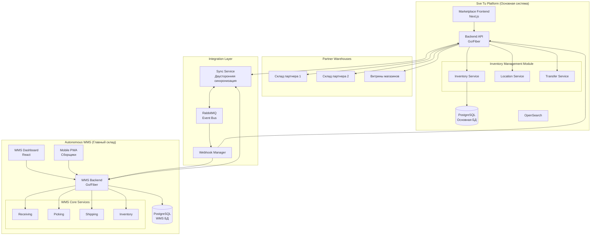
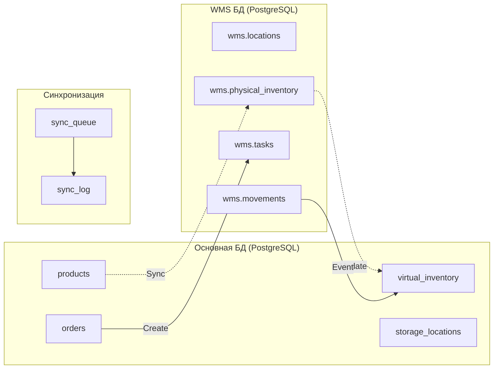

# 🏗️ Единый план внедрения системы управления складами и остатками

## 📋 Содержание
1. [Общая архитектура решения](#общая-архитектура)
2. [Разделение функций между системами](#разделение-функций)
3. [Автономная WMS для главного склада](#wms-система)
4. [Интеграция в основной проект](#интеграция-в-проект)
5. [API и протоколы синхронизации](#api-и-синхронизация)
6. [База данных и структура](#база-данных)
7. [План внедрения](#план-внедрения)
8. [Технологический стек](#технологический-стек)

## 🏛️ Общая архитектура решения {#общая-архитектура}



## 🎯 Разделение функций между системами {#разделение-функций}

### Основная платформа Sve Tu (Marketplace)

**Отвечает за:**
1. **Управление каталогом товаров**
   - Создание и редактирование товаров
   - Категории и атрибуты
   - Цены и описания
   - Медиа контент

2. **Управление витринами и партнерскими складами**
   - Регистрация складов партнеров
   - Настройка правил распределения
   - Мониторинг остатков партнеров
   - API для интеграции партнеров

3. **Обработка заказов**
   - Прием заказов от покупателей
   - Определение оптимального склада
   - Маршрутизация заказов
   - Статусы и трекинг

4. **Финансовые операции**
   - Платежи и расчеты
   - Комиссии и выплаты
   - Финансовая отчетность

5. **Клиентский интерфейс**
   - Витрина маркетплейса
   - Личные кабинеты
   - Корзина и чекаут

### Автономная WMS (Главный склад)

**Отвечает за:**
1. **Физическое управление складом**
   - Топология склада (зоны, стеллажи, ячейки)
   - Размещение товаров по локациям
   - Оптимизация использования пространства
   - ABC/XYZ анализ размещения

2. **Операционные процессы**
   - Приемка товаров
   - Инвентаризация
   - Сборка заказов (picking)
   - Упаковка (packing)
   - Отгрузка (shipping)
   - Обработка возвратов

3. **Управление персоналом склада**
   - Задания для сборщиков
   - KPI сотрудников
   - Планирование смен
   - Обучение и инструктажи

4. **Интеграция с оборудованием**
   - Сканеры штрих-кодов
   - Принтеры этикеток
   - Весы и измерители
   - Системы видеонаблюдения

## 🏭 Автономная WMS для главного склада {#wms-система}

### Архитектура WMS

```yaml
wms-system/
├── backend/
│   ├── cmd/
│   │   ├── api/              # HTTP API сервер
│   │   ├── worker/           # Background workers
│   │   ├── sync/             # Синхронизация с Sve Tu
│   │   └── migrator/         # Миграции БД
│   ├── internal/
│   │   ├── core/
│   │   │   ├── warehouse/    # Управление складом
│   │   │   ├── locations/    # Система локаций
│   │   │   ├── inventory/    # Физические остатки
│   │   │   └── tasks/        # Задания персоналу
│   │   ├── operations/
│   │   │   ├── receiving/    # Приемка
│   │   │   ├── putaway/      # Размещение
│   │   │   ├── picking/      # Сборка
│   │   │   ├── packing/      # Упаковка
│   │   │   ├── shipping/     # Отгрузка
│   │   │   └── returns/      # Возвраты
│   │   ├── integration/
│   │   │   ├── svetu/        # API клиент Sve Tu
│   │   │   ├── carriers/     # Курьерские службы
│   │   │   └── hardware/     # Оборудование
│   │   └── analytics/
│   │       ├── reports/      # Отчеты
│   │       ├── metrics/      # Метрики
│   │       └── forecasting/  # Прогнозирование
│   └── pkg/
│       ├── barcode/          # Работа со штрих-кодами
│       ├── optimizer/        # Оптимизация маршрутов
│       └── sync/             # Синхронизация данных
├── frontend/
│   ├── dashboard/            # Веб-панель управления
│   │   ├── src/
│   │   │   ├── modules/
│   │   │   │   ├── warehouse/
│   │   │   │   ├── operations/
│   │   │   │   ├── analytics/
│   │   │   │   └── settings/
│   │   │   └── shared/
│   └── mobile/               # PWA для сборщиков
│       ├── src/
│       │   ├── screens/
│       │   │   ├── picking/
│       │   │   ├── receiving/
│       │   │   ├── inventory/
│       │   │   └── tasks/
│       │   └── components/
│       │       ├── scanner/
│       │       ├── navigation/
│       │       └── offline/
└── database/
    ├── migrations/
    └── seeds/
```

### База данных WMS

```sql
-- Схема автономной БД WMS
CREATE SCHEMA wms;

-- Топология склада
CREATE TABLE wms.warehouses (
    id UUID PRIMARY KEY DEFAULT gen_random_uuid(),
    code VARCHAR(20) UNIQUE NOT NULL,
    name VARCHAR(255) NOT NULL,
    address TEXT,
    total_area_m2 NUMERIC(10,2),
    storage_area_m2 NUMERIC(10,2),
    configuration JSONB DEFAULT '{}',
    created_at TIMESTAMPTZ DEFAULT NOW()
);

CREATE TABLE wms.zones (
    id UUID PRIMARY KEY DEFAULT gen_random_uuid(),
    warehouse_id UUID REFERENCES wms.warehouses(id),
    code VARCHAR(10) NOT NULL,
    name VARCHAR(100),
    type VARCHAR(50), -- 'receiving', 'storage', 'picking', 'packing', 'shipping'
    temperature_range JSONB, -- {"min": -18, "max": -15}
    area_m2 NUMERIC(10,2),
    UNIQUE(warehouse_id, code)
);

CREATE TABLE wms.locations (
    id UUID PRIMARY KEY DEFAULT gen_random_uuid(),
    zone_id UUID REFERENCES wms.zones(id),
    code VARCHAR(20) NOT NULL, -- 'A-01-02-03'
    type VARCHAR(30), -- 'floor', 'pallet', 'shelf', 'bin'
    
    -- Размеры локации
    width_cm INTEGER,
    depth_cm INTEGER,
    height_cm INTEGER,
    max_weight_kg NUMERIC(10,2),
    
    -- Текущее состояние
    is_occupied BOOLEAN DEFAULT false,
    current_volume_percent INTEGER DEFAULT 0,
    current_weight_kg NUMERIC(10,2) DEFAULT 0,
    
    -- Ограничения
    allowed_categories INTEGER[], -- Разрешенные категории товаров
    storage_class VARCHAR(20), -- 'standard', 'fragile', 'hazmat', 'cold'
    
    barcode VARCHAR(50) UNIQUE,
    qr_code VARCHAR(100) UNIQUE,
    
    UNIQUE(zone_id, code)
);

-- Физические остатки на складе
CREATE TABLE wms.physical_inventory (
    id UUID PRIMARY KEY DEFAULT gen_random_uuid(),
    location_id UUID REFERENCES wms.locations(id),
    
    -- Связь с основной системой
    external_product_id BIGINT NOT NULL, -- ID из основной БД
    external_variant_id BIGINT,
    
    -- Локальные данные для быстрого доступа
    sku VARCHAR(100) NOT NULL,
    barcode VARCHAR(100),
    name VARCHAR(255) NOT NULL,
    
    -- Количество
    quantity INTEGER NOT NULL DEFAULT 0,
    reserved_quantity INTEGER NOT NULL DEFAULT 0,
    available_quantity GENERATED ALWAYS AS (quantity - reserved_quantity) STORED,
    
    -- Партионный учет
    lot_number VARCHAR(50),
    serial_numbers TEXT[], -- Для поштучного учета
    manufacture_date DATE,
    expiry_date DATE,
    
    -- Физические характеристики
    unit_weight_kg NUMERIC(8,3),
    unit_volume_m3 NUMERIC(8,6),
    
    -- Статус
    status VARCHAR(20) DEFAULT 'available', -- 'available', 'damaged', 'quarantine', 'blocked'
    condition_notes TEXT,
    
    last_counted_at TIMESTAMPTZ,
    last_movement_at TIMESTAMPTZ,
    created_at TIMESTAMPTZ DEFAULT NOW(),
    
    UNIQUE(location_id, external_product_id, external_variant_id, lot_number)
);

-- Задания для персонала
CREATE TABLE wms.tasks (
    id UUID PRIMARY KEY DEFAULT gen_random_uuid(),
    type VARCHAR(30) NOT NULL, -- 'receiving', 'putaway', 'picking', 'counting', etc
    priority INTEGER DEFAULT 0,
    status VARCHAR(20) DEFAULT 'pending',
    
    -- Назначение
    assigned_to UUID REFERENCES wms.users(id),
    assigned_at TIMESTAMPTZ,
    
    -- Выполнение
    started_at TIMESTAMPTZ,
    completed_at TIMESTAMPTZ,
    
    -- Детали задания
    details JSONB NOT NULL,
    
    -- Связь с заказом
    external_order_id BIGINT,
    
    -- Метрики
    estimated_duration_min INTEGER,
    actual_duration_min INTEGER,
    items_processed INTEGER,
    
    created_at TIMESTAMPTZ DEFAULT NOW()
);

-- Операции приемки
CREATE TABLE wms.receiving_orders (
    id UUID PRIMARY KEY DEFAULT gen_random_uuid(),
    receiving_number VARCHAR(32) UNIQUE NOT NULL,
    type VARCHAR(20), -- 'purchase', 'return', 'transfer'
    
    -- Поставщик или источник
    source_type VARCHAR(30), -- 'supplier', 'customer', 'warehouse'
    source_id INTEGER,
    source_name VARCHAR(255),
    
    -- Документы
    invoice_number VARCHAR(100),
    waybill_number VARCHAR(100),
    
    status VARCHAR(20) DEFAULT 'expected',
    expected_date DATE,
    received_date TIMESTAMPTZ,
    
    -- Связь с основной системой
    external_order_id BIGINT,
    
    created_at TIMESTAMPTZ DEFAULT NOW()
);

-- Детали приемки
CREATE TABLE wms.receiving_items (
    id UUID PRIMARY KEY DEFAULT gen_random_uuid(),
    receiving_order_id UUID REFERENCES wms.receiving_orders(id),
    
    external_product_id BIGINT NOT NULL,
    external_variant_id BIGINT,
    
    expected_quantity INTEGER NOT NULL,
    received_quantity INTEGER DEFAULT 0,
    damaged_quantity INTEGER DEFAULT 0,
    
    -- Размещение после приемки
    putaway_location_id UUID REFERENCES wms.locations(id),
    putaway_completed BOOLEAN DEFAULT false,
    
    notes TEXT
);

-- Сборка заказов
CREATE TABLE wms.picking_orders (
    id UUID PRIMARY KEY DEFAULT gen_random_uuid(),
    picking_number VARCHAR(32) UNIQUE NOT NULL,
    
    -- Связь с заказом из основной системы
    external_order_id BIGINT NOT NULL,
    external_order_number VARCHAR(32),
    
    priority INTEGER DEFAULT 0,
    status VARCHAR(20) DEFAULT 'pending',
    
    -- Оптимизированный маршрут
    picking_route JSONB, -- [{"sequence": 1, "location_id": "...", "items": [...]}, ...]
    
    picker_id UUID REFERENCES wms.users(id),
    started_at TIMESTAMPTZ,
    completed_at TIMESTAMPTZ,
    
    -- Метрики
    total_items INTEGER,
    picked_items INTEGER DEFAULT 0,
    walking_distance_m NUMERIC(10,2),
    
    created_at TIMESTAMPTZ DEFAULT NOW()
);

-- Движения товаров
CREATE TABLE wms.movements (
    id UUID PRIMARY KEY DEFAULT gen_random_uuid(),
    type VARCHAR(30) NOT NULL, -- 'receiving', 'putaway', 'picking', 'transfer', 'adjustment'
    
    from_location_id UUID REFERENCES wms.locations(id),
    to_location_id UUID REFERENCES wms.locations(id),
    
    external_product_id BIGINT NOT NULL,
    external_variant_id BIGINT,
    
    quantity INTEGER NOT NULL,
    lot_number VARCHAR(50),
    
    reason VARCHAR(100),
    reference_type VARCHAR(30), -- 'receiving_order', 'picking_order', 'cycle_count'
    reference_id UUID,
    
    performed_by UUID REFERENCES wms.users(id),
    performed_at TIMESTAMPTZ DEFAULT NOW()
);

-- Пользователи WMS
CREATE TABLE wms.users (
    id UUID PRIMARY KEY DEFAULT gen_random_uuid(),
    external_user_id INTEGER, -- ID из основной системы
    
    username VARCHAR(50) UNIQUE NOT NULL,
    full_name VARCHAR(255) NOT NULL,
    role VARCHAR(30) NOT NULL, -- 'admin', 'manager', 'picker', 'receiver'
    
    -- Для мобильного приложения
    pin_code VARCHAR(6), -- Быстрый вход по PIN
    device_id VARCHAR(100), -- ID устройства
    
    is_active BOOLEAN DEFAULT true,
    last_login_at TIMESTAMPTZ,
    
    created_at TIMESTAMPTZ DEFAULT NOW()
);

-- Индексы для производительности
CREATE INDEX idx_locations_zone ON wms.locations(zone_id);
CREATE INDEX idx_locations_occupied ON wms.locations(is_occupied);
CREATE INDEX idx_inventory_location ON wms.physical_inventory(location_id);
CREATE INDEX idx_inventory_product ON wms.physical_inventory(external_product_id, external_variant_id);
CREATE INDEX idx_inventory_status ON wms.physical_inventory(status);
CREATE INDEX idx_tasks_assigned ON wms.tasks(assigned_to, status);
CREATE INDEX idx_tasks_type_status ON wms.tasks(type, status);
CREATE INDEX idx_picking_status ON wms.picking_orders(status, priority);
CREATE INDEX idx_movements_product ON wms.movements(external_product_id, external_variant_id);
CREATE INDEX idx_movements_date ON wms.movements(performed_at);
```

## 🔄 Интеграция в основной проект {#интеграция-в-проект}

### Изменения в основной БД Sve Tu

```sql
-- Расширение таблиц основной системы

-- 1. Типы складов
CREATE TYPE warehouse_type AS ENUM ('marketplace', 'partner', 'storefront');
CREATE TYPE warehouse_owner AS ENUM ('platform', 'partner', 'merchant');

-- 2. Регистрация всех складов в системе
CREATE TABLE storage_locations (
    id BIGSERIAL PRIMARY KEY,
    code VARCHAR(50) UNIQUE NOT NULL,
    name VARCHAR(255) NOT NULL,
    type warehouse_type NOT NULL,
    owner warehouse_owner NOT NULL,
    owner_id INTEGER, -- NULL для platform, ID партнера/продавца для остальных
    
    -- Адрес
    address TEXT NOT NULL,
    city VARCHAR(100),
    region VARCHAR(100),
    country CHAR(2) DEFAULT 'RS',
    postal_code VARCHAR(20),
    latitude NUMERIC(10,8),
    longitude NUMERIC(11,8),
    
    -- Интеграция
    integration_type VARCHAR(30), -- 'wms', 'api', 'manual', 'none'
    integration_config JSONB DEFAULT '{}', -- Настройки подключения
    
    -- Возможности
    capabilities JSONB DEFAULT '{}',
    /* {
        "can_store": true,
        "can_ship": true,
        "can_pickup": true,
        "can_return": true,
        "max_weight_kg": 10000,
        "max_volume_m3": 500,
        "temperature_controlled": false,
        "dangerous_goods": false
    } */
    
    -- Стоимость операций
    operation_costs JSONB DEFAULT '{}',
    /* {
        "storage_per_m3_day": 50,
        "handling_per_order": 100,
        "picking_per_item": 10
    } */
    
    -- Статус
    is_active BOOLEAN DEFAULT true,
    is_default BOOLEAN DEFAULT false,
    priority INTEGER DEFAULT 0,
    
    created_at TIMESTAMP WITH TIME ZONE DEFAULT CURRENT_TIMESTAMP,
    updated_at TIMESTAMP WITH TIME ZONE DEFAULT CURRENT_TIMESTAMP
);

-- 3. Виртуальные остатки (агрегированные)
CREATE TABLE inventory_virtual_stock (
    id BIGSERIAL PRIMARY KEY,
    product_id BIGINT NOT NULL REFERENCES storefront_products(id),
    variant_id BIGINT REFERENCES storefront_product_variants(id),
    location_id BIGINT NOT NULL REFERENCES storage_locations(id),
    
    -- Остатки
    quantity INTEGER NOT NULL DEFAULT 0,
    reserved_quantity INTEGER NOT NULL DEFAULT 0,
    in_transit_quantity INTEGER NOT NULL DEFAULT 0, -- В пути между складами
    available_quantity GENERATED ALWAYS AS (quantity - reserved_quantity) STORED,
    
    -- Синхронизация
    last_sync_at TIMESTAMP WITH TIME ZONE,
    sync_status VARCHAR(20) DEFAULT 'synced', -- 'synced', 'pending', 'error'
    sync_error TEXT,
    
    -- Пороги для этой локации
    min_stock_level INTEGER DEFAULT 0,
    reorder_point INTEGER,
    
    created_at TIMESTAMP WITH TIME ZONE DEFAULT CURRENT_TIMESTAMP,
    updated_at TIMESTAMP WITH TIME ZONE DEFAULT CURRENT_TIMESTAMP,
    
    UNIQUE(product_id, variant_id, location_id)
);

-- 4. Правила распределения заказов
CREATE TABLE order_routing_rules (
    id BIGSERIAL PRIMARY KEY,
    storefront_id INTEGER REFERENCES storefronts(id),
    
    name VARCHAR(255) NOT NULL,
    description TEXT,
    
    -- Условия применения правила
    conditions JSONB DEFAULT '{}',
    /* {
        "customer_region": ["Belgrade", "Novi Sad"],
        "order_value_min": 1000,
        "order_value_max": 50000,
        "product_categories": [1, 2, 3],
        "shipping_method": "express"
    } */
    
    -- Стратегия выбора склада
    routing_strategy VARCHAR(30) NOT NULL, -- 'nearest', 'cheapest', 'fastest', 'priority'
    
    -- Приоритетные склады
    preferred_locations INTEGER[], -- Массив ID складов
    excluded_locations INTEGER[], -- Исключенные склады
    
    -- Параметры стратегии
    strategy_params JSONB DEFAULT '{}',
    /* {
        "max_distance_km": 50,
        "max_shipping_cost": 500,
        "max_delivery_days": 3,
        "split_order_allowed": false
    } */
    
    priority INTEGER DEFAULT 0,
    is_active BOOLEAN DEFAULT true,
    
    created_at TIMESTAMP WITH TIME ZONE DEFAULT CURRENT_TIMESTAMP
);

-- 5. Маршрутизация заказов
CREATE TABLE order_fulfillment_routing (
    id BIGSERIAL PRIMARY KEY,
    order_id BIGINT NOT NULL REFERENCES storefront_orders(id),
    
    -- Результат маршрутизации
    selected_location_id BIGINT REFERENCES storage_locations(id),
    routing_rule_id BIGINT REFERENCES order_routing_rules(id),
    
    -- Альтернативные варианты
    alternative_locations JSONB DEFAULT '[]',
    /* [{
        "location_id": 2,
        "score": 85,
        "shipping_cost": 300,
        "delivery_days": 2
    }] */
    
    -- Решение о разделении заказа
    is_split BOOLEAN DEFAULT false,
    split_details JSONB DEFAULT '{}',
    
    routing_timestamp TIMESTAMP WITH TIME ZONE DEFAULT CURRENT_TIMESTAMP
);

-- 6. Синхронизация с WMS
CREATE TABLE wms_sync_queue (
    id BIGSERIAL PRIMARY KEY,
    entity_type VARCHAR(30) NOT NULL, -- 'product', 'order', 'inventory', 'return'
    entity_id BIGINT NOT NULL,
    operation VARCHAR(20) NOT NULL, -- 'create', 'update', 'delete', 'sync'
    
    payload JSONB NOT NULL,
    
    status VARCHAR(20) DEFAULT 'pending',
    attempts INTEGER DEFAULT 0,
    max_attempts INTEGER DEFAULT 3,
    
    last_error TEXT,
    
    created_at TIMESTAMP WITH TIME ZONE DEFAULT CURRENT_TIMESTAMP,
    processed_at TIMESTAMP WITH TIME ZONE,
    
    INDEX idx_sync_queue_status (status, created_at)
);

-- 7. События от WMS
CREATE TABLE wms_events (
    id BIGSERIAL PRIMARY KEY,
    event_type VARCHAR(50) NOT NULL,
    event_timestamp TIMESTAMP WITH TIME ZONE NOT NULL,
    
    -- Связанные сущности
    order_id BIGINT,
    product_id BIGINT,
    location_id BIGINT,
    
    -- Данные события
    payload JSONB NOT NULL,
    
    -- Обработка
    processed BOOLEAN DEFAULT false,
    processed_at TIMESTAMP WITH TIME ZONE,
    
    created_at TIMESTAMP WITH TIME ZONE DEFAULT CURRENT_TIMESTAMP,
    
    INDEX idx_wms_events_type (event_type, processed),
    INDEX idx_wms_events_order (order_id)
);
```

## 🔌 API и протоколы синхронизации {#api-и-синхронизация}

### 1. REST API для синхронизации

```yaml
# API endpoints WMS -> Marketplace
POST   /api/v1/wms/sync/inventory        # Обновление остатков
POST   /api/v1/wms/events/order-picked   # Заказ собран
POST   /api/v1/wms/events/order-shipped  # Заказ отправлен
POST   /api/v1/wms/events/return-received # Возврат получен
POST   /api/v1/wms/events/inventory-count # Результат инвентаризации

# API endpoints Marketplace -> WMS
POST   /api/v1/wms/orders/create         # Новый заказ на fulfillment
POST   /api/v1/wms/orders/cancel         # Отмена заказа
POST   /api/v1/wms/products/sync         # Синхронизация каталога
GET    /api/v1/wms/inventory/check       # Проверка остатков
POST   /api/v1/wms/returns/announce      # Уведомление о возврате
```

### 2. Event-driven архитектура

```go
// События через RabbitMQ
type EventBus struct {
    conn *amqp.Connection
    
    // Каналы событий
    MarketplaceEvents chan Event // События от маркетплейса
    WMSEvents        chan Event // События от WMS
}

// Типы событий
const (
    // От Marketplace к WMS
    EventNewOrder         = "order.created"
    EventOrderCancelled   = "order.cancelled"
    EventProductUpdated   = "product.updated"
    EventReturnRequested  = "return.requested"
    
    // От WMS к Marketplace
    EventInventoryUpdated = "inventory.updated"
    EventOrderPicked      = "order.picked"
    EventOrderPacked      = "order.packed"
    EventOrderShipped     = "order.shipped"
    EventReturnReceived   = "return.received"
    EventLowStock         = "inventory.low_stock"
)

// Структура события
type Event struct {
    ID        string                 `json:"id"`
    Type      string                 `json:"type"`
    Timestamp time.Time              `json:"timestamp"`
    Source    string                 `json:"source"` // "marketplace" или "wms"
    Data      map[string]interface{} `json:"data"`
    Metadata  EventMetadata          `json:"metadata"`
}

type EventMetadata struct {
    CorrelationID string `json:"correlation_id"`
    UserID        int    `json:"user_id,omitempty"`
    RetryCount    int    `json:"retry_count"`
}
```

### 3. Синхронизация данных

```go
// Сервис синхронизации в основной системе
type SyncService struct {
    db          *sql.DB
    wmsClient   WMSClient
    eventBus    *EventBus
    syncQueue   *SyncQueue
}

// Двусторонняя синхронизация остатков
func (s *SyncService) SyncInventory(ctx context.Context) error {
    // 1. Получаем изменения от WMS
    wmsInventory, err := s.wmsClient.GetInventoryUpdates(ctx, s.lastSyncTime)
    if err != nil {
        return err
    }
    
    // 2. Обновляем виртуальные остатки
    for _, item := range wmsInventory {
        err := s.updateVirtualStock(ctx, item)
        if err != nil {
            s.logSyncError(item, err)
            continue
        }
    }
    
    // 3. Отправляем изменения в WMS
    localChanges, err := s.getLocalInventoryChanges(ctx, s.lastSyncTime)
    if err != nil {
        return err
    }
    
    for _, change := range localChanges {
        err := s.wmsClient.UpdateInventory(ctx, change)
        if err != nil {
            s.syncQueue.AddRetry(change)
        }
    }
    
    // 4. Обновляем время синхронизации
    s.lastSyncTime = time.Now()
    
    return nil
}

// Обработка заказа с маршрутизацией
func (s *SyncService) RouteOrder(ctx context.Context, order Order) (*RoutingDecision, error) {
    // 1. Получаем правила маршрутизации
    rules, err := s.getRoutingRules(order.StorefrontID)
    if err != nil {
        return nil, err
    }
    
    // 2. Проверяем остатки на всех складах
    availability := make(map[int64]InventoryCheck)
    
    // Проверка WMS (главный склад)
    wmsCheck, err := s.wmsClient.CheckAvailability(ctx, order.Items)
    if err == nil {
        availability[WMS_LOCATION_ID] = wmsCheck
    }
    
    // Проверка партнерских складов
    for _, location := range s.getPartnerLocations() {
        check, err := s.checkPartnerInventory(ctx, location, order.Items)
        if err == nil {
            availability[location.ID] = check
        }
    }
    
    // 3. Выбираем оптимальный склад
    decision := s.selectOptimalLocation(order, availability, rules)
    
    // 4. Резервируем товары
    if decision.LocationID == WMS_LOCATION_ID {
        // Отправляем в WMS
        err = s.wmsClient.CreateFulfillmentOrder(ctx, order)
    } else {
        // Резервируем на партнерском складе
        err = s.reservePartnerInventory(ctx, decision.LocationID, order)
    }
    
    if err != nil {
        return nil, err
    }
    
    // 5. Сохраняем решение о маршрутизации
    s.saveRoutingDecision(order.ID, decision)
    
    return decision, nil
}
```

### 4. WebSocket для real-time обновлений

```typescript
// Frontend подписка на обновления
class InventoryWebSocket {
    private ws: WebSocket;
    private subscribers: Map<string, Set<(data: any) => void>>;
    
    connect() {
        this.ws = new WebSocket('wss://api.svetu.rs/ws/inventory');
        
        this.ws.onmessage = (event) => {
            const message = JSON.parse(event.data);
            this.handleMessage(message);
        };
    }
    
    // Подписка на изменения остатков товара
    subscribeToProduct(productId: string, callback: (stock: StockUpdate) => void) {
        this.send({
            action: 'subscribe',
            entity: 'product',
            id: productId
        });
        
        this.addSubscriber(`product:${productId}`, callback);
    }
    
    // Подписка на статус заказа
    subscribeToOrder(orderId: string, callback: (status: OrderStatus) => void) {
        this.send({
            action: 'subscribe',
            entity: 'order',
            id: orderId
        });
        
        this.addSubscriber(`order:${orderId}`, callback);
    }
    
    private handleMessage(message: any) {
        const key = `${message.entity}:${message.id}`;
        const subscribers = this.subscribers.get(key);
        
        if (subscribers) {
            subscribers.forEach(callback => callback(message.data));
        }
    }
}
```

## 💾 База данных и структура {#база-данных}

### Схема взаимодействия БД



## 📅 План внедрения {#план-внедрения}

### Фаза 1: Базовая инфраструктура (2 недели)

**Неделя 1-2:**
- [ ] Создание структуры проектов WMS
- [ ] Настройка БД и миграций для обеих систем
- [ ] Базовые модели данных
- [ ] Настройка RabbitMQ для событий
- [ ] CI/CD pipeline

### Фаза 2: WMS Core (4 недели)

**Неделя 3-4: Топология склада**
- [ ] Управление зонами и локациями
- [ ] Генерация штрих-кодов для локаций
- [ ] Интерфейс настройки склада
- [ ] 3D визуализация склада

**Неделя 5-6: Операции склада**
- [ ] Модуль приемки товаров
- [ ] Размещение по локациям
- [ ] Инвентаризация
- [ ] Перемещения между локациями

### Фаза 3: Интеграция систем (3 недели)

**Неделя 7-8: API и синхронизация**
- [ ] REST API endpoints
- [ ] Event bus implementation
- [ ] Sync service
- [ ] WebSocket server

**Неделя 9: Маршрутизация заказов**
- [ ] Правила распределения
- [ ] Алгоритм выбора склада
- [ ] Резервирование на разных складах

### Фаза 4: Fulfillment процессы (3 недели)

**Неделя 10-11: Сборка и упаковка**
- [ ] Оптимизация маршрутов picking
- [ ] Интерфейс сборщика (PWA)
- [ ] Сканирование и валидация
- [ ] Упаковка и маркировка

**Неделя 12: Отгрузка**
- [ ] Интеграция с курьерами
- [ ] Печать этикеток
- [ ] Трекинг отправлений

### Фаза 5: Расширенный функционал (2 недели)

**Неделя 13: Партнерские склады**
- [ ] API для партнеров
- [ ] Управление партнерскими складами
- [ ] Мониторинг остатков партнеров

**Неделя 14: Аналитика**
- [ ] Дашборды и отчеты
- [ ] KPI склада
- [ ] ABC/XYZ анализ
- [ ] Прогнозирование спроса

### Фаза 6: Тестирование и запуск (2 недели)

**Неделя 15: Тестирование**
- [ ] Интеграционное тестирование
- [ ] Нагрузочное тестирование
- [ ] UAT с пилотными пользователями

**Неделя 16: Production**
- [ ] Развертывание в production
- [ ] Миграция данных
- [ ] Обучение персонала
- [ ] Мониторинг и поддержка

## 🛠️ Технологический стек {#технологический-стек}

### Backend (обе системы)
```yaml
Core:
  - Language: Go 1.21+
  - Framework: Fiber v2
  - Database: PostgreSQL 15
  - Cache: Redis 7
  - Message Queue: RabbitMQ 3.12
  
API:
  - REST: OpenAPI 3.0
  - WebSocket: gorilla/websocket
  - gRPC: для внутренних сервисов
  
Monitoring:
  - Metrics: Prometheus + Grafana
  - Tracing: Jaeger
  - Logging: Elasticsearch + Kibana
  - Alerting: AlertManager
```

### Frontend
```yaml
Dashboard (Web):
  - Framework: React 18
  - Language: TypeScript 5
  - State: Redux Toolkit / Zustand
  - UI: Tailwind CSS + DaisyUI
  - Charts: Recharts
  - Tables: TanStack Table
  
Mobile (PWA):
  - Framework: Next.js 15
  - Offline: Service Workers + IndexedDB
  - Camera: WebRTC API
  - Scanner: QuaggaJS / ZXing
  - Push: Web Push API
```

### DevOps
```yaml
Containerization:
  - Docker 24
  - Docker Compose for dev
  
Orchestration:
  - Kubernetes 1.28
  - Helm charts
  
CI/CD:
  - GitLab CI / GitHub Actions
  - ArgoCD for GitOps
  
Infrastructure:
  - Terraform for IaC
  - Ansible for configuration
```

## 📊 Метрики успеха

### KPI системы
| Метрика | Целевое значение | Измерение |
|---------|------------------|-----------|
| Точность остатков | > 99.5% | Ежедневно |
| Время обработки заказа | < 2 часа | Real-time |
| Точность сборки | > 99.9% | По заказам |
| Utilization склада | > 80% | Еженедельно |
| Скорость синхронизации | < 1 сек | Real-time |
| Uptime системы | > 99.9% | Постоянно |

### Бизнес-метрики
| Показатель | Ожидаемое улучшение |
|------------|---------------------|
| Скорость доставки | -30% времени |
| Стоимость fulfillment | -20% затрат |
| Возвраты по ошибкам | -50% |
| Удовлетворенность клиентов | +25% NPS |
| Оборачиваемость запасов | +40% |

## 💰 Бюджет проекта

### Разработка
| Компонент | Трудозатраты | Стоимость |
|-----------|--------------|-----------|
| WMS Backend | 8 недель × 2 разработчика | €12,000 |
| WMS Frontend | 6 недель × 2 разработчика | €9,000 |
| Интеграция в Marketplace | 4 недели × 2 разработчика | €6,000 |
| Mobile PWA | 3 недели × 1 разработчик | €2,250 |
| DevOps & Infrastructure | 2 недели × 1 специалист | €1,500 |
| Тестирование | 3 недели × 1 QA | €2,250 |
| **Итого разработка** | | **€33,000** |

### Инфраструктура (первый год)
| Ресурс | Спецификация | Стоимость/год |
|--------|--------------|---------------|
| Серверы WMS | 2× VPS (8 CPU, 16GB RAM) | €2,400 |
| База данных | Managed PostgreSQL | €1,200 |
| RabbitMQ | Managed service | €600 |
| Monitoring | Grafana Cloud | €500 |
| Backup & Storage | S3-compatible | €300 |
| **Итого инфраструктура** | | **€5,000** |

### ROI анализ
| Показатель | Значение |
|------------|----------|
| Инвестиции (первый год) | €38,000 |
| Экономия на WMS лицензиях | €3,600/год |
| Экономия на операциях | €24,000/год |
| Дополнительная выручка | €36,000/год |
| **Окупаемость** | **8 месяцев** |
| **3-year ROI** | **290%** |

## 🎯 Результаты внедрения

### Технические преимущества
1. **Полная интеграция** - единая экосистема без швов
2. **Масштабируемость** - легкое добавление складов и партнеров
3. **Гибкость** - быстрая адаптация под бизнес-требования
4. **Контроль** - полный контроль над данными и процессами
5. **Автоматизация** - минимум ручного труда

### Бизнес-преимущества
1. **Снижение затрат** на 20-30% на fulfillment
2. **Ускорение доставки** - same-day delivery возможна
3. **Повышение точности** - меньше ошибок и возвратов
4. **Улучшение сервиса** - прозрачность для клиентов
5. **Конкурентное преимущество** - собственная логистика

## 📝 Заключение

Предложенная архитектура обеспечивает:

1. **Автономность WMS** - независимая работа главного склада даже при сбоях основной системы
2. **Единое управление** - централизованный контроль всех складов через основную платформу
3. **Гибкая интеграция** - легкое подключение партнерских складов
4. **Оптимальная маршрутизация** - автоматический выбор лучшего склада для каждого заказа
5. **Real-time синхронизация** - актуальные остатки во всех системах

Система спроектирована с учетом роста - от одного склада до сети из десятков локаций, от сотен заказов в день до десятков тысяч.