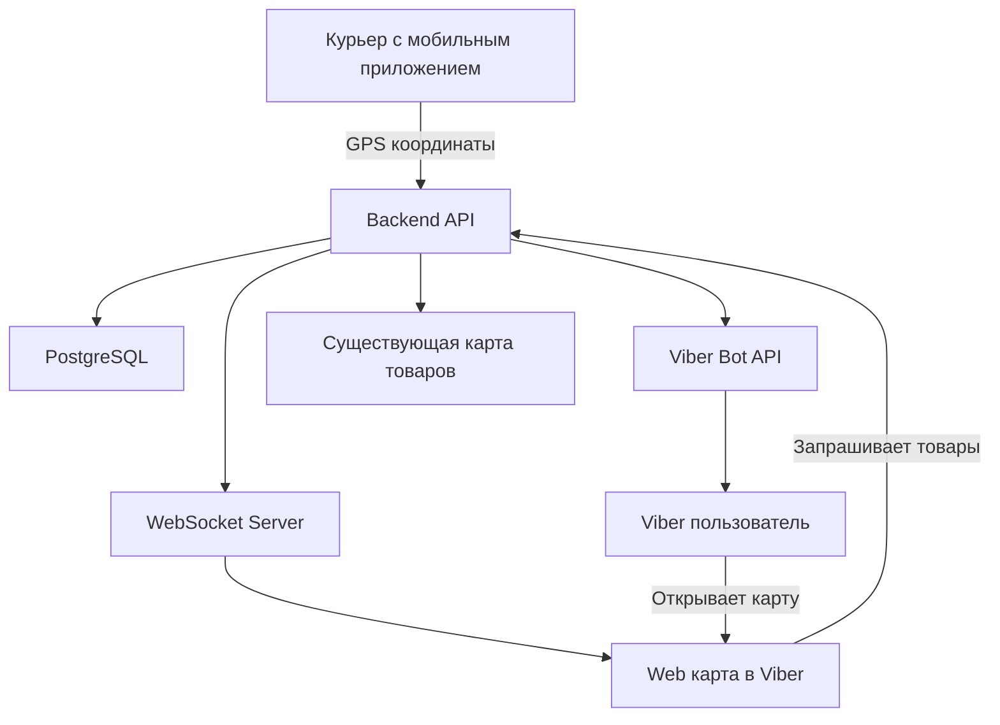

# 🚀 Viber Bot с трекингом курьера для SveTu Marketplace

## 📋 Основные требования

### Цель
Реализовать real-time трекинг курьера через Viber Bot с отображением товаров, объявлений и витрин на интерактивной карте Mapbox.

### Ключевые функции
1. **Rich Media уведомления** в Viber с превью карты
2. **Real-time трекинг** курьера на живой карте
3. **Отображение товаров** и витрин на той же карте
4. **WebSocket обновления** каждые 10-30 секунд
5. **Встроенный браузер** Viber для просмотра карты

## 🏗️ Архитектура системы



## 💾 Структура базы данных

### 1. Миграция для трекинга курьеров

```sql
-- migrations/000031_courier_tracking_system.up.sql

-- Таблица курьеров
CREATE TABLE couriers (
    id SERIAL PRIMARY KEY,
    user_id INT REFERENCES users(id),
    name VARCHAR(255) NOT NULL,
    phone VARCHAR(50),
    vehicle_type VARCHAR(50), -- 'bike', 'car', 'scooter', 'on_foot'
    is_online BOOLEAN DEFAULT false,
    is_available BOOLEAN DEFAULT true,
    current_latitude NUMERIC(10, 8),
    current_longitude NUMERIC(11, 8),
    last_location_update TIMESTAMP WITH TIME ZONE,
    created_at TIMESTAMP WITH TIME ZONE DEFAULT CURRENT_TIMESTAMP,
    updated_at TIMESTAMP WITH TIME ZONE DEFAULT CURRENT_TIMESTAMP
);

-- Таблица активных доставок
CREATE TABLE deliveries (
    id SERIAL PRIMARY KEY,
    order_id INT REFERENCES storefront_orders(id),
    courier_id INT REFERENCES couriers(id),
    status VARCHAR(50) NOT NULL, -- 'assigned', 'picked_up', 'in_transit', 'delivered', 'cancelled'
    pickup_address TEXT NOT NULL,
    pickup_latitude NUMERIC(10, 8),
    pickup_longitude NUMERIC(11, 8),
    delivery_address TEXT NOT NULL,
    delivery_latitude NUMERIC(10, 8),
    delivery_longitude NUMERIC(11, 8),
    estimated_delivery_time TIMESTAMP WITH TIME ZONE,
    actual_delivery_time TIMESTAMP WITH TIME ZONE,
    tracking_token VARCHAR(100) UNIQUE NOT NULL, -- для безопасного доступа к трекингу
    distance_meters INT,
    duration_seconds INT,
    created_at TIMESTAMP WITH TIME ZONE DEFAULT CURRENT_TIMESTAMP,
    updated_at TIMESTAMP WITH TIME ZONE DEFAULT CURRENT_TIMESTAMP
);

-- История локаций курьера
CREATE TABLE courier_location_history (
    id SERIAL PRIMARY KEY,
    delivery_id INT REFERENCES deliveries(id),
    courier_id INT REFERENCES couriers(id),
    latitude NUMERIC(10, 8) NOT NULL,
    longitude NUMERIC(11, 8) NOT NULL,
    speed_kmh NUMERIC(5, 2),
    heading INT, -- направление в градусах
    accuracy_meters NUMERIC(6, 2),
    recorded_at TIMESTAMP WITH TIME ZONE DEFAULT CURRENT_TIMESTAMP
);

-- Виберовские сессии трекинга
CREATE TABLE viber_tracking_sessions (
    id SERIAL PRIMARY KEY,
    viber_user_id INT REFERENCES viber_users(id),
    delivery_id INT REFERENCES deliveries(id),
    tracking_token VARCHAR(100) NOT NULL,
    started_at TIMESTAMP WITH TIME ZONE DEFAULT CURRENT_TIMESTAMP,
    last_viewed_at TIMESTAMP WITH TIME ZONE,
    is_active BOOLEAN DEFAULT true
);

-- Индексы для производительности
CREATE INDEX idx_couriers_location ON couriers(current_latitude, current_longitude) WHERE is_online = true;
CREATE INDEX idx_deliveries_status ON deliveries(status) WHERE status IN ('picked_up', 'in_transit');
CREATE INDEX idx_courier_location_history_delivery ON courier_location_history(delivery_id, recorded_at DESC);
CREATE INDEX idx_deliveries_tracking_token ON deliveries(tracking_token);

-- Триггер для автообновления updated_at
CREATE TRIGGER update_couriers_updated_at BEFORE UPDATE ON couriers
FOR EACH ROW EXECUTE FUNCTION update_updated_at_column();

CREATE TRIGGER update_deliveries_updated_at BEFORE UPDATE ON deliveries
FOR EACH ROW EXECUTE FUNCTION update_updated_at_column();
```

## 🤖 Viber Bot реализация

### 1. Rich Media сообщение с картой

```go
// backend/internal/proj/viber/tracking/notification.go
package tracking

import (
    "fmt"
    "encoding/json"
)

type TrackingNotification struct {
    viberService *viber.Service
    mapService   *MapboxService
}

func (tn *TrackingNotification) SendCourierDispatchedNotification(
    viberUserID string,
    delivery *Delivery,
    courier *Courier,
) error {
    // Генерируем статический снимок карты с маркером курьера
    mapPreviewURL := tn.mapService.GenerateStaticMapURL(
        courier.CurrentLatitude,
        courier.CurrentLongitude,
        delivery.DeliveryLatitude,
        delivery.DeliveryLongitude,
    )

    // Создаём Rich Media сообщение
    richMedia := tn.buildTrackingRichMedia(delivery, mapPreviewURL)

    return tn.viberService.SendRichMediaMessage(viberUserID, richMedia)
}

func (tn *TrackingNotification) buildTrackingRichMedia(
    delivery *Delivery,
    mapPreviewURL string,
) map[string]interface{} {
    // URL для открытия живой карты
    trackingURL := fmt.Sprintf(
        "https://svetu.rs/track/%s?viber=true",
        delivery.TrackingToken,
    )

    return map[string]interface{}{
        "Type": "rich_media",
        "ButtonsGroupColumns": 6,
        "ButtonsGroupRows": 7,
        "Buttons": []map[string]interface{}{
            {
                "Columns": 6,
                "Rows": 4,
                "ActionType": "none",
                "Image": mapPreviewURL,
            },
            {
                "Columns": 6,
                "Rows": 1,
                "ActionType": "none",
                "Text": fmt.Sprintf(
                    "📍 Курьер в пути к вам!\nОжидаемое время: %s",
                    delivery.EstimatedTime.Format("15:04"),
                ),
                "TextSize": "medium",
                "TextVAlign": "middle",
                "TextHAlign": "center",
            },
            {
                "Columns": 6,
                "Rows": 2,
                "ActionType": "open-url",
                "ActionBody": trackingURL,
                "Text": "🗺️ Отследить курьера",
                "TextSize": "large",
                "TextVAlign": "middle",
                "TextHAlign": "center",
                "BgColor": "#1976d2",
                "TextOpacity": 100,
            },
        },
    }
}
```

### 2. Статический превью карты через Mapbox

```go
// backend/internal/proj/viber/tracking/mapbox_service.go
package tracking

import (
    "fmt"
    "net/url"
)

type MapboxService struct {
    accessToken string
}

func (ms *MapboxService) GenerateStaticMapURL(
    courierLat, courierLng,
    deliveryLat, deliveryLng float64,
) string {
    // Маркер курьера (синий мотоцикл)
    courierMarker := fmt.Sprintf(
        "pin-l-bicycle+3b82f6(%f,%f)",
        courierLng, courierLat,
    )

    // Маркер места доставки (красный дом)
    deliveryMarker := fmt.Sprintf(
        "pin-l-home+ef4444(%f,%f)",
        deliveryLng, deliveryLat,
    )

    // Линия маршрута между точками
    path := fmt.Sprintf(
        "path-5+3b82f6-0.5(%f,%f,%f,%f)",
        courierLng, courierLat,
        deliveryLng, deliveryLat,
    )

    // Формируем URL для Mapbox Static API
    baseURL := "https://api.mapbox.com/styles/v1/mapbox/streets-v11/static"

    return fmt.Sprintf(
        "%s/%s,%s,%s/auto/600x400@2x?access_token=%s",
        baseURL,
        url.QueryEscape(path),
        url.QueryEscape(courierMarker),
        url.QueryEscape(deliveryMarker),
        ms.accessToken,
    )
}
```

## 🗺️ Веб-страница с живой картой

### 1. Frontend страница трекинга

```typescript
// frontend/svetu/src/app/[locale]/track/[token]/page.tsx
'use client';

import { useEffect, useRef, useState } from 'react';
import mapboxgl from 'mapbox-gl';
import { io, Socket } from 'socket.io-client';

interface CourierLocation {
  latitude: number;
  longitude: number;
  heading: number;
  speed: number;
  timestamp: string;
}

interface NearbyItem {
  id: number;
  type: 'product' | 'storefront';
  name: string;
  price?: number;
  latitude: number;
  longitude: number;
  image_url?: string;
}

export default function TrackingPage({
  params
}: {
  params: { token: string; locale: string }
}) {
  const mapContainer = useRef<HTMLDivElement>(null);
  const map = useRef<mapboxgl.Map | null>(null);
  const courierMarker = useRef<mapboxgl.Marker | null>(null);
  const socket = useRef<Socket | null>(null);

  const [courierLocation, setCourierLocation] = useState<CourierLocation | null>(null);
  const [deliveryInfo, setDeliveryInfo] = useState<any>(null);
  const [nearbyItems, setNearbyItems] = useState<NearbyItem[]>([]);
  const [estimatedTime, setEstimatedTime] = useState<string>('');

  useEffect(() => {
    // Инициализация карты
    if (!map.current && mapContainer.current) {
      map.current = new mapboxgl.Map({
        container: mapContainer.current,
        style: 'mapbox://styles/mapbox/streets-v12',
        center: [20.4489, 44.7866], // Белград по умолчанию
        zoom: 14
      });

      // Добавляем контролы
      map.current.addControl(new mapboxgl.NavigationControl(), 'top-right');
      map.current.addControl(
        new mapboxgl.GeolocateControl({
          positionOptions: { enableHighAccuracy: true },
          trackUserLocation: true,
          showUserHeading: true
        }),
        'top-right'
      );
    }

    // Подключение к WebSocket
    initWebSocket();

    // Загрузка информации о доставке
    fetchDeliveryInfo();

    // Загрузка ближайших товаров и витрин
    fetchNearbyItems();

    return () => {
      socket.current?.disconnect();
    };
  }, [params.token]);

  const initWebSocket = () => {
    socket.current = io(`${process.env.NEXT_PUBLIC_WS_URL}/tracking`, {
      query: { token: params.token },
      transports: ['websocket']
    });

    socket.current.on('courier_location', (data: CourierLocation) => {
      setCourierLocation(data);
      updateCourierMarker(data);
    });

    socket.current.on('delivery_status', (data: any) => {
      setDeliveryInfo(data);
      if (data.status === 'delivered') {
        showDeliveryComplete();
      }
    });

    socket.current.on('eta_update', (data: { eta: string }) => {
      setEstimatedTime(data.eta);
    });
  };

  const updateCourierMarker = (location: CourierLocation) => {
    if (!map.current) return;

    // Создаём или обновляем маркер курьера
    if (!courierMarker.current) {
      // Создаём элемент с иконкой курьера
      const el = document.createElement('div');
      el.className = 'courier-marker';
      el.innerHTML = `
        <div class="courier-icon-container">
          
          <div class="pulse-ring"></div>
        </div>
      `;

      courierMarker.current = new mapboxgl.Marker(el)
        .setLngLat([location.longitude, location.latitude])
        .addTo(map.current);
    } else {
      // Плавное перемещение маркера
      courierMarker.current.setLngLat([location.longitude, location.latitude]);
    }

    // Центрируем карту на курьере
    map.current.flyTo({
      center: [location.longitude, location.latitude],
      zoom: 16,
      essential: true,
      duration: 2000
    });
  };

  const fetchNearbyItems = async () => {
    if (!courierLocation) return;

    const response = await fetch(
      `/api/v1/map/nearby?lat=${courierLocation.latitude}&lng=${courierLocation.longitude}&radius=1000`
    );
    const data = await response.json();

    setNearbyItems(data.items);
    addItemsToMap(data.items);
  };

  const addItemsToMap = (items: NearbyItem[]) => {
    if (!map.current) return;

    // Добавляем слой с товарами и витринами
    items.forEach(item => {
      const el = document.createElement('div');
      el.className = `map-marker ${item.type}`;
      el.innerHTML = `
        <div class="marker-content">
          ${item.type === 'product' ? '📦' : '🏪'}
        </div>
      `;

      // Создаём попап с информацией
      const popup = new mapboxgl.Popup({ offset: 25 })
        .setHTML(`
          <div class="map-popup">
            ${item.image_url ? `` : ''}
            <h3>${item.name}</h3>
            ${item.price ? `<p class="price">${item.price} RSD</p>` : ''}
            <a href="/marketplace/${item.id}" target="_blank">Подробнее</a>
          </div>
        `);

      new mapboxgl.Marker(el)
        .setLngLat([item.longitude, item.latitude])
        .setPopup(popup)
        .addTo(map.current);
    });
  };

  return (
    <div className="tracking-container">
      {/* Информационная панель */}
      <div className="tracking-info-panel">
        <h2>📍 Отслеживание доставки</h2>

        {deliveryInfo && (
          <div className="delivery-details">
            <p>Заказ №{deliveryInfo.orderId}</p>
            <p>Курьер: {deliveryInfo.courierName}</p>
            <p>Статус: {deliveryInfo.status}</p>
          </div>
        )}

        {estimatedTime && (
          <div className="eta-badge">
            ⏱️ Ожидаемое время: {estimatedTime}
          </div>
        )}

        {courierLocation && (
          <div className="speed-info">
            🚴 Скорость: {courierLocation.speed} км/ч
          </div>
        )}

        {/* Список ближайших товаров */}
        <div className="nearby-items">
          <h3>Рядом с курьером:</h3>
          <div className="items-list">
            {nearbyItems.slice(0, 5).map(item => (
              <a
                key={item.id}
                href={`/marketplace/${item.id}`}
                className="nearby-item"
                target="_blank"
              >
                <span>{item.type === 'product' ? '📦' : '🏪'}</span>
                <span>{item.name}</span>
                {item.price && <span>{item.price} RSD</span>}
              </a>
            ))}
          </div>
        </div>
      </div>

      {/* Контейнер для карты */}
      <div ref={mapContainer} className="map-container" />

      {/* Стили */}
      <style jsx>{`
        .tracking-container {
          display: flex;
          height: 100vh;
          width: 100%;
        }

        .tracking-info-panel {
          width: 320px;
          background: white;
          padding: 20px;
          box-shadow: 2px 0 10px rgba(0,0,0,0.1);
          overflow-y: auto;
        }

        .map-container {
          flex: 1;
          position: relative;
        }

        .eta-badge {
          background: #3b82f6;
          color: white;
          padding: 12px;
          border-radius: 8px;
          margin: 16px 0;
          font-weight: bold;
          text-align: center;
        }

        .nearby-items {
          margin-top: 24px;
        }

        .items-list {
          display: flex;
          flex-direction: column;
          gap: 8px;
          margin-top: 12px;
        }

        .nearby-item {
          display: flex;
          justify-content: space-between;
          align-items: center;
          padding: 8px;
          background: #f3f4f6;
          border-radius: 6px;
          text-decoration: none;
          color: #111827;
          transition: background 0.2s;
        }

        .nearby-item:hover {
          background: #e5e7eb;
        }

        /* Мобильная версия */
        @media (max-width: 768px) {
          .tracking-container {
            flex-direction: column;
          }

          .tracking-info-panel {
            width: 100%;
            height: 200px;
            order: 2;
          }

          .map-container {
            height: calc(100vh - 200px);
            order: 1;
          }
        }
      `}</style>
    </div>
  );
}
```

### 2. CSS для анимированного маркера курьера

```css
/* frontend/svetu/src/styles/courier-tracking.css */

.courier-marker {
  width: 40px;
  height: 40px;
  cursor: pointer;
}

.courier-icon-container {
  position: relative;
  width: 100%;
  height: 100%;
}

.courier-icon-container img {
  width: 40px;
  height: 40px;
  filter: drop-shadow(0 2px 4px rgba(0,0,0,0.3));
}

/* Пульсирующее кольцо вокруг курьера */
.pulse-ring {
  position: absolute;
  top: 50%;
  left: 50%;
  transform: translate(-50%, -50%);
  width: 60px;
  height: 60px;
  border-radius: 50%;
  border: 3px solid #3b82f6;
  animation: pulse 2s linear infinite;
}

@keyframes pulse {
  0% {
    width: 40px;
    height: 40px;
    opacity: 1;
  }
  100% {
    width: 80px;
    height: 80px;
    opacity: 0;
  }
}

/* Маркеры товаров и витрин */
.map-marker.product {
  background: #fbbf24;
  border-radius: 50%;
  width: 30px;
  height: 30px;
  display: flex;
  align-items: center;
  justify-content: center;
  box-shadow: 0 2px 6px rgba(0,0,0,0.3);
  cursor: pointer;
}

.map-marker.storefront {
  background: #8b5cf6;
  border-radius: 50%;
  width: 35px;
  height: 35px;
  display: flex;
  align-items: center;
  justify-content: center;
  box-shadow: 0 2px 6px rgba(0,0,0,0.3);
  cursor: pointer;
}

/* Попапы на карте */
.mapboxgl-popup-content {
  padding: 0;
  border-radius: 8px;
  overflow: hidden;
}

.map-popup {
  padding: 12px;
  min-width: 200px;
}

.map-popup img {
  width: 100%;
  height: 120px;
  object-fit: cover;
  margin-bottom: 8px;
  border-radius: 4px;
}

.map-popup h3 {
  margin: 0 0 8px 0;
  font-size: 16px;
  font-weight: 600;
}

.map-popup .price {
  color: #059669;
  font-weight: bold;
  margin: 4px 0;
}

.map-popup a {
  display: inline-block;
  margin-top: 8px;
  padding: 6px 12px;
  background: #3b82f6;
  color: white;
  text-decoration: none;
  border-radius: 4px;
  font-size: 14px;
}

.map-popup a:hover {
  background: #2563eb;
}
```

## 🔌 WebSocket сервер для real-time обновлений

### Backend WebSocket реализация

```go
// backend/internal/proj/tracking/websocket.go
package tracking

import (
    "context"
    "encoding/json"
    "log"
    "time"

    "github.com/gofiber/websocket/v2"
    "github.com/gofiber/fiber/v2"
)

type TrackingHub struct {
    clients    map[string]map[*Client]bool // deliveryID -> clients
    broadcast  chan *LocationUpdate
    register   chan *Client
    unregister chan *Client
}

type Client struct {
    conn       *websocket.Conn
    deliveryID string
    send       chan []byte
}

type LocationUpdate struct {
    DeliveryID string    `json:"delivery_id"`
    Latitude   float64   `json:"latitude"`
    Longitude  float64   `json:"longitude"`
    Speed      float64   `json:"speed"`
    Heading    int       `json:"heading"`
    Timestamp  time.Time `json:"timestamp"`
}

func NewTrackingHub() *TrackingHub {
    return &TrackingHub{
        clients:    make(map[string]map[*Client]bool),
        broadcast:  make(chan *LocationUpdate),
        register:   make(chan *Client),
        unregister: make(chan *Client),
    }
}

func (h *TrackingHub) Run() {
    for {
        select {
        case client := <-h.register:
            if h.clients[client.deliveryID] == nil {
                h.clients[client.deliveryID] = make(map[*Client]bool)
            }
            h.clients[client.deliveryID][client] = true
            log.Printf("Client connected for delivery %s", client.deliveryID)

        case client := <-h.unregister:
            if clients, ok := h.clients[client.deliveryID]; ok {
                if _, ok := clients[client]; ok {
                    delete(clients, client)
                    close(client.send)
                    log.Printf("Client disconnected for delivery %s", client.deliveryID)
                }
            }

        case update := <-h.broadcast:
            // Отправляем обновление всем клиентам, отслеживающим эту доставку
            if clients, ok := h.clients[update.DeliveryID]; ok {
                message, _ := json.Marshal(map[string]interface{}{
                    "type": "courier_location",
                    "data": update,
                })

                for client := range clients {
                    select {
                    case client.send <- message:
                    default:
                        close(client.send)
                        delete(clients, client)
                    }
                }
            }
        }
    }
}

// WebSocket endpoint handler
func (h *TrackingHub) HandleWebSocket(c *websocket.Conn) {
    // Получаем token из query параметров
    token := c.Query("token")

    // Проверяем токен и получаем delivery_id
    delivery, err := h.validateTrackingToken(token)
    if err != nil {
        c.WriteMessage(websocket.TextMessage, []byte(`{"error":"Invalid token"}`))
        c.Close()
        return
    }

    client := &Client{
        conn:       c,
        deliveryID: delivery.ID,
        send:       make(chan []byte, 256),
    }

    h.register <- client

    // Отправляем начальную информацию
    h.sendInitialData(client, delivery)

    go client.writePump()
    client.readPump(h)
}

func (c *Client) writePump() {
    ticker := time.NewTicker(54 * time.Second)
    defer func() {
        ticker.Stop()
        c.conn.Close()
    }()

    for {
        select {
        case message, ok := <-c.send:
            c.conn.SetWriteDeadline(time.Now().Add(10 * time.Second))

            if !ok {
                c.conn.WriteMessage(websocket.CloseMessage, []byte{})
                return
            }

            if err := c.conn.WriteMessage(websocket.TextMessage, message); err != nil {
                return
            }

        case <-ticker.C:
            c.conn.SetWriteDeadline(time.Now().Add(10 * time.Second))
            if err := c.conn.WriteMessage(websocket.PingMessage, nil); err != nil {
                return
            }
        }
    }
}
```

### Сервис обновления координат курьера

```go
// backend/internal/proj/tracking/courier_service.go
package tracking

import (
    "context"
    "time"
)

type CourierService struct {
    db         *postgres.DB
    hub        *TrackingHub
    mapService *MapService
}

// Обновление местоположения курьера (вызывается из мобильного приложения курьера)
func (s *CourierService) UpdateCourierLocation(
    ctx context.Context,
    courierID int,
    lat, lng float64,
    speed float64,
    heading int,
) error {
    // Сохраняем в БД
    err := s.saveCourierLocation(ctx, courierID, lat, lng, speed, heading)
    if err != nil {
        return err
    }

    // Получаем активную доставку курьера
    delivery, err := s.getActiveDelivery(ctx, courierID)
    if err != nil || delivery == nil {
        return err
    }

    // Рассчитываем новое ETA
    eta := s.calculateETA(lat, lng, delivery.DeliveryLat, delivery.DeliveryLng, speed)

    // Отправляем через WebSocket
    update := &LocationUpdate{
        DeliveryID: delivery.ID,
        Latitude:   lat,
        Longitude:  lng,
        Speed:      speed,
        Heading:    heading,
        Timestamp:  time.Now(),
    }

    s.hub.broadcast <- update

    // Проверяем, прибыл ли курьер
    if s.isNearDestination(lat, lng, delivery.DeliveryLat, delivery.DeliveryLng) {
        s.notifyArrival(delivery.ID)
    }

    return nil
}

func (s *CourierService) calculateETA(
    currentLat, currentLng,
    destLat, destLng float64,
    currentSpeed float64,
) time.Time {
    // Расчёт расстояния
    distance := s.mapService.CalculateDistance(
        currentLat, currentLng,
        destLat, destLng,
    )

    // Если скорость слишком низкая, используем среднюю
    if currentSpeed < 5 {
        currentSpeed = 15 // средняя скорость велосипеда
    }

    // Время в минутах
    timeMinutes := (distance / 1000) / currentSpeed * 60

    return time.Now().Add(time.Duration(timeMinutes) * time.Minute)
}

func (s *CourierService) isNearDestination(
    currentLat, currentLng,
    destLat, destLng float64,
) bool {
    distance := s.mapService.CalculateDistance(
        currentLat, currentLng,
        destLat, destLng,
    )

    // Считаем "прибыл" если в радиусе 50 метров
    return distance < 50
}
```

## 📱 Мобильное приложение курьера

### React Native приложение для курьера

```typescript
// mobile/CourierApp/src/screens/DeliveryScreen.tsx
import React, { useEffect, useState } from 'react';
import {
  View,
  Text,
  StyleSheet,
  TouchableOpacity,
  Alert,
} from 'react-native';
import Geolocation from '@react-native-community/geolocation';
import BackgroundGeolocation from '@mauron85/react-native-background-geolocation';

interface DeliveryScreenProps {
  delivery: any;
  onComplete: () => void;
}

export const DeliveryScreen: React.FC<DeliveryScreenProps> = ({
  delivery,
  onComplete,
}) => {
  const [isTracking, setIsTracking] = useState(false);
  const [currentLocation, setCurrentLocation] = useState<any>(null);

  useEffect(() => {
    if (isTracking) {
      startLocationTracking();
    } else {
      stopLocationTracking();
    }

    return () => {
      BackgroundGeolocation.stop();
    };
  }, [isTracking]);

  const startLocationTracking = () => {
    BackgroundGeolocation.configure({
      desiredAccuracy: BackgroundGeolocation.HIGH_ACCURACY,
      stationaryRadius: 20,
      distanceFilter: 10,
      notificationTitle: 'Отслеживание доставки',
      notificationText: 'Включено',
      interval: 10000, // 10 секунд
      fastestInterval: 5000, // 5 секунд
      activitiesInterval: 10000,
      stopOnTerminate: false,
      startOnBoot: true,
      startForeground: true,
      locationProvider: BackgroundGeolocation.ACTIVITY_PROVIDER,
      url: `${API_URL}/api/v1/courier/location`,
      httpHeaders: {
        'Authorization': `Bearer ${authToken}`,
        'X-Delivery-ID': delivery.id,
      },
      postTemplate: {
        lat: '@latitude',
        lng: '@longitude',
        speed: '@speed',
        heading: '@bearing',
        accuracy: '@accuracy',
        timestamp: '@time',
      },
    });

    BackgroundGeolocation.on('location', (location) => {
      console.log('[LOCATION]', location);
      setCurrentLocation(location);

      // Отправляем локацию на сервер
      sendLocationUpdate(location);
    });

    BackgroundGeolocation.start();
  };

  const stopLocationTracking = () => {
    BackgroundGeolocation.stop();
  };

  const sendLocationUpdate = async (location: any) => {
    try {
      await fetch(`${API_URL}/api/v1/courier/location`, {
        method: 'POST',
        headers: {
          'Content-Type': 'application/json',
          'Authorization': `Bearer ${authToken}`,
        },
        body: JSON.stringify({
          delivery_id: delivery.id,
          latitude: location.latitude,
          longitude: location.longitude,
          speed: location.speed || 0,
          heading: location.bearing || 0,
          accuracy: location.accuracy,
        }),
      });
    } catch (error) {
      console.error('Failed to send location:', error);
    }
  };

  const handlePickupConfirm = () => {
    Alert.alert(
      'Подтвердить получение',
      'Вы получили заказ от продавца?',
      [
        { text: 'Отмена', style: 'cancel' },
        {
          text: 'Да',
          onPress: () => {
            updateDeliveryStatus('picked_up');
            setIsTracking(true);
          },
        },
      ],
    );
  };

  const handleDeliveryConfirm = () => {
    Alert.alert(
      'Подтвердить доставку',
      'Заказ доставлен покупателю?',
      [
        { text: 'Отмена', style: 'cancel' },
        {
          text: 'Да',
          onPress: () => {
            updateDeliveryStatus('delivered');
            setIsTracking(false);
            onComplete();
          },
        },
      ],
    );
  };

  return (
    <View style={styles.container}>
      <View style={styles.header}>
        <Text style={styles.title}>Доставка #{delivery.id}</Text>
        <Text style={styles.status}>
          {isTracking ? '🟢 Отслеживание включено' : '⚪ Ожидание'}
        </Text>
      </View>

      <View style={styles.addressCard}>
        <Text style={styles.label}>📍 Откуда:</Text>
        <Text style={styles.address}>{delivery.pickupAddress}</Text>
      </View>

      <View style={styles.addressCard}>
        <Text style={styles.label}>📍 Куда:</Text>
        <Text style={styles.address}>{delivery.deliveryAddress}</Text>
      </View>

      {currentLocation && (
        <View style={styles.locationInfo}>
          <Text style={styles.locationText}>
            Скорость: {Math.round(currentLocation.speed * 3.6)} км/ч
          </Text>
          <Text style={styles.locationText}>
            Точность: {Math.round(currentLocation.accuracy)} м
          </Text>
        </View>
      )}

      <View style={styles.actions}>
        {!isTracking ? (
          <TouchableOpacity
            style={[styles.button, styles.pickupButton]}
            onPress={handlePickupConfirm}
          >
            <Text style={styles.buttonText}>✅ Забрал заказ</Text>
          </TouchableOpacity>
        ) : (
          <TouchableOpacity
            style={[styles.button, styles.deliveryButton]}
            onPress={handleDeliveryConfirm}
          >
            <Text style={styles.buttonText}>📦 Доставлено</Text>
          </TouchableOpacity>
        )}
      </View>
    </View>
  );
};

const styles = StyleSheet.create({
  container: {
    flex: 1,
    backgroundColor: '#f3f4f6',
    padding: 16,
  },
  header: {
    backgroundColor: 'white',
    padding: 16,
    borderRadius: 12,
    marginBottom: 16,
  },
  title: {
    fontSize: 20,
    fontWeight: 'bold',
    marginBottom: 8,
  },
  status: {
    fontSize: 16,
    color: '#6b7280',
  },
  addressCard: {
    backgroundColor: 'white',
    padding: 16,
    borderRadius: 12,
    marginBottom: 12,
  },
  label: {
    fontSize: 14,
    color: '#6b7280',
    marginBottom: 4,
  },
  address: {
    fontSize: 16,
    fontWeight: '500',
  },
  locationInfo: {
    backgroundColor: '#dbeafe',
    padding: 12,
    borderRadius: 8,
    marginBottom: 16,
  },
  locationText: {
    fontSize: 14,
    color: '#1e40af',
  },
  actions: {
    marginTop: 'auto',
  },
  button: {
    padding: 16,
    borderRadius: 12,
    alignItems: 'center',
  },
  pickupButton: {
    backgroundColor: '#10b981',
  },
  deliveryButton: {
    backgroundColor: '#3b82f6',
  },
  buttonText: {
    color: 'white',
    fontSize: 18,
    fontWeight: 'bold',
  },
});
```

## 🔧 API endpoints

### Роуты для трекинга

```go
// backend/internal/server/routes.go

// Tracking routes
tracking := api.Group("/tracking")
tracking.Post("/courier/location", middleware.CourierAuth(), h.UpdateCourierLocation)
tracking.Get("/delivery/:token", h.GetDeliveryInfo)
tracking.Get("/ws", websocket.New(trackingHub.HandleWebSocket))

// Courier app routes
courier := api.Group("/courier", middleware.CourierAuth())
courier.Get("/active-delivery", h.GetActiveDelivery)
courier.Post("/delivery/:id/status", h.UpdateDeliveryStatus)
courier.Get("/deliveries/history", h.GetDeliveryHistory)
```

## 📊 Метрики и мониторинг

```go
// backend/internal/proj/tracking/metrics.go
package tracking

import (
    "github.com/prometheus/client_golang/prometheus"
)

var (
    activeDeliveries = prometheus.NewGauge(prometheus.GaugeOpts{
        Name: "tracking_active_deliveries",
        Help: "Number of active deliveries being tracked",
    })

    courierUpdatesPerSecond = prometheus.NewHistogram(prometheus.HistogramOpts{
        Name:    "tracking_courier_updates_per_second",
        Help:    "Number of location updates per second",
        Buckets: prometheus.LinearBuckets(0, 1, 30),
    })

    websocketConnections = prometheus.NewGauge(prometheus.GaugeOpts{
        Name: "tracking_websocket_connections",
        Help: "Number of active WebSocket connections",
    })

    averageDeliveryTime = prometheus.NewHistogram(prometheus.HistogramOpts{
        Name:    "tracking_average_delivery_time_minutes",
        Help:    "Average delivery time in minutes",
        Buckets: prometheus.LinearBuckets(0, 5, 12), // 0-60 минут
    })
)

func init() {
    prometheus.MustRegister(
        activeDeliveries,
        courierUpdatesPerSecond,
        websocketConnections,
        averageDeliveryTime,
    )
}
```

## 💰 Расчёт стоимости

### Viber Bot
- €100/месяц за бота
- ~€0.0045 за проактивное уведомление

### Mapbox
- 50,000 бесплатных загрузок карты в месяц
- 50,000 бесплатных Static Images API запросов
- После лимита: $5 за 1000 запросов

### Оценка для 1000 доставок/месяц:
- Viber Bot: €100
- Mapbox: Бесплатно (в пределах лимита)
- SMS fallback: €50 (резервные уведомления)
- **Итого: ~€150/месяц**

## 🚀 План развёртывания

### Фаза 1 (1 неделя)
- Настройка Viber Bot
- Базовая интеграция с заказами
- Создание БД структуры

### Фаза 2 (2 недели)
- WebSocket сервер
- Веб-страница трекинга
- Интеграция с Mapbox

### Фаза 3 (1 неделя)
- Мобильное приложение курьера
- Тестирование системы
- Оптимизация производительности

### Фаза 4 (1 неделя)
- Добавление товаров на карту
- A/B тестирование
- Запуск в продакшн

## 📝 Выводы

Система трекинга через Viber Bot обеспечит:
1. **Удобство** - пользователи не покидают Viber
2. **Real-time обновления** через WebSocket
3. **Дополнительные продажи** - показ товаров на карте
4. **Низкую стоимость** - €150/месяц для 1000 доставок
5. **Масштабируемость** - легко расширяется