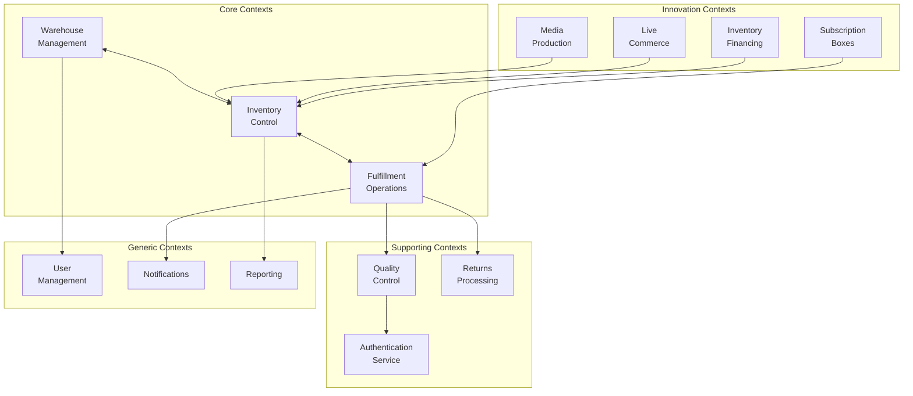

# 🏗️ DDD Архитектура WMS с инновационными сервисами

## 📋 Содержание
1. [Domain-Driven Design архитектура](#ddd-архитектура)
2. [Bounded Contexts](#bounded-contexts)
3. [Доменные модели и агрегаты](#доменные-модели)
4. [Инновационные сервисы](#инновационные-сервисы)
5. [Интеграция сервисов в DDD](#интеграция-сервисов)
6. [Техническая реализация](#техническая-реализация)
7. [База данных и Event Sourcing](#база-данных)
8. [Финансовая модель](#финансовая-модель)

## 🎯 Domain-Driven Design архитектура {#ddd-архитектура}

### Слоистая архитектура WMS

```
┌──────────────────────────────────────────────────────────┐
│                    Presentation Layer                      │
│  Web Dashboard | Mobile PWA | API Gateway | WebSockets    │
├──────────────────────────────────────────────────────────┤
│                    Application Layer                       │
│    Use Cases | Command Handlers | Query Handlers | DTOs   │
├──────────────────────────────────────────────────────────┤
│                      Domain Layer                          │
│  Entities | Value Objects | Aggregates | Domain Services  │
│  Domain Events | Specifications | Repositories (interfaces)│
├──────────────────────────────────────────────────────────┤
│                  Infrastructure Layer                      │
│  Persistence | Message Bus | External APIs | File Storage │
│  Email/SMS | Hardware Integration | Monitoring | Caching  │
└──────────────────────────────────────────────────────────┘
```

### Структура проекта с DDD

```yaml
wms-system/
├── cmd/
│   ├── api/                 # API сервер
│   ├── worker/              # Background workers  
│   └── event-processor/     # Обработчик событий
│
├── internal/
│   ├── domain/              # Доменный слой (ядро)
│   │   ├── warehouse/       # Bounded Context: Склад
│   │   ├── inventory/       # Bounded Context: Инвентарь
│   │   ├── fulfillment/     # Bounded Context: Выполнение заказов
│   │   ├── valueadded/      # Bounded Context: Value-Added сервисы
│   │   ├── quality/         # Bounded Context: Контроль качества
│   │   ├── media/           # Bounded Context: Медиа сервисы
│   │   ├── subscription/    # Bounded Context: Подписки
│   │   └── shared/          # Shared Kernel
│   │
│   ├── application/         # Слой приложения
│   │   ├── commands/        # Команды (write)
│   │   ├── queries/         # Запросы (read)
│   │   ├── services/        # Прикладные сервисы
│   │   └── sagas/           # Оркестрация процессов
│   │
│   ├── infrastructure/      # Инфраструктурный слой
│   │   ├── persistence/     # Реализация репозиториев
│   │   ├── eventstore/      # Event Sourcing
│   │   ├── messaging/       # RabbitMQ, Kafka
│   │   ├── http/            # HTTP клиенты
│   │   └── hardware/        # Интеграция с оборудованием
│   │
│   └── presentation/        # Презентационный слой
│       ├── rest/            # REST API
│       ├── grpc/            # gRPC сервисы
│       ├── websocket/       # WebSocket handlers
│       └── graphql/         # GraphQL schema
```

## 🔲 Bounded Contexts {#bounded-contexts}

### Context Map



### Детальное описание Bounded Contexts

#### 1. Warehouse Management Context
**Ответственность:** Физическая структура склада и его топология

```go
// Domain Layer
package warehouse

// Aggregate Root
type Warehouse struct {
    ID           WarehouseID
    Name         Name
    Address      Address
    Zones        []Zone
    Capacity     Capacity
    Status       Status
    CreatedAt    time.Time
    
    // Domain Events
    events       []domain.Event
}

// Entities
type Zone struct {
    ID           ZoneID
    Code         Code
    Type         ZoneType // receiving, storage, picking, packing, shipping
    Temperature  *TemperatureRange
    Locations    []Location
}

type Location struct {
    ID           LocationID
    Code         LocationCode // "A-01-02-03"
    Type         LocationType // floor, pallet, shelf, bin
    Dimensions   Dimensions
    MaxWeight    Weight
    IsOccupied   bool
    Restrictions LocationRestrictions
}

// Value Objects
type WarehouseID string
type LocationCode string
type Dimensions struct {
    Width  Measurement
    Height Measurement
    Depth  Measurement
}

// Domain Services
type LocationOptimizer interface {
    FindOptimalLocation(product Product, criteria OptimizationCriteria) (*Location, error)
    OptimizePickingRoute(items []PickItem) ([]Location, error)
}

// Repository Interface
type WarehouseRepository interface {
    Save(ctx context.Context, warehouse *Warehouse) error
    FindByID(ctx context.Context, id WarehouseID) (*Warehouse, error)
    FindAvailableLocations(ctx context.Context, criteria LocationCriteria) ([]*Location, error)
}
```

#### 2. Inventory Control Context
**Ответственность:** Управление остатками и их движениями

```go
package inventory

// Aggregate Root
type InventoryItem struct {
    ID              InventoryID
    ProductID       ProductID
    VariantID       *VariantID
    LocationID      LocationID
    Quantity        Quantity
    ReservedQty     Quantity
    AvailableQty    Quantity
    Lot             *LotInfo
    Status          InventoryStatus
    LastCountedAt   *time.Time
    
    // Invariants
    validateQuantities() error
}

// Methods with business logic
func (i *InventoryItem) Reserve(qty Quantity, orderID OrderID) (*Reservation, error) {
    if i.AvailableQty.LessThan(qty) {
        return nil, ErrInsufficientStock
    }
    
    reservation := &Reservation{
        ID:        GenerateReservationID(),
        ItemID:    i.ID,
        OrderID:   orderID,
        Quantity:  qty,
        ExpiresAt: time.Now().Add(2 * time.Hour),
        Status:    ReservationStatusActive,
    }
    
    i.ReservedQty = i.ReservedQty.Add(qty)
    i.AvailableQty = i.Quantity.Subtract(i.ReservedQty)
    
    i.addEvent(InventoryReservedEvent{
        ItemID:      i.ID,
        Quantity:    qty,
        OrderID:     orderID,
        Reservation: reservation,
    })
    
    return reservation, nil
}

func (i *InventoryItem) Move(to LocationID, qty Quantity, reason MovementReason) error {
    if qty.GreaterThan(i.AvailableQty) {
        return ErrInsufficientAvailableQty
    }
    
    movement := &Movement{
        ID:           GenerateMovementID(),
        From:         i.LocationID,
        To:           to,
        Quantity:     qty,
        Reason:       reason,
        PerformedAt:  time.Now(),
    }
    
    if qty.Equals(i.Quantity) {
        // Moving entire inventory
        i.LocationID = to
    } else {
        // Partial move - need to split
        i.Quantity = i.Quantity.Subtract(qty)
        i.AvailableQty = i.Quantity.Subtract(i.ReservedQty)
    }
    
    i.addEvent(InventoryMovedEvent{
        Movement: movement,
    })
    
    return nil
}

// Domain Service
type StockAllocationService struct {
    inventoryRepo InventoryRepository
    warehouseRepo warehouse.WarehouseRepository
}

func (s *StockAllocationService) AllocateStock(
    ctx context.Context,
    order Order,
    strategy AllocationStrategy,
) ([]Allocation, error) {
    // Complex business logic for multi-location allocation
    availableStock := s.inventoryRepo.FindAvailableStock(ctx, order.Items)
    
    allocations := strategy.Allocate(order, availableStock)
    
    for _, allocation := range allocations {
        item, err := s.inventoryRepo.FindByID(ctx, allocation.ItemID)
        if err != nil {
            return nil, err
        }
        
        _, err = item.Reserve(allocation.Quantity, order.ID)
        if err != nil {
            return nil, err
        }
        
        s.inventoryRepo.Save(ctx, item)
    }
    
    return allocations, nil
}
```

#### 3. Value-Added Services Context
**Ответственность:** Дополнительные сервисы (фото, проверка, персонализация)

```go
package valueadded

// Aggregate: Photo Session
type PhotoSession struct {
    ID          SessionID
    ProductID   ProductID
    Package     PhotoPackage
    Status      SessionStatus
    Photos      []Photo
    Photographer *PhotographerID
    StartedAt   *time.Time
    CompletedAt *time.Time
}

func (ps *PhotoSession) Start(photographer PhotographerID) error {
    if ps.Status != SessionStatusScheduled {
        return ErrInvalidSessionStatus
    }
    
    ps.Status = SessionStatusInProgress
    ps.Photographer = &photographer
    ps.StartedAt = ptr(time.Now())
    
    ps.addEvent(PhotoSessionStartedEvent{
        SessionID:    ps.ID,
        Photographer: photographer,
    })
    
    return nil
}

func (ps *PhotoSession) AddPhoto(photo Photo) error {
    if ps.Status != SessionStatusInProgress {
        return ErrSessionNotInProgress
    }
    
    if len(ps.Photos) >= ps.Package.MaxPhotos() {
        return ErrPhotoLimitExceeded
    }
    
    photo.ProcessWithAI() // AI обработка
    ps.Photos = append(ps.Photos, photo)
    
    if len(ps.Photos) >= ps.Package.RequiredPhotos() {
        ps.Status = SessionStatusReadyForReview
    }
    
    return nil
}

// Aggregate: Authentication Check
type AuthenticationCheck struct {
    ID            CheckID
    ProductID     ProductID
    Category      ProductCategory
    CheckList     []CheckItem
    Evidence      []Evidence
    Result        AuthenticationResult
    Certificate   *BlockchainCertificate
    ExpertID      ExpertID
    PerformedAt   time.Time
}

func (ac *AuthenticationCheck) PerformCheck(expert ExpertID) error {
    if !ac.Category.RequiresAuthentication() {
        return ErrCategoryNotSupported
    }
    
    ac.ExpertID = expert
    ac.PerformedAt = time.Now()
    
    // Выполнение проверок
    for i := range ac.CheckList {
        ac.CheckList[i].Perform()
    }
    
    // Определение результата
    ac.Result = ac.calculateResult()
    
    if ac.Result == AuthenticationResultGenuine {
        ac.Certificate = ac.generateBlockchainCertificate()
    }
    
    ac.addEvent(AuthenticationCompletedEvent{
        CheckID: ac.ID,
        Result:  ac.Result,
    })
    
    return nil
}

// Aggregate: Subscription Box
type SubscriptionBox struct {
    ID              BoxID
    Type            BoxType
    Month           YearMonth
    Theme           string
    TargetCustomers []CustomerProfile
    Products        []CuratedProduct
    Status          BoxStatus
}

func (sb *SubscriptionBox) CurateProducts(curator CuratorID, products []Product) error {
    if sb.Status != BoxStatusPlanning {
        return ErrBoxNotInPlanning
    }
    
    // AI персонализация
    for _, customer := range sb.TargetCustomers {
        curatedProducts := sb.personalizeForCustomer(customer, products)
        sb.Products = append(sb.Products, curatedProducts...)
    }
    
    sb.Status = BoxStatusCurated
    
    sb.addEvent(BoxCuratedEvent{
        BoxID:    sb.ID,
        Curator:  curator,
        Products: sb.Products,
    })
    
    return nil
}

// Domain Service: Live Commerce
type LiveCommerceService struct {
    studioRepo   StudioRepository
    inventoryRepo inventory.InventoryRepository
    streamingAPI StreamingAPI
}

func (lcs *LiveCommerceService) StartLiveSession(
    ctx context.Context,
    products []ProductID,
    host HostID,
) (*LiveSession, error) {
    studio, err := lcs.studioRepo.ReserveStudio(ctx, time.Now(), 2*time.Hour)
    if err != nil {
        return nil, err
    }
    
    // Резервирование товаров для показа
    for _, productID := range products {
        item, _ := lcs.inventoryRepo.FindByProductID(ctx, productID)
        item.ReserveForDisplay(1, studio.SessionID)
        lcs.inventoryRepo.Save(ctx, item)
    }
    
    session := &LiveSession{
        ID:       GenerateSessionID(),
        Studio:   studio,
        Host:     host,
        Products: products,
        Status:   LiveSessionStatusReady,
    }
    
    // Интеграция со стриминговыми платформами
    lcs.streamingAPI.PrepareStream(session)
    
    return session, nil
}
```

## 🏢 Доменные модели и агрегаты {#доменные-модели}

### Shared Kernel - общие концепции

```go
package shared

// Base Value Objects
type Money struct {
    Amount   decimal.Decimal
    Currency Currency
}

type Quantity int

func (q Quantity) Add(other Quantity) Quantity {
    return q + other
}

func (q Quantity) Subtract(other Quantity) Quantity {
    if q < other {
        panic("negative quantity not allowed")
    }
    return q - other
}

type Weight struct {
    Value float64
    Unit  WeightUnit // kg, g, lb
}

type Volume struct {
    Value float64
    Unit  VolumeUnit // m3, l, ft3
}

// Base Entity
type Entity struct {
    events []Event
}

func (e *Entity) AddEvent(event Event) {
    e.events = append(e.events, event)
}

func (e *Entity) GetEvents() []Event {
    return e.events
}

func (e *Entity) ClearEvents() {
    e.events = nil
}

// Domain Event Interface
type Event interface {
    EventType() string
    OccurredAt() time.Time
    AggregateID() string
}

// Specification Pattern
type Specification interface {
    IsSatisfiedBy(candidate interface{}) bool
    And(other Specification) Specification
    Or(other Specification) Specification
    Not() Specification
}
```

### Агрегаты для инновационных сервисов

```go
// Quality Control Lab
package quality

type QualityTest struct {
    ID          TestID
    ProductID   ProductID
    BatchID     *BatchID
    TestType    TestType
    Category    ProductCategory
    Samples     []Sample
    Results     []TestResult
    Status      TestStatus
    TechnicianID TechnicianID
    StartedAt   time.Time
    CompletedAt *time.Time
    
    Entity // Embedded for events
}

func (qt *QualityTest) PerformElectronicTest() error {
    if qt.Category != CategoryElectronics {
        return ErrWrongCategory
    }
    
    tests := []ElectronicTest{
        PowerOnTest{},
        FunctionalTest{},
        StressTest{},
        SafetyTest{},
    }
    
    for _, test := range tests {
        result := test.Execute(qt.ProductID)
        qt.Results = append(qt.Results, result)
        
        if result.Failed() {
            qt.Status = TestStatusFailed
            qt.AddEvent(QualityTestFailedEvent{
                TestID:  qt.ID,
                Reason:  result.FailureReason,
            })
            return nil
        }
    }
    
    qt.Status = TestStatusPassed
    qt.CompletedAt = ptr(time.Now())
    qt.AddEvent(QualityTestPassedEvent{
        TestID: qt.ID,
    })
    
    return nil
}

// Inventory Financing
package financing

type InventoryLoan struct {
    ID              LoanID
    BorrowerID      MerchantID
    CollateralItems []CollateralItem
    LoanAmount      Money
    InterestRate    decimal.Decimal
    Term            Term
    Status          LoanStatus
    AIScore         AILiquidityScore
    RepaymentPlan   []ScheduledPayment
    
    Entity
}

func (il *InventoryLoan) CalculateLoanAmount() (Money, error) {
    totalValue := Money{Amount: decimal.Zero, Currency: EUR}
    
    for _, item := range il.CollateralItems {
        // AI оценка ликвидности
        score := il.AIScore.Calculate(item)
        
        if score.LiquidityRating < MinimumLiquidityRating {
            continue // Пропускаем неликвидные товары
        }
        
        // LTV (Loan-to-Value) based on liquidity
        ltv := score.GetLTV() // 50-70% в зависимости от ликвидности
        itemValue := item.MarketValue.Multiply(ltv)
        
        totalValue = totalValue.Add(itemValue)
    }
    
    il.LoanAmount = totalValue
    
    il.AddEvent(LoanAmountCalculatedEvent{
        LoanID: il.ID,
        Amount: totalValue,
    })
    
    return totalValue, nil
}

func (il *InventoryLoan) ProcessRepayment(payment Payment) error {
    if il.Status != LoanStatusActive {
        return ErrLoanNotActive
    }
    
    nextPayment := il.getNextScheduledPayment()
    if payment.Amount.LessThan(nextPayment.Amount) {
        return ErrInsufficientPayment
    }
    
    nextPayment.Status = PaymentStatusCompleted
    nextPayment.PaidAt = ptr(time.Now())
    
    if il.allPaymentsCompleted() {
        il.Status = LoanStatusCompleted
        il.releaseCollateral()
    }
    
    il.AddEvent(PaymentProcessedEvent{
        LoanID:    il.ID,
        PaymentID: nextPayment.ID,
        Amount:    payment.Amount,
    })
    
    return nil
}

// Carbon Offset Program
package sustainability

type CarbonFootprint struct {
    ID            FootprintID
    OrderID       OrderID
    Emissions     CarbonEmissions
    OffsetProject *OffsetProject
    Certificate   *CarbonCertificate
    Status        OffsetStatus
    
    Entity
}

func (cf *CarbonFootprint) CalculateEmissions(delivery DeliveryDetails) error {
    // Расчет выбросов на основе расстояния и способа доставки
    distance := delivery.CalculateDistance()
    vehicleType := delivery.VehicleType
    
    emissions := CarbonEmissions{
        CO2: distance.Multiply(vehicleType.EmissionFactor()),
        Unit: KgCO2e,
    }
    
    cf.Emissions = emissions
    
    // Выбор проекта для компенсации
    cf.OffsetProject = cf.selectLocalProject(emissions)
    
    cf.AddEvent(EmissionsCalculatedEvent{
        FootprintID: cf.ID,
        Emissions:   emissions,
    })
    
    return nil
}

func (cf *CarbonFootprint) PurchaseOffset() error {
    if cf.OffsetProject == nil {
        return ErrNoProjectSelected
    }
    
    cost := cf.OffsetProject.CalculateCost(cf.Emissions)
    
    // Покупка офсетов
    certificate := cf.OffsetProject.PurchaseCredits(cf.Emissions)
    
    cf.Certificate = certificate
    cf.Status = OffsetStatusCompleted
    
    cf.AddEvent(OffsetPurchasedEvent{
        FootprintID: cf.ID,
        Project:     cf.OffsetProject,
        Certificate: certificate,
    })
    
    return nil
}
```

## 🚀 Инновационные сервисы {#инновационные-сервисы}

### Архитектура сервисов как микросервисов

```yaml
innovation-services/
├── photo-studio/
│   ├── domain/
│   │   ├── session.go       # Фотосессия агрегат
│   │   ├── package.go        # Пакеты услуг
│   │   └── ai_processor.go   # AI обработка
│   ├── application/
│   │   ├── commands/         # Создать сессию, загрузить фото
│   │   └── queries/          # Получить фото, статус сессии
│   └── infrastructure/
│       ├── storage/          # S3 для фото
│       └── ai/               # Интеграция с AI API
│
├── authentication-center/
│   ├── domain/
│   │   ├── check.go          # Проверка подлинности
│   │   ├── evidence.go       # Доказательства
│   │   └── certificate.go    # Блокчейн сертификат
│   ├── application/
│   └── infrastructure/
│       └── blockchain/       # Ethereum для сертификатов
│
├── subscription-box/
│   ├── domain/
│   │   ├── box.go            # Подписной бокс
│   │   ├── curation.go       # Курирование
│   │   └── personalization.go # AI персонализация
│   ├── application/
│   └── infrastructure/
│
├── live-commerce/
│   ├── domain/
│   │   ├── session.go        # Стрим сессия
│   │   ├── studio.go         # Студия
│   │   └── flash_sale.go     # Flash продажи
│   ├── application/
│   └── infrastructure/
│       ├── streaming/        # OBS, RTMP
│       └── social/           # Интеграция с соцсетями
│
├── quality-lab/
│   ├── domain/
│   │   ├── test.go           # Тесты качества
│   │   ├── equipment.go      # Оборудование
│   │   └── standards.go      # Стандарты
│   ├── application/
│   └── infrastructure/
│
└── inventory-financing/
    ├── domain/
    │   ├── loan.go           # Кредит
    │   ├── collateral.go     # Залог
    │   └── ai_scoring.go     # AI скоринг
    ├── application/
    └── infrastructure/
        └── payment/          # Платежные системы
```

## 🔧 Интеграция сервисов в DDD {#интеграция-сервисов}

### Anti-Corruption Layer для внешних систем

```go
package anticorruption

// Адаптер для маркетплейса
type MarketplaceAdapter struct {
    client *http.Client
    baseURL string
}

func (ma *MarketplaceAdapter) GetProduct(ctx context.Context, externalID string) (*domain.Product, error) {
    // Получаем данные из внешней системы
    resp, err := ma.client.Get(ma.baseURL + "/products/" + externalID)
    if err != nil {
        return nil, err
    }
    
    var externalProduct ExternalProductDTO
    json.NewDecoder(resp.Body).Decode(&externalProduct)
    
    // Преобразуем во внутреннюю доменную модель
    return ma.toDomainProduct(externalProduct), nil
}

func (ma *MarketplaceAdapter) toDomainProduct(ext ExternalProductDTO) *domain.Product {
    return &domain.Product{
        ID:          domain.ProductID(ext.ID),
        SKU:         domain.SKU(ext.SKU),
        Name:        domain.ProductName(ext.Name),
        Category:    ma.mapCategory(ext.CategoryID),
        Dimensions:  ma.mapDimensions(ext.Dimensions),
        // Маппинг остальных полей
    }
}

// Адаптер для AI сервисов
type AIServiceAdapter struct {
    photoAI     PhotoAIClient
    scoringAI   ScoringAIClient
    personalAI  PersonalizationAIClient
}

func (ai *AIServiceAdapter) ProcessPhoto(photo []byte) (*ProcessedPhoto, error) {
    // Вызов внешнего AI API
    result, err := ai.photoAI.Process(PhotoRequest{
        Image:   photo,
        Options: PhotoOptions{
            RemoveBackground: true,
            Enhance:         true,
            GenerateSizes:   []Size{Thumbnail, Medium, Large},
        },
    })
    
    if err != nil {
        return nil, err
    }
    
    // Конвертация в доменную модель
    return &ProcessedPhoto{
        Original:    photo,
        Processed:   result.ProcessedImage,
        Thumbnails:  result.Thumbnails,
        Metadata:    ai.extractMetadata(result),
    }, nil
}

func (ai *AIServiceAdapter) CalculateLiquidityScore(item CollateralItem) (LiquidityScore, error) {
    features := ai.extractFeatures(item)
    
    score, err := ai.scoringAI.Predict(ScoringRequest{
        ProductCategory: item.Category,
        HistoricalSales: item.SalesHistory,
        MarketDemand:    item.MarketData,
        Seasonality:     item.SeasonalityIndex,
        Features:        features,
    })
    
    if err != nil {
        return LiquidityScore{}, err
    }
    
    return LiquidityScore{
        Rating:      score.Rating,
        Confidence:  score.Confidence,
        LTV:         score.RecommendedLTV,
        RiskFactors: score.Risks,
    }, nil
}
```

### Saga для сложных процессов

```go
package sagas

// Saga для процесса проверки подлинности с фотосессией
type AuthenticationWithPhotoSaga struct {
    commandBus *CommandBus
    eventBus   *EventBus
    state      SagaState
}

func (s *AuthenticationWithPhotoSaga) Handle(ctx context.Context, cmd StartAuthenticationCommand) error {
    sagaID := GenerateSagaID()
    
    // Шаг 1: Создание фотосессии для документирования
    photoCmd := CreatePhotoSessionCommand{
        ProductID: cmd.ProductID,
        Package:   PhotoPackageAuthentication,
        Priority:  High,
    }
    
    s.commandBus.Send(ctx, photoCmd)
    
    // Шаг 2: Ожидание завершения фотосессии
    s.eventBus.Subscribe(sagaID, PhotoSessionCompletedEvent{}, func(event Event) {
        // Шаг 3: Начало проверки подлинности
        authCmd := PerformAuthenticationCommand{
            ProductID: cmd.ProductID,
            Category:  cmd.Category,
            Photos:    event.(PhotoSessionCompletedEvent).Photos,
        }
        
        s.commandBus.Send(ctx, authCmd)
    })
    
    // Шаг 4: Ожидание результата проверки
    s.eventBus.Subscribe(sagaID, AuthenticationCompletedEvent{}, func(event Event) {
        authEvent := event.(AuthenticationCompletedEvent)
        
        if authEvent.Result == Genuine {
            // Шаг 5: Генерация блокчейн сертификата
            certCmd := GenerateCertificateCommand{
                CheckID:  authEvent.CheckID,
                Evidence: authEvent.Evidence,
            }
            
            s.commandBus.Send(ctx, certCmd)
        } else {
            // Компенсация: помечаем товар как подозрительный
            s.commandBus.Send(ctx, MarkSuspiciousCommand{
                ProductID: cmd.ProductID,
                Reason:    authEvent.FailureReason,
            })
        }
    })
    
    // Обработка ошибок и компенсация
    s.eventBus.Subscribe(sagaID, SagaFailedEvent{}, func(event Event) {
        s.compensate(ctx, sagaID)
    })
    
    return nil
}

// Saga для подписного бокса
type SubscriptionBoxFulfillmentSaga struct {
    // ... поля
}

func (s *SubscriptionBoxFulfillmentSaga) Handle(ctx context.Context, cmd PrepareMonthlyBoxCommand) error {
    // Шаг 1: AI курирование товаров
    curateCmd := CurateProductsCommand{
        BoxType:  cmd.BoxType,
        Month:    cmd.Month,
        Budget:   cmd.Budget,
    }
    
    s.commandBus.Send(ctx, curateCmd)
    
    // Шаг 2: Резервирование товаров
    s.eventBus.Subscribe(sagaID, ProductsCuratedEvent{}, func(event Event) {
        products := event.(ProductsCuratedEvent).Products
        
        for _, product := range products {
            s.commandBus.Send(ctx, ReserveInventoryCommand{
                ProductID: product.ID,
                Quantity:  product.Quantity,
                Purpose:   "subscription_box",
            })
        }
    })
    
    // Шаг 3: Создание заданий на сборку
    s.eventBus.Subscribe(sagaID, AllProductsReservedEvent{}, func(event Event) {
        s.commandBus.Send(ctx, CreatePickingTaskCommand{
            BoxID:    cmd.BoxID,
            Products: event.(AllProductsReservedEvent).Products,
            Priority: Normal,
        })
    })
    
    // Шаг 4: Упаковка и персонализация
    s.eventBus.Subscribe(sagaID, PickingCompletedEvent{}, func(event Event) {
        s.commandBus.Send(ctx, PersonalizeBoxCommand{
            BoxID:        cmd.BoxID,
            CustomerData: cmd.CustomerProfile,
            GiftWrap:     cmd.IncludeGiftWrap,
        })
    })
    
    return nil
}
```

## 💻 Техническая реализация {#техническая-реализация}

### CQRS реализация

```go
// Command Side
package commands

type CreatePhotoSessionCommand struct {
    ProductID   ProductID
    Package     PhotoPackage
    Deadline    *time.Time
}

type CreatePhotoSessionHandler struct {
    repo       PhotoSessionRepository
    studioRepo StudioRepository
    eventBus   EventBus
}

func (h *CreatePhotoSessionHandler) Handle(ctx context.Context, cmd CreatePhotoSessionCommand) error {
    // Проверка доступности студии
    studio, err := h.studioRepo.FindAvailable(ctx, time.Now())
    if err != nil {
        return err
    }
    
    session := domain.NewPhotoSession(
        cmd.ProductID,
        cmd.Package,
        studio.ID,
    )
    
    if err := h.repo.Save(ctx, session); err != nil {
        return err
    }
    
    // Публикация событий
    for _, event := range session.GetEvents() {
        h.eventBus.Publish(ctx, event)
    }
    
    return nil
}

// Query Side (Read Model)
package queries

type PhotoSessionReadModel struct {
    ID           string    `json:"id"`
    ProductID    string    `json:"product_id"`
    ProductName  string    `json:"product_name"`
    Package      string    `json:"package"`
    Status       string    `json:"status"`
    PhotoCount   int       `json:"photo_count"`
    ThumbnailURL string    `json:"thumbnail_url"`
    CreatedAt    time.Time `json:"created_at"`
}

type GetPhotoSessionsQuery struct {
    Status    *string
    ProductID *string
    Limit     int
    Offset    int
}

type GetPhotoSessionsHandler struct {
    readDB *sql.DB
}

func (h *GetPhotoSessionsHandler) Handle(ctx context.Context, query GetPhotoSessionsQuery) ([]PhotoSessionReadModel, error) {
    q := `
        SELECT 
            ps.id, ps.product_id, p.name, ps.package, 
            ps.status, ps.photo_count, ps.thumbnail_url, ps.created_at
        FROM photo_sessions_read ps
        JOIN products p ON p.id = ps.product_id
        WHERE 1=1
    `
    
    args := []interface{}{}
    
    if query.Status != nil {
        q += " AND ps.status = $1"
        args = append(args, *query.Status)
    }
    
    if query.ProductID != nil {
        q += " AND ps.product_id = $2"
        args = append(args, *query.ProductID)
    }
    
    q += " ORDER BY ps.created_at DESC LIMIT $3 OFFSET $4"
    args = append(args, query.Limit, query.Offset)
    
    rows, err := h.readDB.QueryContext(ctx, q, args...)
    if err != nil {
        return nil, err
    }
    defer rows.Close()
    
    var results []PhotoSessionReadModel
    for rows.Next() {
        var model PhotoSessionReadModel
        err := rows.Scan(
            &model.ID, &model.ProductID, &model.ProductName,
            &model.Package, &model.Status, &model.PhotoCount,
            &model.ThumbnailURL, &model.CreatedAt,
        )
        if err != nil {
            return nil, err
        }
        results = append(results, model)
    }
    
    return results, nil
}
```

## 🗄️ База данных и Event Sourcing {#база-данных}

### Event Store структура

```sql
-- Event Store для всех агрегатов
CREATE TABLE event_store (
    id BIGSERIAL PRIMARY KEY,
    aggregate_id UUID NOT NULL,
    aggregate_type VARCHAR(100) NOT NULL,
    event_type VARCHAR(100) NOT NULL,
    event_version INTEGER NOT NULL,
    event_data JSONB NOT NULL,
    metadata JSONB,
    occurred_at TIMESTAMPTZ NOT NULL,
    
    INDEX idx_aggregate (aggregate_id, event_version),
    INDEX idx_event_type (event_type, occurred_at)
);

-- Snapshots для оптимизации
CREATE TABLE aggregate_snapshots (
    aggregate_id UUID PRIMARY KEY,
    aggregate_type VARCHAR(100) NOT NULL,
    snapshot_data JSONB NOT NULL,
    version INTEGER NOT NULL,
    created_at TIMESTAMPTZ DEFAULT NOW()
);

-- Read Models (проекции)
CREATE SCHEMA read_models;

-- Фотосессии (read model)
CREATE TABLE read_models.photo_sessions (
    id UUID PRIMARY KEY,
    product_id BIGINT NOT NULL,
    package VARCHAR(50) NOT NULL,
    status VARCHAR(30) NOT NULL,
    photo_count INTEGER DEFAULT 0,
    photographer_id UUID,
    studio_id UUID,
    started_at TIMESTAMPTZ,
    completed_at TIMESTAMPTZ,
    thumbnail_url TEXT,
    total_cost DECIMAL(10,2),
    created_at TIMESTAMPTZ NOT NULL,
    updated_at TIMESTAMPTZ NOT NULL
);

-- Проверки подлинности (read model)
CREATE TABLE read_models.authentication_checks (
    id UUID PRIMARY KEY,
    product_id BIGINT NOT NULL,
    category VARCHAR(50) NOT NULL,
    status VARCHAR(30) NOT NULL,
    result VARCHAR(30),
    expert_id UUID,
    certificate_hash VARCHAR(256),
    blockchain_tx VARCHAR(256),
    evidence_urls JSONB DEFAULT '[]',
    performed_at TIMESTAMPTZ,
    created_at TIMESTAMPTZ NOT NULL
);

-- Подписные боксы (read model)
CREATE TABLE read_models.subscription_boxes (
    id UUID PRIMARY KEY,
    type VARCHAR(50) NOT NULL,
    month DATE NOT NULL,
    theme VARCHAR(255),
    status VARCHAR(30) NOT NULL,
    subscriber_count INTEGER DEFAULT 0,
    products JSONB DEFAULT '[]',
    total_value DECIMAL(10,2),
    curator_id UUID,
    created_at TIMESTAMPTZ NOT NULL
);

-- Live commerce сессии (read model)
CREATE TABLE read_models.live_sessions (
    id UUID PRIMARY KEY,
    studio_id UUID NOT NULL,
    host_id UUID NOT NULL,
    title VARCHAR(255) NOT NULL,
    status VARCHAR(30) NOT NULL,
    products JSONB DEFAULT '[]',
    viewer_count INTEGER DEFAULT 0,
    sales_count INTEGER DEFAULT 0,
    total_revenue DECIMAL(10,2) DEFAULT 0,
    stream_url TEXT,
    started_at TIMESTAMPTZ,
    ended_at TIMESTAMPTZ,
    created_at TIMESTAMPTZ NOT NULL
);

-- Кредиты под залог (read model)
CREATE TABLE read_models.inventory_loans (
    id UUID PRIMARY KEY,
    borrower_id INTEGER NOT NULL,
    collateral_items JSONB NOT NULL,
    loan_amount DECIMAL(12,2) NOT NULL,
    interest_rate DECIMAL(5,2) NOT NULL,
    term_days INTEGER NOT NULL,
    status VARCHAR(30) NOT NULL,
    ai_score JSONB,
    repayment_schedule JSONB DEFAULT '[]',
    created_at TIMESTAMPTZ NOT NULL,
    disbursed_at TIMESTAMPTZ,
    completed_at TIMESTAMPTZ
);

-- Проекции для аналитики
CREATE MATERIALIZED VIEW read_models.service_revenue_analytics AS
SELECT 
    date_trunc('month', created_at) as month,
    'photo_studio' as service_type,
    COUNT(*) as transaction_count,
    SUM(total_cost) as revenue
FROM read_models.photo_sessions
WHERE status = 'completed'
GROUP BY 1

UNION ALL

SELECT 
    date_trunc('month', created_at) as month,
    'authentication' as service_type,
    COUNT(*) as transaction_count,
    SUM(50) as revenue -- фиксированная цена
FROM read_models.authentication_checks
WHERE status = 'completed'
GROUP BY 1

UNION ALL

SELECT 
    date_trunc('month', created_at) as month,
    'subscription_box' as service_type,
    SUM(subscriber_count) as transaction_count,
    SUM(subscriber_count * 25) as revenue
FROM read_models.subscription_boxes
WHERE status = 'shipped'
GROUP BY 1;

-- Индексы для производительности
CREATE INDEX idx_photo_sessions_product ON read_models.photo_sessions(product_id);
CREATE INDEX idx_photo_sessions_status ON read_models.photo_sessions(status);
CREATE INDEX idx_auth_checks_product ON read_models.authentication_checks(product_id);
CREATE INDEX idx_auth_checks_result ON read_models.authentication_checks(result);
CREATE INDEX idx_sub_boxes_month ON read_models.subscription_boxes(month);
CREATE INDEX idx_live_sessions_status ON read_models.live_sessions(status);
CREATE INDEX idx_loans_borrower ON read_models.inventory_loans(borrower_id);
CREATE INDEX idx_loans_status ON read_models.inventory_loans(status);
```

### Event Sourcing реализация

```go
package eventstore

type EventStore interface {
    SaveEvents(ctx context.Context, aggregateID string, events []Event, expectedVersion int) error
    GetEvents(ctx context.Context, aggregateID string, fromVersion int) ([]Event, error)
    GetSnapshot(ctx context.Context, aggregateID string) (*AggregateSnapshot, error)
    SaveSnapshot(ctx context.Context, snapshot *AggregateSnapshot) error
}

type PostgresEventStore struct {
    db *sql.DB
}

func (es *PostgresEventStore) SaveEvents(ctx context.Context, aggregateID string, events []Event, expectedVersion int) error {
    tx, err := es.db.BeginTx(ctx, nil)
    if err != nil {
        return err
    }
    defer tx.Rollback()
    
    // Проверка версии для оптимистичной блокировки
    var currentVersion int
    err = tx.QueryRowContext(ctx, 
        "SELECT COALESCE(MAX(event_version), 0) FROM event_store WHERE aggregate_id = $1",
        aggregateID,
    ).Scan(&currentVersion)
    
    if err != nil {
        return err
    }
    
    if currentVersion != expectedVersion {
        return ErrConcurrentModification
    }
    
    // Сохранение событий
    for i, event := range events {
        eventData, _ := json.Marshal(event)
        metadata := map[string]interface{}{
            "user_id":        ctx.Value("user_id"),
            "correlation_id": ctx.Value("correlation_id"),
        }
        metadataJSON, _ := json.Marshal(metadata)
        
        _, err = tx.ExecContext(ctx, `
            INSERT INTO event_store 
            (aggregate_id, aggregate_type, event_type, event_version, event_data, metadata, occurred_at)
            VALUES ($1, $2, $3, $4, $5, $6, $7)
        `, aggregateID, event.AggregateType(), event.EventType(), 
           currentVersion+i+1, eventData, metadataJSON, event.OccurredAt())
        
        if err != nil {
            return err
        }
    }
    
    return tx.Commit()
}

func (es *PostgresEventStore) GetEvents(ctx context.Context, aggregateID string, fromVersion int) ([]Event, error) {
    rows, err := es.db.QueryContext(ctx, `
        SELECT event_type, event_data, event_version, occurred_at
        FROM event_store
        WHERE aggregate_id = $1 AND event_version > $2
        ORDER BY event_version
    `, aggregateID, fromVersion)
    
    if err != nil {
        return nil, err
    }
    defer rows.Close()
    
    var events []Event
    for rows.Next() {
        var eventType string
        var eventData json.RawMessage
        var version int
        var occurredAt time.Time
        
        err := rows.Scan(&eventType, &eventData, &version, &occurredAt)
        if err != nil {
            return nil, err
        }
        
        event := es.deserializeEvent(eventType, eventData)
        events = append(events, event)
    }
    
    return events, nil
}

// Агрегат с Event Sourcing
type EventSourcedAggregate struct {
    ID      string
    Version int
    Events  []Event
}

func (a *EventSourcedAggregate) ApplyEvent(event Event) {
    a.Events = append(a.Events, event)
    a.Version++
}

func (a *EventSourcedAggregate) GetUncommittedEvents() []Event {
    return a.Events
}

func (a *EventSourcedAggregate) MarkEventsAsCommitted() {
    a.Events = []Event{}
}

// Repository с Event Sourcing
type EventSourcedRepository struct {
    eventStore EventStore
}

func (r *EventSourcedRepository) Load(ctx context.Context, aggregateID string) (*PhotoSession, error) {
    // Попытка загрузить из snapshot
    snapshot, err := r.eventStore.GetSnapshot(ctx, aggregateID)
    
    var aggregate *PhotoSession
    var fromVersion int
    
    if snapshot != nil {
        aggregate = r.hydrateFromSnapshot(snapshot)
        fromVersion = snapshot.Version
    } else {
        aggregate = &PhotoSession{ID: SessionID(aggregateID)}
        fromVersion = 0
    }
    
    // Применение событий после snapshot
    events, err := r.eventStore.GetEvents(ctx, aggregateID, fromVersion)
    if err != nil {
        return nil, err
    }
    
    for _, event := range events {
        aggregate.Apply(event)
    }
    
    return aggregate, nil
}

func (r *EventSourcedRepository) Save(ctx context.Context, aggregate *PhotoSession) error {
    events := aggregate.GetUncommittedEvents()
    if len(events) == 0 {
        return nil // Нет изменений
    }
    
    err := r.eventStore.SaveEvents(ctx, string(aggregate.ID), events, aggregate.Version)
    if err != nil {
        return err
    }
    
    aggregate.MarkEventsAsCommitted()
    
    // Создание snapshot каждые 10 событий
    if aggregate.Version%10 == 0 {
        snapshot := r.createSnapshot(aggregate)
        r.eventStore.SaveSnapshot(ctx, snapshot)
    }
    
    return nil
}
```

## 💰 Финансовая модель {#финансовая-модель}

### Расширенная финансовая модель с инновационными сервисами

| Сервис | Инвестиции | Месячный доход | ROI | Маржа |
|--------|------------|----------------|-----|-------|
| **Основные складские операции** |
| Приемка/размещение | €20,000 | €15,000 | 1.3 мес | 70% |
| Fulfillment | €30,000 | €40,000 | 0.8 мес | 65% |
| Возвраты | €10,000 | €5,000 | 2 мес | 60% |
| **Инновационные сервисы** |
| Фотостудия с AI | €15,000 | €5,000 | 3 мес | 80% |
| Проверка подлинности | €10,000 | €8,000 | 1.5 мес | 85% |
| Subscription Boxes | €5,000 | €10,000 | 0.5 мес | 40% |
| Live Commerce | €20,000 | €3,000 | 7 мес | 60% |
| Quality Lab | €25,000 | €6,000 | 4 мес | 75% |
| Inventory Financing | €50,000 | €15,000 | 3.3 мес | 90% |
| Flash Storage | €5,000 | €3,000 | 1.7 мес | 85% |
| Product Prep | €8,000 | €4,000 | 2 мес | 70% |
| Rent-a-Shelf | €3,000 | €2,000 | 1.5 мес | 95% |
| Carbon Offset | €5,000 | €2,000 | 2.5 мес | 80% |
| **ИТОГО** | **€206,000** | **€128,000/мес** | **1.6 мес** | **71%** |

### Прогноз выручки (первый год)

```typescript
interface RevenueProjection {
    month: number;
    coreServices: number;
    innovativeServices: number;
    total: number;
    cumulativeROI: number;
}

const projections: RevenueProjection[] = [
    { month: 1, coreServices: 20000, innovativeServices: 5000, total: 25000, cumulativeROI: -181000 },
    { month: 2, coreServices: 35000, innovativeServices: 15000, total: 50000, cumulativeROI: -131000 },
    { month: 3, coreServices: 50000, innovativeServices: 30000, total: 80000, cumulativeROI: -51000 },
    { month: 4, coreServices: 60000, innovativeServices: 45000, total: 105000, cumulativeROI: 54000 },
    { month: 5, coreServices: 60000, innovativeServices: 55000, total: 115000, cumulativeROI: 169000 },
    { month: 6, coreServices: 60000, innovativeServices: 68000, total: 128000, cumulativeROI: 297000 },
    // Стабильный рост после 6 месяцев
    { month: 12, coreServices: 60000, innovativeServices: 68000, total: 128000, cumulativeROI: 1065000 }
];
```

### Ключевые метрики успеха

```yaml
Operational KPIs:
  - Order processing time: < 2 hours
  - Picking accuracy: > 99.9%
  - Inventory accuracy: > 99.5%
  - Warehouse utilization: > 80%
  
Innovation KPIs:
  - Photo sessions per day: > 20
  - Authentication checks per week: > 75
  - Subscription box retention: > 70%
  - Live commerce conversion: > 15%
  - Loan default rate: < 2%
  
Financial KPIs:
  - Gross margin: > 70%
  - EBITDA margin: > 40%
  - Revenue per sq.m: > €500/month
  - Customer acquisition cost: < €10
  - Customer lifetime value: > €500
```

## 🎯 Заключение

Предложенная DDD архитектура WMS с инновационными сервисами обеспечивает:

1. **Четкое разделение ответственности** через Bounded Contexts
2. **Гибкость и расширяемость** благодаря Event Sourcing и CQRS
3. **Бизнес-ориентированность** - код отражает бизнес-процессы
4. **Масштабируемость** - каждый контекст может масштабироваться независимо
5. **Инновационность** - 12 дополнительных revenue streams

**Экономический эффект:**
- Инвестиции: €206,000
- Месячная выручка: €128,000
- Полная окупаемость: 1.6 месяца
- Годовая выручка: €1,536,000
- ROI первого года: 646%

Система превращает склад из центра затрат в мощный profit center с множественными источниками дохода и конкурентными преимуществами.