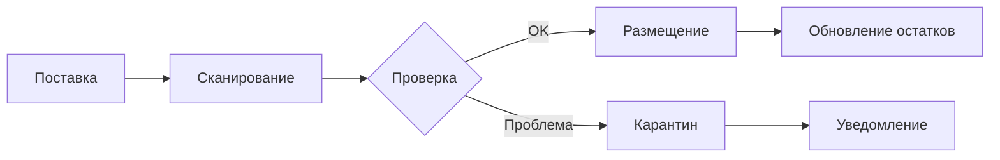

# План разработки собственной WMS для Sve Tu

## 1. Обоснование разработки собственной WMS

### Преимущества:
- **Полная интеграция** с платформой Sve Tu
- **Кастомизация** под специфику маркетплейса
- **Отсутствие лицензионных платежей** (экономия €3,600/год)
- **Контроль над данными** и процессами
- **Масштабируемость** без ограничений

### Недостатки:
- Время разработки (3-4 месяца)
- Начальные инвестиции (€15,000)
- Необходимость поддержки

## 2. Архитектура WMS

```
┌─────────────────────────────────────────────────────┐
│                  WMS Frontend                        │
│              (React + TypeScript)                    │
├──────────────────────┬──────────────────────────────┤
│   Web Dashboard      │    Mobile App (PWA)          │
│   - Менеджеры        │    - Сборщики                │
│   - Аналитика        │    - Приемка                 │
│   - Настройки        │    - Инвентаризация          │
└──────────────────────┴──────────────────────────────┘
                       │
                       ▼
┌─────────────────────────────────────────────────────┐
│                  WMS Backend                         │
│                  (Go + Fiber)                        │
├─────────────┬──────────────┬───────────────────────┤
│   Core      │   Business    │    Integrations      │
│   Services  │   Logic       │    Layer             │
├─────────────┼──────────────┼───────────────────────┤
│ • Auth      │ • Inventory   │ • Sve Tu API         │
│ • Users     │ • Orders      │ • Carrier APIs       │
│ • Locations │ • Picking     │ • Hardware (Scanner) │
│ • Products  │ • Shipping    │ • Notifications      │
└─────────────┴──────────────┴───────────────────────┘
                       │
                       ▼
┌─────────────────────────────────────────────────────┐
│              PostgreSQL + Redis                      │
└─────────────────────────────────────────────────────┘
```

## 3. Функциональные модули

### 3.1 Управление складом
```go
// Структура склада
type Warehouse struct {
    ID           uuid.UUID
    Name         string
    Address      string
    Zones        []Zone
    Capacity     WarehouseCapacity
    WorkingHours []WorkingHour
}

type Zone struct {
    ID       uuid.UUID
    Code     string // A, B, C
    Type     string // picking, storage, staging
    Rows     []Row
}

type Location struct {
    ID         uuid.UUID
    Code       string // A-1-1-1
    Type       string // pallet, shelf, floor
    Dimensions Dimensions
    MaxWeight  float64
    Occupied   bool
}
```

### 3.2 Управление товарами
```typescript
interface Product {
  id: string;
  sku: string;
  name: string;
  barcode: string;
  dimensions: {
    length: number;
    width: number;
    height: number;
    weight: number;
  };
  storageRequirements: {
    temperature?: { min: number; max: number };
    humidity?: { min: number; max: number };
    fragile: boolean;
    stackable: boolean;
  };
}

interface StockItem {
  productId: string;
  locationId: string;
  quantity: number;
  lot?: string;
  expiryDate?: Date;
  reservations: Reservation[];
}
```

## 4. Основные процессы

### 4.1 Приемка товаров


### 4.2 Обработка заказов
```go
type OrderProcessing struct {
    OrderID      uuid.UUID
    Items        []OrderItem
    Priority     int
    PickingRoute []Location
    Status       OrderStatus
}

func (wms *WMSService) ProcessOrder(orderID uuid.UUID) error {
    // 1. Резервируем товары
    if err := wms.ReserveItems(orderID); err != nil {
        return err
    }
    
    // 2. Оптимизируем маршрут сборки
    route := wms.OptimizePickingRoute(orderID)
    
    // 3. Создаем задание для сборщика
    task := wms.CreatePickingTask(orderID, route)
    
    // 4. Назначаем сборщика
    return wms.AssignPicker(task)
}
```

## 5. План разработки по спринтам

### Спринт 1 (2 недели) - Базовая инфраструктура
- [ ] Настройка проекта и CI/CD
- [ ] Базовые модели данных
- [ ] Аутентификация и роли
- [ ] CRUD для складов и локаций

### Спринт 2 (2 недели) - Управление товарами
- [ ] Приемка товаров
- [ ] Размещение на складе
- [ ] Инвентаризация
- [ ] Штрих-коды и QR

### Спринт 3 (2 недели) - Обработка заказов
- [ ] Резервирование товаров
- [ ] Алгоритм оптимизации маршрута
- [ ] Интерфейс сборщика
- [ ] Упаковка и маркировка

### Спринт 4 (2 недели) - Интеграции
- [ ] API для Sve Tu платформы
- [ ] Интеграция с курьерами
- [ ] Webhook уведомления
- [ ] Синхронизация остатков

### Спринт 5 (2 недели) - Мобильное приложение
- [ ] PWA для сборщиков
- [ ] Сканирование штрих-кодов
- [ ] Offline режим
- [ ] Push уведомления

### Спринт 6 (2 недели) - Аналитика и оптимизация
- [ ] Дашборд для менеджеров
- [ ] KPI и метрики
- [ ] Отчеты
- [ ] ABC/XYZ анализ

## 6. Технический стек

### Backend (Go)
```go
// go.mod
module github.com/svetu/wms

go 1.21

require (
    github.com/gofiber/fiber/v2 v2.52.0
    github.com/google/uuid v1.5.0
    github.com/lib/pq v1.10.9
    github.com/redis/go-redis/v9 v9.4.0
    github.com/golang-migrate/migrate/v4 v4.17.0
    github.com/stretchr/testify v1.8.4
)
```

### Frontend (React + TypeScript)
```json
{
  "dependencies": {
    "react": "^18.2.0",
    "typescript": "^5.3.0",
    "@tanstack/react-query": "^5.17.0",
    "react-router-dom": "^6.21.0",
    "zustand": "^4.4.7",
    "react-hook-form": "^7.48.0",
    "zod": "^3.22.0",
    "@radix-ui/react-*": "latest",
    "tailwindcss": "^3.4.0",
    "react-barcode-reader": "^0.0.2"
  }
}
```

## 7. Ключевые алгоритмы

### 7.1 Оптимизация размещения (ABC анализ)
```go
func OptimalLocation(product Product, stockHistory []StockMovement) Location {
    // A - часто продаваемые (20% SKU = 80% оборота)
    // B - средние (30% SKU = 15% оборота)  
    // C - редкие (50% SKU = 5% оборота)
    
    turnoverRate := calculateTurnover(stockHistory)
    
    switch {
    case turnoverRate > 10: // A-товары
        return findNearestPickingZone()
    case turnoverRate > 2:  // B-товары
        return findMiddleZone()
    default:               // C-товары
        return findStorageZone()
    }
}
```

### 7.2 Оптимизация маршрута сборки
```typescript
// Алгоритм ближайшего соседа с оптимизацией
function optimizePickingRoute(items: PickItem[]): Location[] {
  const locations = items.map(i => i.location);
  const route: Location[] = [];
  let current = PICKING_START_POINT;
  
  while (locations.length > 0) {
    // Находим ближайшую локацию с учетом веса товара
    const next = findNearest(current, locations, items);
    route.push(next);
    current = next;
    locations.splice(locations.indexOf(next), 1);
  }
  
  // Добавляем зону упаковки
  route.push(PACKING_ZONE);
  return route;
}
```

## 8. Интеграция со сканерами

```javascript
// Web API для работы со сканерами
class BarcodeScanner {
  async init() {
    // Проверяем поддержку камеры
    const devices = await navigator.mediaDevices.enumerateDevices();
    this.camera = devices.find(d => d.kind === 'videoinput');
    
    // Или USB сканер через Web Serial API
    if ('serial' in navigator) {
      this.port = await navigator.serial.requestPort();
      await this.port.open({ baudRate: 9600 });
    }
  }
  
  async scan() {
    // Используем библиотеку ZXing или QuaggaJS
    return new Promise((resolve) => {
      Quagga.onDetected((result) => {
        resolve(result.codeResult.code);
      });
    });
  }
}
```

## 9. Безопасность и права доступа

```go
// Роли и права
const (
    RoleAdmin      = "admin"      // Полный доступ
    RoleManager    = "manager"    // Управление складом
    RolePicker     = "picker"     // Сборка заказов
    RoleReceiver   = "receiver"   // Приемка товаров
    RoleViewer     = "viewer"     // Только просмотр
)

// Middleware для проверки прав
func RequireRole(roles ...string) fiber.Handler {
    return func(c *fiber.Ctx) error {
        userRole := c.Locals("role").(string)
        for _, role := range roles {
            if userRole == role {
                return c.Next()
            }
        }
        return c.Status(403).JSON(fiber.Map{
            "error": "Insufficient permissions",
        })
    }
}
```

## 10. Мониторинг и алерты

```yaml
# Prometheus метрики
wms_orders_processed_total
wms_picking_time_seconds
wms_inventory_accuracy_percent
wms_location_utilization_percent
wms_errors_total{type="picking|packing|shipping"}

# Алерты
- alert: LowInventoryAccuracy
  expr: wms_inventory_accuracy_percent < 95
  annotations:
    summary: "Точность остатков упала ниже 95%"
    
- alert: HighPickingTime
  expr: avg(wms_picking_time_seconds) > 300
  annotations:
    summary: "Среднее время сборки > 5 минут"
```

## 11. Бюджет разработки

| Статья | Стоимость | Комментарий |
|--------|-----------|-------------|
| Backend разработка | €6,000 | 2 разработчика × 1.5 месяца |
| Frontend разработка | €4,000 | 1 разработчик × 2 месяца |
| Мобильное приложение | €2,000 | PWA проще нативного |
| Тестирование | €1,500 | QA инженер × 3 недели |
| UI/UX дизайн | €1,500 | Фрилансер |
| **ИТОГО** | **€15,000** | |

## 12. ROI анализ

| Показатель | Значение |
|------------|----------|
| Разработка | €15,000 |
| Экономия на лицензиях | €3,600/год |
| Повышение эффективности | +30% |
| Окупаемость | 12 месяцев |
| 3-year TCO | €15,000 vs €25,800 (SaaS) |

**Вывод**: Собственная WMS окупится за год и даст полный контроль над складскими процессами.