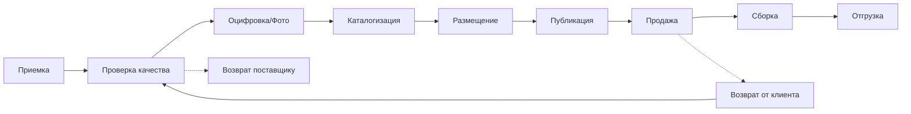

# 📦 ДОПОЛНЕНИЕ К WMS: ПОЛНЫЙ ЦИКЛ РАБОТЫ С ТОВАРОМ

## 🔄 Полный цикл обработки товара

### Этапы жизненного цикла товара в WMS



## 📥 1. ПРИЕМКА ТОВАРА (Receiving)

### База данных для приемки

```sql
-- Документы приемки
CREATE TABLE wms.receiving_documents (
    id UUID PRIMARY KEY DEFAULT gen_random_uuid(),
    document_number VARCHAR(32) UNIQUE NOT NULL,
    document_type VARCHAR(30) NOT NULL, -- 'purchase_order', 'transfer', 'return', 'consignment'
    
    -- Поставщик или источник
    supplier_id INTEGER,
    supplier_name VARCHAR(255),
    invoice_number VARCHAR(100),
    
    -- Статус приемки
    status VARCHAR(30) DEFAULT 'expected',
    -- 'expected', 'in_progress', 'quality_check', 'completed', 'rejected'
    
    expected_date DATE,
    actual_date TIMESTAMPTZ,
    
    -- Ответственные
    receiver_id UUID,
    inspector_id UUID,
    
    created_at TIMESTAMPTZ DEFAULT NOW()
);

-- Позиции в приемке
CREATE TABLE wms.receiving_items (
    id UUID PRIMARY KEY DEFAULT gen_random_uuid(),
    document_id UUID NOT NULL REFERENCES wms.receiving_documents(id),
    
    -- Товар (может быть еще не в системе)
    temp_sku VARCHAR(100),
    supplier_sku VARCHAR(100),
    barcode VARCHAR(100),
    
    -- Описание от поставщика
    supplier_name VARCHAR(500),
    supplier_description TEXT,
    supplier_category VARCHAR(255),
    
    -- Количества
    expected_quantity INTEGER,
    received_quantity INTEGER,
    accepted_quantity INTEGER,
    rejected_quantity INTEGER,
    
    -- Проверка качества
    quality_status VARCHAR(30), -- 'pending', 'passed', 'failed', 'conditional'
    quality_notes TEXT,
    defects JSONB,
    
    -- Стоимость
    unit_cost NUMERIC(15,2),
    currency CHAR(3) DEFAULT 'RSD'
);

-- Результаты проверки качества
CREATE TABLE wms.quality_checks (
    id UUID PRIMARY KEY DEFAULT gen_random_uuid(),
    receiving_item_id UUID REFERENCES wms.receiving_items(id),
    
    check_type VARCHAR(50), -- 'visual', 'functional', 'dimensional', 'sample'
    
    -- Чек-лист проверок
    checklist JSONB NOT NULL,
    /* [{
        "criteria": "Внешний вид",
        "passed": true,
        "notes": "Без повреждений"
    }, {
        "criteria": "Комплектность",
        "passed": false,
        "notes": "Отсутствует инструкция"
    }] */
    
    -- Фото дефектов
    defect_photos JSONB DEFAULT '[]',
    
    -- Решение
    decision VARCHAR(30), -- 'accept', 'reject', 'partial', 'rework'
    
    performed_by UUID,
    performed_at TIMESTAMPTZ DEFAULT NOW()
);
```

### Процесс приемки

```go
package receiving

type ReceivingService struct {
    db           *pgxpool.Pool
    qcService    QualityCheckService
    mediaService MediaService
}

// Начать приемку
func (s *ReceivingService) StartReceiving(
    ctx context.Context,
    documentID uuid.UUID,
) error {
    // 1. Меняем статус документа
    _, err := s.db.Exec(ctx, `
        UPDATE wms.receiving_documents 
        SET status = 'in_progress',
            actual_date = NOW()
        WHERE id = $1
    `, documentID)
    
    return err
}

// Принять товар
func (s *ReceivingService) ReceiveItem(
    ctx context.Context,
    item ReceivingItem,
) (*ReceivedItem, error) {
    // 1. Сканируем штрихкод
    if item.Barcode != "" {
        existing := s.findByBarcode(ctx, item.Barcode)
        if existing != nil {
            // Товар уже в системе
            return s.receiveExistingItem(ctx, item, existing)
        }
    }
    
    // 2. Новый товар - создаем временную запись
    tempSKU := s.generateTempSKU()
    
    _, err := s.db.Exec(ctx, `
        INSERT INTO wms.receiving_items
        (document_id, temp_sku, supplier_sku, barcode,
         supplier_name, supplier_description, 
         expected_quantity, received_quantity)
        VALUES ($1, $2, $3, $4, $5, $6, $7, $8)
    `, item.DocumentID, tempSKU, item.SupplierSKU,
       item.Barcode, item.Name, item.Description,
       item.ExpectedQty, item.ReceivedQty)
    
    // 3. Запускаем проверку качества
    go s.qcService.ScheduleCheck(tempSKU)
    
    return &ReceivedItem{
        TempSKU: tempSKU,
        Status:  "quality_check_pending",
    }, nil
}
```

## 📸 2. ОЦИФРОВКА И МЕДИА (Digitization)

### База данных для медиа

```sql
-- Сессии оцифровки
CREATE TABLE wms.digitization_sessions (
    id UUID PRIMARY KEY DEFAULT gen_random_uuid(),
    item_id UUID, -- Может быть receiving_item_id или product_id
    session_type VARCHAR(30) NOT NULL, -- 'product', 'quality', 'marketing'
    
    -- Статус
    status VARCHAR(30) DEFAULT 'pending',
    -- 'pending', 'in_progress', 'processing', 'completed'
    
    -- Требования к фото
    photo_requirements JSONB NOT NULL,
    /* {
        "min_photos": 5,
        "max_photos": 20,
        "required_angles": ["front", "back", "side", "top", "detail"],
        "background": "white",
        "resolution": "1920x1080",
        "format": ["jpg", "png"]
    } */
    
    -- Результаты
    photos_taken INTEGER DEFAULT 0,
    photos_approved INTEGER DEFAULT 0,
    
    photographer_id UUID,
    started_at TIMESTAMPTZ,
    completed_at TIMESTAMPTZ
);

-- Фотографии товаров
CREATE TABLE wms.product_photos (
    id UUID PRIMARY KEY DEFAULT gen_random_uuid(),
    session_id UUID REFERENCES wms.digitization_sessions(id),
    
    -- Файл
    file_name VARCHAR(255) NOT NULL,
    file_path TEXT NOT NULL,
    file_size INTEGER,
    mime_type VARCHAR(50),
    
    -- Метаданные
    photo_type VARCHAR(30), -- 'main', 'angle', 'detail', 'size', 'defect'
    angle VARCHAR(30), -- 'front', 'back', 'left', 'right', 'top', 'bottom'
    
    -- Обработка
    is_processed BOOLEAN DEFAULT false,
    processed_versions JSONB DEFAULT '{}',
    /* {
        "thumbnail": "path/to/thumb.jpg",
        "medium": "path/to/medium.jpg",
        "large": "path/to/large.jpg",
        "watermarked": "path/to/watermarked.jpg"
    } */
    
    -- AI обработка
    ai_tags JSONB DEFAULT '[]', -- ["электроника", "смартфон", "черный"]
    ai_background_removed BOOLEAN DEFAULT false,
    ai_quality_score NUMERIC(3,2), -- 0.0 - 1.0
    
    created_at TIMESTAMPTZ DEFAULT NOW()
);

-- Видео товаров
CREATE TABLE wms.product_videos (
    id UUID PRIMARY KEY DEFAULT gen_random_uuid(),
    session_id UUID REFERENCES wms.digitization_sessions(id),
    
    file_path TEXT NOT NULL,
    duration_seconds INTEGER,
    
    -- Типы видео
    video_type VARCHAR(30), -- 'overview', 'unboxing', 'usage', '360'
    
    -- Обработка
    thumbnails JSONB DEFAULT '[]',
    transcoded_versions JSONB DEFAULT '{}',
    
    created_at TIMESTAMPTZ DEFAULT NOW()
);
```

### Сервис оцифровки

```go
package digitization

type DigitizationService struct {
    db          *pgxpool.Pool
    storage     StorageService
    aiService   AIProcessingService
}

// Создать сессию фотографирования
func (s *DigitizationService) CreatePhotoSession(
    ctx context.Context,
    itemID uuid.UUID,
    requirements PhotoRequirements,
) (*PhotoSession, error) {
    session := &PhotoSession{
        ID:           uuid.New(),
        ItemID:       itemID,
        Requirements: requirements,
        Status:       "pending",
    }
    
    // Сохраняем в БД
    _, err := s.db.Exec(ctx, `
        INSERT INTO wms.digitization_sessions
        (id, item_id, session_type, photo_requirements)
        VALUES ($1, $2, $3, $4)
    `, session.ID, itemID, "product", requirements)
    
    return session, err
}

// Загрузить и обработать фото
func (s *DigitizationService) UploadPhoto(
    ctx context.Context,
    sessionID uuid.UUID,
    photo []byte,
    metadata PhotoMetadata,
) (*ProcessedPhoto, error) {
    // 1. Сохраняем оригинал
    filePath := s.storage.Save(photo, metadata.FileName)
    
    // 2. Создаем версии разных размеров
    versions := s.createVersions(photo)
    
    // 3. AI обработка
    aiResult := s.aiService.ProcessPhoto(photo)
    
    // 4. Удаляем фон если нужно
    if metadata.RemoveBackground {
        photo = s.aiService.RemoveBackground(photo)
    }
    
    // 5. Сохраняем в БД
    var photoID uuid.UUID
    err := s.db.QueryRow(ctx, `
        INSERT INTO wms.product_photos
        (session_id, file_path, photo_type, angle,
         processed_versions, ai_tags, ai_quality_score)
        VALUES ($1, $2, $3, $4, $5, $6, $7)
        RETURNING id
    `, sessionID, filePath, metadata.Type, metadata.Angle,
       versions, aiResult.Tags, aiResult.QualityScore).Scan(&photoID)
    
    return &ProcessedPhoto{
        ID:           photoID,
        FilePath:     filePath,
        Versions:     versions,
        Tags:         aiResult.Tags,
        QualityScore: aiResult.QualityScore,
    }, err
}

// Автоматическая обработка фото
func (s *DigitizationService) AutoProcessPhotos(
    ctx context.Context,
    photos [][]byte,
) (*AutoProcessResult, error) {
    result := &AutoProcessResult{
        MainPhoto:    s.selectBestPhoto(photos),
        GalleryPhotos: []ProcessedPhoto{},
    }
    
    for _, photo := range photos {
        processed := s.processPhoto(photo)
        
        // AI определяет тип фото
        photoType := s.aiService.DeterminePhotoType(photo)
        
        // Автоматическая коррекция
        processed = s.autoCorrect(processed)
        
        result.GalleryPhotos = append(result.GalleryPhotos, processed)
    }
    
    return result, nil
}
```

## 📝 3. КАТАЛОГИЗАЦИЯ (Cataloging)

### База данных для каталога

```sql
-- Мастер-каталог товаров
CREATE TABLE wms.product_catalog (
    id UUID PRIMARY KEY DEFAULT gen_random_uuid(),
    
    -- Идентификаторы
    internal_sku VARCHAR(100) UNIQUE NOT NULL,
    barcode VARCHAR(100) UNIQUE,
    manufacturer_sku VARCHAR(100),
    
    -- Основная информация
    name VARCHAR(500) NOT NULL,
    description TEXT,
    brand VARCHAR(255),
    manufacturer VARCHAR(255),
    
    -- Категоризация
    category_id INTEGER,
    category_path TEXT, -- 'Electronics > Phones > Smartphones'
    tags TEXT[],
    
    -- Физические характеристики
    weight_kg NUMERIC(10,3),
    dimensions JSONB, -- {"length": 10, "width": 5, "height": 2}
    
    -- Атрибуты (динамические)
    attributes JSONB DEFAULT '{}',
    /* {
        "color": "Black",
        "size": "XL",
        "material": "Cotton",
        "power": "2000W"
    } */
    
    -- Медиа
    main_photo_id UUID REFERENCES wms.product_photos(id),
    gallery_photo_ids UUID[],
    video_ids UUID[],
    
    -- SEO и маркетинг
    meta_title VARCHAR(255),
    meta_description TEXT,
    meta_keywords TEXT[],
    
    -- Статус
    catalog_status VARCHAR(30) DEFAULT 'draft',
    -- 'draft', 'pending_review', 'approved', 'published'
    
    -- AI генерированные данные
    ai_generated_description TEXT,
    ai_suggested_categories INTEGER[],
    ai_extracted_features JSONB,
    
    created_at TIMESTAMPTZ DEFAULT NOW(),
    updated_at TIMESTAMPTZ DEFAULT NOW()
);

-- Связь с маркетплейсом
CREATE TABLE wms.catalog_marketplace_mapping (
    id UUID PRIMARY KEY DEFAULT gen_random_uuid(),
    catalog_id UUID NOT NULL REFERENCES wms.product_catalog(id),
    marketplace_product_id BIGINT,
    marketplace_variant_id BIGINT,
    
    -- Статус публикации
    publication_status VARCHAR(30) DEFAULT 'pending',
    -- 'pending', 'published', 'failed', 'unpublished'
    
    published_at TIMESTAMPTZ,
    last_sync_at TIMESTAMPTZ,
    
    -- Цены и условия
    base_price NUMERIC(15,2),
    selling_price NUMERIC(15,2),
    commission_percent NUMERIC(5,2),
    
    UNIQUE(catalog_id, marketplace_product_id)
);
```

### Сервис каталогизации

```go
package cataloging

type CatalogService struct {
    db           *pgxpool.Pool
    aiService    AIService
    mediaService MediaService
}

// Создать товар в каталоге из приемки
func (s *CatalogService) CreateFromReceiving(
    ctx context.Context,
    receivingItemID uuid.UUID,
) (*CatalogProduct, error) {
    // 1. Получаем данные из приемки
    var item ReceivingItem
    err := s.db.QueryRow(ctx, `
        SELECT temp_sku, supplier_name, supplier_description,
               barcode, supplier_category
        FROM wms.receiving_items
        WHERE id = $1
    `, receivingItemID).Scan(&item)
    
    // 2. AI обогащение данных
    enriched := s.aiService.EnrichProductData(item)
    
    // 3. Генерируем внутренний SKU
    internalSKU := s.generateSKU(enriched.Category)
    
    // 4. Создаем запись в каталоге
    product := &CatalogProduct{
        ID:          uuid.New(),
        InternalSKU: internalSKU,
        Name:        enriched.Name,
        Description: enriched.Description,
        Brand:       enriched.Brand,
        Attributes:  enriched.Attributes,
        Status:      "draft",
    }
    
    _, err = s.db.Exec(ctx, `
        INSERT INTO wms.product_catalog
        (id, internal_sku, name, description, brand,
         category_id, attributes, ai_generated_description,
         ai_suggested_categories, ai_extracted_features)
        VALUES ($1, $2, $3, $4, $5, $6, $7, $8, $9, $10)
    `, product.ID, product.InternalSKU, product.Name,
       product.Description, product.Brand, enriched.CategoryID,
       product.Attributes, enriched.AIDescription,
       enriched.SuggestedCategories, enriched.ExtractedFeatures)
    
    // 5. Связываем фотографии
    s.linkPhotos(ctx, receivingItemID, product.ID)
    
    return product, err
}

// AI-assisted каталогизация
func (s *CatalogService) AutoCatalog(
    ctx context.Context,
    photos []uuid.UUID,
    basicInfo BasicProductInfo,
) (*CatalogProduct, error) {
    // 1. AI анализирует фотографии
    photoAnalysis := s.aiService.AnalyzePhotos(photos)
    
    // 2. AI генерирует описание
    description := s.aiService.GenerateDescription(
        photoAnalysis,
        basicInfo,
    )
    
    // 3. AI определяет категорию
    category := s.aiService.DetermineCategory(
        photoAnalysis,
        basicInfo.SupplierCategory,
    )
    
    // 4. AI извлекает характеристики
    features := s.aiService.ExtractFeatures(photoAnalysis)
    
    // 5. Создаем товар
    product := &CatalogProduct{
        Name:        s.aiService.GenerateTitle(photoAnalysis, basicInfo),
        Description: description,
        Category:    category,
        Attributes:  features,
        MetaTitle:   s.aiService.GenerateSEOTitle(basicInfo),
        MetaDesc:    s.aiService.GenerateSEODescription(description),
        MetaKeywords: s.aiService.ExtractKeywords(description),
    }
    
    return s.Create(ctx, product)
}
```

## 🚀 4. ПУБЛИКАЦИЯ (Publishing)

### Процесс публикации

```go
package publishing

type PublishingService struct {
    db               *pgxpool.Pool
    marketplaceAPI   MarketplaceAPI
    pricingService   PricingService
    inventoryService InventoryService
}

// Публикация товара на маркетплейс
func (s *PublishingService) PublishToMarketplace(
    ctx context.Context,
    catalogID uuid.UUID,
    settings PublishSettings,
) (*PublishResult, error) {
    // 1. Получаем товар из каталога
    product, err := s.getCatalogProduct(ctx, catalogID)
    if err != nil {
        return nil, err
    }
    
    // 2. Проверяем готовность к публикации
    if err := s.validateForPublishing(product); err != nil {
        return nil, err
    }
    
    // 3. Рассчитываем цены
    pricing := s.pricingService.Calculate(
        product.Cost,
        settings.Margin,
        settings.IncludeVAT,
    )
    
    // 4. Подготавливаем данные для маркетплейса
    marketplaceProduct := MarketplaceProduct{
        Name:        product.Name,
        Description: product.Description,
        Price:       pricing.SellingPrice,
        Currency:    "RSD",
        CategoryID:  product.CategoryID,
        SKU:         product.InternalSKU,
        Barcode:     product.Barcode,
        Attributes:  s.mapAttributes(product.Attributes),
        Images:      s.prepareImages(product.Photos),
    }
    
    // 5. Отправляем на маркетплейс
    result, err := s.marketplaceAPI.CreateProduct(
        ctx,
        marketplaceProduct,
    )
    
    if err != nil {
        return nil, err
    }
    
    // 6. Сохраняем маппинг
    _, err = s.db.Exec(ctx, `
        INSERT INTO wms.catalog_marketplace_mapping
        (catalog_id, marketplace_product_id, 
         publication_status, published_at,
         base_price, selling_price)
        VALUES ($1, $2, 'published', NOW(), $3, $4)
    `, catalogID, result.ProductID, 
       pricing.BasePrice, pricing.SellingPrice)
    
    // 7. Создаем начальные остатки
    s.inventoryService.InitializeStock(
        ctx,
        result.ProductID,
        settings.InitialStock,
        settings.LocationID,
    )
    
    return &PublishResult{
        Success:   true,
        ProductID: result.ProductID,
        URL:       result.ProductURL,
    }, nil
}

// Массовая публикация
func (s *PublishingService) BulkPublish(
    ctx context.Context,
    catalogIDs []uuid.UUID,
    settings BulkPublishSettings,
) (*BulkPublishResult, error) {
    result := &BulkPublishResult{
        Total:     len(catalogIDs),
        Success:   0,
        Failed:    0,
        Errors:    []PublishError{},
    }
    
    // Используем воркер пул для параллельной публикации
    workerPool := make(chan uuid.UUID, 10)
    results := make(chan PublishResult, len(catalogIDs))
    
    // Запускаем воркеры
    for i := 0; i < settings.Concurrency; i++ {
        go s.publishWorker(ctx, workerPool, results)
    }
    
    // Отправляем задачи
    for _, id := range catalogIDs {
        workerPool <- id
    }
    close(workerPool)
    
    // Собираем результаты
    for i := 0; i < len(catalogIDs); i++ {
        res := <-results
        if res.Success {
            result.Success++
        } else {
            result.Failed++
            result.Errors = append(result.Errors, res.Error)
        }
    }
    
    return result, nil
}
```

## 📦 5. ПЕРЕМЕЩЕНИЯ И РАЗМЕЩЕНИЕ (Putaway & Movements)

### Оптимизация размещения

```sql
-- Стратегии размещения
CREATE TABLE wms.putaway_strategies (
    id UUID PRIMARY KEY DEFAULT gen_random_uuid(),
    name VARCHAR(255) NOT NULL,
    
    -- Правила размещения
    rules JSONB NOT NULL,
    /* {
        "strategy": "ABC", // ABC, FIFO, LIFO, random
        "zone_preference": ["A", "B", "C"],
        "consolidate": true,
        "fill_rate_threshold": 80,
        "weight_distribution": "balanced"
    } */
    
    -- Условия применения
    conditions JSONB DEFAULT '{}',
    /* {
        "product_categories": [1, 2, 3],
        "product_types": ["fragile", "hazmat"],
        "weight_range": {"min": 0, "max": 50}
    } */
    
    priority INTEGER DEFAULT 0,
    is_active BOOLEAN DEFAULT true
);

-- История перемещений с аналитикой
CREATE TABLE wms.movement_analytics (
    id UUID PRIMARY KEY DEFAULT gen_random_uuid(),
    movement_id UUID REFERENCES wms.stock_movements(id),
    
    -- Метрики
    distance_meters NUMERIC(10,2),
    time_seconds INTEGER,
    efficiency_score NUMERIC(3,2), -- 0.0 - 1.0
    
    -- Анализ
    movement_path JSONB, -- Путь перемещения
    optimization_suggestions JSONB,
    
    created_at TIMESTAMPTZ DEFAULT NOW()
);
```

### Сервис размещения

```go
package putaway

type PutawayService struct {
    db               *pgxpool.Pool
    locationService  LocationService
    optimizerService OptimizerService
}

// Определить оптимальное место размещения
func (s *PutawayService) DetermineOptimalLocation(
    ctx context.Context,
    product Product,
    quantity int,
) (*Location, error) {
    // 1. Получаем стратегию размещения
    strategy := s.getStrategy(ctx, product)
    
    // 2. Находим подходящие локации
    candidates := s.locationService.FindAvailable(
        ctx,
        product.Dimensions,
        product.Weight * float64(quantity),
        product.StorageClass,
    )
    
    // 3. Оптимизируем выбор
    optimal := s.optimizerService.SelectOptimal(
        candidates,
        strategy,
        product,
    )
    
    // 4. Резервируем локацию
    err := s.locationService.Reserve(ctx, optimal.ID)
    
    return optimal, err
}

// ABC анализ для оптимизации размещения
func (s *PutawayService) ABCAnalysis(ctx context.Context) error {
    // Анализируем частоту обращений к товарам
    analysis := s.analyzePickingFrequency(ctx)
    
    // Перераспределяем товары по зонам
    for _, item := range analysis {
        var targetZone string
        switch item.Class {
        case "A": // 80% оборота
            targetZone = "A" // Ближе к зоне отгрузки
        case "B": // 15% оборота
            targetZone = "B" // Средняя зона
        case "C": // 5% оборота
            targetZone = "C" // Дальняя зона
        }
        
        // Планируем перемещение
        s.planRelocation(ctx, item.SKU, targetZone)
    }
    
    return nil
}
```

## 🔄 Полный цикл - интеграция всех этапов

### Orchestrator для полного цикла

```go
package fullcycle

type FullCycleOrchestrator struct {
    receiving     ReceivingService
    qc            QualityCheckService
    digitization  DigitizationService
    cataloging    CatalogService
    publishing    PublishingService
    putaway       PutawayService
    eventBus      EventBus
}

// Полный цикл обработки новой поставки
func (o *FullCycleOrchestrator) ProcessNewDelivery(
    ctx context.Context,
    deliveryID uuid.UUID,
) error {
    // 1. ПРИЕМКА
    o.eventBus.Publish(Event{Type: "RECEIVING_STARTED", ID: deliveryID})
    
    items, err := o.receiving.StartReceiving(ctx, deliveryID)
    if err != nil {
        return err
    }
    
    for _, item := range items {
        // 2. ПРОВЕРКА КАЧЕСТВА
        qcResult := o.qc.PerformCheck(ctx, item)
        if !qcResult.Passed {
            o.handleRejectedItem(ctx, item)
            continue
        }
        
        // 3. ОЦИФРОВКА
        photoSession := o.digitization.CreateSession(ctx, item.ID)
        photos := o.digitization.TakePhotos(ctx, photoSession)
        
        // 4. КАТАЛОГИЗАЦИЯ
        catalogProduct := o.cataloging.CreateFromReceiving(
            ctx, 
            item.ID,
            photos,
        )
        
        // 5. РАЗМЕЩЕНИЕ НА СКЛАДЕ
        location := o.putaway.DetermineOptimalLocation(
            ctx,
            catalogProduct,
            item.Quantity,
        )
        
        o.putaway.Execute(ctx, item, location)
        
        // 6. ПУБЛИКАЦИЯ (если auto-publish включен)
        if o.shouldAutoPublish(catalogProduct) {
            o.publishing.PublishToMarketplace(
                ctx,
                catalogProduct.ID,
                DefaultPublishSettings,
            )
        }
        
        o.eventBus.Publish(Event{
            Type: "ITEM_FULLY_PROCESSED",
            Data: map[string]interface{}{
                "item_id":     item.ID,
                "catalog_id":  catalogProduct.ID,
                "location_id": location.ID,
            },
        })
    }
    
    o.eventBus.Publish(Event{Type: "DELIVERY_PROCESSED", ID: deliveryID})
    
    return nil
}

// Saga для управления полным циклом с компенсацией
type FullCycleSaga struct {
    steps []SagaStep
}

func NewFullCycleSaga() *FullCycleSaga {
    return &FullCycleSaga{
        steps: []SagaStep{
            {Name: "Receiving", Execute: executeReceiving, Compensate: compensateReceiving},
            {Name: "QualityCheck", Execute: executeQC, Compensate: compensateQC},
            {Name: "Digitization", Execute: executeDigitization, Compensate: compensateDigitization},
            {Name: "Cataloging", Execute: executeCataloging, Compensate: compensateCataloging},
            {Name: "Putaway", Execute: executePutaway, Compensate: compensatePutaway},
            {Name: "Publishing", Execute: executePublishing, Compensate: compensatePublishing},
        },
    }
}
```

## 📊 Метрики полного цикла

```sql
-- Dashboard метрики
CREATE VIEW wms.full_cycle_metrics AS
SELECT 
    -- Приемка
    COUNT(DISTINCT rd.id) as total_deliveries,
    AVG(EXTRACT(EPOCH FROM (rd.completed_at - rd.actual_date))/3600) as avg_receiving_hours,
    
    -- Качество
    SUM(ri.accepted_quantity)::FLOAT / NULLIF(SUM(ri.expected_quantity), 0) as acceptance_rate,
    
    -- Оцифровка
    AVG(ds.photos_taken) as avg_photos_per_product,
    AVG(EXTRACT(EPOCH FROM (ds.completed_at - ds.started_at))/60) as avg_digitization_minutes,
    
    -- Каталогизация
    COUNT(DISTINCT pc.id) as total_cataloged,
    SUM(CASE WHEN pc.catalog_status = 'published' THEN 1 ELSE 0 END)::FLOAT / 
        NULLIF(COUNT(DISTINCT pc.id), 0) as publication_rate,
    
    -- Эффективность
    AVG(EXTRACT(EPOCH FROM (
        COALESCE(cmm.published_at, pc.created_at) - rd.actual_date
    ))/86400) as avg_days_to_market

FROM wms.receiving_documents rd
LEFT JOIN wms.receiving_items ri ON ri.document_id = rd.id
LEFT JOIN wms.digitization_sessions ds ON ds.item_id = ri.id
LEFT JOIN wms.product_catalog pc ON pc.barcode = ri.barcode
LEFT JOIN wms.catalog_marketplace_mapping cmm ON cmm.catalog_id = pc.id
WHERE rd.actual_date >= NOW() - INTERVAL '30 days';
```

## ✅ Итоговая готовность к полному циклу

Теперь система поддерживает **ПОЛНЫЙ ЦИКЛ** работы с товаром:

1. **ПРИЕМКА** ✅
   - Документы поставки
   - Проверка качества
   - Обработка дефектов

2. **ОЦИФРОВКА** ✅
   - Фотосессии товаров
   - AI обработка изображений
   - Видео контент

3. **КАТАЛОГИЗАЦИЯ** ✅
   - Мастер-каталог
   - AI-обогащение данных
   - SEO оптимизация

4. **РАЗМЕЩЕНИЕ** ✅
   - Оптимальное размещение
   - ABC анализ
   - Перемещения

5. **ПУБЛИКАЦИЯ** ✅
   - Автоматическая публикация
   - Ценообразование
   - Синхронизация с маркетплейсом

6. **ОРКЕСТРАЦИЯ** ✅
   - Полный цикл в одном процессе
   - Saga с компенсацией
   - Метрики и аналитика