# SveTu Platform - Архитектура системы

## Общая архитектура (High Level)

```mermaid
graph TB
    subgraph "Пользователи"
        U1[👨‍💻 Покупатели]
        U2[🏪 Продавцы]
        U3[👨‍💼 Администраторы]
    end

    subgraph "External Services"
        EXT1[🔍 Google OAuth]
        EXT2[💳 Stripe Payments]
        EXT3[📱 Telegram Bot]
        EXT4[🌐 Google Translate]
        EXT5[🤖 OpenAI API]
    end

    subgraph "Load Balancer & SSL"
        LB[🔒 Nginx + SSL/TLS]
    end

    subgraph "Frontend Layer"
        FE[⚛️ Next.js 15.3.2<br/>React 19<br/>TailwindCSS<br/>DaisyUI]
    end

    subgraph "Backend Layer"
        BE[🚀 Go Backend<br/>Fiber Framework<br/>JWT Auth<br/>Rate Limiting]
    end

    subgraph "Data Storage"
        DB[(🐘 PostgreSQL 15<br/>User Data<br/>Marketplace Data<br/>Sessions)]
        SEARCH[(🔍 OpenSearch 2.11<br/>Listings Search<br/>Full-text Index)]
        FILES[(📁 MinIO S3<br/>Images & Files<br/>Object Storage)]
    end

    subgraph "Monitoring & Analytics"
        MON[📊 OpenSearch Dashboards<br/>Logs & Metrics]
    end

    U1 --> LB
    U2 --> LB
    U3 --> LB
    
    LB --> FE
    FE <--> BE
    
    BE --> DB
    BE --> SEARCH
    BE --> FILES
    BE --> EXT1
    BE --> EXT2
    BE --> EXT3
    BE --> EXT4
    BE --> EXT5
    
    SEARCH --> MON

    classDef userClass fill:#e1f5fe
    classDef frontendClass fill:#e8f5e8
    classDef backendClass fill:#fff3e0
    classDef dataClass fill:#fce4ec
    classDef externalClass fill:#f3e5f5
    classDef infraClass fill:#e0f2f1

    class U1,U2,U3 userClass
    class FE frontendClass
    class BE backendClass
    class DB,SEARCH,FILES dataClass
    class EXT1,EXT2,EXT3,EXT4,EXT5 externalClass
    class LB,MON infraClass
```

## Детальная архитектура Backend

```mermaid
graph TB
    subgraph "Nginx Load Balancer"
        NGINX[🔒 Nginx<br/>SSL Termination<br/>Static Files<br/>Rate Limiting]
    end

    subgraph "Frontend Service"
        NEXT[⚛️ Next.js App<br/>Port: 3001<br/>SSR/CSR<br/>i18n Support]
    end

    subgraph "Backend API Service"
        API[🚀 Go Fiber API<br/>Port: 3000<br/>REST + WebSocket<br/>JWT Authentication]
        
        subgraph "Middleware Layer"
            MW1[🛡️ CORS]
            MW2[📝 Logger]
            MW3[🔐 Auth]
            MW4[⏱️ Rate Limiter]
            MW5[🛡️ Admin Check]
        end

        subgraph "API Handlers"
            H1[👤 Users & Auth]
            H2[🏪 Marketplace]
            H3[⭐ Reviews]
            H4[🏢 Storefronts]
            H5[💰 Balance & Payments]
            H6[💬 Chat & WebSocket]
            H7[🔔 Notifications]
            H8[🌍 Geocoding]
            H9[👨‍💼 Admin Panel]
        end
    end

    subgraph "Data Layer"
        PG[(🐘 PostgreSQL<br/>Port: 5432<br/>Primary Database)]
        OS[(🔍 OpenSearch<br/>Port: 9200<br/>Search Engine)]
        MINIO[(📁 MinIO<br/>Port: 9000/9001<br/>S3-Compatible Storage)]
    end

    subgraph "External APIs"
        GOOGLE[🔍 Google Services<br/>OAuth2 + Translate]
        STRIPE[💳 Stripe<br/>Payment Processing]
        TELEGRAM[📱 Telegram<br/>Bot Notifications]
        OPENAI[🤖 OpenAI<br/>AI Translation]
    end

    subgraph "Monitoring"
        DASH[📊 OpenSearch Dashboards<br/>Port: 5601<br/>Logs & Metrics]
    end

    NGINX --> NEXT
    NGINX --> API
    
    API --> MW1
    MW1 --> MW2
    MW2 --> MW3
    MW3 --> MW4
    MW4 --> MW5
    MW5 --> H1
    MW5 --> H2
    MW5 --> H3
    MW5 --> H4
    MW5 --> H5
    MW5 --> H6
    MW5 --> H7
    MW5 --> H8
    MW5 --> H9

    H1 --> PG
    H2 --> PG
    H2 --> OS
    H2 --> MINIO
    H3 --> PG
    H4 --> PG
    H5 --> PG
    H6 --> PG
    H7 --> PG
    H8 --> PG
    H9 --> PG
    H9 --> OS

    H1 --> GOOGLE
    H5 --> STRIPE
    H7 --> TELEGRAM
    H2 --> OPENAI

    OS --> DASH

    classDef infraClass fill:#e0f2f1
    classDef frontendClass fill:#e8f5e8
    classDef backendClass fill:#fff3e0
    classDef middlewareClass fill:#e3f2fd
    classDef handlerClass fill:#f1f8e9
    classDef dataClass fill:#fce4ec
    classDef externalClass fill:#f3e5f5

    class NGINX infraClass
    class NEXT frontendClass
    class API backendClass
    class MW1,MW2,MW3,MW4,MW5 middlewareClass
    class H1,H2,H3,H4,H5,H6,H7,H8,H9 handlerClass
    class PG,OS,MINIO,DASH dataClass
    class GOOGLE,STRIPE,TELEGRAM,OPENAI externalClass
```

## API Endpoints Architecture

```mermaid
graph TD
    subgraph "Public API Routes"
        PUB1[📋 GET /api/v1/marketplace/listings<br/>GET /api/v1/marketplace/categories<br/>GET /api/v1/marketplace/search]
        PUB2[⭐ GET /api/v1/reviews<br/>GET /api/v1/entity/:type/:id/rating]
        PUB3[🏪 GET /api/v1/public/storefronts/:id]
        PUB4[🔐 POST /api/v1/users/login<br/>POST /api/v1/users/register<br/>GET /auth/google]
    end

    subgraph "Protected API Routes (AuthRequired)"
        PROT1[👤 GET/PUT /api/v1/users/profile<br/>GET /api/v1/users/:id/profile]
        PROT2[🏪 POST/PUT/DELETE /api/v1/marketplace/listings<br/>POST /api/v1/marketplace/listings/:id/favorite]
        PROT3[⭐ POST /api/v1/reviews<br/>PUT/DELETE /api/v1/reviews/:id]
        PROT4[💰 GET /api/v1/balance<br/>POST /api/v1/balance/deposit]
        PROT5[💬 GET /api/v1/marketplace/chat<br/>POST /api/v1/marketplace/chat/messages<br/>WS /ws/chat]
        PROT6[📞 GET/POST /api/v1/contacts<br/>PUT /api/v1/contacts/:id]
    end

    subgraph "Admin API Routes (AuthRequired + AdminRequired)"
        ADMIN1[📂 CRUD /api/v1/admin/categories<br/>CRUD /api/v1/admin/attributes]
        ADMIN2[👥 CRUD /api/v1/admin/users<br/>GET/POST/DELETE /api/v1/admin/admins]
        ADMIN3[🔧 POST /api/v1/admin/reindex-*<br/>POST /api/v1/admin/sync-discounts]
        ADMIN4[🎨 CRUD /api/v1/admin/custom-components]
    end

    subgraph "WebSocket Connections"
        WS1[💬 /ws/chat<br/>Real-time messaging<br/>User presence<br/>Typing indicators]
    end

    subgraph "Webhooks"
        WH1[💳 POST /webhook/stripe<br/>Payment confirmations]
        WH2[📱 POST /api/v1/notifications/telegram/webhook<br/>Telegram bot updates]
    end

    classDef publicClass fill:#e8f5e8
    classDef protectedClass fill:#fff3e0
    classDef adminClass fill:#ffebee
    classDef websocketClass fill:#e1f5fe
    classDef webhookClass fill:#f3e5f5

    class PUB1,PUB2,PUB3,PUB4 publicClass
    class PROT1,PROT2,PROT3,PROT4,PROT5,PROT6 protectedClass
    class ADMIN1,ADMIN2,ADMIN3,ADMIN4 adminClass
    class WS1 websocketClass
    class WH1,WH2 webhookClass
```

## Data Flow Architecture

```mermaid
sequenceDiagram
    participant U as 👤 User Browser
    participant N as 🔒 Nginx
    participant F as ⚛️ Frontend
    participant B as 🚀 Backend
    participant D as 🐘 Database
    participant S as 🔍 Search
    participant M as 📁 MinIO
    participant E as 🌐 External APIs

    Note over U,E: User Authentication Flow
    U->>N: HTTPS Request
    N->>F: Proxy to Frontend
    F->>B: API Call /auth/google
    B->>E: OAuth with Google
    E-->>B: User Data + Token
    B->>D: Store User Session
    B-->>F: JWT Token
    F-->>U: Set Auth Cookie

    Note over U,E: Marketplace Listing Flow
    U->>N: Search Request
    N->>F: Load Search Page
    F->>B: GET /api/v1/marketplace/search
    B->>S: Search Query
    S-->>B: Search Results
    B->>D: Get Additional Data
    D-->>B: User Preferences
    B-->>F: JSON Response
    F-->>U: Rendered Results

    Note over U,E: File Upload Flow
    U->>N: Upload Image
    N->>F: Handle Upload Form
    F->>B: POST /api/v1/marketplace/listings/:id/images
    B->>M: Store Image
    M-->>B: File URL
    B->>D: Update Listing
    B-->>F: Success Response
    F-->>U: Updated UI

    Note over U,E: Real-time Chat Flow
    U->>N: WebSocket Upgrade
    N->>B: WS /ws/chat
    B->>D: Validate User Session
    B-->>U: WebSocket Connection
    U->>B: Send Message
    B->>D: Store Message
    B->>U: Broadcast to Recipients
```

## Security Architecture

```mermaid
graph TB
    subgraph "Security Layers"
        subgraph "Network Security"
            SSL[🔒 SSL/TLS Termination]
            FW[🛡️ Nginx Rate Limiting]
            CORS[🌐 CORS Policy]
        end

        subgraph "Authentication & Authorization"
            JWT[🎫 JWT Tokens]
            OAUTH[🔑 Google OAuth2]
            SESS[🍪 Session Management]
            RBAC[👮 Role-Based Access]
        end

        subgraph "API Security"
            RATE[⏱️ API Rate Limiting]
            CSRF[🛡️ CSRF Protection]
            VAL[✅ Input Validation]
            SANIT[🧹 Data Sanitization]
        end

        subgraph "Data Security"
            ENCRYPT[🔐 Data Encryption at Rest]
            BACKUP[💾 Secure Backups]
            AUDIT[📝 Audit Logs]
        end
    end

    subgraph "Rate Limiting Rules"
        RL1[🚪 Auth Endpoints: 5/15min]
        RL2[📝 Registration: 3/hour]
        RL3[💬 Messages: 30/min]
        RL4[📁 File Upload: 10/min]
        RL5[🔍 General API: 300/min]
    end

    subgraph "User Roles & Permissions"
        GUEST[👤 Guest<br/>- Browse listings<br/>- View public content]
        USER[🔓 Authenticated User<br/>- Create listings<br/>- Chat & messages<br/>- Manage profile]
        ADMIN[👨‍💼 Administrator<br/>- Manage categories<br/>- User management<br/>- System operations]
    end

    SSL --> OAUTH
    SSL --> JWT
    FW --> RATE
    CORS --> CSRF
    JWT --> RBAC
    RBAC --> GUEST
    RBAC --> USER  
    RBAC --> ADMIN

    classDef securityClass fill:#ffebee
    classDef ruleClass fill:#e8f5e8
    classDef roleClass fill:#e3f2fd

    class SSL,FW,CORS,JWT,OAUTH,SESS,RBAC,RATE,CSRF,VAL,SANIT,ENCRYPT,BACKUP,AUDIT securityClass
    class RL1,RL2,RL3,RL4,RL5 ruleClass
    class GUEST,USER,ADMIN roleClass
```

## Deployment Architecture

```mermaid
graph TB
    subgraph "Production Environment"
        subgraph "Docker Containers"
            DC1[🐳 nginx:latest<br/>Port: 80, 443]
            DC2[🐳 backend:latest<br/>Port: 3000]
            DC3[🐳 postgres:15<br/>Port: 5432]
            DC4[🐳 opensearch:2.11<br/>Port: 9200]
            DC5[🐳 minio:latest<br/>Port: 9000, 9001]
            DC6[🐳 opensearch-dashboards<br/>Port: 5601]
        end

        subgraph "Volumes"
            V1[💾 postgres_data]
            V2[💾 opensearch_data]
            V3[💾 minio_data]
            V4[💾 nginx_ssl_certs]
        end

        subgraph "Networks"
            NET[🌐 hostel_network<br/>Internal Docker Network]
        end
    end

    subgraph "External Dependencies"
        CDN[📡 Static Assets CDN]
        DNS[🌍 DNS Provider]
        CERT[🔐 Let's Encrypt]
        BACKUP[☁️ Backup Storage]
    end

    DC1 --> DC2
    DC2 --> DC3
    DC2 --> DC4
    DC2 --> DC5
    DC4 --> DC6

    DC3 -.-> V1
    DC4 -.-> V2
    DC5 -.-> V3
    DC1 -.-> V4

    DC1 --> NET
    DC2 --> NET
    DC3 --> NET
    DC4 --> NET
    DC5 --> NET
    DC6 --> NET

    DC1 --> CERT
    V1 --> BACKUP
    V2 --> BACKUP
    V3 --> BACKUP

    classDef containerClass fill:#e3f2fd
    classDef volumeClass fill:#f1f8e9
    classDef networkClass fill:#e0f2f1
    classDef externalClass fill:#fff3e0

    class DC1,DC2,DC3,DC4,DC5,DC6 containerClass
    class V1,V2,V3,V4 volumeClass
    class NET networkClass
    class CDN,DNS,CERT,BACKUP externalClass
```

## Technology Stack

### Frontend
- **Framework:** Next.js 15.3.2 with React 19
- **Styling:** Tailwind CSS v4 + DaisyUI
- **Features:** SSR/CSR, i18n (en/ru), TypeScript
- **Authentication:** JWT + Session cookies
- **State Management:** React Context + Zustand

### Backend  
- **Language:** Go 1.23+
- **Framework:** Fiber v2
- **Authentication:** JWT + Google OAuth2
- **Security:** Rate limiting, CORS, CSRF protection
- **WebSocket:** Real-time chat system
- **File Upload:** MinIO S3-compatible storage

### Database & Storage
- **Primary DB:** PostgreSQL 15
- **Search Engine:** OpenSearch 2.11
- **Object Storage:** MinIO (S3-compatible)
- **Caching:** In-memory caching
- **Backups:** Automated daily backups

### Infrastructure
- **Containerization:** Docker + Docker Compose
- **Reverse Proxy:** Nginx with SSL/TLS
- **SSL Certificates:** Let's Encrypt
- **Monitoring:** OpenSearch Dashboards
- **Logging:** Structured JSON logging

### External Services
- **OAuth:** Google OAuth2
- **Payments:** Stripe
- **Notifications:** Telegram Bot
- **Translation:** Google Translate + OpenAI
- **Maps:** Geocoding services