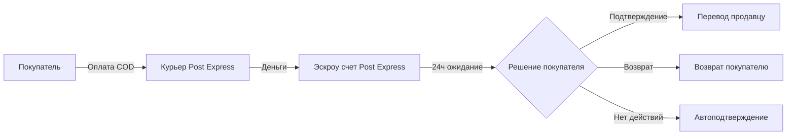
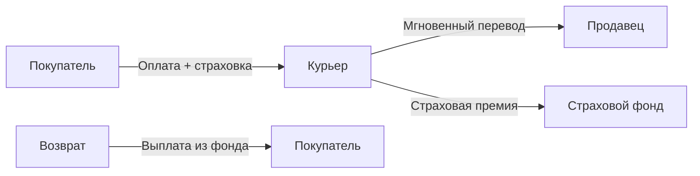
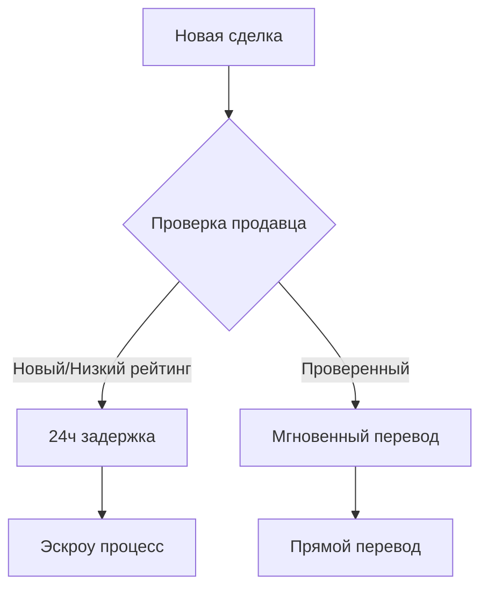

# 🔐 Концепция безопасных сделок через Post Express

**Документ:** Детальное описание системы защиты покупателей  
**Версия:** 1.0  
**Дата:** 5 сентября 2025  
**Статус:** Предложение для Post Express

---

## 📋 Оглавление

1. [Проблема и решение](#проблема-и-решение)
2. [Модели реализации](#модели-реализации)
3. [Техническая реализация](#техническая-реализация)
4. [Финансовые потоки](#финансовые-потоки)
5. [Преимущества для всех сторон](#преимущества-для-всех-сторон)
6. [Риски и их митигация](#риски-и-их-митигация)
7. [Roadmap внедрения](#roadmap-внедрения)

---

## 🎯 Проблема и решение

### Текущие проблемы рынка:

1. **Недоверие покупателей:**
   - Страх получить некачественный товар
   - Боязнь мошенничества при C2C сделках
   - Отсутствие возможности проверки до оплаты

2. **Проблемы продавцов:**
   - Необоснованные возвраты
   - Долгие споры с покупателями
   - Репутационные риски

3. **Проблемы Post Express:**
   - Курьеры становятся участниками конфликтов
   - Сложности с возвратами
   - Негативное влияние на имидж

### Наше решение: "24-часовая защита покупателя"

Система, где покупатель получает **24 часа на проверку товара** после получения, а деньги находятся под защитой до подтверждения сделки.

---

## 🔄 Модели реализации

### Модель A: Полный эскроу Post Express



**Преимущества:**
- Полный контроль Post Express
- Максимальная защита покупателя
- Простота реализации

**Недостатки:**
- Задержка средств продавцов
- Необходимость в эскроу-инфраструктуре

### Модель B: Страховая модель



**Преимущества:**
- Мгновенные выплаты продавцам
- Не требует задержки средств
- Самофинансируемая модель

**Недостатки:**
- Дополнительные расходы покупателя
- Сложность расчета премий

### Модель C: Гибридная модель с scoring



**Преимущества:**
- Баланс между защитой и скоростью
- Мотивация для продавцов
- Снижение операционной нагрузки

---

## 💻 Техническая реализация

### Новые статусы в WSP API:

```json
{
  "tracking_statuses": [
    {
      "code": "DELIVERED_PENDING",
      "name": "Доставлено - ожидает подтверждения",
      "description": "Товар доставлен, начался период проверки"
    },
    {
      "code": "BUYER_CONFIRMED",
      "name": "Подтверждено покупателем",
      "description": "Покупатель подтвердил качество товара"
    },
    {
      "code": "RETURN_INITIATED",
      "name": "Инициирован возврат",
      "description": "Покупатель запросил возврат в период проверки"
    },
    {
      "code": "FUNDS_RELEASED",
      "name": "Средства переведены",
      "description": "Деньги отправлены продавцу"
    },
    {
      "code": "FUNDS_REFUNDED",
      "name": "Средства возвращены",
      "description": "Деньги возвращены покупателю"
    }
  ]
}
```

### API endpoints для управления:

```http
# Подтверждение получения товара
POST /api/v1/secure-transaction/confirm
{
  "tracking_number": "PE746090324RS",
  "buyer_id": "12345",
  "confirmation_code": "ABC123"
}

# Инициация возврата
POST /api/v1/secure-transaction/return
{
  "tracking_number": "PE746090324RS",
  "buyer_id": "12345",
  "reason": "Товар не соответствует описанию",
  "photos": ["url1", "url2"]
}

# Проверка статуса средств
GET /api/v1/secure-transaction/status/{tracking_number}
```

### Интеграция с платежными системами:

```python
class SecureTransactionFlow:
    def process_cod_payment(self, amount, tracking_number):
        # 1. Прием платежа курьером
        payment = self.accept_payment(amount)
        
        # 2. Блокировка на эскроу
        escrow_id = self.escrow_service.hold_funds(
            payment_id=payment.id,
            amount=amount,
            hold_period_hours=24,
            tracking_number=tracking_number
        )
        
        # 3. Уведомление участников
        self.notify_buyer(tracking_number, "24h_protection_started")
        self.notify_seller(tracking_number, "payment_on_hold")
        
        # 4. Запуск таймера
        self.schedule_auto_release(escrow_id, hours=24)
        
        return escrow_id
```

---

## 💰 Финансовые потоки

### Сценарий 1: Успешная сделка

| Время | Действие | Баланс эскроу | Баланс продавца |
|-------|----------|---------------|------------------|
| 0ч | Доставка и оплата COD | +5000 RSD | 0 |
| 12ч | Покупатель проверяет товар | 5000 RSD | 0 |
| 18ч | Покупатель подтверждает | -5000 RSD | +4925 RSD* |

*После вычета комиссии COD 1.5%

### Сценарий 2: Возврат

| Время | Действие | Баланс эскроу | Баланс покупателя |
|-------|----------|---------------|--------------------|
| 0ч | Доставка и оплата COD | +5000 RSD | -5000 RSD |
| 6ч | Обнаружен дефект | 5000 RSD | -5000 RSD |
| 7ч | Инициирован возврат | 5000 RSD | -5000 RSD |
| 8ч | Возврат одобрен | -5000 RSD | 0 RSD |

### Комиссионная структура:

```
Базовая доставка: 350 RSD
+ COD комиссия: 1.5% от суммы
+ Эскроу сервис: 0.5% от суммы (опционально)
+ Страховка сделки: 1% от суммы (для модели B)
= Итого: ~3-4% от суммы сделки
```

---

## 🎉 Преимущества для всех сторон

### Для покупателей:
- ✅ Возможность проверить товар перед окончательной оплатой
- ✅ Защита от мошенничества и некачественных товаров
- ✅ Простой процесс возврата без споров
- ✅ Повышение доверия к онлайн-покупкам

### Для продавцов:
- ✅ Снижение необоснованных возвратов
- ✅ Повышение доверия покупателей = больше продаж
- ✅ Четкие правила и сроки
- ✅ Защита от мошенничества покупателей (после 24ч)

### Для Post Express:
- ✅ Уникальное конкурентное преимущество
- ✅ Новый источник дохода (эскроу-комиссии)
- ✅ Повышение лояльности клиентов
- ✅ Позиционирование как инноватора рынка

### Для Sve Tu:
- ✅ Увеличение конверсии в покупки
- ✅ Снижение количества споров
- ✅ Улучшение репутации платформы
- ✅ Привлечение качественных продавцов

---

## ⚠️ Риски и их митигация

### Риск 1: Злоупотребления покупателями

**Проблема:** Покупатели могут использовать товар 24 часа и возвращать.

**Митигация:**
- Лимит возвратов на покупателя (например, не более 20%)
- Черный список серийных "возвращателей"
- Требование фото/видео доказательств проблемы
- Страховая модель вместо полного возврата

### Риск 2: Задержка средств продавцов

**Проблема:** Продавцы недовольны ожиданием 24 часа.

**Митигация:**
- Гибридная модель с мгновенными выплатами проверенным
- Возможность досрочного подтверждения покупателем
- Компенсационные бонусы для продавцов

### Риск 3: Операционная сложность

**Проблема:** Сложность управления эскроу-процессами.

**Митигация:**
- Автоматизация через API
- Четкие SLA и процедуры
- Поэтапное внедрение с пилотной группой

### Риск 4: Юридические вопросы

**Проблема:** Регуляторные требования к эскроу.

**Митигация:**
- Консультации с юристами
- Партнерство с банком для эскроу-счетов
- Соответствие требованиям НБС

---

## 📅 Roadmap внедрения

### Фаза 1: Пилот (Месяц 1-2)
- [ ] Выбор 100 проверенных продавцов
- [ ] Реализация базового функционала
- [ ] Тестирование на категории "Электроника"
- [ ] Сбор обратной связи

### Фаза 2: Расширение (Месяц 3-4)
- [ ] Добавление всех категорий товаров
- [ ] Интеграция с банком для эскроу
- [ ] Запуск для всех продавцов с рейтингом 4+
- [ ] Маркетинговая кампания

### Фаза 3: Полный запуск (Месяц 5-6)
- [ ] Доступность для всех пользователей
- [ ] Внедрение scoring-системы
- [ ] API для партнеров
- [ ] Мобильное приложение с push-уведомлениями

### Фаза 4: Оптимизация (Месяц 7-12)
- [ ] Machine Learning для оценки рисков
- [ ] Автоматизация спорных ситуаций
- [ ] Расширение на B2B сегмент
- [ ] Международные транзакции

---

## 📊 KPI и метрики успеха

### Целевые показатели:

| Метрика | Текущее | Цель (6 мес) | Цель (1 год) |
|---------|---------|--------------|--------------|
| Конверсия в покупку | 2% | 4% | 6% |
| Процент возвратов | 15% | 10% | 7% |
| NPS покупателей | 30 | 50 | 70 |
| NPS продавцов | 25 | 40 | 60 |
| Доля защищенных сделок | 0% | 30% | 60% |

### Мониторинг:

```sql
-- Ежедневный дашборд
SELECT 
    DATE(created_at) as date,
    COUNT(*) as total_transactions,
    SUM(CASE WHEN status = 'confirmed' THEN 1 ELSE 0 END) as confirmed,
    SUM(CASE WHEN status = 'returned' THEN 1 ELSE 0 END) as returned,
    AVG(confirmation_time_hours) as avg_confirmation_time,
    SUM(escrow_amount) as total_escrow_value
FROM secure_transactions
GROUP BY DATE(created_at);
```

---

## 🤝 Предложение для Post Express

### Вариант "Быстрый старт":
1. Начинаем БЕЗ эскроу - просто добавляем статусы
2. Собираем статистику по возвратам
3. Через 3 месяца запускаем полноценный эскроу

### Вариант "Полная интеграция":
1. Сразу внедряем эскроу через партнерский банк
2. Post Express получает % от каждой защищенной сделки
3. Совместный маркетинг новой услуги

### Вариант "Белая метка":
1. Post Express запускает услугу под своим брендом
2. Sve Tu первый клиент с эксклюзивом на 6 месяцев
3. Далее - продажа другим маркетплейсам

---

## 📞 Контакты для обсуждения

**Sve Tu Platform**  
Email: secure@svetu.rs  
Телефон: +381 XX XXX-XX-XX  

Мы готовы к детальному обсуждению и адаптации концепции под возможности и требования Post Express.

---

*Данная концепция является интеллектуальной собственностью Sve Tu Platform и передается Post Express для рассмотрения возможности совместной реализации.*