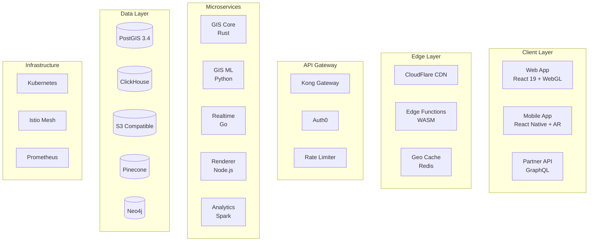

# 🏗️ PERFECT GIS: Техническая архитектура будущего

**Версия**: 1.0  
**Дата**: 2025-01-10  
**Статус**: Детальная архитектура инновационного решения

## 🎯 Архитектурные принципы

1. **Cloud-Native First** - рождено для облака
2. **Event-Driven** - реактивная архитектура  
3. **AI-Powered** - ML в каждом компоненте
4. **Edge Computing** - вычисления на границе сети
5. **Zero Trust Security** - безопасность по умолчанию

## 🏛️ High-Level Architecture



## 💻 Микросервисы в деталях

### 1. GIS Core Service (Rust)

```rust
// Высокопроизводительный сервис геооператций
pub struct GisCore {
    postgis: PostgisPool,
    h3_index: H3Index,
    cache: RedisPool,
}

impl GisCore {
    // Молниеносный поиск через H3 индексацию
    pub async fn spatial_search(&self, params: SearchParams) -> Result<Vec<Listing>> {
        let h3_cells = h3::polyfill(&params.polygon, params.resolution);
        
        // Параллельный поиск по ячейкам
        let results = futures::stream::iter(h3_cells)
            .map(|cell| self.search_cell(cell))
            .buffer_unordered(10)
            .collect::<Vec<_>>()
            .await;
            
        Ok(self.merge_and_rank(results))
    }
    
    // 3D пространственные операции
    pub fn calculate_3d_visibility(&self, observer: Point3D, targets: Vec<Building3D>) -> Vec<bool> {
        // Расчет видимости с учетом рельефа и зданий
        self.postgis.st_3d_intersects(observer, targets)
    }
}
```

### 2. GIS ML Service (Python)

```python
# Сервис машинного обучения для гео
class GisMLService:
    def __init__(self):
        self.demand_model = self._load_model('demand_prediction')
        self.route_model = self._load_model('route_optimization')
        self.price_model = self._load_model('geo_pricing')
        
    async def predict_demand_heatmap(self, 
                                    category: str,
                                    timeframe: TimeRange) -> GeoDataFrame:
        """Предсказывает спрос по гексагонам H3"""
        features = await self._extract_features(category, timeframe)
        
        # Предсказание для каждого гексагона
        predictions = self.demand_model.predict(features)
        
        # Сглаживание через геостатистику
        smoothed = self._kriging_interpolation(predictions)
        
        return self._create_heatmap(smoothed)
        
    async def optimize_delivery_routes(self,
                                     orders: List[Order],
                                     constraints: DeliveryConstraints) -> List[Route]:
        """AI оптимизация маршрутов с учетом трафика"""
        # Граф дорог с предсказанием трафика
        road_graph = await self._build_traffic_graph()
        
        # Генетический алгоритм для VRP
        routes = self.route_model.optimize(
            orders, 
            road_graph,
            constraints
        )
        
        return routes
```

### 3. Realtime Service (Go)

```go
// Сервис real-time событий и трекинга
type RealtimeService struct {
    redisStreams *redis.Client
    wsHub        *websocket.Hub
    trackers     map[string]*LocationTracker
}

// Обработка потока геособытий
func (s *RealtimeService) ProcessGeoStream(ctx context.Context) {
    stream := s.redisStreams.XRead(ctx, &redis.XReadArgs{
        Streams: []string{"geo:events", "$"},
        Block:   0,
    })
    
    for _, msg := range stream[0].Messages {
        event := parseGeoEvent(msg)
        
        switch event.Type {
        case "delivery_update":
            s.updateDeliveryLocation(event)
        case "user_location":
            s.updateNearbyListings(event)
        case "store_opened":
            s.notifyNearbyUsers(event)
        }
        
        // Broadcast to WebSocket clients
        s.wsHub.Broadcast(event)
    }
}

// Геофенсинг для уведомлений
func (s *RealtimeService) CheckGeofences(location Point) []Notification {
    var notifications []Notification
    
    // Проверка всех активных геофенсов
    for _, fence := range s.getActiveGeofences() {
        if fence.Contains(location) {
            notifications = append(notifications, fence.Notification)
        }
    }
    
    return notifications
}
```

### 4. Render Service (Node.js + WebGL)

```typescript
// Сервис генерации тайлов и 3D моделей
export class RenderService {
    private tileCache: TileCache;
    private vectorEngine: MapboxGL;
    private threeDEngine: Three.js;
    
    // Генерация векторных тайлов на лету
    async generateVectorTile(z: number, x: number, y: number): Promise<Buffer> {
        const cacheKey = `tile:${z}:${x}:${y}`;
        
        // Проверка кэша
        const cached = await this.tileCache.get(cacheKey);
        if (cached) return cached;
        
        // Генерация тайла
        const features = await this.loadFeatures(z, x, y);
        const tile = await this.vectorEngine.createTile(features, {
            simplification: this.getSimplification(z),
            attributes: ['id', 'price', 'category']
        });
        
        // Кэширование
        await this.tileCache.set(cacheKey, tile, TTL_BY_ZOOM[z]);
        
        return tile;
    }
    
    // Генерация 3D модели здания
    async generate3DBuilding(buildingId: string): Promise<GLTFModel> {
        const footprint = await this.loadBuildingFootprint(buildingId);
        const height = await this.estimateBuildingHeight(buildingId);
        
        // Процедурная генерация 3D модели
        const model = this.threeDEngine.extrudeBuilding(footprint, height, {
            texture: 'serbian_facade',
            windows: this.generateWindows(height),
            roof: this.generateRoof(footprint)
        });
        
        // Оптимизация для WebGL
        return this.optimizeForWeb(model);
    }
}
```

### 5. Analytics Service (Spark + ClickHouse)

```scala
// Сервис пространственной аналитики
object GeoAnalytics extends SparkSessionWrapper {
    
    // Анализ пространственных паттернов покупок
    def analyzePurchasePatterns(timeRange: TimeRange): Dataset[SpatialPattern] = {
        val purchases = spark.read
            .format("clickhouse")
            .option("query", s"""
                SELECT user_id, listing_id, lat, lon, timestamp, amount
                FROM purchases
                WHERE timestamp BETWEEN '${timeRange.start}' AND '${timeRange.end}'
            """)
            .load()
            
        // Кластеризация через DBSCAN
        val clusters = purchases
            .select("lat", "lon", "amount")
            .map(row => (row.getDouble(0), row.getDouble(1), row.getDouble(2)))
            .rdd
            .pipe("python3 /opt/analytics/dbscan_geo.py")
            
        // Анализ паттернов
        clusters
            .groupBy("cluster_id")
            .agg(
                avg("amount").as("avg_purchase"),
                count("*").as("purchase_count"),
                stddev("amount").as("purchase_variance")
            )
            .withColumn("pattern_type", classifyPattern(col("avg_purchase"), col("purchase_variance")))
    }
    
    // Предсказание горячих точек
    def predictHotspots(category: String, futureDate: Date): DataFrame = {
        val historicalData = loadHistoricalHotspots(category)
        
        // Временные ряды + пространственная автокорреляция
        val predictions = historicalData
            .withColumn("spatial_lag", spatialLag($"value", $"geometry"))
            .withColumn("temporal_trend", temporalTrend($"timestamp", $"value"))
            .select(
                predictHotspot($"spatial_lag", $"temporal_trend", lit(futureDate)).as("prediction"),
                $"geometry"
            )
            
        predictions.filter($"prediction.confidence" > 0.8)
    }
}
```

## 🗄️ Инновационная схема данных

### PostGIS 3.4 Extensions

```sql
-- Включаем продвинутые расширения
CREATE EXTENSION postgis;
CREATE EXTENSION postgis_topology;
CREATE EXTENSION postgis_raster;
CREATE EXTENSION h3_pg; -- H3 индексация
CREATE EXTENSION pgrouting; -- Маршрутизация
CREATE EXTENSION pointcloud; -- Облака точек для LiDAR

-- Главная таблица с 3D геометрией
CREATE TABLE listings_3d (
    id UUID PRIMARY KEY DEFAULT gen_random_uuid(),
    title TEXT NOT NULL,
    -- 3D точка с высотой
    location GEOMETRY(PointZ, 4326) NOT NULL,
    -- H3 индекс для быстрого поиска
    h3_index_7 TEXT GENERATED ALWAYS AS (h3_geo_to_h3(location, 7)) STORED,
    h3_index_9 TEXT GENERATED ALWAYS AS (h3_geo_to_h3(location, 9)) STORED,
    -- 3D модель здания (если есть)
    building_model GEOMETRY(PolyhedralSurfaceZ, 4326),
    -- Метаданные для ML
    embeddings vector(384), -- Векторные эмбеддинги
    created_at TIMESTAMPTZ DEFAULT now(),
    
    -- Индексы
    CONSTRAINT listings_3d_location_idx GIST (location),
    INDEX listings_3d_h3_7_idx (h3_index_7),
    INDEX listings_3d_h3_9_idx (h3_index_9),
    INDEX listings_3d_embeddings_idx USING ivfflat (embeddings)
);

-- Таблица дорожной сети для маршрутизации
CREATE TABLE road_network (
    id BIGSERIAL PRIMARY KEY,
    geom GEOMETRY(LineString, 4326) NOT NULL,
    source BIGINT,
    target BIGINT,
    cost DOUBLE PRECISION, -- Время в минутах
    reverse_cost DOUBLE PRECISION,
    -- Дополнительные атрибуты
    road_type TEXT,
    max_speed INTEGER,
    traffic_factor DOUBLE PRECISION DEFAULT 1.0,
    
    -- Индексы для pgRouting
    INDEX road_network_source_idx (source),
    INDEX road_network_target_idx (target),
    INDEX road_network_geom_idx USING GIST (geom)
);

-- Растровые данные (спутниковые снимки, тепловые карты)
CREATE TABLE geo_rasters (
    id SERIAL PRIMARY KEY,
    rast_type TEXT NOT NULL, -- 'satellite', 'heatmap', 'elevation'
    rast RASTER NOT NULL,
    metadata JSONB,
    acquired_at TIMESTAMPTZ,
    
    -- Пространственный индекс на растр
    CONSTRAINT geo_rasters_rast_idx USING GIST (ST_ConvexHull(rast))
);
```

### ClickHouse для аналитики

```sql
-- Таблица событий с геолокацией
CREATE TABLE geo_events (
    event_id UUID,
    user_id UUID,
    event_type String,
    lat Float64,
    lon Float64,
    h3_index_7 String,
    h3_index_9 String,
    properties String, -- JSON
    timestamp DateTime64(3)
) ENGINE = MergeTree()
PARTITION BY toYYYYMM(timestamp)
ORDER BY (h3_index_7, timestamp, event_id)
SETTINGS index_granularity = 8192;

-- Материализованное представление для real-time аналитики
CREATE MATERIALIZED VIEW geo_events_5min
ENGINE = AggregatingMergeTree()
PARTITION BY toDate(timestamp)
ORDER BY (h3_index_7, window_start)
AS SELECT
    h3_index_7,
    tumbleStart(timestamp, toIntervalMinute(5)) as window_start,
    count() as event_count,
    uniqExact(user_id) as unique_users,
    avg(lat) as center_lat,
    avg(lon) as center_lon,
    groupArray(event_type) as event_types
FROM geo_events
GROUP BY h3_index_7, window_start;
```

## 🚀 Deployment Architecture

### Kubernetes Configuration

```yaml
# GIS Core Service
apiVersion: apps/v1
kind: Deployment
metadata:
  name: gis-core
spec:
  replicas: 5
  selector:
    matchLabels:
      app: gis-core
  template:
    metadata:
      labels:
        app: gis-core
    spec:
      containers:
      - name: gis-core
        image: svetu/gis-core:latest
        resources:
          requests:
            memory: "2Gi"
            cpu: "1000m"
          limits:
            memory: "4Gi"
            cpu: "2000m"
        env:
        - name: RUST_BACKTRACE
          value: "1"
        - name: POSTGIS_URL
          valueFrom:
            secretKeyRef:
              name: postgis-secret
              key: url
        readinessProbe:
          httpGet:
            path: /health
            port: 8080
          initialDelaySeconds: 10
        livenessProbe:
          httpGet:
            path: /health
            port: 8080
          periodSeconds: 30
      nodeSelector:
        workload-type: compute-optimized
---
# HorizontalPodAutoscaler
apiVersion: autoscaling/v2
kind: HorizontalPodAutoscaler
metadata:
  name: gis-core-hpa
spec:
  scaleTargetRef:
    apiVersion: apps/v1
    kind: Deployment
    name: gis-core
  minReplicas: 3
  maxReplicas: 20
  metrics:
  - type: Resource
    resource:
      name: cpu
      target:
        type: Utilization
        averageUtilization: 70
  - type: Pods
    pods:
      metric:
        name: geo_requests_per_second
      target:
        type: AverageValue
        averageValue: "1000"
```

### Service Mesh (Istio)

```yaml
# Circuit breaker для внешних гео-сервисов
apiVersion: networking.istio.io/v1beta1
kind: DestinationRule
metadata:
  name: nominatim-circuit-breaker
spec:
  host: nominatim.openstreetmap.org
  trafficPolicy:
    connectionPool:
      tcp:
        maxConnections: 10
      http:
        http1MaxPendingRequests: 100
        http2MaxRequests: 100
        maxRequestsPerConnection: 5
    outlierDetection:
      consecutiveGatewayErrors: 5
      interval: 30s
      baseEjectionTime: 30s
      maxEjectionPercent: 50
      minHealthPercent: 50
      splitExternalLocalOriginErrors: true
```

## 🔒 Security Architecture

### 1. Zero Trust для геоданных

```typescript
// Middleware для проверки доступа к геоданным
export class GeoSecurityMiddleware {
    async validateGeoAccess(req: Request, res: Response, next: Next) {
        const { userId, requestedBounds, zoomLevel } = req;
        
        // Проверка прав на просмотр области
        const permissions = await this.getGeoPermissions(userId);
        
        // Ограничение по зуму для обычных пользователей
        if (!permissions.isPremium && zoomLevel > 16) {
            throw new GeoAccessError('Detailed zoom requires premium');
        }
        
        // Проверка rate limits по области
        const requestCount = await this.getAreaRequestCount(userId, requestedBounds);
        if (requestCount > permissions.areaRateLimit) {
            throw new GeoRateLimitError('Area request limit exceeded');
        }
        
        // Логирование для аудита
        await this.logGeoAccess(userId, requestedBounds, zoomLevel);
        
        next();
    }
}
```

### 2. Шифрование геоданных

```go
// Гомоморфное шифрование для приватных локаций
type EncryptedLocation struct {
    EncryptedLat []byte
    EncryptedLon []byte
    PublicKey    *paillier.PublicKey
}

func (e *EncryptedLocation) DistanceTo(other *EncryptedLocation) *EncryptedDistance {
    // Вычисление расстояния без расшифровки
    return paillier.HomomorphicDistance(e, other)
}
```

## 📊 Monitoring & Observability

### Метрики Prometheus

```yaml
# Кастомные метрики для GIS
- name: gis_spatial_query_duration_seconds
  help: Histogram of spatial query durations
  type: histogram
  buckets: [0.01, 0.05, 0.1, 0.5, 1.0, 5.0]
  
- name: gis_tile_cache_hit_ratio
  help: Ratio of tile cache hits
  type: gauge
  
- name: gis_active_websocket_connections
  help: Number of active WebSocket connections for real-time updates
  type: gauge
  
- name: gis_h3_index_operations_total
  help: Counter of H3 index operations
  type: counter
  labels: [resolution, operation_type]
```

### Distributed Tracing

```typescript
// OpenTelemetry для трассировки гео-запросов
import { trace } from '@opentelemetry/api';

const tracer = trace.getTracer('gis-service');

export async function spatialSearch(params: SearchParams) {
    const span = tracer.startSpan('spatial_search', {
        attributes: {
            'geo.bounds': JSON.stringify(params.bounds),
            'geo.radius': params.radius,
            'geo.limit': params.limit
        }
    });
    
    try {
        // Поиск по H3 индексам
        const h3Span = tracer.startSpan('h3_index_search', { parent: span });
        const h3Results = await searchByH3Index(params);
        h3Span.end();
        
        // PostGIS уточнение
        const postgisSpan = tracer.startSpan('postgis_refine', { parent: span });
        const refined = await refineWithPostGIS(h3Results, params);
        postgisSpan.end();
        
        span.setStatus({ code: SpanStatusCode.OK });
        return refined;
    } catch (error) {
        span.recordException(error);
        span.setStatus({ code: SpanStatusCode.ERROR });
        throw error;
    } finally {
        span.end();
    }
}
```

## 🎯 Заключение

Эта архитектура обеспечивает:

1. **Молниеносную скорость** - H3 индексация + кэширование
2. **Безграничное масштабирование** - микросервисы + K8s
3. **Интеллектуальность** - ML на всех уровнях
4. **Безопасность** - Zero Trust + шифрование
5. **Надежность** - Circuit breakers + мониторинг

**PERFECT GIS** - это не просто карта, это интеллектуальная геопространственная платформа будущего! 🚀