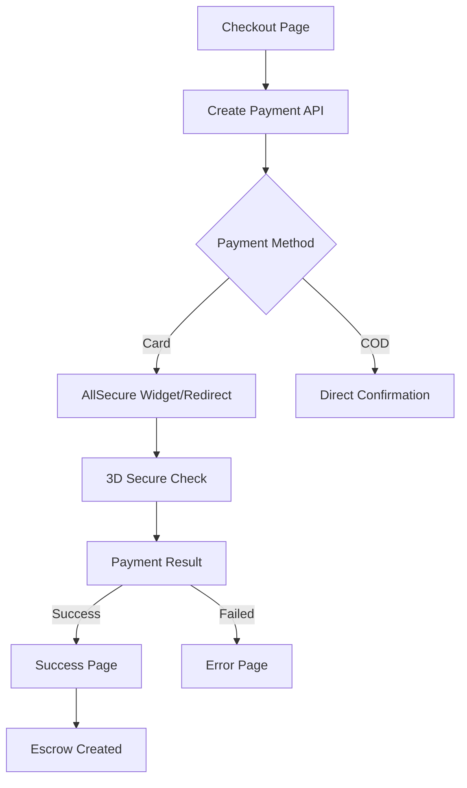

# План интеграции AllSecure Widget для Frontend

## 📋 Обзор

Интеграция платежной системы AllSecure на frontend для маркетплейса SveTu. Backend уже полностью готов с реализованными API endpoints.

## 🎯 Цели интеграции

1. Безопасная обработка платежей через AllSecure
2. Поддержка двухэтапного процесса (preauthorize → capture) для escrow
3. Минимальное влияние на UX при максимальной безопасности
4. PCI DSS compliance

## 🏗 Архитектура решения

### 1. Компоненты Frontend

```typescript
// Структура компонентов
src/
├── components/payment/
│   ├── AllSecureWidget.tsx         // Wrapper для widget/iframe
│   ├── PaymentProcessing.tsx       // Страница обработки платежа
│   └── PaymentResult.tsx           // Результат платежа
├── hooks/
│   └── useAllSecurePayment.ts      // Hook для работы с платежами
├── services/
│   └── allSecureService.ts         // API сервис
└── app/[locale]/payment/
    ├── process/[id]/page.tsx       // Обработка платежа
    ├── success/page.tsx            // Успешный платеж
    └── error/page.tsx              // Ошибка платежа
```

### 2. Flow платежа



## 📝 Детальный план реализации

### Фаза 1: Базовая Redirect интеграция (2 дня)

#### День 1: API интеграция и базовый flow

1. **Создать сервис для работы с платежами**
```typescript
// services/allSecureService.ts
export class AllSecureService {
  async createPayment(data: PaymentRequest): Promise<PaymentResponse>
  async getPaymentStatus(paymentId: string): Promise<PaymentStatus>
  async handleReturn(params: URLSearchParams): Promise<PaymentResult>
}
```

2. **Создать hook для управления платежами**
```typescript
// hooks/useAllSecurePayment.ts
export function useAllSecurePayment() {
  const createPayment = async (listingId, amount) => { }
  const checkStatus = async (paymentId) => { }
  const handlePaymentReturn = async () => { }
  
  return { createPayment, checkStatus, handlePaymentReturn }
}
```

3. **Модифицировать checkout для redirect**
```typescript
// Добавить в checkout/page.tsx
const handleCardPayment = async () => {
  // 1. Создать платеж через API
  const payment = await createPayment({...})
  
  // 2. Сохранить ID в localStorage
  localStorage.setItem('pending_payment', payment.id)
  
  // 3. Redirect на AllSecure
  window.location.href = payment.redirect_url
}
```

#### День 2: Обработка возврата и результатов

1. **Страница обработки платежа**
```typescript
// app/[locale]/payment/process/[id]/page.tsx
export default function PaymentProcessPage() {
  // Получить параметры из URL
  // Проверить статус через API
  // Показать результат или redirect
}
```

2. **Страницы результатов**
```typescript
// success/page.tsx - успешный платеж
// error/page.tsx - ошибка платежа
// Показать детали заказа, escrow статус
```

3. **Обновить Redux state**
```typescript
// Добавить в paymentSlice
- handlePaymentSuccess
- handlePaymentError
- clearPendingPayment
```

### Фаза 2: Widget интеграция (1 день)

1. **Компонент AllSecure Widget**
```typescript
// components/payment/AllSecureWidget.tsx
interface AllSecureWidgetProps {
  paymentId: string
  amount: number
  currency: string
  onSuccess: (result) => void
  onError: (error) => void
}

export function AllSecureWidget({...}: AllSecureWidgetProps) {
  useEffect(() => {
    // Загрузить AllSecure SDK
    // Инициализировать widget
    // Настроить callbacks
  }, [])
  
  return <div id="allsecure-widget" />
}
```

2. **Интеграция в checkout**
```typescript
// Опция выбора между redirect и widget
const [useWidget, setUseWidget] = useState(true)

{useWidget ? (
  <AllSecureWidget {...widgetProps} />
) : (
  <button onClick={handleRedirect}>Pay with Card</button>
)}
```

### Фаза 3: UX улучшения (2 дня)

1. **Анимации и индикаторы**
   - Skeleton loading при загрузке widget
   - Progress bar для redirect flow
   - Анимации успеха/ошибки

2. **Обработка ошибок**
   - Retry механизм
   - Fallback на redirect если widget не загрузился
   - Информативные сообщения об ошибках

3. **Мобильная оптимизация**
   - Адаптивный дизайн widget
   - Touch-friendly интерфейс
   - Оптимизация для медленных соединений

4. **История платежей**
   - Страница с историей транзакций
   - Фильтры и поиск
   - Экспорт в PDF/CSV

### Фаза 4: Testing & Security (1 день)

1. **Тестирование**
   - Unit тесты для hooks и сервисов
   - E2E тесты основных сценариев
   - Тестирование на реальных устройствах

2. **Безопасность**
   - Валидация всех входных данных
   - Защита от XSS при работе с widget
   - Безопасное хранение payment ID
   - CSP headers для widget

3. **Мониторинг**
   - Логирование ошибок платежей
   - Метрики конверсии
   - Алерты при сбоях

## 🔧 Технические детали

### Конфигурация

```typescript
// config/payment.ts
export const PAYMENT_CONFIG = {
  // URLs
  WIDGET_URL: process.env.NEXT_PUBLIC_ALLSECURE_WIDGET_URL,
  RETURN_URL: `${process.env.NEXT_PUBLIC_APP_URL}/payment/process`,
  
  // Timeouts
  PAYMENT_TIMEOUT: 300000, // 5 min
  STATUS_POLL_INTERVAL: 3000, // 3 sec
  
  // Features
  ENABLE_WIDGET: process.env.NEXT_PUBLIC_ENABLE_PAYMENT_WIDGET === 'true',
  ENABLE_3DS: true,
  
  // Test mode
  TEST_MODE: process.env.NODE_ENV !== 'production',
  TEST_CARDS: [
    { number: '4111111111111111', name: 'Success', cvv: '123' },
    { number: '5555555555554444', name: '3D Secure', cvv: '123' },
    { number: '4000000000000002', name: 'Decline', cvv: '123' }
  ]
}
```

### Обработка статусов

```typescript
// Маппинг статусов AllSecure → UI
const STATUS_MAP = {
  'pending': { icon: Clock, color: 'warning', message: 'Processing...' },
  'authorized': { icon: Shield, color: 'info', message: 'Payment authorized' },
  'captured': { icon: Check, color: 'success', message: 'Payment completed' },
  'failed': { icon: X, color: 'error', message: 'Payment failed' },
  'refunded': { icon: RefundIcon, color: 'neutral', message: 'Refunded' }
}
```

### Обработка ошибок

```typescript
// Типы ошибок и их обработка
enum PaymentErrorType {
  NETWORK_ERROR = 'NETWORK_ERROR',
  CARD_DECLINED = 'CARD_DECLINED',
  INSUFFICIENT_FUNDS = 'INSUFFICIENT_FUNDS',
  EXPIRED_CARD = 'EXPIRED_CARD',
  INVALID_CVV = 'INVALID_CVV',
  FRAUD_SUSPECTED = 'FRAUD_SUSPECTED',
  TIMEOUT = 'TIMEOUT',
  UNKNOWN = 'UNKNOWN'
}

const ERROR_MESSAGES = {
  [PaymentErrorType.NETWORK_ERROR]: {
    ru: 'Ошибка сети. Проверьте соединение.',
    en: 'Network error. Please check your connection.'
  },
  // ... остальные сообщения
}
```

## 📊 Метрики успеха

1. **Технические метрики**
   - Время загрузки widget < 2 сек
   - Успешность платежей > 95%
   - Время обработки платежа < 30 сек

2. **Бизнес метрики**
   - Конверсия в оплату > 70%
   - Снижение отказов на 20%
   - Удовлетворенность UX > 4.5/5

## 🚀 Checklist для запуска

### Перед началом разработки
- [ ] Получить sandbox credentials от AllSecure
- [ ] Получить документацию по widget (если доступен)
- [ ] Настроить webhook URL на staging
- [ ] Получить тестовые карты

### Перед production
- [ ] Production credentials от AllSecure
- [ ] SSL сертификат для webhook
- [ ] Настроить мониторинг и алерты
- [ ] Load testing платежного flow
- [ ] Backup план при сбоях AllSecure

## 📚 Полезные ресурсы

1. **AllSecure документация**: https://docs.allsecure.rs
2. **PCI DSS для e-commerce**: https://www.pcisecuritystandards.org
3. **Примеры интеграций**: См. backend код в `/backend/internal/pkg/allsecure/`

## 🔄 Следующие шаги

1. Запросить credentials у AllSecure (info@allsecure.rs)
2. Начать с Фазы 1 - базовый redirect flow
3. Параллельно готовить UI/UX для widget интеграции
4. Тестирование на staging окружении
5. Постепенный rollout на production