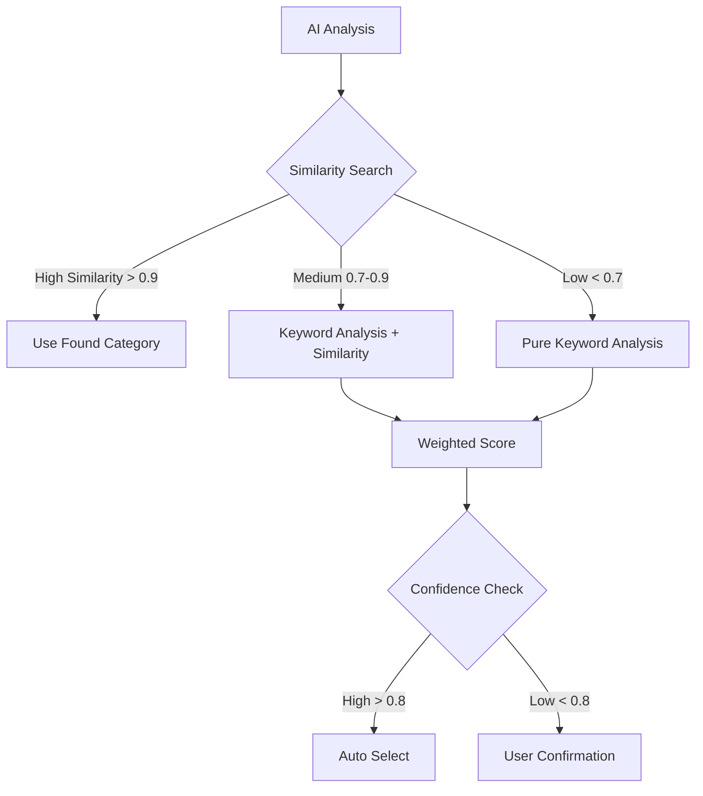

# Комбинированный подход определения категорий

## Архитектура решения

### 1. Многоуровневая система определения категории



### 2. Алгоритм определения категории

```go
func (s *CategoryMatcher) DetermineCategory(ctx context.Context, aiData AIAnalysis) (*CategoryResult, error) {
    // Этап 1: Поиск похожих объявлений
    similarListings := s.findSimilarListings(ctx, aiData.Title, aiData.Description)
    
    if len(similarListings) > 0 && similarListings[0].Similarity > 0.9 {
        // Очень похожее объявление найдено - используем его категорию
        return &CategoryResult{
            CategoryID: similarListings[0].CategoryID,
            Confidence: similarListings[0].Similarity,
            Method: "similarity_exact",
        }, nil
    }
    
    // Этап 2: Комбинированный анализ
    scores := make(map[int]CategoryScore)
    
    // 2.1 Веса от похожих объявлений
    for _, listing := range similarListings {
        score := scores[listing.CategoryID]
        score.SimilarityScore += listing.Similarity * 0.4 // 40% веса
        score.SimilarityCount++
        scores[listing.CategoryID] = score
    }
    
    // 2.2 Веса от ключевых слов
    keywordScores := s.analyzeKeywords(ctx, aiData.Keywords, aiData.Attributes)
    for catID, kwScore := range keywordScores {
        score := scores[catID]
        score.KeywordScore = kwScore * 0.6 // 60% веса
        scores[catID] = score
    }
    
    // 2.3 Бонусы за атрибуты
    for catID, score := range scores {
        if s.hasMatchingAttributes(catID, aiData.Attributes) {
            score.AttributeBonus = 0.1
        }
        scores[catID] = score
    }
    
    // Этап 3: Выбор лучшей категории
    best := s.selectBestCategory(scores)
    
    return &CategoryResult{
        CategoryID: best.CategoryID,
        Confidence: best.TotalScore,
        Method: "combined",
        Alternatives: s.getAlternatives(scores, best.CategoryID),
    }, nil
}
```

### 3. Структура таблицы category_keywords с улучшениями

```sql
CREATE TABLE category_keywords (
    id SERIAL PRIMARY KEY,
    category_id INTEGER NOT NULL REFERENCES marketplace_categories(id),
    keyword VARCHAR(100) NOT NULL,
    language VARCHAR(2) DEFAULT 'en',
    weight FLOAT DEFAULT 1.0,
    
    -- Новые поля для контекста
    keyword_type VARCHAR(20) DEFAULT 'general', -- main, synonym, brand, attribute, context
    is_negative BOOLEAN DEFAULT FALSE, -- исключающие слова
    min_confidence FLOAT DEFAULT 0.0, -- минимальная уверенность для срабатывания
    
    -- Статистика использования
    usage_count INTEGER DEFAULT 0,
    success_rate FLOAT DEFAULT 0.0,
    
    created_at TIMESTAMP DEFAULT CURRENT_TIMESTAMP,
    updated_at TIMESTAMP DEFAULT CURRENT_TIMESTAMP,
    
    INDEX idx_keyword_search (LOWER(keyword), language, category_id),
    INDEX idx_category_keywords (category_id, weight DESC),
    UNIQUE idx_unique_keyword (category_id, keyword, language)
);

-- Примеры с контекстом
INSERT INTO category_keywords (category_id, keyword, language, weight, keyword_type, is_negative) VALUES
-- Положительные ключевые слова для шин
(1304, 'шина', 'ru', 10.0, 'main', false),
(1304, 'резина', 'ru', 9.0, 'synonym', false),
(1304, 'протектор', 'ru', 6.0, 'context', false),

-- Исключающие слова (НЕ шины)
(1304, 'велосипед', 'ru', 5.0, 'context', true), -- велосипедная резина - не наша категория
(1304, 'ластик', 'ru', 10.0, 'context', true), -- резина-ластик - точно не шина
(1304, 'сапоги', 'ru', 8.0, 'context', true); -- резиновые сапоги - не шины
```

### 4. Статистика и обучение

```sql
-- Таблица для анализа эффективности
CREATE TABLE category_detection_stats (
    id SERIAL PRIMARY KEY,
    method VARCHAR(50), -- similarity, keywords, combined
    ai_suggested_category_id INTEGER,
    final_category_id INTEGER,
    confidence_score FLOAT,
    user_confirmed BOOLEAN,
    similar_listings_found INTEGER,
    matched_keywords TEXT[],
    processing_time_ms INTEGER,
    created_at TIMESTAMP DEFAULT CURRENT_TIMESTAMP
);

-- View для анализа эффективности методов
CREATE VIEW category_detection_effectiveness AS
SELECT 
    method,
    COUNT(*) as total_detections,
    AVG(CASE WHEN ai_suggested_category_id = final_category_id THEN 1 ELSE 0 END) as accuracy,
    AVG(confidence_score) as avg_confidence,
    AVG(processing_time_ms) as avg_time_ms
FROM category_detection_stats
WHERE created_at > NOW() - INTERVAL '30 days'
GROUP BY method;
```

### 5. Оптимизация производительности

```go
// Кэширование похожих объявлений
type SimilarityCache struct {
    redis *redis.Client
}

func (c *SimilarityCache) GetSimilar(title string) ([]SimilarListing, bool) {
    key := fmt.Sprintf("similar:%s", generateHash(title))
    cached, err := c.redis.Get(key).Result()
    if err != nil {
        return nil, false
    }
    
    var listings []SimilarListing
    json.Unmarshal([]byte(cached), &listings)
    return listings, true
}

func (c *SimilarityCache) SetSimilar(title string, listings []SimilarListing) {
    key := fmt.Sprintf("similar:%s", generateHash(title))
    data, _ := json.Marshal(listings)
    c.redis.Set(key, data, 24*time.Hour) // кэш на сутки
}
```

## Преимущества комбинированного подхода

1. **Высокая точность**: Используем реальные данные + семантику
2. **Быстрота для частых товаров**: Похожие объявления = мгновенный результат
3. **Гибкость для редких**: Keywords работают даже для новых категорий
4. **Самообучение**: Статистика показывает, какой метод лучше
5. **Контекст**: Исключающие слова предотвращают ошибки

## План внедрения

### Фаза 1: Подготовка данных
1. Создать таблицу category_keywords
2. Заполнить keywords для топ-100 категорий
3. Добавить исключающие слова

### Фаза 2: Similarity Search
1. Настроить more_like_this в OpenSearch
2. Реализовать кэширование
3. Создать API endpoint

### Фаза 3: Комбинирование
1. Реализовать взвешенный алгоритм
2. Добавить сбор статистики
3. Настроить пороги confidence

### Фаза 4: Оптимизация
1. Анализ статистики
2. Корректировка весов
3. Добавление новых keywords на основе данных