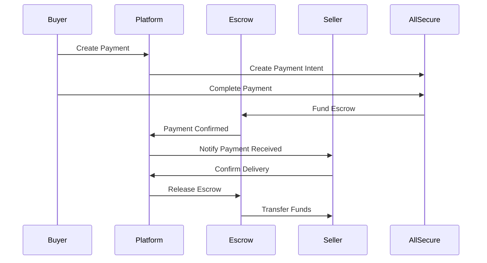

# Паспорт API Endpoints: Payments (Платежи)

## 📋 Метаданные
- **Группа API**: Payments
- **Базовый путь**: `/api/v1/payments`
- **Handler**: `backend/internal/proj/payments/handler/routes.go`
- **Количество endpoints**: 6
- **Интеграции**: AllSecure, Stripe, PostgreSQL

## 🎯 Назначение
Обработка платежей через интегрированные платежные системы:
- AllSecure платежи (основной провайдер для Сербии)
- Stripe платежи (международные карты)
- Escrow система защиты покупателей
- Webhook обработка от платежных провайдеров
- Возвраты и отмены платежей

## 📡 Endpoints

### 🔒 Защищенные (требуют авторизации)

#### POST `/api/v1/payments/create`
**Назначение**: Создание нового платежа через AllSecure
- **Handler**: `h.allsecure.CreatePayment`
- **Body**: CreatePaymentRequest
- **Response**: PaymentIntent с redirect_url
- **Flow**: Покупатель → AllSecure → Callback → Эскроу

#### POST `/api/v1/payments/:id/capture`
**Назначение**: Захват предавторизованного платежа
- **Handler**: `h.allsecure.CapturePayment`
- **When**: После подтверждения доставки товара
- **Security**: Только продавец или админ
- **Effect**: Деньги переводятся продавцу

#### POST `/api/v1/payments/:id/refund`
**Назначение**: Возврат платежа покупателю
- **Handler**: `h.allsecure.RefundPayment`
- **When**: Отмена заказа, спор, дефект товара
- **Body**: RefundRequest с суммой и причиной
- **Effect**: Деньги возвращаются покупателю

#### GET `/api/v1/payments/:id/status`
**Назначение**: Получение актуального статуса платежа
- **Handler**: `h.allsecure.GetPaymentStatus`
- **Response**: PaymentStatus с детальной информацией
- **Real-time**: Синхронизация с провайдером

### 🌐 Webhook Endpoints (публичные, но защищенные подписью)

#### POST `/api/v1/payments/stripe/webhook`
**Назначение**: Обработка событий от Stripe
- **Handler**: `h.HandleWebhook`
- **Security**: Проверка Stripe signature
- **Events**: payment_intent, invoice, charge
- **Effect**: Обновление статусов в БД

#### POST `/api/v1/webhooks/allsecure`
**Назначение**: Обработка событий от AllSecure
- **Handler**: `h.webhook.HandleAllSecureWebhook`
- **Security**: Проверка AllSecure signature
- **Events**: payment_confirmed, payment_failed, refund_processed
- **Effect**: Обновление статусов + уведомления

## 🎭 Структуры данных

### Основные модели платежей
```typescript
interface Payment {
  id: string;
  listing_id: string;
  buyer_id: string;
  seller_id: string;
  amount: number;
  currency: "RSD" | "EUR";
  status: PaymentStatus;
  provider: "allsecure" | "stripe";
  provider_payment_id: string;
  escrow_status: EscrowStatus;
  created_at: string;
  captured_at?: string;
  refunded_at?: string;
}

type PaymentStatus = 
  | "pending"           // создан, ожидает оплаты
  | "processing"        // обрабатывается провайдером
  | "confirmed"         // подтвержден, деньги в эскроу
  | "captured"          // захвачен, деньги у продавца
  | "refunded"          // возвращен покупателю
  | "failed"            // неудачный платеж
  | "cancelled";        // отменен

type EscrowStatus =
  | "pending"           // ожидает поступления денег
  | "funded"            // деньги в эскроу
  | "released"          // освобожден в пользу продавца
  | "refunded"          // возвращен покупателю
  | "disputed";         // спорный платеж
```

### Запросы
```typescript
interface CreatePaymentRequest {
  listing_id: string;
  amount: number;                    // в минорных единицах (динары/центы)
  currency: "RSD" | "EUR";
  payment_method: "card" | "bank_transfer" | "digital_wallet";
  billing_details?: {
    name: string;
    email: string;
    address: BillingAddress;
  };
  return_urls: {
    success_url: string;
    cancel_url: string;
  };
  metadata?: Record<string, string>;
}

interface RefundRequest {
  amount?: number;                   // частичный возврат, если не указан - полный
  reason: "buyer_cancelled" | "seller_cancelled" | "defective_item" | "dispute_resolved";
  notes?: string;
}
```

### Ответы
```typescript
interface PaymentIntent {
  id: string;
  status: "pending" | "requires_action";
  client_secret?: string;            // для Stripe Elements
  redirect_url?: string;             // для AllSecure redirect
  amount: number;
  currency: string;
  expires_at: string;
}

interface PaymentStatusResponse {
  payment: Payment;
  escrow: EscrowDetails;
  transactions: PaymentTransaction[];
  dispute?: DisputeDetails;
}

interface EscrowDetails {
  id: string;
  status: EscrowStatus;
  funded_amount: number;
  hold_until: string;                // дата автоматического освобождения
  protection_fee: number;            // комиссия за защиту
  release_conditions: string[];
}
```

## 🏗️ Архитектура платежей

### Escrow Flow


### Провайдеры платежей
```typescript
interface PaymentProvider {
  name: "allsecure" | "stripe";
  supported_currencies: string[];
  supported_countries: string[];
  fees: {
    percentage: number;
    fixed: number;
    currency: string;
  };
  features: {
    escrow: boolean;
    refunds: boolean;
    subscriptions: boolean;
    payouts: boolean;
  };
}

const PROVIDERS = {
  allsecure: {
    name: "allsecure",
    supported_currencies: ["RSD", "EUR"],
    supported_countries: ["RS", "BA", "ME", "MK"],
    fees: { percentage: 2.5, fixed: 0, currency: "RSD" },
    features: { escrow: true, refunds: true, subscriptions: false, payouts: true }
  },
  stripe: {
    name: "stripe",
    supported_currencies: ["EUR", "USD"],
    supported_countries: ["*"],
    fees: { percentage: 2.9, fixed: 30, currency: "EUR" },
    features: { escrow: false, refunds: true, subscriptions: true, payouts: true }
  }
};
```

## 🔄 Интеграции

### AllSecure Integration
```typescript
interface AllSecureConfig {
  merchant_id: string;
  secret_key: string;
  api_url: string;
  webhook_secret: string;
  redirect_base_url: string;
}

interface AllSecurePayment {
  merchant_id: string;
  amount: number;               // в динарах
  currency: "RSD" | "EUR";
  order_id: string;             // наш payment.id
  description: string;
  customer: {
    email: string;
    name: string;
  };
  return_url: string;
  notify_url: string;           // webhook URL
  signature: string;            // HMAC подпись
}
```

### Database Schema
```sql
-- Основная таблица платежей
payment_transactions (
  id, listing_id, buyer_id, seller_id,
  amount, currency, status, provider,
  provider_payment_id, provider_data,
  created_at, updated_at
);

-- Эскроу счета
escrow_payments (
  id, payment_id, status, funded_amount,
  protection_fee, hold_until, release_conditions,
  created_at, updated_at
);

-- Возвраты
payment_refunds (
  id, payment_id, amount, reason, status,
  provider_refund_id, created_at, processed_at
);

-- Выплаты продавцам  
merchant_payouts (
  id, seller_id, amount, currency, status,
  payout_method, provider_payout_id,
  created_at, processed_at
);
```

## 🛡️ Безопасность

### Webhook Security
```typescript
function verifyWebhookSignature(
  payload: string,
  signature: string,
  secret: string
): boolean {
  const expectedSignature = crypto
    .createHmac('sha256', secret)
    .update(payload)
    .digest('hex');
  
  return crypto.timingSafeEqual(
    Buffer.from(signature),
    Buffer.from(expectedSignature)
  );
}
```

### PCI Compliance
- Никогда не храним данные карт
- Все чувствительные данные в провайдерах
- Токенизация для повторных платежей
- SSL/TLS для всех запросов

### Fraud Detection
- Проверка IP геолокации
- Анализ паттернов платежей
- Blacklist известных мошенников
- Rate limiting по картам

## 🎛️ Бизнес-логика

### Комиссии платформы
```typescript
interface PlatformFees {
  marketplace_fee: 0.05;        // 5% от суммы сделки
  payment_processing: 0.025;    // 2.5% (провайдер)
  escrow_protection: 0.01;      // 1% (защита покупателя)
  currency_conversion?: 0.015;  // 1.5% (если валюты разные)
}

function calculateFees(amount: number, currency: string): FeeBreakdown {
  return {
    listing_amount: amount,
    marketplace_fee: amount * 0.05,
    payment_fee: amount * 0.025,
    protection_fee: amount * 0.01,
    total_fees: amount * 0.085,
    seller_receives: amount * 0.915
  };
}
```

### Автоматическое освобождение эскроу
- Стандартный период: 7 дней после подтверждения доставки
- Автоматическое освобождение если нет споров
- Продление при активных спорах
- Ручное управление админами

### Обработка споров
```typescript
interface Dispute {
  id: string;
  payment_id: string;
  initiator: "buyer" | "seller";
  reason: DisputeReason;
  status: "open" | "investigating" | "resolved";
  resolution?: "refund_buyer" | "release_seller" | "partial_refund";
  admin_notes?: string;
  evidence: DisputeEvidence[];
}
```

## ⚠️ Известные особенности

### Error Handling
- Все платежные ошибки логируются
- Retry логика для webhook'ов (до 3 попыток)
- Graceful degradation при недоступности провайдера
- Уведомления админов о критических ошибках

### Monitoring
- Отслеживание success rate платежей
- Алерты при необычной активности
- Метрики времени обработки
- Dashboard для операционной команды

### Compliance
- Ведение audit trail всех операций
- Соответствие требованиям НБС (Сербия)
- Регулярные reconciliation с провайдерами
- Отчетность для налоговых органов

## 🧪 Примеры использования

### Создание платежа
```bash
curl -X POST /api/v1/payments/create \
  -H "Authorization: Bearer <token>" \
  -H "Content-Type: application/json" \
  -d '{
    "listing_id": "listing-123",
    "amount": 5000000,
    "currency": "RSD",
    "payment_method": "card",
    "return_urls": {
      "success_url": "https://svetu.rs/payment/success",
      "cancel_url": "https://svetu.rs/payment/cancel"
    }
  }'
```

### Проверка статуса
```bash
curl -X GET /api/v1/payments/pay-123/status \
  -H "Authorization: Bearer <token>"
```

### Возврат платежа
```bash
curl -X POST /api/v1/payments/pay-123/refund \
  -H "Authorization: Bearer <token>" \
  -H "Content-Type: application/json" \
  -d '{
    "reason": "defective_item",
    "notes": "Item arrived damaged"
  }'
```