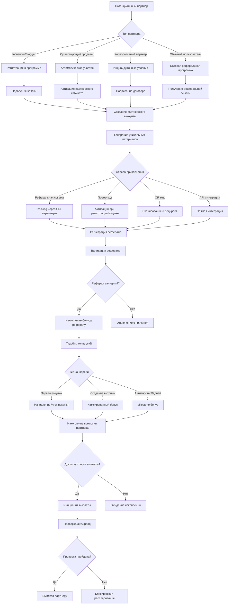

# Паспорт бизнес-процесса: Партнерская программа

## 📋 Метаданные
- **Название**: Партнерская программа (Реферальная система)
- **Роль**: Привлечение новых пользователей и продавцов через партнеров
- **Тип**: Бизнес-процесс
- **Статус**: Активный
- **Дата создания паспорта**: 2025-06-29

## 🎯 Назначение
Процесс обеспечивает систему вознаграждений для партнеров, которые привлекают новых пользователей и продавцов на платформу. Включает трекинг рефералов, расчет комиссий, выплаты партнерам и аналитику эффективности каналов привлечения.

## 🔄 Общая схема процесса



## 📐 Архитектурные компоненты

### Frontend компоненты
1. **PartnerDashboard** (`/frontend/svetu/src/components/partner/PartnerDashboard.tsx`)
   - Главная панель партнера с метриками
   - График доходов и конверсий
   - Список активных кампаний

2. **ReferralLinkGenerator** (`/frontend/svetu/src/components/partner/ReferralLinkGenerator.tsx`)
   - Генератор персонализированных ссылок
   - UTM метки для разных каналов
   - Короткие ссылки через bit.ly API

3. **PromoMaterials** (`/frontend/svetu/src/components/partner/PromoMaterials.tsx`)
   - Библиотека промо-материалов
   - Баннеры разных размеров
   - Email шаблоны

4. **PayoutHistory** (`/frontend/svetu/src/components/partner/PayoutHistory.tsx`)
   - История выплат с фильтрами
   - Детализация по конверсиям
   - Экспорт отчетов

5. **ReferralWidget** (`/frontend/svetu/src/components/partner/ReferralWidget.tsx`)
   - Встраиваемый виджет для сайтов
   - Настройка внешнего вида
   - Real-time статистика

### Backend компоненты
1. **Partner Service** (`/backend/internal/proj/partners/service/`)
   - Управление партнерскими аккаунтами
   - Расчет комиссий
   - Генерация отчетов

2. **Tracking Service** (`/backend/internal/proj/partners/tracking/`)
   - Cookie-based tracking
   - Fingerprinting для cross-device
   - Attribution window логика

3. **Commission Calculator** (`/backend/internal/proj/partners/commission/`)
   - Многоуровневая система комиссий
   - Бонусы за объемы
   - Специальные акции

4. **Payout Manager** (`/backend/internal/proj/partners/payout/`)
   - Автоматические выплаты
   - Интеграция с платежными системами
   - Tax reporting

### База данных
```sql
-- Партнеры
CREATE TABLE partners (
    id SERIAL PRIMARY KEY,
    user_id INT REFERENCES users(id),
    type VARCHAR(50), -- influencer, seller, corporate, basic
    status VARCHAR(50), -- pending, active, suspended, blocked
    tier VARCHAR(20), -- bronze, silver, gold, platinum
    commission_rate DECIMAL(5,2), -- базовый % комиссии
    custom_terms JSONB, -- индивидуальные условия
    payout_threshold DECIMAL(10,2) DEFAULT 5000.00, -- мин. сумма для выплаты
    payment_method VARCHAR(50), -- bank, paypal, crypto
    payment_details JSONB, -- зашифрованные данные
    created_at TIMESTAMP DEFAULT NOW(),
    activated_at TIMESTAMP,
    kyc_verified BOOLEAN DEFAULT false,
    tax_info JSONB
);

-- Реферальные связи
CREATE TABLE referrals (
    id SERIAL PRIMARY KEY,
    partner_id INT REFERENCES partners(id),
    referred_user_id INT REFERENCES users(id),
    source VARCHAR(100), -- utm_source
    medium VARCHAR(100), -- utm_medium
    campaign VARCHAR(100), -- utm_campaign
    landing_page TEXT,
    ip_address INET,
    user_agent TEXT,
    created_at TIMESTAMP DEFAULT NOW(),
    status VARCHAR(50), -- pending, confirmed, rejected
    rejection_reason VARCHAR(200),
    UNIQUE(referred_user_id) -- один реферал только у одного партнера
);

-- Конверсии и комиссии
CREATE TABLE partner_conversions (
    id SERIAL PRIMARY KEY,
    partner_id INT REFERENCES partners(id),
    referral_id INT REFERENCES referrals(id),
    type VARCHAR(50), -- purchase, signup_bonus, milestone, recurring
    order_id INT REFERENCES marketplace_orders(id),
    amount DECIMAL(10,2), -- сумма транзакции
    commission_amount DECIMAL(10,2), -- начисленная комиссия
    commission_rate DECIMAL(5,2), -- применённый %
    status VARCHAR(50), -- pending, approved, paid, cancelled
    created_at TIMESTAMP DEFAULT NOW(),
    approved_at TIMESTAMP,
    paid_at TIMESTAMP,
    payout_id INT REFERENCES partner_payouts(id)
);

-- Выплаты партнерам
CREATE TABLE partner_payouts (
    id SERIAL PRIMARY KEY,
    partner_id INT REFERENCES partners(id),
    amount DECIMAL(10,2),
    currency VARCHAR(3) DEFAULT 'RSD',
    payment_method VARCHAR(50),
    transaction_id VARCHAR(100),
    status VARCHAR(50), -- pending, processing, completed, failed
    created_at TIMESTAMP DEFAULT NOW(),
    processed_at TIMESTAMP,
    notes TEXT,
    fee_amount DECIMAL(10,2), -- комиссия платежной системы
    net_amount DECIMAL(10,2) -- amount - fee_amount
);

-- Промо-материалы
CREATE TABLE partner_promo_materials (
    id SERIAL PRIMARY KEY,
    title VARCHAR(200),
    type VARCHAR(50), -- banner, email_template, social_post, video
    format VARCHAR(50), -- jpg, html, mp4
    dimensions VARCHAR(50), -- 300x250, 728x90, etc
    file_url TEXT,
    preview_url TEXT,
    click_url_template TEXT, -- шаблон с плейсхолдерами
    languages TEXT[], -- ['sr', 'en']
    categories INT[], -- для каких категорий товаров
    is_active BOOLEAN DEFAULT true,
    created_at TIMESTAMP DEFAULT NOW()
);

-- Статистика кликов
CREATE TABLE partner_clicks (
    id SERIAL PRIMARY KEY,
    partner_id INT REFERENCES partners(id),
    click_id VARCHAR(100) UNIQUE, -- уникальный ID клика
    url TEXT,
    referer TEXT,
    ip_address INET,
    user_agent TEXT,
    created_at TIMESTAMP DEFAULT NOW(),
    converted BOOLEAN DEFAULT false,
    conversion_time TIMESTAMP
);
```

## 🔧 Детальный flow процесса

### 1. Регистрация партнера
```typescript
// PartnerRegistration.tsx
const registerAsPartner = async (data: PartnerRegistrationData) => {
  try {
    // Валидация минимальных требований
    const eligibility = await checkEligibility(user.id);
    if (!eligibility.isEligible) {
      throw new Error(eligibility.reason);
    }
    
    // Создание заявки
    const application = await api.post('/api/v1/partners/apply', {
      type: data.partnerType,
      channels: data.promotionChannels,
      expected_volume: data.expectedMonthlyReferrals,
      website: data.website,
      social_media: data.socialMedia,
      description: data.description,
      tax_id: data.taxId,
    });
    
    // Загрузка документов для KYC
    if (data.partnerType === 'corporate' || data.partnerType === 'influencer') {
      await uploadKYCDocuments(application.data.id, data.documents);
    }
    
    // Отправка на модерацию
    await api.post(`/api/v1/partners/applications/${application.data.id}/submit`);
    
    // Уведомление о статусе
    toast.success('Application submitted! We\'ll review it within 48 hours.');
    
    // Трекинг
    analytics.track('partner_application_submitted', {
      partner_type: data.partnerType,
      expected_volume: data.expectedMonthlyReferrals,
    });
    
  } catch (error) {
    handleError(error);
  }
};
```

### 2. Генерация реферальных материалов
```go
// referral_generator.go
func (g *ReferralGenerator) GeneratePartnerMaterials(partnerID int) (*PartnerMaterials, error) {
    partner, err := g.partnerService.GetPartner(partnerID)
    if err != nil {
        return nil, err
    }
    
    materials := &PartnerMaterials{
        PartnerID: partnerID,
        CreatedAt: time.Now(),
    }
    
    // Базовая реферальная ссылка
    baseURL := g.config.BaseURL + "/r/" + g.generateShortCode(partnerID)
    materials.BaseReferralURL = baseURL
    
    // UTM ссылки для разных каналов
    materials.UTMLinks = map[string]string{
        "instagram": g.addUTMParams(baseURL, "instagram", "social", partner.Username),
        "youtube": g.addUTMParams(baseURL, "youtube", "video", partner.Username),
        "blog": g.addUTMParams(baseURL, "blog", "content", partner.Username),
        "email": g.addUTMParams(baseURL, "email", "newsletter", partner.Username),
    }
    
    // Промо-коды
    materials.PromoCodes = g.generatePromoCodes(partner)
    
    // QR коды
    for channel, url := range materials.UTMLinks {
        qrCode, err := g.generateQRCode(url)
        if err == nil {
            materials.QRCodes[channel] = qrCode
        }
    }
    
    // Персонализированные баннеры
    materials.Banners = g.generateBanners(partner)
    
    // API credentials для интеграций
    if partner.Type == "corporate" {
        materials.APICredentials = g.generateAPICredentials(partner)
    }
    
    // Сохранение в БД
    return materials, g.saveMaterials(materials)
}

// Генерация уникального короткого кода
func (g *ReferralGenerator) generateShortCode(partnerID int) string {
    // Использование hashids для красивых коротких кодов
    hd := hashids.NewData()
    hd.Salt = g.config.HashSalt
    hd.MinLength = 6
    h, _ := hashids.NewWithData(hd)
    
    code, _ := h.Encode([]int{partnerID, int(time.Now().Unix())})
    
    // Проверка уникальности
    for g.isCodeExists(code) {
        code, _ = h.Encode([]int{partnerID, rand.Int()})
    }
    
    return code
}
```

### 3. Tracking рефералов
```go
// tracking_service.go
func (t *TrackingService) TrackReferralClick(r *http.Request) (*ClickTracking, error) {
    // Извлечение данных из URL
    refCode := chi.URLParam(r, "refCode")
    partner, err := t.getPartnerByCode(refCode)
    if err != nil {
        return nil, err
    }
    
    // Генерация уникального click ID
    clickID := uuid.New().String()
    
    // Сбор данных о клике
    tracking := &ClickTracking{
        ClickID:   clickID,
        PartnerID: partner.ID,
        URL:       r.URL.String(),
        Referer:   r.Header.Get("Referer"),
        IPAddress: t.getRealIP(r),
        UserAgent: r.Header.Get("User-Agent"),
        UTMParams: t.extractUTMParams(r),
        Timestamp: time.Now(),
    }
    
    // Device fingerprinting
    tracking.DeviceFingerprint = t.generateFingerprint(r)
    
    // GeoIP информация
    if geoData := t.getGeoIP(tracking.IPAddress); geoData != nil {
        tracking.Country = geoData.Country
        tracking.City = geoData.City
    }
    
    // Сохранение в БД
    if err := t.saveClickTracking(tracking); err != nil {
        return nil, err
    }
    
    // Установка cookie для долгосрочного tracking
    t.setTrackingCookie(w, clickID, partner.ID)
    
    // Real-time уведомление партнера
    t.notifyPartner(partner.ID, "new_click", tracking)
    
    return tracking, nil
}

// Attribution при регистрации
func (t *TrackingService) AttributeRegistration(userID int, r *http.Request) error {
    // Проверка cookie
    var partnerID int
    var clickID string
    
    if cookie, err := r.Cookie("ref_tracking"); err == nil {
        data := t.decryptCookie(cookie.Value)
        partnerID = data.PartnerID
        clickID = data.ClickID
    }
    
    // Fallback на fingerprinting
    if partnerID == 0 {
        fingerprint := t.generateFingerprint(r)
        if click := t.findRecentClickByFingerprint(fingerprint); click != nil {
            partnerID = click.PartnerID
            clickID = click.ClickID
        }
    }
    
    // Проверка attribution window (30 дней)
    if click, err := t.getClick(clickID); err == nil {
        if time.Since(click.Timestamp) > 30*24*time.Hour {
            return errors.New("attribution window expired")
        }
    }
    
    if partnerID > 0 {
        // Создание реферальной связи
        referral := &Referral{
            PartnerID:      partnerID,
            ReferredUserID: userID,
            ClickID:        clickID,
            Status:         "pending",
            CreatedAt:      time.Now(),
        }
        
        // Антифрод проверки
        if err := t.validateReferral(referral); err != nil {
            referral.Status = "rejected"
            referral.RejectionReason = err.Error()
        } else {
            referral.Status = "confirmed"
            
            // Начисление welcome бонуса рефералу
            t.grantWelcomeBonus(userID)
        }
        
        return t.saveReferral(referral)
    }
    
    return nil
}
```

### 4. Расчет комиссий
```go
// commission_calculator.go
type CommissionTier struct {
    MinVolume      int
    MaxVolume      int
    CommissionRate float64
    BonusRate      float64
}

var commissionTiers = []CommissionTier{
    {0, 10, 0.05, 0},           // 5% for first 10 conversions
    {11, 50, 0.07, 0.01},       // 7% + 1% bonus
    {51, 100, 0.10, 0.02},      // 10% + 2% bonus
    {101, 99999, 0.12, 0.03},   // 12% + 3% bonus
}

func (c *CommissionCalculator) CalculateCommission(conversion *Conversion) (*Commission, error) {
    partner, err := c.getPartner(conversion.PartnerID)
    if err != nil {
        return nil, err
    }
    
    // Базовая ставка комиссии
    baseRate := c.getBaseRate(partner, conversion)
    
    // Применение tier бонусов
    monthlyVolume := c.getMonthlyConversions(partner.ID)
    tier := c.getTierForVolume(monthlyVolume)
    
    effectiveRate := baseRate + tier.BonusRate
    
    // Специальные условия
    if partner.CustomTerms != nil {
        if customRate, ok := partner.CustomTerms["commission_rate"]; ok {
            effectiveRate = customRate.(float64)
        }
    }
    
    // Категориальные множители
    if categoryMultiplier := c.getCategoryMultiplier(conversion.CategoryID); categoryMultiplier > 0 {
        effectiveRate *= categoryMultiplier
    }
    
    // Акционные периоды
    if promo := c.getActivePromotion(); promo != nil {
        effectiveRate *= promo.Multiplier
    }
    
    // Расчет суммы
    commissionAmount := conversion.OrderAmount * effectiveRate
    
    // Применение caps
    if maxCommission := c.getMaxCommission(partner.Type); maxCommission > 0 {
        commissionAmount = math.Min(commissionAmount, maxCommission)
    }
    
    commission := &Commission{
        PartnerID:        partner.ID,
        ConversionID:     conversion.ID,
        OrderAmount:      conversion.OrderAmount,
        CommissionRate:   effectiveRate,
        CommissionAmount: commissionAmount,
        Status:          "pending",
        CreatedAt:       time.Now(),
    }
    
    // Recurring комиссии для подписок
    if conversion.Type == "subscription" {
        commission.IsRecurring = true
        commission.RecurringMonths = 12 // 12 месяцев recurring
        commission.RecurringRate = effectiveRate * 0.5 // 50% от первоначальной
    }
    
    return commission, nil
}

// Lifecycle value based комиссии
func (c *CommissionCalculator) CalculateLTVBonus(partnerID int) (*Commission, error) {
    referrals := c.getPartnerReferrals(partnerID)
    
    totalLTV := 0.0
    qualifiedUsers := 0
    
    for _, ref := range referrals {
        userLTV := c.calculateUserLTV(ref.ReferredUserID)
        if userLTV > c.config.MinLTVThreshold {
            totalLTV += userLTV
            qualifiedUsers++
        }
    }
    
    if qualifiedUsers >= c.config.MinQualifiedUsers {
        bonusAmount := totalLTV * c.config.LTVBonusRate
        
        return &Commission{
            PartnerID:        partnerID,
            Type:            "ltv_bonus",
            CommissionAmount: bonusAmount,
            Status:          "approved",
            Note:            fmt.Sprintf("LTV bonus for %d qualified users", qualifiedUsers),
        }, nil
    }
    
    return nil, nil
}
```

### 5. Выплаты партнерам
```go
// payout_manager.go
func (p *PayoutManager) ProcessPayouts() error {
    // Получение партнеров с достаточным балансом
    eligiblePartners, err := p.getEligiblePartners()
    if err != nil {
        return err
    }
    
    for _, partner := range eligiblePartners {
        if err := p.processSinglePayout(partner); err != nil {
            p.logger.Error("Failed to process payout", "partner_id", partner.ID, "error", err)
            continue
        }
    }
    
    return nil
}

func (p *PayoutManager) processSinglePayout(partner *Partner) error {
    // Расчет суммы к выплате
    pendingCommissions, err := p.getPendingCommissions(partner.ID)
    if err != nil {
        return err
    }
    
    totalAmount := 0.0
    commissionIDs := []int{}
    
    for _, comm := range pendingCommissions {
        // Антифрод проверка
        if err := p.antifraud.ValidateCommission(comm); err != nil {
            comm.Status = "rejected"
            comm.RejectionReason = err.Error()
            p.db.Save(comm)
            continue
        }
        
        totalAmount += comm.CommissionAmount
        commissionIDs = append(commissionIDs, comm.ID)
    }
    
    // Проверка минимального порога
    if totalAmount < partner.PayoutThreshold {
        return nil
    }
    
    // Создание записи о выплате
    payout := &Payout{
        PartnerID:     partner.ID,
        Amount:        totalAmount,
        Currency:      "RSD",
        PaymentMethod: partner.PaymentMethod,
        Status:        "pending",
        CreatedAt:     time.Now(),
    }
    
    tx := p.db.Begin()
    
    // Обработка в зависимости от метода
    switch partner.PaymentMethod {
    case "bank":
        payout.TransactionID, err = p.processBankTransfer(partner, totalAmount)
    case "paypal":
        payout.TransactionID, err = p.processPayPal(partner, totalAmount)
    case "crypto":
        payout.TransactionID, err = p.processCrypto(partner, totalAmount)
    }
    
    if err != nil {
        tx.Rollback()
        return err
    }
    
    // Обновление статусов комиссий
    tx.Model(&Commission{}).
        Where("id IN ?", commissionIDs).
        Updates(map[string]interface{}{
            "status": "paid",
            "paid_at": time.Now(),
            "payout_id": payout.ID,
        })
    
    payout.Status = "completed"
    payout.ProcessedAt = timePtr(time.Now())
    
    if err := tx.Save(payout).Error; err != nil {
        tx.Rollback()
        return err
    }
    
    tx.Commit()
    
    // Уведомления
    p.notifyPartnerPayout(partner, payout)
    
    // Налоговая отчетность
    if totalAmount > p.config.TaxReportingThreshold {
        p.taxReporter.ReportPayout(partner, payout)
    }
    
    return nil
}
```

### 6. Антифрод система
```go
// antifraud_service.go
func (a *AntifraudService) ValidateReferral(referral *Referral) error {
    // Проверка на самореферал
    if a.isSelfReferral(referral) {
        return errors.New("self-referral detected")
    }
    
    // Проверка на ботов
    if score := a.botDetector.CheckUser(referral.ReferredUserID); score > 0.8 {
        return errors.New("bot activity detected")
    }
    
    // Проверка velocity
    recentReferrals := a.getRecentReferrals(referral.PartnerID, 24*time.Hour)
    if len(recentReferrals) > a.config.MaxDailyReferrals {
        return errors.New("velocity limit exceeded")
    }
    
    // Проверка качества трафика
    if quality := a.assessTrafficQuality(referral); quality < 0.3 {
        return errors.New("low quality traffic")
    }
    
    // ML-based проверка
    features := a.extractFraudFeatures(referral)
    if fraudScore := a.mlModel.PredictFraud(features); fraudScore > 0.7 {
        return fmt.Errorf("high fraud risk: %.2f", fraudScore)
    }
    
    return nil
}

// Проверка качества трафика
func (a *AntifraudService) assessTrafficQuality(referral *Referral) float64 {
    score := 1.0
    
    // Проверка User-Agent
    ua := useragent.Parse(referral.UserAgent)
    if ua.Bot {
        score *= 0.1
    }
    
    // Проверка IP
    if a.isDatacenterIP(referral.IPAddress) {
        score *= 0.5
    }
    
    if a.isVPNIP(referral.IPAddress) {
        score *= 0.7
    }
    
    // Поведенческий анализ
    user, _ := a.getUser(referral.ReferredUserID)
    
    // Время на сайте
    if user.TotalTimeOnSite < 60 { // менее минуты
        score *= 0.3
    }
    
    // Количество просмотренных страниц
    if user.PagesViewed < 3 {
        score *= 0.5
    }
    
    // Email качество
    if !a.isValidEmail(user.Email) {
        score *= 0.4
    }
    
    return score
}
```

### 7. Аналитика и отчетность
```typescript
// PartnerAnalytics.tsx
const PartnerAnalytics: React.FC = () => {
  const [timeRange, setTimeRange] = useState('last_30_days');
  const [metrics, setMetrics] = useState<PartnerMetrics | null>(null);
  
  useEffect(() => {
    loadMetrics();
  }, [timeRange]);
  
  const loadMetrics = async () => {
    const data = await api.get(`/api/v1/partners/analytics`, {
      params: { time_range: timeRange }
    });
    
    setMetrics(data.data);
  };
  
  return (
    <div className="partner-analytics">
      {/* Summary Cards */}
      <div className="grid grid-cols-4 gap-4">
        <MetricCard
          title="Total Earnings"
          value={formatCurrency(metrics?.totalEarnings || 0)}
          change={metrics?.earningsChange}
          icon={<DollarIcon />}
        />
        <MetricCard
          title="Active Referrals"
          value={metrics?.activeReferrals || 0}
          change={metrics?.referralsChange}
          icon={<UsersIcon />}
        />
        <MetricCard
          title="Conversion Rate"
          value={`${metrics?.conversionRate || 0}%`}
          change={metrics?.conversionChange}
          icon={<ChartIcon />}
        />
        <MetricCard
          title="Avg. Order Value"
          value={formatCurrency(metrics?.avgOrderValue || 0)}
          change={metrics?.aovChange}
          icon={<CartIcon />}
        />
      </div>
      
      {/* Earnings Chart */}
      <div className="mt-8">
        <h3 className="text-lg font-semibold mb-4">Earnings Over Time</h3>
        <ResponsiveContainer width="100%" height={300}>
          <LineChart data={metrics?.earningsTimeline}>
            <CartesianGrid strokeDasharray="3 3" />
            <XAxis dataKey="date" />
            <YAxis />
            <Tooltip />
            <Legend />
            <Line 
              type="monotone" 
              dataKey="earnings" 
              stroke="#8884d8" 
              name="Earnings"
            />
            <Line 
              type="monotone" 
              dataKey="conversions" 
              stroke="#82ca9d" 
              name="Conversions"
            />
          </LineChart>
        </ResponsiveContainer>
      </div>
      
      {/* Top Performing Content */}
      <div className="mt-8">
        <h3 className="text-lg font-semibold mb-4">Top Performing Links</h3>
        <table className="w-full">
          <thead>
            <tr>
              <th>Channel</th>
              <th>Clicks</th>
              <th>Conversions</th>
              <th>Revenue</th>
              <th>CR%</th>
            </tr>
          </thead>
          <tbody>
            {metrics?.topLinks.map((link) => (
              <tr key={link.id}>
                <td>{link.channel}</td>
                <td>{link.clicks}</td>
                <td>{link.conversions}</td>
                <td>{formatCurrency(link.revenue)}</td>
                <td>{link.conversionRate}%</td>
              </tr>
            ))}
          </tbody>
        </table>
      </div>
      
      {/* Referral Funnel */}
      <div className="mt-8">
        <h3 className="text-lg font-semibold mb-4">Referral Funnel</h3>
        <FunnelChart
          data={[
            { name: 'Clicks', value: metrics?.funnel.clicks || 0 },
            { name: 'Signups', value: metrics?.funnel.signups || 0 },
            { name: 'First Purchase', value: metrics?.funnel.firstPurchase || 0 },
            { name: 'Repeat Purchase', value: metrics?.funnel.repeatPurchase || 0 },
          ]}
        />
      </div>
    </div>
  );
};
```

## 🔒 Безопасность и compliance

### Защита от злоупотреблений
1. **Cookie stuffing prevention** - проверка источника трафика
2. **Click fraud detection** - ML модель для выявления накруток
3. **Duplicate account prevention** - проверка по device fingerprint
4. **Rate limiting** - ограничение количества рефералов

### Налоговое соответствие
```go
// Tax reporting для партнеров
func (t *TaxReporter) GenerateAnnualReport(partnerID int, year int) (*TaxReport, error) {
    payouts, err := t.getYearlyPayouts(partnerID, year)
    if err != nil {
        return nil, err
    }
    
    report := &TaxReport{
        PartnerID: partnerID,
        Year:      year,
        Currency:  "RSD",
    }
    
    // Расчет общей суммы
    for _, payout := range payouts {
        report.TotalIncome += payout.NetAmount
        report.PlatformFees += payout.FeeAmount
    }
    
    // Налоговые вычеты (для Сербии)
    if report.TotalIncome > 0 {
        // Необлагаемый минимум
        report.TaxFreeAmount = t.config.TaxFreeThreshold
        
        // Расчет налогооблагаемой базы
        report.TaxableIncome = math.Max(0, report.TotalIncome - report.TaxFreeAmount)
        
        // Прогрессивная шкала
        report.EstimatedTax = t.calculateProgressiveTax(report.TaxableIncome)
        
        // Социальные взносы
        report.SocialContributions = report.TaxableIncome * 0.255 // 25.5% в Сербии
    }
    
    // Генерация PDF отчета
    report.PDFUrl = t.generatePDFReport(report)
    
    // Отправка в налоговую (если требуется)
    if report.TotalIncome > t.config.ReportingThreshold {
        t.submitToTaxAuthority(report)
    }
    
    return report, nil
}
```

## 📊 Аналитика и метрики

### KPI партнерской программы
```sql
-- Эффективность партнеров
WITH partner_performance AS (
    SELECT 
        p.id,
        p.username,
        p.type,
        p.tier,
        COUNT(DISTINCT r.id) as total_referrals,
        COUNT(DISTINCT CASE WHEN r.status = 'confirmed' THEN r.id END) as confirmed_referrals,
        COUNT(DISTINCT c.id) as total_conversions,
        SUM(c.commission_amount) as total_commission,
        AVG(c.commission_amount) as avg_commission,
        COUNT(DISTINCT DATE(r.created_at)) as active_days,
        MAX(r.created_at) as last_referral_date
    FROM partners p
    LEFT JOIN referrals r ON p.id = r.partner_id
    LEFT JOIN partner_conversions c ON r.id = c.referral_id
    WHERE p.status = 'active'
    AND r.created_at >= CURRENT_DATE - INTERVAL '30 days'
    GROUP BY p.id, p.username, p.type, p.tier
)
SELECT 
    *,
    confirmed_referrals::float / NULLIF(total_referrals, 0) * 100 as confirmation_rate,
    total_conversions::float / NULLIF(confirmed_referrals, 0) * 100 as conversion_rate,
    total_commission / NULLIF(active_days, 0) as daily_earnings,
    CASE 
        WHEN last_referral_date < CURRENT_DATE - INTERVAL '7 days' THEN 'inactive'
        WHEN total_conversions > 50 THEN 'top_performer'
        WHEN conversion_rate > 20 THEN 'high_quality'
        ELSE 'active'
    END as partner_status
FROM partner_performance
ORDER BY total_commission DESC;
```

### ROI анализ
```sql
-- ROI партнерской программы
WITH program_costs AS (
    SELECT 
        DATE_TRUNC('month', created_at) as month,
        SUM(net_amount) as total_payouts,
        COUNT(DISTINCT partner_id) as active_partners,
        COUNT(*) as payout_count
    FROM partner_payouts
    WHERE status = 'completed'
    GROUP BY DATE_TRUNC('month', created_at)
),
program_revenue AS (
    SELECT 
        DATE_TRUNC('month', o.created_at) as month,
        SUM(o.total_amount) as referred_revenue,
        COUNT(DISTINCT o.id) as referred_orders,
        COUNT(DISTINCT o.buyer_id) as referred_customers,
        AVG(lifetime.total_spent) as avg_customer_ltv
    FROM marketplace_orders o
    JOIN referrals r ON o.buyer_id = r.referred_user_id
    LEFT JOIN LATERAL (
        SELECT SUM(total_amount) as total_spent
        FROM marketplace_orders
        WHERE buyer_id = o.buyer_id
    ) lifetime ON true
    WHERE r.status = 'confirmed'
    GROUP BY DATE_TRUNC('month', o.created_at)
)
SELECT 
    c.month,
    c.total_payouts,
    c.active_partners,
    r.referred_revenue,
    r.referred_orders,
    r.referred_customers,
    r.avg_customer_ltv,
    r.referred_revenue / NULLIF(c.total_payouts, 0) as roi,
    c.total_payouts / NULLIF(r.referred_orders, 0) as cost_per_acquisition,
    r.referred_revenue / NULLIF(r.referred_customers, 0) as revenue_per_customer
FROM program_costs c
JOIN program_revenue r ON c.month = r.month
ORDER BY c.month DESC;
```

## ⚡ Производительность и оптимизация

### Кеширование данных партнера
```go
// Redis кеширование для быстрого доступа
func (s *PartnerService) GetPartnerDashboard(partnerID int) (*DashboardData, error) {
    cacheKey := fmt.Sprintf("partner:dashboard:%d", partnerID)
    
    // Попытка получить из кеша
    var dashboard DashboardData
    if err := s.redis.Get(ctx, cacheKey).Scan(&dashboard); err == nil {
        return &dashboard, nil
    }
    
    // Загрузка и расчет данных
    dashboard = DashboardData{
        PartnerID: partnerID,
        UpdatedAt: time.Now(),
    }
    
    // Параллельная загрузка метрик
    var wg sync.WaitGroup
    errChan := make(chan error, 4)
    
    wg.Add(4)
    
    go func() {
        defer wg.Done()
        stats, err := s.getPartnerStats(partnerID)
        if err != nil {
            errChan <- err
            return
        }
        dashboard.Stats = stats
    }()
    
    go func() {
        defer wg.Done()
        earnings, err := s.getEarningsData(partnerID)
        if err != nil {
            errChan <- err
            return
        }
        dashboard.Earnings = earnings
    }()
    
    go func() {
        defer wg.Done()
        referrals, err := s.getRecentReferrals(partnerID, 10)
        if err != nil {
            errChan <- err
            return
        }
        dashboard.RecentReferrals = referrals
    }()
    
    go func() {
        defer wg.Done()
        performance, err := s.getPerformanceMetrics(partnerID)
        if err != nil {
            errChan <- err
            return
        }
        dashboard.Performance = performance
    }()
    
    wg.Wait()
    close(errChan)
    
    // Проверка ошибок
    for err := range errChan {
        if err != nil {
            return nil, err
        }
    }
    
    // Сохранение в кеш на 5 минут
    s.redis.Set(ctx, cacheKey, dashboard, 5*time.Minute)
    
    return &dashboard, nil
}
```

### Оптимизация выплат
```go
// Batch processing для выплат
func (p *PayoutProcessor) ProcessBatchPayouts() error {
    // Группировка по методу оплаты
    payoutsByMethod := map[string][]*Payout{}
    
    eligiblePayouts, err := p.getEligiblePayouts()
    if err != nil {
        return err
    }
    
    for _, payout := range eligiblePayouts {
        method := payout.PaymentMethod
        payoutsByMethod[method] = append(payoutsByMethod[method], payout)
    }
    
    // Batch обработка для каждого метода
    for method, payouts := range payoutsByMethod {
        switch method {
        case "bank":
            // SEPA batch transfer для EU
            p.processSEPABatch(payouts)
        case "paypal":
            // PayPal Mass Payment API
            p.processPayPalBatch(payouts)
        case "crypto":
            // Multi-send транзакция
            p.processCryptoBatch(payouts)
        }
    }
    
    return nil
}
```

## 🧪 Тестирование

### Unit тесты
```go
func TestCommissionCalculation(t *testing.T) {
    calc := NewCommissionCalculator()
    
    tests := []struct {
        name           string
        orderAmount    float64
        partnerTier    string
        expectedComm   float64
    }{
        {
            name:         "Bronze tier basic",
            orderAmount:  10000,
            partnerTier:  "bronze",
            expectedComm: 500, // 5%
        },
        {
            name:         "Gold tier with bonus",
            orderAmount:  50000,
            partnerTier:  "gold",
            expectedComm: 6000, // 12%
        },
    }
    
    for _, tt := range tests {
        t.Run(tt.name, func(t *testing.T) {
            partner := &Partner{Tier: tt.partnerTier}
            commission := calc.Calculate(partner, tt.orderAmount)
            assert.Equal(t, tt.expectedComm, commission)
        })
    }
}
```

### Integration тесты
```typescript
// cypress/e2e/partner-program.cy.ts
describe('Partner Program Flow', () => {
  it('should complete full partner journey', () => {
    // Регистрация как партнер
    cy.visit('/partners/join');
    cy.get('[data-testid="partner-type"]').select('influencer');
    cy.get('[data-testid="website"]').type('https://myblog.com');
    cy.get('[data-testid="expected-volume"]').type('100');
    cy.get('[data-testid="submit-application"]').click();
    
    // Проверка dashboard
    cy.visit('/partners/dashboard');
    cy.contains('Pending Approval').should('be.visible');
    
    // Админ одобряет заявку
    cy.task('approvePartnerApplication', { userId: 123 });
    
    // Получение материалов
    cy.reload();
    cy.contains('Get Referral Link').click();
    cy.get('[data-testid="referral-link"]').should('contain', '/r/');
    
    // Симуляция реферала
    cy.task('simulateReferralClick', { 
      partnerCode: 'ABC123',
      convertToPurchase: true 
    });
    
    // Проверка начисления комиссии
    cy.visit('/partners/earnings');
    cy.contains('Pending Commission').should('be.visible');
  });
});
```

## 🌍 Локализация

### Региональные особенности
```go
type RegionalPartnerConfig struct {
    Country               string
    DefaultCommissionRate float64
    PayoutMethods        []string
    MinPayoutAmount      float64
    TaxWithholding       float64
    ComplianceRequired   []string
}

var serbianConfig = RegionalPartnerConfig{
    Country:               "RS",
    DefaultCommissionRate: 0.07, // 7%
    PayoutMethods:        []string{"bank", "paypal"},
    MinPayoutAmount:      5000, // 5000 RSD
    TaxWithholding:       0.20, // 20% tax
    ComplianceRequired:   []string{"tax_id", "bank_account"},
}
```

## ⚠️ Известные ограничения

1. **Attribution window** - 30 дней для конверсии
2. **Один реферал на пользователя** - нельзя менять партнера
3. **Минимальная выплата** - 5000 RSD
4. **KYC для крупных партнеров** - при доходе > 100k RSD/месяц

## 🔄 Связанные процессы

1. **[Регистрация пользователей](user-registration.md)** - attribution рефералов
2. **[Процесс покупки](payment-purchase-process.md)** - отслеживание конверсий
3. **[Аналитика продаж](sales-analytics.md)** - ROI метрики
4. **[Модерация контента](content-moderation.md)** - проверка промо-материалов

## 📈 Будущие улучшения

1. **Multi-tier партнерская сеть** - партнеры привлекают партнеров
2. **Smart contracts** - автоматические выплаты через blockchain
3. **AI оптимизация ставок** - динамические комиссии
4. **Influencer marketplace** - биржа рекламы
5. **Cross-border выплаты** - интеграция с Wise, Payoneer