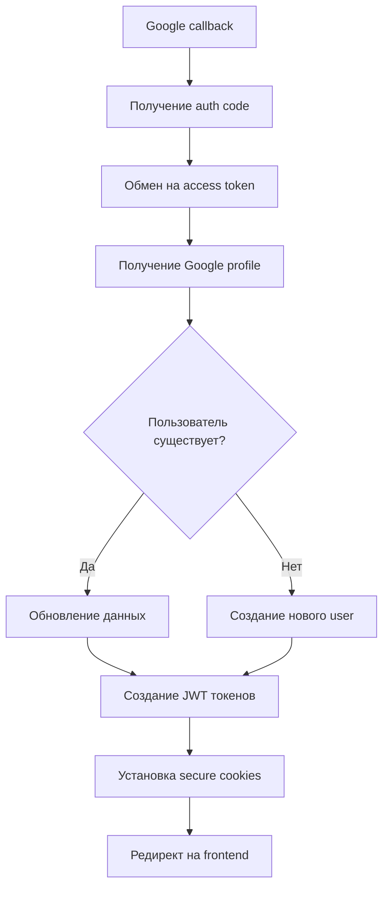
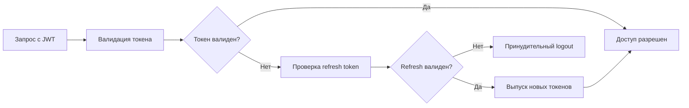

# Паспорт бизнес-процесса: Аутентификация и авторизация

## 🎯 Назначение процесса

Обеспечение безопасного доступа пользователей к платформе Sve Tu через Google OAuth 2.0 с автоматическим созданием профилей, управлением сессиями и контролем доступа к ресурсам.

## 🔄 Схема процесса

### 1. **Инициация входа**
```mermaid
graph LR
    A[Пользователь на сайте] --> B[Клик "Войти через Google"]
    B --> C[Редирект на Google OAuth]
    C --> D[Пользователь вводит данные Google]
    D --> E[Google разрешение]
    E --> F[Callback на backend]
```

### 2. **Обработка на backend**


### 3. **Поддержание сессии**


## 🏗️ Архитектурные компоненты

### **Frontend компоненты**
- **AuthButton** - кнопка входа/выхода в Header
- **AuthContext** - глобальное состояние авторизации
- **LoginModal** - модальное окно входа
- **AuthStateManager** - очистка данных при смене пользователя

### **Backend handlers**
- `/auth/google` - редирект на Google OAuth
- `/auth/google/callback` - обработка callback
- `/auth/session` - получение текущего пользователя
- `/auth/logout` - завершение сессии

### **База данных**
- `users` - профили пользователей
- `refresh_tokens` - refresh токены для обновления сессий

### **Middleware**
- JWT валидация для защищенных роутов
- CORS настройки для кросс-доменных запросов

## 📋 Детальный flow процесса

### **Этап 1: Инициация входа**
1. Пользователь видит кнопку "Войти через Google" в Header
2. Клик по кнопке вызывает `AuthButton.handleLogin()`
3. Выполняется редирект на `/api/v1/auth/google`
4. Backend формирует Google OAuth URL с параметрами:
   - `client_id` - Google App ID
   - `redirect_uri` - callback URL
   - `scope` - запрашиваемые разрешения (profile, email)
   - `state` - защита от CSRF

### **Этап 2: Google аутентификация**
1. Пользователь вводит данные в Google форме
2. Google показывает разрешения приложения
3. После согласия Google редиректит на callback с:
   - `code` - авторизационный код
   - `state` - для проверки CSRF

### **Этап 3: Backend обработка**
1. **Получение токенов**: обмен `code` на `access_token`
2. **Получение профиля**: запрос к Google API за данными пользователя
3. **Поиск/создание пользователя**:
   ```go
   user, err := userRepo.GetByGoogleID(googleProfile.ID)
   if err == pgx.ErrNoRows {
       user = createNewUser(googleProfile)
   }
   ```
4. **Генерация JWT токенов**:
   - Access token (15 минут) - для API запросов
   - Refresh token (30 дней) - для обновления сессии
5. **Установка secure cookies** с httpOnly флагом

### **Этап 4: Frontend инициализация**
1. Редирект на главную страницу
2. AuthContext проверяет наличие токенов
3. Выполняется запрос `/auth/session` для получения данных пользователя
4. Обновление UI с данными пользователя

## 🔐 Безопасность

### **Защитные механизмы**
- **CSRF защита**: state параметр в OAuth flow
- **XSS защита**: httpOnly cookies для токенов
- **JWT подписи**: HMAC SHA-256 с секретным ключом
- **Refresh rotation**: новый refresh при каждом обновлении
- **Secure cookies**: только по HTTPS

### **Проверки доступа**
```go
func AuthMiddleware(c *fiber.Ctx) error {
    token := extractJWT(c)
    if !validateJWT(token) {
        return c.Status(401).JSON(utils.ErrorResponse("auth.unauthorized"))
    }
    return c.Next()
}
```

## 📊 Типы пользователей и разрешения

### **Обычный пользователь**
- Создание объявлений
- Поиск и просмотр товаров
- Общение в чатах
- Управление профилем

### **Владелец витрины**
- Все права обычного пользователя
- Создание и управление витриной
- Импорт товаров
- Просмотр аналитики

### **Администратор**
- Модерация контента
- Управление пользователями
- Просмотр системной аналитики
- Доступ к admin панели

## 🌐 Интеграции

### **Google OAuth 2.0**
- **Endpoint**: `https://accounts.google.com/o/oauth2/auth`
- **Scopes**: `openid profile email`
- **Response type**: `code`
- **Grant type**: `authorization_code`

### **JWT токены**
```json
{
  "header": {
    "alg": "HS256",
    "typ": "JWT"
  },
  "payload": {
    "user_id": 123,
    "email": "user@example.com",
    "exp": 1640995200,
    "iat": 1640994300
  }
}
```

## 🎛️ Настройки и конфигурация

### **Environment переменные**
```env
GOOGLE_CLIENT_ID=your_google_app_id
GOOGLE_CLIENT_SECRET=your_google_secret
JWT_SECRET=your_jwt_secret_key
JWT_ACCESS_EXPIRY=15m
JWT_REFRESH_EXPIRY=720h
FRONTEND_URL=http://localhost:3001
```

### **Cookie настройки**
```go
cookie := &fiber.Cookie{
    Name:     "access_token",
    Value:    accessToken,
    HTTPOnly: true,
    Secure:   true,
    SameSite: "Lax",
    MaxAge:   900, // 15 minutes
}
```

## ❌ Обработка ошибок

### **Типичные ошибки**
1. **Google OAuth ошибки**
   - `access_denied` - пользователь отклонил доступ
   - `invalid_request` - неверные параметры OAuth

2. **JWT ошибки**
   - Token expired - требуется обновление
   - Invalid signature - компрометация токена

3. **Database ошибки**
   - Дублирование email при создании пользователя
   - Недоступность БД при авторизации

### **Error responses**
```json
{
  "success": false,
  "error": "auth.sessionExpired",
  "message": "Session has expired"
}
```

## 📈 Метрики и мониторинг

### **Ключевые метрики**
- **Conversion rate**: успешные входы / попытки входа
- **Session duration**: среднее время сессии
- **Token refresh rate**: частота обновления токенов
- **Failed auth attempts**: неудачные попытки входа

### **Логирование**
```go
log.Info("User authenticated", 
    "user_id", user.ID,
    "email", user.Email,
    "method", "google_oauth",
    "timestamp", time.Now(),
)
```

## 🔄 Жизненный цикл сессии

### **Создание сессии**
1. Успешная Google аутентификация
2. Генерация JWT pair (access + refresh)
3. Сохранение refresh в БД
4. Установка secure cookies

### **Поддержание сессии**
1. Каждый API запрос проверяет access token
2. При истечении - автоматическое обновление через refresh
3. Periodic cleanup истекших refresh токенов

### **Завершение сессии**
1. Пользователь нажимает "Выйти"
2. Удаление токенов из cookies
3. Invalidation refresh token в БД
4. Редирект на главную страницу

## 🧪 Тестирование

### **Unit тесты**
- JWT генерация и валидация
- Google OAuth token exchange
- User creation/update логика

### **Integration тесты**
- Полный OAuth flow
- Token refresh процесс
- Error handling scenarios

### **E2E тесты**
- Успешный login через Google
- Logout и переход на главную
- Автоматическое обновление токенов

## 🚀 Производительность

### **Оптимизации**
- **JWT кеширование**: валидированные токены кешируются
- **Batch token cleanup**: массовое удаление истекших токенов
- **Connection pooling**: переиспользование DB соединений

### **Limits**
- Max 5 одновременных сессий на пользователя
- Rate limiting на auth endpoints (10 req/min)
- Token размер ограничен 1KB

## 📚 Связанные процессы

1. **Регистрация пользователей** - создание профиля после первого входа
2. **Управление профилем** - обновление данных пользователя
3. **Настройки приватности** - контроль видимости данных
4. **Уведомления** - отправка welcome emails
5. **Аналитика** - трекинг пользовательской активности

## 📖 Документация

### **API Reference**
- `/auth/*` endpoints в Swagger UI
- Google OAuth 2.0 documentation
- JWT.io для отладки токенов

### **Frontend компоненты**
- `AuthButton.md` - кнопка аутентификации
- `AuthContext.md` - глобальное состояние
- `LoginModal.md` - UI для входа

### **Backend handlers**
- `users-handler.md` - user management
- JWT middleware documentation