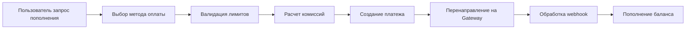
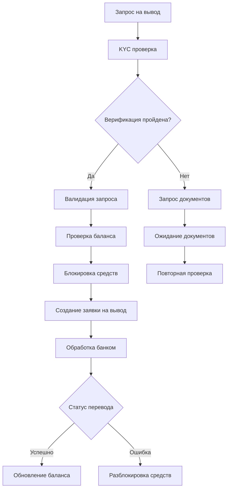
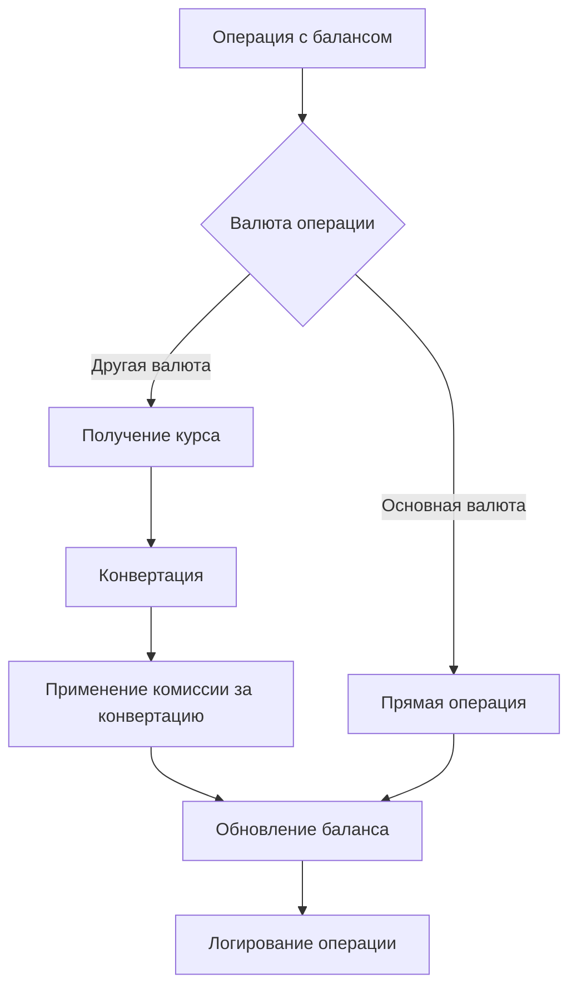
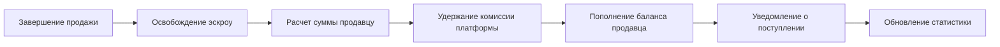

# Паспорт бизнес-процесса: Управление балансом и выводы

## 🎯 Назначение процесса

Обеспечение безопасного управления пользовательскими балансами на платформе Sve Tu с поддержкой пополнения счета, вывода средств, мульти-валютности и автоматической обработки комиссий с интеграцией KYC процедур.

## 🔄 Схема процесса

### 1. **Пополнение баланса**


### 2. **Вывод средств**


### 3. **Мульти-валютное управление**


### 4. **Автоматическое пополнение от продаж**


## 🏗️ Архитектурные компоненты

### **Frontend компоненты**
- **BalanceWidget** - виджет отображения текущего баланса
- **DepositForm** - форма пополнения баланса
- **WithdrawForm** - форма вывода средств
- **TransactionHistory** - история операций по балансу
- **CurrencyConverter** - конвертер валют
- **KYCVerificationForm** - форма верификации для выводов
- **PaymentMethodSelector** - выбор методов пополнения/вывода

### **Backend сервисы**
- **BalanceService** - основной сервис управления балансами
- **WithdrawalService** - сервис обработки выводов
- **DepositService** - сервис пополнений
- **CurrencyService** - сервис работы с валютами и курсами
- **KYCService** - сервис верификации пользователей
- **FeeCalculatorService** - расчет комиссий
- **BankIntegrationService** - интеграция с банковскими API

### **Базы данных**
- **user_balances** - основная таблица балансов пользователей
- **balance_transactions** - все операции по балансам
- **withdrawal_requests** - заявки на вывод средств
- **deposit_transactions** - транзакции пополнения
- **currency_rates** - курсы валют
- **kyc_verifications** - данные верификации KYC
- **payment_methods** - доступные методы платежей

## 🔗 Интеграции

### **BalanceService - основной сервис**
```go
type BalanceService struct {
    repository      BalanceRepositoryInterface
    currency        CurrencyServiceInterface
    kyc            KYCServiceInterface
    notification   NotificationServiceInterface
    payment        PaymentServiceInterface
    logger         logger.Logger
    config         *BalanceConfig
}

type BalanceConfig struct {
    DefaultCurrency          string          // "RSD"
    MinimumWithdrawal       decimal.Decimal // 10.00
    MaximumWithdrawal       decimal.Decimal // 10000.00
    WithdrawalFeePercentage decimal.Decimal // 2.5%
    WithdrawalFixedFee      decimal.Decimal // 1.00
    KYCRequiredForAmount    decimal.Decimal // 1000.00
    SupportedCurrencies     []string        // ["RSD", "EUR", "USD"]
    ExchangeFeePercentage   decimal.Decimal // 0.5%
}

// Получение баланса пользователя
func (s *BalanceService) GetUserBalance(ctx context.Context, userID int) (*UserBalance, error) {
    balance, err := s.repository.GetBalance(ctx, userID)
    if err != nil {
        // Создание баланса если не существует
        if errors.Is(err, ErrBalanceNotFound) {
            balance, err = s.createInitialBalance(ctx, userID)
            if err != nil {
                return nil, fmt.Errorf("failed to create initial balance: %w", err)
            }
        } else {
            return nil, fmt.Errorf("failed to get balance: %w", err)
        }
    }

    // Добавление информации о заблокированных средствах
    frozenAmount, err := s.repository.GetFrozenAmount(ctx, userID)
    if err != nil {
        s.logger.Warn("Failed to get frozen amount", "user_id", userID, "error", err)
        frozenAmount = decimal.Zero
    }

    // Получение курсов для других валют
    exchangeRates, err := s.currency.GetCurrentRates(ctx, s.config.SupportedCurrencies)
    if err != nil {
        s.logger.Warn("Failed to get exchange rates", "error", err)
        exchangeRates = make(map[string]decimal.Decimal)
    }

    return &UserBalance{
        UserID:          balance.UserID,
        PrimaryBalance:  balance.Amount,
        FrozenBalance:   frozenAmount,
        Currency:        balance.Currency,
        ExchangeRates:   exchangeRates,
        LastUpdated:     balance.UpdatedAt,
    }, nil
}

// Пополнение баланса
func (s *BalanceService) CreateDeposit(ctx context.Context, req DepositRequest) (*DepositResult, error) {
    // 1. Валидация запроса
    if err := s.validateDepositRequest(req); err != nil {
        return nil, fmt.Errorf("validation failed: %w", err)
    }

    // 2. Получение метода оплаты
    paymentMethod, err := s.repository.GetPaymentMethod(ctx, req.PaymentMethod)
    if err != nil {
        return nil, fmt.Errorf("invalid payment method: %w", err)
    }

    // 3. Проверка лимитов
    if req.Amount.LessThan(paymentMethod.MinimumAmount) {
        return nil, errors.New("deposit.amountTooLow")
    }
    if paymentMethod.MaximumAmount.GreaterThan(decimal.Zero) && req.Amount.GreaterThan(paymentMethod.MaximumAmount) {
        return nil, errors.New("deposit.amountTooHigh")
    }

    // 4. Расчет комиссий
    fee := s.calculateDepositFee(req.Amount, paymentMethod)
    totalAmount := req.Amount.Add(fee)

    // 5. Конвертация валюты если необходимо
    var convertedAmount decimal.Decimal
    if req.Currency != s.config.DefaultCurrency {
        rate, err := s.currency.GetExchangeRate(ctx, req.Currency, s.config.DefaultCurrency)
        if err != nil {
            return nil, fmt.Errorf("failed to get exchange rate: %w", err)
        }
        convertedAmount = req.Amount.Mul(rate)
    } else {
        convertedAmount = req.Amount
    }

    // 6. Создание транзакции депозита
    deposit := &models.DepositTransaction{
        UserID:          req.UserID,
        Amount:          req.Amount,
        ConvertedAmount: convertedAmount,
        Currency:        req.Currency,
        PaymentMethod:   req.PaymentMethod,
        Fee:             fee,
        TotalAmount:     totalAmount,
        Status:          "pending",
        Reference:       s.generateReference("DEP"),
        CreatedAt:       time.Now(),
    }

    err = s.repository.CreateDepositTransaction(ctx, deposit)
    if err != nil {
        return nil, fmt.Errorf("failed to create deposit transaction: %w", err)
    }

    // 7. Создание платежа через payment gateway
    paymentResult, err := s.payment.CreatePayment(ctx, PaymentRequest{
        Amount:      totalAmount,
        Currency:    req.Currency,
        Method:      req.PaymentMethod,
        Reference:   deposit.Reference,
        Description: fmt.Sprintf("Balance deposit for user %d", req.UserID),
        ReturnURL:   req.ReturnURL,
        UserID:      req.UserID,
    })
    if err != nil {
        s.repository.UpdateDepositStatus(ctx, deposit.ID, "failed")
        return nil, fmt.Errorf("failed to create payment: %w", err)
    }

    // 8. Обновление транзакции с данными платежа
    err = s.repository.UpdateDepositPaymentData(ctx, deposit.ID, paymentResult.TransactionID, paymentResult.GatewayUUID)
    if err != nil {
        s.logger.Error("Failed to update deposit payment data", "deposit_id", deposit.ID, "error", err)
    }

    return &DepositResult{
        DepositID:      deposit.ID,
        Reference:      deposit.Reference,
        Amount:         req.Amount,
        Fee:            fee,
        TotalAmount:    totalAmount,
        Currency:       req.Currency,
        PaymentID:      paymentResult.TransactionID,
        RedirectURL:    paymentResult.RedirectURL,
        Status:         "pending",
    }, nil
}
```

### **WithdrawalService - сервис выводов**
```go
// Создание заявки на вывод
func (s *WithdrawalService) CreateWithdrawalRequest(ctx context.Context, req WithdrawalRequest) (*WithdrawalResult, error) {
    // 1. KYC проверка для крупных сумм
    if req.Amount.GreaterThanOrEqual(s.config.KYCRequiredForAmount) {
        kycStatus, err := s.kyc.GetVerificationStatus(ctx, req.UserID)
        if err != nil {
            return nil, fmt.Errorf("failed to check KYC status: %w", err)
        }
        
        if kycStatus != "verified" {
            return nil, errors.New("withdrawal.kycRequired")
        }
    }

    // 2. Проверка баланса
    balance, err := s.balanceRepo.GetBalance(ctx, req.UserID)
    if err != nil {
        return nil, fmt.Errorf("failed to get balance: %w", err)
    }

    // 3. Расчет комиссии
    fee := s.calculateWithdrawalFee(req.Amount)
    totalRequired := req.Amount.Add(fee)

    if balance.Amount.LessThan(totalRequired) {
        return nil, errors.New("withdrawal.insufficientFunds")
    }

    // 4. Валидация банковских реквизитов
    if err := s.validateBankDetails(req.BankDetails); err != nil {
        return nil, fmt.Errorf("invalid bank details: %w", err)
    }

    // 5. Блокировка средств
    tx, err := s.repository.BeginTx(ctx, nil)
    if err != nil {
        return nil, fmt.Errorf("failed to begin transaction: %w", err)
    }
    defer tx.Rollback()

    err = s.repository.FreezeBalance(ctx, tx, req.UserID, totalRequired)
    if err != nil {
        return nil, fmt.Errorf("failed to freeze balance: %w", err)
    }

    // 6. Создание заявки на вывод
    withdrawal := &models.WithdrawalRequest{
        UserID:         req.UserID,
        Amount:         req.Amount,
        Currency:       req.Currency,
        Fee:            fee,
        TotalAmount:    totalRequired,
        BankDetails:    req.BankDetails,
        Status:         "pending",
        Reference:      s.generateReference("WDR"),
        RequestedAt:    time.Now(),
        ProcessAfter:   time.Now().Add(1 * time.Hour), // Задержка для безопасности
    }

    err = s.repository.CreateWithdrawalRequest(ctx, tx, withdrawal)
    if err != nil {
        return nil, fmt.Errorf("failed to create withdrawal request: %w", err)
    }

    if err := tx.Commit(); err != nil {
        return nil, fmt.Errorf("failed to commit transaction: %w", err)
    }

    // 7. Планирование обработки
    err = s.scheduler.ScheduleWithdrawalProcessing(ctx, withdrawal.ID, withdrawal.ProcessAfter)
    if err != nil {
        s.logger.Error("Failed to schedule withdrawal processing", "withdrawal_id", withdrawal.ID, "error", err)
    }

    // 8. Уведомления
    s.sendWithdrawalNotifications(ctx, withdrawal, "requested")

    return &WithdrawalResult{
        WithdrawalID: withdrawal.ID,
        Reference:    withdrawal.Reference,
        Amount:       req.Amount,
        Fee:          fee,
        TotalAmount:  totalRequired,
        Status:       "pending",
        EstimatedProcessingTime: "1-3 business days",
    }, nil
}

// Обработка вывода средств
func (s *WithdrawalService) ProcessWithdrawal(ctx context.Context, withdrawalID int64) error {
    // 1. Получение заявки
    withdrawal, err := s.repository.GetWithdrawalRequest(ctx, withdrawalID)
    if err != nil {
        return fmt.Errorf("failed to get withdrawal request: %w", err)
    }

    if withdrawal.Status != "pending" {
        return fmt.Errorf("withdrawal already processed with status: %s", withdrawal.Status)
    }

    // 2. Обновление статуса на обработку
    err = s.repository.UpdateWithdrawalStatus(ctx, withdrawalID, "processing")
    if err != nil {
        return fmt.Errorf("failed to update status to processing: %w", err)
    }

    // 3. Выполнение банковского перевода
    transferResult, err := s.bank.ExecuteTransfer(ctx, BankTransferRequest{
        Amount:         withdrawal.Amount,
        Currency:       withdrawal.Currency,
        RecipientIBAN:  withdrawal.BankDetails.IBAN,
        RecipientName:  withdrawal.BankDetails.AccountHolder,
        RecipientBank:  withdrawal.BankDetails.BankName,
        Reference:      withdrawal.Reference,
        Description:    fmt.Sprintf("Withdrawal from Sve Tu Platform - %s", withdrawal.Reference),
    })

    if err != nil {
        // Обработка ошибки банковского перевода
        s.repository.UpdateWithdrawalStatus(ctx, withdrawalID, "failed")
        s.repository.UnfreezeBalance(ctx, withdrawal.UserID, withdrawal.TotalAmount)
        
        s.logger.Error("Bank transfer failed", 
            "withdrawal_id", withdrawalID, 
            "user_id", withdrawal.UserID,
            "amount", withdrawal.Amount.String(),
            "error", err)
        
        s.sendWithdrawalNotifications(ctx, withdrawal, "failed")
        return fmt.Errorf("bank transfer failed: %w", err)
    }

    // 4. Успешное завершение
    tx, err := s.repository.BeginTx(ctx, nil)
    if err != nil {
        return fmt.Errorf("failed to begin completion transaction: %w", err)
    }
    defer tx.Rollback()

    // Списание средств с баланса
    err = s.repository.DeductBalance(ctx, tx, withdrawal.UserID, withdrawal.TotalAmount)
    if err != nil {
        return fmt.Errorf("failed to deduct balance: %w", err)
    }

    // Обновление статуса
    err = s.repository.UpdateWithdrawalStatusWithDetails(ctx, tx, withdrawalID, "completed", map[string]interface{}{
        "bank_reference":   transferResult.Reference,
        "bank_transaction": transferResult.TransactionID,
        "processed_at":     time.Now().UTC(),
    })
    if err != nil {
        return fmt.Errorf("failed to update withdrawal status: %w", err)
    }

    // Создание финальной транзакции баланса
    err = s.repository.CreateBalanceTransaction(ctx, tx, &models.BalanceTransaction{
        UserID:        withdrawal.UserID,
        Type:          "withdrawal",
        Amount:        withdrawal.Amount.Neg(), // Отрицательная сумма
        Fee:           withdrawal.Fee.Neg(),
        Currency:      withdrawal.Currency,
        Reference:     withdrawal.Reference,
        Status:        "completed",
        ProcessedAt:   time.Now(),
    })
    if err != nil {
        return fmt.Errorf("failed to create balance transaction: %w", err)
    }

    if err := tx.Commit(); err != nil {
        return fmt.Errorf("failed to commit completion transaction: %w", err)
    }

    // 5. Уведомления об успешном выводе
    s.sendWithdrawalNotifications(ctx, withdrawal, "completed")

    return nil
}
```

### **CurrencyService - работа с валютами**
```go
// Сервис работы с валютами и курсами
func (s *CurrencyService) GetExchangeRate(ctx context.Context, fromCurrency, toCurrency string) (decimal.Decimal, error) {
    // Если валюты одинаковые
    if fromCurrency == toCurrency {
        return decimal.NewFromFloat(1.0), nil
    }

    // Проверка кеша
    cacheKey := fmt.Sprintf("exchange_rate:%s:%s", fromCurrency, toCurrency)
    if cached, err := s.cache.Get(ctx, cacheKey); err == nil {
        if rate, err := decimal.NewFromString(string(cached)); err == nil {
            return rate, nil
        }
    }

    // Получение курса из базы
    rate, err := s.repository.GetLatestExchangeRate(ctx, fromCurrency, toCurrency)
    if err != nil {
        return decimal.Zero, fmt.Errorf("failed to get exchange rate: %w", err)
    }

    // Проверка актуальности курса (не старше 1 часа)
    if time.Since(rate.UpdatedAt) > time.Hour {
        // Обновление курса из внешнего API
        newRate, err := s.updateExchangeRateFromAPI(ctx, fromCurrency, toCurrency)
        if err != nil {
            s.logger.Warn("Failed to update exchange rate from API", 
                "from", fromCurrency, "to", toCurrency, "error", err)
            // Используем старый курс если новый получить не удалось
        } else {
            rate.Rate = newRate
        }
    }

    // Кеширование на 30 минут
    s.cache.Set(ctx, cacheKey, rate.Rate.String(), 30*time.Minute)

    return rate.Rate, nil
}

// Конвертация суммы между валютами
func (s *CurrencyService) ConvertAmount(ctx context.Context, amount decimal.Decimal, fromCurrency, toCurrency string) (*ConversionResult, error) {
    if fromCurrency == toCurrency {
        return &ConversionResult{
            OriginalAmount:  amount,
            ConvertedAmount: amount,
            ExchangeRate:    decimal.NewFromFloat(1.0),
            Fee:             decimal.Zero,
            FromCurrency:    fromCurrency,
            ToCurrency:      toCurrency,
        }, nil
    }

    // Получение курса
    rate, err := s.GetExchangeRate(ctx, fromCurrency, toCurrency)
    if err != nil {
        return nil, fmt.Errorf("failed to get exchange rate: %w", err)
    }

    // Конвертация
    convertedAmount := amount.Mul(rate)

    // Расчет комиссии за конвертацию
    fee := convertedAmount.Mul(s.config.ExchangeFeePercentage).Div(decimal.NewFromFloat(100))

    return &ConversionResult{
        OriginalAmount:  amount,
        ConvertedAmount: convertedAmount,
        AmountAfterFee:  convertedAmount.Sub(fee),
        ExchangeRate:    rate,
        Fee:             fee,
        FromCurrency:    fromCurrency,
        ToCurrency:      toCurrency,
        ConvertedAt:     time.Now(),
    }, nil
}
```

### **Frontend интеграция**
```typescript
// Hook для управления балансом
export const useBalanceManagement = () => {
  const [balanceState, setBalanceState] = useState<BalanceState>({
    balances: {},
    transactions: [],
    loading: false,
    error: null,
  });

  const fetchBalance = async (currency?: string) => {
    setBalanceState(prev => ({ ...prev, loading: true }));

    try {
      const url = currency ? `/api/v1/balance?currency=${currency}` : '/api/v1/balance';
      const response = await fetch(url);
      const result = await response.json();

      if (!result.success) {
        throw new Error(result.error || 'Failed to fetch balance');
      }

      setBalanceState(prev => ({
        ...prev,
        balances: result.data,
        loading: false,
      }));

    } catch (error) {
      setBalanceState(prev => ({ 
        ...prev, 
        loading: false, 
        error: error.message 
      }));
    }
  };

  const depositFunds = async (depositData: DepositRequest) => {
    setBalanceState(prev => ({ ...prev, loading: true }));

    try {
      const response = await fetch('/api/v1/balance/deposit', {
        method: 'POST',
        headers: { 'Content-Type': 'application/json' },
        body: JSON.stringify({
          amount: depositData.amount,
          currency: depositData.currency,
          payment_method: depositData.paymentMethod,
          return_url: `${window.location.origin}/balance/deposit/success`,
        }),
      });

      const result = await response.json();
      
      if (!result.success) {
        throw new Error(result.error || 'Deposit creation failed');
      }

      // Перенаправление на payment gateway
      if (result.data.redirect_url) {
        window.location.href = result.data.redirect_url;
      }

      return result.data;

    } catch (error) {
      setBalanceState(prev => ({ 
        ...prev, 
        loading: false, 
        error: error.message 
      }));
      throw error;
    }
  };

  const withdrawFunds = async (withdrawalData: WithdrawalRequest) => {
    setBalanceState(prev => ({ ...prev, loading: true }));

    try {
      const response = await fetch('/api/v1/balance/withdraw', {
        method: 'POST',
        headers: { 'Content-Type': 'application/json' },
        body: JSON.stringify(withdrawalData),
      });

      const result = await response.json();
      
      if (!result.success) {
        throw new Error(result.error || 'Withdrawal request failed');
      }

      setBalanceState(prev => ({ 
        ...prev, 
        loading: false 
      }));

      toast.success('Заявка на вывод средств создана! Обработка займет 1-3 рабочих дня.');
      
      return result.data;

    } catch (error) {
      setBalanceState(prev => ({ 
        ...prev, 
        loading: false, 
        error: error.message 
      }));
      throw error;
    }
  };

  return {
    balanceState,
    fetchBalance,
    depositFunds,
    withdrawFunds,
    refreshTransactions: () => fetchTransactionHistory(),
  };
};

// Компонент баланса
export const BalanceWidget: React.FC<{ showActions?: boolean }> = ({ showActions = true }) => {
  const { balanceState, fetchBalance } = useBalanceManagement();
  const [selectedCurrency, setSelectedCurrency] = useState('RSD');

  useEffect(() => {
    fetchBalance();
  }, []);

  const balance = balanceState.balances[selectedCurrency];

  if (balanceState.loading && !balance) {
    return <div className="loading loading-spinner"></div>;
  }

  if (balanceState.error) {
    return (
      <div className="alert alert-error">
        <span>Ошибка загрузки баланса: {balanceState.error}</span>
      </div>
    );
  }

  return (
    <div className="card bg-gradient-to-r from-primary to-secondary text-primary-content shadow-lg">
      <div className="card-body">
        <div className="flex justify-between items-start">
          <div>
            <p className="text-sm opacity-80">Доступный баланс</p>
            <h2 className="text-3xl font-bold">
              {balance?.primary_balance?.toFixed(2) || '0.00'} {selectedCurrency}
            </h2>
            {balance?.frozen_balance > 0 && (
              <p className="text-sm opacity-80">
                Заблокировано: {balance.frozen_balance.toFixed(2)} {selectedCurrency}
              </p>
            )}
          </div>
          
          <select 
            className="select select-sm bg-primary-content text-primary"
            value={selectedCurrency}
            onChange={(e) => setSelectedCurrency(e.target.value)}
          >
            <option value="RSD">RSD</option>
            <option value="EUR">EUR</option>
            <option value="USD">USD</option>
          </select>
        </div>

        {showActions && (
          <div className="card-actions justify-center mt-4">
            <button className="btn btn-primary btn-outline btn-sm">
              💳 Пополнить
            </button>
            <button className="btn btn-primary btn-outline btn-sm">
              💸 Вывести
            </button>
          </div>
        )}

        {/* Курсы других валют */}
        {balance?.exchange_rates && Object.keys(balance.exchange_rates).length > 0 && (
          <div className="mt-3 text-xs opacity-70">
            <p>Примерно в других валютах:</p>
            <div className="flex gap-3">
              {Object.entries(balance.exchange_rates).map(([currency, rate]) => (
                currency !== selectedCurrency && (
                  <span key={currency}>
                    {(balance.primary_balance * rate).toFixed(2)} {currency}
                  </span>
                )
              ))}
            </div>
          </div>
        )}
      </div>
    </div>
  );
};

// Форма вывода средств
export const WithdrawForm: React.FC = () => {
  const { withdrawFunds } = useBalanceManagement();
  const [formData, setFormData] = useState<WithdrawalFormData>({
    amount: '',
    currency: 'RSD',
    bankDetails: {
      iban: '',
      accountHolder: '',
      bankName: '',
      swiftCode: '',
    },
  });
  const [loading, setLoading] = useState(false);

  const handleSubmit = async (e: React.FormEvent) => {
    e.preventDefault();
    setLoading(true);

    try {
      await withdrawFunds({
        amount: parseFloat(formData.amount),
        currency: formData.currency,
        bank_details: formData.bankDetails,
      });

      // Сброс формы после успешной отправки
      setFormData({
        amount: '',
        currency: 'RSD',
        bankDetails: {
          iban: '',
          accountHolder: '',
          bankName: '',
          swiftCode: '',
        },
      });

    } catch (error) {
      toast.error(`Ошибка: ${error.message}`);
    } finally {
      setLoading(false);
    }
  };

  return (
    <form onSubmit={handleSubmit} className="space-y-4">
      <div className="form-control">
        <label className="label">Сумма вывода</label>
        <div className="input-group">
          <input
            type="number"
            className="input input-bordered flex-1"
            placeholder="100.00"
            value={formData.amount}
            onChange={(e) => setFormData(prev => ({ ...prev, amount: e.target.value }))}
            min="10"
            step="0.01"
            required
          />
          <select 
            className="select select-bordered"
            value={formData.currency}
            onChange={(e) => setFormData(prev => ({ ...prev, currency: e.target.value }))}
          >
            <option value="RSD">RSD</option>
            <option value="EUR">EUR</option>
            <option value="USD">USD</option>
          </select>
        </div>
      </div>

      <div className="form-control">
        <label className="label">IBAN получателя</label>
        <input
          type="text"
          className="input input-bordered"
          placeholder="RS35 2600 0560 1001 6113 79"
          value={formData.bankDetails.iban}
          onChange={(e) => setFormData(prev => ({ 
            ...prev, 
            bankDetails: { ...prev.bankDetails, iban: e.target.value }
          }))}
          required
        />
      </div>

      <div className="form-control">
        <label className="label">Имя владельца счета</label>
        <input
          type="text"
          className="input input-bordered"
          placeholder="Petar Petrović"
          value={formData.bankDetails.accountHolder}
          onChange={(e) => setFormData(prev => ({ 
            ...prev, 
            bankDetails: { ...prev.bankDetails, accountHolder: e.target.value }
          }))}
          required
        />
      </div>

      <div className="form-control">
        <label className="label">Название банка</label>
        <input
          type="text"
          className="input input-bordered"
          placeholder="Banca Intesa"
          value={formData.bankDetails.bankName}
          onChange={(e) => setFormData(prev => ({ 
            ...prev, 
            bankDetails: { ...prev.bankDetails, bankName: e.target.value }
          }))}
          required
        />
      </div>

      <div className="alert alert-info">
        <div className="flex-1">
          <p className="text-sm">
            • Минимальная сумма вывода: 10.00 {formData.currency}<br/>
            • Комиссия: 2.5% + 1.00 {formData.currency}<br/>
            • Время обработки: 1-3 рабочих дня<br/>
            • Для сумм свыше 1000 {formData.currency} требуется верификация KYC
          </p>
        </div>
      </div>

      <button 
        type="submit" 
        className={`btn btn-primary w-full ${loading ? 'loading' : ''}`}
        disabled={loading}
      >
        {loading ? 'Обработка...' : 'Подать заявку на вывод'}
      </button>
    </form>
  );
};
```

## 🔒 Безопасность и валидация

### **KYC интеграция**
```go
// Сервис верификации KYC
func (s *KYCService) RequiresVerification(ctx context.Context, userID int, amount decimal.Decimal) (bool, error) {
    // Проверка лимитов без KYC
    if amount.LessThan(s.config.KYCRequiredForAmount) {
        return false, nil
    }

    // Проверка существующей верификации
    verification, err := s.repository.GetKYCVerification(ctx, userID)
    if err != nil {
        if errors.Is(err, ErrKYCNotFound) {
            return true, nil // Требуется верификация
        }
        return false, fmt.Errorf("failed to check KYC status: %w", err)
    }

    return verification.Status != "verified", nil
}

// Валидация банковских реквизитов
func (s *WithdrawalService) validateBankDetails(details BankDetails) error {
    // IBAN валидация
    if !s.isValidIBAN(details.IBAN) {
        return errors.New("withdrawal.invalidIBAN")
    }

    // Проверка имени владельца счета
    if len(details.AccountHolder) < 2 {
        return errors.New("withdrawal.invalidAccountHolder")
    }

    // Проверка названия банка
    if len(details.BankName) < 3 {
        return errors.New("withdrawal.invalidBankName")
    }

    // Дополнительные проверки для международных переводов
    if s.isInternationalTransfer(details.IBAN) {
        if details.SwiftCode == "" {
            return errors.New("withdrawal.swiftCodeRequired")
        }
        if !s.isValidSwiftCode(details.SwiftCode) {
            return errors.New("withdrawal.invalidSwiftCode")
        }
    }

    return nil
}

// Защита от отмывания денег
func (s *BalanceService) checkAntiMoneyLaundering(ctx context.Context, userID int, amount decimal.Decimal, operation string) error {
    // Получение истории операций за последние 30 дней
    history, err := s.repository.GetUserTransactionHistory(ctx, userID, 30*24*time.Hour)
    if err != nil {
        return fmt.Errorf("failed to get transaction history: %w", err)
    }

    var totalDeposits, totalWithdrawals decimal.Decimal
    for _, tx := range history {
        if tx.Type == "deposit" {
            totalDeposits = totalDeposits.Add(tx.Amount)
        } else if tx.Type == "withdrawal" {
            totalWithdrawals = totalWithdrawals.Add(tx.Amount)
        }
    }

    // Проверка на подозрительную активность
    monthlyLimit := decimal.NewFromFloat(50000) // 50,000 RSD в месяц
    
    switch operation {
    case "deposit":
        if totalDeposits.Add(amount).GreaterThan(monthlyLimit) {
            return errors.New("aml.monthlyDepositLimitExceeded")
        }
    case "withdrawal":
        if totalWithdrawals.Add(amount).GreaterThan(monthlyLimit) {
            return errors.New("aml.monthlyWithdrawalLimitExceeded")
        }
    }

    // Проверка на частые операции (возможная накрутка)
    recentOps := 0
    for _, tx := range history {
        if time.Since(tx.CreatedAt) < 24*time.Hour && tx.Type == operation {
            recentOps++
        }
    }

    if recentOps >= 10 {
        return errors.New("aml.tooManyRecentOperations")
    }

    return nil
}
```

## 📊 Аналитика и метрики

### **Финансовая аналитика**
```go
// Метрики балансов и операций
type BalanceMetrics struct {
    TotalUserBalances     decimal.Decimal `json:"total_user_balances"`
    TotalFrozenFunds      decimal.Decimal `json:"total_frozen_funds"`
    DailyDeposits         decimal.Decimal `json:"daily_deposits"`
    DailyWithdrawals      decimal.Decimal `json:"daily_withdrawals"`
    AverageDepositAmount  decimal.Decimal `json:"average_deposit_amount"`
    AverageWithdrawalAmount decimal.Decimal `json:"average_withdrawal_amount"`
    ConversionRate        float64         `json:"conversion_rate"`
    PopularCurrencies     map[string]int  `json:"popular_currencies"`
    WithdrawalSuccessRate float64         `json:"withdrawal_success_rate"`
}

func (s *BalanceAnalyticsService) GenerateMetrics(ctx context.Context, period time.Duration) (*BalanceMetrics, error) {
    since := time.Now().Add(-period)
    
    // Общие балансы пользователей
    totalBalances, err := s.repository.GetTotalUserBalances(ctx)
    if err != nil {
        return nil, err
    }

    totalFrozen, err := s.repository.GetTotalFrozenFunds(ctx)
    if err != nil {
        return nil, err
    }

    // Депозиты за период
    dailyDeposits, err := s.repository.GetTotalDeposits(ctx, since)
    if err != nil {
        return nil, err
    }

    // Выводы за период
    dailyWithdrawals, err := s.repository.GetTotalWithdrawals(ctx, since)
    if err != nil {
        return nil, err
    }

    // Средние суммы
    avgDeposit, err := s.repository.GetAverageDepositAmount(ctx, since)
    if err != nil {
        return nil, err
    }

    avgWithdrawal, err := s.repository.GetAverageWithdrawalAmount(ctx, since)
    if err != nil {
        return nil, err
    }

    // Популярные валюты
    currencyStats, err := s.repository.GetCurrencyStats(ctx, since)
    if err != nil {
        return nil, err
    }

    // Успешность выводов
    successRate, err := s.repository.GetWithdrawalSuccessRate(ctx, since)
    if err != nil {
        return nil, err
    }

    return &BalanceMetrics{
        TotalUserBalances:       totalBalances,
        TotalFrozenFunds:        totalFrozen,
        DailyDeposits:          dailyDeposits,
        DailyWithdrawals:       dailyWithdrawals,
        AverageDepositAmount:   avgDeposit,
        AverageWithdrawalAmount: avgWithdrawal,
        PopularCurrencies:      currencyStats,
        WithdrawalSuccessRate:  successRate,
    }, nil
}
```

## 🧪 Тестирование

### **Unit тесты**
```go
func TestBalanceService_CreateWithdrawal(t *testing.T) {
    tests := []struct {
        name           string
        request        WithdrawalRequest
        mockSetup      func(*MockBalanceRepository, *MockKYCService)
        expectedResult *WithdrawalResult
        expectedError  string
    }{
        {
            name: "successful_withdrawal_under_kyc_limit",
            request: WithdrawalRequest{
                UserID:   1,
                Amount:   decimal.NewFromFloat(500.00),
                Currency: "RSD",
                BankDetails: BankDetails{
                    IBAN:          "RS35260005601001611379",
                    AccountHolder: "Petar Petrovic",
                    BankName:      "Banca Intesa",
                },
            },
            mockSetup: func(repo *MockBalanceRepository, kyc *MockKYCService) {
                repo.EXPECT().GetBalance(gomock.Any(), 1).Return(&models.Balance{
                    UserID: 1,
                    Amount: decimal.NewFromFloat(1000.00),
                }, nil)
                repo.EXPECT().FreezeBalance(gomock.Any(), gomock.Any(), 1, gomock.Any()).Return(nil)
                repo.EXPECT().CreateWithdrawalRequest(gomock.Any(), gomock.Any(), gomock.Any()).Return(nil)
            },
            expectedResult: &WithdrawalResult{
                Amount:   decimal.NewFromFloat(500.00),
                Fee:      decimal.NewFromFloat(13.50), // 2.5% + 1.00
                Status:   "pending",
            },
        },
        {
            name: "kyc_required_for_large_amount",
            request: WithdrawalRequest{
                UserID:   1,
                Amount:   decimal.NewFromFloat(1500.00),
                Currency: "RSD",
            },
            mockSetup: func(repo *MockBalanceRepository, kyc *MockKYCService) {
                kyc.EXPECT().GetVerificationStatus(gomock.Any(), 1).Return("pending", nil)
            },
            expectedError: "withdrawal.kycRequired",
        },
    }

    for _, tt := range tests {
        t.Run(tt.name, func(t *testing.T) {
            // Test implementation
        })
    }
}
```

### **Integration тесты**
```typescript
describe('Balance Management Integration', () => {
  it('should complete deposit flow successfully', async () => {
    const user = await createTestUser();
    await loginUser(user.email);

    // Инициация депозита
    const depositResult = await createDeposit({
      amount: 100.00,
      currency: 'RSD',
      paymentMethod: 'stripe',
    });

    expect(depositResult.success).toBe(true);
    expect(depositResult.data.amount).toBe(100.00);

    // Симуляция успешного платежа
    await mockSuccessfulPayment(depositResult.data.payment_id);

    // Проверка обновления баланса
    await waitFor(async () => {
      const balance = await fetchUserBalance();
      expect(balance.data.primary_balance).toBe(100.00);
    });
  });

  it('should handle withdrawal with KYC requirement', async () => {
    const user = await createTestUser();
    await setUserBalance(user.id, 2000.00);
    await loginUser(user.email);

    // Попытка большого вывода без KYC
    const withdrawalResult = await createWithdrawal({
      amount: 1500.00,
      currency: 'RSD',
      bankDetails: testBankDetails,
    });

    expect(withdrawalResult.success).toBe(false);
    expect(withdrawalResult.error).toContain('kycRequired');

    // Прохождение KYC
    await completeKYCVerification(user.id);

    // Повторная попытка вывода
    const secondAttempt = await createWithdrawal({
      amount: 1500.00,
      currency: 'RSD',
      bankDetails: testBankDetails,
    });

    expect(secondAttempt.success).toBe(true);
    expect(secondAttempt.data.status).toBe('pending');
  });
});
```

## 📈 Мониторинг и алерты

### **Алерты для балансов**
```yaml
# balance-alerts.yml
groups:
  - name: balance_alerts
    rules:
      - alert: LowPlatformLiquidity
        expr: sum(user_balances_total) > platform_reserve_funds * 0.8
        for: 5m
        labels:
          severity: critical
        annotations:
          summary: "Platform liquidity is running low"
          description: "User balances are {{ $value }}% of platform reserves"
      
      - alert: HighWithdrawalFailureRate
        expr: (rate(withdrawal_requests_failed_total[1h]) / rate(withdrawal_requests_total[1h])) > 0.1
        for: 10m
        labels:
          severity: warning
        annotations:
          summary: "High withdrawal failure rate"
          description: "{{ $value | humanizePercentage }} of withdrawals are failing"
      
      - alert: SuspiciousBalanceActivity
        expr: rate(balance_transactions_total{type="deposit"}[1h]) > 100
        for: 5m
        labels:
          severity: warning
        annotations:
          summary: "Unusually high deposit activity"
          description: "{{ $value }} deposits per hour detected"
```

---

## 📋 Контрольная карта процесса

### ✅ Реализованные компоненты
- [x] Пополнение баланса через множественные payment gateway
- [x] Вывод средств с KYC верификацией
- [x] Мульти-валютная поддержка с автоконвертацией
- [x] Автоматическое пополнение от продаж
- [x] Блокировка/разблокировка средств для эскроу
- [x] Система комиссий и расчетов
- [x] AML проверки и лимиты
- [x] Real-time обновления балансов
- [x] Детальная история транзакций

### 🔄 Процессы на доработке
- [ ] Интеграция с дополнительными банками
- [ ] Автоматическое определение мошеннических операций
- [ ] Криптовалютные пополнения и выводы
- [ ] Система лояльности с кешбэком
- [ ] P2P переводы между пользователями

### 📊 Метрики успеха
- **Успешность депозитов**: > 98%
- **Время обработки выводов**: < 3 рабочих дня
- **KYC конверсия**: > 80%
- **Точность курсов валют**: ±0.1%
- **Доступность системы**: > 99.9%