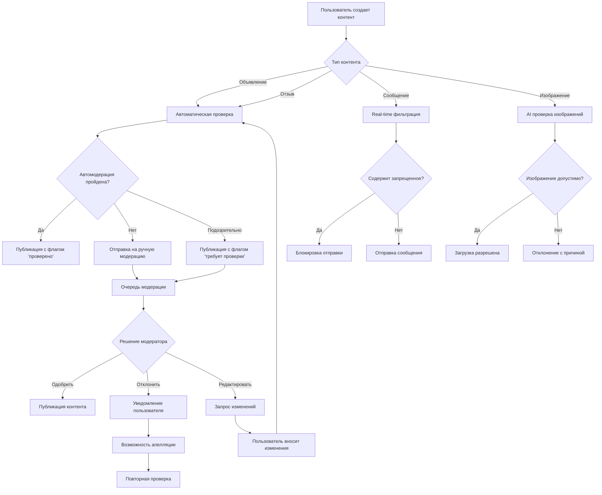

# Паспорт бизнес-процесса: Модерация контента

## 📋 Метаданные
- **Название**: Модерация контента
- **Роль**: Обеспечение безопасности и качества контента на платформе
- **Тип**: Бизнес-процесс
- **Статус**: Активный
- **Дата создания паспорта**: 2025-06-29

## 🎯 Назначение
Процесс модерации обеспечивает проверку и фильтрацию всего пользовательского контента (объявления, отзывы, сообщения, изображения) для предотвращения мошенничества, спама, неприемлемого контента и обеспечения соответствия правилам платформы.

## 🔄 Общая схема процесса



## 📐 Архитектурные компоненты

### Frontend компоненты
1. **ModerationStatus** (`/frontend/svetu/src/components/moderation/ModerationStatus.tsx`)
   - Отображение статуса модерации для пользователя
   - Индикаторы: ожидает проверки, одобрено, отклонено
   - Возможность просмотра причин отклонения

2. **AppealForm** (`/frontend/svetu/src/components/moderation/AppealForm.tsx`)
   - Форма подачи апелляции на решение модератора
   - Загрузка дополнительных документов
   - История апелляций

3. **ContentGuidelines** (`/frontend/svetu/src/components/moderation/ContentGuidelines.tsx`)
   - Правила публикации контента
   - Примеры допустимого/недопустимого контента
   - Советы по прохождению модерации

### Backend компоненты
1. **Moderation Service** (`/backend/internal/proj/moderation/service/`)
   - Автоматическая модерация текста
   - Интеграция с AI сервисами
   - Управление очередью модерации

2. **Content Analyzer** (`/backend/internal/proj/moderation/analyzer/`)
   - Анализ текста на спам, мат, контакты
   - Проверка изображений через AI API
   - Scoring система для контента

3. **Moderation Queue** (`/backend/internal/proj/moderation/queue/`)
   - Приоритизация контента для проверки
   - Распределение между модераторами
   - SLA tracking

### AI/ML компоненты
1. **Text Classification Model**
   - Обученная модель для классификации текста
   - Категории: спам, мошенничество, оскорбления, реклама
   - Confidence scoring

2. **Image Recognition API**
   - Интеграция с Google Vision API / AWS Rekognition
   - Детекция NSFW контента
   - Распознавание текста на изображениях

3. **Pattern Matching Engine**
   - Регулярные выражения для телефонов, email
   - Blacklist запрещенных слов
   - Whitelist доверенных доменов

## 🔧 Детальный flow процесса

### 1. Автоматическая модерация текста
```go
// content_analyzer.go
func (a *Analyzer) AnalyzeText(content string) (*AnalysisResult, error) {
    result := &AnalysisResult{
        Score: 0,
        Flags: []string{},
        Action: ActionApprove,
    }
    
    // Проверка на спам
    if spamScore := a.checkSpam(content); spamScore > 0.7 {
        result.Score += spamScore
        result.Flags = append(result.Flags, "spam")
    }
    
    // Проверка на запрещенные слова
    if hasProhibited := a.checkProhibitedWords(content); hasProhibited {
        result.Score += 1.0
        result.Flags = append(result.Flags, "prohibited_words")
    }
    
    // Проверка на контактные данные
    if contacts := a.extractContacts(content); len(contacts) > 0 {
        result.Score += 0.5
        result.Flags = append(result.Flags, "contains_contacts")
        result.ExtractedContacts = contacts
    }
    
    // Определение действия
    if result.Score >= 1.0 {
        result.Action = ActionReject
    } else if result.Score >= 0.5 {
        result.Action = ActionManualReview
    }
    
    return result, nil
}
```

### 2. Проверка изображений
```typescript
// Frontend: предварительная проверка перед загрузкой
const validateImage = async (file: File): Promise<ValidationResult> => {
  // Проверка размера
  if (file.size > 10 * 1024 * 1024) { // 10MB
    return { valid: false, error: 'Image too large' };
  }
  
  // Проверка формата
  const allowedTypes = ['image/jpeg', 'image/png', 'image/webp'];
  if (!allowedTypes.includes(file.type)) {
    return { valid: false, error: 'Invalid format' };
  }
  
  // Клиентская проверка на NSFW (TensorFlow.js)
  const isNSFW = await checkNSFWClient(file);
  if (isNSFW.probability > 0.8) {
    return { valid: false, error: 'Inappropriate content' };
  }
  
  return { valid: true };
};
```

```go
// Backend: полная проверка через AI
func (s *Service) ModerateImage(imageURL string) (*ImageModerationResult, error) {
    // Google Vision API
    client, err := vision.NewImageAnnotatorClient(ctx)
    if err != nil {
        return nil, err
    }
    defer client.Close()
    
    image := vision.NewImageFromURI(imageURL)
    
    // Safe Search Detection
    props, err := client.DetectSafeSearch(ctx, image, nil)
    if err != nil {
        return nil, err
    }
    
    result := &ImageModerationResult{
        Adult: props.Adult.String(),
        Violence: props.Violence.String(),
        Medical: props.Medical.String(),
        Spoof: props.Spoof.String(),
    }
    
    // Определение допустимости
    if props.Adult >= vision.Likelihood_LIKELY ||
       props.Violence >= vision.Likelihood_LIKELY {
        result.Action = ActionReject
        result.Reason = "Inappropriate content detected"
    }
    
    // OCR для поиска текста
    texts, err := client.DetectTexts(ctx, image, nil, 10)
    if err == nil && len(texts) > 0 {
        textContent := texts[0].Description
        textResult, _ := s.analyzer.AnalyzeText(textContent)
        if textResult.Action == ActionReject {
            result.Action = ActionReject
            result.Reason = "Prohibited text in image"
        }
    }
    
    return result, nil
}
```

### 3. Real-time модерация чатов
```go
// WebSocket middleware для чатов
func (h *Handler) ModerateChatMessage(msg *ChatMessage) error {
    // Быстрая проверка в памяти
    if h.quickFilter.ContainsProhibited(msg.Content) {
        return errors.New("Message contains prohibited content")
    }
    
    // Асинхронная полная проверка
    go func() {
        result, _ := h.analyzer.AnalyzeText(msg.Content)
        if result.Action == ActionReject {
            // Мягкое удаление сообщения
            h.service.SoftDeleteMessage(msg.ID)
            
            // Уведомление пользователя
            h.notifyUser(msg.UserID, "Message removed due to policy violation")
            
            // Увеличение счетчика нарушений
            h.service.IncrementViolations(msg.UserID)
        }
    }()
    
    return nil
}
```

### 4. Ручная модерация
```go
// Интерфейс модератора
type ModerationQueue struct {
    ID          int
    ContentType string // listing, review, message
    ContentID   int
    Priority    int    // 0-10, где 10 - наивысший
    CreatedAt   time.Time
    AssignedTo  *int   // ID модератора
    Status      string // pending, in_review, completed
}

// Получение следующего элемента для модерации
func (s *Service) GetNextForModeration(moderatorID int) (*ModerationItem, error) {
    // Приоритеты:
    // 1. Жалобы пользователей (priority 10)
    // 2. Платные объявления (priority 8)
    // 3. Новые пользователи (priority 6)
    // 4. Обычный контент (priority 3)
    
    var item ModerationItem
    err := s.db.Raw(`
        UPDATE moderation_queue
        SET assigned_to = ?, status = 'in_review', assigned_at = NOW()
        WHERE id = (
            SELECT id FROM moderation_queue
            WHERE status = 'pending' 
            AND (assigned_to IS NULL OR assigned_at < NOW() - INTERVAL '30 minutes')
            ORDER BY priority DESC, created_at ASC
            LIMIT 1
            FOR UPDATE SKIP LOCKED
        )
        RETURNING *
    `, moderatorID).Scan(&item).Error
    
    return &item, err
}
```

### 5. Система апелляций
```typescript
// AppealForm.tsx
const submitAppeal = async (appeal: AppealData) => {
  try {
    const response = await api.post('/api/v1/moderation/appeals', {
      content_type: appeal.contentType,
      content_id: appeal.contentId,
      reason: appeal.reason,
      additional_info: appeal.additionalInfo,
      attachments: appeal.attachments,
    });
    
    toast.success('Appeal submitted successfully');
    
    // Трекинг аналитики
    analytics.track('appeal_submitted', {
      content_type: appeal.contentType,
      original_rejection_reason: appeal.originalReason,
    });
  } catch (error) {
    toast.error('Failed to submit appeal');
  }
};
```

## 🔒 Безопасность и валидация

### Защита модераторов
1. **Анонимность** - пользователи не видят кто модерировал
2. **Ротация** - автоматическая смена заданий
3. **Психологическая поддержка** - перерывы, лимиты на сложный контент

### Защита от обхода
1. **Обфускация текста** - детекция l33t speak, юникод
2. **Изображения в изображениях** - проверка вложенных картинок
3. **Постепенное доверие** - новые аккаунты под усиленным контролем

### Предотвращение false positives
1. **Контекстный анализ** - учет темы объявления
2. **Whitelist исключений** - медицинские термины, адреса
3. **Обучение на ошибках** - feedback loop от апелляций

## 📊 Аналитика и метрики

### KPI модерации
```sql
-- Дашборд модерации
SELECT 
    DATE(created_at) as date,
    content_type,
    COUNT(*) as total_items,
    COUNT(CASE WHEN moderation_status = 'approved' THEN 1 END) as approved,
    COUNT(CASE WHEN moderation_status = 'rejected' THEN 1 END) as rejected,
    COUNT(CASE WHEN moderation_status = 'manual_review' THEN 1 END) as in_review,
    AVG(EXTRACT(EPOCH FROM (moderated_at - created_at))/60) as avg_time_minutes,
    COUNT(CASE WHEN appealed = true THEN 1 END) as appeals,
    COUNT(CASE WHEN appeal_approved = true THEN 1 END) as appeals_approved
FROM moderation_log
WHERE created_at >= CURRENT_DATE - INTERVAL '30 days'
GROUP BY DATE(created_at), content_type
ORDER BY date DESC;
```

### Метрики эффективности
- **Точность автомодерации**: % правильных решений (цель > 95%)
- **Время модерации**: среднее время до решения (цель < 2 часа)
- **False positive rate**: % ошибочных отклонений (цель < 2%)
- **Успешность апелляций**: % одобренных апелляций (норма 10-20%)

## ⚡ Производительность и оптимизация

### Кеширование правил
```go
// In-memory cache для быстрых проверок
type RulesCache struct {
    prohibitedWords map[string]bool
    prohibitedRegex []*regexp.Regexp
    whitelistDomains map[string]bool
    mu sync.RWMutex
}

// Обновление каждые 5 минут
func (c *RulesCache) RefreshPeriodically() {
    ticker := time.NewTicker(5 * time.Minute)
    for range ticker.C {
        c.refreshFromDB()
    }
}
```

### Батчинг для AI API
```go
// Группировка запросов к внешним API
func (s *Service) ProcessImageBatch() {
    batch := make([]*ImageTask, 0, 25)
    
    for {
        select {
        case task := <-s.imageQueue:
            batch = append(batch, task)
            
            if len(batch) >= 25 {
                s.sendBatchToAPI(batch)
                batch = batch[:0]
            }
            
        case <-time.After(100 * time.Millisecond):
            if len(batch) > 0 {
                s.sendBatchToAPI(batch)
                batch = batch[:0]
            }
        }
    }
}
```

## 🧪 Тестирование

### Unit тесты
```go
func TestContentAnalyzer(t *testing.T) {
    analyzer := NewAnalyzer()
    
    tests := []struct {
        name     string
        content  string
        expected ActionType
    }{
        {
            name:     "Clean content",
            content:  "Продаю велосипед в отличном состоянии",
            expected: ActionApprove,
        },
        {
            name:     "Spam content",
            content:  "КУПИ СЕЙЧАС!!! СКИДКА 90%!!! ЗВОНИ!!!",
            expected: ActionReject,
        },
        {
            name:     "Contact info",
            content:  "Цена договорная, звоните +381601234567",
            expected: ActionManualReview,
        },
    }
    
    for _, tt := range tests {
        t.Run(tt.name, func(t *testing.T) {
            result, _ := analyzer.AnalyzeText(tt.content)
            assert.Equal(t, tt.expected, result.Action)
        })
    }
}
```

### Integration тесты
```typescript
// cypress/e2e/moderation.cy.ts
describe('Content Moderation', () => {
  it('should block prohibited content in real-time', () => {
    cy.login();
    cy.visit('/listings/create');
    
    // Попытка ввести запрещенный контент
    cy.get('[data-testid="description"]').type('Купи сейчас +381601234567');
    cy.get('[data-testid="submit"]').click();
    
    // Проверка предупреждения
    cy.contains('Contact information not allowed').should('be.visible');
  });
});
```

## 🌍 Локализация и культурные особенности

### Мультиязычная модерация
- Правила для кириллицы и латиницы
- Сленг и региональные выражения
- Культурно-специфичный контент

### Региональные настройки
```go
// Разные правила для разных регионов
type RegionalRules struct {
    Region string
    ProhibitedWords []string
    AllowedContactTypes []string // в Сербии могут быть Viber контакты
    CulturalExceptions []string
}
```

## ⚠️ Известные проблемы и ограничения

1. **Задержка AI API** - до 2-3 секунд на изображение
2. **Ложные срабатывания** - медицинские товары, искусство
3. **Обход через изображения** - текст на картинках
4. **Ресурсоемкость** - высокая нагрузка при пиках

## 🔄 Связанные процессы

1. **[Публикация объявлений](listing-publication.md)** - где применяется модерация
2. **[Работа с отзывами](reviews-ratings-process.md)** - модерация отзывов
3. **[Коммуникация пользователей](user-communication.md)** - модерация чатов
4. **[Разрешение споров](dispute-resolution-arbitration.md)** - эскалация проблем

## 📈 Будущие улучшения

1. **ML модель на своих данных** - обучение на истории модерации
2. **Поведенческий анализ** - детекция подозрительных паттернов
3. **Community модерация** - доверенные пользователи помогают
4. **Превентивные подсказки** - помощь пользователям до отправки
5. **Градации наказаний** - warning → shadowban → ban