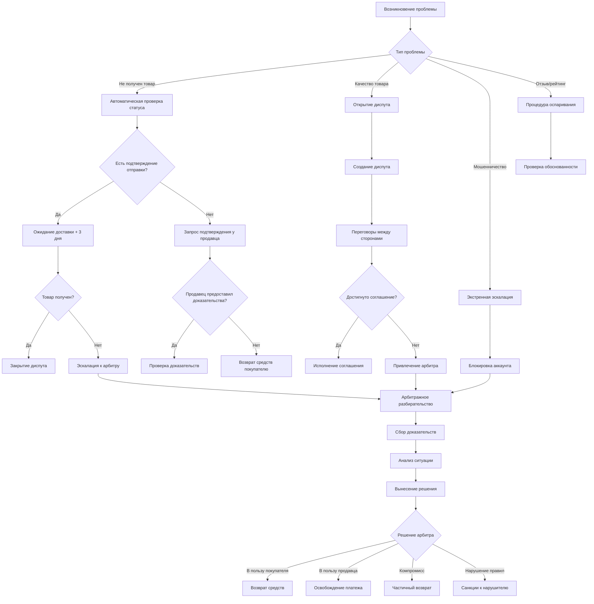

# Паспорт бизнес-процесса: Разрешение споров и арбитраж

## 📋 Метаданные
- **Название**: Разрешение споров и арбитраж
- **Роль**: Урегулирование конфликтов между пользователями платформы
- **Тип**: Бизнес-процесс
- **Статус**: Активный
- **Дата создания паспорта**: 2025-06-29

## 🎯 Назначение
Процесс обеспечивает справедливое и эффективное разрешение споров между покупателями и продавцами, включая проблемы с качеством товаров, невыполнением обязательств, мошенничеством и другими конфликтными ситуациями. Система арбитража защищает интересы всех сторон и поддерживает доверие к платформе.

## 🔄 Общая схема процесса



## 📐 Архитектурные компоненты

### Frontend компоненты
1. **DisputeCenter** (`/frontend/svetu/src/components/disputes/DisputeCenter.tsx`)
   - Центр управления спорами для пользователя
   - Список активных и закрытых диспутов
   - Статистика разрешения споров

2. **DisputeForm** (`/frontend/svetu/src/components/disputes/DisputeForm.tsx`)
   - Форма создания диспута с категоризацией
   - Загрузка доказательств (фото, видео, документы)
   - Выбор желаемого решения

3. **DisputeChat** (`/frontend/svetu/src/components/disputes/DisputeChat.tsx`)
   - Специальный чат для общения в рамках диспута
   - Участники: покупатель, продавец, арбитр
   - История сообщений и решений

4. **EvidenceUploader** (`/frontend/svetu/src/components/disputes/EvidenceUploader.tsx`)
   - Загрузка и управление доказательствами
   - Поддержка различных форматов
   - Временные метки и подписи

5. **ArbitrationPanel** (`/frontend/svetu/src/components/disputes/ArbitrationPanel.tsx`)
   - Интерфейс арбитра для рассмотрения дел
   - Инструменты анализа доказательств
   - Шаблоны решений

### Backend компоненты
1. **Dispute Service** (`/backend/internal/proj/disputes/service/`)
   - Создание и управление диспутами
   - Автоматическая категоризация
   - Расчет приоритетов

2. **Arbitration Engine** (`/backend/internal/proj/disputes/arbitration/`)
   - Назначение арбитров
   - Проверка конфликта интересов
   - SLA мониторинг

3. **Evidence Manager** (`/backend/internal/proj/disputes/evidence/`)
   - Хранение и верификация доказательств
   - Цепочка custody для документов
   - Watermarking и защита от подделок

4. **Resolution Executor** (`/backend/internal/proj/disputes/resolution/`)
   - Исполнение решений арбитража
   - Интеграция с платежной системой
   - Применение санкций

### База данных
```sql
-- Основная таблица диспутов
CREATE TABLE disputes (
    id SERIAL PRIMARY KEY,
    order_id INT REFERENCES marketplace_orders(id),
    buyer_id INT REFERENCES users(id),
    seller_id INT REFERENCES users(id),
    type VARCHAR(50), -- not_received, quality_issue, fraud, other
    status VARCHAR(50), -- open, negotiating, escalated, resolved, closed
    priority INT DEFAULT 5, -- 1-10, где 10 - критический
    created_at TIMESTAMP DEFAULT NOW(),
    escalated_at TIMESTAMP,
    resolved_at TIMESTAMP,
    resolution_type VARCHAR(50), -- refund, release, partial_refund, rejected
    resolution_amount DECIMAL(10,2),
    arbitrator_id INT REFERENCES admin_users(id),
    buyer_satisfaction INT, -- 1-5 рейтинг решения
    seller_satisfaction INT
);

-- Доказательства
CREATE TABLE dispute_evidence (
    id SERIAL PRIMARY KEY,
    dispute_id INT REFERENCES disputes(id),
    uploaded_by INT REFERENCES users(id),
    type VARCHAR(50), -- photo, video, document, screenshot
    file_url TEXT,
    description TEXT,
    verified BOOLEAN DEFAULT false,
    hash VARCHAR(64), -- SHA-256 для верификации
    created_at TIMESTAMP DEFAULT NOW()
);

-- История коммуникаций
CREATE TABLE dispute_messages (
    id SERIAL PRIMARY KEY,
    dispute_id INT REFERENCES disputes(id),
    sender_id INT REFERENCES users(id),
    sender_role VARCHAR(20), -- buyer, seller, arbitrator, system
    message TEXT,
    is_decision BOOLEAN DEFAULT false,
    created_at TIMESTAMP DEFAULT NOW()
);

-- Шаблоны решений
CREATE TABLE resolution_templates (
    id SERIAL PRIMARY KEY,
    type VARCHAR(50),
    title VARCHAR(200),
    description TEXT,
    buyer_compensation_percent INT, -- 0-100
    seller_penalty_percent INT, -- 0-100
    auto_apply_conditions JSONB
);
```

## 🔧 Детальный flow процесса

### 1. Создание диспута
```typescript
// DisputeForm.tsx
const createDispute = async (disputeData: DisputeFormData) => {
  try {
    // Валидация временных ограничений
    const daysSinceOrder = daysSince(order.created_at);
    if (daysSinceOrder > 30) {
      throw new Error('Dispute period expired (30 days)');
    }
    
    // Проверка на существующие диспуты
    const existingDispute = await checkExistingDispute(order.id);
    if (existingDispute) {
      router.push(`/disputes/${existingDispute.id}`);
      return;
    }
    
    // Создание диспута
    const dispute = await api.post('/api/v1/disputes', {
      order_id: order.id,
      type: disputeData.type,
      description: disputeData.description,
      desired_resolution: disputeData.desiredResolution,
      evidence_ids: disputeData.uploadedEvidence,
    });
    
    // Уведомление продавца
    await api.post('/api/v1/notifications/send', {
      user_id: order.seller_id,
      type: 'dispute_opened',
      data: { dispute_id: dispute.data.id },
    });
    
    // Приостановка выплаты продавцу
    if (order.payment_status === 'escrow') {
      await api.post(`/api/v1/payments/escrow/${order.escrow_id}/freeze`);
    }
    
    router.push(`/disputes/${dispute.data.id}`);
  } catch (error) {
    handleError(error);
  }
};
```

### 2. Автоматическая категоризация и приоритизация
```go
// dispute_service.go
func (s *Service) CategorizeAndPrioritize(dispute *models.Dispute) error {
    priority := 5 // базовый приоритет
    
    // Анализ типа проблемы
    switch dispute.Type {
    case "fraud":
        priority = 10
        dispute.AutoEscalate = true
    case "not_received":
        if dispute.Order.Amount > 1000 {
            priority = 8
        }
    case "quality_issue":
        // Проверка истории продавца
        sellerStats, _ := s.GetSellerDisputeStats(dispute.SellerID)
        if sellerStats.DisputeRate > 0.1 { // > 10% споров
            priority = 7
        }
    }
    
    // Учет истории покупателя
    buyerStats, _ := s.GetBuyerDisputeStats(dispute.BuyerID)
    if buyerStats.FalseDisputeRate > 0.3 {
        priority -= 2 // понижение приоритета для недобросовестных
    }
    
    // Учет суммы сделки
    if dispute.Order.Amount > 5000 {
        priority += 2
    }
    
    dispute.Priority = priority
    
    // Автоматическая эскалация критических случаев
    if priority >= 9 {
        return s.EscalateToArbitrator(dispute)
    }
    
    return s.db.Save(dispute).Error
}
```

### 3. Фаза переговоров
```go
// negotiation_handler.go
func (h *Handler) HandleNegotiationMessage(c *fiber.Ctx) error {
    var msg DisputeMessage
    if err := c.BodyParser(&msg); err != nil {
        return err
    }
    
    dispute, err := h.service.GetDispute(msg.DisputeID)
    if err != nil {
        return err
    }
    
    // Проверка прав доступа
    userID := c.Locals("userID").(int)
    if userID != dispute.BuyerID && userID != dispute.SellerID {
        return fiber.ErrForbidden
    }
    
    // Анализ предложения
    if msg.Type == "settlement_offer" {
        offer := ParseSettlementOffer(msg.Content)
        
        // Автоматическое принятие разумных предложений
        if s.IsReasonableOffer(offer, dispute) {
            msg.Metadata = map[string]interface{}{
                "auto_accept_eligible": true,
                "expires_at": time.Now().Add(48 * time.Hour),
            }
        }
    }
    
    // Сохранение сообщения
    if err := h.service.SaveMessage(&msg); err != nil {
        return err
    }
    
    // Real-time уведомление через WebSocket
    h.wsHub.SendToUser(dispute.GetOtherParty(userID), msg)
    
    // Проверка тайм-аута переговоров (72 часа)
    if time.Since(dispute.CreatedAt) > 72*time.Hour && dispute.Status == "negotiating" {
        go h.service.AutoEscalate(dispute.ID)
    }
    
    return c.JSON(fiber.Map{"success": true})
}
```

### 4. Сбор и верификация доказательств
```go
// evidence_manager.go
func (m *EvidenceManager) VerifyEvidence(evidence *models.DisputeEvidence) error {
    // Проверка хеша файла
    fileHash, err := m.calculateFileHash(evidence.FileURL)
    if err != nil {
        return err
    }
    
    if evidence.Hash != "" && evidence.Hash != fileHash {
        evidence.Verified = false
        evidence.VerificationNotes = "File hash mismatch - possible tampering"
        return errors.New("evidence tampering detected")
    }
    
    evidence.Hash = fileHash
    
    // Анализ метаданных изображения
    if evidence.Type == "photo" {
        metadata, err := m.extractImageMetadata(evidence.FileURL)
        if err == nil {
            // Проверка даты съемки
            if metadata.DateTime.Before(evidence.Dispute.Order.CreatedAt) {
                evidence.VerificationNotes = "Photo taken before order date"
                evidence.Verified = false
            } else {
                evidence.Metadata = metadata
                evidence.Verified = true
            }
        }
    }
    
    // OCR для документов
    if evidence.Type == "document" {
        text, err := m.performOCR(evidence.FileURL)
        if err == nil {
            evidence.ExtractedText = text
            // Поиск ключевой информации
            evidence.Verified = m.validateDocumentContent(text, evidence.Dispute)
        }
    }
    
    return m.db.Save(evidence).Error
}
```

### 5. Арбитражное разбирательство
```go
// arbitration_engine.go
func (e *ArbitrationEngine) AssignArbitrator(dispute *models.Dispute) (*models.AdminUser, error) {
    // Получение доступных арбитров
    var arbitrators []models.AdminUser
    err := e.db.Where("role = ? AND is_active = ?", "arbitrator", true).
        Find(&arbitrators).Error
    if err != nil {
        return nil, err
    }
    
    // Фильтрация по конфликту интересов
    eligible := []models.AdminUser{}
    for _, arb := range arbitrators {
        if !e.hasConflictOfInterest(arb.ID, dispute) {
            eligible = append(eligible, arb)
        }
    }
    
    // Выбор по загруженности и экспертизе
    var selected *models.AdminUser
    minLoad := int(^uint(0) >> 1) // MaxInt
    
    for _, arb := range eligible {
        load := e.getArbitratorLoad(arb.ID)
        expertise := e.getExpertiseScore(arb.ID, dispute.Type)
        
        // Weighted score: меньше загрузка + больше экспертиза
        score := load - expertise*10
        
        if score < minLoad {
            minLoad = score
            selected = &arb
        }
    }
    
    // Назначение и уведомление
    dispute.ArbitratorID = &selected.ID
    dispute.Status = "escalated"
    dispute.EscalatedAt = timePtr(time.Now())
    
    // SLA: 24 часа на первый ответ
    e.scheduleSLACheck(dispute.ID, 24*time.Hour)
    
    return selected, e.db.Save(dispute).Error
}
```

### 6. Анализ и вынесение решения
```go
// arbitration_decision.go
func (e *ArbitrationEngine) AnalyzeCase(disputeID int) (*DecisionRecommendation, error) {
    dispute, _ := e.getDisputeWithFullContext(disputeID)
    
    recommendation := &DecisionRecommendation{
        DisputeID: disputeID,
        Factors: []DecisionFactor{},
    }
    
    // Анализ доказательств
    evidenceScore := e.analyzeEvidence(dispute.Evidence)
    recommendation.Factors = append(recommendation.Factors, DecisionFactor{
        Name: "Evidence Strength",
        BuyerScore: evidenceScore.BuyerEvidence,
        SellerScore: evidenceScore.SellerEvidence,
        Weight: 0.4,
    })
    
    // История поведения сторон
    behaviorScore := e.analyzeBehaviorHistory(dispute.BuyerID, dispute.SellerID)
    recommendation.Factors = append(recommendation.Factors, DecisionFactor{
        Name: "Historical Behavior",
        BuyerScore: behaviorScore.BuyerReliability,
        SellerScore: behaviorScore.SellerReliability,
        Weight: 0.2,
    })
    
    // Соответствие правилам платформы
    policyScore := e.analyzePolicyCompliance(dispute)
    recommendation.Factors = append(recommendation.Factors, DecisionFactor{
        Name: "Policy Compliance",
        BuyerScore: policyScore.BuyerCompliance,
        SellerScore: policyScore.SellerCompliance,
        Weight: 0.3,
    })
    
    // Коммуникация и готовность к компромиссу
    communicationScore := e.analyzeCommunication(dispute.Messages)
    recommendation.Factors = append(recommendation.Factors, DecisionFactor{
        Name: "Communication Quality",
        BuyerScore: communicationScore.BuyerScore,
        SellerScore: communicationScore.SellerScore,
        Weight: 0.1,
    })
    
    // Расчет итоговой рекомендации
    totalBuyerScore := 0.0
    totalSellerScore := 0.0
    
    for _, factor := range recommendation.Factors {
        totalBuyerScore += factor.BuyerScore * factor.Weight
        totalSellerScore += factor.SellerScore * factor.Weight
    }
    
    // Определение рекомендуемого решения
    if totalBuyerScore > totalSellerScore + 0.2 {
        recommendation.Decision = "full_refund"
        recommendation.Confidence = totalBuyerScore
    } else if totalSellerScore > totalBuyerScore + 0.2 {
        recommendation.Decision = "release_payment"
        recommendation.Confidence = totalSellerScore
    } else {
        recommendation.Decision = "partial_refund"
        recommendation.RefundPercent = int(totalBuyerScore * 100)
        recommendation.Confidence = 1.0 - math.Abs(totalBuyerScore-totalSellerScore)
    }
    
    recommendation.Reasoning = e.generateReasoning(recommendation)
    
    return recommendation, nil
}
```

### 7. Исполнение решения
```go
// resolution_executor.go
func (e *ResolutionExecutor) ExecuteDecision(decision *models.ArbitrationDecision) error {
    tx := e.db.Begin()
    defer tx.Rollback()
    
    dispute, err := e.getDispute(decision.DisputeID)
    if err != nil {
        return err
    }
    
    switch decision.Type {
    case "full_refund":
        // Возврат полной суммы покупателю
        if err := e.paymentService.RefundEscrow(dispute.Order.EscrowID, dispute.BuyerID, dispute.Order.Amount); err != nil {
            return err
        }
        
        // Обновление репутации продавца
        e.reputationService.AddDisputeLoss(dispute.SellerID, "full_refund")
        
    case "partial_refund":
        // Частичный возврат
        refundAmount := dispute.Order.Amount * decimal.NewFromFloat(float64(decision.RefundPercent) / 100)
        releaseAmount := dispute.Order.Amount.Sub(refundAmount)
        
        if err := e.paymentService.SplitEscrow(dispute.Order.EscrowID, map[int]decimal.Decimal{
            dispute.BuyerID: refundAmount,
            dispute.SellerID: releaseAmount,
        }); err != nil {
            return err
        }
        
    case "release_payment":
        // Освобождение платежа продавцу
        if err := e.paymentService.ReleaseEscrow(dispute.Order.EscrowID, dispute.SellerID); err != nil {
            return err
        }
        
        // Обновление репутации покупателя
        e.reputationService.AddDisputeLoss(dispute.BuyerID, "payment_released")
        
    case "both_penalized":
        // Редкий случай - обе стороны нарушили правила
        // Средства идут в фонд компенсаций платформы
        if err := e.paymentService.TransferToPlatformFund(dispute.Order.EscrowID); err != nil {
            return err
        }
        
        // Санкции к обеим сторонам
        e.sanctionService.ApplySanction(dispute.BuyerID, decision.BuyerSanction)
        e.sanctionService.ApplySanction(dispute.SellerID, decision.SellerSanction)
    }
    
    // Обновление статуса диспута
    dispute.Status = "resolved"
    dispute.ResolvedAt = timePtr(time.Now())
    dispute.ResolutionType = decision.Type
    dispute.ResolutionAmount = decision.RefundAmount
    
    if err := tx.Save(dispute).Error; err != nil {
        return err
    }
    
    // Сохранение решения
    decision.ExecutedAt = timePtr(time.Now())
    if err := tx.Save(decision).Error; err != nil {
        return err
    }
    
    // Уведомления сторонам
    e.notifyParties(dispute, decision)
    
    // Запрос обратной связи (через 24 часа)
    e.scheduleFeedbackRequest(dispute.ID, 24*time.Hour)
    
    return tx.Commit().Error
}
```

## 🔒 Безопасность и валидация

### Предотвращение злоупотреблений
1. **Лимиты на диспуты** - не более 3 активных на пользователя
2. **Временные ограничения** - 30 дней с момента сделки
3. **Депозит за апелляцию** - для предотвращения спама
4. **Блокировка серийных нарушителей** - автоматическая система

### Защита доказательств
```go
// Цифровая подпись доказательств
func (m *EvidenceManager) SignEvidence(evidence *models.DisputeEvidence) error {
    // Создание подписи
    signature := m.cryptoService.Sign([]byte(evidence.Hash + evidence.UploadedAt.String()))
    evidence.DigitalSignature = signature
    
    // Blockchain anchoring для критических случаев
    if evidence.Dispute.Priority >= 8 {
        txHash, err := m.blockchainService.AnchorHash(evidence.Hash)
        if err == nil {
            evidence.BlockchainTxHash = txHash
        }
    }
    
    return nil
}
```

### Конфиденциальность
1. **Анонимизация для арбитров** - не видят личные данные
2. **Шифрование чувствительных данных** - платежная информация
3. **Раздельный доступ** - каждая сторона видит только свои данные

## 📊 Аналитика и метрики

### KPI системы арбитража
```sql
-- Дашборд эффективности
WITH dispute_stats AS (
    SELECT 
        DATE_TRUNC('month', created_at) as month,
        COUNT(*) as total_disputes,
        COUNT(CASE WHEN status = 'resolved' THEN 1 END) as resolved,
        COUNT(CASE WHEN resolution_type = 'full_refund' THEN 1 END) as buyer_wins,
        COUNT(CASE WHEN resolution_type = 'release_payment' THEN 1 END) as seller_wins,
        COUNT(CASE WHEN resolution_type = 'partial_refund' THEN 1 END) as compromises,
        AVG(EXTRACT(EPOCH FROM (resolved_at - created_at))/3600) as avg_resolution_hours,
        AVG(buyer_satisfaction) as avg_buyer_satisfaction,
        AVG(seller_satisfaction) as avg_seller_satisfaction
    FROM disputes
    WHERE created_at >= CURRENT_DATE - INTERVAL '12 months'
    GROUP BY DATE_TRUNC('month', created_at)
)
SELECT 
    month,
    total_disputes,
    resolved::float / NULLIF(total_disputes, 0) * 100 as resolution_rate,
    buyer_wins::float / NULLIF(resolved, 0) * 100 as buyer_win_rate,
    seller_wins::float / NULLIF(resolved, 0) * 100 as seller_win_rate,
    compromises::float / NULLIF(resolved, 0) * 100 as compromise_rate,
    avg_resolution_hours,
    avg_buyer_satisfaction,
    avg_seller_satisfaction,
    (avg_buyer_satisfaction + avg_seller_satisfaction) / 2 as overall_satisfaction
FROM dispute_stats
ORDER BY month DESC;
```

### Метрики эффективности
- **Скорость разрешения**: среднее время до решения (цель < 48 часов)
- **Удовлетворенность решением**: средний рейтинг > 4.0/5.0
- **Процент эскалаций**: < 20% диспутов требуют арбитра
- **Повторные диспуты**: < 5% после разрешения

## ⚡ Производительность и оптимизация

### Автоматизация рутинных кейсов
```go
// Правила автоматического разрешения
type AutoResolutionRule struct {
    Condition string
    Action    string
    Template  string
}

var autoRules = []AutoResolutionRule{
    {
        Condition: "type = 'not_received' AND days_since_order > 30 AND tracking_provided = false",
        Action:    "full_refund",
        Template:  "auto_refund_no_tracking",
    },
    {
        Condition: "type = 'duplicate_charge' AND payment_proof_valid = true",
        Action:    "full_refund", 
        Template:  "auto_refund_duplicate",
    },
}

func (s *Service) CheckAutoResolution(dispute *models.Dispute) bool {
    for _, rule := range autoRules {
        if s.evaluateRule(rule.Condition, dispute) {
            s.autoResolve(dispute, rule.Action, rule.Template)
            return true
        }
    }
    return false
}
```

### Кеширование частых запросов
```go
// Redis кеш для истории поведения
func (s *Service) GetUserDisputeHistory(userID int) (*UserDisputeStats, error) {
    cacheKey := fmt.Sprintf("dispute:stats:user:%d", userID)
    
    // Проверка кеша
    var stats UserDisputeStats
    if err := s.redis.Get(cacheKey, &stats); err == nil {
        return &stats, nil
    }
    
    // Загрузка из БД
    stats = s.calculateUserStats(userID)
    
    // Сохранение в кеш на 1 час
    s.redis.Set(cacheKey, stats, time.Hour)
    
    return &stats, nil
}
```

## 🧪 Тестирование

### Unit тесты
```go
func TestArbitrationScoring(t *testing.T) {
    engine := NewArbitrationEngine()
    
    testCases := []struct {
        name     string
        evidence EvidenceSet
        expected string
    }{
        {
            name: "Clear buyer case",
            evidence: EvidenceSet{
                BuyerEvidence: []Evidence{
                    {Type: "photo", Verified: true, Score: 0.9},
                    {Type: "payment_proof", Verified: true, Score: 1.0},
                },
                SellerEvidence: []Evidence{},
            },
            expected: "full_refund",
        },
        {
            name: "Balanced case",
            evidence: EvidenceSet{
                BuyerEvidence: []Evidence{
                    {Type: "claim", Verified: true, Score: 0.6},
                },
                SellerEvidence: []Evidence{
                    {Type: "shipping_proof", Verified: true, Score: 0.7},
                },
            },
            expected: "partial_refund",
        },
    }
    
    for _, tc := range testCases {
        t.Run(tc.name, func(t *testing.T) {
            result := engine.ScoreEvidence(tc.evidence)
            assert.Equal(t, tc.expected, result.RecommendedAction)
        })
    }
}
```

### Integration тесты
```typescript
// cypress/e2e/dispute-flow.cy.ts
describe('Dispute Resolution Flow', () => {
  it('should create and resolve dispute successfully', () => {
    // Создание тестового заказа
    cy.createTestOrder().then(order => {
      cy.login(order.buyer);
      cy.visit(`/orders/${order.id}`);
      
      // Открытие диспута
      cy.contains('Report Problem').click();
      cy.get('[data-testid="dispute-type"]').select('not_received');
      cy.get('[data-testid="dispute-description"]').type('Item never arrived');
      cy.get('[data-testid="submit-dispute"]').click();
      
      // Проверка создания
      cy.contains('Dispute opened successfully');
      cy.url().should('include', '/disputes/');
      
      // Переговоры
      cy.get('[data-testid="dispute-chat"]').type('Please help resolve this');
      cy.get('[data-testid="send-message"]').click();
      
      // Эскалация
      cy.wait(3000); // Симуляция тайм-аута
      cy.contains('Escalate to Arbitrator').click();
      
      // Проверка статуса
      cy.contains('Status: Under Review');
    });
  });
});
```

## 🌍 Локализация и культурные особенности

### Региональные правила
```go
type RegionalDisputeRules struct {
    Country           string
    ConsumerProtectionDays int  // Срок защиты покупателя
    RequiredEvidence  []string  // Обязательные доказательства
    PreferredResolution string  // Предпочтительный тип решения
}

var serbianRules = RegionalDisputeRules{
    Country: "RS",
    ConsumerProtectionDays: 14, // EU стандарт
    RequiredEvidence: []string{"fiscal_receipt", "delivery_note"},
    PreferredResolution: "mediation_first",
}
```

### Мультиязычные шаблоны
- Решения на сербском и английском
- Учет местных праздников в SLA
- Интеграция с местными службами доставки

## ⚠️ Известные ограничения

1. **Нет офлайн арбитража** - только онлайн разрешение
2. **Лимит доказательств** - максимум 10 файлов по 50MB
3. **Срок давности** - 30 дней после сделки
4. **Минимальная сумма** - диспуты от 500 динар

## 🔄 Связанные процессы

1. **[Escrow платежи](escrow-payments-guarantees.md)** - блокировка средств при диспуте
2. **[Работа с отзывами](reviews-ratings-process.md)** - влияние на рейтинг
3. **[Модерация контента](content-moderation.md)** - проверка доказательств
4. **[Коммуникация пользователей](user-communication.md)** - чат в диспутах

## 📈 Будущие улучшения

1. **AI-медиатор** - автоматические предложения компромиссов
2. **Видео-арбитраж** - онлайн слушания для сложных кейсов
3. **Превентивная аналитика** - предсказание диспутов
4. **Страхование сделок** - опциональная защита
5. **Интеграция с судами** - для крупных споров