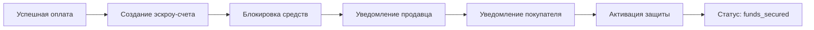
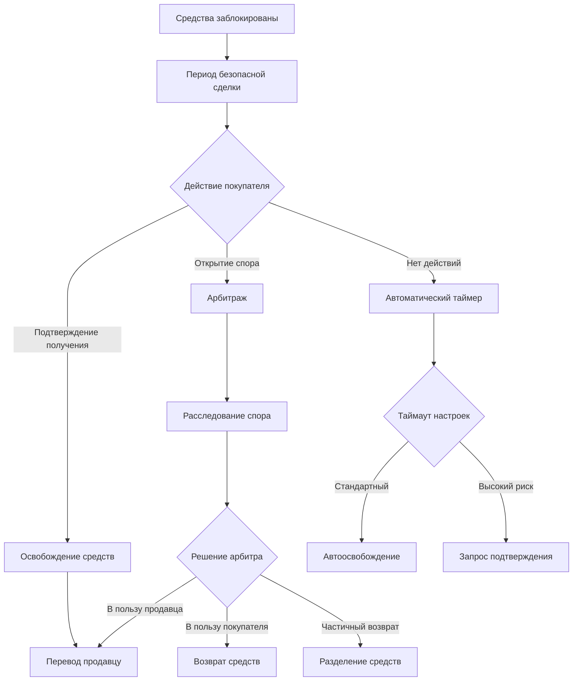
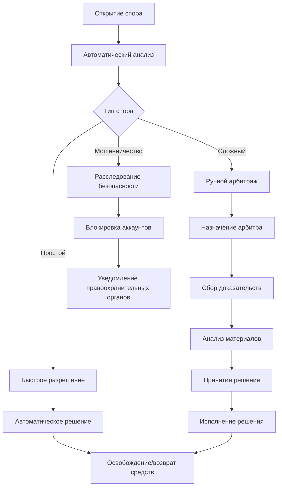
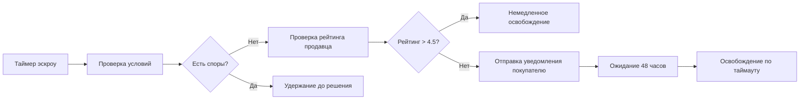

# Паспорт бизнес-процесса: Escrow платежи и гарантии

## 🎯 Назначение процесса

Обеспечение безопасных сделок между покупателями и продавцами через систему эскроу-счетов, которая удерживает средства до подтверждения получения товара, с автоматическим арбитражем споров и защитой интересов всех сторон.

## 🔄 Схема процесса

### 1. **Создание эскроу-счета**


### 2. **Управление эскроу-счетом**


### 3. **Арбитраж и разрешение споров**


### 4. **Автоматическое освобождение средств**


## 🏗️ Архитектурные компоненты

### **Frontend компоненты**
- **EscrowStatus** - индикатор статуса эскроу-счета
- **EscrowTimeline** - временная шкала этапов сделки
- **DisputeForm** - форма открытия спора
- **EscrowActions** - действия покупателя (подтвердить/спор)
- **ArbitrageCenter** - центр арбитража для модераторов
- **EscrowHistory** - история всех эскроу-транзакций пользователя

### **Backend сервисы**
- **EscrowService** - основной сервис управления эскроу
- **DisputeService** - сервис обработки споров
- **ArbitrageService** - сервис арбитража
- **EscrowScheduler** - планировщик автоматических действий
- **RiskAssessmentService** - оценка рисков сделок
- **EscrowNotificationService** - уведомления по эскроу

### **Базы данных**
- **escrow_accounts** - основная таблица эскроу-счетов
- **escrow_transactions** - транзакции по эскроу-счетам
- **disputes** - споры и их статусы
- **arbitrage_cases** - дела арбитража
- **escrow_timers** - таймеры автоматических действий
- **risk_assessments** - оценки рисков сделок

## 🔗 Интеграции

### **EscrowService - основной сервис**
```go
type EscrowService struct {
    repository    EscrowRepositoryInterface
    payment       PaymentServiceInterface
    notification  NotificationServiceInterface
    risk          RiskAssessmentServiceInterface
    scheduler     SchedulerInterface
    logger        logger.Logger
    config        *EscrowConfig
}

type EscrowConfig struct {
    DefaultHoldPeriod     time.Duration // 7 дней по умолчанию
    MaxHoldPeriod         time.Duration // 30 дней максимум
    AutoReleaseThreshold  decimal.Decimal // Сумма для автоматического освобождения
    HighRiskHoldPeriod    time.Duration // 14 дней для высокого риска
    MinSellerRating       float64       // 4.0 минимальный рейтинг для быстрого освобождения
}

// Создание эскроу-счета
func (s *EscrowService) CreateEscrowAccount(ctx context.Context, req CreateEscrowRequest) (*EscrowAccount, error) {
    // 1. Валидация платежа
    payment, err := s.payment.GetPayment(ctx, req.PaymentID)
    if err != nil {
        return nil, fmt.Errorf("failed to get payment: %w", err)
    }
    
    if payment.Status != "completed" {
        return nil, errors.New("escrow.paymentNotCompleted")
    }

    // 2. Оценка рисков
    riskLevel, err := s.risk.AssessTransactionRisk(ctx, RiskAssessmentRequest{
        BuyerID:     payment.UserID,
        SellerID:    payment.Listing.UserID,
        Amount:      payment.Amount,
        Category:    payment.Listing.Category,
        ListingAge:  time.Since(payment.Listing.CreatedAt),
    })
    if err != nil {
        s.logger.Warn("Risk assessment failed", "error", err)
        riskLevel = "medium" // Безопасный fallback
    }

    // 3. Определение периода удержания
    holdPeriod := s.calculateHoldPeriod(payment, riskLevel)
    releaseDate := time.Now().Add(holdPeriod)

    // 4. Создание эскроу-счета
    escrow := &models.EscrowAccount{
        PaymentID:         payment.ID,
        BuyerID:          payment.UserID,
        SellerID:         payment.Listing.UserID,
        ListingID:        payment.ListingID,
        Amount:           payment.Amount,
        Currency:         payment.Currency,
        Status:           "funds_secured",
        RiskLevel:        riskLevel,
        HoldPeriod:       holdPeriod,
        AutoReleaseDate:  releaseDate,
        CreatedAt:        time.Now(),
    }

    err = s.repository.CreateEscrowAccount(ctx, escrow)
    if err != nil {
        return nil, fmt.Errorf("failed to create escrow account: %w", err)
    }

    // 5. Планирование автоматического освобождения
    err = s.scheduler.ScheduleAutoRelease(ctx, ScheduleRequest{
        EscrowID:    escrow.ID,
        ReleaseDate: releaseDate,
        Action:      "auto_release",
    })
    if err != nil {
        s.logger.Error("Failed to schedule auto release", "escrow_id", escrow.ID, "error", err)
    }

    // 6. Уведомления
    s.sendEscrowNotifications(ctx, escrow, "created")

    return escrow, nil
}

// Расчет периода удержания
func (s *EscrowService) calculateHoldPeriod(payment *models.Payment, riskLevel string) time.Duration {
    switch riskLevel {
    case "low":
        return 3 * 24 * time.Hour  // 3 дня
    case "medium":
        return s.config.DefaultHoldPeriod // 7 дней
    case "high":
        return s.config.HighRiskHoldPeriod // 14 дней
    case "critical":
        return s.config.MaxHoldPeriod // 30 дней
    default:
        return s.config.DefaultHoldPeriod
    }
}
```

### **Подтверждение получения товара**
```go
// Подтверждение получения покупателем
func (s *EscrowService) ConfirmDelivery(ctx context.Context, req ConfirmDeliveryRequest) error {
    // 1. Получение эскроу-счета
    escrow, err := s.repository.GetEscrowByID(ctx, req.EscrowID)
    if err != nil {
        return fmt.Errorf("failed to get escrow: %w", err)
    }

    // 2. Проверка прав доступа
    if escrow.BuyerID != req.UserID {
        return errors.New("escrow.accessDenied")
    }

    // 3. Проверка статуса
    if escrow.Status != "funds_secured" {
        return errors.New("escrow.invalidStatus")
    }

    // 4. Создание транзакции подтверждения
    tx := &models.EscrowTransaction{
        EscrowID:    escrow.ID,
        Type:        "buyer_confirmation",
        Amount:      escrow.Amount,
        Status:      "pending",
        Metadata: map[string]interface{}{
            "confirmation_method": req.Method, // "manual" или "automatic"
            "rating":             req.Rating,
            "review":             req.Review,
        },
        CreatedAt: time.Now(),
    }

    err = s.repository.CreateEscrowTransaction(ctx, tx)
    if err != nil {
        return fmt.Errorf("failed to create confirmation transaction: %w", err)
    }

    // 5. Освобождение средств
    err = s.releaseFunds(ctx, escrow.ID, "buyer_confirmed")
    if err != nil {
        return fmt.Errorf("failed to release funds: %w", err)
    }

    return nil
}

// Освобождение средств
func (s *EscrowService) releaseFunds(ctx context.Context, escrowID int64, reason string) error {
    // 1. Обновление статуса эскроу
    err := s.repository.UpdateEscrowStatus(ctx, escrowID, "funds_released")
    if err != nil {
        return fmt.Errorf("failed to update escrow status: %w", err)
    }

    // 2. Получение данных эскроу
    escrow, err := s.repository.GetEscrowByID(ctx, escrowID)
    if err != nil {
        return fmt.Errorf("failed to get escrow: %w", err)
    }

    // 3. Расчет сумм
    platformCommission := s.calculatePlatformCommission(escrow.Amount)
    sellerAmount := escrow.Amount.Sub(platformCommission)

    // 4. Перевод средств продавцу
    err = s.payment.TransferToSeller(ctx, TransferRequest{
        SellerID:  escrow.SellerID,
        Amount:    sellerAmount,
        Currency:  escrow.Currency,
        Reference: fmt.Sprintf("escrow-release-%d", escrowID),
        EscrowID:  escrowID,
    })
    if err != nil {
        // Откат статуса при ошибке
        s.repository.UpdateEscrowStatus(ctx, escrowID, "funds_secured")
        return fmt.Errorf("failed to transfer to seller: %w", err)
    }

    // 5. Учет комиссии платформы
    err = s.payment.RecordPlatformCommission(ctx, CommissionRequest{
        EscrowID:   escrowID,
        Amount:     platformCommission,
        Currency:   escrow.Currency,
        Type:       "marketplace_fee",
    })
    if err != nil {
        s.logger.Error("Failed to record platform commission", "escrow_id", escrowID, "error", err)
    }

    // 6. Создание финальной транзакции
    finalTx := &models.EscrowTransaction{
        EscrowID:  escrowID,
        Type:      "funds_released",
        Amount:    escrow.Amount,
        Status:    "completed",
        Metadata: map[string]interface{}{
            "reason":              reason,
            "seller_amount":       sellerAmount.String(),
            "platform_commission": platformCommission.String(),
            "released_at":         time.Now().UTC(),
        },
        CreatedAt: time.Now(),
    }

    err = s.repository.CreateEscrowTransaction(ctx, finalTx)
    if err != nil {
        s.logger.Error("Failed to create final transaction", "escrow_id", escrowID, "error", err)
    }

    // 7. Уведомления
    s.sendEscrowNotifications(ctx, escrow, "funds_released")

    return nil
}
```

### **Система споров и арбитража**
```go
// Открытие спора
func (s *DisputeService) OpenDispute(ctx context.Context, req OpenDisputeRequest) (*Dispute, error) {
    // 1. Валидация запроса
    escrow, err := s.escrowRepo.GetEscrowByID(ctx, req.EscrowID)
    if err != nil {
        return nil, fmt.Errorf("failed to get escrow: %w", err)
    }

    // Проверка прав (только покупатель может открыть спор)
    if escrow.BuyerID != req.UserID {
        return nil, errors.New("dispute.accessDenied")
    }

    // Проверка статуса эскроу
    if escrow.Status != "funds_secured" {
        return nil, errors.New("dispute.invalidEscrowStatus")
    }

    // 2. Создание спора
    dispute := &models.Dispute{
        EscrowID:     req.EscrowID,
        InitiatorID:  req.UserID,
        Type:         req.Type, // "not_received", "not_as_described", "damaged", "fraud"
        Title:        req.Title,
        Description:  req.Description,
        Status:       "open",
        Priority:     s.calculateDisputePriority(req.Type, escrow.Amount),
        CreatedAt:    time.Now(),
    }

    err = s.repository.CreateDispute(ctx, dispute)
    if err != nil {
        return nil, fmt.Errorf("failed to create dispute: %w", err)
    }

    // 3. Загрузка доказательств
    if len(req.Evidence) > 0 {
        for _, evidence := range req.Evidence {
            err = s.uploadEvidence(ctx, dispute.ID, evidence)
            if err != nil {
                s.logger.Error("Failed to upload evidence", "dispute_id", dispute.ID, "error", err)
            }
        }
    }

    // 4. Обновление статуса эскроу
    err = s.escrowRepo.UpdateEscrowStatus(ctx, req.EscrowID, "disputed")
    if err != nil {
        s.logger.Error("Failed to update escrow status to disputed", "escrow_id", req.EscrowID, "error", err)
    }

    // 5. Автоматическая предварительная обработка
    go s.preprocessDispute(context.Background(), dispute.ID)

    // 6. Уведомления
    s.sendDisputeNotifications(ctx, dispute, "opened")

    return dispute, nil
}

// Автоматическая предварительная обработка спора
func (s *DisputeService) preprocessDispute(ctx context.Context, disputeID int64) {
    dispute, err := s.repository.GetDisputeByID(ctx, disputeID)
    if err != nil {
        s.logger.Error("Failed to get dispute for preprocessing", "dispute_id", disputeID, "error", err)
        return
    }

    // Анализ типа спора для автоматического разрешения
    switch dispute.Type {
    case "not_received":
        // Проверка данных доставки
        if s.checkDeliveryConfirmation(ctx, dispute.EscrowID) {
            s.autoResolveDispute(ctx, disputeID, "delivery_confirmed", "seller")
        }
    case "not_as_described":
        // Требует ручного арбитража
        s.escalateToArbitrage(ctx, disputeID)
    case "damaged":
        // Проверка фото и автоматическое разрешение при наличии доказательств
        if s.analyzeEvidencePhotos(ctx, disputeID) {
            s.autoResolveDispute(ctx, disputeID, "damage_confirmed", "buyer")
        }
    case "fraud":
        // Немедленная эскалация в службу безопасности
        s.escalateToSecurity(ctx, disputeID)
    }
}

// Арбитраж спора
func (s *ArbitrageService) ProcessArbitrage(ctx context.Context, req ArbitrageRequest) (*ArbitrageDecision, error) {
    // 1. Назначение арбитра
    arbitrator, err := s.assignArbitrator(ctx, req.DisputeID)
    if err != nil {
        return nil, fmt.Errorf("failed to assign arbitrator: %w", err)
    }

    // 2. Создание дела арбитража
    case := &models.ArbitrageCase{
        DisputeID:     req.DisputeID,
        ArbitratorID:  arbitrator.ID,
        Status:        "assigned",
        Priority:      req.Priority,
        AssignedAt:    time.Now(),
        DueDate:       time.Now().Add(48 * time.Hour), // 48 часов на решение
    }

    err = s.repository.CreateArbitrageCase(ctx, case)
    if err != nil {
        return nil, fmt.Errorf("failed to create arbitrage case: %w", err)
    }

    // 3. Сбор всех материалов дела
    evidence, err := s.collectEvidenceForCase(ctx, req.DisputeID)
    if err != nil {
        s.logger.Error("Failed to collect evidence", "dispute_id", req.DisputeID, "error", err)
    }

    // 4. Уведомление арбитра
    s.notifyArbitrator(ctx, arbitrator, case, evidence)

    return &ArbitrageDecision{
        CaseID:     case.ID,
        Status:     "in_progress",
        Arbitrator: arbitrator.Name,
        DueDate:    case.DueDate,
    }, nil
}
```

### **Frontend интеграция**
```typescript
// Hook для управления эскроу
export const useEscrowManagement = () => {
  const [escrowState, setEscrowState] = useState<EscrowState>({
    accounts: [],
    loading: false,
    error: null,
  });

  const confirmDelivery = async (escrowId: number, rating?: number, review?: string) => {
    setEscrowState(prev => ({ ...prev, loading: true }));

    try {
      const response = await fetch(`/api/v1/escrow/${escrowId}/confirm-delivery`, {
        method: 'POST',
        headers: { 'Content-Type': 'application/json' },
        body: JSON.stringify({
          rating,
          review,
          confirmation_method: 'manual',
        }),
      });

      const result = await response.json();
      
      if (!result.success) {
        throw new Error(result.error || 'Failed to confirm delivery');
      }

      // Обновление состояния
      setEscrowState(prev => ({
        ...prev,
        loading: false,
        accounts: prev.accounts.map(acc => 
          acc.id === escrowId 
            ? { ...acc, status: 'funds_released', confirmed_at: new Date() }
            : acc
        ),
      }));

      toast.success('Получение товара подтверждено! Средства переведены продавцу.');

    } catch (error) {
      setEscrowState(prev => ({ 
        ...prev, 
        loading: false, 
        error: error.message 
      }));
      toast.error('Ошибка при подтверждении получения');
    }
  };

  const openDispute = async (escrowId: number, disputeData: DisputeData) => {
    setEscrowState(prev => ({ ...prev, loading: true }));

    try {
      const formData = new FormData();
      formData.append('escrow_id', escrowId.toString());
      formData.append('type', disputeData.type);
      formData.append('title', disputeData.title);
      formData.append('description', disputeData.description);

      // Добавление файлов доказательств
      disputeData.evidence.forEach((file, index) => {
        formData.append(`evidence_${index}`, file);
      });

      const response = await fetch('/api/v1/disputes/create', {
        method: 'POST',
        body: formData,
      });

      const result = await response.json();
      
      if (!result.success) {
        throw new Error(result.error || 'Failed to open dispute');
      }

      // Обновление состояния
      setEscrowState(prev => ({
        ...prev,
        loading: false,
        accounts: prev.accounts.map(acc => 
          acc.id === escrowId 
            ? { ...acc, status: 'disputed', dispute_id: result.data.id }
            : acc
        ),
      }));

      toast.success('Спор открыт. Наши специалисты рассмотрят ваше обращение.');

    } catch (error) {
      setEscrowState(prev => ({ 
        ...prev, 
        loading: false, 
        error: error.message 
      }));
      toast.error('Ошибка при открытии спора');
    }
  };

  return {
    escrowState,
    confirmDelivery,
    openDispute,
    refreshEscrowAccounts: () => fetchEscrowAccounts(),
  };
};

// Компонент статуса эскроу
export const EscrowStatus: React.FC<{ escrowId: number }> = ({ escrowId }) => {
  const { data: escrow, loading, error } = useEscrowData(escrowId);
  const { confirmDelivery, openDispute } = useEscrowManagement();

  if (loading) return <div className="loading loading-spinner"></div>;
  if (error) return <div className="alert alert-error">{error}</div>;
  if (!escrow) return null;

  const getStatusInfo = () => {
    switch (escrow.status) {
      case 'funds_secured':
        return {
          icon: '🔒',
          title: 'Средства заблокированы',
          description: 'Деньги находятся под защитой до подтверждения получения товара',
          color: 'text-info',
          bgColor: 'bg-info/10',
        };
      case 'disputed':
        return {
          icon: '⚖️',
          title: 'Открыт спор',
          description: 'Ведется разбирательство по спорной ситуации',
          color: 'text-warning',
          bgColor: 'bg-warning/10',
        };
      case 'funds_released':
        return {
          icon: '✅',
          title: 'Средства переведены',
          description: 'Деньги успешно переведены продавцу',
          color: 'text-success',
          bgColor: 'bg-success/10',
        };
      default:
        return {
          icon: '❓',
          title: 'Неизвестный статус',
          description: escrow.status,
          color: 'text-base-content',
          bgColor: 'bg-base-200',
        };
    }
  };

  const statusInfo = getStatusInfo();
  const timeRemaining = escrow.auto_release_date ? 
    Math.max(0, new Date(escrow.auto_release_date).getTime() - Date.now()) : 0;

  return (
    <div className={`card ${statusInfo.bgColor} shadow-sm`}>
      <div className="card-body">
        <div className="flex items-center gap-3">
          <span className="text-2xl">{statusInfo.icon}</span>
          <div className="flex-1">
            <h3 className={`font-semibold ${statusInfo.color}`}>
              {statusInfo.title}
            </h3>
            <p className="text-sm opacity-70">{statusInfo.description}</p>
          </div>
        </div>

        {escrow.status === 'funds_secured' && (
          <>
            <div className="divider my-2"></div>
            
            {timeRemaining > 0 && (
              <div className="text-sm opacity-70">
                Автоматическое освобождение через: {formatTimeRemaining(timeRemaining)}
              </div>
            )}

            <div className="flex gap-2 mt-3">
              <button 
                className="btn btn-success btn-sm flex-1"
                onClick={() => confirmDelivery(escrow.id)}
              >
                ✅ Подтвердить получение
              </button>
              <button 
                className="btn btn-outline btn-warning btn-sm"
                onClick={() => openDispute(escrow.id, {})}
              >
                ⚖️ Открыть спор
              </button>
            </div>
          </>
        )}

        {escrow.status === 'disputed' && escrow.dispute && (
          <>
            <div className="divider my-2"></div>
            <div className="text-sm">
              <div className="font-medium">Спор: {escrow.dispute.title}</div>
              <div className="opacity-70">Статус: {escrow.dispute.status}</div>
              {escrow.dispute.arbitrator && (
                <div className="opacity-70">Арбитр: {escrow.dispute.arbitrator}</div>
              )}
            </div>
          </>
        )}
      </div>
    </div>
  );
};
```

## 🔒 Безопасность и валидация

### **Предотвращение мошенничества**
```go
// Оценка рисков транзакции
func (s *RiskAssessmentService) AssessTransactionRisk(ctx context.Context, req RiskAssessmentRequest) (string, error) {
    var riskScore float64 = 0

    // 1. Анализ истории продавца
    sellerHistory, err := s.repository.GetSellerHistory(ctx, req.SellerID)
    if err != nil {
        s.logger.Warn("Failed to get seller history", "seller_id", req.SellerID, "error", err)
        riskScore += 10 // Добавляем риск за отсутствие данных
    } else {
        // Рейтинг продавца
        if sellerHistory.Rating < 3.0 {
            riskScore += 30
        } else if sellerHistory.Rating < 4.0 {
            riskScore += 15
        }

        // Количество споров
        disputeRate := float64(sellerHistory.DisputeCount) / float64(sellerHistory.TotalSales)
        if disputeRate > 0.1 { // Более 10% споров
            riskScore += 25
        }

        // Новый аккаунт
        if sellerHistory.AccountAge < 30*24*time.Hour {
            riskScore += 20
        }
    }

    // 2. Анализ товара
    if req.Amount.GreaterThan(decimal.NewFromFloat(1000)) {
        riskScore += 15 // Высокая стоимость
    }

    // Категории высокого риска
    highRiskCategories := []string{"electronics", "jewelry", "watches", "phones"}
    if contains(highRiskCategories, req.Category) {
        riskScore += 20
    }

    // 3. Анализ покупателя
    buyerHistory, err := s.repository.GetBuyerHistory(ctx, req.BuyerID)
    if err == nil {
        // Новый покупатель
        if buyerHistory.AccountAge < 7*24*time.Hour {
            riskScore += 15
        }

        // Частые споры
        if buyerHistory.DisputeRate > 0.2 {
            riskScore += 25
        }
    }

    // 4. Временные факторы
    if req.ListingAge < 1*time.Hour {
        riskScore += 10 // Слишком быстрая покупка
    }

    // 5. Определение уровня риска
    switch {
    case riskScore >= 80:
        return "critical", nil
    case riskScore >= 60:
        return "high", nil
    case riskScore >= 30:
        return "medium", nil
    default:
        return "low", nil
    }
}
```

### **Валидация доказательств**
```go
// Валидация загружаемых доказательств
func (s *DisputeService) validateEvidence(ctx context.Context, file *multipart.FileHeader) error {
    // 1. Проверка размера файла
    if file.Size > 10*1024*1024 { // 10MB
        return errors.New("dispute.fileTooLarge")
    }

    // 2. Проверка типа файла
    allowedTypes := []string{
        "image/jpeg", "image/png", "image/gif",
        "application/pdf", "text/plain",
        "video/mp4", "video/avi", "video/mov",
    }

    contentType := file.Header.Get("Content-Type")
    if !contains(allowedTypes, contentType) {
        return errors.New("dispute.unsupportedFileType")
    }

    // 3. Проверка на вирусы (заглушка)
    if s.config.VirusScanEnabled {
        if err := s.virusScanner.ScanFile(file); err != nil {
            return errors.New("dispute.virusScanFailed")
        }
    }

    // 4. Проверка метаданных изображения
    if strings.HasPrefix(contentType, "image/") {
        if err := s.validateImageMetadata(file); err != nil {
            return fmt.Errorf("dispute.invalidImageMetadata: %w", err)
        }
    }

    return nil
}

// Автоматический анализ фото доказательств
func (s *DisputeService) analyzeEvidencePhotos(ctx context.Context, disputeID int64) bool {
    evidence, err := s.repository.GetDisputeEvidence(ctx, disputeID)
    if err != nil {
        return false
    }

    for _, file := range evidence {
        if strings.HasPrefix(file.ContentType, "image/") {
            // Анализ изображения на предмет повреждений
            analysis, err := s.imageAnalyzer.AnalyzeDamage(file.Path)
            if err != nil {
                s.logger.Error("Image analysis failed", "file", file.Path, "error", err)
                continue
            }

            if analysis.DamageConfidence > 0.8 {
                return true // Высокая вероятность повреждения
            }
        }
    }

    return false
}
```

## 📊 Аналитика и метрики

### **Мониторинг эскроу системы**
```go
// Метрики эскроу системы
type EscrowMetrics struct {
    TotalEscrowAccounts    int64           `json:"total_escrow_accounts"`
    ActiveEscrowAccounts   int64           `json:"active_escrow_accounts"`
    TotalEscrowAmount      decimal.Decimal `json:"total_escrow_amount"`
    AverageHoldTime        time.Duration   `json:"average_hold_time"`
    AutoReleaseRate        float64         `json:"auto_release_rate"`
    DisputeRate            float64         `json:"dispute_rate"`
    ArbitrageResolutionTime time.Duration  `json:"average_arbitrage_time"`
    FraudDetectionRate     float64         `json:"fraud_detection_rate"`
}

func (s *EscrowAnalyticsService) GenerateMetrics(ctx context.Context, period time.Duration) (*EscrowMetrics, error) {
    since := time.Now().Add(-period)
    
    // Получение базовых метрик
    totalAccounts, err := s.repository.CountEscrowAccounts(ctx, since)
    if err != nil {
        return nil, err
    }

    activeAccounts, err := s.repository.CountActiveEscrowAccounts(ctx)
    if err != nil {
        return nil, err
    }

    totalAmount, err := s.repository.GetTotalEscrowAmount(ctx)
    if err != nil {
        return nil, err
    }

    // Расчет времени удержания
    avgHoldTime, err := s.repository.GetAverageHoldTime(ctx, since)
    if err != nil {
        return nil, err
    }

    // Расчет автоматического освобождения
    autoReleased, err := s.repository.CountAutoReleasedAccounts(ctx, since)
    if err != nil {
        return nil, err
    }

    // Расчет споров
    disputes, err := s.repository.CountDisputes(ctx, since)
    if err != nil {
        return nil, err
    }

    // Время разрешения арбитража
    avgArbitrageTime, err := s.repository.GetAverageArbitrageTime(ctx, since)
    if err != nil {
        return nil, err
    }

    return &EscrowMetrics{
        TotalEscrowAccounts:     totalAccounts,
        ActiveEscrowAccounts:    activeAccounts,
        TotalEscrowAmount:       totalAmount,
        AverageHoldTime:         avgHoldTime,
        AutoReleaseRate:         float64(autoReleased) / float64(totalAccounts) * 100,
        DisputeRate:            float64(disputes) / float64(totalAccounts) * 100,
        ArbitrageResolutionTime: avgArbitrageTime,
    }, nil
}
```

### **Real-time уведомления**
```typescript
// WebSocket уведомления для эскроу
export const useEscrowNotifications = () => {
  const { socket } = useWebSocket();
  const [notifications, setNotifications] = useState<EscrowNotification[]>([]);

  useEffect(() => {
    if (!socket) return;

    const handleEscrowNotification = (data: EscrowNotification) => {
      setNotifications(prev => [data, ...prev.slice(0, 9)]); // Последние 10 уведомлений
      
      // Показ toast уведомления
      switch (data.type) {
        case 'escrow_created':
          toast.info('Создан эскроу-счет для защиты вашей покупки');
          break;
        case 'auto_release_warning':
          toast.warning('Средства будут автоматически переведены продавцу через 24 часа');
          break;
        case 'funds_released':
          toast.success('Средства переведены продавцу');
          break;
        case 'dispute_opened':
          toast.info('Открыт спор по вашей покупке');
          break;
        case 'dispute_resolved':
          toast.success('Спор разрешен');
          break;
      }
    };

    socket.on('escrow_notification', handleEscrowNotification);

    return () => {
      socket.off('escrow_notification', handleEscrowNotification);
    };
  }, [socket]);

  return { notifications };
};
```

## 🧪 Тестирование

### **Unit тесты эскроу сервиса**
```go
func TestEscrowService_CreateEscrowAccount(t *testing.T) {
    tests := []struct {
        name          string
        request       CreateEscrowRequest
        mockSetup     func(*MockEscrowRepository, *MockPaymentService)
        expectedError string
    }{
        {
            name: "successful_escrow_creation",
            request: CreateEscrowRequest{
                PaymentID: 1,
            },
            mockSetup: func(repo *MockEscrowRepository, payment *MockPaymentService) {
                payment.EXPECT().GetPayment(gomock.Any(), int64(1)).Return(&models.Payment{
                    ID:     1,
                    UserID: 1,
                    Amount: decimal.NewFromFloat(100.00),
                    Status: "completed",
                    Listing: &models.MarketplaceListing{
                        UserID: 2,
                        Category: "electronics",
                        CreatedAt: time.Now().Add(-1 * time.Hour),
                    },
                }, nil)
                
                repo.EXPECT().CreateEscrowAccount(gomock.Any(), gomock.Any()).Return(nil)
            },
        },
        {
            name: "payment_not_completed",
            request: CreateEscrowRequest{
                PaymentID: 1,
            },
            mockSetup: func(repo *MockEscrowRepository, payment *MockPaymentService) {
                payment.EXPECT().GetPayment(gomock.Any(), int64(1)).Return(&models.Payment{
                    Status: "pending",
                }, nil)
            },
            expectedError: "escrow.paymentNotCompleted",
        },
    }

    for _, tt := range tests {
        t.Run(tt.name, func(t *testing.T) {
            // Test implementation
        })
    }
}
```

### **Integration тесты**
```typescript
// E2E тест эскроу процесса
describe('Escrow Process Integration', () => {
  it('should create escrow account after successful payment', async () => {
    // 1. Создание тестовых данных
    const buyer = await createTestUser('buyer@example.com');
    const seller = await createTestUser('seller@example.com');
    const listing = await createTestListing(seller.id);

    // 2. Логин покупателя
    await loginUser(buyer.email);

    // 3. Покупка товара
    const paymentResponse = await purchaseItem(listing.id, 'stripe');
    expect(paymentResponse.success).toBe(true);

    // 4. Проверка создания эскроу-счета
    const escrowResponse = await fetch(`/api/v1/escrow/by-payment/${paymentResponse.data.id}`);
    const escrow = await escrowResponse.json();
    
    expect(escrow.success).toBe(true);
    expect(escrow.data.status).toBe('funds_secured');
    expect(escrow.data.buyer_id).toBe(buyer.id);
    expect(escrow.data.seller_id).toBe(seller.id);
  });

  it('should handle dispute flow correctly', async () => {
    // 1. Создание эскроу-счета
    const escrow = await createTestEscrow();

    // 2. Логин покупателя
    await loginUser(escrow.buyer.email);

    // 3. Открытие спора
    await page.goto(`/escrow/${escrow.id}`);
    await page.click('[data-testid="open-dispute-button"]');
    
    // 4. Заполнение формы спора
    await page.selectOption('[name="dispute_type"]', 'not_received');
    await page.fill('[name="title"]', 'Товар не получен');
    await page.fill('[name="description"]', 'Прошло 2 недели, товар не доставлен');
    
    // 5. Загрузка доказательств
    await page.setInputFiles('[name="evidence"]', './test-evidence.jpg');
    
    // 6. Подача спора
    await page.click('[data-testid="submit-dispute"]');
    
    // 7. Проверка создания спора
    await expect(page.locator('[data-testid="dispute-created"]')).toBeVisible();
    
    // 8. Проверка обновления статуса эскроу
    const updatedEscrow = await fetch(`/api/v1/escrow/${escrow.id}`);
    const escrowData = await updatedEscrow.json();
    expect(escrowData.data.status).toBe('disputed');
  });
});
```

## 📈 Мониторинг и алерты

### **Prometheus метрики**
```go
var (
    EscrowAccountsTotal = prometheus.NewGaugeVec(
        prometheus.GaugeOpts{
            Name: "escrow_accounts_total",
            Help: "Total number of escrow accounts",
        },
        []string{"status"},
    )
    
    EscrowAmountTotal = prometheus.NewGaugeVec(
        prometheus.GaugeOpts{
            Name: "escrow_amount_total",
            Help: "Total amount in escrow",
        },
        []string{"currency"},
    )
    
    DisputeResolutionTime = prometheus.NewHistogramVec(
        prometheus.HistogramOpts{
            Name: "dispute_resolution_duration_hours",
            Help: "Time to resolve disputes",
            Buckets: []float64{1, 6, 12, 24, 48, 96, 168}, // До недели
        },
        []string{"dispute_type", "resolution_method"},
    )
)
```

### **Алерты для мониторинга**
```yaml
# escrow-alerts.yml
groups:
  - name: escrow_alerts
    rules:
      - alert: HighDisputeRate
        expr: (rate(disputes_total[1h]) / rate(escrow_accounts_total[1h])) > 0.1
        for: 5m
        labels:
          severity: warning
        annotations:
          summary: "High dispute rate detected"
          description: "Dispute rate is {{ $value | humanizePercentage }} in the last hour"
      
      - alert: EscrowAmountThreshold
        expr: sum(escrow_amount_total) > 100000
        for: 1m
        labels:
          severity: critical
        annotations:
          summary: "High escrow amount threshold reached"
          description: "Total escrow amount is {{ $value }} EUR"
      
      - alert: LongPendingDisputes
        expr: count(dispute_resolution_duration_hours > 48) > 5
        for: 1m
        labels:
          severity: warning
        annotations:
          summary: "Too many long-pending disputes"
          description: "{{ $value }} disputes are pending for more than 48 hours"
```

---

## 📋 Контрольная карта процесса

### ✅ Реализованные компоненты
- [x] Создание и управление эскроу-счетами
- [x] Автоматические таймеры освобождения средств
- [x] Система споров с доказательствами
- [x] Арбитраж и разрешение конфликтов
- [x] Оценка рисков и адаптивные сроки удержания
- [x] Real-time уведомления для всех участников
- [x] Безопасная валидация доказательств
- [x] Автоматическое обнаружение мошенничества
- [x] Интеграция с платежными системами

### 🔄 Процессы на доработке
- [ ] Machine Learning для автоматического разрешения споров
- [ ] Интеграция с курьерскими службами для подтверждения доставки
- [ ] Система репутации арбитров
- [ ] Автоматическое страхование высокорисковых сделок
- [ ] Блокчейн интеграция для прозрачности

### 📊 Метрики успеха
- **Автоматическое освобождение**: > 85%
- **Время разрешения споров**: < 48 часов
- **Уровень мошенничества**: < 0.1%
- **Удовлетворенность арбитражем**: > 4.5/5
- **Доступность системы**: > 99.95%