# 📦 Паспорт процесса: Импорт товаров из внешних источников

## 📋 Метаданные
- **Код**: BP-011
- **Название**: Import Products from External Sources
- **Версия**: 1.0.0
- **Статус**: Active
- **Критичность**: High
- **Владелец**: Storefronts Team

## 🎯 Краткое описание

Процесс массового импорта товаров в витрину из внешних источников (CSV, XML, ZIP файлов или URL) с поддержкой различных режимов обновления, автоматической категоризацией, валидацией данных и обработкой ошибок. Система поддерживает асинхронную обработку больших файлов с real-time отслеживанием прогресса.

## 📊 Диаграмма процесса

```mermaid
flowchart TD
    Start([Пользователь открывает<br/>Import Manager]) --> CheckAuth{Авторизован и<br/>владелец витрины?}
    CheckAuth -->|Нет| AccessDenied[Отказ в доступе]
    CheckAuth -->|Да| ShowImportUI[Показ интерфейса<br/>импорта]
    
    ShowImportUI --> SelectSource{Выбор источника}
    SelectSource -->|Файл| FileUpload[Drag-and-drop<br/>или выбор файла]
    SelectSource -->|URL| URLInput[Ввод URL адреса]
    
    FileUpload --> ValidateFile{Валидация<br/>файла}
    URLInput --> ValidateURL{Валидация<br/>URL}
    
    ValidateFile -->|Ошибка| ShowFileError[Показ ошибки<br/>файла]
    ValidateURL -->|Ошибка| ShowURLError[Показ ошибки<br/>URL]
    
    ValidateFile -->|OK| ConfigureImport[Настройка параметров<br/>импорта]
    ValidateURL -->|OK| ConfigureImport
    
    ConfigureImport --> SetUpdateMode[Выбор режима:<br/>upsert/create/update]
    SetUpdateMode --> SetCategoryMode[Выбор категоризации:<br/>auto/manual/skip]
    
    SetCategoryMode --> OptionalValidation{Запустить<br/>предварительную<br/>валидацию?}
    OptionalValidation -->|Да| PreValidate[POST /api/v1/storefronts/:id/import/validate]
    OptionalValidation -->|Нет| StartImport
    
    PreValidate --> ShowValidation[Показ результатов<br/>валидации]
    ShowValidation --> ContinueImport{Продолжить<br/>импорт?}
    ContinueImport -->|Нет| ConfigureImport
    ContinueImport -->|Да| StartImport[Запуск импорта]
    
    StartImport --> CreateJob[Создание задачи<br/>ImportJob]
    CreateJob --> UploadData[Загрузка данных<br/>на сервер]
    
    UploadData --> ProcessAsync[Асинхронная<br/>обработка]
    ProcessAsync --> ParseFile[Парсинг файла]
    ParseFile --> ValidateData[Валидация<br/>данных]
    
    ValidateData --> ProcessBatch[Обработка batch<br/>товаров]
    ProcessBatch --> CreateUpdate{Режим<br/>обновления}
    
    CreateUpdate -->|Create| CreateProducts[Создание новых<br/>товаров]
    CreateUpdate -->|Update| UpdateProducts[Обновление<br/>существующих]
    CreateUpdate -->|Upsert| UpsertProducts[Создание или<br/>обновление]
    
    CreateProducts --> LoadImages[Загрузка<br/>изображений]
    UpdateProducts --> LoadImages
    UpsertProducts --> LoadImages
    
    LoadImages --> IndexSearch[Индексация в<br/>OpenSearch]
    IndexSearch --> UpdateProgress[Обновление<br/>прогресса]
    
    UpdateProgress --> MoreBatches{Есть еще<br/>батчи?}
    MoreBatches -->|Да| ProcessBatch
    MoreBatches -->|Нет| CompleteJob[Завершение<br/>задачи]
    
    CompleteJob --> GenerateReport[Генерация<br/>отчета]
    GenerateReport --> NotifyUser[Уведомление<br/>пользователя]
    
    ValidateData -->|Ошибки| CollectErrors[Сбор ошибок]
    CollectErrors --> ContinueWithErrors{Продолжить<br/>с ошибками?}
    ContinueWithErrors -->|Да| ProcessBatch
    ContinueWithErrors -->|Нет| FailJob[Провал задачи]
    
    FailJob --> GenerateErrorReport[Генерация отчета<br/>об ошибках]
    GenerateErrorReport --> NotifyUser
    
    %% Мониторинг прогресса
    ProcessAsync -.->|Polling 5s| MonitorProgress[Frontend:<br/>отслеживание<br/>прогресса]
    MonitorProgress --> UpdateUI[Обновление UI<br/>с прогрессом]
```



## 🔄 Детальный Flow

### 1️⃣ **Инициализация импорта**

```typescript
// Frontend: ImportManager.tsx
const ImportManager: React.FC = () => {
  const dispatch = useAppDispatch();
  const { stats, isLoading } = useAppSelector(state => state.import);
  
  // Загрузка поддерживаемых форматов
  useEffect(() => {
    dispatch(fetchImportFormats());
  }, []);
  
  // Открытие мастера импорта
  const handleStartImport = () => {
    dispatch(setImportModalOpen(true));
  };
};

// Backend: GET /api/v1/storefronts/import/formats
func (h *ImportHandler) GetImportFormats(c *fiber.Ctx) error {
    formats := ImportFormats{
        FileTypes: []FileType{
            {
                Extension: "csv",
                MimeTypes: []string{"text/csv", "application/csv"},
                MaxSize: 104857600, // 100MB
                Example: "https://svetu.rs/templates/import_template.csv",
            },
            {
                Extension: "xml",
                MimeTypes: []string{"application/xml", "text/xml"},
                MaxSize: 104857600,
                Example: "https://svetu.rs/templates/import_template.xml",
            },
            {
                Extension: "zip",
                MimeTypes: []string{"application/zip"},
                MaxSize: 524288000, // 500MB
                Description: "Archive with products and images",
            },
        },
        UpdateModes: []UpdateMode{
            {Name: "upsert", Description: "Create new and update existing"},
            {Name: "create_only", Description: "Only create new products"},
            {Name: "update_only", Description: "Only update existing products"},
        },
        CategoryMappingModes: []CategoryMode{
            {Name: "auto", Description: "Automatic category matching"},
            {Name: "manual", Description: "Manual category selection"},
            {Name: "skip", Description: "Skip categorization"},
        },
    }
    
    return utils.SuccessResponse(c, formats)
}
```

### 2️⃣ **Загрузка и валидация файла**

```typescript
// Frontend: ImportWizard.tsx - Загрузка файла
const handleFileUpload = async (file: File) => {
  // Клиентская валидация
  if (!validateFileType(file)) {
    toast.error(t('import.invalidFileType'));
    return;
  }
  
  if (file.size > MAX_FILE_SIZE) {
    toast.error(t('import.fileTooLarge'));
    return;
  }
  
  // Создание FormData для загрузки
  const formData = new FormData();
  formData.append('file', file);
  formData.append('update_mode', updateMode);
  formData.append('category_mapping_mode', categoryMode);
  
  // Загрузка с отслеживанием прогресса
  const xhr = new XMLHttpRequest();
  
  xhr.upload.onprogress = (event) => {
    if (event.lengthComputable) {
      const percentComplete = (event.loaded / event.total) * 100;
      dispatch(updateUploadProgress({
        loaded: event.loaded,
        total: event.total,
        percentage: Math.round(percentComplete),
      }));
    }
  };
  
  xhr.onload = () => {
    if (xhr.status === 200) {
      const response = JSON.parse(xhr.responseText);
      dispatch(importFileSuccess(response.data));
      toast.success(t('import.fileUploadSuccess'));
    } else {
      const error = JSON.parse(xhr.responseText);
      dispatch(importFileFailure(error.message));
      toast.error(error.message);
    }
  };
  
  xhr.open('POST', `/api/v1/storefronts/${storefrontId}/import/file`);
  xhr.setRequestHeader('Authorization', `Bearer ${token}`);
  xhr.send(formData);
};
```

### 3️⃣ **Обработка на backend**

```go
// Backend: handlers/import.go
func (h *ImportHandler) ImportFromFile(c *fiber.Ctx) error {
    storefrontID := c.Params("id")
    userID := c.Locals("userID").(int64)
    
    // Проверка прав доступа
    if !h.checkStorefrontAccess(storefrontID, userID) {
        return utils.ErrorResponse(c, fiber.StatusForbidden, "access.denied")
    }
    
    // Получение файла
    file, err := c.FormFile("file")
    if err != nil {
        return utils.ErrorResponse(c, fiber.StatusBadRequest, "import.noFileProvided")
    }
    
    // Получение параметров
    updateMode := c.FormValue("update_mode", "upsert")
    categoryMode := c.FormValue("category_mapping_mode", "auto")
    
    // Создание задачи импорта
    job := &ImportJob{
        StorefrontID: storefrontID,
        UserID:       userID,
        FileName:     file.Filename,
        FileSize:     file.Size,
        FileType:     detectFileType(file),
        UpdateMode:   updateMode,
        CategoryMode: categoryMode,
        Status:       "pending",
        CreatedAt:    time.Now(),
    }
    
    // Сохранение в БД
    if err := h.storage.CreateImportJob(job); err != nil {
        return utils.ErrorResponse(c, fiber.StatusInternalServerError, "error.internal")
    }
    
    // Сохранение файла для обработки
    uploadPath := fmt.Sprintf("/tmp/imports/%d/%s", job.ID, file.Filename)
    if err := c.SaveFile(file, uploadPath); err != nil {
        h.storage.UpdateJobStatus(job.ID, "failed", "Failed to save file")
        return utils.ErrorResponse(c, fiber.StatusInternalServerError, "import.saveFileFailed")
    }
    
    // Запуск асинхронной обработки
    go h.processImportJob(job, uploadPath)
    
    return utils.SuccessResponse(c, job)
}
```

### 4️⃣ **Асинхронная обработка импорта**

```go
// Backend: service/import_processor.go
func (s *ImportService) processImportJob(job *ImportJob, filePath string) {
    // Обновление статуса
    s.updateJobStatus(job.ID, "processing", nil)
    
    // Определение процессора по типу файла
    var processor ImportProcessor
    switch job.FileType {
    case "csv":
        processor = NewCSVProcessor()
    case "xml":
        processor = NewXMLProcessor()
    case "zip":
        processor = NewZipProcessor()
    default:
        s.updateJobStatus(job.ID, "failed", "Unsupported file type")
        return
    }
    
    // Парсинг файла
    records, err := processor.ParseFile(filePath)
    if err != nil {
        s.updateJobStatus(job.ID, "failed", err.Error())
        return
    }
    
    // Обработка записей батчами
    batchSize := 100
    totalRecords := len(records)
    successCount := 0
    failedCount := 0
    errors := []ImportError{}
    
    for i := 0; i < totalRecords; i += batchSize {
        end := i + batchSize
        if end > totalRecords {
            end = totalRecords
        }
        
        batch := records[i:end]
        batchErrors := s.processBatch(job, batch, i)
        
        // Подсчет результатов
        successCount += len(batch) - len(batchErrors)
        failedCount += len(batchErrors)
        errors = append(errors, batchErrors...)
        
        // Обновление прогресса
        progress := float64(end) / float64(totalRecords) * 100
        s.updateJobProgress(job.ID, JobProgress{
            TotalItems:     totalRecords,
            ProcessedItems: end,
            SuccessfulItems: successCount,
            FailedItems:    failedCount,
            ProgressPercent: int(progress),
        })
    }
    
    // Завершение задачи
    if failedCount == 0 {
        s.completeJob(job.ID, successCount, failedCount, nil)
    } else {
        s.completeJob(job.ID, successCount, failedCount, errors)
    }
    
    // Отправка уведомления
    s.notifyImportComplete(job, successCount, failedCount)
}
```

### 5️⃣ **Обработка батча товаров**

```go
// Backend: service/import_batch_processor.go
func (s *ImportService) processBatch(job *ImportJob, records []ImportRecord, startIndex int) []ImportError {
    errors := []ImportError{}
    tx, _ := s.db.Begin(context.Background())
    defer tx.Rollback(context.Background())
    
    for idx, record := range records {
        lineNumber := startIndex + idx + 1
        
        // Валидация записи
        if err := s.validateRecord(record); err != nil {
            errors = append(errors, ImportError{
                LineNumber:   lineNumber,
                FieldName:    err.Field,
                ErrorMessage: err.Message,
                RawData:      record.RawData,
            })
            continue
        }
        
        // Преобразование в Product
        product := s.transformToProduct(record, job.StorefrontID)
        
        // Обработка в зависимости от режима
        switch job.UpdateMode {
        case "create_only":
            if exists := s.checkProductExists(tx, product.SKU, job.StorefrontID); exists {
                continue // Пропускаем существующие
            }
            err = s.createProduct(tx, product)
            
        case "update_only":
            if !s.checkProductExists(tx, product.SKU, job.StorefrontID) {
                continue // Пропускаем несуществующие
            }
            err = s.updateProduct(tx, product)
            
        case "upsert":
            err = s.upsertProduct(tx, product)
        }
        
        if err != nil {
            errors = append(errors, ImportError{
                LineNumber:   lineNumber,
                FieldName:    "general",
                ErrorMessage: err.Error(),
                RawData:      record.RawData,
            })
            continue
        }
        
        // Обработка изображений
        if len(record.ImageURLs) > 0 {
            go s.processProductImages(product.ID, record.ImageURLs)
        }
        
        // Категоризация
        if job.CategoryMode == "auto" {
            s.autoCategorizeProduct(product, record.CategoryHints)
        }
    }
    
    // Коммит транзакции
    if err := tx.Commit(context.Background()); err != nil {
        return append(errors, ImportError{
            LineNumber:   0,
            FieldName:    "transaction",
            ErrorMessage: "Failed to commit batch",
        })
    }
    
    // Индексация в OpenSearch
    go s.indexBatchProducts(job.StorefrontID, records)
    
    return errors
}
```

### 6️⃣ **Мониторинг прогресса на frontend**

```typescript
// Frontend: ImportJobsList.tsx
const ImportJobsList: React.FC = () => {
  const dispatch = useAppDispatch();
  const { jobs, isLoading } = useAppSelector(state => state.import);
  
  // Автообновление активных задач
  useEffect(() => {
    const activeJobs = jobs.filter(job => 
      job.status === 'pending' || job.status === 'processing'
    );
    
    if (activeJobs.length === 0) return;
    
    const intervalId = setInterval(() => {
      activeJobs.forEach(job => {
        dispatch(fetchJobStatus(job.id));
      });
    }, 5000); // Каждые 5 секунд
    
    return () => clearInterval(intervalId);
  }, [jobs, dispatch]);
  
  // Отображение прогресса
  const renderProgress = (job: ImportJob) => {
    if (job.status !== 'processing') return null;
    
    const progress = job.progress || {};
    const percentage = progress.progress_percent || 0;
    
    return (
      <div className="w-full">
        <div className="flex justify-between text-sm mb-1">
          <span>{progress.processed_items || 0} / {progress.total_items || 0}</span>
          <span>{percentage}%</span>
        </div>
        <div className="w-full bg-gray-200 rounded-full h-2">
          <div 
            className="bg-blue-600 h-2 rounded-full transition-all duration-300"
            style={{ width: `${percentage}%` }}
          />
        </div>
        <div className="flex justify-between text-xs mt-1 text-gray-500">
          <span>✓ {progress.successful_items || 0}</span>
          <span>✗ {progress.failed_items || 0}</span>
        </div>
      </div>
    );
  };
};
```

### 7️⃣ **Обработка ошибок и экспорт**

```typescript
// Frontend: ImportErrorsModal.tsx
const handleExportErrors = async () => {
  try {
    const response = await api.get(
      `/api/v1/import/jobs/${jobId}/export`,
      { responseType: 'blob' }
    );
    
    // Создание ссылки для скачивания
    const url = window.URL.createObjectURL(new Blob([response.data]));
    const link = document.createElement('a');
    link.href = url;
    link.setAttribute('download', `import_errors_${jobId}.csv`);
    document.body.appendChild(link);
    link.click();
    link.remove();
    window.URL.revokeObjectURL(url);
    
    toast.success(t('import.errorsExported'));
  } catch (error) {
    toast.error(t('import.exportFailed'));
  }
};

// Backend: Генерация CSV с ошибками
func (h *ImportHandler) ExportJobErrors(c *fiber.Ctx) error {
    jobID := c.Params("jobId")
    
    // Получение ошибок из БД
    errors, err := h.storage.GetImportErrors(jobID)
    if err != nil {
        return utils.ErrorResponse(c, fiber.StatusInternalServerError, "error.internal")
    }
    
    // Генерация CSV
    var buf bytes.Buffer
    writer := csv.NewWriter(&buf)
    
    // Заголовки
    writer.Write([]string{"Line Number", "Field", "Error Message", "Raw Data"})
    
    // Данные
    for _, e := range errors {
        writer.Write([]string{
            fmt.Sprintf("%d", e.LineNumber),
            e.FieldName,
            e.ErrorMessage,
            e.RawData,
        })
    }
    
    writer.Flush()
    
    // Отправка файла
    c.Set("Content-Type", "text/csv")
    c.Set("Content-Disposition", fmt.Sprintf("attachment; filename=import_errors_%s.csv", jobID))
    return c.Send(buf.Bytes())
}
```

## 🔐 Безопасность и валидация

### Проверки безопасности
- ✅ JWT токен авторизации
- ✅ Проверка владения витриной
- ✅ Роли: owner, manager с правом импорта
- ✅ Ограничение размера файлов (100MB для CSV/XML, 500MB для ZIP)
- ✅ Валидация MIME типов
- ✅ Санитизация данных перед сохранением
- ✅ Карантин для подозрительных файлов

### Валидация данных
- ✅ Обязательные поля: название, SKU, цена
- ✅ Формат полей: числа, даты, URL
- ✅ Уникальность SKU в пределах витрины
- ✅ Валидность URL изображений
- ✅ Соответствие категориям витрины
- ✅ Диапазоны значений (цена > 0)

## 📊 Аналитика и метрики

### Отслеживаемые события
```typescript
// Начало импорта
analytics.track('import_started', {
  user_id: userId,
  storefront_id: storefrontId,
  source_type: 'file' | 'url',
  file_type: fileType,
  file_size: fileSize,
  update_mode: updateMode,
});

// Завершение импорта
analytics.track('import_completed', {
  user_id: userId,
  storefront_id: storefrontId,
  job_id: jobId,
  duration_seconds: duration,
  total_items: totalItems,
  successful_items: successCount,
  failed_items: failedCount,
  error_rate: failedCount / totalItems,
});

// Ошибки импорта
analytics.track('import_error', {
  user_id: userId,
  job_id: jobId,
  error_type: errorType,
  error_count: errorCount,
});
```

### KPI метрики
- **Success Rate**: % успешно импортированных товаров
- **Average Processing Time**: среднее время обработки на товар
- **Error Rate by Type**: распределение ошибок по типам
- **Popular Import Sources**: наиболее используемые форматы
- **Retry Rate**: % повторных попыток после ошибок

## 🧪 Тестирование

### Unit тесты
```go
// Backend: import_processor_test.go
func TestCSVProcessor(t *testing.T) {
    processor := NewCSVProcessor()
    
    // Тест парсинга валидного CSV
    records, err := processor.ParseFile("testdata/valid_products.csv")
    assert.NoError(t, err)
    assert.Len(t, records, 10)
    
    // Тест обработки невалидного CSV
    _, err = processor.ParseFile("testdata/invalid_format.csv")
    assert.Error(t, err)
    assert.Contains(t, err.Error(), "invalid CSV format")
}

func TestProductValidation(t *testing.T) {
    service := NewImportService()
    
    // Тест валидной записи
    record := ImportRecord{
        Name: "Test Product",
        SKU: "TEST-001",
        Price: 99.99,
    }
    err := service.validateRecord(record)
    assert.NoError(t, err)
    
    // Тест невалидной записи (без SKU)
    record.SKU = ""
    err = service.validateRecord(record)
    assert.Error(t, err)
    assert.Contains(t, err.Error(), "SKU is required")
}
```

### Integration тесты
```typescript
// Frontend: import.integration.test.tsx
describe('Import Flow Integration', () => {
  it('should complete full import flow', async () => {
    // Mock file
    const file = new File(['test,data'], 'test.csv', { type: 'text/csv' });
    
    // Render component
    const { getByText, getByTestId } = render(
      <Provider store={store}>
        <ImportWizard />
      </Provider>
    );
    
    // Upload file
    const input = getByTestId('file-input');
    fireEvent.change(input, { target: { files: [file] } });
    
    // Configure import
    fireEvent.click(getByText('upsert'));
    fireEvent.click(getByText('auto'));
    
    // Start import
    fireEvent.click(getByText('Start Import'));
    
    // Wait for completion
    await waitFor(() => {
      expect(getByText('Import completed')).toBeInTheDocument();
    });
  });
});
```

## ⚡ Производительность и оптимизации

### Frontend оптимизации
- 🚀 Lazy loading компонентов импорта
- 🚀 Виртуализация для больших списков ошибок
- 🚀 Debounce для поиска в ошибках (300ms)
- 🚀 Очистка blob URL после использования
- 🚀 Отмена polling при отсутствии активных задач

### Backend оптимизации
- 🚀 Обработка через очереди (Redis Queue)
- 🚀 Batch операции для БД (100 записей)
- 🚀 Параллельная загрузка изображений
- 🚀 Streaming парсинг больших файлов
- 🚀 Инкрементальная индексация в OpenSearch
- 🚀 Connection pooling для БД

### Рекомендации по масштабированию
- 📈 Горизонтальное масштабирование воркеров
- 📈 Распределенные очереди задач
- 📈 S3 для хранения импортированных файлов
- 📈 CDN для загруженных изображений
- 📈 Кеширование результатов валидации

## 🐛 Известные проблемы и ограничения

1. **UI/UX**: Использование alert() вместо toast уведомлений
2. **Производительность**: Жесткий интервал обновления 5 сек
3. **Функциональность**: Нет preview данных перед импортом
4. **Масштабируемость**: Отсутствие WebSocket для real-time
5. **История**: Ограниченное хранение истории импортов (30 дней)

## 🔄 Связанные процессы

- **[BP-010] Создание и настройка витрины** - предварительное создание витрины
- **[BP-012] Управление товарами в витрине** - работа с импортированными товарами
- **[BP-013] Аналитика продаж** - анализ продаж импортированных товаров
- **[BP-003] Поиск и фильтрация** - индексация для поиска

## 📚 Дополнительные ресурсы

- [API документация Import](/docs/api/import)
- [Frontend компоненты импорта](/memory-bank/system-passports/frontend/import/)
- [Примеры файлов импорта](https://svetu.rs/templates/)
- [Руководство по форматам данных](/docs/import-formats)