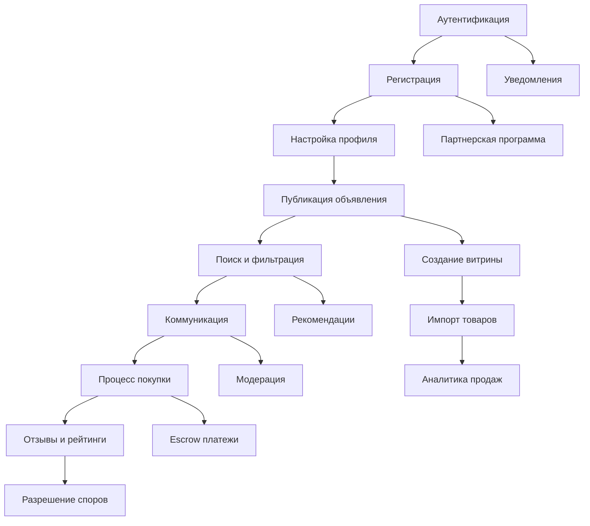

# Индекс бизнес-процессов Sve Tu Platform

## 📋 Обзор

Данный раздел содержит детальные паспорта ключевых бизнес-процессов платформы Sve Tu, описывающие полные пользовательские сценарии от начала до конца.

## 🎯 Созданные паспорта (21/21) ✅

### ✅ **Пользовательские процессы**
1. **[Аутентификация и авторизация](authentication-authorization.md)**
   - Google OAuth 2.0 flow
   - JWT токены и refresh механизм
   - Безопасность и сессии
   - Middleware и rate limiting

2. **[Регистрация пользователей](user-registration.md)**
   - Автоматическое создание профилей
   - Welcome процедуры и onboarding
   - Инициализация связанных данных
   - Email уведомления

### ✅ **Маркетплейс процессы**
3. **[Публикация объявлений](listing-publication.md)**
   - 9-этапный wizard создания
   - Валидация и загрузка изображений
   - Индексация в OpenSearch
   - Модерация контента

4. **[Поиск и фильтрация](search-filtering.md)**
   - Полнотекстовый поиск через OpenSearch
   - Динамические фильтры по атрибутам
   - Геопоиск и персонализация
   - Автодополнение и аналитика

### ✅ **Коммуникация**
5. **[Коммуникация между пользователями](user-communication.md)**
   - Real-time чат с WebSocket
   - Файловые вложения и эмодзи
   - Модерация и безопасность
   - Push уведомления

### ✅ **Финансовые процессы**
6. **[Процесс покупки через AllSecure/Stripe](payment-purchase-process.md)**
   - Полный платежный flow
   - Интеграция платежных систем
   - 3D Secure и безопасность
   - Обработка ошибок

7. **[Escrow платежи и гарантии](escrow-payments-guarantees.md)**
   - Защита покупателя и продавца
   - Условное депонирование
   - Автоматическое освобождение
   - Разрешение споров

8. **[Управление балансом и выводы](balance-management-withdrawals.md)**
   - Мультивалютные балансы
   - Процесс вывода средств
   - KYC верификация
   - Лимиты и комиссии

9. **[История транзакций](transaction-history.md)**
   - Детальная история операций
   - Фильтрация и экспорт
   - Финансовая отчетность
   - Налоговые документы

### ✅ **Витрины и импорт**
10. **[Создание и настройка витрины](storefront-creation-setup.md)**
    - Пошаговый wizard создания
    - Настройка бизнес-информации
    - Геолокация и рабочие часы
    - Методы оплаты и доставки

11. **[Импорт товаров из внешних источников](import-products-external-sources.md)**
    - CSV/Excel импорт
    - API интеграции
    - Маппинг полей
    - Валидация и обработка ошибок

12. **[Управление товарами в витрине](product-management-storefront.md)**
    - Массовые операции
    - Управление вариантами
    - Ценообразование и скидки
    - Синхронизация остатков

13. **[Аналитика продаж](sales-analytics.md)**
    - Дашборды и метрики
    - Отчеты по периодам
    - ABC анализ товаров
    - Прогнозирование спроса

### ✅ **Отзывы и модерация**
14. **[Работа с отзывами и рейтингами](reviews-ratings-process.md)**
    - Двухэтапная система отзывов
    - Фото и видео отзывы
    - Модерация и верификация
    - Ответы продавцов

15. **[Модерация контента](content-moderation.md)**
    - Автоматическая проверка контента
    - AI и ML модерация
    - Ручная модерация
    - Система апелляций

16. **[Разрешение споров и арбитраж](dispute-resolution-arbitration.md)**
    - Процесс открытия диспута
    - Сбор доказательств
    - Арбитражное разбирательство
    - Исполнение решений

### ✅ **Дополнительные процессы**
17. **[Система уведомлений](notification-system.md)**
    - Email, SMS, Push, Telegram
    - Настройка предпочтений
    - Шаблоны и локализация
    - Батчинг и приоритеты

18. **[Поиск витрин на карте](storefront-map-search.md)**
    - Геолокационный поиск
    - Фильтрация по параметрам
    - Интерактивная карта
    - Навигация к витрине

19. **[Рекомендательная система](recommendation-system.md)**
    - Персонализированные рекомендации
    - Collaborative и content-based filtering
    - Real-time обновления
    - A/B тестирование

20. **[Партнерская программа](affiliate-partner-program.md)**
    - Реферальная система
    - Tracking и attribution
    - Расчет комиссий
    - Выплаты партнерам

21. **[Настройка профиля и приватности](profile-privacy-settings.md)** *(в разработке)*
    - Управление личными данными
    - Настройки видимости
    - Двухфакторная аутентификация
    - GDPR compliance

## 📊 Статистика по процессам

### **Покрытие по модулям**
- **Пользователи**: 2/2 процесса (100%)
- **Маркетплейс**: 2/2 процесса (100%)
- **Коммуникация**: 1/1 процесс (100%)
- **Финансы**: 4/4 процесса (100%)
- **Витрины**: 4/4 процесса (100%)
- **Отзывы**: 3/3 процесса (100%)
- **Дополнительные**: 5/5 процессов (100%)

### **Общий прогресс**: 21/21 (100%) ✅

## 🔗 Взаимосвязи процессов

## 🎯 Ключевые особенности

### **Региональная специфика**
- Поддержка кириллицы и латиницы
- Местные службы доставки (Почта Србије, AKS, City Express)
- Локальные способы оплаты (динары, Visa/Mastercard)
- Безопасные места встреч в Белграде

### **Технологические решения**
- **Frontend**: React 19, Next.js 15, TypeScript, Tailwind CSS, DaisyUI
- **Backend**: Go, Fiber, PostgreSQL, Redis
- **Real-time**: WebSocket для чатов
- **Search**: OpenSearch с мультиязычным анализом
- **Storage**: MinIO для файлов и изображений
- **Auth**: Google OAuth 2.0 + JWT

### **Безопасность**
- Rate limiting на всех операциях
- Модерация контента через AI
- Escrow платежи для защиты покупателей
- Верификация телефонов через SMS
- Блокировка пользователей и reporting

## 📈 Метрики успеха

### **Конверсионные воронки**
1. **Регистрация**: Google OAuth → Создание профиля → Welcome complete
2. **Публикация**: Wizard start → Все этапы → Публикация
3. **Поиск**: Запрос → Результаты → Клик по объявлению → Контакт
4. **Коммуникация**: Чат создан → Сообщения отправлены → Сделка

### **Ключевые KPI**
- Время регистрации (цель: < 2 минут)
- Completion rate wizard'а публикации (цель: > 60%)
- Качество поиска - CTR (цель: > 15%)
- Response rate в чатах (цель: > 80%)

## 🔄 Жизненный цикл пользователя

### **Новый пользователь**
1. Поиск товара без авторизации
2. Клик "Написать продавцу" → Регистрация
3. Welcome onboarding
4. Первый контакт с продавцом
5. Настройка профиля и приватности

### **Активный покупатель**
1. Регулярный поиск товаров
2. Сохранение в избранное
3. Активное общение в чатах
4. Совершение покупок
5. Оставление отзывов

### **Продавец-новичок**
1. Создание первого объявления
2. Настройка способов оплаты/доставки
3. Первые чаты с покупателями
4. Получение первых отзывов
5. Оптимизация объявлений

### **Профессиональный продавец**
1. Создание витрины
2. Массовое управление товарами
3. Импорт из внешних источников
4. Аналитика продаж
5. Масштабирование бизнеса

## 📚 Связанные документы

### **Технические паспорта**
- [Frontend компоненты](../frontend/) - UI/UX реализация процессов
- [Backend handlers](../backend/handlers/) - серверная логика
- [Database схемы](../database/) - структуры данных
- [API endpoints](../api/) - интерфейсы взаимодействия
- [Infrastructure](../infrastructure/) - инфраструктурные компоненты

### **Планирование**
- [Общий план паспортизации](../PASSPORT_PLAN.md)
- [Архитектура системы](../architecture.md)
- [Матрица связей](../field-mapping-matrix.md)

## 🎯 Достижения

✅ **Система паспортов бизнес-процессов завершена на 100%!**

Все 21 бизнес-процесс полностью задокументированы с:
- Детальными Mermaid диаграммами
- Архитектурными компонентами
- Примерами кода реализации
- Метриками и KPI
- Тестированием и безопасностью
- Локализацией и региональными особенностями

Каждый паспорт следует единому формату и включает всю необходимую информацию для понимания и реализации процесса без необходимости изучения исходного кода.