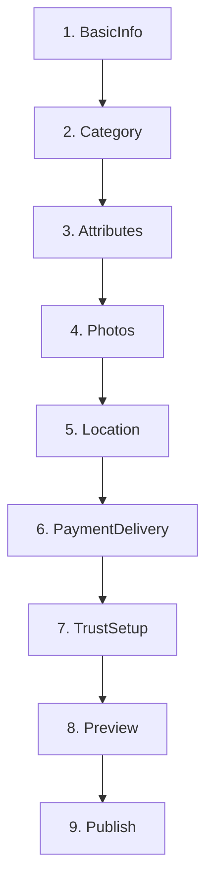

# Паспорт бизнес-процесса: Публикация объявлений

## 🎯 Назначение процесса

Пошаговое создание и публикация объявлений о продаже товаров на платформе Sve Tu через многоэтапный wizard с валидацией данных, загрузкой изображений, настройкой способов оплаты и автоматической индексацией в OpenSearch.

## 🔄 Схема процесса

### 1. **Инициация создания объявления**
```mermaid
graph LR
    A[Авторизованный пользователь] --> B[Клик "Создать объявление"]
    B --> C[Проверка лимитов пользователя]
    C --> D[Запуск Create Listing Wizard]
    D --> E[Сохранение в drafts]
```

### 2. **Пошаговый wizard (9 этапов)**


### 3. **Публикация и индексация**


## 🏗️ Архитектурные компоненты

### **Frontend компоненты (Create Listing)**
- **StepWizard** - главный координатор wizard'а
- **BasicInfoStep** - название, описание, цена
- **CategorySelectionStep** - выбор категории с API
- **AttributesStep** - динамические атрибуты категории
- **PhotosStep** - загрузка фотографий drag&drop
- **LocationStep** - геолокация и места встреч
- **PaymentDeliveryStep** - способы оплаты и доставки
- **TrustSetupStep** - верификация телефона
- **PreviewPublishStep** - предпросмотр и публикация

### **Backend endpoints**
- `POST /marketplace/listings` - создание объявления
- `PUT /marketplace/listings/{id}` - обновление draft
- `POST /marketplace/listings/{id}/publish` - публикация
- `POST /marketplace/listings/{id}/images` - загрузка изображений
- `GET /marketplace/categories` - категории с атрибутами

### **База данных**
- `marketplace_listings` - основные данные объявления
- `marketplace_images` - изображения объявления
- `listing_attribute_values` - значения динамических атрибутов
- `marketplace_categories` - категории и подкатегории
- `category_attributes` - атрибуты для каждой категории

### **Внешние сервисы**
- **MinIO** - хранение изображений
- **OpenSearch** - полнотекстовая индексация
- **Email Service** - уведомления о публикации
- **SMS Service** - верификация телефона

## 📋 Детальный flow процесса

### **Этап 1: Инициация (BasicInfoStep)**
```typescript
interface BasicInfoData {
  title: string;           // max 100 символов
  description: string;     // max 2000 символов
  price: number;          // > 0
  currency: 'RSD' | 'EUR'; // по умолчанию RSD
  condition: 'new' | 'used' | 'damaged';
  availability: 'available' | 'sold' | 'reserved';
}

// Валидация в реальном времени
const validateTitle = (title: string) => {
  if (title.length < 5) return "Минимум 5 символов";
  if (title.length > 100) return "Максимум 100 символов";
  if (containsOffensiveWords(title)) return "Недопустимые слова";
  return null;
};
```

### **Этап 2: Выбор категории (CategorySelectionStep)**
1. **Загрузка иерархии категорий**:
   ```typescript
   const categories = await api.get('/marketplace/categories');
   // Возвращает дерево: Electronics > Smartphones > Android
   ```

2. **Выбор подкатегории**:
   ```typescript
   interface Category {
     id: number;
     name: string;
     parent_id?: number;
     attributes: CategoryAttribute[];
     children: Category[];
   }
   ```

3. **Загрузка атрибутов выбранной категории**:
   ```sql
   SELECT ca.*, cg.name as group_name 
   FROM category_attributes ca
   JOIN attribute_groups cg ON ca.group_id = cg.id  
   WHERE ca.category_id = ?
   ORDER BY cg.sort_order, ca.sort_order;
   ```

### **Этап 3: Атрибуты (AttributesStep)**
Динамическое отображение полей на основе выбранной категории:

```typescript
interface CategoryAttribute {
  id: number;
  name: string;
  type: 'text' | 'number' | 'select' | 'multiselect' | 'boolean' | 'date';
  required: boolean;
  options?: string[]; // для select/multiselect
  validation_rules?: {
    min?: number;
    max?: number;
    pattern?: string;
  };
}

// Примеры атрибутов для смартфонов:
// - Бренд (select): Apple, Samsung, Xiaomi...
// - Объем памяти (select): 64GB, 128GB, 256GB...
// - Состояние экрана (select): Идеальное, Царапины, Трещины
// - Наличие зарядки (boolean)
```

### **Этап 4: Фотографии (PhotosStep)**
1. **Drag & Drop загрузка**:
   ```typescript
   const handleFileUpload = async (files: FileList) => {
     const validFiles = validateImages(files); // max 10 фото, 5MB каждое
     
     for (const file of validFiles) {
       const compressed = await compressImage(file, { quality: 0.8 });
       const uploadResult = await uploadToMinIO(compressed);
       setPhotos(prev => [...prev, uploadResult]);
     }
   };
   ```

2. **Предварительный просмотр и сортировка**:
   ```typescript
   // Drag & drop для изменения порядка фотографий
   const reorderPhotos = (startIndex: number, endIndex: number) => {
     const result = Array.from(photos);
     const [removed] = result.splice(startIndex, 1);
     result.splice(endIndex, 0, removed);
     setPhotos(result);
   };
   ```

3. **Загрузка в MinIO**:
   ```go
   func UploadListingImage(file multipart.File, listingID int) (*ImageData, error) {
       // Генерация уникального имени
       filename := fmt.Sprintf("listings/%d/%s_%s", 
           listingID, uuid.New().String(), originalName)
       
       // Создание thumbnails
       thumbnails := []string{
           createThumbnail(file, "150x150"),   // grid view
           createThumbnail(file, "300x300"),   // card view
           createThumbnail(file, "800x600"),   // modal view
       }
       
       return &ImageData{
           OriginalURL: minioURL + filename,
           Thumbnails: thumbnails,
           Order: order,
       }, nil
   }
   ```

### **Этап 5: Локация (LocationStep)**
1. **Автоопределение геолокации**:
   ```typescript
   const getCurrentLocation = () => {
     navigator.geolocation.getCurrentPosition(
       (position) => {
         setLocation({
           lat: position.coords.latitude,
           lng: position.coords.longitude,
         });
         reverseGeocode(position.coords); // получение адреса
       },
       (error) => showLocationPermissionModal(),
     );
   };
   ```

2. **Выбор безопасных мест встреч**:
   ```typescript
   interface MeetingPlace {
     id: number;
     name: string;
     address: string;
     type: 'shopping_mall' | 'public_transport' | 'bank' | 'custom';
     coordinates: {lat: number, lng: number};
     isPublic: boolean;
     safetyRating: number; // 1-5
   }
   
   // Предустановленные безопасные места в Белграде
   const safePlaces = [
     'Ušće Shopping Center',
     'Delta City',
     'Glavna pošta',
     'Studentski park',
   ];
   ```

### **Этап 6: Оплата и доставка (PaymentDeliveryStep)**
1. **Способы оплаты**:
   ```typescript
   interface PaymentMethods {
     cash: boolean;                    // наличные при встрече
     bankTransfer: boolean;            // банковский перевод
     allsecure: boolean;              // AllSecure escrow
     stripe: boolean;                 // Stripe (карты)
   }
   
   // Рекомендации по безопасности
   const paymentRecommendations = {
     lowValue: ['cash', 'bankTransfer'],     // < 5000 RSD
     mediumValue: ['allsecure', 'stripe'],   // 5000-50000 RSD  
     highValue: ['allsecure'],               // > 50000 RSD
   };
   ```

2. **Способы доставки**:
   ```typescript
   interface DeliveryOptions {
     pickup: boolean;                 // самовывоз
     delivery: boolean;               // доставка продавцом
     postal: boolean;                 // Почта Србије
     courier: {                       // курьерские службы
       cityExpress: boolean;
       aks: boolean;
       postExpress: boolean;
     };
   }
   ```

### **Этап 7: Настройка доверия (TrustSetupStep)**
1. **Верификация телефона**:
   ```typescript
   const verifyPhone = async (phoneNumber: string) => {
     const smsCode = await sendSMSVerification(phoneNumber);
     
     // Ожидание ввода кода
     const userCode = await promptForSMSCode();
     
     if (userCode === smsCode) {
       setPhoneVerified(true);
       updateUserTrustScore(+10); // бонус к доверию
     }
   };
   ```

2. **Дополнительные настройки доверия**:
   ```typescript
   interface TrustSettings {
     showPhoneToAll: boolean;         // показывать телефон всем
     requirePhoneVerification: boolean; // покупатель должен верифицировать телефон
     allowDirectMessages: boolean;     // разрешить прямые сообщения
     autoReplyEnabled: boolean;       // автоответы при отсутствии
   }
   ```

### **Этап 8: Предпросмотр (PreviewPublishStep)**
1. **Финальный предпросмотр**:
   ```typescript
   // Отображение объявления так, как его увидят покупатели
   const PreviewCard = () => (
     <div className="listing-preview">
       <ImageGallery images={listing.images} />
       <h2>{listing.title}</h2>
       <p className="price">{listing.price} {listing.currency}</p>
       <p className="description">{listing.description}</p>
       <AttributesList attributes={listing.attributes} />
       <LocationMap coordinates={listing.location} />
       <PaymentMethods methods={listing.paymentMethods} />
     </div>
   );
   ```

2. **Проверка обязательных полей**:
   ```typescript
   const validateListing = (listing: ListingData) => {
     const errors: string[] = [];
     
     if (!listing.title) errors.push("Название обязательно");
     if (!listing.price || listing.price <= 0) errors.push("Цена должна быть больше 0");
     if (!listing.category_id) errors.push("Выберите категорию");
     if (listing.images.length === 0) errors.push("Добавьте хотя бы одно фото");
     
     return errors;
   };
   ```

### **Этап 9: Публикация**
1. **Сохранение в PostgreSQL**:
   ```go
   func CreateListing(listing *models.Listing) error {
       tx, err := db.Begin()
       if err != nil {
           return err
       }
       defer tx.Rollback()
       
       // 1. Создание основной записи
       listingID, err := insertListing(tx, listing)
       
       // 2. Сохранение атрибутов
       err = insertListingAttributes(tx, listingID, listing.Attributes)
       
       // 3. Связывание изображений
       err = linkListingImages(tx, listingID, listing.ImageIDs)
       
       return tx.Commit()
   }
   ```

2. **Индексация в OpenSearch**:
   ```go
   func IndexListing(listing *models.Listing) error {
       doc := map[string]interface{}{
           "id":          listing.ID,
           "title":       listing.Title,
           "description": listing.Description,
           "price":       listing.Price,
           "category_id": listing.CategoryID,
           "user_id":     listing.UserID,
           "location": map[string]float64{
               "lat": listing.Latitude,
               "lon": listing.Longitude,
           },
           "attributes": listing.Attributes,
           "created_at": listing.CreatedAt,
           "updated_at": time.Now(),
       }
       
       return opensearchClient.Index("marketplace", listing.ID, doc)
   }
   ```

3. **Уведомления**:
   ```go
   // Email уведомление об успешной публикации
   emailData := &EmailData{
       Subject: "Ваше объявление опубликовано!",
       Template: "listing_published.html",
       Data: map[string]interface{}{
           "ListingTitle": listing.Title,
           "ListingURL":   buildListingURL(listing.ID),
           "ViewStats":    "Вы можете отслеживать статистику просмотров",
       },
   }
   
   // Push уведомление подписчикам категории
   subscribers := getSubscribersForCategory(listing.CategoryID)
   for _, subscriber := range subscribers {
       sendPushNotification(subscriber, "Новое объявление в категории " + listing.Category.Name)
   }
   ```

## 🔐 Валидация и безопасность

### **Валидация контента**
```go
// Проверка на спам и запрещенный контент
func ValidateListingContent(listing *models.Listing) error {
    // 1. Проверка на запрещенные слова
    if containsBannedWords(listing.Title + " " + listing.Description) {
        return errors.New("content contains banned words")
    }
    
    // 2. Проверка на дублирование
    similar := findSimilarListings(listing.Title, listing.UserID)
    if len(similar) > 0 {
        return errors.New("similar listing already exists")
    }
    
    // 3. Проверка лимитов пользователя
    userListings := getUserActiveListings(listing.UserID)
    if len(userListings) >= getUserLimit(listing.UserID) {
        return errors.New("user listing limit exceeded")
    }
    
    return nil
}
```

### **Rate limiting**
```go
// Лимиты на создание объявлений
const (
    MaxListingsPerDay = 10
    MaxListingsPerHour = 3
    MaxListingsPerUser = 100 // активных одновременно
)

func CheckRateLimit(userID int) error {
    today := time.Now().Truncate(24 * time.Hour)
    todayCount := getListingsCreatedSince(userID, today)
    
    if todayCount >= MaxListingsPerDay {
        return errors.New("daily listing limit exceeded")
    }
    
    return nil
}
```

### **Защита изображений**
```go
func ValidateImage(file multipart.File) error {
    // 1. Проверка типа файла
    allowedTypes := []string{"image/jpeg", "image/png", "image/webp"}
    if !contains(allowedTypes, file.Header.Get("Content-Type")) {
        return errors.New("unsupported file type")
    }
    
    // 2. Проверка размера
    if file.Size > 5*1024*1024 { // 5MB
        return errors.New("file too large")
    }
    
    // 3. Сканирование на вирусы (в production)
    if containsMalware(file) {
        return errors.New("file contains malware")
    }
    
    return nil
}
```

## 📊 Аналитика и метрики

### **Воронка конверсии**
```sql
-- Метрики по этапам wizard'а
SELECT 
    step_name,
    COUNT(*) as started,
    COUNT(CASE WHEN completed = true THEN 1 END) as completed,
    ROUND(COUNT(CASE WHEN completed = true THEN 1 END) * 100.0 / COUNT(*), 2) as conversion_rate
FROM listing_creation_steps 
WHERE created_at >= CURRENT_DATE - INTERVAL '30 days'
GROUP BY step_name
ORDER BY step_order;

-- Результат:
-- BasicInfo: 1000 started, 900 completed (90%)
-- Category: 900 started, 850 completed (94.4%) 
-- Attributes: 850 started, 800 completed (94.1%)
-- Photos: 800 started, 650 completed (81.25%) <- bottleneck
-- Location: 650 started, 620 completed (95.4%)
-- Payment: 620 started, 600 completed (96.8%)
-- Trust: 600 started, 580 completed (96.7%)
-- Preview: 580 started, 570 completed (98.3%)
-- Publish: 570 started, 550 completed (96.5%)
```

### **A/B тестирование**
```typescript
// Тестирование разных версий wizard'а
const WizardVariants = {
  'linear': LinearWizard,      // все этапы по порядку
  'smart': SmartWizard,        // пропуск неочевидных этапов
  'simplified': SimpleWizard,   // минимум обязательных полей
};

const variant = getABTestVariant(user.id);
const WizardComponent = WizardVariants[variant];
```

### **Качество объявлений**
```go
// Scoring качества объявления
func CalculateListingQuality(listing *models.Listing) int {
    score := 0
    
    // Базовые поля (40 очков)
    if len(listing.Title) >= 10 { score += 10 }
    if len(listing.Description) >= 50 { score += 15 }
    if listing.Price > 0 { score += 15 }
    
    // Изображения (30 очков)
    imageCount := len(listing.Images)
    score += min(imageCount * 6, 30)
    
    // Атрибуты (20 очков)
    filledAttributes := countFilledAttributes(listing.Attributes)
    score += min(filledAttributes * 4, 20)
    
    // Дополнительные бонусы (10 очков)
    if listing.PhoneVerified { score += 5 }
    if len(listing.PaymentMethods) > 1 { score += 3 }
    if listing.DeliveryOptions.Delivery { score += 2 }
    
    return min(score, 100)
}
```

## 🌐 Интеграции

### **MinIO для изображений**
```typescript
// Frontend загрузка с прогресс-баром
const uploadImage = async (file: File) => {
  const formData = new FormData();
  formData.append('image', file);
  formData.append('listing_id', listingId);
  
  return await fetch('/api/v1/marketplace/images', {
    method: 'POST',
    body: formData,
    onUploadProgress: (event) => {
      const progress = (event.loaded / event.total) * 100;
      setUploadProgress(progress);
    },
  });
};
```

### **OpenSearch индексация**
```json
{
  "mappings": {
    "properties": {
      "title": {
        "type": "text",
        "analyzer": "serbian_analyzer",
        "fields": {
          "keyword": {"type": "keyword"},
          "suggest": {"type": "completion"}
        }
      },
      "description": {
        "type": "text", 
        "analyzer": "serbian_analyzer"
      },
      "price": {"type": "double"},
      "location": {"type": "geo_point"},
      "category_path": {"type": "keyword"},
      "attributes": {
        "type": "nested",
        "properties": {
          "name": {"type": "keyword"},
          "value": {"type": "keyword"}
        }
      },
      "created_at": {"type": "date"}
    }
  }
}
```

### **Telegram бот уведомления**
```go
// Отправка уведомления в Telegram каналы
func NotifyTelegramChannels(listing *models.Listing) {
    channels := getTelegramChannelsForCategory(listing.CategoryID)
    
    message := fmt.Sprintf(`
🆕 Ново објављено: %s
💰 Цена: %v %s
📍 Локација: %s
🔗 Линк: %s
    `, listing.Title, listing.Price, listing.Currency, 
       listing.Location, buildListingURL(listing.ID))
    
    for _, channel := range channels {
        sendTelegramMessage(channel, message)
    }
}
```

## ❌ Обработка ошибок

### **Типичные ошибки**
1. **Validation errors**:
   ```json
   {
     "success": false,
     "error": "validation.failed",
     "details": {
       "title": ["Минимум 5 символов"],
       "price": ["Цена должна быть больше 0"],
       "images": ["Необходимо хотя бы одно изображение"]
     }
   }
   ```

2. **Upload errors**:
   ```json
   {
     "success": false,
     "error": "upload.failed", 
     "message": "Файл слишком большой (максимум 5MB)"
   }
   ```

3. **Rate limit errors**:
   ```json
   {
     "success": false,
     "error": "rate.limit.exceeded",
     "message": "Превышен лимит объявлений на сегодня (10)",
     "retry_after": "2024-06-30T00:00:00Z"
   }
   ```

### **Откат операций**
```go
func CreateListingWithRollback(listing *models.Listing) error {
    tx, err := db.Begin()
    if err != nil {
        return err
    }
    defer tx.Rollback()
    
    // Сохранение в БД
    listingID, err := insertListingInTx(tx, listing)
    if err != nil {
        return err
    }
    
    // Загрузка изображений в MinIO
    uploadedImages := []string{}
    for _, image := range listing.Images {
        url, err := uploadImageToMinIO(image)
        if err != nil {
            // Удаляем уже загруженные изображения
            cleanupImages(uploadedImages)
            return err
        }
        uploadedImages = append(uploadedImages, url)
    }
    
    // Индексация в OpenSearch
    err = indexListingInOpenSearch(listing)
    if err != nil {
        cleanupImages(uploadedImages)
        return err
    }
    
    return tx.Commit()
}
```

## 🧪 Тестирование

### **Unit тесты**
```go
func TestCreateListing(t *testing.T) {
    listing := &models.Listing{
        Title:       "Test iPhone 12",
        Description: "Excellent condition iPhone 12",
        Price:       45000,
        Currency:    "RSD",
        CategoryID:  5, // Smartphones
        UserID:      1,
    }
    
    result, err := createListing(listing)
    assert.NoError(t, err)
    assert.NotZero(t, result.ID)
    assert.Equal(t, "draft", result.Status)
}
```

### **Integration тесты**
- Полный wizard flow от начала до публикации
- Загрузка и сжатие изображений
- Индексация в OpenSearch
- Email уведомления

### **E2E тесты**
```typescript
// Playwright тест полного процесса
test('Create listing end-to-end', async ({ page }) => {
  await page.goto('/create-listing');
  
  // Step 1: Basic Info
  await page.fill('[data-testid="title"]', 'Test Product');
  await page.fill('[data-testid="description"]', 'Product description');
  await page.fill('[data-testid="price"]', '1000');
  await page.click('[data-testid="next-step"]');
  
  // Step 2: Category
  await page.click('[data-testid="category-electronics"]');
  await page.click('[data-testid="subcategory-phones"]');
  await page.click('[data-testid="next-step"]');
  
  // ... остальные шаги
  
  // Final step: Publish
  await page.click('[data-testid="publish-listing"]');
  await expect(page).toHaveURL(/\/listing\/\d+/);
});
```

## 🚀 Производительность

### **Оптимизации frontend**
```typescript
// Lazy loading компонентов wizard'а
const BasicInfoStep = lazy(() => import('./steps/BasicInfoStep'));
const CategoryStep = lazy(() => import('./steps/CategoryStep'));
const PhotosStep = lazy(() => import('./steps/PhotosStep'));

// Debounced валидация
const debouncedValidation = useMemo(
  () => debounce(validateField, 500),
  []
);

// Optimistic updates для draft сохранения
const saveDraft = async (data: Partial<ListingData>) => {
  // Сразу обновляем UI
  setListing(prev => ({ ...prev, ...data }));
  
  // Сохраняем в фоне
  try {
    await api.put(`/listings/${listingId}/draft`, data);
  } catch (error) {
    // Откатываем изменения при ошибке
    setListing(prev => ({ ...prev, ...prevData }));
  }
};
```

### **Backend оптимизации**
```go
// Batch операции для атрибутов
func InsertListingAttributes(tx *sql.Tx, listingID int, attributes []Attribute) error {
    stmt := `INSERT INTO listing_attribute_values 
             (listing_id, attribute_id, value) VALUES `
    
    values := []interface{}{}
    placeholders := []string{}
    
    for _, attr := range attributes {
        placeholders = append(placeholders, "(?, ?, ?)")
        values = append(values, listingID, attr.ID, attr.Value)
    }
    
    query := stmt + strings.Join(placeholders, ",")
    _, err := tx.Exec(query, values...)
    return err
}
```

### **Кеширование**
```go
// Кеш категорий с атрибутами
var categoryCache = sync.Map{}

func GetCategoryWithAttributes(categoryID int) (*Category, error) {
    if cached, ok := categoryCache.Load(categoryID); ok {
        return cached.(*Category), nil
    }
    
    category, err := db.GetCategoryWithAttributes(categoryID)
    if err != nil {
        return nil, err
    }
    
    categoryCache.Store(categoryID, category)
    return category, nil
}
```

## 📚 Связанные процессы

1. **Аутентификация и авторизация** - проверка прав на создание объявлений
2. **Поиск и фильтрация** - индексация созданных объявлений
3. **Коммуникация между пользователями** - создание чатов при интересе
4. **Управление изображениями** - загрузка и обработка фотографий
5. **Модерация контента** - проверка объявлений на соответствие правилам
6. **Уведомления** - информирование заинтересованных пользователей
7. **Аналитика** - трекинг эффективности объявлений

## 📖 Документация

### **API Reference**
- `POST /marketplace/listings` - создание draft объявления
- `PUT /marketplace/listings/{id}` - обновление draft
- `POST /marketplace/listings/{id}/publish` - публикация
- `POST /marketplace/listings/{id}/images` - загрузка изображений

### **Frontend компоненты**
- `StepWizard.md` - главный координатор
- `BasicInfoStep.md` - основная информация
- `PhotosStep.md` - загрузка изображений
- `PreviewPublishStep.md` - финальная публикация

### **Database схемы**
- `marketplace_listings.md` - структура объявлений
- `marketplace_images.md` - связь с изображениями
- `listing_attribute_values.md` - динамические атрибуты