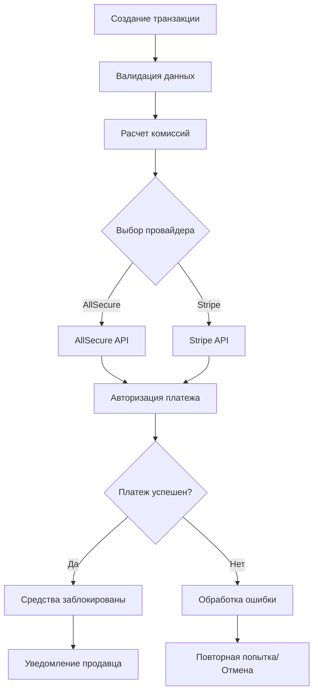
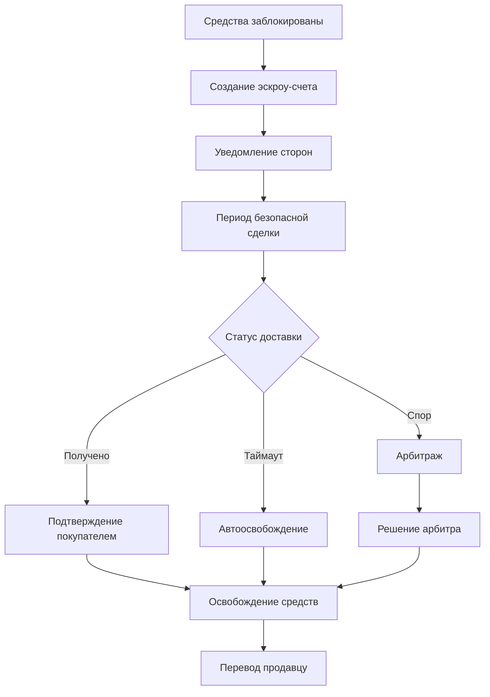
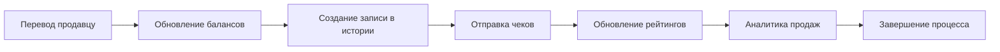

# Паспорт бизнес-процесса: Процесс покупки через AllSecure/Stripe

## 🎯 Назначение процесса

Обеспечение безопасного и надежного процесса покупки товаров на платформе Sve Tu через интеграцию с платежными системами AllSecure и Stripe с поддержкой эскроу-механизмов, защиты покупателей и автоматического разрешения споров.

## 🔄 Схема процесса

### 1. **Инициация покупки**
```mermaid
graph LR
    A[Покупатель выбирает товар] --> B[Клик "Купить"]
    B --> C[Выбор способа оплаты]
    C --> D[AllSecure/Stripe Widget]
    D --> E[Ввод платежных данных]
    E --> F[Подтверждение покупки]
    F --> G[Создание транзакции]
```

### 2. **Обработка платежа**


### 3. **Эскроу процесс**


### 4. **Завершение сделки**


## 🏗️ Архитектурные компоненты

### **Frontend компоненты**
- **PaymentMethodSelector** - выбор способа оплаты (AllSecure/Stripe/Balance)
- **PaymentProcessing** - индикатор обработки платежа с real-time статусом
- **EscrowStatus** - отображение статуса эскроу-счета
- **PurchaseConfirmation** - подтверждение покупки с деталями
- **PaymentErrorHandler** - обработка и отображение ошибок платежей

### **Backend сервисы**
- **PaymentService** - координация платежного процесса
- **AllSecureService** - интеграция с AllSecure API
- **StripeService** - интеграция с Stripe API
- **EscrowService** - управление эскроу-счетами
- **CommissionCalculator** - расчет комиссий платформы
- **WebhookHandler** - обработка webhook'ов от провайдеров

### **Базы данных**
- **payments** - основная таблица платежей
- **escrow_transactions** - эскроу-счета и их статусы
- **payment_attempts** - попытки платежей и ошибки
- **commission_calculations** - детали расчета комиссий
- **webhook_logs** - логи webhook'ов

## 🔗 Интеграции

### **AllSecure Integration**
```go
// Создание платежа через AllSecure
type CreatePaymentRequest struct {
    UserID      int             `json:"user_id"`
    ListingID   int             `json:"listing_id"`
    Amount      decimal.Decimal `json:"amount"`
    Currency    string          `json:"currency"`
    Description string          `json:"description"`
    ReturnURL   string          `json:"return_url"`
}

func (s *AllSecureService) CreatePayment(ctx context.Context, req CreatePaymentRequest) (*PaymentResult, error) {
    // 1. Валидация запроса
    if err := s.validatePaymentRequest(ctx, req); err != nil {
        return nil, fmt.Errorf("validation failed: %w", err)
    }

    // 2. Расчет комиссий
    commission := s.calculateCommission(req.Amount)
    totalAmount := req.Amount.Add(commission)

    // 3. Создание транзакции в базе
    transaction, err := s.repository.CreateTransaction(ctx, models.PaymentTransaction{
        UserID:          req.UserID,
        ListingID:       req.ListingID,
        Amount:          req.Amount,
        Commission:      commission,
        TotalAmount:     totalAmount,
        Currency:        req.Currency,
        Status:          "pending",
        Provider:        "allsecure",
    })
    if err != nil {
        return nil, fmt.Errorf("failed to create transaction: %w", err)
    }

    // 4. Вызов AllSecure API
    result, err := s.client.CreatePayment(allsecure.CreatePaymentRequest{
        Amount:      totalAmount,
        Currency:    req.Currency,
        Reference:   fmt.Sprintf("marketplace-%d", transaction.ID),
        Description: req.Description,
        ReturnURL:   req.ReturnURL,
        WebhookURL:  s.config.WebhookURL,
        Customer: allsecure.Customer{
            ID:    strconv.Itoa(req.UserID),
            Email: transaction.User.Email,
        },
    })
    if err != nil {
        s.repository.UpdateTransactionStatus(ctx, transaction.ID, "failed")
        return nil, fmt.Errorf("allsecure API error: %w", err)
    }

    // 5. Обновление транзакции
    err = s.repository.UpdateTransaction(ctx, transaction.ID, models.PaymentTransaction{
        GatewayUUID:  result.UUID,
        Status:       result.Status,
        RedirectURL:  result.RedirectURL,
    })
    if err != nil {
        s.logger.Error("Failed to update transaction", "error", err)
    }

    return &PaymentResult{
        TransactionID:  transaction.ID,
        GatewayUUID:    result.UUID,
        Status:         result.Status,
        RedirectURL:    result.RedirectURL,
        RequiresAction: result.RequiresAction,
    }, nil
}
```

### **Stripe Integration**
```go
// Создание платежа через Stripe
func (s *StripeService) CreatePaymentIntent(ctx context.Context, req CreatePaymentRequest) (*PaymentResult, error) {
    // Создание Stripe PaymentIntent
    params := &stripe.PaymentIntentParams{
        Amount:   stripe.Int64(req.Amount.Mul(decimal.NewFromInt(100)).IntPart()),
        Currency: stripe.String(strings.ToLower(req.Currency)),
        Metadata: map[string]string{
            "user_id":    strconv.Itoa(req.UserID),
            "listing_id": strconv.Itoa(req.ListingID),
            "platform":   "sve-tu-marketplace",
        },
        PaymentMethodTypes: stripe.StringSlice([]string{
            "card",
            "sepa_debit",
            "sofort",
        }),
        ConfirmationMethod: stripe.String("automatic"),
        ReturnURL:         stripe.String(req.ReturnURL),
    }

    intent, err := paymentintent.New(params)
    if err != nil {
        return nil, fmt.Errorf("stripe payment intent creation failed: %w", err)
    }

    // Сохранение в базу
    transaction, err := s.repository.CreateTransaction(ctx, models.PaymentTransaction{
        UserID:       req.UserID,
        ListingID:    req.ListingID,
        Amount:       req.Amount,
        Currency:     req.Currency,
        Status:       "pending",
        Provider:     "stripe",
        GatewayUUID:  intent.ID,
        ClientSecret: intent.ClientSecret,
    })

    return &PaymentResult{
        TransactionID:  transaction.ID,
        GatewayUUID:    intent.ID,
        ClientSecret:   intent.ClientSecret,
        Status:         string(intent.Status),
        RequiresAction: intent.Status == stripe.PaymentIntentStatusRequiresAction,
    }, nil
}
```

### **Frontend Payment Flow**
```typescript
// Hook для процесса покупки
export const usePurchaseFlow = () => {
  const [paymentState, setPaymentState] = useState<PaymentState>({
    step: 'selection',
    loading: false,
    error: null,
    transaction: null,
  });

  const initiatePurchase = async (listingId: number, paymentMethod: 'allsecure' | 'stripe' | 'balance') => {
    setPaymentState(prev => ({ ...prev, loading: true, error: null }));

    try {
      // 1. Создание платежа
      const response = await fetch('/api/v1/payments/create', {
        method: 'POST',
        headers: { 'Content-Type': 'application/json' },
        body: JSON.stringify({
          listing_id: listingId,
          payment_method: paymentMethod,
          return_url: `${window.location.origin}/payment/success`,
        }),
      });

      const result = await response.json();
      
      if (!result.success) {
        throw new Error(result.error || 'Payment creation failed');
      }

      setPaymentState(prev => ({ 
        ...prev, 
        transaction: result.data,
        step: 'processing',
        loading: false,
      }));

      // 2. Перенаправление на payment gateway
      if (result.data.redirect_url) {
        window.location.href = result.data.redirect_url;
      } else if (result.data.client_secret) {
        // Stripe Elements integration
        await handleStripePayment(result.data.client_secret);
      }

    } catch (error) {
      setPaymentState(prev => ({ 
        ...prev, 
        loading: false, 
        error: error.message,
        step: 'error',
      }));
    }
  };

  const handleStripePayment = async (clientSecret: string) => {
    const stripe = await getStripe();
    
    const { error, paymentIntent } = await stripe.confirmPayment({
      clientSecret,
      confirmParams: {
        return_url: `${window.location.origin}/payment/success`,
      },
    });

    if (error) {
      setPaymentState(prev => ({ 
        ...prev, 
        error: error.message,
        step: 'error',
      }));
    } else {
      setPaymentState(prev => ({ 
        ...prev, 
        step: 'success',
        transaction: { ...prev.transaction, status: paymentIntent.status },
      }));
    }
  };

  return {
    paymentState,
    initiatePurchase,
    resetPayment: () => setPaymentState({ step: 'selection', loading: false, error: null, transaction: null }),
  };
};
```

## 🔒 Безопасность и валидация

### **Валидация на уровне API**
```go
// Валидация платежного запроса
func (s *PaymentService) validatePaymentRequest(ctx context.Context, req CreatePaymentRequest) error {
    // 1. Проверка пользователя
    user, err := s.userRepo.GetByID(ctx, req.UserID)
    if err != nil {
        return errors.New("user.notFound")
    }
    
    if !user.IsActive || user.IsBanned {
        return errors.New("user.notEligible")
    }

    // 2. Проверка объявления
    listing, err := s.listingRepo.GetByID(ctx, req.ListingID)
    if err != nil {
        return errors.New("listing.notFound")
    }
    
    if listing.Status != "active" {
        return errors.New("listing.notAvailable")
    }
    
    if listing.UserID == req.UserID {
        return errors.New("payment.selfPurchase")
    }

    // 3. Проверка суммы
    if req.Amount.LessThanOrEqual(decimal.Zero) {
        return errors.New("payment.invalidAmount")
    }
    
    if !req.Amount.Equal(listing.Price) {
        return errors.New("payment.amountMismatch")
    }

    // 4. Проверка валюты
    allowedCurrencies := []string{"EUR", "USD", "RSD"}
    if !contains(allowedCurrencies, req.Currency) {
        return errors.New("payment.unsupportedCurrency")
    }

    // 5. Rate limiting
    attempts, err := s.repository.GetRecentPaymentAttempts(ctx, req.UserID, time.Hour)
    if err != nil {
        s.logger.Warn("Failed to check payment attempts", "error", err)
    }
    
    if attempts >= 10 {
        return errors.New("payment.tooManyAttempts")
    }

    return nil
}
```

### **PCI DSS Compliance**
```go
// Безопасное логирование (без чувствительных данных)
func (s *PaymentService) logPaymentAttempt(ctx context.Context, req CreatePaymentRequest, result *PaymentResult, err error) {
    logData := map[string]interface{}{
        "user_id":        req.UserID,
        "listing_id":     req.ListingID,
        "amount":         req.Amount.String(),
        "currency":       req.Currency,
        "transaction_id": nil,
        "success":        err == nil,
        "timestamp":      time.Now().UTC(),
    }
    
    if result != nil {
        logData["transaction_id"] = result.TransactionID
        logData["gateway_uuid"] = result.GatewayUUID[:8] + "..." // Частичное маскирование
    }
    
    if err != nil {
        logData["error_type"] = getErrorType(err)
        // НЕ логируем полный текст ошибки от gateway
    }
    
    s.logger.Info("Payment attempt", logData)
}
```

## 📊 Аналитика и метрики

### **KPI метрики**
```go
// Сбор метрик платежей
type PaymentMetrics struct {
    ConversionRate     float64 `json:"conversion_rate"`
    AverageAmount      decimal.Decimal `json:"average_amount"`
    SuccessRate        float64 `json:"success_rate"`
    EscrowReleaseTime  time.Duration `json:"average_escrow_release_time"`
    ChargebackRate     float64 `json:"chargeback_rate"`
    PopularProviders   map[string]int `json:"popular_providers"`
}

func (s *AnalyticsService) CalculatePaymentMetrics(ctx context.Context, period time.Duration) (*PaymentMetrics, error) {
    since := time.Now().Add(-period)
    
    // Получение данных за период
    totalAttempts, err := s.repository.CountPaymentAttempts(ctx, since)
    if err != nil {
        return nil, err
    }
    
    successfulPayments, err := s.repository.CountSuccessfulPayments(ctx, since)
    if err != nil {
        return nil, err
    }
    
    avgAmount, err := s.repository.GetAveragePaymentAmount(ctx, since)
    if err != nil {
        return nil, err
    }
    
    avgEscrowTime, err := s.repository.GetAverageEscrowReleaseTime(ctx, since)
    if err != nil {
        return nil, err
    }
    
    providerStats, err := s.repository.GetProviderStats(ctx, since)
    if err != nil {
        return nil, err
    }
    
    return &PaymentMetrics{
        ConversionRate:    float64(successfulPayments) / float64(totalAttempts) * 100,
        AverageAmount:     avgAmount,
        SuccessRate:       float64(successfulPayments) / float64(totalAttempts) * 100,
        EscrowReleaseTime: avgEscrowTime,
        PopularProviders:  providerStats,
    }, nil
}
```

### **Real-time мониторинг**
```typescript
// WebSocket для real-time обновлений статуса платежа
export const usePaymentStatusUpdates = (transactionId: number) => {
  const [status, setStatus] = useState<PaymentStatus>('pending');
  const { socket } = useWebSocket();

  useEffect(() => {
    if (!socket || !transactionId) return;

    // Подписка на обновления платежа
    socket.emit('subscribe_payment', { transaction_id: transactionId });

    const handleStatusUpdate = (data: { transaction_id: number; status: PaymentStatus; details?: any }) => {
      if (data.transaction_id === transactionId) {
        setStatus(data.status);
        
        // Уведомления пользователю
        if (data.status === 'completed') {
          toast.success('Платеж успешно завершен!');
        } else if (data.status === 'failed') {
          toast.error('Платеж не прошел. Попробуйте еще раз.');
        } else if (data.status === 'requires_action') {
          toast.info('Требуется дополнительная авторизация');
        }
      }
    };

    socket.on('payment_status_update', handleStatusUpdate);

    return () => {
      socket.off('payment_status_update', handleStatusUpdate);
      socket.emit('unsubscribe_payment', { transaction_id: transactionId });
    };
  }, [socket, transactionId]);

  return status;
};
```

## ⚠️ Обработка ошибок

### **Типы ошибок и их обработка**
```go
// Классификация ошибок платежей
type PaymentError struct {
    Code        string `json:"code"`
    Message     string `json:"message"`
    UserMessage string `json:"user_message"`
    Retryable   bool   `json:"retryable"`
    Action      string `json:"suggested_action"`
}

func (s *PaymentService) handlePaymentError(err error, provider string) *PaymentError {
    switch {
    case isNetworkError(err):
        return &PaymentError{
            Code:        "NETWORK_ERROR",
            Message:     err.Error(),
            UserMessage: "payment.networkError",
            Retryable:   true,
            Action:      "retry_after_delay",
        }
    
    case isInsufficientFundsError(err):
        return &PaymentError{
            Code:        "INSUFFICIENT_FUNDS",
            Message:     err.Error(),
            UserMessage: "payment.insufficientFunds",
            Retryable:   false,
            Action:      "change_payment_method",
        }
    
    case isCardDeclinedError(err):
        return &PaymentError{
            Code:        "CARD_DECLINED",
            Message:     err.Error(),
            UserMessage: "payment.cardDeclined",
            Retryable:   false,
            Action:      "contact_bank",
        }
    
    case is3DSRequiredError(err):
        return &PaymentError{
            Code:        "REQUIRES_3DS",
            Message:     err.Error(),
            UserMessage: "payment.requires3DS",
            Retryable:   true,
            Action:      "complete_3ds",
        }
    
    default:
        return &PaymentError{
            Code:        "UNKNOWN_ERROR",
            Message:     "Internal payment processing error",
            UserMessage: "payment.genericError",
            Retryable:   true,
            Action:      "retry_or_contact_support",
        }
    }
}
```

### **Webhook безопасность**
```go
// Валидация webhook'ов
func (h *WebhookHandler) validateWebhook(r *http.Request, provider string) error {
    switch provider {
    case "allsecure":
        return h.validateAllSecureWebhook(r)
    case "stripe":
        return h.validateStripeWebhook(r)
    default:
        return errors.New("unknown provider")
    }
}

func (h *WebhookHandler) validateAllSecureWebhook(r *http.Request) error {
    signature := r.Header.Get("X-AllSecure-Signature")
    if signature == "" {
        return errors.New("missing signature")
    }
    
    body, err := io.ReadAll(r.Body)
    if err != nil {
        return err
    }
    
    expectedSignature := h.calculateSignature(body, h.config.AllSecureWebhookSecret)
    if !hmac.Equal([]byte(signature), []byte(expectedSignature)) {
        return errors.New("invalid signature")
    }
    
    return nil
}
```

## 🧪 Тестирование

### **Unit тесты**
```go
func TestPaymentService_CreatePayment(t *testing.T) {
    tests := []struct {
        name           string
        request        CreatePaymentRequest
        mockSetup      func(*MockRepository, *MockAllSecureClient)
        expectedResult *PaymentResult
        expectedError  string
    }{
        {
            name: "successful_allsecure_payment",
            request: CreatePaymentRequest{
                UserID:    1,
                ListingID: 1,
                Amount:    decimal.NewFromFloat(100.00),
                Currency:  "EUR",
            },
            mockSetup: func(repo *MockRepository, client *MockAllSecureClient) {
                repo.EXPECT().GetUserByID(gomock.Any(), 1).Return(&models.User{
                    ID: 1, Email: "test@example.com", IsActive: true,
                }, nil)
                repo.EXPECT().GetListingByID(gomock.Any(), 1).Return(&models.MarketplaceListing{
                    ID: 1, Price: decimal.NewFromFloat(100.00), Status: "active", UserID: 2,
                }, nil)
                client.EXPECT().CreatePayment(gomock.Any()).Return(&allsecure.PaymentResult{
                    UUID: "test-uuid", Status: "pending", RedirectURL: "https://test.com/pay",
                }, nil)
            },
            expectedResult: &PaymentResult{
                Status:         "pending",
                RedirectURL:    "https://test.com/pay",
                RequiresAction: true,
            },
        },
        {
            name: "self_purchase_error",
            request: CreatePaymentRequest{
                UserID:    1,
                ListingID: 1,
                Amount:    decimal.NewFromFloat(100.00),
                Currency:  "EUR",
            },
            mockSetup: func(repo *MockRepository, client *MockAllSecureClient) {
                repo.EXPECT().GetListingByID(gomock.Any(), 1).Return(&models.MarketplaceListing{
                    ID: 1, UserID: 1, // Same user as purchaser
                }, nil)
            },
            expectedError: "payment.selfPurchase",
        },
    }

    for _, tt := range tests {
        t.Run(tt.name, func(t *testing.T) {
            // Test implementation
        })
    }
}
```

### **Integration тесты**
```typescript
// E2E тест покупки
describe('Purchase Flow Integration', () => {
  it('should complete AllSecure payment successfully', async () => {
    // 1. Авторизация пользователя
    await loginUser('buyer@example.com');

    // 2. Переход к товару
    await page.goto('/listing/123');
    
    // 3. Инициация покупки
    await page.click('[data-testid="buy-now-button"]');
    
    // 4. Выбор способа оплаты
    await page.selectOption('[data-testid="payment-method"]', 'allsecure');
    
    // 5. Подтверждение покупки
    await page.click('[data-testid="confirm-purchase"]');
    
    // 6. Ожидание редиректа
    await page.waitForURL(/payment-gateway/);
    
    // 7. Симуляция успешного платежа
    await mockSuccessfulPayment();
    
    // 8. Возврат и проверка результата
    await page.waitForURL(/payment\/success/);
    await expect(page.locator('[data-testid="payment-success"]')).toBeVisible();
    
    // 9. Проверка создания эскроу-счета
    const escrowStatus = await page.locator('[data-testid="escrow-status"]').textContent();
    expect(escrowStatus).toContain('Средства заблокированы');
  });

  it('should handle payment failure gracefully', async () => {
    // Тест обработки ошибок платежа
    await mockFailedPayment('CARD_DECLINED');
    
    await expect(page.locator('[data-testid="payment-error"]')).toBeVisible();
    await expect(page.locator('[data-testid="retry-button"]')).toBeVisible();
  });
});
```

## 🚀 Производительность и оптимизации

### **Оптимизация базы данных**
```sql
-- Индексы для быстрого поиска платежей
CREATE INDEX CONCURRENTLY idx_payments_user_status ON payments(user_id, status) WHERE status IN ('pending', 'processing');
CREATE INDEX CONCURRENTLY idx_payments_listing_date ON payments(listing_id, created_at DESC);
CREATE INDEX CONCURRENTLY idx_escrow_transactions_status ON escrow_transactions(status, created_at) WHERE status = 'active';

-- Партиционирование по датам для больших объемов
CREATE TABLE payments_2024 PARTITION OF payments FOR VALUES FROM ('2024-01-01') TO ('2025-01-01');
CREATE TABLE payment_attempts_2024 PARTITION OF payment_attempts FOR VALUES FROM ('2024-01-01') TO ('2025-01-01');
```

### **Кеширование**
```go
// Кеширование настроек платежей
func (s *PaymentService) getPaymentConfig(ctx context.Context) (*PaymentConfig, error) {
    cacheKey := "payment_config:v1"
    
    // Попытка получить из кеша
    if cached, err := s.cache.Get(ctx, cacheKey); err == nil {
        var config PaymentConfig
        if err := json.Unmarshal(cached, &config); err == nil {
            return &config, nil
        }
    }
    
    // Загрузка из базы
    config, err := s.repository.GetPaymentConfig(ctx)
    if err != nil {
        return nil, err
    }
    
    // Сохранение в кеш на 5 минут
    configData, _ := json.Marshal(config)
    s.cache.Set(ctx, cacheKey, configData, 5*time.Minute)
    
    return config, nil
}
```

## 📈 Мониторинг и алерты

### **Метрики для мониторинга**
```go
// Prometheus метрики
var (
    PaymentAttempts = prometheus.NewCounterVec(
        prometheus.CounterOpts{
            Name: "payment_attempts_total",
            Help: "Total number of payment attempts",
        },
        []string{"provider", "currency", "status"},
    )
    
    PaymentDuration = prometheus.NewHistogramVec(
        prometheus.HistogramOpts{
            Name: "payment_processing_duration_seconds",
            Help: "Payment processing duration",
            Buckets: []float64{0.1, 0.5, 1, 2, 5, 10, 30},
        },
        []string{"provider", "status"},
    )
    
    EscrowBalance = prometheus.NewGaugeVec(
        prometheus.GaugeOpts{
            Name: "escrow_balance_total",
            Help: "Total amount in escrow",
        },
        []string{"currency"},
    )
)
```

### **Алерты**
```yaml
# alerts.yml
groups:
  - name: payment_alerts
    rules:
      - alert: HighPaymentFailureRate
        expr: (rate(payment_attempts_total{status="failed"}[5m]) / rate(payment_attempts_total[5m])) > 0.1
        for: 2m
        labels:
          severity: warning
        annotations:
          summary: "High payment failure rate detected"
          description: "Payment failure rate is {{ $value | humanizePercentage }} over the last 5 minutes"
      
      - alert: PaymentProcessingDelayed
        expr: histogram_quantile(0.95, payment_processing_duration_seconds) > 30
        for: 1m
        labels:
          severity: critical
        annotations:
          summary: "Payment processing is taking too long"
          description: "95th percentile of payment processing time is {{ $value }}s"
```

---

## 📋 Контрольная карта процесса

### ✅ Реализованные компоненты
- [x] AllSecure интеграция с API
- [x] Stripe интеграция с PaymentIntents
- [x] Эскроу-механизм для защиты покупателей
- [x] Webhook обработка для обновления статусов
- [x] Расчет и управление комиссиями
- [x] Real-time уведомления о статусе платежей
- [x] Валидация и безопасность на всех уровнях
- [x] Обработка ошибок и повторные попытки
- [x] Аналитика и метрики платежей

### 🔄 Процессы на доработке
- [ ] Поддержка возвратов (refunds)
- [ ] Автоматическое определение мошеннических транзакций
- [ ] Интеграция с дополнительными payment провайдерами
- [ ] Поддержка рассрочки и подписок
- [ ] Автоматическое урегулирование споров через AI

### 📊 Метрики успеха
- **Конверсия платежей**: > 95%
- **Время обработки**: < 5 секунд
- **Время освобождения эскроу**: < 24 часа после подтверждения
- **Уровень споров**: < 2%
- **Доступность системы**: > 99.9%