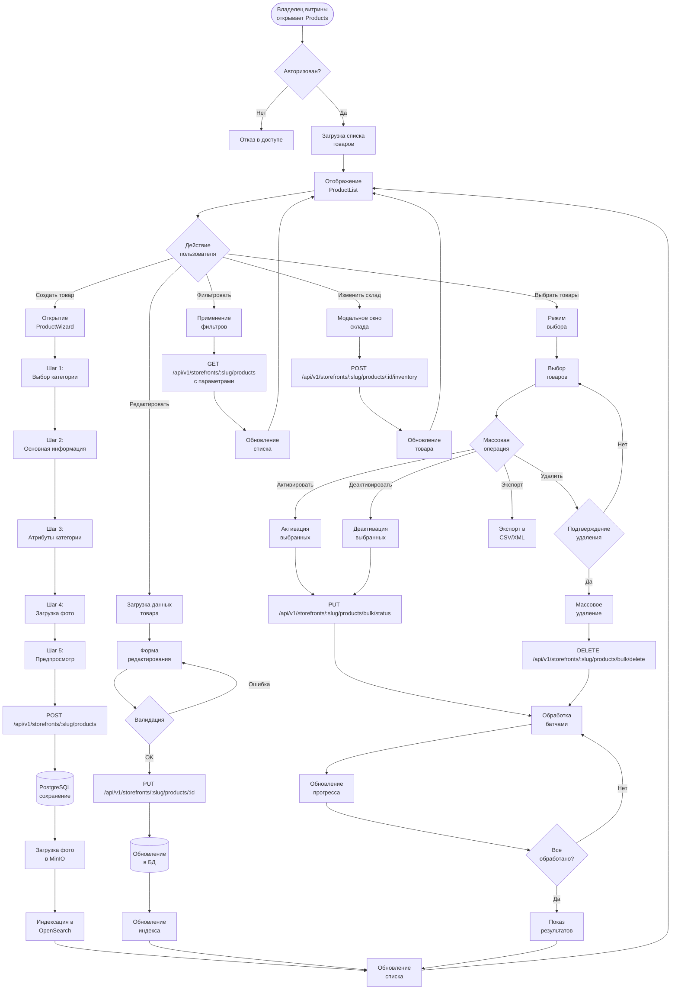

# 📦 Паспорт процесса: Управление товарами в витрине

## 📋 Метаданные
- **Код**: BP-012
- **Название**: Product Management in Storefront
- **Версия**: 1.0.0
- **Статус**: Active
- **Критичность**: High
- **Владелец**: Storefronts Team

## 🎯 Краткое описание

Комплексный процесс управления товарами в витрине, включающий создание, редактирование, массовые операции, управление складом, категоризацию и оптимизацию продаж. Система поддерживает различные режимы отображения, продвинутую фильтрацию, bulk-операции и интеграцию с поисковой системой OpenSearch.

## 📊 Диаграмма процесса



## 🔄 Детальный Flow

### 1️⃣ **Просмотр и фильтрация товаров**

```typescript
// Frontend: ProductList.tsx
const ProductList: React.FC = () => {
  const dispatch = useAppDispatch();
  const { 
    products, 
    loading, 
    filters, 
    pagination,
    ui: { viewMode, isSelectMode }
  } = useAppSelector(state => state.products);
  
  // Загрузка товаров с фильтрами
  useEffect(() => {
    dispatch(fetchProducts({
      page: pagination.page,
      limit: pagination.limit,
      ...filters,
      sort_by: ui.sortBy,
      sort_order: ui.sortOrder,
    }));
  }, [filters, pagination.page, ui.sortBy, ui.sortOrder]);
  
  // Бесконечная прокрутка
  const handleLoadMore = useCallback(() => {
    if (!loading && pagination.hasMore) {
      dispatch(loadMoreProducts());
    }
  }, [loading, pagination.hasMore]);
  
  // Переключение режимов отображения
  const renderProducts = () => {
    switch (viewMode) {
      case 'grid':
        return (
          <div className="grid grid-cols-2 md:grid-cols-3 lg:grid-cols-4 gap-4">
            {products.map(product => (
              <ProductCard 
                key={product.id} 
                product={product} 
                viewMode="grid"
                isSelectMode={isSelectMode}
              />
            ))}
          </div>
        );
      
      case 'list':
        return (
          <div className="space-y-2">
            {products.map(product => (
              <ProductCard 
                key={product.id} 
                product={product} 
                viewMode="list"
                isSelectMode={isSelectMode}
              />
            ))}
          </div>
        );
      
      case 'table':
        return <ProductTable products={products} />;
    }
  };
};
```

### 2️⃣ **Создание товара через Wizard**

```typescript
// Frontend: ProductWizard.tsx
const ProductWizard: React.FC = () => {
  const [currentStep, setCurrentStep] = useState(0);
  const { formData, updateFormData } = useCreateProduct();
  
  const steps = [
    { component: CategoryStep, label: 'product.wizard.category' },
    { component: BasicInfoStep, label: 'product.wizard.basicInfo' },
    { component: AttributesStep, label: 'product.wizard.attributes' },
    { component: PhotosStep, label: 'product.wizard.photos' },
    { component: PreviewStep, label: 'product.wizard.preview' },
  ];
  
  // Валидация текущего шага
  const validateCurrentStep = (): boolean => {
    switch (currentStep) {
      case 0: // CategoryStep
        return formData.categoryId !== null;
      
      case 1: // BasicInfoStep
        return (
          formData.name.length >= 3 &&
          formData.description.length >= 10 &&
          formData.price > 0
        );
      
      case 2: // AttributesStep
        // Проверка обязательных атрибутов категории
        return validateCategoryAttributes(formData.categoryId, formData.attributes);
      
      case 3: // PhotosStep
        return formData.images.length > 0;
      
      default:
        return true;
    }
  };
  
  // Переход к следующему шагу
  const handleNext = () => {
    if (validateCurrentStep()) {
      setCurrentStep(prev => prev + 1);
    } else {
      toast.error(t('product.wizard.validation.fillRequired'));
    }
  };
};

// Backend: Создание товара
func (h *ProductHandler) CreateProduct(c *fiber.Ctx) error {
    storefrontSlug := c.Params("slug")
    userID := c.Locals("userID").(int64)
    
    // Проверка доступа к витрине
    storefront, err := h.storefrontService.GetBySlug(storefrontSlug)
    if err != nil || !h.hasAccess(storefront, userID) {
        return utils.ErrorResponse(c, fiber.StatusForbidden, "access.denied")
    }
    
    // Парсинг данных товара
    var dto ProductCreateDTO
    if err := c.BodyParser(&dto); err != nil {
        return utils.ErrorResponse(c, fiber.StatusBadRequest, "validation.invalidData")
    }
    
    // Валидация
    if err := h.validator.Struct(dto); err != nil {
        return utils.ErrorResponse(c, fiber.StatusBadRequest, "validation.invalidData")
    }
    
    // Создание товара
    product := &StorefrontProduct{
        StorefrontID:  storefront.ID,
        Name:          dto.Name,
        Description:   dto.Description,
        Price:         dto.Price,
        Currency:      dto.Currency,
        CategoryID:    dto.CategoryID,
        SKU:           dto.SKU,
        Barcode:       dto.Barcode,
        StockQuantity: dto.StockQuantity,
        StockStatus:   calculateStockStatus(dto.StockQuantity),
        IsActive:      dto.IsActive,
        Attributes:    dto.Attributes,
        CreatedAt:     time.Now(),
    }
    
    // Транзакция для создания товара и загрузки изображений
    tx, _ := h.db.Begin(context.Background())
    defer tx.Rollback(context.Background())
    
    // Сохранение товара
    if err := h.storage.CreateProduct(tx, product); err != nil {
        return utils.ErrorResponse(c, fiber.StatusInternalServerError, "error.internal")
    }
    
    // Обработка изображений
    if len(dto.Images) > 0 {
        for idx, imageData := range dto.Images {
            image, err := h.processProductImage(product.ID, imageData, idx == 0)
            if err != nil {
                log.Printf("Failed to process image: %v", err)
                continue
            }
            product.Images = append(product.Images, image)
        }
    }
    
    // Коммит транзакции
    if err := tx.Commit(context.Background()); err != nil {
        return utils.ErrorResponse(c, fiber.StatusInternalServerError, "error.internal")
    }
    
    // Асинхронная индексация в OpenSearch
    go h.indexProductAsync(product)
    
    return utils.SuccessResponse(c, product)
}
```

### 3️⃣ **Массовые операции**

```typescript
// Frontend: BulkActions.tsx
const BulkActions: React.FC = () => {
  const dispatch = useAppDispatch();
  const { selectedIds } = useAppSelector(state => state.products);
  const [confirmDelete, setConfirmDelete] = useState(false);
  
  // Массовая активация
  const handleBulkActivate = async () => {
    dispatch(bulkUpdateStatus({
      productIds: selectedIds,
      status: 'active',
    }));
  };
  
  // Массовое удаление с подтверждением
  const handleBulkDelete = async () => {
    if (!confirmDelete) {
      setConfirmDelete(true);
      // Автосброс через 5 секунд
      setTimeout(() => setConfirmDelete(false), 5000);
      return;
    }
    
    dispatch(bulkDeleteProducts(selectedIds));
    setConfirmDelete(false);
  };
  
  // Экспорт выбранных товаров
  const handleExport = async (format: 'csv' | 'xml') => {
    try {
      const response = await api.post(
        `/api/v1/storefronts/${storefrontSlug}/products/export`,
        {
          product_ids: selectedIds,
          format: format,
        },
        { responseType: 'blob' }
      );
      
      // Скачивание файла
      const url = window.URL.createObjectURL(new Blob([response.data]));
      const link = document.createElement('a');
      link.href = url;
      link.setAttribute('download', `products_export.${format}`);
      document.body.appendChild(link);
      link.click();
      link.remove();
      window.URL.revokeObjectURL(url);
    } catch (error) {
      toast.error(t('products.export.failed'));
    }
  };
};

// Backend: Массовое обновление статуса
func (h *ProductHandler) BulkUpdateStatus(c *fiber.Ctx) error {
    storefrontSlug := c.Params("slug")
    
    var dto BulkStatusUpdateDTO
    if err := c.BodyParser(&dto); err != nil {
        return utils.ErrorResponse(c, fiber.StatusBadRequest, "validation.invalidData")
    }
    
    // Обработка батчами для производительности
    batchSize := 100
    successCount := 0
    errors := []BulkOperationError{}
    
    for i := 0; i < len(dto.ProductIDs); i += batchSize {
        end := i + batchSize
        if end > len(dto.ProductIDs) {
            end = len(dto.ProductIDs)
        }
        
        batch := dto.ProductIDs[i:end]
        
        // Обновление батча
        query := `
            UPDATE storefront_products 
            SET is_active = $1, updated_at = $2
            WHERE id = ANY($3) 
            AND storefront_id = (SELECT id FROM storefronts WHERE slug = $4)
            RETURNING id
        `
        
        rows, err := h.db.Query(
            context.Background(),
            query,
            dto.Status == "active",
            time.Now(),
            batch,
            storefrontSlug,
        )
        
        if err != nil {
            for _, id := range batch {
                errors = append(errors, BulkOperationError{
                    ProductID: id,
                    Error:     "Failed to update status",
                })
            }
            continue
        }
        
        // Подсчет успешных обновлений
        var updatedIDs []int64
        for rows.Next() {
            var id int64
            rows.Scan(&id)
            updatedIDs = append(updatedIDs, id)
        }
        rows.Close()
        
        successCount += len(updatedIDs)
        
        // Индексация обновленных товаров
        go h.reindexProducts(updatedIDs)
    }
    
    return utils.SuccessResponse(c, map[string]interface{}{
        "success_count": successCount,
        "error_count":   len(errors),
        "errors":        errors,
    })
}
```

### 4️⃣ **Управление складом**

```go
// Backend: Управление inventory
func (h *ProductHandler) UpdateInventory(c *fiber.Ctx) error {
    productID := c.Params("id")
    
    var dto InventoryUpdateDTO
    if err := c.BodyParser(&dto); err != nil {
        return utils.ErrorResponse(c, fiber.StatusBadRequest, "validation.invalidData")
    }
    
    // Начало транзакции для атомарности
    tx, _ := h.db.Begin(context.Background())
    defer tx.Rollback(context.Background())
    
    // Блокировка записи для предотвращения race conditions
    var currentQuantity int
    err := tx.QueryRow(
        context.Background(),
        `SELECT stock_quantity FROM storefront_products WHERE id = $1 FOR UPDATE`,
        productID,
    ).Scan(&currentQuantity)
    
    if err != nil {
        return utils.ErrorResponse(c, fiber.StatusNotFound, "product.notFound")
    }
    
    // Вычисление нового количества
    newQuantity := currentQuantity
    switch dto.Operation {
    case "set":
        newQuantity = dto.Quantity
    case "add":
        newQuantity += dto.Quantity
    case "subtract":
        newQuantity -= dto.Quantity
        if newQuantity < 0 {
            return utils.ErrorResponse(c, fiber.StatusBadRequest, "inventory.insufficientStock")
        }
    }
    
    // Определение статуса склада
    stockStatus := "in_stock"
    if newQuantity == 0 {
        stockStatus = "out_of_stock"
    } else if newQuantity <= h.config.LowStockThreshold {
        stockStatus = "low_stock"
    }
    
    // Обновление inventory
    _, err = tx.Exec(
        context.Background(),
        `UPDATE storefront_products 
         SET stock_quantity = $1, stock_status = $2, updated_at = $3 
         WHERE id = $4`,
        newQuantity, stockStatus, time.Now(), productID,
    )
    
    if err != nil {
        return utils.ErrorResponse(c, fiber.StatusInternalServerError, "error.internal")
    }
    
    // Запись в лог изменений inventory
    _, err = tx.Exec(
        context.Background(),
        `INSERT INTO inventory_logs (product_id, operation, quantity_change, new_quantity, reason, user_id, created_at)
         VALUES ($1, $2, $3, $4, $5, $6, $7)`,
        productID, dto.Operation, dto.Quantity, newQuantity, dto.Reason, c.Locals("userID"), time.Now(),
    )
    
    // Коммит транзакции
    if err := tx.Commit(context.Background()); err != nil {
        return utils.ErrorResponse(c, fiber.StatusInternalServerError, "error.internal")
    }
    
    // Уведомление о низком складе
    if stockStatus == "low_stock" {
        go h.notifyLowStock(productID, newQuantity)
    }
    
    return utils.SuccessResponse(c, map[string]interface{}{
        "new_quantity": newQuantity,
        "stock_status": stockStatus,
    })
}
```

### 5️⃣ **Индексация в OpenSearch**

```go
// Backend: service/product_indexing.go
func (s *ProductService) indexProductAsync(product *StorefrontProduct) {
    // Подготовка документа для индексации
    doc := map[string]interface{}{
        "id":             product.ID,
        "storefront_id":  product.StorefrontID,
        "name":           product.Name,
        "description":    product.Description,
        "price":          product.Price,
        "currency":       product.Currency,
        "category_id":    product.CategoryID,
        "sku":            product.SKU,
        "stock_status":   product.StockStatus,
        "is_active":      product.IsActive,
        "attributes":     product.Attributes,
        "view_count":     product.ViewCount,
        "sold_count":     product.SoldCount,
        "created_at":     product.CreatedAt,
        "updated_at":     product.UpdatedAt,
        
        // Поля для поиска
        "search_text": fmt.Sprintf("%s %s %s", 
            product.Name, 
            product.Description, 
            product.SKU,
        ),
        
        // Nested объекты
        "images": s.prepareImagesForIndex(product.Images),
        "category": s.prepareCategoryForIndex(product.CategoryID),
    }
    
    // Индексация в OpenSearch
    _, err := s.opensearchClient.Index(
        "storefront_products",
        strings.NewReader(jsonEncode(doc)),
        s.opensearchClient.Index.WithDocumentID(fmt.Sprintf("%d", product.ID)),
        s.opensearchClient.Index.WithRefresh("true"),
    )
    
    if err != nil {
        log.Printf("Failed to index product %d: %v", product.ID, err)
        // Retry логика
        s.scheduleRetryIndex(product.ID, 1)
    }
}
```

## 🔐 Безопасность и валидация

### Контроль доступа
- ✅ JWT токен для всех операций
- ✅ Проверка владения витриной
- ✅ Ролевая модель: owner (полный доступ), manager (CRUD товаров), staff (просмотр)
- ✅ Проверка прав на массовые операции

### Валидация данных
- ✅ Название: минимум 3 символа, максимум 255
- ✅ Описание: минимум 10 символов
- ✅ Цена: больше 0, валидная валюта
- ✅ SKU: уникальность в пределах витрины
- ✅ Изображения: проверка MIME типов, размера (max 10MB)
- ✅ Атрибуты: соответствие схеме категории

### Защита от атак
- ✅ Санитизация HTML в описаниях
- ✅ Rate limiting на создание товаров
- ✅ Защита от SQL injection через параметризованные запросы
- ✅ CSRF токены для форм

## 📊 Аналитика и метрики

### Отслеживаемые события
```typescript
// Создание товара
analytics.track('product_created', {
  user_id: userId,
  storefront_id: storefrontId,
  product_id: productId,
  category_id: categoryId,
  price: price,
  has_images: images.length > 0,
  attributes_count: Object.keys(attributes).length,
});

// Массовые операции
analytics.track('bulk_operation_completed', {
  user_id: userId,
  operation_type: operationType,
  items_count: selectedIds.length,
  success_count: successCount,
  error_count: errorCount,
  duration_ms: duration,
});

// Управление складом
analytics.track('inventory_updated', {
  product_id: productId,
  operation: operation,
  quantity_change: quantityChange,
  new_quantity: newQuantity,
  stock_status: stockStatus,
});
```

### KPI метрики
- **Product Creation Rate**: количество созданных товаров в день
- **Average Products per Storefront**: среднее количество товаров
- **Stock Management Efficiency**: % товаров с оптимальным складом
- **Bulk Operation Success Rate**: успешность массовых операций
- **Product Completeness Score**: % заполненности полей товаров

## 🧪 Тестирование

### Unit тесты
```typescript
// Frontend: ProductCard.test.tsx
describe('ProductCard', () => {
  it('should render correctly in grid mode', () => {
    const product = mockProduct();
    const { getByText, getByAltText } = render(
      <ProductCard product={product} viewMode="grid" />
    );
    
    expect(getByText(product.name)).toBeInTheDocument();
    expect(getByText(`${product.price} RSD`)).toBeInTheDocument();
    expect(getByAltText(product.name)).toHaveAttribute('src', product.images[0].url);
  });
  
  it('should handle selection in select mode', () => {
    const product = mockProduct();
    const { container } = render(
      <ProductCard product={product} viewMode="grid" isSelectMode={true} />
    );
    
    const checkbox = container.querySelector('input[type="checkbox"]');
    fireEvent.click(checkbox);
    
    expect(mockDispatch).toHaveBeenCalledWith(
      toggleProductSelection(product.id)
    );
  });
});
```

### Integration тесты
```go
// Backend: product_handler_test.go
func TestBulkOperations(t *testing.T) {
    // Setup
    app := setupTestApp()
    products := createTestProducts(10)
    
    // Test bulk activation
    body := fmt.Sprintf(`{
        "product_ids": [%d, %d, %d],
        "status": "active"
    }`, products[0].ID, products[1].ID, products[2].ID)
    
    req := httptest.NewRequest(
        "PUT", 
        "/api/v1/storefronts/test-store/products/bulk/status",
        strings.NewReader(body),
    )
    req.Header.Set("Authorization", "Bearer " + testToken)
    
    resp, _ := app.Test(req)
    assert.Equal(t, 200, resp.StatusCode)
    
    // Verify response
    var result map[string]interface{}
    json.NewDecoder(resp.Body).Decode(&result)
    assert.Equal(t, float64(3), result["success_count"])
}
```

## ⚡ Производительность и оптимизации

### Frontend оптимизации
- 🚀 Мемоизация ProductCard компонентов
- 🚀 Lazy loading для изображений
- 🚀 Debounced поиск (300ms)
- 🚀 Виртуализация для больших списков (TODO)
- 🚀 Оптимистичные обновления для быстрого отклика

### Backend оптимизации
- 🚀 Batch обработка для массовых операций
- 🚀 Параллельная загрузка изображений в MinIO
- 🚀 Кеширование категорий и атрибутов
- 🚀 Database connection pooling
- 🚀 Асинхронная индексация в OpenSearch

### Рекомендации по масштабированию
- 📈 Шардирование таблицы products по storefront_id
- 📈 Read replicas для операций чтения
- 📈 CDN для изображений товаров
- 📈 Кеширование популярных товаров в Redis
- 📈 Очереди для обработки изображений

## 🐛 Известные проблемы и ограничения

1. **Виртуализация**: Отсутствует для больших списков товаров
2. **Real-time**: Нет WebSocket обновлений при изменении другими пользователями
3. **Черновики**: Нет автосохранения при создании товара
4. **История**: Отсутствует журнал изменений товаров
5. **Варианты**: Нет поддержки вариантов товаров (размеры, цвета)

## 🔄 Связанные процессы

- **[BP-010] Создание и настройка витрины** - предварительная настройка
- **[BP-011] Импорт товаров** - массовое добавление товаров
- **[BP-013] Аналитика продаж** - анализ эффективности товаров
- **[BP-005] Работа с отзывами** - отзывы на товары

## 📚 Дополнительные ресурсы

- [API документация Products](/docs/api/products)
- [Frontend компоненты товаров](/memory-bank/system-passports/frontend/products/)
- [Руководство по атрибутам категорий](/docs/category-attributes)
- [Оптимизация изображений товаров](/docs/image-optimization)