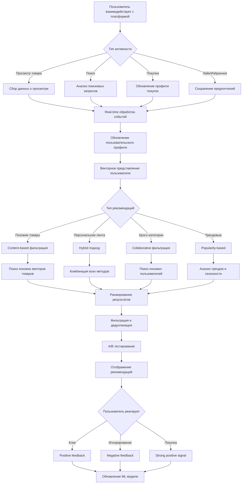

# Паспорт бизнес-процесса: Рекомендательная система

## 📋 Метаданные
- **Название**: Рекомендательная система
- **Роль**: Персонализация контента и улучшение пользовательского опыта
- **Тип**: Бизнес-процесс
- **Статус**: Активный
- **Дата создания паспорта**: 2025-06-29

## 🎯 Назначение
Процесс обеспечивает персонализированные рекомендации товаров, витрин и контента на основе поведения пользователя, истории покупок, предпочтений и коллаборативной фильтрации. Система повышает конверсию, увеличивает средний чек и улучшает удовлетворенность пользователей.

## 🔄 Общая схема процесса



## 📐 Архитектурные компоненты

### Frontend компоненты
1. **RecommendationWidget** (`/frontend/svetu/src/components/recommendations/RecommendationWidget.tsx`)
   - Универсальный виджет рекомендаций
   - Поддержка разных layouts (карусель, сетка, список)
   - Lazy loading и виртуализация

2. **PersonalizedFeed** (`/frontend/svetu/src/components/recommendations/PersonalizedFeed.tsx`)
   - Персонализированная лента на главной
   - Infinite scroll с динамической подгрузкой
   - Mixпанель различных типов контента

3. **SimilarItems** (`/frontend/svetu/src/components/recommendations/SimilarItems.tsx`)
   - Блок "Похожие товары" на странице товара
   - Визуальное объяснение похожести
   - Quick view без перехода

4. **RecommendationExplainer** (`/frontend/svetu/src/components/recommendations/RecommendationExplainer.tsx`)
   - Объяснение почему рекомендован товар
   - "Потому что вы смотрели X"
   - Возможность скрыть тип рекомендаций

### Backend компоненты
1. **Recommendation Engine** (`/backend/internal/proj/recommendations/engine/`)
   - Оркестрация различных алгоритмов
   - Кеширование результатов
   - A/B тестирование

2. **User Profile Service** (`/backend/internal/proj/recommendations/profile/`)
   - Построение векторного представления пользователя
   - Real-time обновление профиля
   - Сегментация пользователей

3. **ML Pipeline** (`/backend/internal/proj/recommendations/ml/`)
   - Обучение моделей на исторических данных
   - Feature engineering
   - Model serving через API

4. **Analytics Collector** (`/backend/internal/proj/recommendations/analytics/`)
   - Сбор implicit feedback
   - Click-through rate tracking
   - Conversion attribution

### ML/Data компоненты
1. **Feature Store**
   - Хранение признаков пользователей и товаров
   - Real-time и batch features
   - Версионирование features

2. **Model Registry**
   - Управление версиями моделей
   - A/B тестирование моделей
   - Rollback механизмы

3. **Vector Database (Milvus/Qdrant)**
   - Хранение embeddings товаров
   - Быстрый поиск похожих векторов
   - Масштабирование до миллионов товаров

## 🔧 Детальный flow процесса

### 1. Сбор данных о поведении
```typescript
// Analytics tracking на frontend
const trackUserBehavior = (event: UserEvent) => {
  // Immediate отправка для real-time рекомендаций
  sendBeacon('/api/v1/analytics/track', {
    event_type: event.type,
    item_id: event.itemId,
    category_id: event.categoryId,
    timestamp: Date.now(),
    context: {
      source: event.source, // search, recommendation, direct
      position: event.position, // позиция в списке
      viewport: event.viewport, // видимая область
      session_id: getSessionId(),
    },
    user_features: {
      device_type: getDeviceType(),
      location: getUserLocation(),
      time_of_day: new Date().getHours(),
      day_of_week: new Date().getDay(),
    }
  });
  
  // Batch для подробной аналитики
  batchAnalytics.add(event);
};

// Отслеживание различных событий
export const trackItemView = (item: Item, duration: number) => {
  trackUserBehavior({
    type: 'item_view',
    itemId: item.id,
    categoryId: item.category_id,
    source: item.view_source,
    position: item.list_position,
    viewport: getViewportInfo(),
    metadata: {
      view_duration: duration,
      scroll_depth: getScrollDepth(),
      interactions: getInteractionCount(),
    }
  });
};

export const trackAddToFavorites = (item: Item) => {
  trackUserBehavior({
    type: 'add_to_favorites',
    itemId: item.id,
    categoryId: item.category_id,
    source: 'explicit_preference',
    metadata: {
      price: item.price,
      has_discount: item.discount > 0,
    }
  });
};
```

### 2. Построение пользовательского профиля
```go
// user_profile_service.go
type UserProfile struct {
    UserID           int
    Demographics     Demographics
    Preferences      map[string]float64
    CategoryAffinity map[int]float64
    PriceRange       PricePreference
    BrandAffinity    map[string]float64
    StyleVector      []float32 // 128-dimensional embedding
    LastUpdated      time.Time
}

func (s *ProfileService) UpdateUserProfile(userID int, event UserEvent) error {
    profile, err := s.getOrCreateProfile(userID)
    if err != nil {
        return err
    }
    
    // Обновление на основе типа события
    switch event.Type {
    case "item_view":
        s.updateViewPreferences(profile, event)
    case "purchase":
        s.updatePurchasePreferences(profile, event)
    case "search":
        s.updateSearchPreferences(profile, event)
    case "add_to_favorites":
        s.updateExplicitPreferences(profile, event)
    }
    
    // Пересчет векторного представления
    profile.StyleVector = s.calculateStyleEmbedding(profile)
    
    // Decay старых предпочтений
    s.applyTimeDecay(profile)
    
    // Сохранение в Redis для быстрого доступа
    return s.saveProfile(profile)
}

func (s *ProfileService) calculateStyleEmbedding(profile *UserProfile) []float32 {
    // Подготовка features
    features := s.extractFeatures(profile)
    
    // Прогон через нейронную сеть
    embedding, err := s.mlService.GetUserEmbedding(features)
    if err != nil {
        // Fallback на rule-based embedding
        return s.calculateRuleBasedEmbedding(profile)
    }
    
    return embedding
}
```

### 3. Content-based рекомендации
```go
// content_based_recommender.go
func (r *ContentBasedRecommender) GetSimilarItems(itemID int, limit int) ([]ScoredItem, error) {
    // Получение embedding исходного товара
    sourceItem, err := r.itemService.GetItemWithEmbedding(itemID)
    if err != nil {
        return nil, err
    }
    
    // Поиск похожих в векторной БД
    similarItems, err := r.vectorDB.SearchSimilar(
        sourceItem.Embedding,
        limit * 2, // Берем больше для фильтрации
        map[string]interface{}{
            "category_id": sourceItem.CategoryID, // Только из той же категории
            "price_range": getPriceRange(sourceItem.Price, 0.3), // ±30% по цене
            "is_active": true,
        },
    )
    
    // Дополнительная фильтрация и scoring
    scoredItems := []ScoredItem{}
    for _, item := range similarItems {
        if item.ID == itemID {
            continue // Исключаем сам товар
        }
        
        score := r.calculateSimilarityScore(sourceItem, item)
        
        // Boost для товаров того же продавца
        if item.SellerID == sourceItem.SellerID {
            score *= 1.2
        }
        
        // Penalty для товаров без фото
        if len(item.Images) == 0 {
            score *= 0.7
        }
        
        scoredItems = append(scoredItems, ScoredItem{
            Item:  item,
            Score: score,
            Reason: r.explainSimilarity(sourceItem, item),
        })
    }
    
    // Сортировка по score и возврат top N
    sort.Slice(scoredItems, func(i, j int) bool {
        return scoredItems[i].Score > scoredItems[j].Score
    })
    
    return scoredItems[:min(len(scoredItems), limit)], nil
}
```

### 4. Collaborative фильтрация
```go
// collaborative_recommender.go
func (r *CollaborativeRecommender) GetRecommendations(userID int, limit int) ([]ScoredItem, error) {
    // Matrix Factorization подход
    userProfile, err := r.profileService.GetUserProfile(userID)
    if err != nil {
        return nil, err
    }
    
    // Поиск похожих пользователей
    similarUsers, err := r.findSimilarUsers(userProfile, 100)
    if err != nil {
        return nil, err
    }
    
    // Сбор товаров, которые понравились похожим пользователям
    itemScores := make(map[int]float64)
    userItems := r.getUserItems(userID) // Товары текущего пользователя
    
    for _, simUser := range similarUsers {
        simUserItems := r.getUserItems(simUser.UserID)
        
        for _, item := range simUserItems {
            // Пропускаем товары, которые пользователь уже видел
            if _, seen := userItems[item.ItemID]; seen {
                continue
            }
            
            // Score = similarity * interaction_strength
            score := simUser.Similarity * item.InteractionScore
            itemScores[item.ItemID] += score
        }
    }
    
    // Конвертация в список и сортировка
    recommendations := []ScoredItem{}
    for itemID, score := range itemScores {
        item, err := r.itemService.GetItem(itemID)
        if err != nil || !item.IsActive {
            continue
        }
        
        recommendations = append(recommendations, ScoredItem{
            Item:  item,
            Score: score,
            Reason: "Users with similar taste also liked this",
        })
    }
    
    sort.Slice(recommendations, func(i, j int) bool {
        return recommendations[i].Score > recommendations[j].Score
    })
    
    return recommendations[:min(len(recommendations), limit)], nil
}

// Alternating Least Squares для matrix factorization
func (r *CollaborativeRecommender) trainALSModel() error {
    // Построение разреженной матрицы user-item interactions
    interactions := r.buildInteractionMatrix()
    
    // ALS итерации
    for iter := 0; iter < r.config.MaxIterations; iter++ {
        // Fix user factors, solve for item factors
        r.solveItemFactors(interactions)
        
        // Fix item factors, solve for user factors
        r.solveUserFactors(interactions)
        
        // Проверка сходимости
        if r.hasConverged(iter) {
            break
        }
    }
    
    // Сохранение модели
    return r.saveModel()
}
```

### 5. Hybrid рекомендации
```go
// hybrid_recommender.go
func (r *HybridRecommender) GetPersonalizedFeed(userID int, page int) (*PersonalizedFeed, error) {
    // Параллельный запрос различных источников
    var wg sync.WaitGroup
    resultsChan := make(chan RecommendationSource, 5)
    
    // Content-based на основе недавних просмотров
    wg.Add(1)
    go func() {
        defer wg.Done()
        items, _ := r.contentBased.GetBasedOnRecentViews(userID, 20)
        resultsChan <- RecommendationSource{
            Type:   "recent_views",
            Items:  items,
            Weight: 0.3,
        }
    }()
    
    // Collaborative рекомендации
    wg.Add(1)
    go func() {
        defer wg.Done()
        items, _ := r.collaborative.GetRecommendations(userID, 20)
        resultsChan <- RecommendationSource{
            Type:   "collaborative",
            Items:  items,
            Weight: 0.25,
        }
    }()
    
    // Trending в категориях пользователя
    wg.Add(1)
    go func() {
        defer wg.Done()
        items, _ := r.trending.GetTrendingInUserCategories(userID, 20)
        resultsChan <- RecommendationSource{
            Type:   "trending",
            Items:  items,
            Weight: 0.2,
        }
    }()
    
    // Новинки от любимых продавцов
    wg.Add(1)
    go func() {
        defer wg.Done()
        items, _ := r.social.GetFromFavoriteSellers(userID, 15)
        resultsChan <- RecommendationSource{
            Type:   "favorite_sellers",
            Items:  items,
            Weight: 0.15,
        }
    }()
    
    // Сезонные и контекстные
    wg.Add(1)
    go func() {
        defer wg.Done()
        items, _ := r.contextual.GetSeasonalRecommendations(userID, 10)
        resultsChan <- RecommendationSource{
            Type:   "seasonal",
            Items:  items,
            Weight: 0.1,
        }
    }()
    
    // Сбор результатов
    go func() {
        wg.Wait()
        close(resultsChan)
    }()
    
    sources := []RecommendationSource{}
    for source := range resultsChan {
        sources = append(sources, source)
    }
    
    // Mixing стратегия
    feed := r.mixSources(sources, page)
    
    // Дополнительная персонализация
    r.applyUserPreferences(feed, userID)
    
    // Дедупликация
    r.deduplicateItems(feed)
    
    // Добавление разнообразия
    r.ensureDiversity(feed)
    
    return feed, nil
}

// Интеллектуальное смешивание источников
func (r *HybridRecommender) mixSources(sources []RecommendationSource, page int) *PersonalizedFeed {
    feed := &PersonalizedFeed{
        Items: []FeedItem{},
        Page:  page,
    }
    
    // Round-robin с учетом весов
    maxItems := 20
    addedCount := make(map[string]int)
    
    for len(feed.Items) < maxItems {
        added := false
        
        for _, source := range sources {
            // Пропорциональное добавление на основе веса
            targetCount := int(float64(maxItems) * source.Weight)
            if addedCount[source.Type] >= targetCount {
                continue
            }
            
            // Берем следующий элемент из источника
            idx := addedCount[source.Type]
            if idx < len(source.Items) {
                item := source.Items[idx]
                
                // Проверка на дубликаты
                if !r.feedContainsItem(feed, item.Item.ID) {
                    feed.Items = append(feed.Items, FeedItem{
                        Item:             item.Item,
                        Score:           item.Score,
                        RecommendationType: source.Type,
                        Position:        len(feed.Items) + 1,
                    })
                    added = true
                }
                
                addedCount[source.Type]++
            }
        }
        
        // Если ничего не добавили, выходим
        if !added {
            break
        }
    }
    
    return feed
}
```

### 6. Real-time обновление рекомендаций
```go
// realtime_updater.go
func (u *RealtimeUpdater) ProcessUserEvent(event UserEvent) {
    // Немедленное обновление краткосрочных предпочтений
    shortTermProfile := u.getShortTermProfile(event.UserID)
    
    switch event.Type {
    case "search":
        // Обновление поисковых интересов
        u.updateSearchContext(shortTermProfile, event.Query)
        
    case "item_view":
        // Добавление в недавно просмотренные
        u.addToRecentlyViewed(shortTermProfile, event.ItemID)
        
        // Обновление категориальных предпочтений
        item, _ := u.itemService.GetItem(event.ItemID)
        u.updateCategoryPreference(shortTermProfile, item.CategoryID, 1.0)
        
    case "add_to_cart":
        // Сильный сигнал интереса
        u.updateStrongInterest(shortTermProfile, event.ItemID)
    }
    
    // Инвалидация кеша рекомендаций
    u.invalidateUserCache(event.UserID)
    
    // Trigger пересчета для активных сессий
    if u.isUserActive(event.UserID) {
        go u.triggerRecommendationRefresh(event.UserID)
    }
}

// WebSocket обновления для SPA
func (u *RealtimeUpdater) StreamRecommendationUpdates(userID int, conn *websocket.Conn) {
    ticker := time.NewTicker(30 * time.Second)
    defer ticker.Stop()
    
    lastVersion := ""
    
    for {
        select {
        case <-ticker.C:
            // Проверка изменений в рекомендациях
            currentVersion := u.getRecommendationVersion(userID)
            if currentVersion != lastVersion {
                // Отправка обновленных рекомендаций
                updates := u.getIncrementalUpdates(userID, lastVersion)
                
                if err := conn.WriteJSON(updates); err != nil {
                    return
                }
                
                lastVersion = currentVersion
            }
            
        case event := <-u.userEventChan:
            if event.UserID == userID {
                // Немедленное обновление при активности пользователя
                u.ProcessUserEvent(event)
            }
        }
    }
}
```

### 7. A/B тестирование и оптимизация
```go
// ab_testing.go
type ExperimentConfig struct {
    Name            string
    StartDate       time.Time
    EndDate         time.Time
    TrafficPercent  float64
    Variants        []Variant
    SuccessMetrics  []string
}

func (a *ABTestingService) GetRecommendationVariant(userID int) Variant {
    // Детерминированное распределение по user_id
    experiments := a.getActiveExperiments()
    
    for _, exp := range experiments {
        if a.isUserInExperiment(userID, exp) {
            // Consistent hashing для распределения
            hash := xxhash.Sum64([]byte(fmt.Sprintf("%d-%s", userID, exp.Name)))
            variantIndex := int(hash % uint64(len(exp.Variants)))
            
            variant := exp.Variants[variantIndex]
            
            // Tracking assignment
            a.trackAssignment(userID, exp.Name, variant.Name)
            
            return variant
        }
    }
    
    return a.defaultVariant
}

// Применение варианта эксперимента
func (r *RecommendationEngine) ApplyExperimentVariant(variant Variant, params *RecommendationParams) {
    config := variant.Config
    
    // Изменение параметров алгоритма
    if weight, ok := config["collaborative_weight"]; ok {
        params.CollaborativeWeight = weight.(float64)
    }
    
    if diversityFactor, ok := config["diversity_factor"]; ok {
        params.DiversityFactor = diversityFactor.(float64)
    }
    
    if algorithm, ok := config["algorithm"]; ok {
        params.Algorithm = algorithm.(string)
    }
    
    // Специальные эксперименты
    switch variant.Name {
    case "neural_collaborative_filtering":
        params.UseNeuralCF = true
        
    case "context_aware_recommendations":
        params.IncludeContext = true
        params.ContextFeatures = []string{"time_of_day", "day_of_week", "weather"}
        
    case "exploration_boost":
        params.ExplorationRate = 0.3 // Больше новых товаров
    }
}
```

## 🔒 Безопасность и приватность

### Защита данных пользователей
1. **Анонимизация** - использование хешированных ID
2. **Differential privacy** - добавление шума в агрегированные данные
3. **Право на забвение** - удаление данных по запросу
4. **Федеративное обучение** - модели без централизации данных

### Защита от манипуляций
```go
// Детекция накруток и аномалий
func (s *AnomalyDetector) DetectManipulation(userID int, events []UserEvent) bool {
    // Проверка частоты событий
    eventRate := float64(len(events)) / time.Since(events[0].Timestamp).Minutes()
    if eventRate > s.config.MaxEventRate {
        return true
    }
    
    // Проверка паттернов
    patterns := s.analyzePatterns(events)
    
    // Слишком регулярные клики
    if patterns.RegularityScore > 0.9 {
        return true
    }
    
    // Подозрительная активность (только дорогие товары)
    if patterns.AveragePriceViewed > patterns.MarketAverage * 5 {
        return true
    }
    
    // ML-based anomaly detection
    features := s.extractFeatures(events)
    anomalyScore := s.model.Predict(features)
    
    return anomalyScore > s.config.AnomalyThreshold
}
```

## 📊 Аналитика и метрики

### KPI рекомендательной системы
```sql
-- Основные метрики эффективности
WITH recommendation_stats AS (
    SELECT 
        DATE(timestamp) as date,
        recommendation_type,
        COUNT(DISTINCT session_id) as unique_sessions,
        COUNT(*) as total_impressions,
        COUNT(CASE WHEN clicked = true THEN 1 END) as clicks,
        COUNT(CASE WHEN purchased = true THEN 1 END) as purchases,
        SUM(CASE WHEN purchased = true THEN purchase_amount ELSE 0 END) as revenue,
        AVG(position) as avg_position,
        AVG(CASE WHEN clicked = true THEN dwell_time ELSE NULL END) as avg_dwell_time
    FROM recommendation_events
    WHERE timestamp >= CURRENT_DATE - INTERVAL '30 days'
    GROUP BY DATE(timestamp), recommendation_type
)
SELECT 
    date,
    recommendation_type,
    clicks::float / NULLIF(total_impressions, 0) * 100 as ctr,
    purchases::float / NULLIF(clicks, 0) * 100 as conversion_rate,
    revenue / NULLIF(purchases, 0) as avg_order_value,
    purchases::float / NULLIF(unique_sessions, 0) as purchases_per_session,
    avg_position,
    avg_dwell_time
FROM recommendation_stats
ORDER BY date DESC, ctr DESC;
```

### Метрики качества
- **CTR (Click-through rate)**: > 5% для персонализированных
- **Conversion rate**: > 2% от кликов
- **Coverage**: > 80% каталога в рекомендациях
- **Diversity**: > 0.7 по категориям
- **Novelty**: 30% новых товаров для пользователя
- **Serendipity**: 10% неожиданных находок

### User satisfaction метрики
```go
// Implicit satisfaction signals
type SatisfactionSignals struct {
    DwellTime        time.Duration // Время на странице товара
    ScrollDepth      float64       // Глубина скролла
    InteractionCount int           // Количество действий
    ReturnVisits     int           // Повторные просмотры
    AddToCartRate    float64       // Процент добавлений в корзину
    PurchaseRate     float64       // Процент покупок
}

func (a *Analytics) CalculateSatisfactionScore(signals SatisfactionSignals) float64 {
    score := 0.0
    
    // Weighted scoring
    score += min(signals.DwellTime.Seconds() / 60, 1.0) * 0.2  // До 1 минуты
    score += signals.ScrollDepth * 0.15
    score += min(float64(signals.InteractionCount) / 5, 1.0) * 0.15
    score += min(float64(signals.ReturnVisits) / 3, 1.0) * 0.1
    score += signals.AddToCartRate * 0.2
    score += signals.PurchaseRate * 0.2
    
    return score
}
```

## ⚡ Производительность и оптимизация

### Кеширование рекомендаций
```go
// Multi-level caching
type RecommendationCache struct {
    l1Cache *ristretto.Cache // In-memory, hot data
    l2Cache *redis.Client    // Redis, warm data
    l3Cache *s3.Client      // S3, cold data
}

func (c *RecommendationCache) GetRecommendations(userID int, recType string) ([]Item, error) {
    key := fmt.Sprintf("rec:%d:%s", userID, recType)
    
    // L1: In-memory cache (< 100ms)
    if val, found := c.l1Cache.Get(key); found {
        return val.([]Item), nil
    }
    
    // L2: Redis cache (< 500ms)
    if val, err := c.l2Cache.Get(ctx, key).Result(); err == nil {
        items := c.deserializeItems(val)
        c.l1Cache.Set(key, items, 1) // Promote to L1
        return items, nil
    }
    
    // L3: S3 pre-computed (< 2s)
    if val, err := c.getFromS3(key); err == nil {
        items := c.deserializeItems(val)
        c.promoteToUpperCaches(key, items)
        return items, nil
    }
    
    // Cache miss - compute
    items, err := c.computeRecommendations(userID, recType)
    if err != nil {
        return nil, err
    }
    
    // Async population of all cache levels
    go c.populateCaches(key, items)
    
    return items, nil
}
```

### Предвычисление рекомендаций
```go
// Batch pre-computation
func (p *PrecomputeService) PrecomputeRecommendations() {
    // Определение активных пользователей
    activeUsers := p.getActiveUsers(24 * time.Hour)
    
    // Распределение по воркерам
    userBatches := p.batchUsers(activeUsers, 1000)
    
    var wg sync.WaitGroup
    for _, batch := range userBatches {
        wg.Add(1)
        go func(users []int) {
            defer wg.Done()
            
            for _, userID := range users {
                // Генерация всех типов рекомендаций
                recommendations := map[string][]Item{
                    "personalized": p.computePersonalized(userID),
                    "similar":      p.computeSimilar(userID),
                    "trending":     p.computeTrending(userID),
                    "seasonal":     p.computeSeasonal(userID),
                }
                
                // Сохранение в S3 с TTL
                p.saveToS3(userID, recommendations, 24*time.Hour)
            }
        }(batch)
    }
    
    wg.Wait()
}
```

### Оптимизация векторного поиска
```go
// HNSW index для approximate nearest neighbors
type VectorIndex struct {
    index *hnswlib.Index
    dim   int
}

func (v *VectorIndex) BuildIndex(items []ItemEmbedding) error {
    // Параметры HNSW
    v.index = hnswlib.New(
        v.dim,
        hnswlib.CosineDistance,
        hnswlib.Config{
            M:              16,  // Connectivity parameter
            EfConstruction: 200, // Accuracy/speed tradeoff
            Seed:           42,
        },
    )
    
    // Batch добавление векторов
    for _, item := range items {
        v.index.Add(item.Vector, item.ID)
    }
    
    // Построение оптимального графа
    v.index.Build()
    
    return nil
}

// Быстрый поиск похожих
func (v *VectorIndex) SearchSimilar(query []float32, k int) ([]int, []float32, error) {
    // ef parameter для runtime accuracy
    v.index.SetEf(50)
    
    ids, distances := v.index.SearchKNN(query, k)
    
    return ids, distances, nil
}
```

## 🧪 Тестирование

### Offline evaluation
```python
# evaluate_model.py
def evaluate_recommendations(test_data, model):
    metrics = {
        'precision_at_k': [],
        'recall_at_k': [],
        'ndcg_at_k': [],
        'coverage': set(),
        'diversity': []
    }
    
    for user_id, actual_items in test_data.items():
        # Получение рекомендаций
        recommended = model.predict(user_id, k=10)
        
        # Precision@K
        relevant = len(set(recommended) & set(actual_items))
        metrics['precision_at_k'].append(relevant / len(recommended))
        
        # Recall@K
        metrics['recall_at_k'].append(relevant / len(actual_items))
        
        # NDCG@K
        ndcg = calculate_ndcg(recommended, actual_items)
        metrics['ndcg_at_k'].append(ndcg)
        
        # Coverage
        metrics['coverage'].update(recommended)
        
        # Diversity
        diversity = calculate_diversity(recommended)
        metrics['diversity'].append(diversity)
    
    return {
        'precision@10': np.mean(metrics['precision_at_k']),
        'recall@10': np.mean(metrics['recall_at_k']),
        'ndcg@10': np.mean(metrics['ndcg_at_k']),
        'catalog_coverage': len(metrics['coverage']) / total_items,
        'avg_diversity': np.mean(metrics['diversity'])
    }
```

### Online A/B testing
```go
func TestRecommendationQuality(t *testing.T) {
    // Создание тестовых пользователей с известными предпочтениями
    testUsers := createTestUsers(100)
    
    // Симуляция поведения
    for _, user := range testUsers {
        // Генерация событий на основе профиля
        events := simulateUserBehavior(user)
        
        // Обработка событий
        for _, event := range events {
            engine.ProcessEvent(event)
        }
        
        // Получение рекомендаций
        recommendations := engine.GetRecommendations(user.ID, 10)
        
        // Проверка качества
        relevanceScore := calculateRelevance(recommendations, user.Preferences)
        assert.Greater(t, relevanceScore, 0.7, "Low relevance score")
        
        diversityScore := calculateDiversity(recommendations)
        assert.Greater(t, diversityScore, 0.5, "Low diversity")
    }
}
```

## 🌍 Локализация и культурные особенности

### Региональные предпочтения
```go
type RegionalPreferences struct {
    Country        string
    PopularCategories []int
    PriceMultiplier   float64
    PreferredBrands   []string
    SeasonalTrends    map[string][]string // season -> trending categories
}

var serbianPreferences = RegionalPreferences{
    Country: "RS",
    PopularCategories: []int{
        1,  // Электроника
        5,  // Одежда
        12, // Дом и сад
        18, // Спорт
    },
    PriceMultiplier: 0.8, // Ниже средних цен по Европе
    PreferredBrands: []string{"Gorenje", "Atlantic Grupa", "Nectar"},
    SeasonalTrends: map[string][]string{
        "summer": {"outdoor", "sports", "travel"},
        "winter": {"heating", "winter_clothes", "skiing"},
        "slava": {"decorations", "food", "gifts"}, // Семейный праздник
    },
}
```

### Мультиязычные embeddings
```go
// Использование multilingual BERT для текстовых features
func (e *EmbeddingService) GetMultilingualEmbedding(text string) ([]float32, error) {
    // Определение языка
    lang := e.detectLanguage(text)
    
    // Использование соответствующей модели
    var embedding []float32
    switch lang {
    case "sr": // Сербский
        embedding = e.serbianBERT.Encode(text)
    case "en": // Английский
        embedding = e.englishBERT.Encode(text)
    default:
        // Fallback на multilingual model
        embedding = e.multiBERT.Encode(text)
    }
    
    return embedding, nil
}
```

## ⚠️ Известные ограничения

1. **Cold start problem** - новые пользователи без истории
2. **Вычислительная сложность** - O(n*m) для collaborative
3. **Задержка обновления** - до 5 минут для новых предпочтений
4. **Размер модели** - до 1GB для neural collaborative filtering

## 🔄 Связанные процессы

1. **[Поиск и фильтрация](search-filtering.md)** - источник поведенческих данных
2. **[Коммуникация пользователей](user-communication.md)** - социальные сигналы
3. **[Аналитика продаж](sales-analytics.md)** - данные о конверсиях
4. **[Управление товарами](product-management-storefront.md)** - метаданные товаров

## 📈 Будущие улучшения

1. **Reinforcement Learning** - оптимизация долгосрочного engagement
2. **Graph Neural Networks** - учет социального графа
3. **Multimodal рекомендации** - комбинация текста и изображений
4. **Real-time personalization** - < 100ms latency
5. **Explainable AI** - детальные объяснения рекомендаций