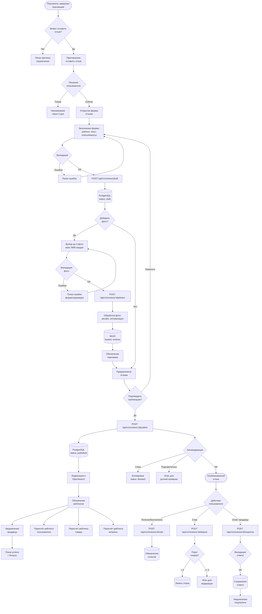

# ⭐ Паспорт процесса: Работа с отзывами и рейтингами

## 📋 Метаданные
- **Код**: BP-014
- **Название**: Reviews and Ratings Management
- **Версия**: 1.0.0
- **Статус**: Active
- **Критичность**: High
- **Владелец**: Trust & Safety Team

## 🎯 Краткое описание

Комплексная система управления отзывами и рейтингами на платформе Sve Tu, включающая двухэтапный процесс создания отзывов с фотографиями, модерацию контента, агрегированные рейтинги, систему голосования и споров. Процесс обеспечивает доверие между покупателями и продавцами через верифицированные отзывы с защитой от манипуляций.

## 📊 Диаграмма процесса



## 🔄 Детальный Flow

### 1️⃣ **Проверка возможности оставить отзыв**

```typescript
// Frontend: Проверка перед открытием формы
const checkReviewEligibility = async (entityType: string, entityId: string) => {
  try {
    const response = await api.get(
      `/api/v1/reviews/check-eligibility/${entityType}/${entityId}`
    );
    
    const { can_review, reason, transaction_id } = response.data.data;
    
    if (!can_review) {
      // Показ причины ограничения
      switch (reason) {
        case 'no_transaction':
          toast.error(t('reviews.errors.noPurchase'));
          break;
        case 'already_reviewed':
          toast.error(t('reviews.errors.alreadyReviewed'));
          break;
        case 'too_early':
          toast.error(t('reviews.errors.tooEarly'));
          break;
        case 'user_blocked':
          toast.error(t('reviews.errors.userBlocked'));
          break;
      }
      return false;
    }
    
    return { eligible: true, transactionId: transaction_id };
  } catch (error) {
    console.error('Eligibility check failed:', error);
    return false;
  }
};

// Backend: Проверка права на отзыв
func (h *ReviewHandler) CheckEligibility(c *fiber.Ctx) error {
    userID := c.Locals("userID").(int64)
    entityType := c.Params("entityType")
    entityID := c.Params("entityId")
    
    // Проверка существования транзакции
    transaction, err := h.storage.GetUserTransactionForEntity(userID, entityType, entityID)
    if err != nil || transaction == nil {
        return utils.SuccessResponse(c, map[string]interface{}{
            "can_review": false,
            "reason":     "no_transaction",
        })
    }
    
    // Проверка на существующий отзыв
    existingReview, err := h.storage.GetUserReviewForTransaction(userID, transaction.ID)
    if existingReview != nil {
        return utils.SuccessResponse(c, map[string]interface{}{
            "can_review": false,
            "reason":     "already_reviewed",
        })
    }
    
    // Проверка времени (минимум 24 часа после транзакции)
    if time.Since(transaction.CompletedAt) < 24*time.Hour {
        return utils.SuccessResponse(c, map[string]interface{}{
            "can_review": false,
            "reason":     "too_early",
        })
    }
    
    // Проверка блокировок пользователя
    if h.isUserBlockedFromReviews(userID) {
        return utils.SuccessResponse(c, map[string]interface{}{
            "can_review": false,
            "reason":     "user_blocked",
        })
    }
    
    return utils.SuccessResponse(c, map[string]interface{}{
        "can_review":     true,
        "transaction_id": transaction.ID,
    })
}
```

### 2️⃣ **Двухэтапный процесс создания отзыва**

```typescript
// Frontend: ReviewForm.tsx - Управление процессом
const ReviewForm: React.FC<ReviewFormProps> = ({ 
  entityType, 
  entityId, 
  onSuccess 
}) => {
  const [step, setStep] = useState<'form' | 'uploading' | 'publishing'>('form');
  const [draftId, setDraftId] = useState<number | null>(null);
  const [formData, setFormData] = useState<ReviewFormData>({
    rating: 0,
    comment: '',
    pros: '',
    cons: '',
    photos: [],
  });
  
  // Этап 1: Создание черновика
  const handleCreateDraft = async () => {
    try {
      const response = await api.post('/api/v1/reviews/draft', {
        entity_type: entityType,
        entity_id: entityId,
        rating: formData.rating,
        comment: formData.comment,
        pros: formData.pros,
        cons: formData.cons,
      });
      
      setDraftId(response.data.data.id);
      
      // Если есть фото, переходим к загрузке
      if (formData.photos.length > 0) {
        setStep('uploading');
        await uploadPhotos(response.data.data.id);
      } else {
        // Иначе сразу к публикации
        setStep('publishing');
      }
    } catch (error) {
      toast.error(t('reviews.errors.draftFailed'));
    }
  };
  
  // Этап 2: Загрузка фотографий
  const uploadPhotos = async (reviewId: number) => {
    const formData = new FormData();
    
    formData.photos.forEach((photo, index) => {
      formData.append(`photos`, photo);
    });
    
    try {
      await api.post(
        `/api/v1/reviews/${reviewId}/photos`,
        formData,
        {
          headers: { 'Content-Type': 'multipart/form-data' },
          onUploadProgress: (progressEvent) => {
            const progress = Math.round(
              (progressEvent.loaded * 100) / progressEvent.total
            );
            setUploadProgress(progress);
          },
        }
      );
      
      setStep('publishing');
    } catch (error) {
      toast.error(t('reviews.errors.photoUploadFailed'));
      // Можно повторить или пропустить фото
      setStep('publishing');
    }
  };
  
  // Этап 3: Публикация
  const handlePublish = async () => {
    if (!draftId) return;
    
    try {
      await api.post(`/api/v1/reviews/${draftId}/publish`);
      
      toast.success(t('reviews.success.published'));
      
      // Показ бонусов за отзыв
      showReviewRewards();
      
      if (onSuccess) {
        onSuccess();
      }
    } catch (error) {
      toast.error(t('reviews.errors.publishFailed'));
    }
  };
};
```

### 3️⃣ **Обработка фотографий на backend**

```go
// Backend: handlers/review_photos.go
func (h *ReviewHandler) UploadPhotos(c *fiber.Ctx) error {
    reviewID := c.Params("id")
    userID := c.Locals("userID").(int64)
    
    // Проверка владельца отзыва
    review, err := h.storage.GetReview(reviewID)
    if err != nil || review.UserID != userID || review.Status != "draft" {
        return utils.ErrorResponse(c, fiber.StatusForbidden, "access.denied")
    }
    
    // Получение файлов
    form, err := c.MultipartForm()
    if err != nil {
        return utils.ErrorResponse(c, fiber.StatusBadRequest, "upload.invalidForm")
    }
    
    files := form.File["photos"]
    if len(files) > 5 {
        return utils.ErrorResponse(c, fiber.StatusBadRequest, "reviews.tooManyPhotos")
    }
    
    uploadedPhotos := []ReviewPhoto{}
    
    for idx, file := range files {
        // Валидация файла
        if file.Size > 5*1024*1024 { // 5MB
            continue
        }
        
        if !isValidImageType(file.Header.Get("Content-Type")) {
            continue
        }
        
        // Генерация уникального имени
        ext := filepath.Ext(file.Filename)
        photoID := uuid.New().String()
        filename := fmt.Sprintf("%s/%s%s", reviewID, photoID, ext)
        
        // Открытие файла
        src, err := file.Open()
        if err != nil {
            continue
        }
        defer src.Close()
        
        // Обработка изображения
        img, err := imaging.Decode(src)
        if err != nil {
            continue
        }
        
        // Создание миниатюры
        thumbnail := imaging.Resize(img, 300, 0, imaging.Lanczos)
        
        // Сохранение в MinIO
        // Полное изображение
        fullPath := fmt.Sprintf("reviews/%s", filename)
        if err := h.minioService.UploadImage(fullPath, img); err != nil {
            log.Printf("Failed to upload full image: %v", err)
            continue
        }
        
        // Миниатюра
        thumbPath := fmt.Sprintf("reviews/thumbs/%s", filename)
        if err := h.minioService.UploadImage(thumbPath, thumbnail); err != nil {
            log.Printf("Failed to upload thumbnail: %v", err)
            continue
        }
        
        // Сохранение в БД
        photo := ReviewPhoto{
            ReviewID:     reviewID,
            URL:          h.config.CDNBaseURL + "/" + fullPath,
            ThumbnailURL: h.config.CDNBaseURL + "/" + thumbPath,
            DisplayOrder: idx,
            CreatedAt:    time.Now(),
        }
        
        if err := h.storage.CreateReviewPhoto(&photo); err != nil {
            log.Printf("Failed to save photo record: %v", err)
            continue
        }
        
        uploadedPhotos = append(uploadedPhotos, photo)
    }
    
    return utils.SuccessResponse(c, map[string]interface{}{
        "uploaded_count": len(uploadedPhotos),
        "photos":         uploadedPhotos,
    })
}
```

### 4️⃣ **Система рейтингов и агрегация**

```go
// Backend: service/rating_aggregator.go
func (s *RatingService) UpdateEntityRating(entityType string, entityID int64) error {
    // Начало транзакции для консистентности
    tx, _ := s.db.Begin(context.Background())
    defer tx.Rollback(context.Background())
    
    // Получение всех опубликованных отзывов
    query := `
        SELECT 
            rating,
            is_verified,
            helpful_count,
            not_helpful_count,
            created_at
        FROM reviews
        WHERE entity_type = $1 
        AND entity_id = $2 
        AND status = 'published'
        AND NOT is_blocked
    `
    
    rows, err := tx.Query(context.Background(), query, entityType, entityID)
    if err != nil {
        return err
    }
    defer rows.Close()
    
    var (
        totalRating      float64
        totalReviews     int
        verifiedReviews  int
        ratingCounts     = make(map[int]int)
        weightedRating   float64
        totalWeight      float64
    )
    
    for rows.Next() {
        var (
            rating       int
            isVerified   bool
            helpfulCount int
            notHelpful   int
            createdAt    time.Time
        )
        
        rows.Scan(&rating, &isVerified, &helpfulCount, &notHelpful, &createdAt)
        
        totalReviews++
        totalRating += float64(rating)
        ratingCounts[rating]++
        
        if isVerified {
            verifiedReviews++
        }
        
        // Взвешенный рейтинг с учетом полезности и времени
        weight := s.calculateReviewWeight(helpfulCount, notHelpful, createdAt)
        weightedRating += float64(rating) * weight
        totalWeight += weight
    }
    
    if totalReviews == 0 {
        return nil // Нет отзывов
    }
    
    // Расчет метрик
    avgRating := totalRating / float64(totalReviews)
    avgWeightedRating := weightedRating / totalWeight
    verifiedPercentage := float64(verifiedReviews) / float64(totalReviews) * 100
    
    // Расчет распределения по звездам
    distribution := make(map[string]float64)
    for stars := 1; stars <= 5; stars++ {
        count := ratingCounts[stars]
        percentage := float64(count) / float64(totalReviews) * 100
        distribution[fmt.Sprintf("%d_star", stars)] = percentage
    }
    
    // Сохранение агрегированных данных
    _, err = tx.Exec(
        context.Background(),
        `INSERT INTO entity_ratings (
            entity_type, entity_id, 
            average_rating, weighted_rating,
            total_reviews, verified_reviews,
            verified_percentage, rating_distribution,
            updated_at
        ) VALUES ($1, $2, $3, $4, $5, $6, $7, $8, $9)
        ON CONFLICT (entity_type, entity_id) 
        DO UPDATE SET
            average_rating = EXCLUDED.average_rating,
            weighted_rating = EXCLUDED.weighted_rating,
            total_reviews = EXCLUDED.total_reviews,
            verified_reviews = EXCLUDED.verified_reviews,
            verified_percentage = EXCLUDED.verified_percentage,
            rating_distribution = EXCLUDED.rating_distribution,
            updated_at = EXCLUDED.updated_at`,
        entityType, entityID,
        avgRating, avgWeightedRating,
        totalReviews, verifiedReviews,
        verifiedPercentage, distribution,
        time.Now(),
    )
    
    if err != nil {
        return err
    }
    
    // Обновление кеша
    cacheKey := fmt.Sprintf("rating:%s:%d", entityType, entityID)
    s.cache.Set(cacheKey, map[string]interface{}{
        "average":    avgRating,
        "weighted":   avgWeightedRating,
        "total":      totalReviews,
        "verified":   verifiedPercentage,
    }, 15*time.Minute)
    
    return tx.Commit(context.Background())
}

// Расчет веса отзыва
func (s *RatingService) calculateReviewWeight(helpful, notHelpful int, createdAt time.Time) float64 {
    // Базовый вес
    weight := 1.0
    
    // Фактор полезности (Wilson Score)
    if total := helpful + notHelpful; total > 0 {
        positiveRatio := float64(helpful) / float64(total)
        weight *= s.wilsonScore(positiveRatio, total)
    }
    
    // Фактор времени (новые отзывы важнее)
    daysSince := time.Since(createdAt).Hours() / 24
    timeDecay := math.Exp(-daysSince / 365) // Экспоненциальный спад за год
    weight *= (0.5 + 0.5*timeDecay) // Минимум 50% веса для старых отзывов
    
    return weight
}
```

### 5️⃣ **Модерация и обработка споров**

```typescript
// Frontend: Взаимодействие с отзывом
const ReviewActions: React.FC<{ review: Review }> = ({ review }) => {
  const [isDisputing, setIsDisputing] = useState(false);
  const { user } = useAuth();
  
  // Голосование за полезность
  const handleVote = async (isHelpful: boolean) => {
    try {
      await api.post(`/api/v1/reviews/${review.id}/vote`, {
        vote_type: isHelpful ? 'helpful' : 'not_helpful',
      });
      
      // Оптимистичное обновление UI
      updateReviewVotes(review.id, isHelpful);
    } catch (error) {
      if (error.response?.status === 409) {
        toast.error(t('reviews.errors.alreadyVoted'));
      }
    }
  };
  
  // Оспаривание отзыва
  const handleDispute = async () => {
    const reason = await showDisputeModal();
    if (!reason) return;
    
    setIsDisputing(true);
    try {
      await api.post(`/api/v1/reviews/${review.id}/dispute`, {
        reason: reason,
        evidence: selectedEvidence,
      });
      
      toast.success(t('reviews.dispute.submitted'));
    } catch (error) {
      toast.error(t('reviews.dispute.failed'));
    } finally {
      setIsDisputing(false);
    }
  };
  
  // Ответ продавца
  const handleSellerResponse = async (response: string) => {
    try {
      await api.post(`/api/v1/reviews/${review.id}/response`, {
        response_text: response,
      });
      
      toast.success(t('reviews.response.published'));
      refreshReview();
    } catch (error) {
      toast.error(t('reviews.response.failed'));
    }
  };
  
  return (
    <div className="flex items-center gap-2 mt-4">
      <button
        className="btn btn-sm btn-ghost"
        onClick={() => handleVote(true)}
      >
        <ThumbsUp className="w-4 h-4" />
        <span>{review.helpful_count}</span>
      </button>
      
      <button
        className="btn btn-sm btn-ghost"
        onClick={() => handleVote(false)}
      >
        <ThumbsDown className="w-4 h-4" />
        <span>{review.not_helpful_count}</span>
      </button>
      
      {user?.id === review.entity_owner_id && !review.seller_response && (
        <button
          className="btn btn-sm btn-primary"
          onClick={() => openResponseModal()}
        >
          {t('reviews.actions.respond')}
        </button>
      )}
      
      {(user?.id === review.entity_owner_id || user?.id === review.user_id) && (
        <button
          className="btn btn-sm btn-error"
          onClick={handleDispute}
          disabled={isDisputing}
        >
          {t('reviews.actions.dispute')}
        </button>
      )}
    </div>
  );
};

// Backend: Автоматическая модерация
func (h *ReviewHandler) autoModerate(review *Review) (*ModerationResult, error) {
    result := &ModerationResult{
        Action: "approve",
        Reason: "",
        Score:  0,
    }
    
    // 1. Проверка на спам (повторяющийся контент)
    if h.isSpamContent(review.Comment) {
        result.Action = "block"
        result.Reason = "spam_detected"
        result.Score = -100
        return result, nil
    }
    
    // 2. Проверка на запрещенные слова
    if h.containsBlockedWords(review.Comment) {
        result.Action = "flag"
        result.Reason = "blocked_words"
        result.Score = -50
        return result, nil
    }
    
    // 3. Проверка на минимальную длину
    if len(review.Comment) < 20 {
        result.Action = "flag"
        result.Reason = "too_short"
        result.Score = -20
        return result, nil
    }
    
    // 4. AI проверка на сгенерированный контент
    if h.config.EnableAIModeration {
        aiScore := h.aiModerator.CheckGeneratedContent(review.Comment)
        if aiScore > 0.8 {
            result.Action = "flag"
            result.Reason = "ai_generated"
            result.Score = -30
            return result, nil
        }
    }
    
    // 5. Проверка паттернов накрутки
    suspiciousPatterns := []string{
        `отличный товар!+`,
        `рекомендую!+`,
        `5 звезд!+`,
    }
    
    for _, pattern := range suspiciousPatterns {
        if matched, _ := regexp.MatchString(pattern, strings.ToLower(review.Comment)); matched {
            result.Score -= 10
        }
    }
    
    // Финальное решение
    if result.Score < -50 {
        result.Action = "flag"
        result.Reason = "suspicious_pattern"
    }
    
    return result, nil
}
```

## 🔐 Безопасность и валидация

### Защита от манипуляций
- ✅ Верификация транзакций для права на отзыв
- ✅ Лимит 1 отзыв на транзакцию
- ✅ Защита от накрутки через отслеживание IP и устройств
- ✅ AI детекция сгенерированных отзывов
- ✅ Автоблокировка при пороге отрицательных голосов

### Валидация данных
- ✅ Рейтинг: обязательный, от 1 до 5
- ✅ Комментарий: минимум 20 символов
- ✅ Фотографии: до 5 штук, макс 5MB, только изображения
- ✅ Санитизация HTML и SQL injection защита

### Модерация контента
- ✅ Автоматическая проверка на спам
- ✅ Фильтр запрещенных слов
- ✅ Ручная модерация при 3+ спорах
- ✅ Система апелляций для заблокированных

## 📊 Аналитика и метрики

### События отслеживания
```typescript
// Создание отзыва
analytics.track('review_created', {
  user_id: userId,
  entity_type: entityType,
  entity_id: entityId,
  rating: rating,
  has_photos: photos.length > 0,
  has_pros_cons: !!(pros || cons),
  word_count: comment.split(' ').length,
});

// Взаимодействие с отзывами
analytics.track('review_interaction', {
  action: 'vote' | 'dispute' | 'response',
  review_id: reviewId,
  interaction_type: interactionType,
});

// Просмотр галереи
analytics.track('review_gallery_viewed', {
  review_id: reviewId,
  photos_count: photosCount,
  view_duration: duration,
});
```

### KPI метрики
- **Review Rate**: % транзакций с отзывами
- **Average Rating**: средний рейтинг по категориям
- **Photo Attachment Rate**: % отзывов с фото
- **Response Rate**: % отзывов с ответами продавцов
- **Dispute Rate**: % оспоренных отзывов
- **Moderation Efficiency**: время обработки споров

## 🧪 Тестирование

### Unit тесты
```typescript
// Frontend: ReviewForm.test.tsx
describe('ReviewForm', () => {
  it('should validate required fields', async () => {
    const { getByRole, getByText } = render(
      <ReviewForm entityType="product" entityId="123" />
    );
    
    // Попытка отправки без рейтинга
    fireEvent.click(getByRole('button', { name: /submit/i }));
    
    await waitFor(() => {
      expect(getByText('reviews.validation.ratingRequired')).toBeInTheDocument();
    });
  });
  
  it('should handle photo upload', async () => {
    const file = new File(['test'], 'test.jpg', { type: 'image/jpeg' });
    const { getByTestId } = render(<ReviewForm />);
    
    const input = getByTestId('photo-input');
    fireEvent.change(input, { target: { files: [file] } });
    
    await waitFor(() => {
      expect(getByTestId('photo-preview')).toBeInTheDocument();
    });
  });
});
```

### Integration тесты
```go
// Backend: review_integration_test.go
func TestReviewCreationFlow(t *testing.T) {
    // Setup
    user := createTestUser()
    transaction := createTestTransaction(user.ID)
    
    // Этап 1: Создание черновика
    draftPayload := map[string]interface{}{
        "entity_type": "product",
        "entity_id":   transaction.ProductID,
        "rating":      5,
        "comment":     "Отличный товар, рекомендую!",
    }
    
    req := createAuthRequest("POST", "/api/v1/reviews/draft", draftPayload, user.Token)
    resp, _ := app.Test(req)
    assert.Equal(t, 201, resp.StatusCode)
    
    var draftResp map[string]interface{}
    json.NewDecoder(resp.Body).Decode(&draftResp)
    reviewID := draftResp["data"].(map[string]interface{})["id"]
    
    // Этап 2: Публикация
    publishReq := createAuthRequest("POST", fmt.Sprintf("/api/v1/reviews/%v/publish", reviewID), nil, user.Token)
    publishResp, _ := app.Test(publishReq)
    assert.Equal(t, 200, publishResp.StatusCode)
    
    // Проверка обновления рейтинга
    rating := getEntityRating("product", transaction.ProductID)
    assert.Equal(t, 5.0, rating.AverageRating)
    assert.Equal(t, 1, rating.TotalReviews)
}
```

## ⚡ Производительность и оптимизации

### Backend оптимизации
- 🚀 Кеширование рейтингов на 15 минут
- 🚀 Batch обработка фотографий
- 🚀 Асинхронная индексация в OpenSearch
- 🚀 Материализованные представления для статистики
- 🚀 CDN для фотографий отзывов

### Frontend оптимизации
- 🚀 Lazy loading изображений в галерее
- 🚀 Виртуализация длинных списков отзывов
- 🚀 Оптимистичные обновления голосов
- 🚀 Прогрессивная загрузка фото
- 🚀 Мемоизация компонентов рейтинга

### Рекомендации по масштабированию
- 📈 Шардирование таблицы отзывов по entity_type
- 📈 Отдельная БД для аналитики отзывов
- 📈 Микросервис для обработки изображений
- 📈 ML pipeline для модерации
- 📈 GraphQL для гибких запросов

## 🐛 Известные проблемы и ограничения

1. **i18n**: Хардкод русских текстов в RatingInput
2. **Фильтры**: "С фото" и "Проверенные" - заглушки
3. **Debug**: Console.log в продакшн коде
4. **Legacy**: Использование alert() в ReviewForm
5. **Права**: Проверка только на frontend

## 🔄 Связанные процессы

- **[BP-006] Процесс покупки** - создание транзакций для отзывов
- **[BP-012] Управление товарами** - отзывы влияют на рейтинг товаров
- **[BP-007] Разрешение споров** - эскалация спорных отзывов
- **[BP-015] Система уведомлений** - уведомления о новых отзывах

## 📚 Дополнительные ресурсы

- [API документация Reviews](/docs/api/reviews)
- [Руководство по модерации](/docs/moderation-guide)
- [Компоненты отзывов](/memory-bank/system-passports/frontend/reviews/)
- [ML модерация отзывов](/docs/ml-moderation)