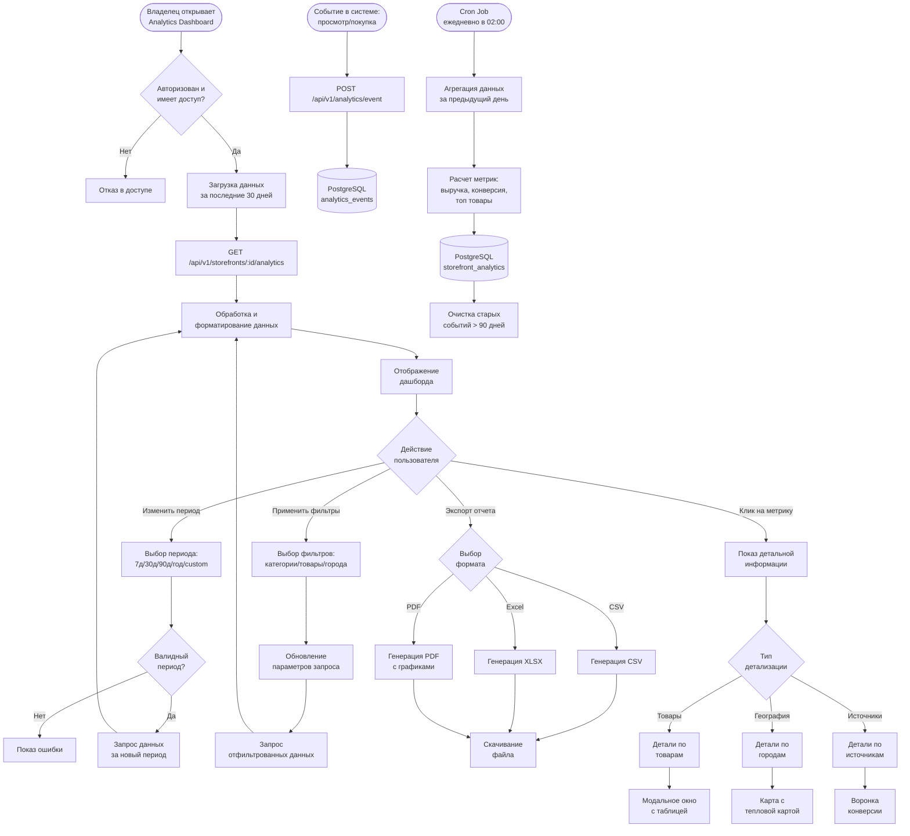

# 📈 Паспорт процесса: Аналитика продаж

## 📋 Метаданные
- **Код**: BP-013
- **Название**: Sales Analytics and Reporting
- **Версия**: 1.0.0
- **Статус**: Active
- **Критичность**: High
- **Владелец**: Analytics Team

## 🎯 Краткое описание

Комплексная система аналитики продаж для витрин, предоставляющая владельцам бизнеса детальные метрики производительности, включая трафик, конверсию, выручку, топ товары и географию продаж. Система автоматически агрегирует данные, визуализирует их через интерактивные дашборды и позволяет экспортировать отчеты для дальнейшего анализа.

## 📊 Диаграмма процесса



## 🔄 Детальный Flow

### 1️⃣ **Сбор аналитических данных**

```typescript
// Frontend: Отправка событий
const trackEvent = async (eventType: string, data: any) => {
  try {
    await api.post('/api/v1/analytics/event', {
      event_type: eventType,
      event_data: {
        ...data,
        timestamp: new Date().toISOString(),
        session_id: getSessionId(),
        user_agent: navigator.userAgent,
        referrer: document.referrer,
      },
    });
  } catch (error) {
    // Не блокируем UI при ошибке аналитики
    console.error('Analytics event failed:', error);
  }
};

// Примеры событий
trackEvent('product_view', {
  product_id: productId,
  storefront_id: storefrontId,
  price: product.price,
  category_id: product.categoryId,
});

trackEvent('add_to_cart', {
  product_id: productId,
  quantity: quantity,
  value: price * quantity,
});

trackEvent('purchase', {
  order_id: orderId,
  items: orderItems,
  total_amount: totalAmount,
  payment_method: paymentMethod,
});
```

### 2️⃣ **Агрегация данных (Backend)**

```go
// Backend: service/analytics_aggregator.go
func (s *AnalyticsService) AggregateDaily(date time.Time) error {
    startOfDay := date.Truncate(24 * time.Hour)
    endOfDay := startOfDay.Add(24 * time.Hour)
    
    // Получение всех активных витрин
    storefronts, err := s.storage.GetActiveStorefronts()
    if err != nil {
        return err
    }
    
    for _, storefront := range storefronts {
        analytics := &StorefrontAnalytics{
            StorefrontID: storefront.ID,
            Date:        startOfDay,
        }
        
        // 1. Трафик и посетители
        trafficStats, err := s.calculateTrafficStats(storefront.ID, startOfDay, endOfDay)
        if err != nil {
            log.Printf("Failed to calculate traffic for storefront %d: %v", storefront.ID, err)
            continue
        }
        analytics.PageViews = trafficStats.PageViews
        analytics.UniqueVisitors = trafficStats.UniqueVisitors
        analytics.BounceRate = trafficStats.BounceRate
        analytics.AvgSessionTime = trafficStats.AvgSessionTime
        
        // 2. Продажи и выручка
        salesStats, err := s.calculateSalesStats(storefront.ID, startOfDay, endOfDay)
        if err != nil {
            log.Printf("Failed to calculate sales for storefront %d: %v", storefront.ID, err)
            continue
        }
        analytics.OrdersCount = salesStats.OrdersCount
        analytics.Revenue = salesStats.Revenue
        analytics.AvgOrderValue = salesStats.AvgOrderValue
        analytics.ConversionRate = salesStats.ConversionRate
        
        // 3. Топ товары
        topProducts, err := s.getTopProducts(storefront.ID, startOfDay, endOfDay, 10)
        if err != nil {
            log.Printf("Failed to get top products for storefront %d: %v", storefront.ID, err)
        }
        analytics.TopProducts = topProducts
        
        // 4. География заказов
        ordersByCity, err := s.getOrdersByCity(storefront.ID, startOfDay, endOfDay)
        if err != nil {
            log.Printf("Failed to get orders by city for storefront %d: %v", storefront.ID, err)
        }
        analytics.OrdersByCity = ordersByCity
        
        // 5. Источники трафика
        trafficSources, err := s.getTrafficSources(storefront.ID, startOfDay, endOfDay)
        if err != nil {
            log.Printf("Failed to get traffic sources for storefront %d: %v", storefront.ID, err)
        }
        analytics.TrafficSources = trafficSources
        
        // Сохранение агрегированных данных
        if err := s.storage.SaveAnalytics(analytics); err != nil {
            log.Printf("Failed to save analytics for storefront %d: %v", storefront.ID, err)
            continue
        }
    }
    
    return nil
}

// Расчет конверсии и воронки продаж
func (s *AnalyticsService) calculateConversionFunnel(storefrontID int64, start, end time.Time) (*ConversionFunnel, error) {
    funnel := &ConversionFunnel{}
    
    // Этапы воронки
    stages := []struct {
        name  string
        event string
        field *int
    }{
        {"Просмотры витрины", "storefront_view", &funnel.StorefrontViews},
        {"Просмотры товаров", "product_view", &funnel.ProductViews},
        {"Добавление в корзину", "add_to_cart", &funnel.AddToCart},
        {"Начало оформления", "checkout_start", &funnel.CheckoutStart},
        {"Завершение покупки", "purchase", &funnel.Purchases},
    }
    
    for _, stage := range stages {
        count, err := s.countEvents(storefrontID, stage.event, start, end)
        if err != nil {
            return nil, err
        }
        *stage.field = count
    }
    
    // Расчет конверсий между этапами
    if funnel.StorefrontViews > 0 {
        funnel.ViewToProductRate = float64(funnel.ProductViews) / float64(funnel.StorefrontViews) * 100
    }
    if funnel.ProductViews > 0 {
        funnel.ProductToCartRate = float64(funnel.AddToCart) / float64(funnel.ProductViews) * 100
    }
    if funnel.AddToCart > 0 {
        funnel.CartToCheckoutRate = float64(funnel.CheckoutStart) / float64(funnel.AddToCart) * 100
    }
    if funnel.CheckoutStart > 0 {
        funnel.CheckoutToPurchaseRate = float64(funnel.Purchases) / float64(funnel.CheckoutStart) * 100
    }
    if funnel.StorefrontViews > 0 {
        funnel.OverallConversionRate = float64(funnel.Purchases) / float64(funnel.StorefrontViews) * 100
    }
    
    return funnel, nil
}
```

### 3️⃣ **Визуализация на Frontend**

```typescript
// Frontend: AnalyticsDashboard.tsx
const AnalyticsDashboard: React.FC = () => {
  const { slug } = useParams();
  const [period, setPeriod] = useState<Period>('30d');
  const [analytics, setAnalytics] = useState<StorefrontAnalytics | null>(null);
  const [loading, setLoading] = useState(true);
  
  // Загрузка данных аналитики
  const fetchAnalytics = async () => {
    setLoading(true);
    try {
      const { from, to } = getPeriodDates(period);
      const response = await api.get(
        `/api/v1/storefronts/slug/${slug}/analytics`,
        { params: { from, to } }
      );
      setAnalytics(response.data.data);
    } catch (error) {
      toast.error(t('analytics.loadError'));
    } finally {
      setLoading(false);
    }
  };
  
  useEffect(() => {
    fetchAnalytics();
  }, [period, slug]);
  
  // Ключевые метрики
  const renderKeyMetrics = () => (
    <div className="grid grid-cols-1 md:grid-cols-2 lg:grid-cols-4 gap-4 mb-8">
      <MetricCard
        title={t('analytics.totalRevenue')}
        value={formatCurrency(analytics.revenue, 'RSD')}
        change={calculateChange(analytics.revenue, analytics.previousRevenue)}
        icon={<DollarSign />}
      />
      <MetricCard
        title={t('analytics.totalOrders')}
        value={analytics.ordersCount}
        change={calculateChange(analytics.ordersCount, analytics.previousOrdersCount)}
        icon={<ShoppingBag />}
      />
      <MetricCard
        title={t('analytics.conversionRate')}
        value={`${analytics.conversionRate.toFixed(2)}%`}
        change={calculateChange(analytics.conversionRate, analytics.previousConversionRate)}
        icon={<TrendingUp />}
      />
      <MetricCard
        title={t('analytics.avgOrderValue')}
        value={formatCurrency(analytics.avgOrderValue, 'RSD')}
        change={calculateChange(analytics.avgOrderValue, analytics.previousAvgOrderValue)}
        icon={<CreditCard />}
      />
    </div>
  );
  
  // График выручки
  const revenueChartData = {
    labels: analytics.dailyData.map(d => formatDate(d.date)),
    datasets: [{
      label: t('analytics.revenue'),
      data: analytics.dailyData.map(d => d.revenue),
      borderColor: 'rgb(75, 192, 192)',
      backgroundColor: 'rgba(75, 192, 192, 0.2)',
    }],
  };
  
  // Топ товары
  const renderTopProducts = () => (
    <div className="card bg-base-100 shadow-xl">
      <div className="card-body">
        <h2 className="card-title">{t('analytics.topProducts')}</h2>
        <div className="overflow-x-auto">
          <table className="table table-zebra">
            <thead>
              <tr>
                <th>{t('analytics.product')}</th>
                <th>{t('analytics.views')}</th>
                <th>{t('analytics.sales')}</th>
                <th>{t('analytics.revenue')}</th>
              </tr>
            </thead>
            <tbody>
              {analytics.topProducts.map((product, idx) => (
                <tr key={product.productId}>
                  <td>
                    <div className="flex items-center space-x-3">
                      <div className="avatar">
                        <div className="mask mask-squircle w-12 h-12">
                          
                        </div>
                      </div>
                      <div>
                        <div className="font-bold">{product.title}</div>
                        <div className="text-sm opacity-50">SKU: {product.sku}</div>
                      </div>
                    </div>
                  </td>
                  <td>{product.views}</td>
                  <td>{product.salesCount}</td>
                  <td>{formatCurrency(product.revenue, 'RSD')}</td>
                </tr>
              ))}
            </tbody>
          </table>
        </div>
      </div>
    </div>
  );
};
```

### 4️⃣ **Экспорт отчетов**

```go
// Backend: handlers/analytics_export.go
func (h *AnalyticsHandler) ExportAnalytics(c *fiber.Ctx) error {
    storefrontID := c.Params("id")
    format := c.Query("format", "csv")
    from := c.Query("from")
    to := c.Query("to")
    
    // Получение данных аналитики
    analytics, err := h.analyticsService.GetAnalytics(storefrontID, from, to)
    if err != nil {
        return utils.ErrorResponse(c, fiber.StatusInternalServerError, "analytics.exportError")
    }
    
    switch format {
    case "csv":
        return h.exportCSV(c, analytics)
    case "xlsx":
        return h.exportExcel(c, analytics)
    case "pdf":
        return h.exportPDF(c, analytics)
    default:
        return utils.ErrorResponse(c, fiber.StatusBadRequest, "analytics.unsupportedFormat")
    }
}

// Экспорт в Excel с несколькими листами
func (h *AnalyticsHandler) exportExcel(c *fiber.Ctx, analytics *StorefrontAnalytics) error {
    file := excelize.NewFile()
    
    // Лист 1: Сводка
    sheet1 := "Summary"
    file.SetSheetName("Sheet1", sheet1)
    
    // Заголовки
    file.SetCellValue(sheet1, "A1", "Metric")
    file.SetCellValue(sheet1, "B1", "Value")
    
    // Данные
    metrics := []struct {
        name  string
        value interface{}
    }{
        {"Total Revenue", analytics.Revenue},
        {"Total Orders", analytics.OrdersCount},
        {"Average Order Value", analytics.AvgOrderValue},
        {"Conversion Rate", fmt.Sprintf("%.2f%%", analytics.ConversionRate)},
        {"Unique Visitors", analytics.UniqueVisitors},
        {"Page Views", analytics.PageViews},
        {"Bounce Rate", fmt.Sprintf("%.2f%%", analytics.BounceRate)},
    }
    
    for i, metric := range metrics {
        row := i + 2
        file.SetCellValue(sheet1, fmt.Sprintf("A%d", row), metric.name)
        file.SetCellValue(sheet1, fmt.Sprintf("B%d", row), metric.value)
    }
    
    // Лист 2: Топ товары
    sheet2 := "Top Products"
    file.NewSheet(sheet2)
    
    // Заголовки
    headers := []string{"Product", "SKU", "Views", "Sales", "Revenue"}
    for i, header := range headers {
        col := string(rune('A' + i))
        file.SetCellValue(sheet2, fmt.Sprintf("%s1", col), header)
    }
    
    // Данные товаров
    for i, product := range analytics.TopProducts {
        row := i + 2
        file.SetCellValue(sheet2, fmt.Sprintf("A%d", row), product.Title)
        file.SetCellValue(sheet2, fmt.Sprintf("B%d", row), product.SKU)
        file.SetCellValue(sheet2, fmt.Sprintf("C%d", row), product.Views)
        file.SetCellValue(sheet2, fmt.Sprintf("D%d", row), product.SalesCount)
        file.SetCellValue(sheet2, fmt.Sprintf("E%d", row), product.Revenue)
    }
    
    // Лист 3: География продаж
    sheet3 := "Sales by City"
    file.NewSheet(sheet3)
    
    file.SetCellValue(sheet3, "A1", "City")
    file.SetCellValue(sheet3, "B1", "Orders")
    
    row := 2
    for city, count := range analytics.OrdersByCity {
        file.SetCellValue(sheet3, fmt.Sprintf("A%d", row), city)
        file.SetCellValue(sheet3, fmt.Sprintf("B%d", row), count)
        row++
    }
    
    // Стилизация
    style, _ := file.NewStyle(&excelize.Style{
        Font: &excelize.Font{Bold: true},
        Fill: excelize.Fill{Type: "pattern", Color: []string{"#E0E0E0"}, Pattern: 1},
    })
    
    // Применение стилей к заголовкам
    for _, sheet := range []string{sheet1, sheet2, sheet3} {
        file.SetCellStyle(sheet, "A1", "Z1", style)
    }
    
    // Отправка файла
    var buf bytes.Buffer
    if err := file.Write(&buf); err != nil {
        return utils.ErrorResponse(c, fiber.StatusInternalServerError, "analytics.exportError")
    }
    
    filename := fmt.Sprintf("analytics_%s_%s.xlsx", 
        analytics.StorefrontName, 
        time.Now().Format("2006-01-02"))
    
    c.Set("Content-Type", "application/vnd.openxmlformats-officedocument.spreadsheetml.sheet")
    c.Set("Content-Disposition", fmt.Sprintf("attachment; filename=%s", filename))
    
    return c.Send(buf.Bytes())
}
```

### 5️⃣ **Воронка продаж и конверсии**

```typescript
// Frontend: ConversionFunnel.tsx
const ConversionFunnel: React.FC<{ data: FunnelData }> = ({ data }) => {
  const stages = [
    { name: t('funnel.storefrontViews'), value: data.storefrontViews, color: '#8884d8' },
    { name: t('funnel.productViews'), value: data.productViews, color: '#83a6ed' },
    { name: t('funnel.addToCart'), value: data.addToCart, color: '#8dd1e1' },
    { name: t('funnel.checkoutStart'), value: data.checkoutStart, color: '#82ca9d' },
    { name: t('funnel.purchases'), value: data.purchases, color: '#a4de6c' },
  ];
  
  return (
    <div className="card bg-base-100 shadow-xl">
      <div className="card-body">
        <h2 className="card-title">{t('analytics.conversionFunnel')}</h2>
        
        <ResponsiveContainer width="100%" height={400}>
          <FunnelChart>
            <Tooltip />
            <Funnel dataKey="value" data={stages} isAnimationActive>
              {stages.map((entry, index) => (
                <Cell key={`cell-${index}`} fill={entry.color} />
              ))}
              <LabelList position="center" fill="#fff" stroke="none" />
            </Funnel>
          </FunnelChart>
        </ResponsiveContainer>
        
        <div className="mt-4 space-y-2">
          {stages.slice(0, -1).map((stage, idx) => {
            const nextStage = stages[idx + 1];
            const conversionRate = (nextStage.value / stage.value * 100).toFixed(2);
            return (
              <div key={idx} className="flex justify-between items-center">
                <span className="text-sm">{stage.name} → {nextStage.name}</span>
                <span className="badge badge-primary">{conversionRate}%</span>
              </div>
            );
          })}
        </div>
      </div>
    </div>
  );
};
```

## 🔐 Безопасность и валидация

### Контроль доступа
- ✅ JWT токен для всех запросов
- ✅ Проверка владения витриной или роли персонала
- ✅ Ограничение доступа к аналитике по ролям
- ✅ Изоляция данных между витринами

### Защита данных
- ✅ Агрегированные данные без PII
- ✅ Шифрование sensitive метрик в БД
- ✅ Логирование доступа к аналитике
- ✅ Rate limiting для предотвращения scraping

### Валидация
- ✅ Проверка дат (не больше 2 лет назад)
- ✅ Валидация форматов экспорта
- ✅ Ограничение размера экспортируемых данных

## 📊 Аналитика самой аналитики

### Метрики использования
```typescript
// Отслеживание использования дашборда
analytics.track('analytics_dashboard_viewed', {
  user_id: userId,
  storefront_id: storefrontId,
  period_selected: period,
  export_format: null,
});

analytics.track('analytics_exported', {
  user_id: userId,
  storefront_id: storefrontId,
  format: format,
  period: period,
  file_size: fileSize,
});

analytics.track('analytics_filter_applied', {
  user_id: userId,
  filter_type: filterType,
  filter_value: filterValue,
});
```

### KPI метрики дашборда
- **Dashboard Usage Rate**: % активных витрин, просматривающих аналитику
- **Export Frequency**: среднее количество экспортов на витрину
- **Popular Metrics**: наиболее просматриваемые метрики
- **Average Session Time**: время, проведенное в аналитике
- **Filter Usage**: популярные фильтры и группировки

## 🧪 Тестирование

### Unit тесты
```go
// Backend: analytics_service_test.go
func TestCalculateConversionRate(t *testing.T) {
    service := NewAnalyticsService()
    
    // Тест с нормальными данными
    rate := service.calculateConversionRate(1000, 50)
    assert.Equal(t, 5.0, rate)
    
    // Тест с нулевыми просмотрами
    rate = service.calculateConversionRate(0, 0)
    assert.Equal(t, 0.0, rate)
}

func TestAggregateDaily(t *testing.T) {
    service := NewAnalyticsService()
    date := time.Date(2024, 1, 1, 0, 0, 0, 0, time.UTC)
    
    // Создание тестовых событий
    createTestEvents(date)
    
    // Запуск агрегации
    err := service.AggregateDaily(date)
    assert.NoError(t, err)
    
    // Проверка результатов
    analytics, err := service.GetAnalytics(testStorefrontID, date, date)
    assert.NoError(t, err)
    assert.Equal(t, 100, analytics.PageViews)
    assert.Equal(t, 5, analytics.OrdersCount)
}
```

### Integration тесты
```typescript
// Frontend: AnalyticsDashboard.test.tsx
describe('AnalyticsDashboard', () => {
  it('should load and display analytics data', async () => {
    const mockData = generateMockAnalytics();
    mockAPI.get.mockResolvedValue({ data: { data: mockData } });
    
    const { getByText, getByTestId } = render(
      <AnalyticsDashboard storefrontSlug="test-store" />
    );
    
    // Ожидание загрузки
    await waitFor(() => {
      expect(getByText(formatCurrency(mockData.revenue, 'RSD'))).toBeInTheDocument();
    });
    
    // Проверка ключевых метрик
    expect(getByTestId('orders-count')).toHaveTextContent(mockData.ordersCount);
    expect(getByTestId('conversion-rate')).toHaveTextContent(`${mockData.conversionRate}%`);
  });
  
  it('should export analytics in different formats', async () => {
    const { getByText } = render(<AnalyticsDashboard />);
    
    // Клик на экспорт
    fireEvent.click(getByText('Export'));
    fireEvent.click(getByText('Excel'));
    
    // Проверка вызова API
    expect(mockAPI.get).toHaveBeenCalledWith(
      expect.stringContaining('/analytics/export?format=xlsx')
    );
  });
});
```

## ⚡ Производительность и оптимизации

### Backend оптимизации
- 🚀 Материализованные представления для частых запросов
- 🚀 Партиционирование таблицы событий по дате
- 🚀 Индексы на часто используемых полях
- 🚀 Кеширование агрегированных данных в Redis
- 🚀 Batch обработка событий

### Frontend оптимизации
- 🚀 Lazy loading для графиков
- 🚀 Мемоизация вычислений
- 🚀 Виртуализация больших таблиц
- 🚀 Дебаунс для фильтров
- 🚀 Progressive loading для больших периодов

### Рекомендации по масштабированию
- 📈 Использование ClickHouse для аналитических запросов
- 📈 Отдельный read-only replica для аналитики
- 📈 CDN для статических дашбордов
- 📈 Предрасчет популярных отчетов
- 📈 Архивирование старых данных

## 🐛 Известные проблемы и ограничения

1. **Real-time**: Данные обновляются раз в день, нет real-time метрик
2. **Сравнение периодов**: Отсутствует функция сравнения периодов
3. **Кастомные отчеты**: Нет конструктора произвольных отчетов
4. **API для внешних систем**: Отсутствует webhook API
5. **Мобильная версия**: Графики не оптимизированы для мобильных

## 🔄 Связанные процессы

- **[BP-012] Управление товарами** - источник данных о товарах
- **[BP-006] Процесс покупки** - источник данных о транзакциях
- **[BP-010] Создание витрины** - настройка аналитики при создании
- **[BP-005] Работа с отзывами** - влияние на метрики конверсии

## 📚 Дополнительные ресурсы

- [API документация Analytics](/docs/api/analytics)
- [Руководство по метрикам](/docs/analytics-metrics-guide)
- [Настройка Google Analytics](/docs/ga-integration)
- [Экспорт данных для BI систем](/docs/bi-export)