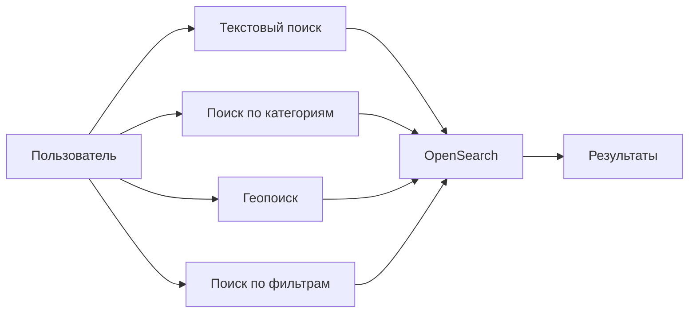
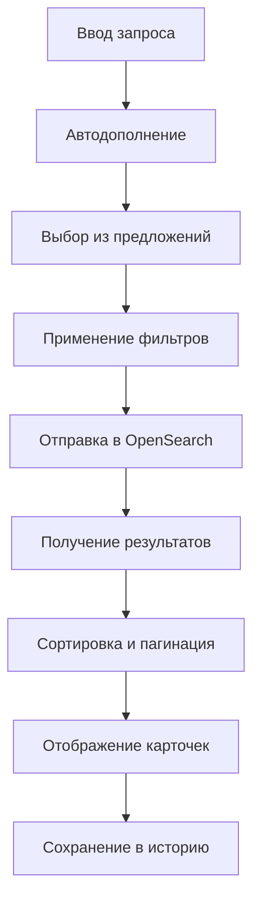
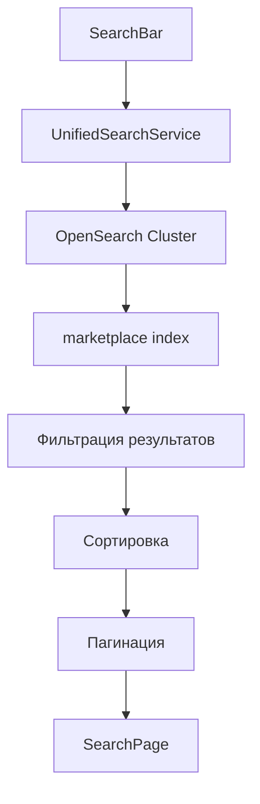

# Паспорт бизнес-процесса: Поиск и фильтрация

## 🎯 Назначение процесса

Обеспечение быстрого и точного поиска товаров на платформе Sve Tu через интеграцию с OpenSearch, многоуровневую фильтрацию, автодополнение, геопоиск и персонализированные рекомендации с сохранением истории поисков.

## 🔄 Схема процесса

### 1. **Типы поиска**


### 2. **Процесс поиска с фильтрацией**


### 3. **Архитектура поисковой системы**


## 🏗️ Архитектурные компоненты

### **Frontend компоненты**
- **SearchBar** - универсальная строка поиска с автодополнением
- **SearchPage** - страница результатов поиска с фильтрацией
- **MarketplaceFilters** - панель фильтров по категориям и атрибутам
- **UnifiedSearchService** - централизованный сервис OpenSearch
- **ViewToggle** - переключатель grid/list режимов просмотра

### **Backend endpoints**
- `GET /search/unified` - универсальный поиск
- `GET /search/suggestions` - автодополнение
- `GET /search/filters` - доступные фильтры
- `GET /marketplace/categories` - иерархия категорий
- `POST /search/analytics` - трекинг поисковых запросов

### **OpenSearch структура**
- **marketplace index** - основной индекс товаров
- **suggestions index** - автодополнение и популярные запросы
- **analytics index** - статистика поисков и кликов

### **База данных**
- `marketplace_listings` - источник данных для индексации
- `search_history` - история поисков пользователей
- `popular_searches` - популярные поисковые запросы
- `user_search_preferences` - персональные настройки поиска

## 📋 Детальный flow процесса

### **Этап 1: Инициация поиска**
1. **Ввод в SearchBar**:
   ```typescript
   const SearchBar: React.FC = () => {
     const [query, setQuery] = useState('');
     const [suggestions, setSuggestions] = useState<string[]>([]);
     
     const handleInputChange = useMemo(
       () => debounce(async (value: string) => {
         if (value.length >= 2) {
           const suggestions = await searchService.getSuggestions(value);
           setSuggestions(suggestions);
         }
       }, 300),
       []
     );
   };
   ```

2. **Автодополнение**:
   ```json
   {
     "query": {
       "multi_match": {
         "query": "iphon",
         "fields": [
           "title.suggest^3",
           "description.suggest",
           "category_name.suggest^2"
         ],
         "type": "bool_prefix",
         "fuzziness": "AUTO"
       }
     },
     "suggest": {
       "title_suggest": {
         "prefix": "iphon",
         "completion": {
           "field": "title.suggest",
           "size": 10,
           "fuzzy": {"fuzziness": "AUTO"}
         }
       }
     }
   }
   ```

### **Этап 2: Обработка поискового запроса**
1. **Парсинг запроса**:
   ```go
   type SearchQuery struct {
       Text         string              `json:"text"`
       CategoryID   *int                `json:"category_id,omitempty"`
       PriceMin     *float64            `json:"price_min,omitempty"`
       PriceMax     *float64            `json:"price_max,omitempty"`
       Location     *LocationFilter     `json:"location,omitempty"`
       Attributes   map[string][]string `json:"attributes,omitempty"`
       SortBy       string              `json:"sort_by"` // relevance, price_asc, price_desc, date_desc
       Page         int                 `json:"page"`
       Limit        int                 `json:"limit"`
   }
   
   type LocationFilter struct {
       Latitude  float64 `json:"lat"`
       Longitude float64 `json:"lng"`
       Radius    int     `json:"radius"` // в километрах
   }
   ```

2. **Построение OpenSearch запроса**:
   ```go
   func BuildSearchQuery(sq *SearchQuery) map[string]interface{} {
       query := map[string]interface{}{
           "bool": map[string]interface{}{
               "must": []interface{}{},
               "filter": []interface{}{},
           },
       }
       
       // Текстовый поиск
       if sq.Text != "" {
           textQuery := map[string]interface{}{
               "multi_match": map[string]interface{}{
                   "query": sq.Text,
                   "fields": []string{
                       "title^3",           // больший вес для заголовка
                       "description^1",      // обычный вес для описания
                       "category_name^2",    // средний вес для категории
                       "attributes.value^1", // поиск по атрибутам
                   },
                   "type": "best_fields",
                   "fuzziness": "AUTO",
                   "minimum_should_match": "75%",
               },
           }
           query["bool"].(map[string]interface{})["must"] = append(
               query["bool"].(map[string]interface{})["must"].([]interface{}),
               textQuery,
           )
       }
       
       // Фильтр по категории
       if sq.CategoryID != nil {
           categoryFilter := map[string]interface{}{
               "term": map[string]interface{}{
                   "category_id": *sq.CategoryID,
               },
           }
           query["bool"].(map[string]interface{})["filter"] = append(
               query["bool"].(map[string]interface{})["filter"].([]interface{}),
               categoryFilter,
           )
       }
       
       // Фильтр по цене
       if sq.PriceMin != nil || sq.PriceMax != nil {
           priceFilter := map[string]interface{}{
               "range": map[string]interface{}{
                   "price": map[string]interface{}{},
               },
           }
           if sq.PriceMin != nil {
               priceFilter["range"].(map[string]interface{})["price"].(map[string]interface{})["gte"] = *sq.PriceMin
           }
           if sq.PriceMax != nil {
               priceFilter["range"].(map[string]interface{})["price"].(map[string]interface{})["lte"] = *sq.PriceMax
           }
           query["bool"].(map[string]interface{})["filter"] = append(
               query["bool"].(map[string]interface{})["filter"].([]interface{}),
               priceFilter,
           )
       }
       
       // Геофильтр
       if sq.Location != nil {
           geoFilter := map[string]interface{}{
               "geo_distance": map[string]interface{}{
                   "distance": fmt.Sprintf("%dkm", sq.Location.Radius),
                   "location": map[string]interface{}{
                       "lat": sq.Location.Latitude,
                       "lon": sq.Location.Longitude,
                   },
               },
           }
           query["bool"].(map[string]interface{})["filter"] = append(
               query["bool"].(map[string]interface{})["filter"].([]interface{}),
               geoFilter,
           )
       }
       
       return query
   }
   ```

### **Этап 3: Фильтрация и сортировка**
1. **Динамические фильтры по атрибутам**:
   ```typescript
   interface FilterOption {
     name: string;
     value: string;
     count: number; // количество товаров с этим фильтром
   }
   
   interface CategoryFilter {
     attribute_id: number;
     attribute_name: string;
     type: 'select' | 'range' | 'checkbox';
     options: FilterOption[];
   }
   
   // Пример фильтров для категории "Смартфоны"
   const smartphoneFilters: CategoryFilter[] = [
     {
       attribute_id: 1,
       attribute_name: "Бренд",
       type: "checkbox",
       options: [
         { name: "Apple", value: "apple", count: 245 },
         { name: "Samsung", value: "samsung", count: 189 },
         { name: "Xiaomi", value: "xiaomi", count: 156 },
       ]
     },
     {
       attribute_id: 2,
       attribute_name: "Объем памяти",
       type: "checkbox", 
       options: [
         { name: "64GB", value: "64gb", count: 89 },
         { name: "128GB", value: "128gb", count: 134 },
         { name: "256GB", value: "256gb", count: 67 },
       ]
     }
   ];
   ```

2. **Aggregations для получения фильтров**:
   ```json
   {
     "aggs": {
       "brands": {
         "nested": {"path": "attributes"},
         "aggs": {
           "brand_filter": {
             "filter": {"term": {"attributes.name": "brand"}},
             "aggs": {
               "brand_values": {
                 "terms": {
                   "field": "attributes.value.keyword",
                   "size": 20
                 }
               }
             }
           }
         }
       },
       "price_stats": {
         "stats": {"field": "price"}
       },
       "categories": {
         "terms": {
           "field": "category_id",
           "size": 50
         }
       }
     }
   }
   ```

3. **Сортировка результатов**:
   ```go
   func BuildSortQuery(sortBy string) []map[string]interface{} {
       switch sortBy {
       case "price_asc":
           return []map[string]interface{}{
               {"price": map[string]interface{}{"order": "asc"}},
           }
       case "price_desc":
           return []map[string]interface{}{
               {"price": map[string]interface{}{"order": "desc"}},
           }
       case "date_desc":
           return []map[string]interface{}{
               {"created_at": map[string]interface{}{"order": "desc"}},
           }
       case "relevance":
           return []map[string]interface{}{
               {"_score": map[string]interface{}{"order": "desc"}},
           }
       default:
           // Гибридная сортировка: релевантность + свежесть
           return []map[string]interface{}{
               {
                   "_script": map[string]interface{}{
                       "type": "number",
                       "script": map[string]interface{}{
                           "source": "_score * Math.log(2 + (System.currentTimeMillis() - doc['created_at'].value.getMillis()) / 86400000)",
                       },
                       "order": "desc",
                   },
               },
           }
       }
   }
   ```

### **Этап 4: Отображение результатов**
1. **SearchPage компонент**:
   ```typescript
   const SearchPage: React.FC = () => {
     const [results, setResults] = useState<SearchResult[]>([]);
     const [filters, setFilters] = useState<CategoryFilter[]>([]);
     const [loading, setLoading] = useState(false);
     const [totalCount, setTotalCount] = useState(0);
     const [currentPage, setCurrentPage] = useState(1);
     
     const performSearch = async (searchParams: SearchQuery) => {
       setLoading(true);
       try {
         const response = await searchService.search(searchParams);
         setResults(response.hits);
         setFilters(response.aggregations);
         setTotalCount(response.total);
       } finally {
         setLoading(false);
       }
     };
     
     return (
       <div className="search-page">
         <div className="filters-sidebar">
           <MarketplaceFilters 
             filters={filters}
             onFilterChange={handleFilterChange}
           />
         </div>
         <div className="results-area">
           <SearchResults
             results={results}
             loading={loading}
             viewMode={viewMode}
           />
           <Pagination
             currentPage={currentPage}
             totalPages={Math.ceil(totalCount / ITEMS_PER_PAGE)}
             onPageChange={setCurrentPage}
           />
         </div>
       </div>
     );
   };
   ```

2. **Infinite scroll для результатов**:
   ```typescript
   const InfiniteSearchResults: React.FC = () => {
     const [results, setResults] = useState<SearchResult[]>([]);
     const [hasMore, setHasMore] = useState(true);
     const [page, setPage] = useState(1);
     
     const loadMore = useCallback(async () => {
       if (!hasMore) return;
       
       const nextResults = await searchService.search({
         ...currentQuery,
         page: page + 1,
       });
       
       setResults(prev => [...prev, ...nextResults.hits]);
       setHasMore(nextResults.hits.length === ITEMS_PER_PAGE);
       setPage(prev => prev + 1);
     }, [currentQuery, page, hasMore]);
     
     return (
       <InfiniteScrollTrigger
         items={results}
         loadMore={loadMore}
         hasMore={hasMore}
         renderItem={(item) => <MarketplaceCard listing={item} />}
       />
     );
   };
   ```

## 🔍 Расширенные возможности поиска

### **Семантический поиск**
```json
{
  "query": {
    "script_score": {
      "query": {"match_all": {}},
      "script": {
        "source": """
          // Boost популярные товары
          double popularityScore = Math.log(2 + doc['view_count'].value);
          
          // Boost свежие объявления
          long ageInDays = (System.currentTimeMillis() - doc['created_at'].value.getMillis()) / 86400000;
          double freshnessScore = Math.exp(-ageInDays / 30.0);
          
          // Boost по рейтингу продавца
          double sellerScore = doc['seller_rating'].size() > 0 ? doc['seller_rating'].value : 3.0;
          
          return _score * popularityScore * freshnessScore * (sellerScore / 5.0);
        """
      }
    }
  }
}
```

### **Faceted search по атрибутам**
```go
func BuildFacetedQuery(categoryID int) map[string]interface{} {
    return map[string]interface{}{
        "size": 0, // только aggregations
        "query": map[string]interface{}{
            "term": map[string]interface{}{
                "category_id": categoryID,
            },
        },
        "aggs": map[string]interface{}{
            "attributes": map[string]interface{}{
                "nested": map[string]interface{}{
                    "path": "attributes",
                },
                "aggs": map[string]interface{}{
                    "attribute_names": map[string]interface{}{
                        "terms": map[string]interface{}{
                            "field": "attributes.name.keyword",
                            "size": 50,
                        },
                        "aggs": map[string]interface{}{
                            "attribute_values": map[string]interface{}{
                                "terms": map[string]interface{}{
                                    "field": "attributes.value.keyword",
                                    "size": 20,
                                },
                            },
                        },
                    },
                },
            },
        },
    }
}
```

### **Геопоиск с картой**
```typescript
interface GeoSearchProps {
  center: {lat: number, lng: number};
  radius: number; // в км
  onLocationChange: (location: {lat: number, lng: number}) => void;
}

const GeoSearchMap: React.FC<GeoSearchProps> = ({ center, radius, onLocationChange }) => {
  const [map, setMap] = useState<google.maps.Map | null>(null);
  const [circle, setCircle] = useState<google.maps.Circle | null>(null);
  
  useEffect(() => {
    if (map) {
      // Создание circle для радиуса поиска
      const searchCircle = new google.maps.Circle({
        map,
        center,
        radius: radius * 1000, // переводим км в метры
        fillColor: '#4285F4',
        fillOpacity: 0.1,
        strokeColor: '#4285F4',
        strokeOpacity: 0.5,
        strokeWeight: 2,
      });
      
      setCircle(searchCircle);
      
      // Обработчик перетаскивания центра
      const marker = new google.maps.Marker({
        position: center,
        map,
        draggable: true,
      });
      
      marker.addListener('dragend', () => {
        const position = marker.getPosition();
        if (position) {
          onLocationChange({
            lat: position.lat(),
            lng: position.lng(),
          });
        }
      });
    }
  }, [map, center, radius]);
  
  return <Map onLoad={setMap} center={center} zoom={13} />;
};
```

## 📊 Персонализация и рекомендации

### **История поисков**
```go
type SearchHistory struct {
    ID        int       `json:"id"`
    UserID    int       `json:"user_id"`
    Query     string    `json:"query"`
    Filters   JSON      `json:"filters"`
    Results   int       `json:"results_count"`
    CreatedAt time.Time `json:"created_at"`
}

func SaveSearchHistory(userID int, query *SearchQuery, resultsCount int) {
    history := &SearchHistory{
        UserID:  userID,
        Query:   query.Text,
        Filters: query.Filters,
        Results: resultsCount,
    }
    
    db.Create(history)
    
    // Ограничиваем историю последними 100 поисками
    db.Where("user_id = ?", userID).
      Order("created_at DESC").
      Offset(100).
      Delete(&SearchHistory{})
}
```

### **Популярные поиски**
```sql
-- Топ поисковых запросов за неделю
SELECT 
    query,
    COUNT(*) as search_count,
    AVG(results_count) as avg_results,
    COUNT(DISTINCT user_id) as unique_users
FROM search_history 
WHERE created_at >= CURRENT_DATE - INTERVAL '7 days'
    AND query != ''
GROUP BY query
HAVING COUNT(*) >= 5
ORDER BY search_count DESC
LIMIT 20;
```

### **Персонализированные предложения**
```go
func GetPersonalizedSuggestions(userID int) ([]string, error) {
    // Получаем историю поисков пользователя
    var history []SearchHistory
    db.Where("user_id = ?", userID).
      Order("created_at DESC").
      Limit(20).
      Find(&history)
    
    // Извлекаем ключевые слова
    keywords := extractKeywords(history)
    
    // Ищем похожие товары
    suggestions := findSimilarListings(keywords)
    
    // Добавляем трендовые поиски
    trending := getTrendingSearches()
    
    return mergeSuggestions(suggestions, trending), nil
}
```

## 🎯 A/B тестирование поиска

### **Варианты алгоритмов**
```go
type SearchAlgorithm string

const (
    AlgorithmStandard   SearchAlgorithm = "standard"   // стандартный BM25
    AlgorithmSemantic   SearchAlgorithm = "semantic"   // с учетом семантики
    AlgorithmPersonalized SearchAlgorithm = "personalized" // персонализированный
)

func GetSearchAlgorithm(userID int) SearchAlgorithm {
    // A/B тест: 50% standard, 30% semantic, 20% personalized
    hash := fnv.New32a()
    hash.Write([]byte(fmt.Sprintf("search_algo_%d", userID)))
    value := hash.Sum32() % 100
    
    switch {
    case value < 50:
        return AlgorithmStandard
    case value < 80:
        return AlgorithmSemantic
    default:
        return AlgorithmPersonalized
    }
}
```

### **Метрики A/B тестов**
```go
type SearchMetrics struct {
    Algorithm    SearchAlgorithm `json:"algorithm"`
    UserID       int            `json:"user_id"`
    Query        string         `json:"query"`
    ResultsCount int            `json:"results_count"`
    ClickedItems []int          `json:"clicked_items"`
    TimeSpent    time.Duration  `json:"time_spent"`
    Converted    bool           `json:"converted"` // открыл чат с продавцом
}

func TrackSearchMetrics(metrics *SearchMetrics) {
    // Отправка в аналитику
    analytics.Track("search_performed", map[string]interface{}{
        "algorithm":     string(metrics.Algorithm),
        "user_id":       metrics.UserID,
        "query_length":  len(metrics.Query),
        "results_count": metrics.ResultsCount,
        "ctr":          float64(len(metrics.ClickedItems)) / float64(metrics.ResultsCount),
        "time_spent":   metrics.TimeSpent.Seconds(),
        "converted":    metrics.Converted,
    })
}
```

## 🔐 Безопасность поиска

### **Защита от injection атак**
```go
func SanitizeSearchQuery(query string) string {
    // Удаляем опасные символы для OpenSearch
    dangerous := []string{
        "script:", "javascript:", "<script", "</script>",
        "eval(", "alert(", "document.", "window.",
    }
    
    cleaned := query
    for _, danger := range dangerous {
        cleaned = strings.ReplaceAll(cleaned, danger, "")
    }
    
    // Ограничиваем длину запроса
    if len(cleaned) > 200 {
        cleaned = cleaned[:200]
    }
    
    return cleaned
}
```

### **Rate limiting для поиска**
```go
const (
    SearchRateLimit     = 30  // запросов в минуту
    SuggestionRateLimit = 60  // автодополнение более частое
)

func CheckSearchRateLimit(userID int) error {
    key := fmt.Sprintf("search_rate_limit:%d", userID)
    
    count, err := redis.Incr(key)
    if err != nil {
        return err
    }
    
    if count == 1 {
        redis.Expire(key, time.Minute)
    }
    
    if count > SearchRateLimit {
        return errors.New("search rate limit exceeded")
    }
    
    return nil
}
```

### **Фильтрация неподходящего контента**
```go
func FilterInappropriateContent(results []SearchResult) []SearchResult {
    filtered := make([]SearchResult, 0, len(results))
    
    for _, result := range results {
        // Проверяем на запрещенные категории
        if result.CategoryID == 666 { // например, категория для взрослых
            continue
        }
        
        // Проверяем заголовок на неподходящие слова
        if containsInappropriateWords(result.Title) {
            continue
        }
        
        filtered = append(filtered, result)
    }
    
    return filtered
}
```

## 📈 Аналитика поиска

### **Ключевые метрики**
```sql
-- CTR (Click-Through Rate) по поисковым запросам
WITH search_stats AS (
  SELECT 
    query,
    COUNT(*) as total_searches,
    COUNT(CASE WHEN clicked_items IS NOT NULL THEN 1 END) as searches_with_clicks,
    AVG(JSON_LENGTH(clicked_items)) as avg_clicks_per_search
  FROM search_history 
  WHERE created_at >= CURRENT_DATE - INTERVAL '7 days'
  GROUP BY query
)
SELECT 
  query,
  total_searches,
  ROUND(searches_with_clicks * 100.0 / total_searches, 2) as ctr_percentage,
  avg_clicks_per_search
FROM search_stats
WHERE total_searches >= 10
ORDER BY ctr_percentage DESC
LIMIT 20;
```

### **Анализ пустых результатов**
```go
func AnalyzeZeroResults() {
    // Находим запросы без результатов
    var zeroResultQueries []SearchHistory
    db.Where("results_count = 0").
      Where("created_at >= ?", time.Now().AddDate(0, 0, -7)).
      Find(&zeroResultQueries)
    
    // Группируем по похожим запросам
    grouped := groupSimilarQueries(zeroResultQueries)
    
    // Отправляем отчет для улучшения алгоритма
    for pattern, count := range grouped {
        if count >= 5 { // минимум 5 запросов
            analytics.Track("zero_results_pattern", map[string]interface{}{
                "pattern": pattern,
                "count":   count,
                "suggestions": generateImprovementSuggestions(pattern),
            })
        }
    }
}
```

### **Heatmap популярности**
```typescript
interface SearchHeatmapData {
  query: string;
  frequency: number;
  avgPosition: number; // средняя позиция клика
  conversionRate: number;
}

const SearchHeatmap: React.FC = () => {
  const [heatmapData, setHeatmapData] = useState<SearchHeatmapData[]>([]);
  
  useEffect(() => {
    // Загружаем данные популярности поисков
    loadSearchHeatmapData().then(setHeatmapData);
  }, []);
  
  return (
    <div className="search-heatmap">
      {heatmapData.map(item => (
        <div 
          key={item.query}
          className="heatmap-cell"
          style={{
            backgroundColor: `hsla(200, 100%, 50%, ${item.frequency / 100})`,
          }}
        >
          <span>{item.query}</span>
          <small>{item.frequency} поисков</small>
        </div>
      ))}
    </div>
  );
};
```

## ❌ Обработка ошибок

### **Типичные ошибки поиска**
1. **OpenSearch недоступен**:
   ```json
   {
     "success": false,
     "error": "search.service.unavailable",
     "message": "Поиск временно недоступен",
     "fallback": {
       "use_database": true,
       "limited_results": true
     }
   }
   ```

2. **Некорректный запрос**:
   ```json
   {
     "success": false,
     "error": "search.query.invalid",
     "message": "Поисковый запрос содержит недопустимые символы",
     "details": {
       "invalid_chars": ["<", ">", "script:"]
     }
   }
   ```

3. **Превышение лимитов**:
   ```json
   {
     "success": false,
     "error": "search.rate.limit.exceeded", 
     "message": "Слишком много поисковых запросов",
     "retry_after": "60s"
   }
   ```

### **Fallback стратегии**
```go
func SearchWithFallback(query *SearchQuery) (*SearchResponse, error) {
    // Основной поиск через OpenSearch
    result, err := searchInOpenSearch(query)
    if err == nil {
        return result, nil
    }
    
    log.Warn("OpenSearch failed, falling back to database", "error", err)
    
    // Fallback: простой поиск по PostgreSQL
    fallbackResult, err := searchInDatabase(query)
    if err != nil {
        return nil, fmt.Errorf("both search methods failed: %w", err)
    }
    
    // Помечаем результат как fallback
    fallbackResult.IsFallback = true
    fallbackResult.Message = "Результаты могут быть неполными"
    
    return fallbackResult, nil
}

func searchInDatabase(query *SearchQuery) (*SearchResponse, error) {
    // Простой LIKE поиск в PostgreSQL
    db := database.GetDB()
    
    baseQuery := db.Table("marketplace_listings").
        Where("status = ?", "active")
    
    if query.Text != "" {
        baseQuery = baseQuery.Where(
            "title ILIKE ? OR description ILIKE ?",
            "%"+query.Text+"%", "%"+query.Text+"%",
        )
    }
    
    if query.CategoryID != nil {
        baseQuery = baseQuery.Where("category_id = ?", *query.CategoryID)
    }
    
    var listings []models.Listing
    err := baseQuery.Limit(query.Limit).Offset((query.Page-1)*query.Limit).Find(&listings).Error
    
    return &SearchResponse{
        Hits:       convertToSearchResults(listings),
        Total:      len(listings),
        IsFallback: true,
    }, err
}
```

## 🧪 Тестирование

### **Unit тесты**
```go
func TestSearchQueryBuilder(t *testing.T) {
    query := &SearchQuery{
        Text:       "iPhone 12",
        CategoryID: intPtr(5),
        PriceMin:   floatPtr(30000),
        PriceMax:   floatPtr(60000),
    }
    
    opensearchQuery := BuildSearchQuery(query)
    
    // Проверяем структуру запроса
    assert.Contains(t, opensearchQuery, "bool")
    assert.Contains(t, opensearchQuery["bool"], "must")
    assert.Contains(t, opensearchQuery["bool"], "filter")
    
    // Проверяем наличие multi_match для текста
    mustClauses := opensearchQuery["bool"].(map[string]interface{})["must"].([]interface{})
    assert.Len(t, mustClauses, 1)
    
    multiMatch := mustClauses[0].(map[string]interface{})["multi_match"]
    assert.Equal(t, "iPhone 12", multiMatch.(map[string]interface{})["query"])
}
```

### **Integration тесты**
```go
func TestSearchEndToEnd(t *testing.T) {
    // Создаем тестовые данные
    testListing := &models.Listing{
        Title:       "iPhone 12 Pro 128GB",
        Description: "Excellent condition iPhone",
        Price:       45000,
        CategoryID:  5,
        Status:      "active",
    }
    
    // Индексируем в OpenSearch
    err := indexListing(testListing)
    assert.NoError(t, err)
    
    // Ждем индексации
    time.Sleep(1 * time.Second)
    
    // Выполняем поиск
    results, err := searchService.Search(&SearchQuery{
        Text:  "iPhone",
        Limit: 10,
        Page:  1,
    })
    
    assert.NoError(t, err)
    assert.Greater(t, len(results.Hits), 0)
    assert.Contains(t, results.Hits[0].Title, "iPhone")
}
```

### **Performance тесты**
```go
func BenchmarkSearch(b *testing.B) {
    searchQuery := &SearchQuery{
        Text:  "test query",
        Limit: 20,
        Page:  1,
    }
    
    b.ResetTimer()
    
    for i := 0; i < b.N; i++ {
        _, err := searchService.Search(searchQuery)
        if err != nil {
            b.Fatal(err)
        }
    }
}

// Результат должен быть < 100ms на запрос
```

## 🚀 Производительность

### **Кеширование результатов**
```go
var searchCache = sync.Map{}

func SearchWithCache(query *SearchQuery) (*SearchResponse, error) {
    // Создаем ключ кеша
    cacheKey := generateCacheKey(query)
    
    // Проверяем кеш
    if cached, ok := searchCache.Load(cacheKey); ok {
        cachedResult := cached.(*SearchResponse)
        // Проверяем актуальность (5 минут)
        if time.Since(cachedResult.CachedAt) < 5*time.Minute {
            return cachedResult, nil
        }
    }
    
    // Выполняем поиск
    result, err := searchInOpenSearch(query)
    if err != nil {
        return nil, err
    }
    
    // Сохраняем в кеш
    result.CachedAt = time.Now()
    searchCache.Store(cacheKey, result)
    
    return result, nil
}
```

### **Предзагрузка популярных запросов**
```go
func PreloadPopularSearches() {
    popularQueries := getPopularSearchQueries(24 * time.Hour) // за сутки
    
    for _, query := range popularQueries {
        go func(q string) {
            searchQuery := &SearchQuery{
                Text:  q,
                Limit: 20,
                Page:  1,
            }
            
            // Выполняем поиск и кешируем результат
            SearchWithCache(searchQuery)
        }(query)
    }
}
```

### **Оптимизация OpenSearch**
```json
{
  "settings": {
    "number_of_shards": 3,
    "number_of_replicas": 1,
    "refresh_interval": "5s",
    "index": {
      "max_result_window": 50000,
      "mapping": {
        "total_fields": {
          "limit": 2000
        }
      }
    }
  }
}
```

## 📚 Связанные процессы

1. **Публикация объявлений** - индексация новых товаров в OpenSearch
2. **Коммуникация между пользователями** - контакт после поиска
3. **Аналитика** - трекинг поисковых метрик
4. **Рекомендательная система** - персонализация результатов
5. **Модерация контента** - фильтрация неподходящих результатов
6. **Геолокация** - локальный поиск товаров
7. **Уведомления** - alerts по сохраненным поискам

## 📖 Документация

### **API Reference**
- `GET /search/unified` - универсальный поиск
- `GET /search/suggestions` - автодополнение запросов
- `GET /search/filters` - доступные фильтры для категории
- `POST /search/analytics` - трекинг поисковых событий

### **Frontend компоненты**
- `SearchBar.md` - строка поиска с автодополнением
- `SearchPage.md` - страница результатов
- `MarketplaceFilters.md` - панель фильтров
- `UnifiedSearchService.md` - сервис интеграции с OpenSearch

### **Infrastructure**
- `opensearch-marketplace-index.md` - конфигурация индекса
- `opensearch-mappings-settings.md` - схемы полей и анализаторы