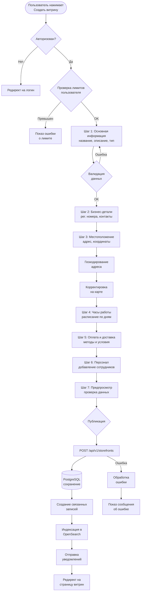

# 🏪 Паспорт процесса: Создание и настройка витрины

## 📋 Метаданные
- **Код**: BP-010
- **Название**: Storefront Creation and Setup Process
- **Версия**: 1.0.0
- **Статус**: Active
- **Критичность**: High
- **Владелец**: Storefronts Team

## 🎯 Краткое описание

Процесс создания и настройки витрины (storefront) на платформе Sve Tu - это комплексный 7-шаговый wizard, который позволяет бизнесам создать свое онлайн-присутствие. Процесс включает сбор бизнес-информации, настройку параметров работы, интеграцию платежных методов и публикацию витрины с последующей индексацией в поисковой системе.

## 📊 Диаграмма процесса



## 🔄 Детальный Flow

### 1️⃣ **Инициализация процесса**

```typescript
// Frontend: CreateStorefrontContext.tsx
const CreateStorefrontProvider: React.FC<{ children: React.ReactNode }> = ({ children }) => {
  const [formData, setFormData] = useState<StorefrontFormData>(initialFormData);
  const [isSubmitting, setIsSubmitting] = useState(false);
  
  // Инициализация формы с дефолтными значениями
  const initialFormData: StorefrontFormData = {
    name: '',
    slug: '',
    description: '',
    businessType: 'retail',
    // Балканский регион по умолчанию
    country: 'RS', // Сербия
    businessHours: generateInitialBusinessHours(),
    paymentMethods: [],
    deliveryOptions: [],
    staff: [],
  };
};
```

### 2️⃣ **Сбор данных (Шаги 1-6)**

#### **Шаг 1: Основная информация**
```typescript
// Валидация на frontend
const validateBasicInfo = (data: Partial<StorefrontFormData>): ValidationErrors => {
  const errors: ValidationErrors = {};
  
  if (!data.name || data.name.length < 3) {
    errors.name = 'storefront.validation.nameMinLength';
  }
  
  if (!data.slug || !/^[a-z0-9]+(?:-[a-z0-9]+)*$/.test(data.slug)) {
    errors.slug = 'storefront.validation.slugFormat';
  }
  
  if (!data.description || data.description.length < 20) {
    errors.description = 'storefront.validation.descriptionMinLength';
  }
  
  return errors;
};

// Автогенерация slug
const generateSlug = (name: string): string => {
  return name
    .toLowerCase()
    .replace(/[^a-z0-9]+/g, '-')
    .replace(/(^-|-$)+/g, '');
};
```

#### **Шаг 3: Геокодирование адреса**
```typescript
// Интеграция с Nominatim API
const geocodeAddress = async (address: string, city: string, country: string) => {
  const query = `${address}, ${city}, ${country}`;
  const response = await fetch(
    `https://nominatim.openstreetmap.org/search?` +
    `format=json&q=${encodeURIComponent(query)}&limit=1`
  );
  
  const data = await response.json();
  if (data.length > 0) {
    return {
      latitude: parseFloat(data[0].lat),
      longitude: parseFloat(data[0].lon),
    };
  }
  
  // Координаты Белграда по умолчанию
  return { latitude: 44.8125, longitude: 20.4612 };
};
```

### 3️⃣ **Отправка данных на backend**

```typescript
// Frontend: Трансформация и отправка
const submitStorefront = useCallback(async () => {
  setIsSubmitting(true);
  
  try {
    // Трансформация данных для backend
    const transformedData: StorefrontCreateDTO = {
      name: formData.name,
      slug: formData.slug,
      description: formData.description,
      phone: formData.phone,
      email: formData.email,
      website: formData.website,
      location: {
        full_address: formData.address,
        city: formData.city,
        postal_code: formData.postalCode,
        country: formData.country,
        user_lat: formData.latitude || 0,
        user_lng: formData.longitude || 0,
      },
      settings: {
        business_type: formData.businessType,
        registration_number: formData.registrationNumber,
        tax_number: formData.taxNumber,
        vat_number: formData.vatNumber,
        business_hours: formData.businessHours,
        payment_methods: formData.paymentMethods,
        delivery_options: formData.deliveryOptions,
        staff: formData.staff,
      },
    };
    
    const response = await api.post('/api/v1/storefronts', transformedData);
    
    if (response.data.success) {
      toast.success(t('storefront.createSuccess'));
      router.push('/profile/storefronts');
    }
  } catch (error) {
    toast.error(t('storefront.createError'));
  } finally {
    setIsSubmitting(false);
  }
}, [formData, router, t]);
```

### 4️⃣ **Обработка на backend**

```go
// Backend: handlers/storefront.go
func (h *StorefrontHandler) CreateStorefront(c *fiber.Ctx) error {
    // Получение пользователя из контекста
    userID := c.Locals("userID").(int64)
    
    // Парсинг и валидация данных
    var dto StorefrontCreateDTO
    if err := c.BodyParser(&dto); err != nil {
        return utils.ErrorResponse(c, fiber.StatusBadRequest, "validation.invalidData")
    }
    
    if err := h.validator.Struct(dto); err != nil {
        return utils.ErrorResponse(c, fiber.StatusBadRequest, "validation.invalidData")
    }
    
    // Проверка лимитов пользователя
    count, err := h.storefrontService.CountUserStorefronts(userID)
    if err != nil {
        return utils.ErrorResponse(c, fiber.StatusInternalServerError, "error.internal")
    }
    
    if count >= h.config.MaxStorefrontsPerUser {
        return utils.ErrorResponse(c, fiber.StatusForbidden, "storefront.limitExceeded")
    }
    
    // Создание витрины
    storefront, err := h.storefrontService.CreateStorefront(userID, dto)
    if err != nil {
        if errors.Is(err, ErrSlugExists) {
            return utils.ErrorResponse(c, fiber.StatusConflict, "storefront.slugExists")
        }
        return utils.ErrorResponse(c, fiber.StatusInternalServerError, "error.internal")
    }
    
    return utils.SuccessResponse(c, storefront)
}
```

### 5️⃣ **Сохранение в базе данных**

```go
// Backend: service/storefront_service.go
func (s *StorefrontService) CreateStorefront(userID int64, dto StorefrontCreateDTO) (*Storefront, error) {
    // Начало транзакции
    tx, err := s.db.Begin(context.Background())
    if err != nil {
        return nil, err
    }
    defer tx.Rollback(context.Background())
    
    // Создание основной записи
    storefront := &Storefront{
        OwnerID:     userID,
        Name:        dto.Name,
        Slug:        dto.Slug,
        Description: dto.Description,
        Phone:       dto.Phone,
        Email:       dto.Email,
        Website:     dto.Website,
        Location:    dto.Location,
        Settings:    dto.Settings,
        SEOMeta:     dto.SEOMeta,
        IsActive:    true,
        CreatedAt:   time.Now(),
    }
    
    err = s.storage.CreateStorefront(tx, storefront)
    if err != nil {
        return nil, err
    }
    
    // Создание связанных записей
    
    // 1. Часы работы
    if hours, ok := dto.Settings["business_hours"].([]interface{}); ok {
        for _, hour := range hours {
            if h, ok := hour.(map[string]interface{}); ok {
                err = s.storage.CreateBusinessHour(tx, storefront.ID, h)
                if err != nil {
                    return nil, err
                }
            }
        }
    }
    
    // 2. Методы оплаты
    if methods, ok := dto.Settings["payment_methods"].([]interface{}); ok {
        for _, method := range methods {
            err = s.storage.CreatePaymentMethod(tx, storefront.ID, method.(string))
            if err != nil {
                return nil, err
            }
        }
    }
    
    // 3. Опции доставки
    if options, ok := dto.Settings["delivery_options"].([]interface{}); ok {
        for _, option := range options {
            if opt, ok := option.(map[string]interface{}); ok {
                err = s.storage.CreateDeliveryOption(tx, storefront.ID, opt)
                if err != nil {
                    return nil, err
                }
            }
        }
    }
    
    // 4. Персонал
    if staff, ok := dto.Settings["staff"].([]interface{}); ok {
        for _, member := range staff {
            if m, ok := member.(map[string]interface{}); ok {
                err = s.storage.CreateStaffMember(tx, storefront.ID, m)
                if err != nil {
                    return nil, err
                }
            }
        }
    }
    
    // Коммит транзакции
    if err = tx.Commit(context.Background()); err != nil {
        return nil, err
    }
    
    // Асинхронная индексация в OpenSearch
    go s.indexStorefrontAsync(storefront)
    
    // Отправка уведомлений
    go s.notifyStorefrontCreated(storefront)
    
    return storefront, nil
}
```

### 6️⃣ **Индексация в OpenSearch**

```go
// Backend: service/opensearch_indexing.go
func (s *StorefrontService) indexStorefrontAsync(storefront *Storefront) {
    doc := map[string]interface{}{
        "id":           storefront.ID,
        "owner_id":     storefront.OwnerID,
        "name":         storefront.Name,
        "slug":         storefront.Slug,
        "description":  storefront.Description,
        "business_type": storefront.Settings["business_type"],
        "location": map[string]interface{}{
            "lat": storefront.Location.UserLat,
            "lon": storefront.Location.UserLng,
        },
        "city":        storefront.Location.City,
        "country":     storefront.Location.Country,
        "is_active":   storefront.IsActive,
        "created_at":  storefront.CreatedAt,
        "indexed_at":  time.Now(),
    }
    
    _, err := s.opensearchClient.Index(
        "storefronts",
        strings.NewReader(jsonEncode(doc)),
        s.opensearchClient.Index.WithDocumentID(fmt.Sprintf("%d", storefront.ID)),
        s.opensearchClient.Index.WithRefresh("true"),
    )
    
    if err != nil {
        log.Printf("Failed to index storefront %d: %v", storefront.ID, err)
    }
}
```

## 🔐 Безопасность и валидация

### Frontend валидация
- ✅ Проверка обязательных полей на каждом шаге
- ✅ Валидация форматов (email, URL, телефон)
- ✅ Ограничение длины текстовых полей
- ✅ Проверка slug на уникальный формат

### Backend валидация
- ✅ JWT токен авторизации
- ✅ Проверка владельца витрины
- ✅ Лимиты на количество витрин (configurable)
- ✅ Валидация уникальности slug
- ✅ Санитизация HTML в описаниях
- ✅ Проверка координат в допустимых пределах

### Защита от атак
- ✅ CSRF защита через токены
- ✅ Rate limiting на создание витрин
- ✅ SQL injection защита через prepared statements
- ✅ XSS защита через санитизацию

## 📊 Аналитика и метрики

### Отслеживаемые события
```typescript
// Frontend: Аналитика шагов
analytics.track('storefront_creation_started', {
  user_id: userId,
  timestamp: new Date().toISOString(),
});

analytics.track('storefront_creation_step_completed', {
  user_id: userId,
  step: stepNumber,
  step_name: stepName,
  duration_seconds: stepDuration,
});

analytics.track('storefront_creation_completed', {
  user_id: userId,
  storefront_id: storefrontId,
  total_duration_seconds: totalDuration,
  business_type: businessType,
});
```

### KPI метрики
- **Completion Rate**: % пользователей, завершивших создание
- **Average Time to Complete**: среднее время создания витрины
- **Drop-off by Step**: на каком шаге больше всего отваливаются
- **Error Rate**: % неуспешных попыток создания
- **Storefront Activation Rate**: % активных витрин через 7 дней

## 🧪 Тестирование

### Unit тесты
```typescript
// Frontend: CreateStorefrontContext.test.tsx
describe('CreateStorefrontContext', () => {
  it('should initialize with default values', () => {
    const { result } = renderHook(() => useCreateStorefront());
    expect(result.current.formData.country).toBe('RS');
    expect(result.current.formData.businessType).toBe('retail');
  });
  
  it('should validate slug format', () => {
    const { result } = renderHook(() => useCreateStorefront());
    act(() => {
      result.current.updateFormData({ slug: 'invalid slug!' });
    });
    expect(result.current.errors.slug).toBeDefined();
  });
});
```

### Integration тесты
```go
// Backend: storefront_handler_test.go
func TestCreateStorefront(t *testing.T) {
    // Setup
    app := setupTestApp()
    token := generateTestToken(userID)
    
    // Test successful creation
    body := `{
        "name": "Test Store",
        "slug": "test-store",
        "description": "Test storefront description",
        "location": {
            "full_address": "Test Street 123",
            "city": "Belgrade",
            "country": "RS",
            "user_lat": 44.8125,
            "user_lng": 20.4612
        }
    }`
    
    req := httptest.NewRequest("POST", "/api/v1/storefronts", strings.NewReader(body))
    req.Header.Set("Authorization", "Bearer " + token)
    req.Header.Set("Content-Type", "application/json")
    
    resp, _ := app.Test(req)
    assert.Equal(t, 201, resp.StatusCode)
}
```

### E2E тесты
```typescript
// e2e/create-storefront.spec.ts
test('should create storefront successfully', async ({ page }) => {
  // Login
  await loginUser(page);
  
  // Navigate to create storefront
  await page.goto('/create-storefront');
  
  // Fill step 1
  await page.fill('[name="name"]', 'My Test Store');
  await page.fill('[name="description"]', 'This is a test storefront for e2e testing');
  await page.selectOption('[name="businessType"]', 'retail');
  await page.click('button:has-text("Next")');
  
  // ... continue through all steps
  
  // Submit
  await page.click('button:has-text("Publish")');
  
  // Verify redirect
  await expect(page).toHaveURL('/profile/storefronts');
  await expect(page.locator('text=My Test Store')).toBeVisible();
});
```

## ⚡ Производительность и оптимизации

### Frontend оптимизации
- 🚀 Динамическая загрузка карты (lazy loading)
- 🚀 Мемоизация методов контекста
- 🚀 Debounce для геокодирования (500ms)
- 🚀 Оптимистичные обновления UI

### Backend оптимизации
- 🚀 Параллельное создание связанных записей
- 🚀 Асинхронная индексация в OpenSearch
- 🚀 Кеширование проверки лимитов
- 🚀 Database connection pooling

### Рекомендации по масштабированию
- 📈 Использование очереди для индексации (Redis Queue)
- 📈 Шардирование витрин по owner_id
- 📈 CDN для статических ресурсов витрин
- 📈 Read replicas для чтения данных витрин

## 🐛 Известные проблемы и ограничения

1. **Часы работы**: Нет поддержки работы через полночь (например, 22:00 - 02:00)
2. **Черновики**: Нет сохранения прогресса в localStorage
3. **Множественные локации**: Поддерживается только одна локация на витрину
4. **Языки**: Описание только на одном языке (нет мультиязычности)
5. **Медиа**: Логотип и баннер добавляются отдельно после создания

## 🔄 Связанные процессы

- **[BP-011] Управление товарами в витрине** - добавление товаров после создания
- **[BP-012] Импорт товаров** - массовая загрузка товаров
- **[BP-013] Аналитика продаж** - отслеживание эффективности
- **[BP-003] Поиск и фильтрация** - индексация для поиска

## 📚 Дополнительные ресурсы

- [API документация Storefronts](/docs/api/storefronts)
- [Frontend компоненты витрин](/memory-bank/system-passports/frontend/storefronts/)
- [База данных витрин](/memory-bank/system-passports/database/marketplace-storefronts.md)
- [OpenSearch mapping витрин](/memory-bank/system-passports/infrastructure/opensearch-storefronts.md)