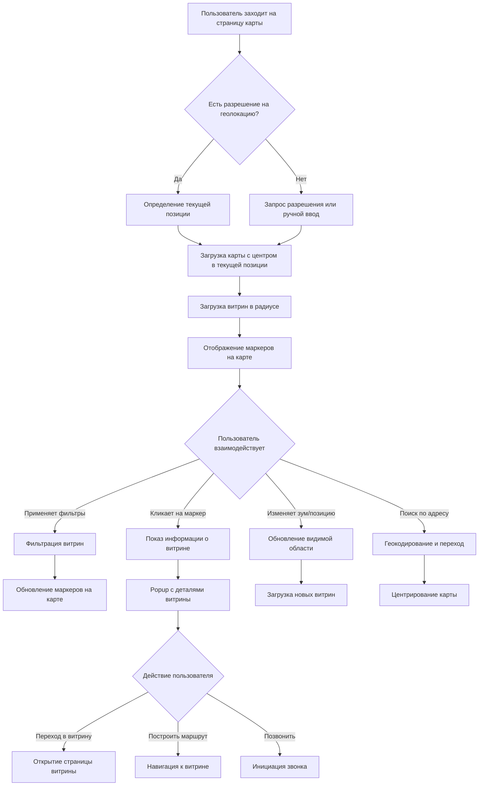

# Паспорт бизнес-процесса: Поиск витрин на карте

## 📋 Метаданные
- **Название**: Поиск витрин на карте
- **Роль**: Геолокационный поиск и навигация по витринам
- **Тип**: Бизнес-процесс
- **Статус**: Активный
- **Дата создания паспорта**: 2025-06-29

## 🎯 Назначение
Процесс обеспечивает поиск и отображение витрин на интерактивной карте с возможностью фильтрации по категориям, расстоянию, рейтингу и другим параметрам. Позволяет покупателям находить ближайшие магазины и планировать офлайн-покупки.

## 🔄 Общая схема процесса



## 📐 Архитектурные компоненты

### Frontend компоненты
1. **StorefrontMap** (`/frontend/svetu/src/components/storefronts/StorefrontMap.tsx`)
   - Основной компонент карты на базе Leaflet
   - Управление состоянием карты и маркеров
   - Интеграция с Redux для синхронизации данных

2. **MapFilters** (`/frontend/svetu/src/components/storefronts/MapFilters.tsx`)
   - Панель фильтров: категории, расстояние, рейтинг
   - Чекбоксы для типов витрин
   - Слайдер радиуса поиска

3. **AddressSearch** (`/frontend/svetu/src/components/storefronts/AddressSearch.tsx`)
   - Автодополнение адресов через Nominatim API
   - История поиска в localStorage
   - Интеграция с геокодированием

4. **StorefrontMapContainer** (`/frontend/svetu/src/components/storefronts/StorefrontMapContainer.tsx`)
   - Контейнер для управления состоянием
   - Загрузка данных через API
   - Обработка пользовательских действий

### Backend компоненты
1. **Storefronts Handler** (`/backend/internal/proj/storefronts/handler/`)
   - `GET /api/v1/storefronts/map` - витрины в границах карты
   - `GET /api/v1/storefronts/nearby` - витрины рядом с точкой
   - Фильтрация по параметрам

2. **Geocoding Service** (`/backend/internal/proj/geocode/`)
   - Прямое геокодирование (адрес → координаты)
   - Обратное геокодирование (координаты → адрес)
   - Кеширование результатов

3. **PostgreSQL + PostGIS**
   - Таблица `storefronts` с геометрическими полями
   - Пространственные индексы для быстрого поиска
   - Функции расчета расстояний

## 🔧 Детальный flow процесса

### 1. Инициализация карты
```typescript
// StorefrontMap.tsx
useEffect(() => {
  // Запрос геолокации
  if (navigator.geolocation) {
    navigator.geolocation.getCurrentPosition(
      (position) => {
        setCenter([position.coords.latitude, position.coords.longitude]);
        setUserLocation([position.coords.latitude, position.coords.longitude]);
      },
      (error) => {
        console.error('Geolocation error:', error);
        // Fallback на центр Белграда
        setCenter([44.8176, 20.4633]);
      }
    );
  }
}, []);
```

### 2. Загрузка витрин в видимой области
```go
// storefronts handler
func (h *Handler) GetMapStorefronts(c *fiber.Ctx) error {
    // Получение границ карты
    bounds := struct {
        North float64 `query:"north"`
        South float64 `query:"south"`
        East  float64 `query:"east"`
        West  float64 `query:"west"`
    }{}
    
    if err := c.QueryParser(&bounds); err != nil {
        return c.Status(400).JSON(fiber.Map{
            "error": "Invalid bounds",
        })
    }
    
    // Фильтры
    filters := parseMapFilters(c)
    
    // Запрос к БД с пространственным индексом
    storefronts, err := h.service.GetStorefrontsInBounds(
        bounds.North, bounds.South, bounds.East, bounds.West,
        filters,
    )
    
    return c.JSON(fiber.Map{
        "success": true,
        "data": storefronts,
        "count": len(storefronts),
    })
}
```

### 3. SQL запрос с PostGIS
```sql
-- Поиск витрин в границах с фильтрами
SELECT 
    s.id,
    s.name,
    s.description,
    s.category_id,
    s.rating,
    s.reviews_count,
    ST_Y(s.location::geometry) as latitude,
    ST_X(s.location::geometry) as longitude,
    s.address,
    s.phone,
    s.working_hours,
    array_agg(si.image_url) as images
FROM storefronts s
LEFT JOIN storefront_images si ON s.id = si.storefront_id
WHERE 
    s.is_active = true
    AND s.is_published = true
    AND ST_Within(
        s.location::geometry,
        ST_MakeEnvelope($1, $2, $3, $4, 4326)
    )
    AND ($5::int[] IS NULL OR s.category_id = ANY($5))
    AND ($6::numeric IS NULL OR s.rating >= $6)
GROUP BY s.id
ORDER BY s.rating DESC, s.reviews_count DESC
LIMIT $7;
```

### 4. Отображение маркеров на карте
```typescript
// Рендеринг маркеров в StorefrontMap
{storefronts.map((storefront) => (
  <Marker
    key={storefront.id}
    position={[storefront.latitude, storefront.longitude]}
    icon={createCustomIcon(storefront.category)}
  >
    <Popup>
      <StorefrontPopup 
        storefront={storefront}
        onNavigate={() => handleNavigate(storefront)}
        onCall={() => handleCall(storefront.phone)}
      />
    </Popup>
  </Marker>
))}
```

### 5. Фильтрация витрин
```typescript
// MapFilters.tsx
const handleFilterChange = (filters: MapFilters) => {
  dispatch(updateMapFilters(filters));
  
  // Дебаунс для оптимизации запросов
  debounce(() => {
    fetchFilteredStorefronts(filters);
  }, 300)();
};

// Интерфейс фильтров
interface MapFilters {
  categories: number[];
  radius: number; // км
  rating: number; // минимальный рейтинг
  isOpen: boolean; // только открытые сейчас
  hasDelivery: boolean;
  hasPickup: boolean;
}
```

### 6. Поиск по адресу
```typescript
// AddressSearch.tsx
const searchAddress = async (query: string) => {
  try {
    const response = await fetch(
      `https://nominatim.openstreetmap.org/search?` +
      `q=${encodeURIComponent(query)}&` +
      `format=json&limit=5&countrycodes=rs`
    );
    
    const results = await response.json();
    setSuggestions(results);
    
    // Сохранение в историю
    if (results.length > 0) {
      saveToHistory(query);
    }
  } catch (error) {
    console.error('Address search error:', error);
  }
};
```

### 7. Кластеризация маркеров
```typescript
// При большом количестве витрин
import MarkerClusterGroup from 'react-leaflet-markercluster';

<MarkerClusterGroup
  chunkedLoading
  maxClusterRadius={50}
  spiderfyOnMaxZoom={true}
  showCoverageOnHover={false}
>
  {storefronts.map(storefront => (
    <Marker key={storefront.id} {...markerProps} />
  ))}
</MarkerClusterGroup>
```

## 🔒 Безопасность и валидация

### Защита от атак
1. **Rate limiting** на API endpoints (10 req/sec)
2. **Валидация границ карты** - проверка разумных значений
3. **Ограничение количества** возвращаемых витрин (max 500)
4. **Санитизация** пользовательского ввода в поиске

### Приватность
1. **Опциональная геолокация** - работа без разрешения
2. **Анонимная аналитика** - без привязки к пользователю
3. **Локальное хранение** истории поиска

## 📊 Аналитика и метрики

### Отслеживаемые события
```typescript
// Аналитика использования карты
analytics.track('map_viewed', {
  user_location: userLocation ? 'enabled' : 'disabled',
  initial_center: center,
  viewport_bounds: map.getBounds(),
});

analytics.track('map_filter_applied', {
  filters: appliedFilters,
  results_count: storefronts.length,
});

analytics.track('storefront_clicked_on_map', {
  storefront_id: storefront.id,
  source: 'map_marker',
  user_distance: calculateDistance(userLocation, storefront.location),
});
```

### KPI метрики
- **Конверсия**: просмотр карты → клик на витрину (цель > 30%)
- **Использование фильтров**: % сессий с фильтрацией (цель > 40%)
- **Геолокация**: % пользователей с разрешением (цель > 60%)
- **Производительность**: время загрузки витрин < 1с

## ⚡ Производительность и оптимизация

### Оптимизации загрузки
1. **Viewport-based loading** - только видимые витрины
2. **Дебаунс** перемещений карты (500ms)
3. **Кеширование** тайлов карты в localStorage
4. **Lazy loading** изображений в попапах

### База данных
1. **Пространственный индекс** на location поле
```sql
CREATE INDEX idx_storefronts_location 
ON storefronts USING GIST (location);
```

2. **Составной индекс** для фильтрации
```sql
CREATE INDEX idx_storefronts_active_category_rating 
ON storefronts (is_active, is_published, category_id, rating);
```

### Кеширование
```go
// Redis кеш для популярных областей
cacheKey := fmt.Sprintf("storefronts:bounds:%s", boundsHash)
if cached, err := redis.Get(cacheKey); err == nil {
    return cached
}
// ... загрузка из БД
redis.Set(cacheKey, result, 5*time.Minute)
```

## 🧪 Тестирование

### Unit тесты
```typescript
// StorefrontMap.test.tsx
describe('StorefrontMap', () => {
  it('should request geolocation on mount', () => {
    const mockGeolocation = {
      getCurrentPosition: jest.fn(),
    };
    global.navigator.geolocation = mockGeolocation;
    
    render(<StorefrontMap />);
    
    expect(mockGeolocation.getCurrentPosition).toHaveBeenCalled();
  });
  
  it('should handle geolocation error gracefully', () => {
    // Проверка fallback на дефолтные координаты
  });
});
```

### Integration тесты
```go
func TestGetMapStorefronts(t *testing.T) {
    // Тест с валидными границами
    req := httptest.NewRequest(
        "GET", 
        "/api/v1/storefronts/map?north=45&south=44&east=21&west=20",
        nil,
    )
    // ... проверка ответа
}
```

### E2E тесты
```typescript
// cypress/e2e/storefront-map.cy.ts
describe('Storefront Map Search', () => {
  it('should show nearby storefronts when location allowed', () => {
    cy.visit('/storefronts/map');
    cy.mockGeolocation(44.8176, 20.4633);
    
    cy.get('[data-testid="map-container"]').should('be.visible');
    cy.get('.leaflet-marker-icon').should('have.length.greaterThan', 0);
  });
});
```

## 🌍 Локализация

### Мультиязычность
- Адреса на кириллице и латинице
- Локализованные подсказки на карте
- Форматирование расстояний (км/м)

### Региональные особенности
- Центрирование на Белграде по умолчанию
- Интеграция с местными картографическими сервисами
- Учет местных праздников в работе витрин

## ⚠️ Известные ограничения

1. **Nominatim API** - лимит 1 запрос/сек
2. **Максимум 500 витрин** на карте одновременно
3. **Требуется HTTPS** для геолокации в браузере
4. **Offline режим** не поддерживается

## 🔄 Связанные процессы

1. **[Создание и настройка витрины](storefront-creation-setup.md)** - откуда берутся витрины
2. **[Управление товарами в витрине](product-management-storefront.md)** - что внутри витрин
3. **[Поиск и фильтрация](search-filtering.md)** - альтернативный способ поиска
4. **[Аналитика продаж](sales-analytics.md)** - трекинг конверсий с карты

## 📈 Будущие улучшения

1. **AR навигация** - дополненная реальность для поиска витрин
2. **Прогноз загруженности** - на основе исторических данных
3. **Групповые маршруты** - оптимальный путь по нескольким витринам
4. **Интеграция с навигаторами** - Google Maps, Yandex
5. **Уведомления о близости** - push при приближении к витрине