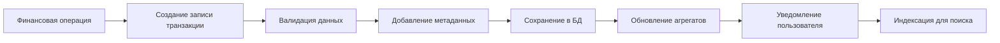
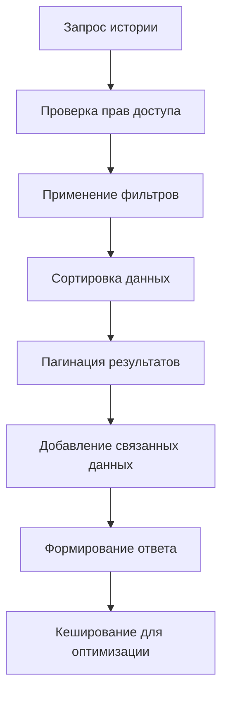
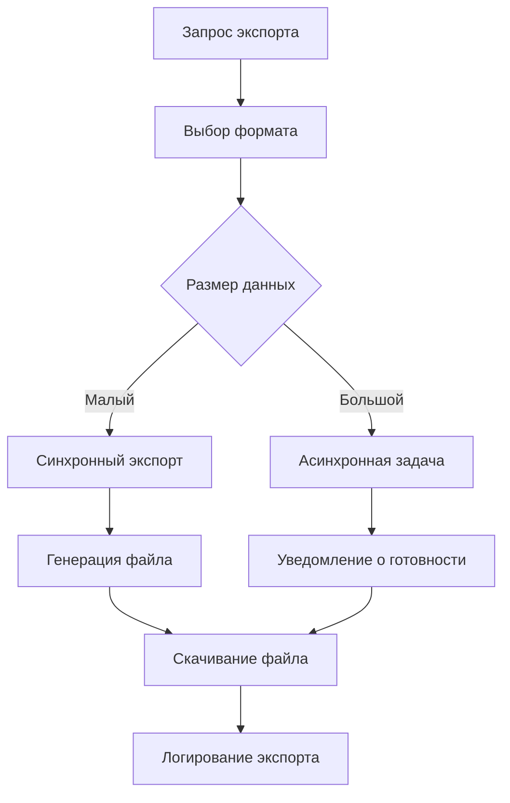
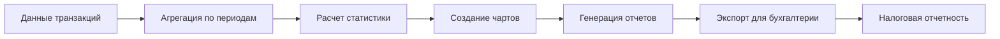

# Паспорт бизнес-процесса: История транзакций

## 🎯 Назначение процесса

Обеспечение полной прозрачности и доступности истории всех финансовых операций пользователей на платформе Sve Tu с возможностью детального анализа, фильтрации, экспорта данных и генерации финансовых отчетов для налогового учета.

## 🔄 Схема процесса

### 1. **Запись транзакций**


### 2. **Получение истории**


### 3. **Экспорт данных**


### 4. **Аналитика и отчеты**


## 🏗️ Архитектурные компоненты

### **Frontend компоненты**
- **TransactionHistory** - основной компонент истории транзакций
- **TransactionFilters** - панель фильтрации и поиска
- **TransactionCard** - карточка отдельной транзакции
- **TransactionDetails** - детальная информация о транзакции
- **ExportButton** - кнопка экспорта данных
- **TransactionChart** - графики и аналитика
- **DateRangePicker** - выбор периода времени

### **Backend сервисы**
- **TransactionHistoryService** - основной сервис истории
- **TransactionExportService** - сервис экспорта данных
- **TransactionAnalyticsService** - аналитика транзакций
- **TransactionSearchService** - поиск и фильтрация
- **ReportGeneratorService** - генерация отчетов
- **TaxReportService** - налоговые отчеты

### **Базы данных**
- **transaction_history** - основная таблица всех транзакций
- **transaction_metadata** - дополнительные данные транзакций
- **transaction_categories** - категории операций
- **export_requests** - запросы на экспорт данных
- **user_analytics** - агрегированная аналитика пользователей
- **tax_reports** - сгенерированные налоговые отчеты

## 🔗 Интеграции

### **TransactionHistoryService - основной сервис**
```go
type TransactionHistoryService struct {
    repository    TransactionRepositoryInterface
    export        ExportServiceInterface
    analytics     AnalyticsServiceInterface
    notification  NotificationServiceInterface
    cache         CacheInterface
    logger        logger.Logger
    config        *TransactionConfig
}

type TransactionConfig struct {
    MaxPageSize          int           // 100
    DefaultPageSize      int           // 20
    MaxExportRecords     int           // 10000
    CacheTimeout         time.Duration // 5 минут
    AsyncExportThreshold int           // 1000 записей
    RetentionPeriod      time.Duration // 7 лет
}

// Основная структура транзакции
type TransactionRecord struct {
    ID                int64                  `json:"id"`
    UserID            int                    `json:"user_id"`
    Type              string                 `json:"type"` // deposit, withdrawal, payment, refund, commission
    Category          string                 `json:"category"`
    Amount            decimal.Decimal        `json:"amount"`
    Currency          string                 `json:"currency"`
    Description       string                 `json:"description"`
    Status            string                 `json:"status"`
    Reference         string                 `json:"reference"`
    RelatedEntityType string                 `json:"related_entity_type"` // listing, escrow, withdrawal
    RelatedEntityID   *int64                 `json:"related_entity_id"`
    Metadata          map[string]interface{} `json:"metadata"`
    CreatedAt         time.Time              `json:"created_at"`
    UpdatedAt         time.Time              `json:"updated_at"`
    
    // Связанные данные
    RelatedListing    *models.MarketplaceListing `json:"related_listing,omitempty"`
    RelatedEscrow     *models.EscrowAccount      `json:"related_escrow,omitempty"`
    CounterpartyUser  *models.User               `json:"counterparty_user,omitempty"`
}

// Создание записи транзакции
func (s *TransactionHistoryService) CreateTransactionRecord(ctx context.Context, req CreateTransactionRequest) (*TransactionRecord, error) {
    // 1. Валидация запроса
    if err := s.validateTransactionRequest(req); err != nil {
        return nil, fmt.Errorf("validation failed: %w", err)
    }

    // 2. Создание основной записи
    transaction := &TransactionRecord{
        UserID:            req.UserID,
        Type:              req.Type,
        Category:          req.Category,
        Amount:            req.Amount,
        Currency:          req.Currency,
        Description:       req.Description,
        Status:            req.Status,
        Reference:         req.Reference,
        RelatedEntityType: req.RelatedEntityType,
        RelatedEntityID:   req.RelatedEntityID,
        Metadata:          req.Metadata,
        CreatedAt:         time.Now(),
        UpdatedAt:         time.Now(),
    }

    // 3. Сохранение в базу данных
    err := s.repository.CreateTransaction(ctx, transaction)
    if err != nil {
        return nil, fmt.Errorf("failed to create transaction: %w", err)
    }

    // 4. Обновление агрегированных данных
    go s.updateUserAnalytics(context.Background(), req.UserID, transaction)

    // 5. Индексация для поиска
    go s.indexTransactionForSearch(context.Background(), transaction)

    // 6. Уведомления пользователю
    if req.SendNotification {
        go s.sendTransactionNotification(context.Background(), transaction)
    }

    return transaction, nil
}

// Получение истории транзакций с фильтрацией
func (s *TransactionHistoryService) GetUserTransactionHistory(ctx context.Context, req GetHistoryRequest) (*TransactionHistoryResponse, error) {
    // 1. Проверка прав доступа
    if err := s.checkAccessPermissions(ctx, req.UserID, req.RequestedBy); err != nil {
        return nil, fmt.Errorf("access denied: %w", err)
    }

    // 2. Построение фильтров
    filters := s.buildFilters(req)

    // 3. Проверка кеша
    cacheKey := s.generateCacheKey(req)
    if cached, err := s.cache.Get(ctx, cacheKey); err == nil {
        var response TransactionHistoryResponse
        if err := json.Unmarshal(cached, &response); err == nil {
            return &response, nil
        }
    }

    // 4. Получение данных из базы
    transactions, total, err := s.repository.GetTransactionsWithFilters(ctx, filters, req.Pagination)
    if err != nil {
        return nil, fmt.Errorf("failed to get transactions: %w", err)
    }

    // 5. Загрузка связанных данных
    err = s.loadRelatedData(ctx, transactions)
    if err != nil {
        s.logger.Warn("Failed to load related data", "error", err)
    }

    // 6. Расчет агрегатов для периода
    aggregates, err := s.calculatePeriodAggregates(ctx, req.UserID, filters.DateFrom, filters.DateTo)
    if err != nil {
        s.logger.Warn("Failed to calculate aggregates", "error", err)
    }

    response := &TransactionHistoryResponse{
        Transactions: transactions,
        Pagination: PaginationResponse{
            Page:        req.Pagination.Page,
            PageSize:    req.Pagination.PageSize,
            Total:       total,
            TotalPages:  (total + req.Pagination.PageSize - 1) / req.Pagination.PageSize,
        },
        Aggregates:   aggregates,
        Filters:      req.Filters,
    }

    // 7. Кеширование результата
    responseData, _ := json.Marshal(response)
    s.cache.Set(ctx, cacheKey, responseData, s.config.CacheTimeout)

    return response, nil
}

// Построение фильтров
func (s *TransactionHistoryService) buildFilters(req GetHistoryRequest) TransactionFilters {
    filters := TransactionFilters{
        UserID:   req.UserID,
        DateFrom: req.Filters.DateFrom,
        DateTo:   req.Filters.DateTo,
    }

    // Фильтр по типам транзакций
    if len(req.Filters.Types) > 0 {
        filters.Types = req.Filters.Types
    }

    // Фильтр по статусам
    if len(req.Filters.Statuses) > 0 {
        filters.Statuses = req.Filters.Statuses
    }

    // Фильтр по сумме
    if req.Filters.MinAmount != nil {
        filters.MinAmount = req.Filters.MinAmount
    }
    if req.Filters.MaxAmount != nil {
        filters.MaxAmount = req.Filters.MaxAmount
    }

    // Фильтр по валютам
    if len(req.Filters.Currencies) > 0 {
        filters.Currencies = req.Filters.Currencies
    }

    // Текстовый поиск
    if req.Filters.SearchQuery != "" {
        filters.SearchQuery = req.Filters.SearchQuery
    }

    // Фильтр по категориям
    if len(req.Filters.Categories) > 0 {
        filters.Categories = req.Filters.Categories
    }

    return filters
}

// Загрузка связанных данных
func (s *TransactionHistoryService) loadRelatedData(ctx context.Context, transactions []*TransactionRecord) error {
    // Группировка по типам связанных объектов
    listingIDs := make([]int64, 0)
    escrowIDs := make([]int64, 0)
    userIDs := make([]int, 0)

    for _, tx := range transactions {
        if tx.RelatedEntityID != nil {
            switch tx.RelatedEntityType {
            case "listing":
                listingIDs = append(listingIDs, *tx.RelatedEntityID)
            case "escrow":
                escrowIDs = append(escrowIDs, *tx.RelatedEntityID)
            }
        }

        // Получение контрагентов из метаданных
        if counterpartyID, exists := tx.Metadata["counterparty_user_id"]; exists {
            if id, ok := counterpartyID.(float64); ok {
                userIDs = append(userIDs, int(id))
            }
        }
    }

    // Загрузка данных объявлений
    var listings map[int64]*models.MarketplaceListing
    if len(listingIDs) > 0 {
        listingsSlice, err := s.repository.GetListingsByIDs(ctx, listingIDs)
        if err != nil {
            return fmt.Errorf("failed to load listings: %w", err)
        }
        listings = make(map[int64]*models.MarketplaceListing)
        for _, listing := range listingsSlice {
            listings[listing.ID] = listing
        }
    }

    // Загрузка данных эскроу
    var escrows map[int64]*models.EscrowAccount
    if len(escrowIDs) > 0 {
        escrowsSlice, err := s.repository.GetEscrowsByIDs(ctx, escrowIDs)
        if err != nil {
            return fmt.Errorf("failed to load escrows: %w", err)
        }
        escrows = make(map[int64]*models.EscrowAccount)
        for _, escrow := range escrowsSlice {
            escrows[escrow.ID] = escrow
        }
    }

    // Загрузка данных пользователей
    var users map[int]*models.User
    if len(userIDs) > 0 {
        usersSlice, err := s.repository.GetUsersByIDs(ctx, userIDs)
        if err != nil {
            return fmt.Errorf("failed to load users: %w", err)
        }
        users = make(map[int]*models.User)
        for _, user := range usersSlice {
            users[user.ID] = user
        }
    }

    // Привязка данных к транзакциям
    for _, tx := range transactions {
        if tx.RelatedEntityID != nil {
            switch tx.RelatedEntityType {
            case "listing":
                if listing, exists := listings[*tx.RelatedEntityID]; exists {
                    tx.RelatedListing = listing
                }
            case "escrow":
                if escrow, exists := escrows[*tx.RelatedEntityID]; exists {
                    tx.RelatedEscrow = escrow
                }
            }
        }

        // Привязка контрагентов
        if counterpartyID, exists := tx.Metadata["counterparty_user_id"]; exists {
            if id, ok := counterpartyID.(float64); ok {
                if user, exists := users[int(id)]; exists {
                    tx.CounterpartyUser = user
                }
            }
        }
    }

    return nil
}
```

### **TransactionExportService - экспорт данных**
```go
// Экспорт истории транзакций
func (s *TransactionExportService) ExportTransactionHistory(ctx context.Context, req ExportRequest) (*ExportResult, error) {
    // 1. Валидация запроса
    if err := s.validateExportRequest(req); err != nil {
        return nil, fmt.Errorf("validation failed: %w", err)
    }

    // 2. Проверка лимитов экспорта
    count, err := s.repository.CountTransactions(ctx, s.buildFiltersFromExportRequest(req))
    if err != nil {
        return nil, fmt.Errorf("failed to count transactions: %w", err)
    }

    if count > s.config.MaxExportRecords {
        return nil, fmt.Errorf("export.tooManyRecords: %d (max %d)", count, s.config.MaxExportRecords)
    }

    // 3. Определение метода экспорта
    if count > s.config.AsyncExportThreshold {
        return s.createAsyncExport(ctx, req, count)
    } else {
        return s.createSyncExport(ctx, req, count)
    }
}

// Синхронный экспорт
func (s *TransactionExportService) createSyncExport(ctx context.Context, req ExportRequest, count int) (*ExportResult, error) {
    // 1. Получение всех данных
    filters := s.buildFiltersFromExportRequest(req)
    transactions, _, err := s.repository.GetTransactionsWithFilters(ctx, filters, PaginationRequest{
        Page:     1,
        PageSize: count,
    })
    if err != nil {
        return nil, fmt.Errorf("failed to get transactions: %w", err)
    }

    // 2. Загрузка связанных данных
    err = s.loadRelatedDataForExport(ctx, transactions)
    if err != nil {
        s.logger.Warn("Failed to load related data for export", "error", err)
    }

    // 3. Генерация файла
    var fileData []byte
    var filename string
    var contentType string

    switch req.Format {
    case "csv":
        fileData, err = s.generateCSV(transactions)
        filename = fmt.Sprintf("transactions_%s_%s.csv", 
            req.DateFrom.Format("2006-01-02"), 
            req.DateTo.Format("2006-01-02"))
        contentType = "text/csv"
    case "xlsx":
        fileData, err = s.generateExcel(transactions)
        filename = fmt.Sprintf("transactions_%s_%s.xlsx", 
            req.DateFrom.Format("2006-01-02"), 
            req.DateTo.Format("2006-01-02"))
        contentType = "application/vnd.openxmlformats-officedocument.spreadsheetml.sheet"
    case "pdf":
        fileData, err = s.generatePDF(transactions, req)
        filename = fmt.Sprintf("transactions_%s_%s.pdf", 
            req.DateFrom.Format("2006-01-02"), 
            req.DateTo.Format("2006-01-02"))
        contentType = "application/pdf"
    default:
        return nil, errors.New("export.unsupportedFormat")
    }

    if err != nil {
        return nil, fmt.Errorf("failed to generate file: %w", err)
    }

    // 4. Сохранение файла во временное хранилище
    fileURL, err := s.storage.SaveTempFile(filename, fileData, contentType)
    if err != nil {
        return nil, fmt.Errorf("failed to save file: %w", err)
    }

    // 5. Логирование экспорта
    s.logExport(ctx, req.UserID, req.Format, count, "completed")

    return &ExportResult{
        Status:       "completed",
        DownloadURL:  fileURL,
        Filename:     filename,
        RecordCount:  count,
        ExpiresAt:    time.Now().Add(24 * time.Hour), // Файл доступен 24 часа
    }, nil
}

// Асинхронный экспорт
func (s *TransactionExportService) createAsyncExport(ctx context.Context, req ExportRequest, count int) (*ExportResult, error) {
    // 1. Создание задачи экспорта
    exportJob := &models.ExportRequest{
        UserID:      req.UserID,
        Format:      req.Format,
        Filters:     req.Filters,
        Status:      "queued",
        RecordCount: count,
        CreatedAt:   time.Now(),
    }

    err := s.repository.CreateExportRequest(ctx, exportJob)
    if err != nil {
        return nil, fmt.Errorf("failed to create export request: %w", err)
    }

    // 2. Постановка в очередь
    err = s.queue.Enqueue(ctx, ExportJob{
        ExportID: exportJob.ID,
        UserID:   req.UserID,
        Format:   req.Format,
        Filters:  req.Filters,
    })
    if err != nil {
        s.repository.UpdateExportStatus(ctx, exportJob.ID, "failed")
        return nil, fmt.Errorf("failed to enqueue export job: %w", err)
    }

    return &ExportResult{
        ExportID:    exportJob.ID,
        Status:      "queued",
        RecordCount: count,
        EstimatedTime: s.estimateExportTime(count, req.Format),
    }, nil
}

// Генерация CSV файла
func (s *TransactionExportService) generateCSV(transactions []*TransactionRecord) ([]byte, error) {
    var buf bytes.Buffer
    writer := csv.NewWriter(&buf)

    // Заголовки
    headers := []string{
        "ID", "Date", "Type", "Category", "Amount", "Currency", 
        "Description", "Status", "Reference", "Counterparty",
        "Related Item", "Fee", "Balance After",
    }
    writer.Write(headers)

    // Данные
    for _, tx := range transactions {
        var counterparty, relatedItem, fee, balanceAfter string

        if tx.CounterpartyUser != nil {
            counterparty = tx.CounterpartyUser.Name
        }

        if tx.RelatedListing != nil {
            relatedItem = tx.RelatedListing.Title
        }

        if feeVal, exists := tx.Metadata["fee"]; exists {
            fee = fmt.Sprintf("%v", feeVal)
        }

        if balanceVal, exists := tx.Metadata["balance_after"]; exists {
            balanceAfter = fmt.Sprintf("%v", balanceVal)
        }

        record := []string{
            fmt.Sprintf("%d", tx.ID),
            tx.CreatedAt.Format("2006-01-02 15:04:05"),
            tx.Type,
            tx.Category,
            tx.Amount.String(),
            tx.Currency,
            tx.Description,
            tx.Status,
            tx.Reference,
            counterparty,
            relatedItem,
            fee,
            balanceAfter,
        }
        writer.Write(record)
    }

    writer.Flush()
    if err := writer.Error(); err != nil {
        return nil, fmt.Errorf("CSV generation error: %w", err)
    }

    return buf.Bytes(), nil
}

// Генерация Excel файла
func (s *TransactionExportService) generateExcel(transactions []*TransactionRecord) ([]byte, error) {
    file := excelize.NewFile()
    
    // Создание листа
    sheetName := "Transactions"
    file.NewSheet(sheetName)
    
    // Стилизация заголовков
    headerStyle, _ := file.NewStyle(&excelize.Style{
        Font: &excelize.Font{Bold: true},
        Fill: &excelize.Fill{Type: "pattern", Color: []string{"E8F4FD"}, Pattern: 1},
    })

    // Заголовки
    headers := []string{
        "ID", "Дата", "Тип", "Категория", "Сумма", "Валюта", 
        "Описание", "Статус", "Референс", "Контрагент",
        "Связанный товар", "Комиссия", "Баланс после",
    }

    for i, header := range headers {
        cell := fmt.Sprintf("%s1", string(rune('A'+i)))
        file.SetCellValue(sheetName, cell, header)
        file.SetCellStyle(sheetName, cell, cell, headerStyle)
    }

    // Данные
    for row, tx := range transactions {
        rowNum := row + 2
        
        file.SetCellValue(sheetName, fmt.Sprintf("A%d", rowNum), tx.ID)
        file.SetCellValue(sheetName, fmt.Sprintf("B%d", rowNum), tx.CreatedAt.Format("2006-01-02 15:04:05"))
        file.SetCellValue(sheetName, fmt.Sprintf("C%d", rowNum), tx.Type)
        file.SetCellValue(sheetName, fmt.Sprintf("D%d", rowNum), tx.Category)
        file.SetCellValue(sheetName, fmt.Sprintf("E%d", rowNum), tx.Amount.InexactFloat64())
        file.SetCellValue(sheetName, fmt.Sprintf("F%d", rowNum), tx.Currency)
        file.SetCellValue(sheetName, fmt.Sprintf("G%d", rowNum), tx.Description)
        file.SetCellValue(sheetName, fmt.Sprintf("H%d", rowNum), tx.Status)
        file.SetCellValue(sheetName, fmt.Sprintf("I%d", rowNum), tx.Reference)
        
        if tx.CounterpartyUser != nil {
            file.SetCellValue(sheetName, fmt.Sprintf("J%d", rowNum), tx.CounterpartyUser.Name)
        }
        
        if tx.RelatedListing != nil {
            file.SetCellValue(sheetName, fmt.Sprintf("K%d", rowNum), tx.RelatedListing.Title)
        }
        
        if fee, exists := tx.Metadata["fee"]; exists {
            file.SetCellValue(sheetName, fmt.Sprintf("L%d", rowNum), fee)
        }
        
        if balance, exists := tx.Metadata["balance_after"]; exists {
            file.SetCellValue(sheetName, fmt.Sprintf("M%d", rowNum), balance)
        }
    }

    // Автоподбор ширины колонок
    for i := 0; i < len(headers); i++ {
        col := string(rune('A' + i))
        file.SetColWidth(sheetName, col, col, 15)
    }

    // Сохранение в буфер
    var buf bytes.Buffer
    if err := file.Write(&buf); err != nil {
        return nil, fmt.Errorf("Excel generation error: %w", err)
    }

    return buf.Bytes(), nil
}
```

### **Frontend интеграция**
```typescript
// Hook для работы с историей транзакций
export const useTransactionHistory = () => {
  const [historyState, setHistoryState] = useState<HistoryState>({
    transactions: [],
    pagination: null,
    aggregates: null,
    loading: false,
    error: null,
    filters: {
      dateFrom: null,
      dateTo: null,
      types: [],
      statuses: [],
      searchQuery: '',
    },
  });

  const fetchHistory = async (page: number = 1, filters?: TransactionFilters) => {
    setHistoryState(prev => ({ ...prev, loading: true, error: null }));

    try {
      const params = new URLSearchParams({
        page: page.toString(),
        page_size: '20',
      });

      if (filters) {
        if (filters.dateFrom) params.append('date_from', filters.dateFrom.toISOString());
        if (filters.dateTo) params.append('date_to', filters.dateTo.toISOString());
        if (filters.types.length > 0) params.append('types', filters.types.join(','));
        if (filters.statuses.length > 0) params.append('statuses', filters.statuses.join(','));
        if (filters.searchQuery) params.append('search', filters.searchQuery);
        if (filters.minAmount) params.append('min_amount', filters.minAmount.toString());
        if (filters.maxAmount) params.append('max_amount', filters.maxAmount.toString());
        if (filters.currencies.length > 0) params.append('currencies', filters.currencies.join(','));
      }

      const response = await fetch(`/api/v1/transactions/history?${params}`);
      const result = await response.json();

      if (!result.success) {
        throw new Error(result.error || 'Failed to fetch transaction history');
      }

      setHistoryState(prev => ({
        ...prev,
        loading: false,
        transactions: result.data.transactions,
        pagination: result.data.pagination,
        aggregates: result.data.aggregates,
        filters: filters || prev.filters,
      }));

    } catch (error) {
      setHistoryState(prev => ({ 
        ...prev, 
        loading: false, 
        error: error.message 
      }));
    }
  };

  const exportHistory = async (format: 'csv' | 'xlsx' | 'pdf', filters?: TransactionFilters) => {
    try {
      const exportData = {
        format,
        filters: filters || historyState.filters,
      };

      const response = await fetch('/api/v1/transactions/export', {
        method: 'POST',
        headers: { 'Content-Type': 'application/json' },
        body: JSON.stringify(exportData),
      });

      const result = await response.json();

      if (!result.success) {
        throw new Error(result.error || 'Export failed');
      }

      if (result.data.status === 'completed') {
        // Синхронный экспорт - сразу скачиваем
        window.open(result.data.download_url, '_blank');
        toast.success('Файл готов к скачиванию!');
      } else if (result.data.status === 'queued') {
        // Асинхронный экспорт - показываем уведомление
        toast.info(`Экспорт запущен. Ожидаемое время: ${result.data.estimated_time}`);
        // Можно добавить polling или WebSocket для отслеживания прогресса
      }

      return result.data;

    } catch (error) {
      toast.error(`Ошибка экспорта: ${error.message}`);
      throw error;
    }
  };

  const searchTransactions = async (query: string) => {
    const filters = { ...historyState.filters, searchQuery: query };
    await fetchHistory(1, filters);
  };

  return {
    historyState,
    fetchHistory,
    exportHistory,
    searchTransactions,
    setFilters: (filters: TransactionFilters) => fetchHistory(1, filters),
  };
};

// Компонент истории транзакций
export const TransactionHistory: React.FC = () => {
  const { historyState, fetchHistory, exportHistory, searchTransactions } = useTransactionHistory();
  const [showFilters, setShowFilters] = useState(false);

  useEffect(() => {
    fetchHistory();
  }, []);

  const handlePageChange = (page: number) => {
    fetchHistory(page, historyState.filters);
  };

  const handleExport = async (format: 'csv' | 'xlsx' | 'pdf') => {
    await exportHistory(format, historyState.filters);
  };

  if (historyState.loading && historyState.transactions.length === 0) {
    return (
      <div className="flex justify-center items-center h-64">
        <div className="loading loading-spinner loading-lg"></div>
      </div>
    );
  }

  return (
    <div className="space-y-6">
      {/* Заголовок и действия */}
      <div className="flex justify-between items-center">
        <h2 className="text-2xl font-bold">История транзакций</h2>
        
        <div className="flex gap-2">
          <button 
            className="btn btn-outline btn-sm"
            onClick={() => setShowFilters(!showFilters)}
          >
            🔍 Фильтры
          </button>
          
          <div className="dropdown dropdown-end">
            <label tabIndex={0} className="btn btn-outline btn-sm">
              📥 Экспорт
            </label>
            <ul tabIndex={0} className="dropdown-content menu p-2 shadow bg-base-100 rounded-box w-52">
              <li><a onClick={() => handleExport('csv')}>📄 CSV</a></li>
              <li><a onClick={() => handleExport('xlsx')}>📊 Excel</a></li>
              <li><a onClick={() => handleExport('pdf')}>📑 PDF</a></li>
            </ul>
          </div>
        </div>
      </div>

      {/* Агрегированная статистика */}
      {historyState.aggregates && (
        <div className="grid grid-cols-1 md:grid-cols-4 gap-4">
          <div className="stat bg-base-200 rounded-lg">
            <div className="stat-title">Общий приход</div>
            <div className="stat-value text-success">
              +{historyState.aggregates.total_income.toFixed(2)} RSD
            </div>
          </div>
          <div className="stat bg-base-200 rounded-lg">
            <div className="stat-title">Общий расход</div>
            <div className="stat-value text-error">
              -{historyState.aggregates.total_expense.toFixed(2)} RSD
            </div>
          </div>
          <div className="stat bg-base-200 rounded-lg">
            <div className="stat-title">Баланс</div>
            <div className={`stat-value ${historyState.aggregates.net_balance >= 0 ? 'text-success' : 'text-error'}`}>
              {historyState.aggregates.net_balance.toFixed(2)} RSD
            </div>
          </div>
          <div className="stat bg-base-200 rounded-lg">
            <div className="stat-title">Транзакций</div>
            <div className="stat-value">{historyState.aggregates.transaction_count}</div>
          </div>
        </div>
      )}

      {/* Фильтры */}
      {showFilters && (
        <TransactionFilters 
          filters={historyState.filters}
          onFiltersChange={(filters) => fetchHistory(1, filters)}
          onSearch={searchTransactions}
        />
      )}

      {/* Список транзакций */}
      <div className="space-y-3">
        {historyState.transactions.map((transaction) => (
          <TransactionCard 
            key={transaction.id} 
            transaction={transaction} 
          />
        ))}
      </div>

      {/* Пагинация */}
      {historyState.pagination && historyState.pagination.total_pages > 1 && (
        <div className="flex justify-center">
          <div className="btn-group">
            <button 
              className="btn btn-sm"
              disabled={historyState.pagination.page <= 1}
              onClick={() => handlePageChange(historyState.pagination.page - 1)}
            >
              «
            </button>
            
            {Array.from({ length: Math.min(5, historyState.pagination.total_pages) }, (_, i) => {
              const page = i + 1;
              return (
                <button
                  key={page}
                  className={`btn btn-sm ${page === historyState.pagination.page ? 'btn-active' : ''}`}
                  onClick={() => handlePageChange(page)}
                >
                  {page}
                </button>
              );
            })}
            
            <button 
              className="btn btn-sm"
              disabled={historyState.pagination.page >= historyState.pagination.total_pages}
              onClick={() => handlePageChange(historyState.pagination.page + 1)}
            >
              »
            </button>
          </div>
        </div>
      )}

      {/* Состояние загрузки */}
      {historyState.loading && (
        <div className="flex justify-center">
          <div className="loading loading-spinner"></div>
        </div>
      )}

      {/* Ошибки */}
      {historyState.error && (
        <div className="alert alert-error">
          <span>Ошибка: {historyState.error}</span>
        </div>
      )}

      {/* Пустое состояние */}
      {!historyState.loading && historyState.transactions.length === 0 && (
        <div className="text-center py-12">
          <p className="text-lg text-base-content/60">Транзакции не найдены</p>
          <p className="text-sm text-base-content/40">
            Попробуйте изменить фильтры или период поиска
          </p>
        </div>
      )}
    </div>
  );
};

// Компонент карточки транзакции
export const TransactionCard: React.FC<{ transaction: TransactionRecord }> = ({ transaction }) => {
  const getTransactionIcon = () => {
    switch (transaction.type) {
      case 'deposit': return '💳';
      case 'withdrawal': return '💸';
      case 'payment': return '🛒';
      case 'refund': return '↩️';
      case 'commission': return '💰';
      default: return '💱';
    }
  };

  const getStatusColor = () => {
    switch (transaction.status) {
      case 'completed': return 'text-success';
      case 'pending': return 'text-warning';
      case 'failed': return 'text-error';
      default: return 'text-base-content';
    }
  };

  const getAmountColor = () => {
    return transaction.amount >= 0 ? 'text-success' : 'text-error';
  };

  return (
    <div className="card bg-base-100 shadow-sm hover:shadow-md transition-shadow">
      <div className="card-body p-4">
        <div className="flex items-center justify-between">
          <div className="flex items-center gap-3">
            <span className="text-2xl">{getTransactionIcon()}</span>
            <div>
              <h3 className="font-medium">{transaction.description}</h3>
              <div className="text-sm text-base-content/60">
                {format(new Date(transaction.created_at), 'dd.MM.yyyy HH:mm')}
                {transaction.reference && (
                  <span className="ml-2">• {transaction.reference}</span>
                )}
              </div>
            </div>
          </div>

          <div className="text-right">
            <div className={`font-bold text-lg ${getAmountColor()}`}>
              {transaction.amount >= 0 ? '+' : ''}{transaction.amount.toFixed(2)} {transaction.currency}
            </div>
            <div className={`text-sm ${getStatusColor()}`}>
              {transaction.status}
            </div>
          </div>
        </div>

        {/* Дополнительная информация */}
        {(transaction.related_listing || transaction.counterparty_user) && (
          <div className="mt-3 pt-3 border-t border-base-300">
            <div className="text-sm text-base-content/60">
              {transaction.related_listing && (
                <div>Товар: {transaction.related_listing.title}</div>
              )}
              {transaction.counterparty_user && (
                <div>Контрагент: {transaction.counterparty_user.name}</div>
              )}
            </div>
          </div>
        )}
      </div>
    </div>
  );
};
```

## 🔒 Безопасность и валидация

### **Контроль доступа**
```go
// Проверка прав доступа к истории транзакций
func (s *TransactionHistoryService) checkAccessPermissions(ctx context.Context, userID int, requestedBy int) error {
    // Пользователь может видеть только свои транзакции
    if userID != requestedBy {
        // Проверка административных прав
        isAdmin, err := s.authService.HasAdminRole(ctx, requestedBy)
        if err != nil {
            return fmt.Errorf("failed to check admin role: %w", err)
        }
        
        if !isAdmin {
            return errors.New("access.denied")
        }
        
        // Логирование доступа администратора к чужим данным
        s.logger.Warn("Admin access to user transactions", 
            "admin_id", requestedBy, 
            "target_user_id", userID)
    }
    
    return nil
}

// Анонимизация чувствительных данных в экспорте
func (s *TransactionExportService) anonymizeTransactionData(transaction *TransactionRecord) {
    // Удаление чувствительных метаданных
    sensitiveKeys := []string{
        "card_last_four",
        "bank_account",
        "ip_address",
        "user_agent",
        "device_fingerprint",
    }
    
    for _, key := range sensitiveKeys {
        delete(transaction.Metadata, key)
    }
    
    // Маскирование реквизитов в описании
    if strings.Contains(transaction.Description, "IBAN") {
        transaction.Description = maskIBAN(transaction.Description)
    }
}
```

### **Аудит и логирование**
```go
// Логирование операций с историей транзакций
func (s *TransactionHistoryService) logHistoryAccess(ctx context.Context, userID int, action string, filters interface{}) {
    auditLog := &models.AuditLog{
        UserID:     userID,
        Action:     action,
        Resource:   "transaction_history",
        Details: map[string]interface{}{
            "filters":   filters,
            "timestamp": time.Now().UTC(),
            "ip_address": getClientIP(ctx),
            "user_agent": getUserAgent(ctx),
        },
        CreatedAt: time.Now(),
    }
    
    if err := s.auditRepo.CreateAuditLog(ctx, auditLog); err != nil {
        s.logger.Error("Failed to create audit log", "error", err)
    }
}

// Обнаружение подозрительной активности
func (s *TransactionHistoryService) detectSuspiciousActivity(ctx context.Context, userID int) error {
    // Проверка частоты запросов к истории
    recentRequests, err := s.repository.CountHistoryRequests(ctx, userID, time.Hour)
    if err != nil {
        return err
    }
    
    if recentRequests > 100 { // Более 100 запросов в час
        s.logger.Warn("Suspicious history access pattern", 
            "user_id", userID, 
            "requests_per_hour", recentRequests)
        
        // Можно добавить временную блокировку или капчу
        return errors.New("history.tooManyRequests")
    }
    
    return nil
}
```

## 📊 Аналитика и метрики

### **Продвинутая аналитика**
```go
// Генерация финансовых инсайтов
type FinancialInsights struct {
    SpendingPatterns     []SpendingPattern     `json:"spending_patterns"`
    IncomeAnalysis       IncomeAnalysis        `json:"income_analysis"`
    CategoryBreakdown    []CategoryAmount      `json:"category_breakdown"`
    MonthlyTrends        []MonthlyTrend        `json:"monthly_trends"`
    Recommendations     []Recommendation      `json:"recommendations"`
}

func (s *TransactionAnalyticsService) GenerateFinancialInsights(ctx context.Context, userID int, period time.Duration) (*FinancialInsights, error) {
    since := time.Now().Add(-period)
    
    // Анализ паттернов трат
    spendingPatterns, err := s.analyzeSpendingPatterns(ctx, userID, since)
    if err != nil {
        return nil, err
    }
    
    // Анализ доходов
    incomeAnalysis, err := s.analyzeIncome(ctx, userID, since)
    if err != nil {
        return nil, err
    }
    
    // Разбивка по категориям
    categoryBreakdown, err := s.getCategoryBreakdown(ctx, userID, since)
    if err != nil {
        return nil, err
    }
    
    // Месячные тренды
    monthlyTrends, err := s.getMonthlyTrends(ctx, userID, since)
    if err != nil {
        return nil, err
    }
    
    // Генерация рекомендаций
    recommendations := s.generateRecommendations(spendingPatterns, incomeAnalysis, categoryBreakdown)
    
    return &FinancialInsights{
        SpendingPatterns:  spendingPatterns,
        IncomeAnalysis:    incomeAnalysis,
        CategoryBreakdown: categoryBreakdown,
        MonthlyTrends:     monthlyTrends,
        Recommendations:   recommendations,
    }, nil
}

// Анализ паттернов трат
func (s *TransactionAnalyticsService) analyzeSpendingPatterns(ctx context.Context, userID int, since time.Time) ([]SpendingPattern, error) {
    patterns := make([]SpendingPattern, 0)
    
    // Анализ по дням недели
    weekdaySpending, err := s.repository.GetSpendingByWeekday(ctx, userID, since)
    if err != nil {
        return nil, err
    }
    
    // Определение самого активного дня
    maxDay, maxAmount := "", decimal.Zero
    for day, amount := range weekdaySpending {
        if amount.GreaterThan(maxAmount) {
            maxDay, maxAmount = day, amount
        }
    }
    
    if maxDay != "" {
        patterns = append(patterns, SpendingPattern{
            Type:        "peak_day",
            Description: fmt.Sprintf("Больше всего тратите в %s", maxDay),
            Amount:      maxAmount,
            Confidence:  0.8,
        })
    }
    
    // Анализ по времени суток
    hourlySpending, err := s.repository.GetSpendingByHour(ctx, userID, since)
    if err != nil {
        return nil, err
    }
    
    peakHour := s.findPeakSpendingHour(hourlySpending)
    if peakHour != -1 {
        patterns = append(patterns, SpendingPattern{
            Type:        "peak_hour",
            Description: fmt.Sprintf("Пик активности в %d:00", peakHour),
            Confidence:  0.7,
        })
    }
    
    return patterns, nil
}

// Генерация рекомендаций
func (s *TransactionAnalyticsService) generateRecommendations(
    patterns []SpendingPattern, 
    income IncomeAnalysis, 
    categories []CategoryAmount,
) []Recommendation {
    recommendations := make([]Recommendation, 0)
    
    // Рекомендация по экономии
    if income.MonthlyAverage.GreaterThan(decimal.Zero) {
        totalSpending := decimal.Zero
        for _, cat := range categories {
            if cat.Type == "expense" {
                totalSpending = totalSpending.Add(cat.Amount)
            }
        }
        
        spendingRatio := totalSpending.Div(income.MonthlyAverage)
        if spendingRatio.GreaterThan(decimal.NewFromFloat(0.8)) {
            recommendations = append(recommendations, Recommendation{
                Type:        "savings",
                Title:       "Рекомендуем сократить расходы",
                Description: "Ваши расходы составляют более 80% дохода. Рассмотрите возможность экономии.",
                Priority:    "high",
                Action:      "review_spending",
            })
        }
    }
    
    // Рекомендация по категориям
    for _, cat := range categories {
        if cat.Type == "expense" && cat.Amount.GreaterThan(decimal.NewFromFloat(1000)) {
            recommendations = append(recommendations, Recommendation{
                Type:        "category_optimization",
                Title:       fmt.Sprintf("Оптимизация расходов: %s", cat.Category),
                Description: fmt.Sprintf("Большие траты в категории %s (%.2f RSD)", cat.Category, cat.Amount.InexactFloat64()),
                Priority:    "medium",
                Action:      "analyze_category",
            })
        }
    }
    
    return recommendations
}
```

## 🧪 Тестирование

### **Unit тесты**
```go
func TestTransactionHistoryService_GetUserTransactionHistory(t *testing.T) {
    tests := []struct {
        name           string
        request        GetHistoryRequest
        mockSetup      func(*MockTransactionRepository)
        expectedResult *TransactionHistoryResponse
        expectedError  string
    }{
        {
            name: "successful_history_retrieval",
            request: GetHistoryRequest{
                UserID:      1,
                RequestedBy: 1,
                Pagination: PaginationRequest{Page: 1, PageSize: 20},
                Filters:    TransactionFiltersRequest{},
            },
            mockSetup: func(repo *MockTransactionRepository) {
                transactions := []*TransactionRecord{
                    {
                        ID:          1,
                        UserID:      1,
                        Type:        "deposit",
                        Amount:      decimal.NewFromFloat(100.00),
                        Currency:    "RSD",
                        Status:      "completed",
                        CreatedAt:   time.Now(),
                    },
                }
                repo.EXPECT().GetTransactionsWithFilters(gomock.Any(), gomock.Any(), gomock.Any()).
                    Return(transactions, 1, nil)
                repo.EXPECT().GetSpendingByWeekday(gomock.Any(), 1, gomock.Any()).
                    Return(map[string]decimal.Decimal{"Monday": decimal.NewFromFloat(100)}, nil)
            },
            expectedResult: &TransactionHistoryResponse{
                Transactions: []*TransactionRecord{
                    {
                        ID:       1,
                        UserID:   1,
                        Type:     "deposit",
                        Amount:   decimal.NewFromFloat(100.00),
                        Currency: "RSD",
                        Status:   "completed",
                    },
                },
                Pagination: PaginationResponse{
                    Page:       1,
                    PageSize:   20,
                    Total:      1,
                    TotalPages: 1,
                },
            },
        },
        {
            name: "access_denied_for_other_user",
            request: GetHistoryRequest{
                UserID:      1,
                RequestedBy: 2, // Другой пользователь
            },
            expectedError: "access.denied",
        },
    }

    for _, tt := range tests {
        t.Run(tt.name, func(t *testing.T) {
            // Test implementation
        })
    }
}
```

### **Integration тесты**
```typescript
describe('Transaction History Integration', () => {
  it('should fetch and display transaction history', async () => {
    const user = await createTestUser();
    await createTestTransactions(user.id, 5);
    await loginUser(user.email);

    await page.goto('/transactions');

    // Проверка загрузки транзакций
    await expect(page.locator('[data-testid="transaction-card"]')).toHaveCount(5);

    // Проверка агрегатов
    await expect(page.locator('[data-testid="total-income"]')).toBeVisible();
    await expect(page.locator('[data-testid="total-expense"]')).toBeVisible();
  });

  it('should export transaction history successfully', async () => {
    const user = await createTestUser();
    await createTestTransactions(user.id, 10);
    await loginUser(user.email);

    await page.goto('/transactions');

    // Инициация экспорта
    await page.click('[data-testid="export-button"]');
    await page.click('[data-testid="export-csv"]');

    // Проверка успешного экспорта
    await expect(page.locator('.toast-success')).toBeVisible();
  });

  it('should filter transactions correctly', async () => {
    const user = await createTestUser();
    await createTestTransactions(user.id, 20);
    await loginUser(user.email);

    await page.goto('/transactions');

    // Открытие фильтров
    await page.click('[data-testid="filters-button"]');

    // Применение фильтра по типу
    await page.selectOption('[name="types"]', 'deposit');
    await page.click('[data-testid="apply-filters"]');

    // Проверка фильтрации
    const transactions = await page.locator('[data-testid="transaction-card"]').all();
    for (const transaction of transactions) {
      const type = await transaction.locator('[data-testid="transaction-type"]').textContent();
      expect(type).toContain('deposit');
    }
  });
});
```

## 📈 Мониторинг и алерты

### **Метрики производительности**
```yaml
# transaction-history-alerts.yml
groups:
  - name: transaction_history_alerts
    rules:
      - alert: SlowHistoryQueries
        expr: histogram_quantile(0.95, transaction_history_query_duration_seconds) > 2
        for: 5m
        labels:
          severity: warning
        annotations:
          summary: "Transaction history queries are slow"
          description: "95th percentile query time is {{ $value }}s"
      
      - alert: HighExportVolume
        expr: rate(transaction_exports_total[1h]) > 50
        for: 10m
        labels:
          severity: warning
        annotations:
          summary: "High transaction export volume"
          description: "{{ $value }} exports per hour"
      
      - alert: FailedExports
        expr: rate(transaction_exports_failed_total[1h]) > 5
        for: 5m
        labels:
          severity: critical
        annotations:
          summary: "Transaction exports are failing"
          description: "{{ $value }} failed exports per hour"
```

---

## 📋 Контрольная карта процесса

### ✅ Реализованные компоненты
- [x] Полная история всех финансовых операций
- [x] Продвинутая фильтрация и поиск
- [x] Экспорт в множественные форматы (CSV, Excel, PDF)
- [x] Агрегированная аналитика и инсайты
- [x] Real-time обновления истории
- [x] Связывание с объявлениями и контрагентами
- [x] Безопасный контроль доступа
- [x] Аудит и логирование операций
- [x] Оптимизированные запросы с кешированием

### 🔄 Процессы на доработке
- [ ] Machine Learning для анализа финансового поведения
- [ ] Автоматическая категоризация транзакций
- [ ] Интеграция с налоговыми системами
- [ ] Предиктивная аналитика расходов
- [ ] Персонализированные финансовые советы

### 📊 Метрики успеха
- **Время загрузки истории**: < 2 секунды
- **Точность данных**: 100%
- **Доступность экспорта**: > 99%
- **Удовлетворенность пользователей**: > 4.7/5
- **Соответствие нормам**: 100% GDPR compliance