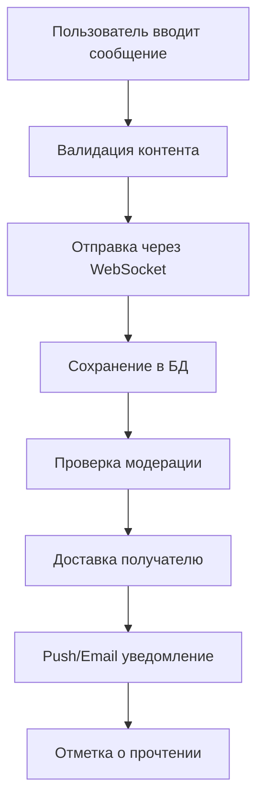
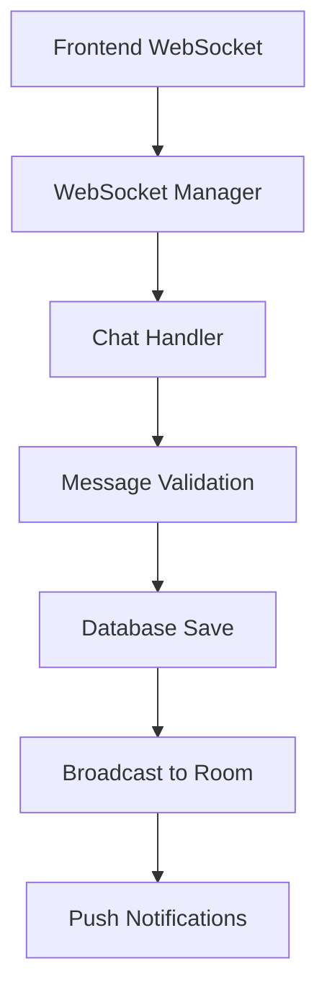

# Паспорт бизнес-процесса: Коммуникация между пользователями

## 🎯 Назначение процесса

Обеспечение безопасного и эффективного общения между покупателями и продавцами на платформе Sve Tu через real-time чат систему с WebSocket, файловыми вложениями, модерацией сообщений и автоматическими уведомлениями.

## 🔄 Схема процесса

### 1. **Инициация чата**
```mermaid
graph LR
    A[Покупатель видит объявление] --> B[Клик "Написать продавцу"]
    B --> C[Проверка авторизации]
    C --> D[Создание/поиск чата]
    D --> E[Открытие ChatWindow]
    E --> F[Установка WebSocket]
```

### 2. **Жизненный цикл сообщения**


### 3. **Real-time архитектура**


## 🏗️ Архитектурные компоненты

### **Frontend компоненты (Chat)**
- **ChatLayout** - контейнер для организации чат-интерфейса
- **ChatList** - список активных чатов с preview
- **ChatWindow** - основное окно чата с сообщениями
- **MessageItem** - компонент отдельного сообщения
- **MessageInput** - поле ввода с emoji и файлами
- **ChatAttachments** - отображение вложенных файлов
- **EmojiPicker** - выбор эмодзи из 240+ вариантов
- **FileUploadProgress** - прогресс загрузки файлов

### **Backend endpoints**
- `GET /chat/conversations` - список чатов пользователя
- `GET /chat/conversations/{id}/messages` - сообщения чата
- `POST /chat/conversations` - создание нового чата
- `POST /chat/messages` - отправка сообщения
- `POST /chat/messages/{id}/read` - отметка о прочтении
- **WebSocket** `/ws/chat` - real-time сообщения

### **База данных**
- `marketplace_chats` - метаданные чатов
- `marketplace_messages` - сообщения пользователей
- `chat_participants` - участники чатов
- `message_attachments` - файловые вложения

### **Внешние сервисы**
- **WebSocket Server** - real-time коммуникация
- **Push Notifications** - уведомления о сообщениях
- **MinIO** - хранение файловых вложений
- **Moderation AI** - автоматическая модерация

## 📋 Детальный flow процесса

### **Этап 1: Инициация чата**
1. **Создание чата при первом контакте**:
   ```go
   func CreateOrGetChat(buyerID, sellerID int, listingID *int) (*models.Chat, error) {
       // Ищем существующий чат между пользователями
       var existingChat models.Chat
       err := db.Where("buyer_id = ? AND seller_id = ?", buyerID, sellerID).
           Where("listing_id = ? OR listing_id IS NULL", listingID).
           First(&existingChat).Error
           
       if err == nil {
           return &existingChat, nil
       }
       
       // Создаем новый чат
       newChat := &models.Chat{
           BuyerID:   buyerID,
           SellerID:  sellerID,
           ListingID: listingID,
           Status:    "active",
           CreatedAt: time.Now(),
       }
       
       err = db.Create(newChat).Error
       return newChat, err
   }
   ```

2. **Подключение к WebSocket комнате**:
   ```typescript
   interface ChatConnection {
     chatId: number;
     userId: number;
     socket: WebSocket;
     isActive: boolean;
   }
   
   const connectToChat = (chatId: number) => {
     const ws = new WebSocket(`${WS_URL}/chat/${chatId}`);
     
     ws.onopen = () => {
       console.log(`Connected to chat ${chatId}`);
       setConnectionStatus('connected');
     };
     
     ws.onmessage = (event) => {
       const message = JSON.parse(event.data);
       handleIncomingMessage(message);
     };
     
     ws.onerror = (error) => {
       console.error('WebSocket error:', error);
       setConnectionStatus('error');
     };
     
     return ws;
   };
   ```

### **Этап 2: Отправка сообщений**
1. **Валидация сообщения на клиенте**:
   ```typescript
   const validateMessage = (content: string, attachments: File[]): string[] => {
     const errors: string[] = [];
     
     if (!content.trim() && attachments.length === 0) {
       errors.push('Сообщение не может быть пустым');
     }
     
     if (content.length > 2000) {
       errors.push('Сообщение слишком длинное (максимум 2000 символов)');
     }
     
     if (attachments.length > 5) {
       errors.push('Максимум 5 файлов за раз');
     }
     
     attachments.forEach(file => {
       if (file.size > 10 * 1024 * 1024) { // 10MB
         errors.push(`Файл ${file.name} слишком большой (максимум 10MB)`);
       }
     });
     
     return errors;
   };
   ```

2. **Отправка через WebSocket**:
   ```typescript
   const sendMessage = async (chatId: number, content: string, attachments?: File[]) => {
     // Загружаем вложения в MinIO
     const uploadedAttachments = [];
     if (attachments?.length) {
       for (const file of attachments) {
         const uploadResult = await uploadFile(file);
         uploadedAttachments.push(uploadResult);
       }
     }
     
     const message = {
       type: 'new_message',
       chat_id: chatId,
       content: content.trim(),
       attachments: uploadedAttachments,
       timestamp: new Date().toISOString(),
     };
     
     // Отправляем через WebSocket
     websocket.send(JSON.stringify(message));
     
     // Optimistic update - сразу показываем в UI
     addMessageToState({
       ...message,
       id: generateTempId(),
       status: 'sending',
     });
   };
   ```

3. **Обработка на backend**:
   ```go
   func HandleNewMessage(ws *websocket.Conn, data map[string]interface{}) {
       userID := getUserIDFromWS(ws)
       chatID := int(data["chat_id"].(float64))
       content := data["content"].(string)
       
       // Проверяем права пользователя на чат
       if !hasAccessToChat(userID, chatID) {
           sendError(ws, "access_denied", "No access to this chat")
           return
       }
       
       // Валидация контента
       if err := validateMessageContent(content); err != nil {
           sendError(ws, "invalid_content", err.Error())
           return
       }
       
       // Создаем сообщение в БД
       message := &models.Message{
           ChatID:    chatID,
           SenderID:  userID,
           Content:   content,
           Type:      "text",
           Status:    "sent",
           CreatedAt: time.Now(),
       }
       
       if err := db.Create(message).Error; err != nil {
           sendError(ws, "database_error", "Failed to save message")
           return
       }
       
       // Обновляем last_message_at в чате
       db.Model(&models.Chat{}).Where("id = ?", chatID).
           Update("last_message_at", time.Now())
       
       // Отправляем всем участникам чата
       broadcastToChat(chatID, map[string]interface{}{
           "type": "message_received",
           "message": message,
       })
       
       // Отправляем push уведомления
       go sendMessageNotifications(message)
   }
   ```

### **Этап 3: Файловые вложения**
1. **Загрузка файлов в MinIO**:
   ```go
   func UploadChatAttachment(file multipart.File, filename string, userID int) (*AttachmentData, error) {
       // Генерация безопасного имени файла
       ext := filepath.Ext(filename)
       safeName := fmt.Sprintf("chat/%d/%s%s", 
           userID, uuid.New().String(), ext)
       
       // Проверка типа файла
       allowedTypes := []string{
           "image/jpeg", "image/png", "image/gif", "image/webp",
           "application/pdf", "text/plain",
           "application/msword", "application/vnd.openxmlformats-officedocument.wordprocessingml.document",
       }
       
       contentType := detectContentType(file)
       if !contains(allowedTypes, contentType) {
           return nil, errors.New("unsupported file type")
       }
       
       // Загрузка в MinIO
       uploadInfo, err := minioClient.PutObject(
           context.Background(),
           "chat-files",
           safeName,
           file,
           -1,
           minio.PutObjectOptions{ContentType: contentType},
       )
       
       if err != nil {
           return nil, err
       }
       
       return &AttachmentData{
           OriginalName: filename,
           StoragePath:  safeName,
           URL:         fmt.Sprintf("%s/chat-files/%s", minioURL, safeName),
           ContentType:  contentType,
           Size:        uploadInfo.Size,
       }, nil
   }
   ```

2. **Предпросмотр файлов**:
   ```typescript
   const FilePreview: React.FC<{attachment: Attachment}> = ({ attachment }) => {
     const isImage = attachment.contentType.startsWith('image/');
     const isPDF = attachment.contentType === 'application/pdf';
     
     if (isImage) {
       return (
         <div className="image-preview">
            openImageModal(attachment.url)}
             className="cursor-pointer max-w-48 max-h-48 rounded"
           />
         </div>
       );
     }
     
     if (isPDF) {
       return (
         <div className="pdf-preview">
           <FileIcon className="w-8 h-8 text-red-500" />
           <span>{attachment.originalName}</span>
           <button onClick={() => window.open(attachment.url, '_blank')}>
             Открыть
           </button>
         </div>
       );
     }
     
     return (
       <div className="file-preview">
         <DocumentIcon className="w-8 h-8 text-gray-500" />
         <span>{attachment.originalName}</span>
         <span className="text-sm text-gray-500">
           {formatFileSize(attachment.size)}
         </span>
       </div>
     );
   };
   ```

### **Этап 4: Уведомления и статусы**
1. **Push уведомления**:
   ```go
   func SendMessageNotifications(message *models.Message) {
       chat := getChatByID(message.ChatID)
       
       // Определяем получателя
       recipientID := chat.BuyerID
       if message.SenderID == chat.BuyerID {
           recipientID = chat.SellerID
       }
       
       recipient := getUserByID(recipientID)
       sender := getUserByID(message.SenderID)
       
       // Проверяем настройки уведомлений
       settings := getNotificationSettings(recipientID)
       
       // Email уведомление
       if settings.EmailEnabled {
           emailData := &EmailData{
               To:       recipient.Email,
               Subject:  fmt.Sprintf("Новое сообщение от %s", sender.Name),
               Template: "new_message.html",
               Data: map[string]interface{}{
                   "SenderName":  sender.Name,
                   "MessageText": truncateMessage(message.Content, 100),
                   "ChatURL":     buildChatURL(message.ChatID),
               },
           }
           sendEmail(emailData)
       }
       
       // Telegram уведомление
       if settings.TelegramEnabled && recipient.TelegramChatID != nil {
           telegramText := fmt.Sprintf(
               "💬 Новое сообщение от %s:\n%s\n\n[Открыть чат](%s)",
               sender.Name,
               truncateMessage(message.Content, 200),
               buildChatURL(message.ChatID),
           )
           sendTelegramMessage(*recipient.TelegramChatID, telegramText)
       }
       
       // Push уведомление (будущее)
       if settings.PushEnabled {
           pushData := &PushNotification{
               UserID:  recipientID,
               Title:   fmt.Sprintf("Сообщение от %s", sender.Name),
               Body:    truncateMessage(message.Content, 50),
               Data:    map[string]string{"chat_id": strconv.Itoa(message.ChatID)},
           }
           sendPushNotification(pushData)
       }
   }
   ```

2. **Статусы сообщений и прочтение**:
   ```go
   // Статусы: sent, delivered, read
   func MarkMessageAsRead(messageID, userID int) error {
       message := getMessageByID(messageID)
       
       // Проверяем, что пользователь - получатель
       if message.SenderID == userID {
           return errors.New("cannot mark own message as read")
       }
       
       // Обновляем статус
       err := db.Model(&models.Message{}).
           Where("id = ?", messageID).
           Update("read_at", time.Now()).Error
           
       if err != nil {
           return err
       }
       
       // Уведомляем отправителя через WebSocket
       broadcastToUser(message.SenderID, map[string]interface{}{
           "type": "message_read",
           "message_id": messageID,
           "read_at": time.Now(),
       })
       
       return nil
   }
   
   // Автоматическая отметка о прочтении при открытии чата
   func MarkChatAsRead(chatID, userID int) error {
       return db.Model(&models.Message{}).
           Where("chat_id = ? AND sender_id != ? AND read_at IS NULL", chatID, userID).
           Update("read_at", time.Now()).Error
   }
   ```

## 🛡️ Модерация и безопасность

### **Автоматическая модерация контента**
```go
func ModerateMessage(content string) (*ModerationResult, error) {
    result := &ModerationResult{
        IsAllowed: true,
        Flags:     []string{},
        Confidence: 0.0,
    }
    
    // Проверка на спам паттерны
    spamPatterns := []string{
        `\+\d{11,}`,           // телефонные номера
        `[a-zA-Z0-9._%+-]+@[a-zA-Z0-9.-]+\.[a-zA-Z]{2,}`, // email
        `(viber|whatsapp|telegram)`,  // внешние мессенджеры
        `(встреч|встретимся|переед)`, // попытки встреч
    }
    
    for _, pattern := range spamPatterns {
        if matched, _ := regexp.MatchString(pattern, strings.ToLower(content)); matched {
            result.Flags = append(result.Flags, "contains_contact_info")
            result.Confidence += 0.3
        }
    }
    
    // Проверка на мат и оскорбления
    offensiveWords := loadOffensiveWordsList()
    for _, word := range offensiveWords {
        if strings.Contains(strings.ToLower(content), word) {
            result.Flags = append(result.Flags, "offensive_language")
            result.Confidence += 0.5
        }
    }
    
    // Проверка на подозрительную активность
    if result.Confidence > 0.7 {
        result.IsAllowed = false
        result.Action = "block"
    } else if result.Confidence > 0.4 {
        result.Action = "review"
    }
    
    return result, nil
}
```

### **Rate limiting для чатов**
```go
const (
    MessagesPerMinute = 20
    MessagesPerHour   = 200
    MaxChatsPerDay    = 50
)

func CheckMessageRateLimit(userID int) error {
    now := time.Now()
    
    // Проверка лимита в минуту
    minuteKey := fmt.Sprintf("msg_rate:%d:%s", userID, now.Format("2006-01-02-15-04"))
    minuteCount, _ := redis.Incr(minuteKey)
    redis.Expire(minuteKey, time.Minute)
    
    if minuteCount > MessagesPerMinute {
        return errors.New("too many messages per minute")
    }
    
    // Проверка лимита в час
    hourKey := fmt.Sprintf("msg_rate:%d:%s", userID, now.Format("2006-01-02-15"))
    hourCount, _ := redis.Incr(hourKey)
    redis.Expire(hourKey, time.Hour)
    
    if hourCount > MessagesPerHour {
        return errors.New("too many messages per hour")
    }
    
    return nil
}
```

### **Блокировка пользователей**
```go
type UserBlock struct {
    ID       int       `json:"id"`
    BlockerID int      `json:"blocker_id"`
    BlockedID int      `json:"blocked_id"`
    Reason   string    `json:"reason"`
    CreatedAt time.Time `json:"created_at"`
}

func BlockUser(blockerID, blockedID int, reason string) error {
    // Проверяем, не заблокирован ли уже
    var existingBlock UserBlock
    err := db.Where("blocker_id = ? AND blocked_id = ?", blockerID, blockedID).
        First(&existingBlock).Error
    
    if err == nil {
        return errors.New("user already blocked")
    }
    
    // Создаем блокировку
    block := &UserBlock{
        BlockerID: blockerID,
        BlockedID: blockedID,
        Reason:    reason,
        CreatedAt: time.Now(),
    }
    
    err = db.Create(block).Error
    if err != nil {
        return err
    }
    
    // Закрываем все активные чаты между пользователями
    db.Model(&models.Chat{}).
        Where("(buyer_id = ? AND seller_id = ?) OR (buyer_id = ? AND seller_id = ?)",
            blockerID, blockedID, blockedID, blockerID).
        Update("status", "blocked")
    
    return nil
}
```

## 📊 Аналитика чатов

### **Метрики коммуникации**
```sql
-- Статистика чатов
SELECT 
    DATE(created_at) as date,
    COUNT(*) as new_chats,
    COUNT(CASE WHEN status = 'active' THEN 1 END) as active_chats,
    AVG(message_count) as avg_messages_per_chat
FROM marketplace_chats
WHERE created_at >= CURRENT_DATE - INTERVAL '30 days'
GROUP BY DATE(created_at)
ORDER BY date;

-- Конверсия чатов в сделки
WITH chat_conversions AS (
    SELECT 
        c.id as chat_id,
        c.listing_id,
        COUNT(m.id) as message_count,
        CASE WHEN l.status = 'sold' THEN 1 ELSE 0 END as converted
    FROM marketplace_chats c
    LEFT JOIN marketplace_messages m ON c.id = m.chat_id
    LEFT JOIN marketplace_listings l ON c.listing_id = l.id
    WHERE c.created_at >= CURRENT_DATE - INTERVAL '30 days'
    GROUP BY c.id, c.listing_id, l.status
)
SELECT 
    CASE 
        WHEN message_count = 0 THEN '0 messages'
        WHEN message_count <= 5 THEN '1-5 messages'
        WHEN message_count <= 10 THEN '6-10 messages'
        ELSE '10+ messages'
    END as message_range,
    COUNT(*) as total_chats,
    SUM(converted) as conversions,
    ROUND(SUM(converted) * 100.0 / COUNT(*), 2) as conversion_rate
FROM chat_conversions
GROUP BY message_range
ORDER BY conversion_rate DESC;
```

### **Анализ времени ответа**
```go
func AnalyzeResponseTimes() {
    type ResponseTimeStats struct {
        UserID           int           `json:"user_id"`
        AvgResponseTime  time.Duration `json:"avg_response_time"`
        MedianResponse   time.Duration `json:"median_response_time"`
        ResponseRate     float64       `json:"response_rate"` // % отвеченных сообщений
    }
    
    query := `
        WITH message_pairs AS (
            SELECT 
                m1.sender_id as sender,
                m2.sender_id as responder,
                m2.created_at - m1.created_at as response_time
            FROM marketplace_messages m1
            JOIN marketplace_messages m2 ON m1.chat_id = m2.chat_id
            WHERE m2.id = (
                SELECT MIN(id) FROM marketplace_messages 
                WHERE chat_id = m1.chat_id 
                AND sender_id != m1.sender_id 
                AND created_at > m1.created_at
            )
            AND m1.created_at >= CURRENT_DATE - INTERVAL '30 days'
        )
        SELECT 
            responder as user_id,
            AVG(response_time) as avg_response_time,
            PERCENTILE_CONT(0.5) WITHIN GROUP (ORDER BY response_time) as median_response_time,
            COUNT(*) as responses,
            (SELECT COUNT(*) FROM marketplace_messages WHERE sender_id = mp.responder) as total_messages
        FROM message_pairs mp
        GROUP BY responder
        HAVING COUNT(*) >= 10
        ORDER BY avg_response_time;
    `
    
    var stats []ResponseTimeStats
    db.Raw(query).Scan(&stats)
    
    // Анализ и рекомендации для медленно отвечающих продавцов
    for _, stat := range stats {
        if stat.AvgResponseTime > 2*time.Hour {
            sendSellerTip(stat.UserID, "response_time_improvement")
        }
    }
}
```

## 🎯 Улучшения UX

### **Smart replies (автопредложения)**
```typescript
const SmartReplies: React.FC<{chatId: number}> = ({ chatId }) => {
  const [suggestions, setSuggestions] = useState<string[]>([]);
  
  const generateSuggestions = (lastMessage: string, userRole: 'buyer' | 'seller') => {
    const buyerSuggestions = [
      "Можно увидеть вживую?",
      "Какое состояние товара?",
      "Есть ли документы?",
      "Торг уместен?",
      "Когда можно забрать?",
    ];
    
    const sellerSuggestions = [
      "Да, конечно! Когда удобно встретиться?",
      "Состояние отличное, все работает",
      "Документы есть, покажу при встрече",
      "Цена указана окончательная",
      "Готов передать в любое время",
    ];
    
    return userRole === 'buyer' ? buyerSuggestions : sellerSuggestions;
  };
  
  return (
    <div className="smart-replies">
      {suggestions.map((suggestion, index) => (
        <button
          key={index}
          className="suggestion-chip"
          onClick={() => sendQuickReply(suggestion)}
        >
          {suggestion}
        </button>
      ))}
    </div>
  );
};
```

### **Typing indicators**
```typescript
const TypingIndicator: React.FC<{chatId: number}> = ({ chatId }) => {
  const [typingUsers, setTypingUsers] = useState<string[]>([]);
  
  useEffect(() => {
    const handleTyping = (data: any) => {
      if (data.type === 'user_typing') {
        setTypingUsers(prev => [...prev.filter(u => u !== data.userName), data.userName]);
        
        // Убираем индикатор через 3 секунды
        setTimeout(() => {
          setTypingUsers(prev => prev.filter(u => u !== data.userName));
        }, 3000);
      }
    };
    
    websocket.addEventListener('message', handleTyping);
    return () => websocket.removeEventListener('message', handleTyping);
  }, []);
  
  if (typingUsers.length === 0) return null;
  
  return (
    <div className="typing-indicator">
      <span>{typingUsers.join(', ')} печатает...</span>
      <div className="typing-dots">
        <span></span><span></span><span></span>
      </div>
    </div>
  );
};

// Отправка typing events
const handleInputChange = useCallback(
  debounce((value: string) => {
    if (value.length > 0) {
      websocket.send(JSON.stringify({
        type: 'typing_start',
        chat_id: chatId,
      }));
    } else {
      websocket.send(JSON.stringify({
        type: 'typing_stop',
        chat_id: chatId,
      }));
    }
  }, 500),
  [chatId]
);
```

### **Сохранение drafts**
```typescript
const useChatDraft = (chatId: number) => {
  const [draft, setDraft] = useState('');
  
  // Загружаем сохраненный draft при открытии чата
  useEffect(() => {
    const savedDraft = localStorage.getItem(`chat_draft_${chatId}`);
    if (savedDraft) {
      setDraft(savedDraft);
    }
  }, [chatId]);
  
  // Автосохранение draft при изменении
  useEffect(() => {
    const saveDraft = debounce((content: string) => {
      if (content.trim()) {
        localStorage.setItem(`chat_draft_${chatId}`, content);
      } else {
        localStorage.removeItem(`chat_draft_${chatId}`);
      }
    }, 1000);
    
    saveDraft(draft);
  }, [draft, chatId]);
  
  const clearDraft = () => {
    setDraft('');
    localStorage.removeItem(`chat_draft_${chatId}`);
  };
  
  return { draft, setDraft, clearDraft };
};
```

## ❌ Обработка ошибок

### **WebSocket переподключение**
```typescript
class ChatWebSocketManager {
  private ws: WebSocket | null = null;
  private reconnectAttempts = 0;
  private maxReconnectAttempts = 5;
  private reconnectDelay = 1000;
  
  connect(chatId: number) {
    try {
      this.ws = new WebSocket(`${WS_URL}/chat/${chatId}`);
      
      this.ws.onopen = () => {
        console.log('WebSocket connected');
        this.reconnectAttempts = 0;
        this.reconnectDelay = 1000;
      };
      
      this.ws.onclose = (event) => {
        console.log('WebSocket disconnected:', event.code);
        this.handleReconnect(chatId);
      };
      
      this.ws.onerror = (error) => {
        console.error('WebSocket error:', error);
      };
      
    } catch (error) {
      console.error('Failed to connect WebSocket:', error);
      this.handleReconnect(chatId);
    }
  }
  
  private handleReconnect(chatId: number) {
    if (this.reconnectAttempts < this.maxReconnectAttempts) {
      setTimeout(() => {
        console.log(`Reconnecting... attempt ${this.reconnectAttempts + 1}`);
        this.reconnectAttempts++;
        this.reconnectDelay *= 2; // Exponential backoff
        this.connect(chatId);
      }, this.reconnectDelay);
    } else {
      console.error('Max reconnection attempts reached');
      // Fallback to polling for new messages
      this.startPollingFallback(chatId);
    }
  }
  
  private startPollingFallback(chatId: number) {
    // Fallback: polling каждые 5 секунд
    const interval = setInterval(async () => {
      try {
        const newMessages = await api.get(`/chat/${chatId}/messages/new`);
        if (newMessages.length > 0) {
          newMessages.forEach(handleIncomingMessage);
        }
      } catch (error) {
        console.error('Polling failed:', error);
      }
    }, 5000);
    
    // Останавливаем polling при восстановлении соединения
    this.ws?.addEventListener('open', () => {
      clearInterval(interval);
    });
  }
}
```

### **Обработка failed сообщений**
```typescript
interface Message {
  id: string;
  content: string;
  status: 'sending' | 'sent' | 'failed';
  retryCount?: number;
}

const retryFailedMessage = async (message: Message) => {
  if (message.retryCount && message.retryCount >= 3) {
    // Больше не пытаемся отправить
    updateMessageStatus(message.id, 'failed');
    return;
  }
  
  try {
    await sendMessage(message.content);
    updateMessageStatus(message.id, 'sent');
  } catch (error) {
    const retryCount = (message.retryCount || 0) + 1;
    updateMessageStatus(message.id, 'failed', retryCount);
    
    // Повторная попытка через exponential backoff
    setTimeout(() => {
      retryFailedMessage({ ...message, retryCount });
    }, Math.pow(2, retryCount) * 1000);
  }
};
```

## 🧪 Тестирование

### **WebSocket тесты**
```go
func TestChatWebSocket(t *testing.T) {
    // Создаем тестовый сервер
    server := httptest.NewServer(setupChatWebSocketHandler())
    defer server.Close()
    
    // Подключаемся как покупатель
    buyerWS, _, err := websocket.DefaultDialer.Dial(
        "ws" + server.URL[4:] + "/chat/1?user_id=1", nil)
    assert.NoError(t, err)
    defer buyerWS.Close()
    
    // Подключаемся как продавец
    sellerWS, _, err := websocket.DefaultDialer.Dial(
        "ws" + server.URL[4:] + "/chat/1?user_id=2", nil)
    assert.NoError(t, err)
    defer sellerWS.Close()
    
    // Отправляем сообщение от покупателя
    message := map[string]interface{}{
        "type": "new_message",
        "chat_id": 1,
        "content": "Hello, seller!",
    }
    
    err = buyerWS.WriteJSON(message)
    assert.NoError(t, err)
    
    // Проверяем получение продавцом
    var received map[string]interface{}
    err = sellerWS.ReadJSON(&received)
    assert.NoError(t, err)
    assert.Equal(t, "message_received", received["type"])
    assert.Equal(t, "Hello, seller!", received["message"].(map[string]interface{})["content"])
}
```

### **E2E тесты чата**
```typescript
// Playwright тест полного chat flow
test('Chat conversation flow', async ({ page, context }) => {
  // Открываем две вкладки - покупатель и продавец
  const buyerPage = page;
  const sellerPage = await context.newPage();
  
  // Покупатель заходит на объявление
  await buyerPage.goto('/listing/123');
  await buyerPage.click('[data-testid="contact-seller"]');
  
  // Продавец открывает чаты
  await sellerPage.goto('/chat');
  
  // Покупатель отправляет сообщение
  await buyerPage.fill('[data-testid="message-input"]', 'Интересует ваш товар');
  await buyerPage.click('[data-testid="send-message"]');
  
  // Проверяем получение продавцом
  await sellerPage.waitForSelector('[data-testid="new-message"]');
  const messageText = await sellerPage.textContent('[data-testid="message-content"]');
  expect(messageText).toBe('Интересует ваш товар');
  
  // Продавец отвечает
  await sellerPage.fill('[data-testid="message-input"]', 'Здравствуйте! Готов показать');
  await sellerPage.click('[data-testid="send-message"]');
  
  // Покупатель видит ответ
  await buyerPage.waitForSelector('[data-testid="new-message"]');
  const responseText = await buyerPage.textContent('[data-testid="message-content"]:last-child');
  expect(responseText).toBe('Здравствуйте! Готов показать');
});
```

## 📚 Связанные процессы

1. **Поиск и фильтрация** - инициация чата после находки товара
2. **Публикация объявлений** - создание чатов для новых объявлений
3. **Уведомления** - email/Telegram/push о новых сообщениях
4. **Платежные процессы** - обсуждение способов оплаты
5. **Модерация контента** - проверка сообщений на соответствие правилам
6. **Аналитика** - трекинг эффективности коммуникации
7. **Мобильные приложения** - push уведомления в реальном времени

## 📖 Документация

### **API Reference**
- `GET /chat/conversations` - список чатов пользователя
- `POST /chat/conversations` - создание нового чата
- `GET /chat/conversations/{id}/messages` - история сообщений
- `POST /chat/messages` - отправка сообщения
- **WebSocket** `/ws/chat/{id}` - real-time коммуникация

### **Frontend компоненты**
- `ChatLayout.md` - основной контейнер чат-системы
- `ChatWindow.md` - окно активного чата
- `MessageItem.md` - компонент сообщения
- `EmojiPicker.md` - выбор эмодзи

### **WebSocket события**
- `new_message` - отправка нового сообщения
- `message_received` - получение сообщения
- `typing_start/stop` - индикаторы печати
- `user_online/offline` - статус пользователя
- `message_read` - отметка о прочтении