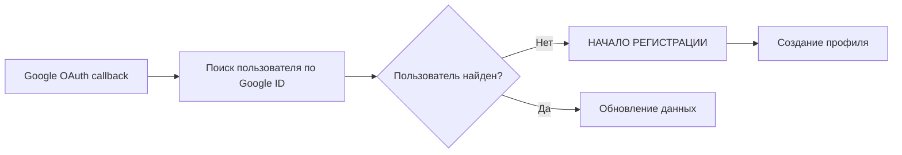
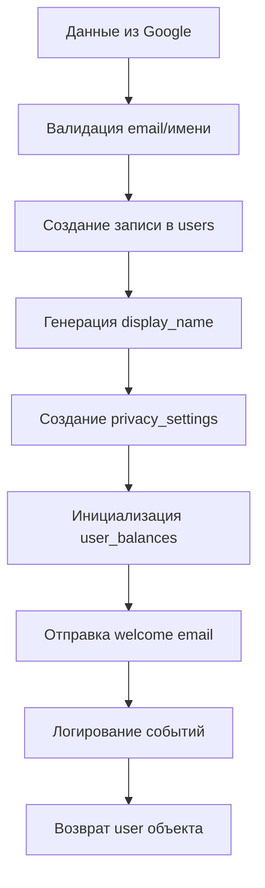
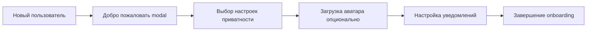

# Паспорт бизнес-процесса: Регистрация пользователей

## 🎯 Назначение процесса

Автоматическое создание профилей пользователей при первом входе через Google OAuth, настройка базовых параметров аккаунта, инициализация пользовательских данных и интеграция с системами уведомлений.

## 🔄 Схема процесса

### 1. **Триггер регистрации**


### 2. **Процесс создания профиля**


### 3. **Первичная настройка**


## 🏗️ Архитектурные компоненты

### **Frontend компоненты**
- **RegisterForm** - форма дополнительных данных (если нужно)
- **WelcomeModal** - приветственное окно для новых пользователей
- **PrivacySettingsStep** - настройка приватности при регистрации
- **AuthStateManager** - управление состоянием нового пользователя

### **Backend handlers**
- `/auth/google/callback` - создание пользователя в процессе OAuth
- `/users/profile` - обновление профиля после регистрации
- `/users/privacy` - настройка приватности
- `/notifications/welcome` - отправка приветственных уведомлений

### **База данных**
- `users` - основная информация профиля
- `user_privacy_settings` - настройки приватности
- `user_balances` - инициализация финансового профиля
- `notification_settings` - настройки уведомлений

### **Сервисы**
- Email service - отправка welcome писем
- Avatar service - обработка загруженных изображений
- Analytics service - трекинг новых регистраций

## 📋 Детальный flow процесса

### **Этап 1: Обнаружение нового пользователя**
1. В процессе OAuth callback проверяется существование пользователя:
   ```go
   user, err := userRepo.GetByGoogleID(googleProfile.ID)
   if err == pgx.ErrNoRows {
       // Начинаем процесс регистрации
       isNewUser = true
   }
   ```

2. Если пользователь не найден, извлекаются данные из Google профиля:
   ```json
   {
     "id": "google_user_id",
     "email": "user@gmail.com", 
     "name": "John Doe",
     "picture": "https://lh3.googleusercontent.com/...",
     "verified_email": true
   }
   ```

### **Этап 2: Создание записи пользователя**
1. **Валидация данных**:
   - Email уникальность
   - Корректность имени (фильтрация спецсимволов)
   - Доступность Google аватара

2. **Создание основной записи**:
   ```go
   user := &models.User{
       GoogleID:     googleProfile.ID,
       Email:        googleProfile.Email,
       Name:         googleProfile.Name,
       AvatarURL:    googleProfile.Picture,
       DisplayName:  generateDisplayName(googleProfile.Name),
       IsVerified:   true, // Email уже верифицирован Google
       CreatedAt:    time.Now(),
       UpdatedAt:    time.Now(),
   }
   ```

3. **Генерация уникального display_name**:
   ```go
   // "John Doe" -> "john.doe.123" если john.doe занят
   displayName := strings.ToLower(
       strings.ReplaceAll(googleProfile.Name, " ", "."),
   )
   if exists := checkDisplayNameExists(displayName); exists {
       displayName += "." + generateRandomSuffix()
   }
   ```

### **Этап 3: Инициализация связанных данных**
1. **Privacy Settings** (по умолчанию приватные):
   ```go
   privacySettings := &models.UserPrivacySettings{
       UserID:           user.ID,
       ShowEmail:        false,
       ShowPhone:        false,
       ShowLastSeen:     false,
       AllowDirectMessages: true,
       ShowOnlineStatus: false,
   }
   ```

2. **User Balances** (стартовые балансы):
   ```go
   balance := &models.UserBalance{
       UserID:       user.ID,
       AvailableRSD: decimal.Zero,
       EscrowRSD:    decimal.Zero,
       TotalEarnedRSD: decimal.Zero,
   }
   ```

3. **Notification Settings** (все включены по умолчанию):
   ```go
   notificationSettings := &models.NotificationSettings{
       UserID:      user.ID,
       EmailEnabled: true,
       TelegramEnabled: false, // до подключения Telegram
       InAppEnabled: true,
   }
   ```

### **Этап 4: Welcome процедуры**
1. **Отправка приветственного email**:
   ```html
   Subject: Добро пожаловать в Sve Tu! 🎉
   
   Привет {{.Name}}!
   
   Спасибо за регистрацию в Sve Tu Platform.
   Теперь вы можете:
   - Размещать объявления
   - Покупать товары безопасно
   - Создавать свою витрину
   ```

2. **Создание записи в аналитике**:
   ```go
   analytics.TrackEvent("user_registered", map[string]interface{}{
       "user_id": user.ID,
       "source": "google_oauth",
       "timestamp": time.Now(),
   })
   ```

## 🎨 Frontend onboarding

### **Welcome Modal для новых пользователей**
После успешной регистрации показывается модальное окно:

```typescript
interface WelcomeModalProps {
  isNewUser: boolean;
  user: User;
  onComplete: () => void;
}

// Содержит:
// 1. Приветствие по имени
// 2. Краткое описание возможностей платформы  
// 3. Опциональную настройку приватности
// 4. Ссылку на создание первого объявления
```

### **Первые шаги для пользователя**
1. **Настройка профиля** (опционально):
   - Загрузка собственного аватара
   - Добавление описания профиля
   - Указание города/региона

2. **Настройка приватности**:
   - Кто может видеть email
   - Разрешение прямых сообщений
   - Показ статуса "онлайн"

3. **Уведомления**:
   - Email уведомления о сообщениях
   - Подключение Telegram бота
   - Push уведомления (будущее)

## 📊 Типы пользователей при регистрации

### **Обычный покупатель**
- Базовые настройки приватности
- Фокус на поиске товаров
- Простая настройка уведомлений

### **Потенциальный продавец**
- Более открытые настройки приватности
- Подсказки о создании первого объявления
- Welcome email с гидом по продажам

### **Будущий владелец витрины**
- Сбор дополнительной информации (тип бизнеса)
- Приглашение в business программу
- Специальные welcome материалы

## 🔐 Безопасность и валидация

### **Защита от spam-регистраций**
```go
// Rate limiting на уровне IP
const maxRegistrationsPerIP = 5
const timeWindow = time.Hour

// Проверка домена email
allowedDomains := []string{"gmail.com", "yahoo.com", "outlook.com"}
if !isAllowedEmailDomain(user.Email) {
    return errors.New("email domain not allowed")
}
```

### **Валидация данных Google**
```go
// Проверка обязательных полей
if googleProfile.Email == "" || googleProfile.ID == "" {
    return errors.New("incomplete google profile")
}

// Проверка верификации email в Google
if !googleProfile.EmailVerified {
    return errors.New("google email not verified")
}
```

### **Предотвращение дублирования**
```go
// Проверка по Google ID
existingUser := userRepo.GetByGoogleID(googleProfile.ID)

// Проверка по email (на случай смены Google ID)
existingByEmail := userRepo.GetByEmail(googleProfile.Email)

if existingByEmail != nil && existingByEmail.GoogleID != googleProfile.ID {
    // Обновляем GoogleID у существующего пользователя
    userRepo.UpdateGoogleID(existingByEmail.ID, googleProfile.ID)
}
```

## 📈 Аналитика и метрики

### **Ключевые метрики регистрации**
1. **Conversion rate**: завершенные регистрации / начатые OAuth flows
2. **Time to first action**: время от регистрации до первого объявления
3. **Onboarding completion**: процент прошедших welcome steps
4. **Profile completion**: заполненность профилей новых пользователей

### **Когорты пользователей**
```sql
-- Дневные регистрации
SELECT DATE(created_at) as date, COUNT(*) as new_users
FROM users 
WHERE created_at >= CURRENT_DATE - INTERVAL '30 days'
GROUP BY DATE(created_at);

-- Источники регистрации
SELECT 
  CASE 
    WHEN referrer LIKE '%google%' THEN 'google'
    WHEN referrer IS NULL THEN 'direct'
    ELSE 'other'
  END as source,
  COUNT(*) as registrations
FROM users
GROUP BY source;
```

### **Retention tracking**
```go
// Трекинг активности новых пользователей
type UserActivity struct {
    UserID      int
    Day1Active  bool // активность в первый день
    Day7Active  bool // активность через неделю
    Day30Active bool // активность через месяц
}
```

## 🌐 Интеграции

### **Email Service**
```go
// Welcome email template
emailTemplate := &EmailTemplate{
    Subject: "Добро пожаловать в Sve Tu! 🎉",
    Template: "welcome_user.html",
    Data: map[string]interface{}{
        "UserName": user.Name,
        "PlatformFeatures": []string{
            "Безопасные покупки",
            "Создание объявлений", 
            "Прямое общение с продавцами",
        },
    },
}
```

### **Avatar Processing**
```go
// Загрузка и оптимизация Google аватара
avatarURL := processGoogleAvatar(googleProfile.Picture)

// Создание thumbnails разных размеров
thumbnails := []string{
    createThumbnail(avatarURL, "32x32"),
    createThumbnail(avatarURL, "64x64"), 
    createThumbnail(avatarURL, "128x128"),
}
```

### **Analytics Integration**
```typescript
// Frontend tracking
analytics.track('User Registered', {
  userId: user.id,
  email: user.email,
  source: 'google_oauth',
  timestamp: new Date(),
  properties: {
    hasAvatar: !!user.avatarUrl,
    completedWelcome: false,
  }
});
```

## ❌ Обработка ошибок

### **Типичные ошибки при регистрации**
1. **Email уже существует**:
   ```json
   {
     "success": false,
     "error": "registration.emailExists",
     "message": "User with this email already exists"
   }
   ```

2. **Недоступен Google профиль**:
   ```json
   {
     "success": false, 
     "error": "registration.invalidGoogleProfile",
     "message": "Unable to fetch Google profile data"
   }
   ```

3. **Database ошибки**:
   ```json
   {
     "success": false,
     "error": "registration.databaseError", 
     "message": "Failed to create user profile"
   }
   ```

### **Rollback стратегия**
```go
func registerUser(googleProfile *GoogleProfile) error {
    tx, err := db.Begin()
    if err != nil {
        return err
    }
    defer tx.Rollback()

    // 1. Создание пользователя
    user, err := createUserInTx(tx, googleProfile)
    if err != nil {
        return err
    }

    // 2. Создание privacy settings
    err = createPrivacySettingsInTx(tx, user.ID)
    if err != nil {
        return err
    }

    // 3. Создание balance
    err = createUserBalanceInTx(tx, user.ID)
    if err != nil {
        return err
    }

    return tx.Commit()
}
```

## 🧪 Тестирование

### **Unit тесты**
```go
func TestUserRegistration(t *testing.T) {
    googleProfile := &GoogleProfile{
        ID:            "google123",
        Email:         "test@gmail.com",
        Name:          "Test User",
        Picture:       "https://avatar.url",
        EmailVerified: true,
    }
    
    user, err := registerUser(googleProfile)
    assert.NoError(t, err)
    assert.Equal(t, googleProfile.Email, user.Email)
    assert.True(t, user.IsVerified)
}
```

### **Integration тесты**
- Полный OAuth + registration flow
- Welcome email отправка
- Privacy settings создание
- Analytics events трекинг

### **E2E тесты**
- Регистрация через Google OAuth
- Welcome modal отображение
- Profile completion flow
- First listing creation

## 🚀 Производительность

### **Оптимизации**
- **Batch inserts**: создание связанных записей одним запросом
- **Avatar caching**: кеширование Google аватаров в MinIO
- **Welcome email queue**: асинхронная отправка email'ов

### **Database оптимизации**
```sql
-- Индексы для быстрого поиска
CREATE INDEX idx_users_google_id ON users(google_id);
CREATE INDEX idx_users_email ON users(email);
CREATE INDEX idx_users_created_at ON users(created_at);

-- Партиционирование для analytics
CREATE TABLE user_registrations_2024 PARTITION OF user_registrations
FOR VALUES FROM ('2024-01-01') TO ('2025-01-01');
```

## 📚 Связанные процессы

1. **Аутентификация и авторизация** - вызывает регистрацию при новом пользователе
2. **Настройка профиля** - следующий шаг после регистрации
3. **Настройки приватности** - часть onboarding процесса
4. **Создание первого объявления** - typical next action
5. **Email уведомления** - welcome series для новых пользователей
6. **Подключение Telegram** - дополнительный канал уведомлений

## 🎛️ A/B тестирование

### **Варианты onboarding'а**
- **Minimal**: только приветствие, без дополнительных шагов
- **Standard**: welcome modal + privacy settings
- **Complete**: полный guided tour по функциям платформы

### **Welcome email variations**
- **Short**: краткое приветствие с основными ссылками
- **Detailed**: подробный гид по платформе
- **Video**: email с welcome видео

## 📖 Документация

### **API Reference**
- `POST /auth/google/callback` - создание пользователя в OAuth flow
- `GET /users/profile` - получение данных профиля
- `PUT /users/privacy` - обновление настроек приватности

### **Frontend компоненты**
- `RegisterForm.md` - форма дополнительных данных
- `WelcomeModal.md` - приветственное окно
- `AuthStateManager.md` - управление состоянием

### **Database схемы**
- `users.md` - структура пользователей
- `user_privacy_settings.md` - настройки приватности
- `user_balances.md` - финансовые данные