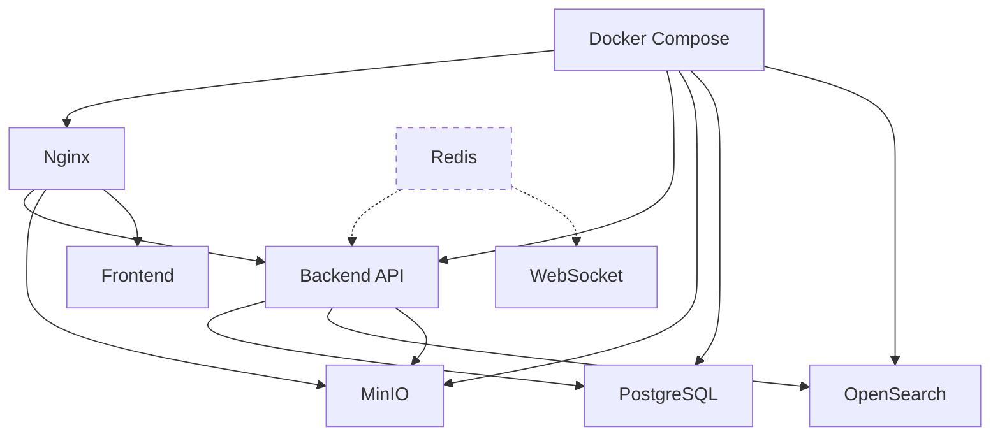

# 📋 Инфраструктурные компоненты - Индекс паспортов

## 🎯 Обзор
Инфраструктурные компоненты обеспечивают основу для работы всей платформы Sve Tu - от базы данных и поиска до кеширования и контейнеризации.

## 📊 Статус: ✅ ЗАВЕРШЕНО (8/8 компонентов - 100%)

---

## 🔍 Поисковая система

### [OpenSearch Marketplace Index](opensearch-marketplace-index.md)
**Назначение:** Полнотекстовый поиск объявлений с мультиязычностью  
**Статус:** ✅ Активный  
**Ключевые особенности:**
- Индекс `marketplace` с мультиязычными анализаторами (SR/RU/EN)
- Nested атрибуты для сложной фильтрации
- Геопоиск с координатами
- Автодополнение и подсказки

### [OpenSearch Mappings и настройки](opensearch-mappings-settings.md)
**Назначение:** Схемы данных и настройки анализаторов  
**Статус:** ✅ Активный  
**Ключевые особенности:**
- 3 индекса: marketplace, storefront_products, storefronts
- Языковые анализаторы с стеммингом
- Edge n-gram для автодополнения
- Nested поля для атрибутов

---

## 💾 Хранилище файлов

### [MinIO Buckets](minio-buckets.md)
**Назначение:** S3-совместимое объектное хранилище  
**Статус:** ✅ Активный  
**Ключевые особенности:**
- 3 bucket: `listings`, `chat-files`, `review-photos`
- Автоматическая организация по датам
- Валидация типов и размеров файлов
- Публичное чтение, аутентифицированная запись

### [MinIO Policies и структуры](minio-policies-structures.md)
**Назначение:** Политики безопасности и управление доступом  
**Статус:** ✅ Активный  
**Ключевые особенности:**
- IAM политики для bucket доступа
- Presigned URLs для временного доступа
- CORS конфигурация для веб-интеграции
- Nginx проксирование файлов

---

## 🌐 Веб-сервер и прокси

### [Nginx Configuration](nginx-configuration.md)
**Назначение:** Reverse proxy и веб-сервер  
**Статус:** ✅ Активный  
**Ключевые особенности:**
- 6 доменов: svetu.rs, mail.svetu.rs, autodiscover, autoconfig, gis, klimagrad
- SSL терминация с Let's Encrypt
- WebSocket поддержка для чатов
- Проксирование API и MinIO

---

## 🐳 Контейнеризация

### [Docker Compose Setup](docker-compose-setup.md)
**Назначение:** Оркестрация контейнеров  
**Статус:** ✅ Активный  
**Ключевые особенности:**
- Development и Production конфигурации
- Harbor private registry для production
- Health checks и restart policies
- Полная почтовая система в production

---

## 💨 Кеширование (планируется)

### [Redis Configuration](redis-configuration.md)
**Назначение:** In-memory кеширование и session storage  
**Статус:** ❌ НЕ ИСПОЛЬЗУЕТСЯ (планируется)  
**Ключевые особенности:**
- Session management вместо sync.Map
- API response caching
- Rate limiting
- Pub/Sub для real-time уведомлений

---

## 🗄️ База данных

### [PostgreSQL Configuration](postgresql-configuration.md)
**Назначение:** Основная реляционная база данных  
**Статус:** ✅ Активный  
**Ключевые особенности:**
- 20+ основных таблиц
- Система миграций (62 файла)
- JSONB для гибких схем
- Материализованные представления для агрегации

---

## 🔗 Связи между компонентами

## 📈 Производительность и масштабирование

### Текущая архитектура
- **База данных:** PostgreSQL 15 с connection pooling
- **Поиск:** OpenSearch с мультиязычными индексами
- **Файлы:** MinIO с Nginx кешированием (7 дней)
- **SSL:** Let's Encrypt с автообновлением
- **Контейнеры:** Docker с health checks

### Планируемые улучшения
- **Redis кеширование** для session и API responses
- **PostgreSQL read replicas** для масштабирования чтения
- **OpenSearch кластер** для высокой доступности
- **CDN интеграция** для статических файлов

## 🛡️ Безопасность

### Реализованные меры
- **SSL/TLS** для всех доменов
- **Публичные bucket политики** только для чтения
- **Nginx rate limiting** (планируется)
- **Health checks** для всех сервисов

### Рекомендуемые улучшения
- **WAF** (Web Application Firewall)
- **Secrets management** для паролей
- **Network policies** в Docker
- **Backup encryption** для PostgreSQL

## 🔧 Операционные задачи

### Мониторинг
- Health checks во всех Docker сервисах
- Nginx access logs (отключены в production)
- PostgreSQL pg_ready проверки

### Резервное копирование
- **PostgreSQL:** Ручные скрипты сброса/восстановления
- **MinIO:** Файлы в Docker volumes
- **OpenSearch:** Индексы в bind mounts

### Рекомендации
- Автоматизированные backup процедуры
- Prometheus + Grafana мониторинг
- Централизованное логирование
- Disaster recovery план

---

**Дата обновления:** 2025-06-29  
**Статус фазы:** ✅ ЗАВЕРШЕНА  
**Следующая фаза:** Бизнес-процессы